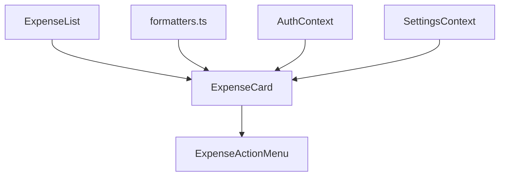
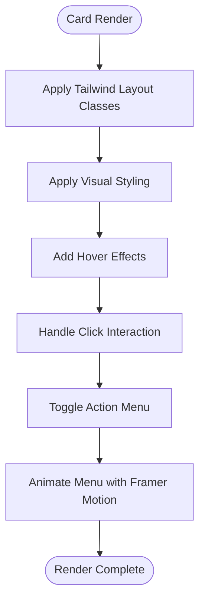
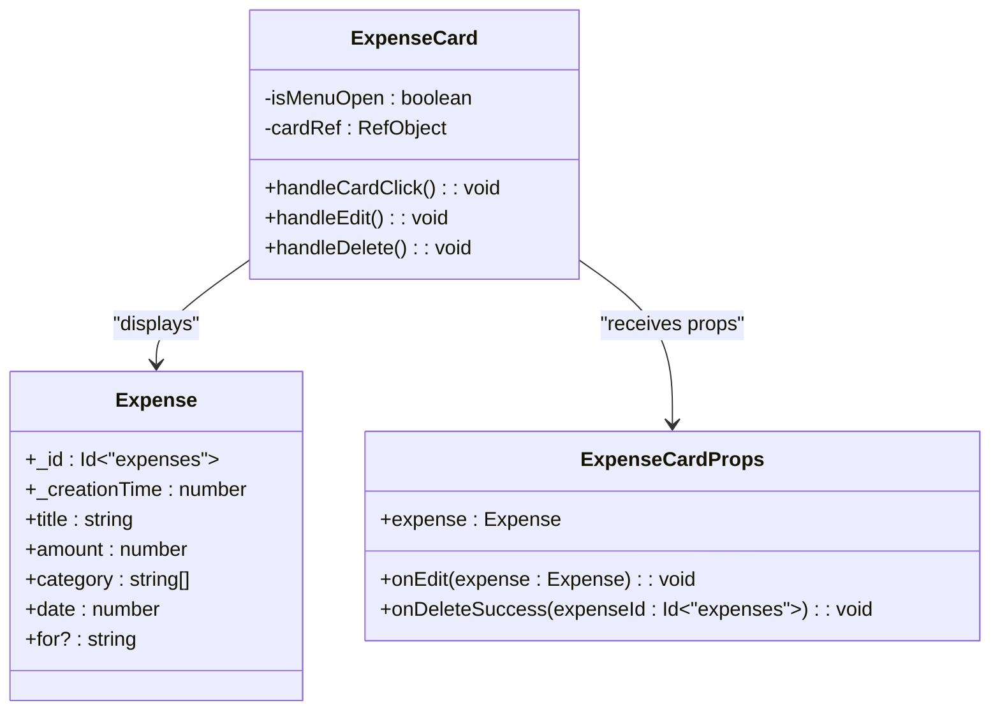
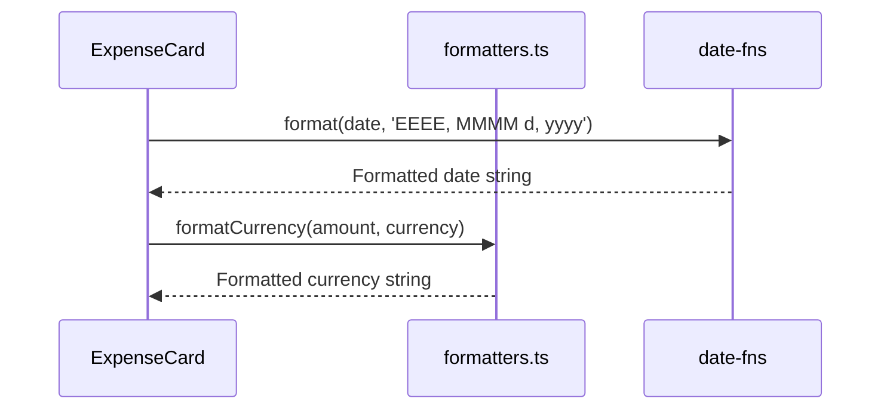
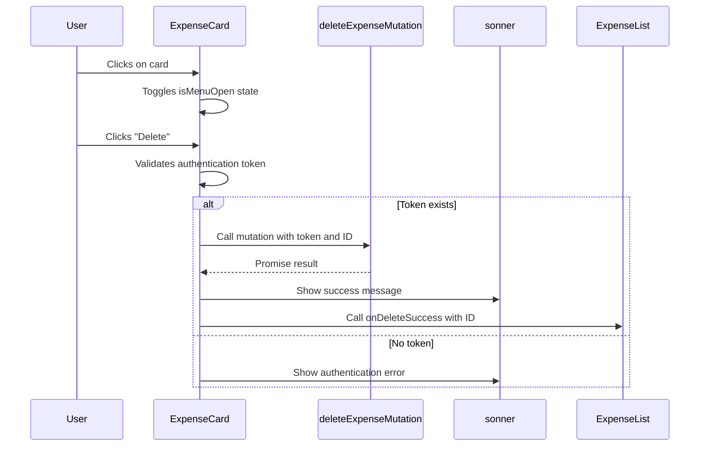
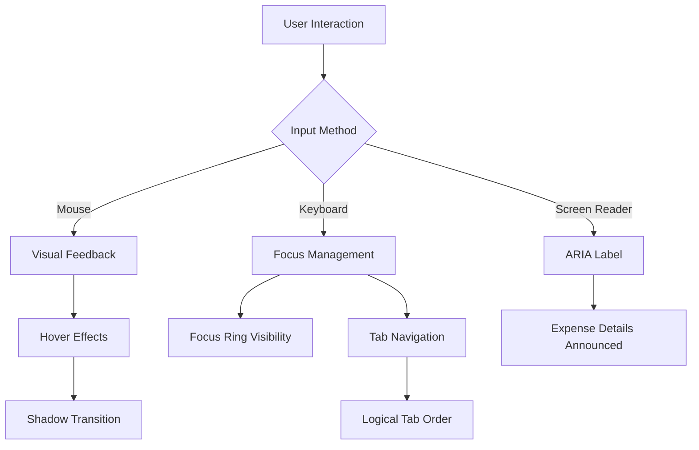
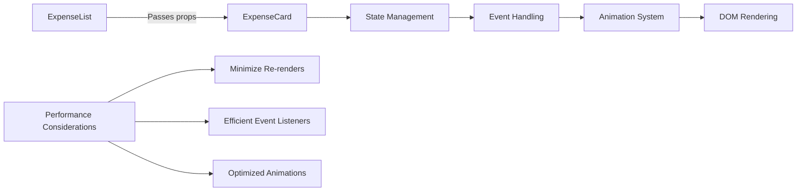
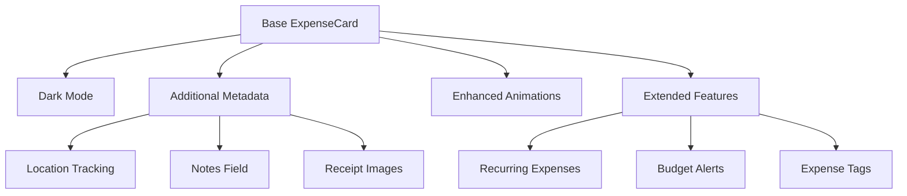
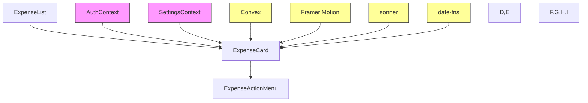

# Expense Card

<cite>
**Referenced Files in This Document**   
- [ExpenseCard.tsx](file://src/features/dashboard/components/Expenses/ExpenseCard.tsx#L1-L110)
- [ExpenseCard.tsx](file://src/components/cards/ExpenseCard.tsx#L1-L115)
- [ExpenseList.tsx](file://src/features/dashboard/components/Expenses/ExpenseList.tsx#L1-L37)
- [ExpenseActionMenu.tsx](file://src/features/dashboard/components/Expenses/ExpenseActionMenu.tsx#L1-L37)
- [formatters.ts](file://src/lib/formatters.ts#L1-L48)
- [expense.ts](file://src/features/dashboard/types/expense.ts#L1-L20)
- [globals.css](file://src/app/globals.css#L1-L27)
</cite>

## Table of Contents
1. [Introduction](#introduction)
2. [Component Overview](#component-overview)
3. [Visual Design and Layout](#visual-design-and-layout)
4. [Data Structure and Prop Interface](#data-structure-and-prop-interface)
5. [Data Formatting and Localization](#data-formatting-and-localization)
6. [Interaction and Action Handling](#interaction-and-action-handling)
7. [Accessibility Features](#accessibility-features)
8. [Performance Optimization](#performance-optimization)
9. [Extensibility and Customization](#extensibility-and-customization)
10. [Architecture and Integration](#architecture-and-integration)

## Introduction
The ExpenseCard component is a key UI element in the expense tracking application, designed to display individual expense records in a clean, interactive card format. It serves as a visual representation of financial transactions, showing essential details such as amount, title, category, date, and associated card information. The component is implemented in two variations within the codebase, with the primary version located in the dashboard features directory. This documentation provides a comprehensive analysis of its implementation, functionality, design principles, and integration patterns.

**Section sources**
- [ExpenseCard.tsx](file://src/features/dashboard/components/Expenses/ExpenseCard.tsx#L1-L110)
- [ExpenseCard.tsx](file://src/components/cards/ExpenseCard.tsx#L1-L115)

## Component Overview
The ExpenseCard component renders a single expense entry with interactive capabilities. It displays core financial data in a structured layout and provides action options through a context menu. Two implementations exist in the codebase:

1. **Primary Implementation**: Located at `src/features/dashboard/components/Expenses/ExpenseCard.tsx`, this version is used within the dashboard context and receives data from ExpenseList.
2. **Secondary Implementation**: Located at `src/components/cards/ExpenseCard.tsx`, this version includes additional card name display and uses different formatting logic.

The primary implementation is the main focus of this documentation due to its integration with the dashboard's data flow and state management system.



**Diagram sources**
- [ExpenseCard.tsx](file://src/features/dashboard/components/Expenses/ExpenseCard.tsx#L1-L110)
- [ExpenseList.tsx](file://src/features/dashboard/components/Expenses/ExpenseList.tsx#L1-L37)

**Section sources**
- [ExpenseCard.tsx](file://src/features/dashboard/components/Expenses/ExpenseCard.tsx#L1-L110)
- [ExpenseCard.tsx](file://src/components/cards/ExpenseCard.tsx#L1-L115)

## Visual Design and Layout
The ExpenseCard employs Tailwind CSS for styling, creating a responsive and visually appealing design with proper spacing, typography, and interactive states.

### Layout Structure
The component uses a flexbox-based layout with the following structure:
- **Outer Container**: A relative positioned div that contains the card and action menu
- **Card Body**: A white background with rounded corners, subtle shadow, and padding
- **Content Sections**: Two main sections - top (title and amount) and bottom (category and date)

### Responsive Design
The card adapts to different screen sizes through Tailwind's responsive utilities:
- Uses `flex` and `grid` utilities for content alignment
- Implements responsive text sizing with `text-sm`, `text-md` classes
- Maintains consistent spacing with `p-4`, `mb-2`, `mt-1` padding/margin classes

### Interactive States
The component provides visual feedback through:
- **Hover State**: Transitions from `shadow-sm` to `hover:shadow-md`
- **Focus State**: Accessible through keyboard navigation with default browser focus styles
- **Active State**: Visualized through the action menu animation when clicked



**Diagram sources**
- [ExpenseCard.tsx](file://src/features/dashboard/components/Expenses/ExpenseCard.tsx#L1-L110)
- [globals.css](file://src/app/globals.css#L1-L27)

**Section sources**
- [ExpenseCard.tsx](file://src/features/dashboard/components/Expenses/ExpenseCard.tsx#L1-L110)

## Data Structure and Prop Interface
The ExpenseCard component relies on a well-defined data structure and prop interface to receive and display expense information.

### Expense Interface
The component uses the following TypeScript interface to define the expense data structure:

```typescript
export interface Expense {
  _id: Id<"expenses">;
  _creationTime: number;
  title: string;
  amount: number;
  category: string[];
  date: number;
  for?: string;
}
```

### Prop Interface
The component accepts the following props:

```typescript
interface ExpenseCardProps {
  expense: Expense;
  onEdit: (expense: Expense) => void;
  onDeleteSuccess: (expenseId: Id<"expenses">) => void;
}
```

**Key Prop Details**:
- **expense**: The expense object containing all data to display
- **onEdit**: Callback function triggered when edit action is selected
- **onDeleteSuccess**: Callback to notify parent component of successful deletion

The component also utilizes React hooks for state management:
- `useState` for managing menu open/close state
- `useRef` for referencing the card element (used in click-outside detection)
- `useEffect` for adding/removing document event listeners



**Diagram sources**
- [ExpenseCard.tsx](file://src/features/dashboard/components/Expenses/ExpenseCard.tsx#L1-L110)
- [expense.ts](file://src/features/dashboard/types/expense.ts#L1-L20)

**Section sources**
- [ExpenseCard.tsx](file://src/features/dashboard/components/Expenses/ExpenseCard.tsx#L1-L110)
- [expense.ts](file://src/features/dashboard/types/expense.ts#L1-L20)

## Data Formatting and Localization
The ExpenseCard component formats data for display using utility functions and supports localization features.

### Date Formatting
The component uses `date-fns` to format dates in a human-readable format:
```typescript
format(new Date(expense.date), 'EEEE, MMMM d, yyyy')
```
This displays dates as "Wednesday, January 15, 2025" format.

### Currency Display
The amount is displayed with proper formatting:
```typescript
${expense.amount.toFixed(2)}
```
This ensures two decimal places for currency representation.

### Localization Support
While the primary ExpenseCard implementation uses fixed formatting, the secondary implementation in `src/components/cards/ExpenseCard.tsx` demonstrates more advanced localization capabilities:
- Uses `formatCurrency` from `lib/formatters.ts` to support multiple currencies
- Supports different calendar systems (Gregorian and Jalali)
- Implements currency symbol mapping for USD, EUR, GBP, and IRR

The formatters utility provides:
- **formatCurrency**: Converts numeric amounts to formatted currency strings with appropriate symbols
- **formatDate**: Handles both Gregorian and Jalali calendar systems with token conversion



**Diagram sources**
- [ExpenseCard.tsx](file://src/features/dashboard/components/Expenses/ExpenseCard.tsx#L1-L110)
- [formatters.ts](file://src/lib/formatters.ts#L1-L48)

**Section sources**
- [ExpenseCard.tsx](file://src/features/dashboard/components/Expenses/ExpenseCard.tsx#L1-L110)
- [formatters.ts](file://src/lib/formatters.ts#L1-L48)

## Interaction and Action Handling
The ExpenseCard component provides interactive capabilities through click handling and action menu integration.

### Click Handling
The component implements a comprehensive click handling system:
- **Card Click**: Toggles the action menu visibility
- **Outside Click**: Closes the menu when clicking outside the card
- **Action Click**: Handles specific actions (edit, delete) when menu items are clicked

### Action Menu Integration
The component integrates with `ExpenseActionMenu` to provide user actions:
- **Edit Action**: Calls the `onEdit` callback with the expense data
- **Delete Action**: Initiates a mutation to delete the expense from the database

### State Management
The component manages its internal state using React hooks:
- `isMenuOpen`: Boolean state controlling menu visibility
- `cardRef`: Reference to the card element for DOM manipulation and event handling

### Mutation Handling
The delete functionality uses Convex mutation:
- Calls `deleteExpenseMutation` with token and expense ID
- Shows success/error notifications using `sonner` toast
- Notifies parent component of successful deletion via `onDeleteSuccess` callback



**Diagram sources**
- [ExpenseCard.tsx](file://src/features/dashboard/components/Expenses/ExpenseCard.tsx#L1-L110)
- [ExpenseActionMenu.tsx](file://src/features/dashboard/components/Expenses/ExpenseActionMenu.tsx#L1-L37)

**Section sources**
- [ExpenseCard.tsx](file://src/features/dashboard/components/Expenses/ExpenseCard.tsx#L1-L110)
- [ExpenseActionMenu.tsx](file://src/features/dashboard/components/Expenses/ExpenseActionMenu.tsx#L1-L37)

## Accessibility Features
The ExpenseCard component incorporates several accessibility features to ensure usability for all users.

### Semantic HTML Structure
The component uses proper semantic elements:
- `<h3>` for the expense title (proper heading hierarchy)
- `<div>` elements with appropriate roles for layout
- Proper nesting of content sections

### ARIA Attributes
The component implements ARIA for enhanced accessibility:
- `aria-label` attribute on the main card div providing a descriptive label
- Focusable elements with proper keyboard navigation support
- Interactive elements with appropriate roles

### Focus States
The component supports keyboard navigation:
- Clickable card area is focusable
- Action menu buttons are focusable when visible
- Uses default browser focus styles enhanced by Tailwind CSS

### Screen Reader Support
The `aria-label` provides context for screen readers:
```typescript
aria-label={`Expense: ${expense.title} for $${expense.amount.toFixed(2)}`}
```
This gives screen reader users a clear understanding of the expense details.



**Diagram sources**
- [ExpenseCard.tsx](file://src/features/dashboard/components/Expenses/ExpenseCard.tsx#L1-L110)

**Section sources**
- [ExpenseCard.tsx](file://src/features/dashboard/components/Expenses/ExpenseCard.tsx#L1-L110)

## Performance Optimization
The ExpenseCard component implements several performance considerations to ensure efficient rendering.

### Re-render Optimization
While the codebase does not explicitly use `React.memo`, the component is designed to minimize unnecessary re-renders:
- Props are passed efficiently from parent components
- State is localized to the component
- Event handlers are memoized through function declarations

### Efficient Event Handling
The component implements efficient event handling:
- Uses a single `useEffect` for document event listener management
- Properly cleans up event listeners to prevent memory leaks
- Implements event delegation through the card click handler

### Animation Performance
The component uses Framer Motion for smooth animations:
- `motion.div` for animated card appearance
- `AnimatePresence` for conditional rendering of the action menu
- Optimized animation properties (opacity, scale, y-transform)

### Data Fetching Strategy
The component relies on parent components for data:
- Receives fully formed expense objects from ExpenseList
- Does not perform direct data fetching
- Minimizes re-renders through proper prop passing



**Diagram sources**
- [ExpenseCard.tsx](file://src/features/dashboard/components/Expenses/ExpenseCard.tsx#L1-L110)
- [ExpenseList.tsx](file://src/features/dashboard/components/Expenses/ExpenseList.tsx#L1-L37)

**Section sources**
- [ExpenseCard.tsx](file://src/features/dashboard/components/Expenses/ExpenseCard.tsx#L1-L110)

## Extensibility and Customization
The ExpenseCard component can be extended and customized for additional functionality.

### Dark Mode Support
The application supports dark mode through CSS variables in `globals.css`:
```css
:root {
  --background: #ffffff;
  --foreground: #171717;
}

@media (prefers-color-scheme: dark) {
  :root {
    --background: #0a0a0a;
    --foreground: #ededed;
  }
}
```
The component inherits these theme values through the body element styling.

### Additional Metadata
The expense data structure supports extension with additional fields:
- The `for` property already exists for specifying expense purpose
- Could be extended to include location, notes, or receipt images
- Category as an array allows for multiple categorization

### Animation Extensions
The component can be enhanced with additional animations:
- Staggered animations for multiple cards
- Different entrance effects based on expense type
- Visual indicators for recurring expenses

### Feature Extensions
Potential extensions include:
- **Location Data**: Add geolocation information to expenses
- **Notes Field**: Include a description/notes field for additional context
- **Receipt Images**: Support image attachments for expense documentation
- **Tags System**: Implement a tagging system beyond categories



**Diagram sources**
- [ExpenseCard.tsx](file://src/features/dashboard/components/Expenses/ExpenseCard.tsx#L1-L110)
- [globals.css](file://src/app/globals.css#L1-L27)
- [expense.ts](file://src/features/dashboard/types/expense.ts#L1-L20)

**Section sources**
- [ExpenseCard.tsx](file://src/features/dashboard/components/Expenses/ExpenseCard.tsx#L1-L110)
- [globals.css](file://src/app/globals.css#L1-L27)

## Architecture and Integration
The ExpenseCard component is integrated within a larger architectural context that follows modern React patterns.

### Component Hierarchy
The component exists within the following hierarchy:
- **Parent**: ExpenseList (manages multiple ExpenseCard instances)
- **Children**: ExpenseActionMenu (provides interaction options)
- **Siblings**: Other dashboard components in the features directory

### Data Flow
The component follows a unidirectional data flow:
- Data flows from parent (ExpenseList) to child (ExpenseCard)
- Actions flow from child to parent through callback props
- State is managed locally for UI interactions

### Context Integration
The component integrates with application contexts:
- **AuthContext**: Provides authentication token for mutations
- **SettingsContext**: Used in the secondary implementation for localization
- **OfflineContext**: Implicitly supported through the application's PWA capabilities

### Dependency Management
The component relies on several external dependencies:
- **Framer Motion**: For animations and transitions
- **Convex**: For data mutations and real-time updates
- **date-fns**: For date formatting
- **sonner**: For toast notifications



**Diagram sources**
- [ExpenseCard.tsx](file://src/features/dashboard/components/Expenses/ExpenseCard.tsx#L1-L110)
- [ExpenseList.tsx](file://src/features/dashboard/components/Expenses/ExpenseList.tsx#L1-L37)
- [ExpenseActionMenu.tsx](file://src/features/dashboard/components/Expenses/ExpenseActionMenu.tsx#L1-L37)

**Section sources**
- [ExpenseCard.tsx](file://src/features/dashboard/components/Expenses/ExpenseCard.tsx#L1-L110)
- [ExpenseList.tsx](file://src/features/dashboard/components/Expenses/ExpenseList.tsx#L1-L37)
- [ExpenseActionMenu.tsx](file://src/features/dashboard/components/Expenses/ExpenseActionMenu.tsx#L1-L37)