# Expense List

<cite>
**Referenced Files in This Document**   
- [ExpenseList.tsx](file://src/features/dashboard/components/Expenses/ExpenseList.tsx)
- [useExpenseData.ts](file://src/features/dashboard/hooks/useExpenseData.ts)
- [useTimeFramedData.ts](file://src/hooks/useTimeFramedData.ts)
- [ExpenseCard.tsx](file://src/components/cards/ExpenseCard.tsx)
- [expense.ts](file://src/features/dashboard/types/expense.ts)
</cite>

## Table of Contents
1. [Introduction](#introduction)
2. [Core Functionality](#core-functionality)
3. [Data Fetching and Integration](#data-fetching-and-integration)
4. [State Management and Rendering](#state-management-and-rendering)
5. [Accessibility Features](#accessibility-features)
6. [Performance Characteristics](#performance-characteristics)
7. [Customization and Extensibility](#customization-and-extensibility)
8. [Error Handling and Edge Cases](#error-handling-and-edge-cases)
9. [Real-time and Offline Support](#real-time-and-offline-support)
10. [Component Architecture](#component-architecture)

## Introduction
The ExpenseList component is a scrollable container responsible for displaying recent expenses in the Expense Tracker application. It serves as a central UI element for viewing expense history, integrating with data fetching hooks to retrieve and present expense data in a user-friendly format. The component handles various states including loading, empty lists, and error conditions, providing visual feedback to users. It leverages animation libraries for smooth transitions and is designed to work seamlessly with the application's state management and data synchronization systems.

## Core Functionality
The ExpenseList component renders a collection of ExpenseCard components in a scrollable container, displaying recent expenses in descending chronological order. It accepts expense data as a prop and manages the presentation layer for expense records, including sorting, filtering, and visual representation.

**Key features:**
- **Scrollable container**: Provides a vertically scrollable interface for viewing multiple expense records
- **Chronological sorting**: Automatically sorts expenses by creation time in descending order (most recent first)
- **Empty state handling**: Displays a user-friendly message with an icon when no expenses are available for the current period
- **Animation support**: Utilizes Framer Motion for smooth entry and exit animations of expense cards
- **Virtualized rendering**: Uses React's map function with AnimatePresence for efficient rendering of dynamic lists

```mermaid
flowchart TD
A[ExpenseList Component] --> B{Has Expenses?}
B --> |Yes| C[Sort Expenses by Creation Time]
C --> D[Render ExpenseCard Components]
D --> E[Apply Framer Motion Animations]
B --> |No| F[Display Empty State]
F --> G[Show Receipt Icon]
G --> H[Show "No expenses" Message]
```

**Section sources**
- [ExpenseList.tsx](file://src/features/dashboard/components/Expenses/ExpenseList.tsx#L15-L38)

## Data Fetching and Integration
The ExpenseList component integrates with two primary hooks for data fetching: useExpenseData and useTimeFramedData. These hooks provide the component with time-framed expense data based on the current calendar context and user preferences.

### useExpenseData Hook
This hook fetches expenses for the current month and processes them into meaningful summaries:

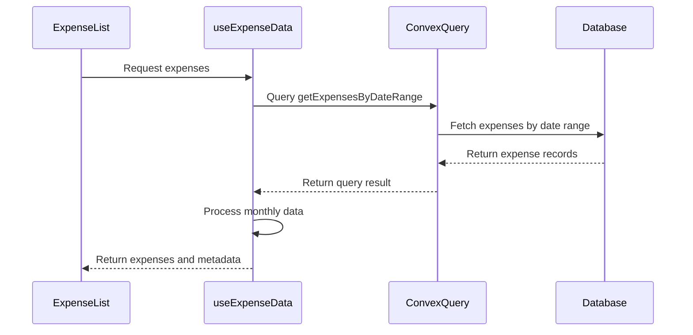

**Key characteristics:**
- **Time-based filtering**: Retrieves expenses within the current month's date range
- **Data processing**: Calculates monthly totals, category distributions, and daily spending patterns
- **Navigation support**: Provides functions to navigate between months (goToPreviousMonth, goToNextMonth)
- **Cache management**: Uses a key state variable to force re-query when needed

### useTimeFramedData Hook
This more flexible hook supports multiple calendar systems (Gregorian and Jalali) and both expense and income data types:

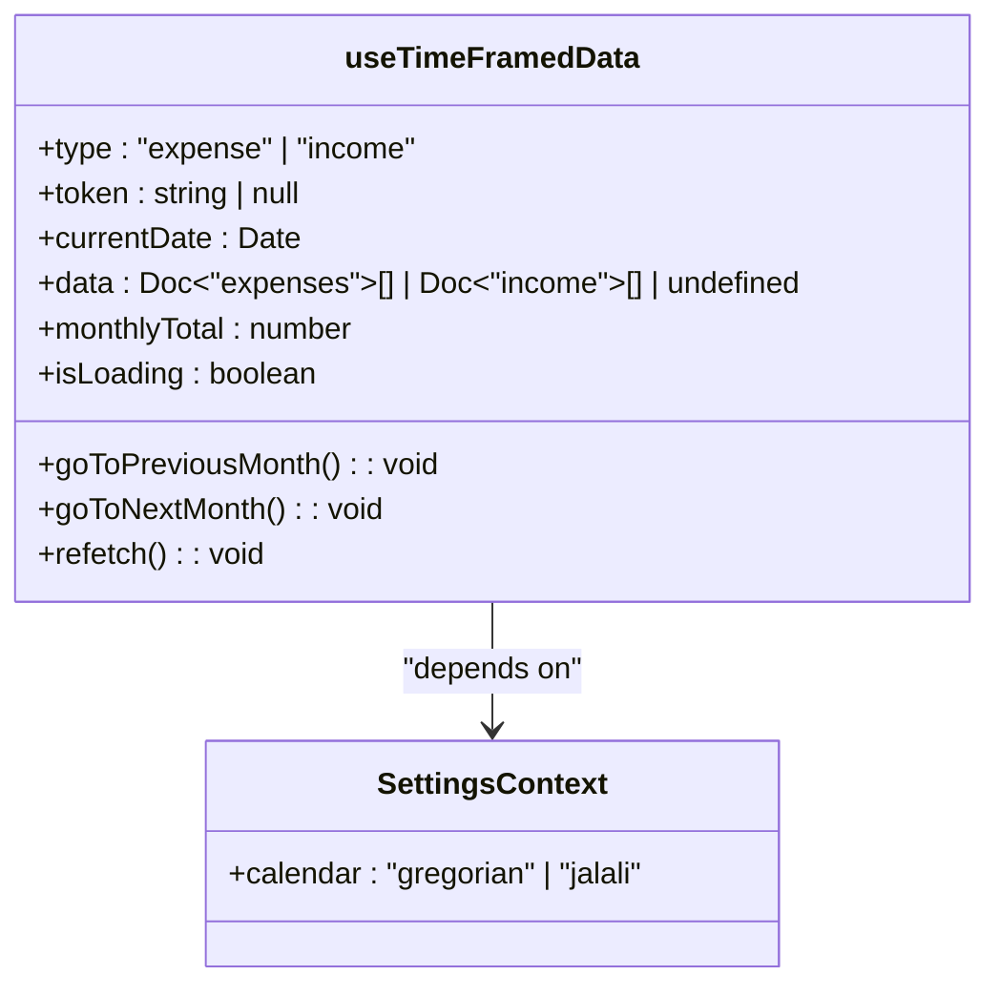

**Calendar support:**
- **Gregorian calendar**: Uses date-fns library for standard date manipulation
- **Jalali calendar**: Integrates with jalali-moment for Persian calendar support
- **Dynamic range calculation**: Adjusts date ranges based on the selected calendar system

**Section sources**
- [useExpenseData.ts](file://src/features/dashboard/hooks/useExpenseData.ts#L1-L87)
- [useTimeFramedData.ts](file://src/hooks/useTimeFramedData.ts#L1-L97)

## State Management and Rendering
The ExpenseList component manages its state through props passed from parent components and leverages React's rendering optimizations for efficient updates.

### Prop Interface
The component accepts three main props that define its behavior and interactions:

```typescript
interface ExpenseListProps {
  expenses: Expense[];
  onEdit: (expense: Expense) => void;
  onDeleteSuccess: (expenseId: Id<"expenses">) => void;
}
```

**Prop descriptions:**
- **expenses**: Array of expense objects to be displayed
- **onEdit**: Callback function triggered when a user initiates an edit action
- **onDeleteSuccess**: Callback function called when an expense is successfully deleted

### Rendering Logic
The component implements conditional rendering based on the presence of expenses:

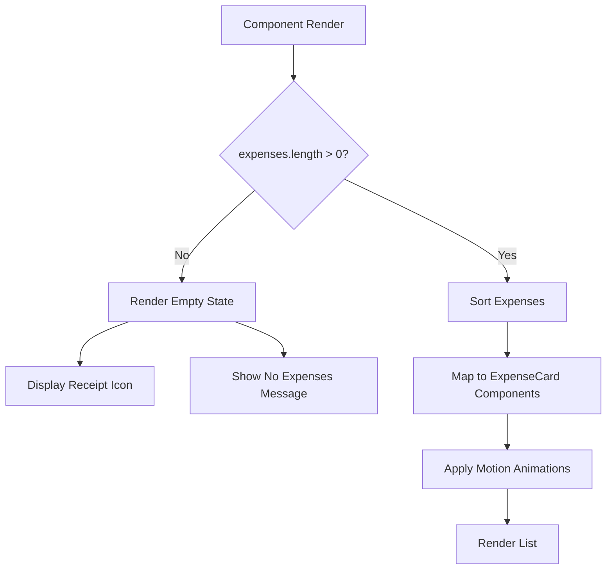

The rendering process includes:
- **Sorting**: Expenses are sorted by _creationTime in descending order
- **Key assignment**: Each ExpenseCard is assigned a unique key using the expense's _id
- **Animation**: Framer Motion's AnimatePresence wraps the list for smooth transitions
- **Layout**: Uses Tailwind's space-y-4 utility for consistent vertical spacing

**Section sources**
- [ExpenseList.tsx](file://src/features/dashboard/components/Expenses/ExpenseList.tsx#L1-L38)
- [expense.ts](file://src/features/dashboard/types/expense.ts#L1-L19)

## Accessibility Features
The ExpenseList component and its associated ExpenseCard components include several accessibility features to ensure usability for all users, including those using screen readers or keyboard navigation.

### Screen Reader Support
While the ExpenseList component itself doesn't include explicit ARIA attributes, it relies on the ExpenseCard component for accessibility features:

- **Semantic HTML**: Uses appropriate HTML elements for content structure
- **Visual indicators**: Includes icons with descriptive classes
- **Color contrast**: Maintains sufficient contrast between text and background
- **Focus management**: The ExpenseCard handles focus states through its interactive elements

### Keyboard Navigation
The component supports keyboard navigation through the following mechanisms:

- **Click handlers**: The ExpenseCard's onClick handler is accessible via keyboard (Enter key)
- **Button elements**: Edit and Delete actions are implemented as buttons, which are natively keyboard accessible
- **Tab order**: Interactive elements maintain logical tab order within the application

### ARIA Implementation
The accessibility features are primarily implemented in the ExpenseCard component:

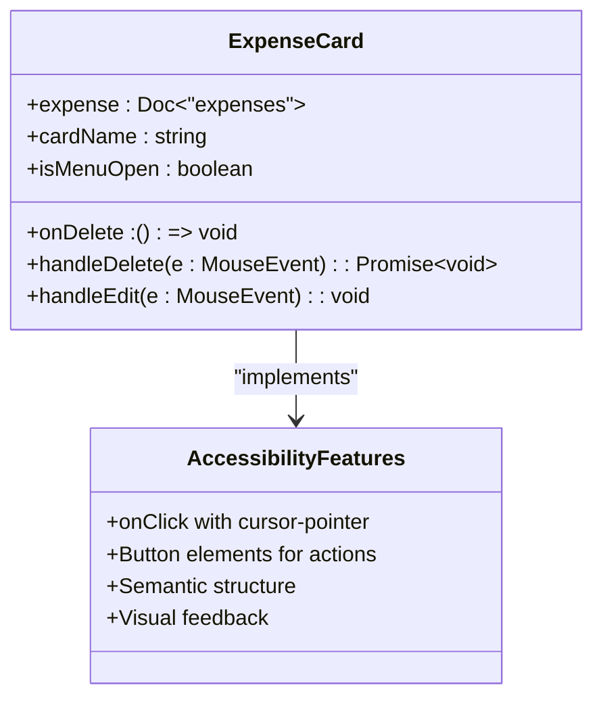

**Section sources**
- [ExpenseCard.tsx](file://src/components/cards/ExpenseCard.tsx#L1-L116)
- [ExpenseList.tsx](file://src/features/dashboard/components/Expenses/ExpenseList.tsx#L1-L38)

## Performance Characteristics
The ExpenseList component is designed with performance considerations for handling expense data, though it does not implement advanced optimization techniques for very large datasets.

### Current Implementation
The component uses a straightforward rendering approach:

- **Direct mapping**: Maps the expenses array directly to ExpenseCard components
- **Client-side sorting**: Sorts expenses in memory using JavaScript's sort method
- **Animation optimization**: Uses Framer Motion for efficient animation rendering
- **Memoization**: Relies on React's default memoization for props

### Limitations for Large Datasets
The current implementation has potential performance implications when handling large numbers of expenses:

- **No virtualization**: All expense cards are rendered in the DOM simultaneously
- **No pagination**: The component displays all fetched expenses at once
- **Full re-renders**: Changes to the expenses array trigger re-renders of all child components

### Performance Optimization Opportunities
Potential improvements could include:

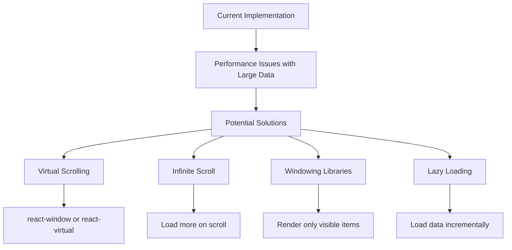

**Section sources**
- [ExpenseList.tsx](file://src/features/dashboard/components/Expenses/ExpenseList.tsx#L1-L38)
- [useExpenseData.ts](file://src/features/dashboard/hooks/useExpenseData.ts#L1-L87)

## Customization and Extensibility
The ExpenseList component offers several customization points and can be extended to support additional features like search filtering and infinite scroll.

### Layout Customization
The component's layout can be customized through various methods:

- **CSS overrides**: The component uses Tailwind CSS classes that can be extended or modified
- **Prop-based configuration**: Future enhancements could include layout props
- **Theme integration**: Respects the application's theme through the SettingsContext

### Feature Extensions
The component can be extended to support additional functionality:

#### Infinite Scroll Implementation
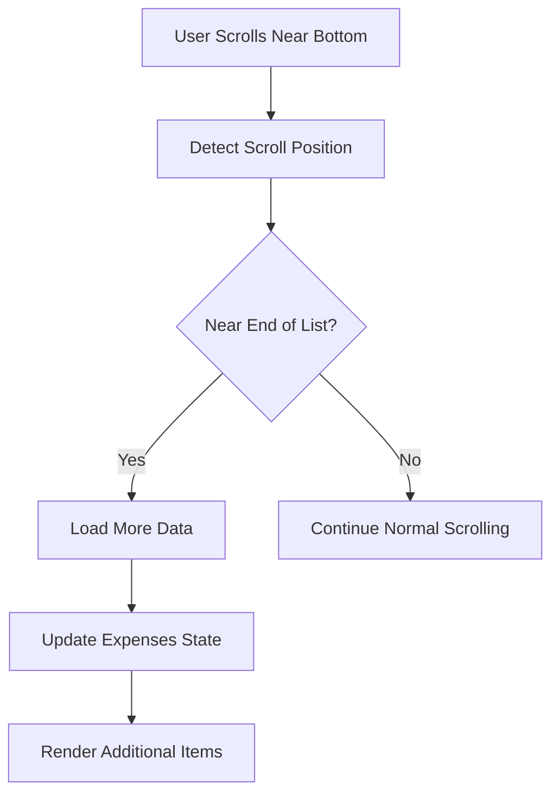

#### Search Filtering
The component could integrate with search functionality using the useDebounce hook:

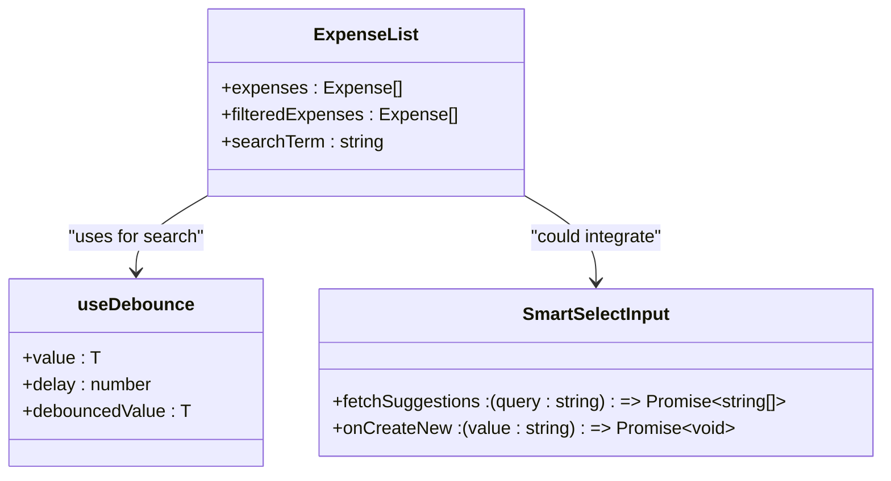

### Integration Points
The component provides clear integration points for customization:

- **onEdit callback**: Can be customized to trigger different edit workflows
- **onDeleteSuccess callback**: Allows parent components to respond to deletion events
- **ExpenseCard composition**: The rendering of individual expenses can be customized by modifying the ExpenseCard component

**Section sources**
- [ExpenseList.tsx](file://src/features/dashboard/components/Expenses/ExpenseList.tsx#L1-L38)
- [useDebounce.ts](file://src/hooks/useDebounce.ts#L1-L16)
- [SmartSelectInput.tsx](file://src/components/SmartSelectInput.tsx#L1-L40)

## Error Handling and Edge Cases
The ExpenseList component handles several edge cases and error conditions to provide a robust user experience.

### Empty State Handling
The component gracefully handles the case when no expenses are available:

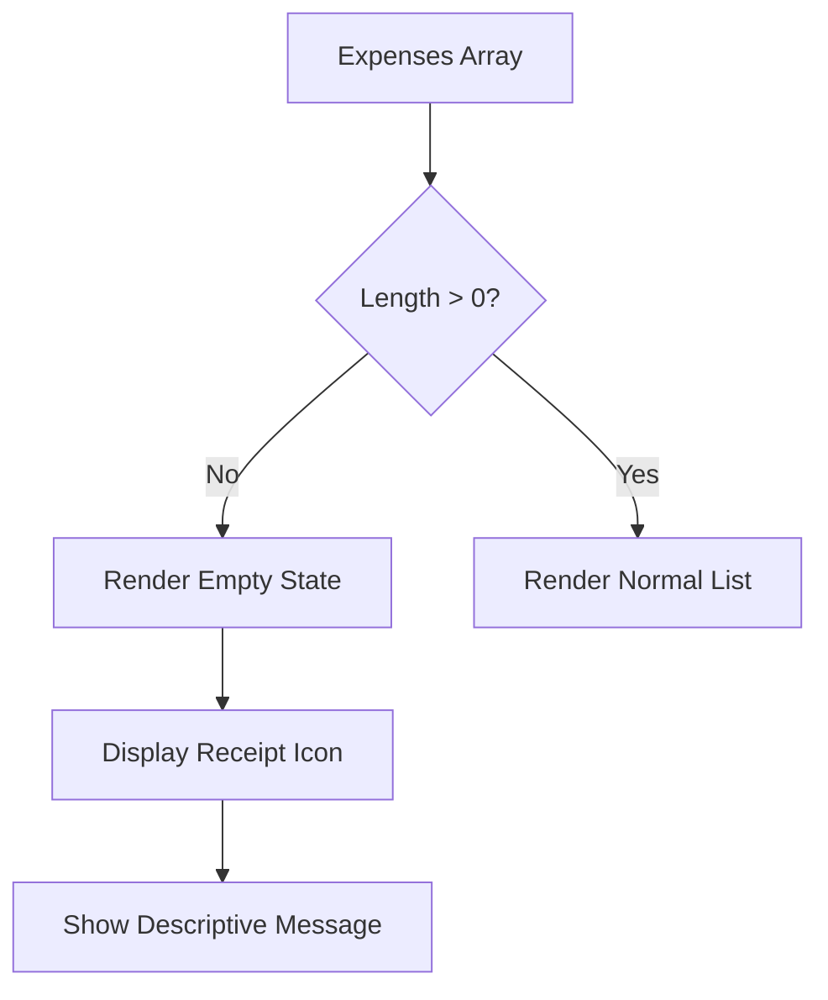

The empty state includes:
- **Visual indicator**: A Receipt icon from Lucide React
- **Descriptive text**: "No expenses recorded for this period"
- **Centered layout**: Content is centered with appropriate padding

### Loading State Management
While the ExpenseList component itself doesn't handle loading states, it works in conjunction with parent components that manage loading:

- **Data fetching**: Loading state is managed by the useExpenseData and useTimeFramedData hooks
- **Parent responsibility**: Components like ExpensesPage handle the loading state display
- **Seamless integration**: The ExpenseList only receives data when it's available

### Error Propagation
The component handles errors through callback mechanisms:

- **onDeleteSuccess**: Called only when deletion is successful
- **Error handling in ExpenseCard**: Individual expense cards handle their own errors (e.g., authentication failures)
- **Toast notifications**: Errors are communicated to users through the Sonner toast library

**Section sources**
- [ExpenseList.tsx](file://src/features/dashboard/components/Expenses/ExpenseList.tsx#L1-L38)
- [ExpenseCard.tsx](file://src/components/cards/ExpenseCard.tsx#L1-L116)

## Real-time and Offline Support
The ExpenseList component integrates with the application's real-time and offline capabilities through the use of Convex and local storage.

### Offline Data Management
The application includes a comprehensive offline support system:

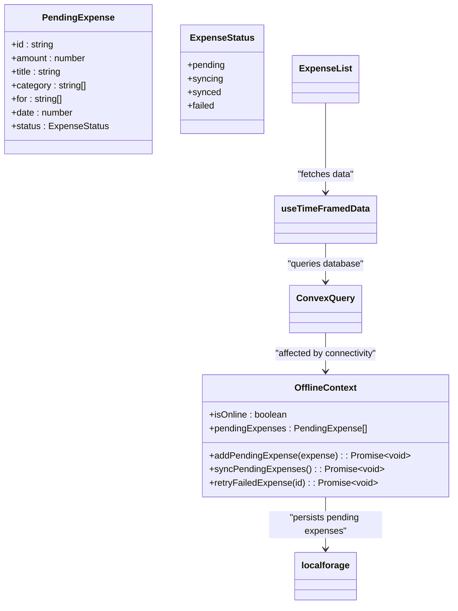

### Real-time Updates
The component benefits from Convex's real-time capabilities:

- **Automatic updates**: When expenses are added, edited, or deleted, the list updates automatically
- **Cache invalidation**: The key state variable in data fetching hooks allows for manual cache busting
- **Reactivity**: Uses Convex's useQuery hook which automatically updates when data changes

### Synchronization Process
When connectivity is restored, pending expenses are synchronized:

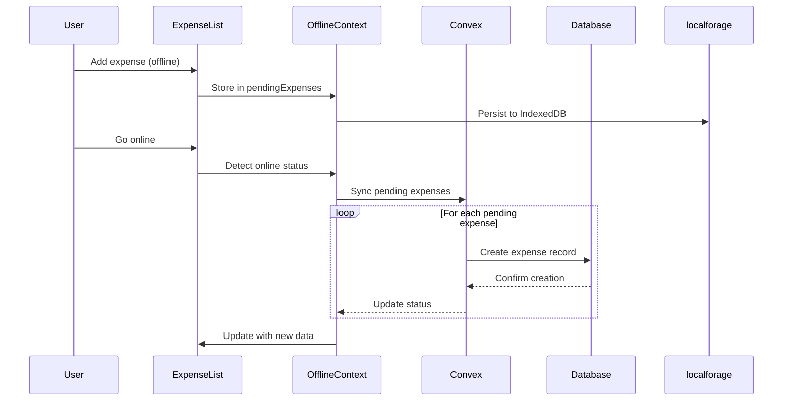

**Section sources**
- [OfflineContext.tsx](file://src/contexts/OfflineContext.tsx#L1-L170)
- [useTimeFramedData.ts](file://src/hooks/useTimeFramedData.ts#L1-L97)
- [ExpenseCard.tsx](file://src/components/cards/ExpenseCard.tsx#L1-L116)

## Component Architecture
The ExpenseList component is part of a larger architectural pattern that emphasizes separation of concerns and reusable components.

### Component Hierarchy
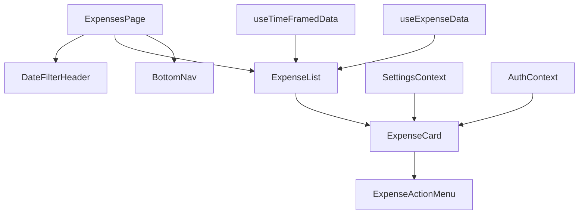

### Data Flow
The component follows a unidirectional data flow pattern:

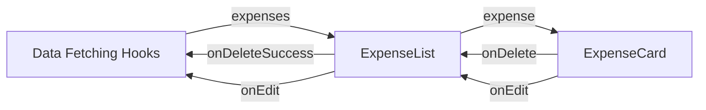

### Integration with Application Features
The component integrates with various application features:

- **Internationalization**: Supports multiple calendar systems through SettingsContext
- **Theming**: Adapts to user preferences for currency and calendar display
- **Authentication**: Respects user authentication status through AuthContext
- **State management**: Uses React's state and context APIs for efficient updates

The ExpenseList component exemplifies a well-structured React component that balances simplicity with functionality, serving as a critical interface between the user and their financial data while maintaining performance and accessibility standards.

**Section sources**
- [ExpenseList.tsx](file://src/features/dashboard/components/Expenses/ExpenseList.tsx#L1-L38)
- [useExpenseData.ts](file://src/features/dashboard/hooks/useExpenseData.ts#L1-L87)
- [useTimeFramedData.ts](file://src/hooks/useTimeFramedData.ts#L1-L97)
- [ExpenseCard.tsx](file://src/components/cards/ExpenseCard.tsx#L1-L116)
- [expense.ts](file://src/features/dashboard/types/expense.ts#L1-L19)