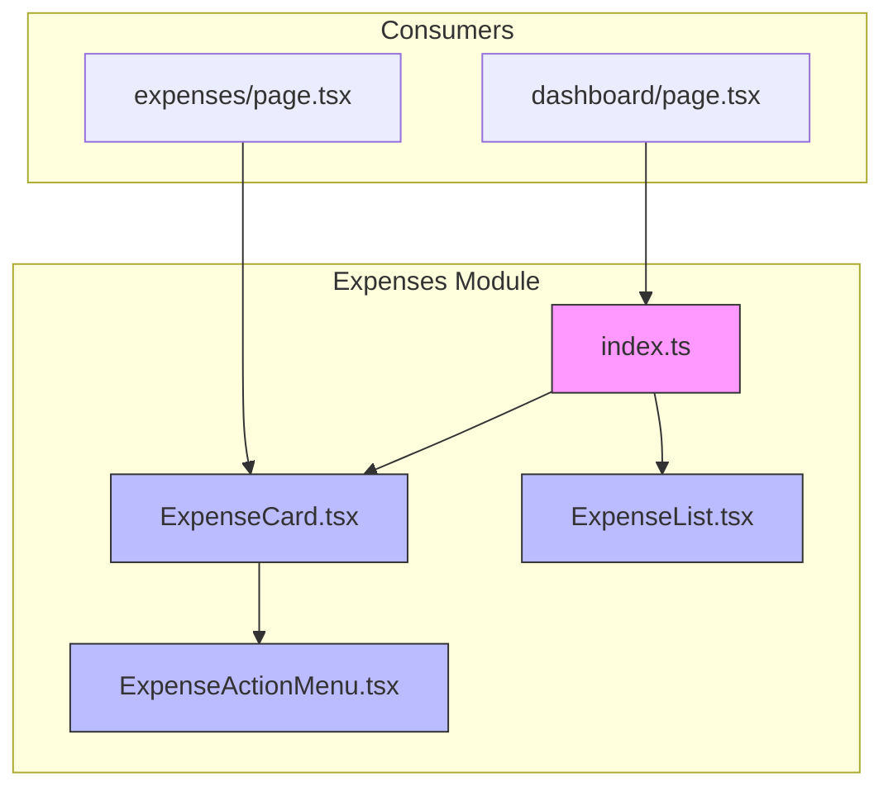
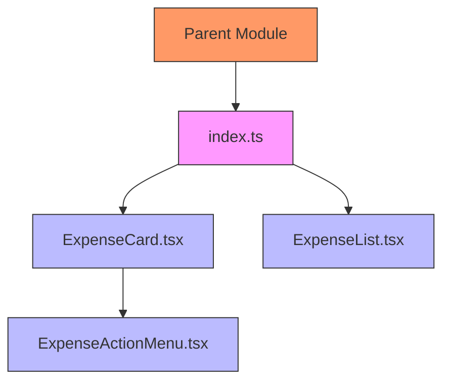
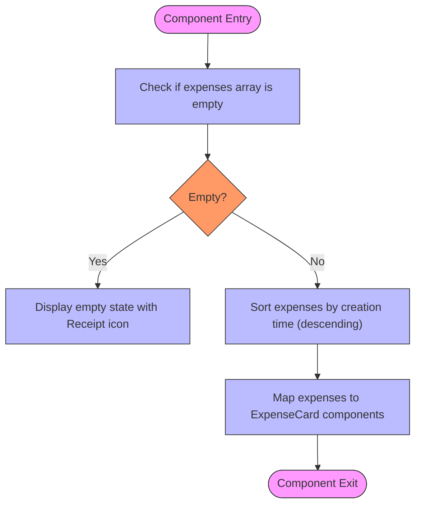
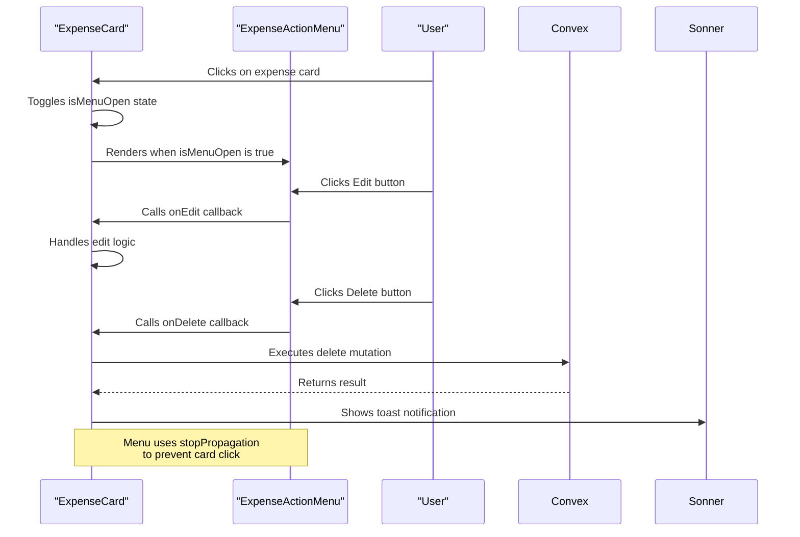

# Expenses Module Index

<cite>
**Referenced Files in This Document**   
- [index.ts](file://src/features/dashboard/components/Expenses/index.ts)
- [ExpenseCard.tsx](file://src/features/dashboard/components/Expenses/ExpenseCard.tsx)
- [ExpenseList.tsx](file://src/features/dashboard/components/Expenses/ExpenseList.tsx)
- [ExpenseActionMenu.tsx](file://src/features/dashboard/components/Expenses/ExpenseActionMenu.tsx)
- [page.tsx](file://src/app/dashboard/page.tsx)
- [page.tsx](file://src/app/expenses/page.tsx)
</cite>

## Table of Contents
1. [Introduction](#introduction)
2. [Project Structure](#project-structure)
3. [Core Components](#core-components)
4. [Architecture Overview](#architecture-overview)
5. [Detailed Component Analysis](#detailed-component-analysis)
6. [Dependency Analysis](#dependency-analysis)
7. [Performance Considerations](#performance-considerations)
8. [Troubleshooting Guide](#troubleshooting-guide)
9. [Conclusion](#conclusion)

## Introduction
This document provides a comprehensive analysis of the Expenses module's index.ts barrel file and its associated components within the Expense Tracker application. The focus is on understanding how the barrel file simplifies imports, enhances code maintainability, and supports efficient component organization. The analysis covers the implementation of ExpenseCard, ExpenseList, and ExpenseActionMenu components, their integration patterns, and best practices for maintaining barrel files in a React application with Convex backend integration.

## Project Structure
The Expenses module is organized within the dashboard feature directory, following a component-based architecture. The barrel file serves as a centralized export point for key expense-related UI components.



**Diagram sources**
- [index.ts](file://src/features/dashboard/components/Expenses/index.ts)
- [ExpenseCard.tsx](file://src/features/dashboard/components/Expenses/ExpenseCard.tsx)
- [ExpenseList.tsx](file://src/features/dashboard/components/Expenses/ExpenseList.tsx)
- [ExpenseActionMenu.tsx](file://src/features/dashboard/components/Expenses/ExpenseActionMenu.tsx)
- [page.tsx](file://src/app/dashboard/page.tsx)
- [page.tsx](file://src/app/expenses/page.tsx)

**Section sources**
- [index.ts](file://src/features/dashboard/components/Expenses/index.ts)
- [page.tsx](file://src/app/dashboard/page.tsx)

## Core Components
The Expenses module consists of three primary components that are re-exported through the barrel file: ExpenseCard, ExpenseList, and ExpenseActionMenu. These components work together to display, manage, and interact with expense data in the application.

The barrel file (index.ts) simplifies imports by providing a single entry point for these components, allowing parent modules to import them with cleaner syntax. This pattern enhances developer experience by reducing import complexity and promoting consistent component usage across the application.

**Section sources**
- [index.ts](file://src/features/dashboard/components/Expenses/index.ts)
- [ExpenseCard.tsx](file://src/features/dashboard/components/Expenses/ExpenseCard.tsx)
- [ExpenseList.tsx](file://src/features/dashboard/components/Expenses/ExpenseList.tsx)

## Architecture Overview
The Expenses module follows a hierarchical component architecture where the barrel file acts as a facade for the underlying components. This design pattern promotes separation of concerns and facilitates tree-shaking by allowing bundlers to eliminate unused exports.



**Diagram sources**
- [index.ts](file://src/features/dashboard/components/Expenses/index.ts)
- [ExpenseCard.tsx](file://src/features/dashboard/components/Expenses/ExpenseCard.tsx)
- [ExpenseList.tsx](file://src/features/dashboard/components/Expenses/ExpenseList.tsx)
- [ExpenseActionMenu.tsx](file://src/features/dashboard/components/Expenses/ExpenseActionMenu.tsx)

## Detailed Component Analysis

### ExpenseCard Analysis
The ExpenseCard component displays individual expense information with interactive capabilities. It uses framer-motion for animations and integrates with Convex for data mutation operations.

```mermaid
classDiagram
class ExpenseCard {
+expense : Expense
+onEdit : (expense : Expense) => void
+onDeleteSuccess : (expenseId : Id<"expenses">) => void
-isMenuOpen : boolean
-cardRef : RefObject~HTMLDivElement~
-deleteExpenseMutation : Mutation
+handleCardClick() : void
+handleEdit() : void
+handleDelete() : Promise~void~
}
class ExpenseActionMenu {
+onEdit : () => void
+onDelete : () => void
}
ExpenseCard --> ExpenseActionMenu : "conditionally renders"
ExpenseCard --> "convex/react" : "usesMutation"
ExpenseCard --> "sonner" : "toast notifications"
style ExpenseCard fill : #bbf,stroke : #333
style ExpenseActionMenu fill : #bbf,stroke : #333
```

**Diagram sources**
- [ExpenseCard.tsx](file://src/features/dashboard/components/Expenses/ExpenseCard.tsx)
- [ExpenseActionMenu.tsx](file://src/features/dashboard/components/Expenses/ExpenseActionMenu.tsx)

**Section sources**
- [ExpenseCard.tsx](file://src/features/dashboard/components/Expenses/ExpenseCard.tsx)

### ExpenseList Analysis
The ExpenseList component renders a collection of ExpenseCard components, handling empty states and sorting logic. It imports components from the same directory using relative path aliases.



**Diagram sources**
- [ExpenseList.tsx](file://src/features/dashboard/components/Expenses/ExpenseList.tsx)

**Section sources**
- [ExpenseList.tsx](file://src/features/dashboard/components/Expenses/ExpenseList.tsx)

### ExpenseActionMenu Analysis
The ExpenseActionMenu component provides a dropdown menu for editing and deleting expenses. It uses framer-motion for smooth animations and prevents event propagation to avoid unintended interactions.



**Diagram sources**
- [ExpenseCard.tsx](file://src/features/dashboard/components/Expenses/ExpenseCard.tsx#L71-L109)
- [ExpenseActionMenu.tsx](file://src/features/dashboard/components/Expenses/ExpenseActionMenu.tsx)

**Section sources**
- [ExpenseCard.tsx](file://src/features/dashboard/components/Expenses/ExpenseCard.tsx)
- [ExpenseActionMenu.tsx](file://src/features/dashboard/components/Expenses/ExpenseActionMenu.tsx)

## Dependency Analysis
The barrel file and its components have a well-defined dependency structure that avoids circular references. The import pattern follows a unidirectional flow from the barrel file to individual components.

```mermaid
graph LR
index["index.ts"] --> ExpenseCard["ExpenseCard.tsx"]
index --> ExpenseList["ExpenseList.tsx"]
ExpenseCard --> ExpenseActionMenu["ExpenseActionMenu.tsx"]
ExpenseList --> ExpenseCard
ExpenseList --> "."
style index fill:#f9f,stroke:#333
style ExpenseCard fill:#bbf,stroke:#333
style ExpenseList fill:#bbf,stroke:#333
style ExpenseActionMenu fill:#bbf,stroke:#333
classDef barrel fill:#f9f,stroke:#333;
classDef component fill:#bbf,stroke:#333;
class index barrel
class ExpenseCard,ExpenseList,ExpenseActionMenu component
```

**Diagram sources**
- [index.ts](file://src/features/dashboard/components/Expenses/index.ts)
- [ExpenseCard.tsx](file://src/features/dashboard/components/Expenses/ExpenseCard.tsx)
- [ExpenseList.tsx](file://src/features/dashboard/components/Expenses/ExpenseList.tsx)
- [ExpenseActionMenu.tsx](file://src/features/dashboard/components/Expenses/ExpenseActionMenu.tsx)

**Section sources**
- [index.ts](file://src/features/dashboard/components/Expenses/index.ts)
- [ExpenseCard.tsx](file://src/features/dashboard/components/Expenses/ExpenseCard.tsx)
- [ExpenseList.tsx](file://src/features/dashboard/components/Expenses/ExpenseList.tsx)

## Performance Considerations
The barrel file implementation supports tree-shaking, allowing bundlers to eliminate unused component exports. This optimization reduces bundle size and improves application performance. The components use React's memoization patterns and efficient event handling to minimize re-renders and enhance user experience.

The use of framer-motion for animations is optimized with initial, animate, and exit props that enable hardware acceleration. The handleClickOutside effect in ExpenseCard is properly cleaned up to prevent memory leaks, demonstrating good lifecycle management practices.

## Troubleshooting Guide
When working with the Expenses module barrel file, consider the following common issues and solutions:

1. **Missing exports**: Ensure that new components are added to the index.ts file when they should be publicly accessible.
2. **Circular dependencies**: Avoid importing from the barrel file within the same directory (use relative paths instead).
3. **Tree-shaking issues**: Verify that unused exports are not being imported elsewhere in the application.
4. **Type conflicts**: Ensure consistent type definitions across components, particularly for the Expense interface.

**Section sources**
- [index.ts](file://src/features/dashboard/components/Expenses/index.ts)
- [ExpenseCard.tsx](file://src/features/dashboard/components/Expenses/ExpenseCard.tsx)
- [ExpenseList.tsx](file://src/features/dashboard/components/Expenses/ExpenseList.tsx)

## Conclusion
The Expenses module index.ts barrel file effectively simplifies component imports and enhances code organization within the application. By re-exporting ExpenseCard, ExpenseList, and ExpenseActionMenu, it provides a clean API for parent modules while maintaining separation of concerns. The implementation follows best practices for React component architecture, supporting tree-shaking, avoiding circular dependencies, and promoting code maintainability. This pattern improves developer experience by reducing import complexity and ensuring consistent component usage across the application.