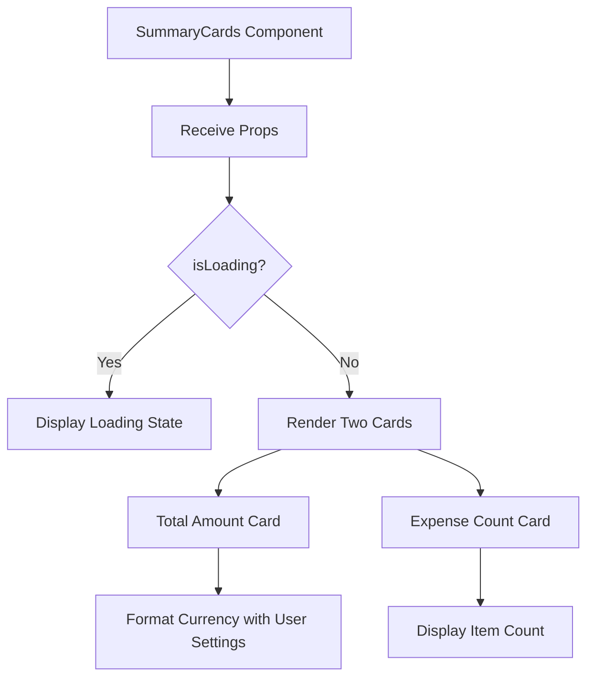
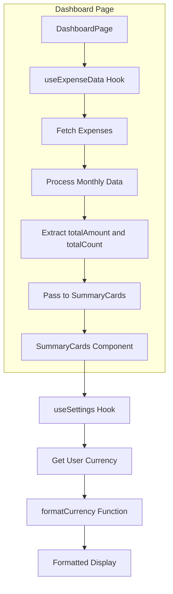
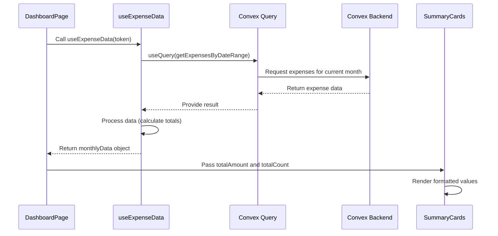
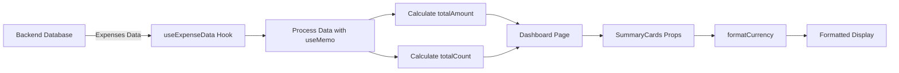
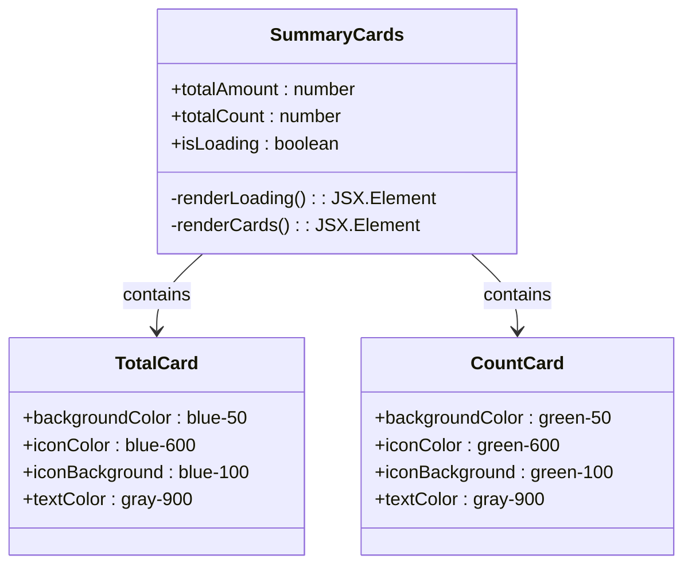
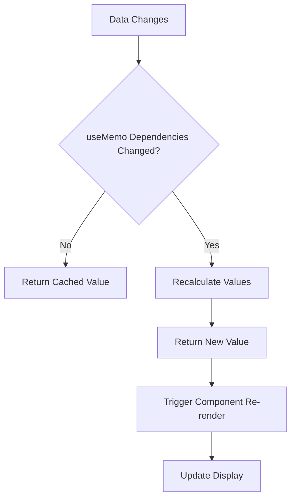
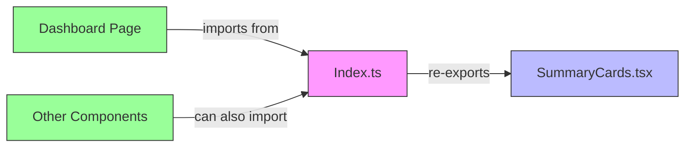

# Dashboard Component - SummaryCards

<cite>
**Referenced Files in This Document**   
- [SummaryCards.tsx](file://src/features/dashboard/components/SummaryCards/SummaryCards.tsx)
- [index.ts](file://src/features/dashboard/components/SummaryCards/index.ts)
- [useExpenseData.ts](file://src/features/dashboard/hooks/useExpenseData.ts)
- [formatters.ts](file://src/lib/formatters.ts)
- [SettingsContext.tsx](file://src/contexts/SettingsContext.tsx)
- [dashboard/page.tsx](file://src/app/dashboard/page.tsx)
</cite>

## Table of Contents
1. [Introduction](#introduction)
2. [Component Overview](#component-overview)
3. [Architecture and Integration](#architecture-and-integration)
4. [Detailed Component Analysis](#detailed-component-analysis)
5. [Data Flow and Processing](#data-flow-and-processing)
6. [Styling and Responsive Design](#styling-and-responsive-design)
7. [Accessibility Considerations](#accessibility-considerations)
8. [Performance Optimization](#performance-optimization)
9. [Extensibility and Customization](#extensibility-and-customization)
10. [Module Export Pattern](#module-export-pattern)

## Introduction
The SummaryCards component is a key visual element in the Expense Tracker dashboard, designed to display essential financial summary metrics at a glance. This component presents users with immediate insights into their financial status through two primary cards: one showing the total expense amount and another displaying the count of expenses for the current month. Built with React and integrated with the application's state management and data fetching systems, SummaryCards provides a responsive, accessible, and performant user interface for financial data visualization.

**Section sources**
- [SummaryCards.tsx](file://src/features/dashboard/components/SummaryCards/SummaryCards.tsx#L1-L61)

## Component Overview
The SummaryCards component is a functional React component that renders two informational cards side by side in a responsive layout. Each card displays a different financial metric with appropriate iconography and styling to enhance user comprehension. The component accepts three props: `totalAmount` (the sum of all expenses), `totalCount` (the number of expense items), and `isLoading` (a boolean indicating data loading state).

The first card displays the total monetary amount of expenses with a blue color scheme and a DollarSign icon, while the second card shows the number of expense items with a green color scheme and a TrendingUp icon. When data is loading, the component displays a simple loading state with a "Loading..." message.



**Diagram sources**
- [SummaryCards.tsx](file://src/features/dashboard/components/SummaryCards/SummaryCards.tsx#L1-L61)

**Section sources**
- [SummaryCards.tsx](file://src/features/dashboard/components/SummaryCards/SummaryCards.tsx#L1-L61)

## Architecture and Integration
The SummaryCards component is integrated into the dashboard page as part of a larger financial analytics interface. It works in conjunction with other dashboard components such as CardBalances, CategoryBreakdownChart, and DailySpendingChart to provide a comprehensive view of the user's financial data.

The component is located in the feature-based directory structure at `src/features/dashboard/components/SummaryCards/`, following the application's organizational pattern of grouping related functionality together. It is consumed by the main dashboard page (`src/app/dashboard/page.tsx`) which passes it processed data from the useExpenseData hook.



**Diagram sources**
- [SummaryCards.tsx](file://src/features/dashboard/components/SummaryCards/SummaryCards.tsx#L1-L61)
- [dashboard/page.tsx](file://src/app/dashboard/page.tsx#L1-L126)
- [useExpenseData.ts](file://src/features/dashboard/hooks/useExpenseData.ts#L1-L86)

**Section sources**
- [SummaryCards.tsx](file://src/features/dashboard/components/SummaryCards/SummaryCards.tsx#L1-L61)
- [dashboard/page.tsx](file://src/app/dashboard/page.tsx#L1-L126)

## Detailed Component Analysis

### SummaryCards Component Structure
The SummaryCards component is implemented as a TypeScript function component with a well-defined interface for its props. It leverages several key React patterns and external libraries to deliver its functionality.

The component uses the `useSettings` hook to access user preferences, particularly the currency setting, which is crucial for properly formatting the financial data. It also imports the `formatCurrency` utility function from the formatters module to handle currency formatting according to user preferences.

```typescript
interface SummaryCardsProps {
  totalAmount: number;
  totalCount: number;
  isLoading: boolean;
}

export function SummaryCards({ totalAmount, totalCount, isLoading }: SummaryCardsProps) {
  const { settings } = useSettings();

  if (isLoading) {
    return (
      <div className="text-center py-8">
        <div className="text-gray-500">Loading...</div>
      </div>
    );
  }

  return (
    <div className="flex flex-row gap-4 w-full">
      {/* Total Amount Card */}
      <div className="bg-blue-50 p-5 rounded-xl flex-1">
        <div className="flex items-center justify-between">
          <div>
            <div className="flex items-center space-x-2">
              <div className="p-2 bg-blue-100 rounded-lg">
                <DollarSign className="text-blue-600" size={18} />
              </div>
              <div>
                <span className="text-sm font-medium text-gray-700">Total</span>
                <div className="text-2xl font-bold text-gray-900">
                  {settings ? formatCurrency(totalAmount, settings.currency) : `$${totalAmount.toFixed(2)}`}
                </div>
              </div>
            </div>
          </div>
        </div>
      </div>
      
      {/* Expense Count Card */}
      <div className="bg-green-50 p-5 rounded-xl flex-1">
        <div className="flex items-center justify-between">
          <div>
            <div className="flex items-center space-x-2">
              <div className="p-2 bg-green-100 rounded-lg">
                <TrendingUp className="text-green-600" size={18} />
              </div>
              <div>
                <span className="text-sm font-medium text-gray-700">Expenses</span>
                <div className="text-2xl font-bold text-gray-900">
                  {totalCount} items
                </div>
              </div>
            </div>
          </div>
        </div>
      </div>
    </div>
  );
}
```

**Section sources**
- [SummaryCards.tsx](file://src/features/dashboard/components/SummaryCards/SummaryCards.tsx#L1-L61)

### Data Processing with useExpenseData Hook
The SummaryCards component relies on the `useExpenseData` custom hook to obtain the financial data it displays. This hook handles the entire data fetching and processing pipeline, from querying the backend to transforming the raw expense data into meaningful summary metrics.

The hook uses Convex's `useQuery` to fetch expenses for the current month, then processes this data to calculate the total amount and count of expenses. This processed data is then passed to the SummaryCards component via props.



**Diagram sources**
- [useExpenseData.ts](file://src/features/dashboard/hooks/useExpenseData.ts#L1-L86)
- [SummaryCards.tsx](file://src/features/dashboard/components/SummaryCards/SummaryCards.tsx#L1-L61)

**Section sources**
- [useExpenseData.ts](file://src/features/dashboard/hooks/useExpenseData.ts#L1-L86)

## Data Flow and Processing
The data flow for the SummaryCards component follows a clear pattern from data retrieval to presentation. The process begins with the dashboard page invoking the `useExpenseData` hook, which in turn queries the Convex backend for expense data within the current month's date range.

Once the data is retrieved, the hook processes it to extract the summary metrics needed by SummaryCards. This processing occurs within a `useMemo` hook to ensure the calculations are only performed when the underlying expense data changes, optimizing performance.

The key data transformations include:
- Calculating the total amount by summing all expense amounts
- Counting the total number of expenses
- Organizing expenses by category and date for other components

These processed values are then passed to the SummaryCards component as props, where they are formatted and displayed to the user.



**Diagram sources**
- [useExpenseData.ts](file://src/features/dashboard/hooks/useExpenseData.ts#L1-L86)
- [SummaryCards.tsx](file://src/features/dashboard/components/SummaryCards/SummaryCards.tsx#L1-L61)

**Section sources**
- [useExpenseData.ts](file://src/features/dashboard/hooks/useExpenseData.ts#L1-L86)

## Styling and Responsive Design
The SummaryCards component utilizes Tailwind CSS for all styling, implementing a responsive design that adapts to different screen sizes. The layout uses Flexbox to arrange the two cards side by side with equal width distribution.

The styling approach includes:
- Using color-coded backgrounds (blue for total amount, green for expense count) to provide visual differentiation
- Implementing consistent padding and spacing with Tailwind's spacing scale
- Using responsive classes to ensure proper display on mobile devices
- Applying subtle visual effects like rounded corners and background shades

The component's responsive behavior is achieved through the `flex flex-row` classes, which create a horizontal layout on larger screens. The `flex-1` class ensures both cards receive equal width, while the `gap-4` class maintains consistent spacing between them.



**Diagram sources**
- [SummaryCards.tsx](file://src/features/dashboard/components/SummaryCards/SummaryCards.tsx#L1-L61)

**Section sources**
- [SummaryCards.tsx](file://src/features/dashboard/components/SummaryCards/SummaryCards.tsx#L1-L61)

## Accessibility Considerations
The SummaryCards component incorporates several accessibility features to ensure it can be used by all users, including those with disabilities. While the current implementation could be enhanced with additional accessibility attributes, it follows several best practices:

- Uses semantic HTML structure with appropriate heading levels and text hierarchy
- Provides sufficient color contrast between text and background
- Includes clear visual indicators for loading states
- Uses descriptive text labels ("Total" and "Expenses") to explain the purpose of each card
- Implements a logical tab order through the use of standard HTML elements

Potential accessibility improvements could include:
- Adding ARIA labels to describe the purpose of each card
- Implementing keyboard navigation support
- Adding screen reader announcements for dynamic content updates
- Ensuring color contrast meets WCAG 2.1 standards

The component's reliance on visual cues (colors and icons) should be supplemented with text-based information to ensure accessibility for users with color vision deficiencies.

**Section sources**
- [SummaryCards.tsx](file://src/features/dashboard/components/SummaryCards/SummaryCards.tsx#L1-L61)

## Performance Optimization
The SummaryCards component and its associated data processing system incorporate several performance optimizations to ensure a smooth user experience:

1. **Memoization**: The `useMemo` hook in `useExpenseData` prevents unnecessary recalculation of summary metrics when the expense data hasn't changed.

2. **Conditional Rendering**: The component only renders the cards when data is available, showing a simple loading state during data retrieval.

3. **Efficient Data Fetching**: The use of Convex's `useQuery` hook ensures that data is only fetched when necessary and is automatically cached.

4. **Minimal Re-renders**: The component's props are primitive values (numbers and boolean), which helps prevent unnecessary re-renders due to object reference changes.

5. **Lazy Loading**: The component is only rendered when the dashboard page is active, and data fetching is tied to the user's authentication state.

The refetch mechanism implemented in `useExpenseData` allows for manual refresh of data when needed, without requiring a full page reload.



**Diagram sources**
- [useExpenseData.ts](file://src/features/dashboard/hooks/useExpenseData.ts#L1-L86)

**Section sources**
- [useExpenseData.ts](file://src/features/dashboard/hooks/useExpenseData.ts#L1-L86)

## Extensibility and Customization
The SummaryCards component is designed to be extensible and customizable, allowing for easy modification and enhancement. Several patterns in the code facilitate this extensibility:

### Adding New Summary Metrics
To add a new summary metric, developers can:
1. Update the `MonthlyData` type to include the new metric
2. Modify the data processing in `useExpenseData` to calculate the new metric
3. Extend the `SummaryCardsProps` interface to include the new prop
4. Add a new card to the SummaryCards component

### Customizing Styling
The component's styling can be customized by:
- Modifying the Tailwind CSS classes
- Adding new color schemes
- Adjusting spacing and layout properties
- Changing iconography

### Example: Adding an Average Expense Card
```typescript
// 1. Update MonthlyData type
interface MonthlyData {
  totalAmount: number;
  totalCount: number;
  averageAmount: number; // New property
  categoryTotals: Record<string, number>;
  dailyTotals: Record<string, number>;
}

// 2. Update useExpenseData processing
const monthlyData = useMemo<MonthlyData | null>(() => {
  if (!expenses) return null;

  const totalAmount = expenses.reduce((sum, expense) => sum + expense.amount, 0);
  const totalCount = expenses.length;
  const averageAmount = totalCount > 0 ? totalAmount / totalCount : 0; // Calculate average

  // ... rest of processing
}, [expenses]);
```

**Section sources**
- [SummaryCards.tsx](file://src/features/dashboard/components/SummaryCards/SummaryCards.tsx#L1-L61)
- [useExpenseData.ts](file://src/features/dashboard/hooks/useExpenseData.ts#L1-L86)

## Module Export Pattern
The SummaryCards component follows a clean module export pattern using an index.ts file to facilitate easy imports throughout the application. This pattern promotes consistent and organized code structure.

The index.ts file in the SummaryCards directory uses a re-export pattern:

```typescript
export * from './SummaryCards';
```

This allows other parts of the application to import the component using a clean, feature-based path:

```typescript
import { SummaryCards } from "@/features/dashboard/components/SummaryCards";
```

This approach provides several benefits:
- **Clean Import Paths**: Consumers don't need to know the exact file structure
- **Abstraction**: The internal file structure can change without affecting imports
- **Consistency**: All components in the feature follow the same export pattern
- **Discoverability**: IDEs can easily suggest available exports from the directory

The same pattern is used across other dashboard components, creating a consistent API for the entire feature.



**Diagram sources**
- [index.ts](file://src/features/dashboard/components/SummaryCards/index.ts#L1-L1)
- [SummaryCards.tsx](file://src/features/dashboard/components/SummaryCards/SummaryCards.tsx#L1-L61)

**Section sources**
- [index.ts](file://src/features/dashboard/components/SummaryCards/index.ts#L1-L1)