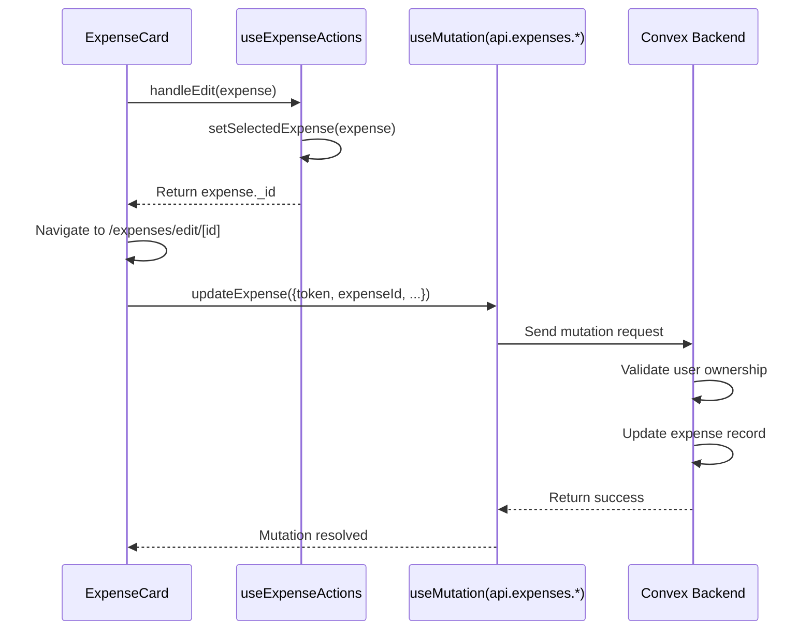
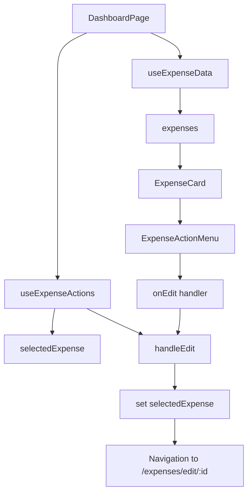
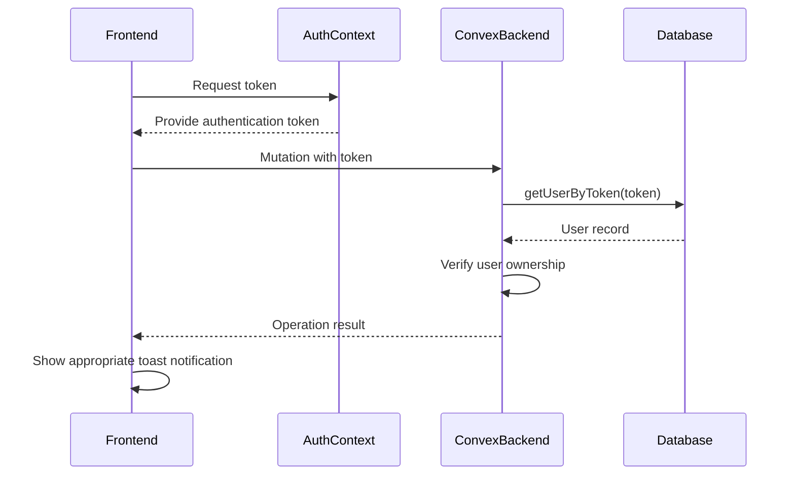
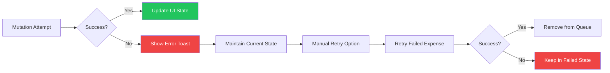

# Dashboard Hook - useExpenseActions

<cite>
**Referenced Files in This Document**   
- [useExpenseActions.ts](file://src/features/dashboard/hooks/useExpenseActions.ts#L1-L17)
- [ExpenseCard.tsx](file://src/features/dashboard/components/Expenses/ExpenseCard.tsx#L1-L110)
- [expenses.ts](file://convex/expenses.ts#L1-L325)
- [ExpenseActionMenu.tsx](file://src/features/dashboard/components/Expenses/ExpenseActionMenu.tsx#L1-L38)
- [OfflineContext.tsx](file://src/contexts/OfflineContext.tsx#L1-L171)
- [page.tsx](file://src/app/dashboard/page.tsx#L1-L127)
</cite>

## Table of Contents
1. [Introduction](#introduction)
2. [Core Functionality](#core-functionality)
3. [Integration with Convex Mutations](#integration-with-convex-mutations)
4. [Error Handling and User Feedback](#error-handling-and-user-feedback)
5. [Offline Support via OfflineContext](#offline-support-via-offlinecontext)
6. [Usage in UI Components](#usage-in-ui-components)
7. [Authentication and Permission Checks](#authentication-and-permission-checks)
8. [Recovery Strategies for Failed Mutations](#recovery-strategies-for-failed-mutations)
9. [Conclusion](#conclusion)

## Introduction
The `useExpenseActions` custom hook is a central component in the expense tracking application, designed to manage user interactions related to expense records. It encapsulates logic for selecting and preparing expenses for editing, serving as a bridge between UI components and backend operations. While currently focused on edit workflows, it operates within a broader ecosystem that includes full CRUD operations, offline support, authentication, and real-time feedback mechanisms.

This hook plays a key role in the dashboard interface, enabling users to interact with their financial data through intuitive actions like edit and delete. It integrates with Convex for database mutations, leverages the OfflineContext for resilient data submission, and uses Sonner for toast notifications to provide immediate user feedback.

**Section sources**
- [useExpenseActions.ts](file://src/features/dashboard/hooks/useExpenseActions.ts#L1-L17)

## Core Functionality
The `useExpenseActions` hook provides state management for expense selection during editing workflows. Its primary responsibility is to maintain the currently selected expense for editing purposes.

### Function Signatures and Parameters
```typescript
export function useExpenseActions() {
  const [selectedExpense, setSelectedExpense] = useState<Expense | null>(null);

  const handleEdit = (expense: Expense) => {
    setSelectedExpense(expense);
    return expense._id;
  };

  return {
    selectedExpense,
    handleEdit,
  };
}
```

**Key Functions:**
- **handleEdit(expense: Expense)**: Sets the provided expense as the selected expense and returns its ID
  - *Parameters*: `expense` (Expense object containing _id, title, amount, category, date, etc.)
  - *Returns*: string (the expense._id)
  - *Side Effects*: Updates internal state via setSelectedExpense

**State Management:**
- **selectedExpense**: Tracks the currently selected expense for editing (null when no selection)

The hook follows React best practices by using the useState hook for local state management and exposing a stable API through the returned object. This design allows components to access both the current selection state and the function to update it.

**Section sources**
- [useExpenseActions.ts](file://src/features/dashboard/hooks/useExpenseActions.ts#L1-L17)

## Integration with Convex Mutations
While `useExpenseActions` itself does not directly invoke Convex mutations, it serves as a critical part of the workflow that leads to mutation execution. The hook's output is consumed by UI components that trigger Convex operations through the `useMutation` hook.

### Convex Mutation Integration Flow


**Diagram sources**
- [useExpenseActions.ts](file://src/features/dashboard/hooks/useExpenseActions.ts#L1-L17)
- [ExpenseCard.tsx](file://src/features/dashboard/components/Expenses/ExpenseCard.tsx#L1-L110)
- [expenses.ts](file://convex/expenses.ts#L1-L325)

The actual Convex mutations are defined in `convex/expenses.ts` and include:
- **createExpense**: Inserts new expense records with user association
- **updateExpense**: Modifies existing expenses with ownership verification
- **deleteExpense**: Removes expenses with authorization checks

These mutations are accessed in components using the generated API types from Convex, ensuring type safety throughout the application.

**Section sources**
- [expenses.ts](file://convex/expenses.ts#L1-L325)
- [ExpenseCard.tsx](file://src/features/dashboard/components/Expenses/ExpenseCard.tsx#L1-L110)

## Error Handling and User Feedback
The application implements a comprehensive error handling strategy that combines backend validation, client-side error management, and user-friendly feedback through toast notifications.

### Toast Notification System
The app uses Sonner for toast notifications, providing visual feedback for both successful operations and errors. Key notification patterns include:

- **Success Messages**: "Expense deleted successfully" with success styling
- **Error Messages**: "Failed to delete expense" or "Authentication required" with error styling

### Error Handling Workflow
```mermaid
flowchart TD
A[User Action] --> B{Authentication Check}
B --> |No Token| C[Show: "Authentication required"]
B --> |Has Token| D[Execute Mutation]
D --> E{Mutation Success?}
E --> |Yes| F[Show: "Operation successful"]
E --> |No| G[Show: "Operation failed"]
F --> H[Update UI State]
G --> I[Maintain Current State]
style F fill:#22c55e, color:white
style G fill:#ef4444, color:white
style C fill:#ef4444, color:white
```

**Diagram sources**
- [ExpenseCard.tsx](file://src/features/dashboard/components/Expenses/ExpenseCard.tsx#L1-L110)
- [package-lock.json](file://package-lock.json#L9550-L9591)

In the `ExpenseCard` component, error handling is implemented around the delete operation:
```typescript
const handleDelete = async () => {
  setIsMenuOpen(false);
  if (!token) {
    toast.error("Authentication required to delete.");
    return;
  }
  try {
    await deleteExpenseMutation({ token, id: expense._id });
    toast.success("Expense deleted successfully");
    onDeleteSuccess(expense._id);
  } catch (error) {
    toast.error("Failed to delete expense.");
  }
};
```

This pattern ensures users receive immediate feedback regardless of the operation outcome, while maintaining application stability.

**Section sources**
- [ExpenseCard.tsx](file://src/features/dashboard/components/Expenses/ExpenseCard.tsx#L1-L110)

## Offline Support via OfflineContext
The application features robust offline support through the `OfflineContext`, which manages pending operations when network connectivity is unavailable.

### Offline Queue Architecture
```mermaid
classDiagram
class PendingExpense {
+id : string
+amount : number
+title : string
+category : string[]
+for : string[]
+date : number
+status : 'pending' | 'syncing' | 'synced' | 'failed'
}
class OfflineContext {
+isOnline : boolean
+pendingExpenses : PendingExpense[]
+addPendingExpense(expense) : Promise~void~
+syncPendingExpenses() : Promise~void~
+retryFailedExpense(expenseId) : Promise~void~
}
class localforage {
+setItem(key, value)
+getItem(key)
+config(options)
}
OfflineContext --> PendingExpense : "contains"
OfflineContext --> localforage : "persists to"
OfflineContext --> "createExpenseMutation" : "syncs via"
```

**Diagram sources**
- [OfflineContext.tsx](file://src/contexts/OfflineContext.tsx#L1-L171)

The `OfflineContext` implementation includes:
- **Persistent Storage**: Uses localforage to store pending expenses in IndexedDB
- **Connection Monitoring**: Listens to browser online/offline events
- **Automatic Syncing**: Attempts to sync pending expenses when connection is restored
- **Manual Retry**: Provides interface to retry failed submissions

When creating new expenses offline, they are added to the pending queue with 'pending' status. The system automatically attempts synchronization when online, updating the status to 'syncing', 'synced', or 'failed' accordingly.

Although `useExpenseActions` doesn't directly interact with `OfflineContext`, both hooks operate within the same ecosystem, with `OfflineContext` handling create operations and `useExpenseActions` managing edit workflows.

**Section sources**
- [OfflineContext.tsx](file://src/contexts/OfflineContext.tsx#L1-L171)

## Usage in UI Components
The `useExpenseActions` hook is integrated into the dashboard interface through the `DashboardPage` component, where it enables expense editing functionality.

### Component Integration


**Diagram sources**
- [page.tsx](file://src/app/dashboard/page.tsx#L1-L127)
- [useExpenseActions.ts](file://src/features/dashboard/hooks/useExpenseActions.ts#L1-L17)
- [ExpenseCard.tsx](file://src/features/dashboard/components/Expenses/ExpenseCard.tsx#L1-L110)

In the `DashboardPage`, the hook is used as follows:
```typescript
const { selectedExpense, handleEdit } = useExpenseActions();

const handleEditNavigation = (expense: any) => {
  const expenseId = handleEdit(expense);
  if (expenseId) {
    router.push(`/expenses/edit/${expenseId}`);
  }
};
```

The `ExpenseActionMenu` component receives the edit handler as a prop:
```typescript
export function ExpenseActionMenu({ onEdit, onDelete }: ExpenseActionMenuProps) {
  return (
    <div className="absolute right-0 mt-2 w-48 bg-white rounded-md shadow-lg z-10 top-full">
      <button onClick={onEdit} className="flex items-center w-full px-4 py-2 text-sm text-gray-700 hover:bg-gray-100 gap-2">
        <Pencil className="mr-3 h-4 w-4" />
        Edit
      </button>
      <button onClick={onDelete} className="flex items-center w-full px-4 py-2 text-sm text-gray-700 hover:bg-gray-100 gap-2">
        <Trash2 className="mr-3 h-4 w-4" />
        Delete
      </button>
    </div>
  );
}
```

This architecture separates concerns effectively, with `useExpenseActions` managing state and `ExpenseActionMenu` handling presentation.

**Section sources**
- [page.tsx](file://src/app/dashboard/page.tsx#L1-L127)
- [ExpenseActionMenu.tsx](file://src/features/dashboard/components/Expenses/ExpenseActionMenu.tsx#L1-L38)

## Authentication and Permission Checks
The application implements a comprehensive security model that verifies user authentication and enforces permission checks at multiple levels.

### Authentication Flow


**Diagram sources**
- [expenses.ts](file://convex/expenses.ts#L1-L325)
- [AuthContext.tsx](file://src/contexts/AuthContext.tsx)

Security checks are implemented in the Convex backend functions:
```typescript
async function getUserByToken(ctx: any, token: string) {
  const user = await ctx.db
    .query("users")
    .withIndex("by_token", (q: any) => q.eq("tokenIdentifier", token))
    .first();

  if (!user) {
    throw new ConvexError("Authentication required");
  }
  return user;
}
```

For expense operations, additional authorization checks ensure users can only modify their own data:
```typescript
// In updateExpense and deleteExpense mutations
if (!expense || expense.userId !== user._id) {
  throw new ConvexError("Expense not found or not authorized");
}
```

The client-side components also perform basic authentication checks before initiating operations:
```typescript
if (!token) {
  toast.error("Authentication required to delete.");
  return;
}
```

This multi-layered approach provides defense in depth, preventing unauthorized access even if client-side checks are bypassed.

**Section sources**
- [expenses.ts](file://convex/expenses.ts#L1-L325)

## Recovery Strategies for Failed Mutations
The application implements several recovery strategies to handle failed mutations and ensure data integrity.

### Mutation Recovery Workflow


**Diagram sources**
- [OfflineContext.tsx](file://src/contexts/OfflineContext.tsx#L1-L171)

Key recovery mechanisms include:
- **Optimistic UI Updates**: Not implemented for delete operations, but the architecture supports it
- **Error Boundaries**: Try-catch blocks around mutation calls prevent crashes
- **Toast Notifications**: Inform users of failure without disrupting workflow
- **Manual Retry Interface**: Users can explicitly retry failed operations
- **Persistent Queue**: Failed operations remain in IndexedDB until resolved

The `OfflineContext` provides specific recovery functions:
- **retryFailedExpense(expenseId)**: Attempts to resubmit a specific failed expense
- **syncPendingExpenses()**: Processes all pending expenses in the queue

For the edit workflow managed by `useExpenseActions`, recovery is simpler since no mutation occurs at selection time. The state is maintained locally, and users can attempt editing again if needed.

**Section sources**
- [OfflineContext.tsx](file://src/contexts/OfflineContext.tsx#L1-L171)
- [ExpenseCard.tsx](file://src/features/dashboard/components/Expenses/ExpenseCard.tsx#L1-L110)

## Conclusion
The `useExpenseActions` hook serves as a focused state management solution for expense editing workflows within the expense tracking application. While its current implementation is relatively simple—managing the selection of expenses for editing—it operates within a sophisticated ecosystem that includes full CRUD operations, offline support, authentication, and user feedback mechanisms.

Key strengths of the overall architecture include:
- **Separation of Concerns**: Different hooks handle different aspects (state, data fetching, offline operations)
- **Type Safety**: Convex-generated types ensure consistency across frontend and backend
- **Resilience**: Offline support with automatic and manual synchronization
- **User Experience**: Immediate feedback through toast notifications and smooth navigation

The hook could be extended in the future to include additional functionality such as:
- Optimistic updates for edit operations
- Undo capabilities
- Batch editing support
- Integration with the offline queue for edit operations

Currently, it effectively fulfills its role as a bridge between UI components and the broader expense management system, providing a clean API for managing the edit workflow while relying on other specialized hooks and contexts for data persistence and user feedback.