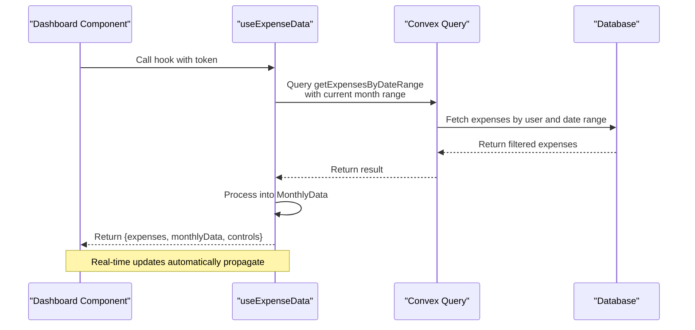
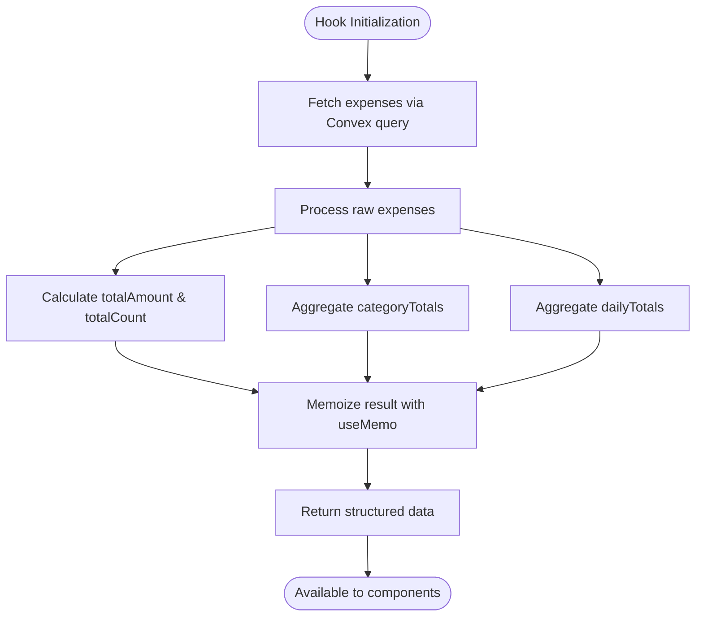
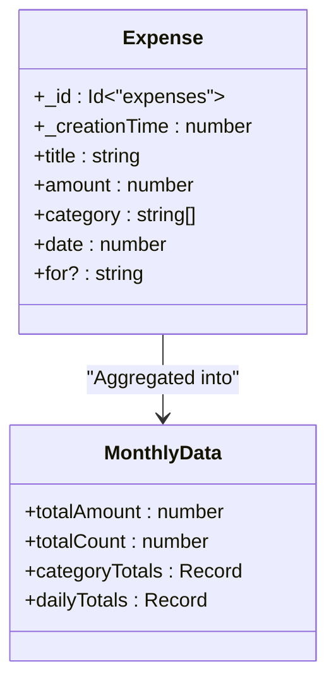
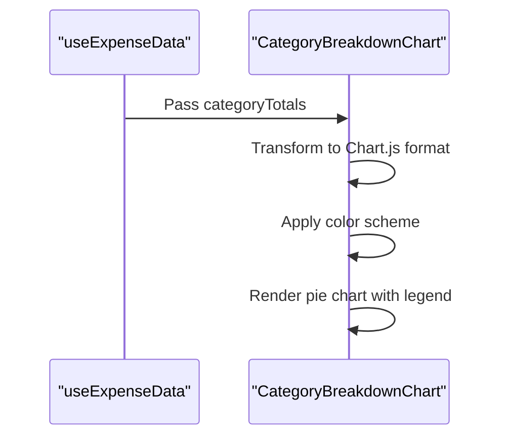
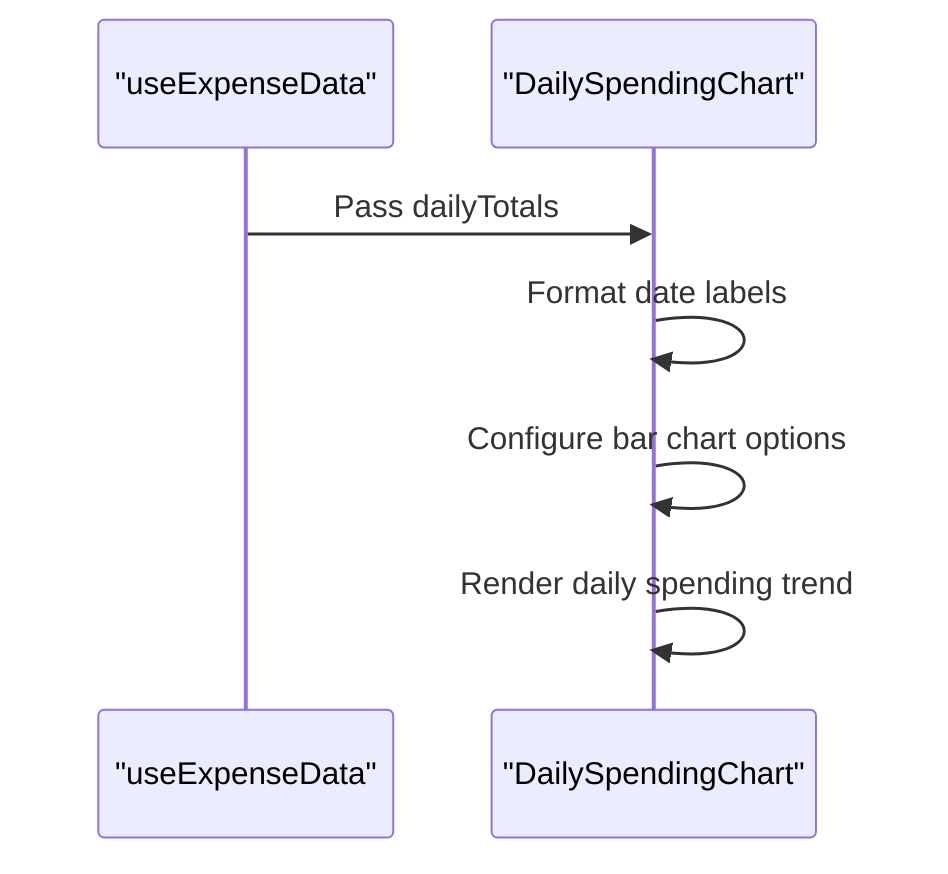
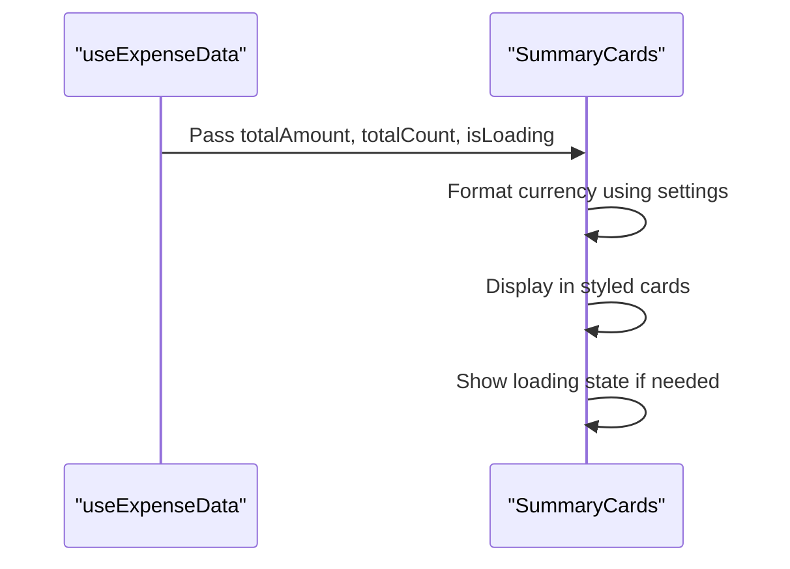

# Dashboard Hook - useExpenseData

<cite>
**Referenced Files in This Document**   
- [useExpenseData.ts](file://src/features/dashboard/hooks/useExpenseData.ts#L1-L87)
- [expense.ts](file://src/features/dashboard/types/expense.ts#L1-L21)
- [expenses.ts](file://convex/expenses.ts#L105-L124)
- [CategoryBreakdownChart.tsx](file://src/features/dashboard/components/Charts/CategoryBreakdownChart.tsx#L1-L100)
- [DailySpendingChart.tsx](file://src/features/dashboard/components/Charts/DailySpendingChart.tsx#L1-L95)
- [SummaryCards.tsx](file://src/features/dashboard/components/SummaryCards/SummaryCards.tsx#L1-L62)
- [useExpenseActions.ts](file://src/features/dashboard/hooks/useExpenseActions.ts#L1-L17)
</cite>

## Table of Contents
1. [Introduction](#introduction)
2. [Project Structure](#project-structure)
3. [Core Components](#core-components)
4. [Architecture Overview](#architecture-overview)
5. [Detailed Component Analysis](#detailed-component-analysis)
6. [Usage in Dashboard Components](#usage-in-dashboard-components)
7. [Extensibility and Filter Extensions](#extensibility-and-filter-extensions)
8. [Error Handling and Edge Cases](#error-handling-and-edge-cases)
9. [Performance Optimization](#performance-optimization)
10. [Conclusion](#conclusion)

## Introduction
The `useExpenseData` custom React hook is a central data abstraction layer in the Expense Tracker application, designed to manage expense data retrieval, filtering, and real-time synchronization for dashboard components. This hook leverages Convex's real-time query capabilities to fetch monthly expense data based on date ranges, processes it into structured summaries, and provides navigation controls for month-by-month browsing. It serves as the primary data source for visual components such as charts and summary cards, ensuring consistent, optimized, and responsive user experiences.

**Section sources**
- [useExpenseData.ts](file://src/features/dashboard/hooks/useExpenseData.ts#L1-L87)

## Project Structure
The project follows a feature-based architecture with clear separation between frontend components, backend logic, and shared types. The `useExpenseData` hook resides within the dashboard feature module, indicating its specialized role in supporting dashboard-specific functionality.

```mermaid
graph TB
subgraph "Frontend"
A[src/features/dashboard/hooks/useExpenseData.ts] --> B[src/features/dashboard/types/expense.ts]
A --> C[src/features/dashboard/components/Charts]
A --> D[src/features/dashboard/components/SummaryCards]
end
subgraph "Backend"
E[convex/expenses.ts] --> F[convex/schema.ts]
end
A --> E : "Queries via Convex API"
C --> A : "Consumes data"
D --> A : "Consumes data"
```

**Diagram sources**
- [useExpenseData.ts](file://src/features/dashboard/hooks/useExpenseData.ts#L1-L87)
- [expense.ts](file://src/features/dashboard/types/expense.ts#L1-L21)
- [expenses.ts](file://convex/expenses.ts#L105-L124)

## Core Components
The `useExpenseData` hook encapsulates several core responsibilities:
- Fetching expenses from Convex using date-range queries
- Processing raw expense data into aggregated monthly summaries
- Managing month navigation state
- Providing a refetch mechanism for cache invalidation
- Exposing loading states for UI feedback

The hook returns a structured object containing current date context, raw expenses, processed monthly data, and control functions.

**Section sources**
- [useExpenseData.ts](file://src/features/dashboard/hooks/useExpenseData.ts#L1-L87)

## Architecture Overview
The architecture follows a clean separation between data fetching (Convex queries), state management (React hooks), and presentation (dashboard components). The hook acts as an intermediary layer that transforms database results into consumable formats for visualization components.



**Diagram sources**
- [useExpenseData.ts](file://src/features/dashboard/hooks/useExpenseData.ts#L1-L87)
- [expenses.ts](file://convex/expenses.ts#L105-L124)

## Detailed Component Analysis

### useExpenseData Hook Implementation
The hook uses React's `useQuery` from Convex to fetch expenses for the current month based on the `currentDate` state. It employs a `key` state variable to force re-query when needed, serving as a cache-busting mechanism.

```typescript
export function useExpenseData(token: string | null) {
  const [currentDate, setCurrentDate] = useState(new Date());
  const [key, setKey] = useState(0);

  const result = useQuery(
    api.expenses.getExpensesByDateRange,
    token
      ? {
          token,
          startDate: startOfMonth(currentDate).getTime(),
          endDate: endOfMonth(currentDate).getTime(),
          key,
        }
      : "skip"
  );
  
  const expenses = result as unknown as Expense[] | undefined;
  const isLoading = result === undefined;
```

The hook processes the fetched expenses into a `monthlyData` structure using `useMemo` for performance optimization, calculating total amount, count, category totals, and daily spending patterns.



**Diagram sources**
- [useExpenseData.ts](file://src/features/dashboard/hooks/useExpenseData.ts#L1-L87)

**Section sources**
- [useExpenseData.ts](file://src/features/dashboard/hooks/useExpenseData.ts#L1-L87)

### Data Structures
The hook relies on two key TypeScript interfaces defined in the dashboard types module:



**Diagram sources**
- [expense.ts](file://src/features/dashboard/types/expense.ts#L1-L21)

**Section sources**
- [expense.ts](file://src/features/dashboard/types/expense.ts#L1-L21)

### Backend Query Implementation
The Convex query function `getExpensesByDateRange` retrieves all expenses for a user and filters them client-side by date range. This approach allows for efficient indexing by user while maintaining flexibility in date-based filtering.

```typescript
export const getExpensesByDateRange = query({
  args: {
    token: v.string(),
    startDate: v.number(),
    endDate: v.number(),
    key: v.optional(v.number()),
  },
  handler: async (ctx, args) => {
    const user = await getUserByToken(ctx, args.token);
    const expenses = await ctx.db
      .query("expenses")
      .withIndex("by_user", (q) => q.eq("userId", user._id))
      .collect();
    return expenses.filter(expense => 
      expense.date >= args.startDate && expense.date <= args.endDate
    );
  },
});
```

**Section sources**
- [expenses.ts](file://convex/expenses.ts#L105-L124)

## Usage in Dashboard Components

### Chart Components Integration
The processed data from `useExpenseData` is consumed by chart components to visualize spending patterns.

#### Category Breakdown Chart
The `CategoryBreakdownChart` component renders a pie chart showing expense distribution across categories using the `categoryTotals` from `monthlyData`.



**Diagram sources**
- [useExpenseData.ts](file://src/features/dashboard/hooks/useExpenseData.ts#L1-L87)
- [CategoryBreakdownChart.tsx](file://src/features/dashboard/components/Charts/CategoryBreakdownChart.tsx#L1-L100)

#### Daily Spending Chart
The `DailySpendingChart` component displays a bar chart of daily expenses using the `dailyTotals` data structure.



**Diagram sources**
- [useExpenseData.ts](file://src/features/dashboard/hooks/useExpenseData.ts#L1-L87)
- [DailySpendingChart.tsx](file://src/features/dashboard/components/Charts/DailySpendingChart.tsx#L1-L95)

### Summary Cards
The `SummaryCards` component displays key metrics from `monthlyData`, including total amount spent and number of expenses.



**Diagram sources**
- [useExpenseData.ts](file://src/features/dashboard/hooks/useExpenseData.ts#L1-L87)
- [SummaryCards.tsx](file://src/features/dashboard/components/SummaryCards/SummaryCards.tsx#L1-L62)

**Section sources**
- [SummaryCards.tsx](file://src/features/dashboard/components/SummaryCards/SummaryCards.tsx#L1-L62)

## Extensibility and Filter Extensions
The hook can be extended to support additional filter dimensions. For example, filtering by payment card or payee would require:

1. Adding new state variables for filter criteria
2. Modifying the query arguments to include filter parameters
3. Updating the backend query to support additional filtering

```typescript
// Example extension for card-based filtering
const [selectedCard, setSelectedCard] = useState<string | null>(null);

// Would require backend support for filtering by card
const result = useQuery(
  api.expenses.getExpensesByDateRange,
  token
    ? {
        token,
        startDate: startOfMonth(currentDate).getTime(),
        endDate: endOfMonth(currentDate).getTime(),
        cardId: selectedCard,
        key,
      }
    : "skip"
);
```

This would require corresponding updates to the Convex query function to accept and apply the additional filter parameter.

**Section sources**
- [useExpenseData.ts](file://src/features/dashboard/hooks/useExpenseData.ts#L1-L87)
- [expenses.ts](file://convex/expenses.ts#L105-L124)

## Error Handling and Edge Cases
The hook handles several edge cases:

- **Empty datasets**: When no expenses exist for a month, `monthlyData` returns null, and chart components handle this gracefully by rendering nothing.
- **Loading states**: The `isLoading` flag is derived from the query result being undefined, allowing components to show loading indicators.
- **Authentication**: The query is skipped when no token is provided, preventing unauthorized access attempts.
- **Date navigation**: Month navigation is handled through state updates that trigger new queries for the selected month.

The hook does not currently implement pagination, which could become necessary as the number of expenses grows. For large datasets, the current approach of fetching all user expenses and filtering client-side may impact performance.

**Section sources**
- [useExpenseData.ts](file://src/features/dashboard/hooks/useExpenseData.ts#L1-L87)
- [CategoryBreakdownChart.tsx](file://src/features/dashboard/components/Charts/CategoryBreakdownChart.tsx#L1-L100)
- [SummaryCards.tsx](file://src/features/dashboard/components/SummaryCards/SummaryCards.tsx#L1-L62)

## Performance Optimization
The hook employs several optimization strategies:

- **Memoization**: The `monthlyData` processing is wrapped in `useMemo` to prevent recalculation on every render.
- **Selective re-renders**: The hook only reprocesses data when the `expenses` array changes.
- **Cache busting**: The `key` state allows for manual query refetching when data freshness is critical.
- **Efficient querying**: Uses Convex indexes (`by_user`) for fast database lookups.

However, the current backend implementation could be optimized by moving the date filtering to the database query level rather than filtering in memory after fetching all expenses.

**Section sources**
- [useExpenseData.ts](file://src/features/dashboard/hooks/useExpenseData.ts#L1-L87)

## Conclusion
The `useExpenseData` hook serves as a robust data abstraction layer that effectively bridges the gap between the Convex backend and React frontend components. It provides a clean, consistent API for accessing and manipulating expense data, with built-in support for real-time updates, month navigation, and data aggregation. The hook's design enables efficient rendering of dashboard components while maintaining separation of concerns. Future improvements could include server-side filtering for better performance with large datasets and support for additional filter dimensions to enhance user experience.