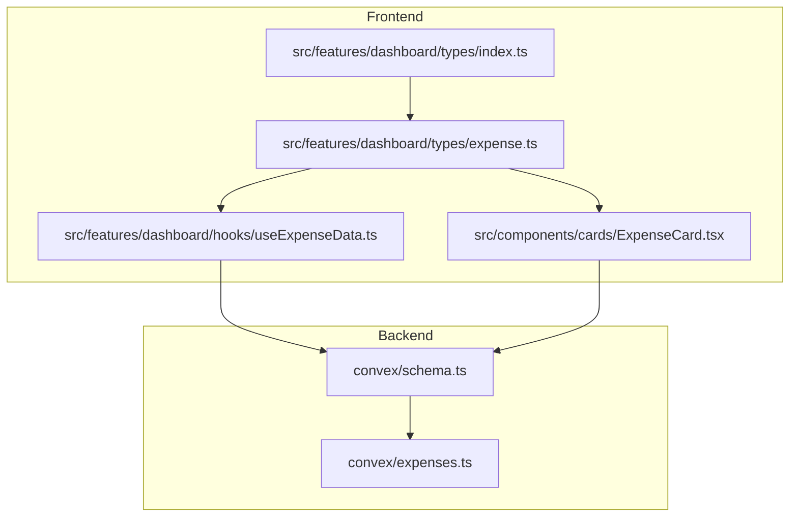
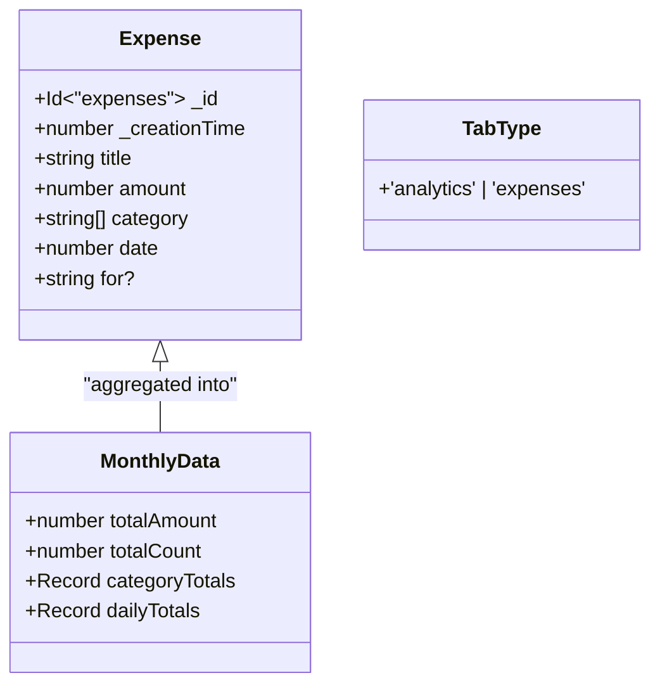
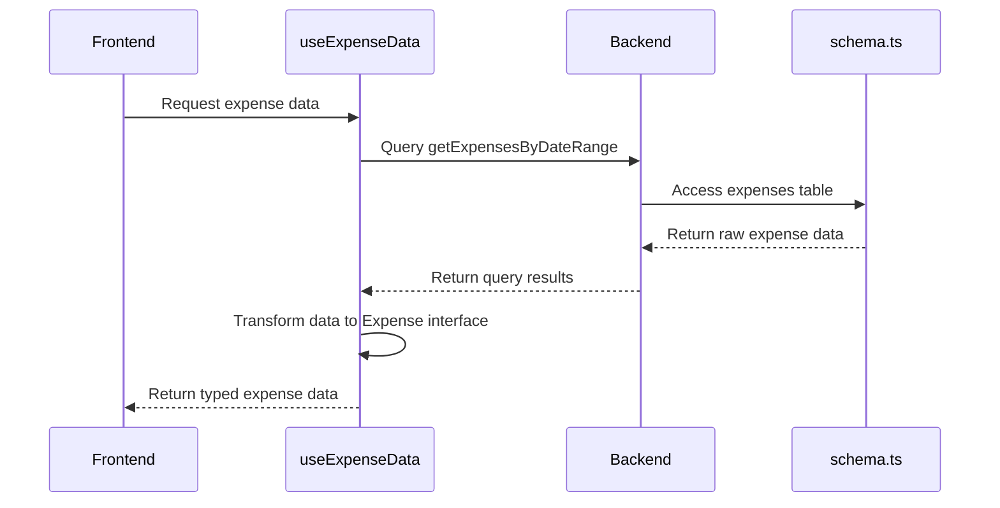

# Dashboard Type Definitions - Expense

<cite>
**Referenced Files in This Document**   
- [expense.ts](file://src/features/dashboard/types/expense.ts)
- [index.ts](file://src/features/dashboard/types/index.ts)
- [schema.ts](file://convex/schema.ts)
- [useExpenseData.ts](file://src/features/dashboard/hooks/useExpenseData.ts)
- [ExpenseCard.tsx](file://src/components/cards/ExpenseCard.tsx)
- [expenses.ts](file://convex/expenses.ts)
</cite>

## Table of Contents
1. [Introduction](#introduction)
2. [Project Structure](#project-structure)
3. [Core Data Models](#core-data-models)
4. [Type Definitions Analysis](#type-definitions-analysis)
5. [Backend Schema Alignment](#backend-schema-alignment)
6. [Type Export System](#type-export-system)
7. [Data Processing and Transformation](#data-processing-and-transformation)
8. [Usage Examples and Extensions](#usage-examples-and-extensions)
9. [Type Safety and Error Prevention](#type-safety-and-error-prevention)

## Introduction
This document provides comprehensive documentation for the TypeScript type definitions used in the dashboard module for expense tracking. The primary focus is on the `Expense` interface and related types defined in the `expense.ts` file, their alignment with the Convex backend schema, and their role in ensuring type safety across the application. The documentation covers the structure of the types, their relationships, and how they are used throughout the application to maintain consistency between frontend and backend.

## Project Structure
The project follows a feature-based organization with clear separation between frontend components, hooks, types, and backend Convex functions. The expense-related type definitions are located in the dashboard feature module, specifically in the types directory.



**Diagram sources**
- [expense.ts](file://src/features/dashboard/types/expense.ts)
- [index.ts](file://src/features/dashboard/types/index.ts)
- [schema.ts](file://convex/schema.ts)
- [useExpenseData.ts](file://src/features/dashboard/hooks/useExpenseData.ts)
- [ExpenseCard.tsx](file://src/components/cards/ExpenseCard.tsx)

**Section sources**
- [expense.ts](file://src/features/dashboard/types/expense.ts)
- [index.ts](file://src/features/dashboard/types/index.ts)
- [schema.ts](file://convex/schema.ts)

## Core Data Models
The core data model for expenses consists of the `Expense` interface which defines the structure of expense records in the application. This interface is used throughout the frontend to ensure type safety when working with expense data.

### Expense Interface Structure
The `Expense` interface defines the shape of expense objects with the following properties:

**Expense Interface Properties**
- `_id`: Id<"expenses"> - Unique identifier for the expense record
- `_creationTime`: number - Timestamp of when the expense was created
- `title`: string - Descriptive title of the expense
- `amount`: number - Monetary amount of the expense
- `category`: string[] - Array of category strings for the expense
- `date`: number - Timestamp representing the date of the expense
- `for?`: string - Optional field indicating what the expense was for



**Diagram sources**
- [expense.ts](file://src/features/dashboard/types/expense.ts#L4-L15)

**Section sources**
- [expense.ts](file://src/features/dashboard/types/expense.ts#L4-L15)

## Type Definitions Analysis
The type definitions in `expense.ts` provide a strongly-typed interface for working with expense data in the frontend application. These types ensure consistency and prevent runtime errors by catching type mismatches at compile time.

### Expense Interface Details
The `Expense` interface is the primary type definition for expense records. It uses the `Id<"expenses">` type from Convex to ensure type-safe references to expense documents. The interface includes both required and optional properties:

- **Required fields**: `_id`, `_creationTime`, `title`, `amount`, `category`, `date`
- **Optional field**: `for` (indicated by the `?` modifier)

The `category` field is defined as a string array, allowing expenses to belong to multiple categories simultaneously. This design choice enables more flexible categorization and reporting.

### MonthlyData Interface
The `MonthlyData` interface is used to represent aggregated expense data for a given month. It contains:

- `totalAmount`: Sum of all expense amounts
- `totalCount`: Total number of expenses
- `categoryTotals`: Record mapping category names to their total amounts
- `dailyTotals`: Record mapping date strings to daily expense totals

This interface is used by the `useExpenseData` hook to provide summarized data for dashboard displays.

### TabType Union Type
The `TabType` type is a string literal union that defines the two possible tab states in the dashboard interface: 'analytics' and 'expenses'. This type ensures type safety when working with tab state management.

**Section sources**
- [expense.ts](file://src/features/dashboard/types/expense.ts#L4-L19)

## Backend Schema Alignment
The frontend type definitions are carefully aligned with the backend schema defined in `schema.ts` to ensure consistency between client and server.

### Convex Schema Definition
The backend schema defines the `expenses` table with the following fields:

**Backend Expense Schema**
- `amount`: v.number() - Numeric amount
- `title`: v.string() - Title string
- `category`: v.array(v.string()) - Array of category strings
- `for`: v.array(v.string()) - Array of "for" values
- `date`: v.number() - Date timestamp
- `createdAt`: v.number() - Creation timestamp
- `userId`: v.id("users") - Reference to user
- `cardId`: v.optional(v.id("cards")) - Optional card reference

```mermaid
erDiagram
EXPENSES {
Id<"expenses"> _id PK
number _creationTime
string title
number amount
string[] category
string for
number date
}
USERS {
Id<"users"> _id PK
string username
string hashedPassword
string tokenIdentifier
}
EXPENSES ||--|{ USERS : "belongs to"
```

**Diagram sources**
- [schema.ts](file://convex/schema.ts#L10-L20)

**Section sources**
- [schema.ts](file://convex/schema.ts#L10-L20)
- [expense.ts](file://src/features/dashboard/types/expense.ts#L4-L15)

### Type Alignment Analysis
While the frontend and backend schemas are largely aligned, there are some differences that require attention:

1. **Field naming differences**: The frontend uses `_creationTime` while the backend uses `createdAt`
2. **Array vs string for "for" field**: The frontend defines `for` as a string, while the backend stores it as an array of strings
3. **Missing fields**: The frontend interface doesn't include `userId` and `cardId` fields present in the backend

These differences are managed through data transformation in the application's data access layer, ensuring that the frontend receives data in the expected format.

## Type Export System
The type export system in the dashboard module is designed to provide centralized access to type definitions through the `index.ts` file.

### Centralized Type Exports
The `index.ts` file in the types directory uses a re-export pattern to make the `Expense` interface and related types available to other modules:

```typescript
export * from './expense';
```

This approach provides several benefits:
- **Simplified imports**: Other modules can import types from `@/features/dashboard/types` without specifying the exact file
- **IDE autocompletion**: The index file enables better autocompletion and discovery of available types
- **Refactoring safety**: Changes to the internal file structure don't require updates to import statements throughout the codebase

### Import Usage Examples
The centralized export system is used throughout the application:

```typescript
// In hooks
import { Expense, MonthlyData } from "../types";

// In components  
import { Expense } from "@/features/dashboard/types";
```

This pattern ensures consistency in how types are imported and used across the application.

**Section sources**
- [index.ts](file://src/features/dashboard/types/index.ts#L1)
- [useExpenseData.ts](file://src/features/dashboard/hooks/useExpenseData.ts#L5)

## Data Processing and Transformation
The application includes data transformation logic to convert raw backend data into the format expected by the frontend type definitions.

### Data Transformation Pipeline
The data transformation process occurs in the `useExpenseData` hook, which processes raw expense data from the backend and transforms it to match the frontend type definitions.



**Diagram sources**
- [useExpenseData.ts](file://src/features/dashboard/hooks/useExpenseData.ts#L1-L85)
- [schema.ts](file://convex/schema.ts#L10-L20)

**Section sources**
- [useExpenseData.ts](file://src/features/dashboard/hooks/useExpenseData.ts#L1-L85)

### Transformation Logic
The transformation logic in `useExpenseData.ts` handles several key operations:

1. **Type casting**: The raw query result is cast to the `Expense[]` type
2. **Data aggregation**: The hook calculates monthly summaries and creates the `MonthlyData` object
3. **Sorting**: Expenses are sorted by creation time in descending order

The hook also handles the discrepancy between the frontend and backend `for` field by ensuring the data is presented in the expected format.

## Usage Examples and Extensions
The type definitions can be extended to support new features while maintaining type safety.

### Extending for Recurring Expenses
To support recurring expenses, the `Expense` interface could be extended:

```typescript
interface RecurringExpense extends Expense {
  recurrence: {
    type: 'daily' | 'weekly' | 'monthly' | 'yearly';
    interval: number;
    endDate?: number;
  };
  originalExpenseId?: Id<"expenses">;
}
```

### Adding Attachments Support
For attachment support, a new interface could be defined:

```typescript
interface ExpenseWithAttachments extends Expense {
  attachments: Array<{
    id: string;
    filename: string;
    url: string;
    size: number;
    uploadedAt: number;
  }>;
}
```

### Component Usage Example
The `ExpenseCard` component demonstrates how the type definitions are used in practice:

```typescript
interface ExpenseCardProps {
  expense: Expense;
  cardName: string;
  onDelete: () => void;
}
```

This ensures that the component receives properly typed expense data and provides type safety for its props.

**Section sources**
- [ExpenseCard.tsx](file://src/components/cards/ExpenseCard.tsx#L10-L18)
- [expense.ts](file://src/features/dashboard/types/expense.ts#L4-L15)

## Type Safety and Error Prevention
The type system provides several layers of protection against common errors.

### Compile-Time Error Prevention
The TypeScript interfaces catch several types of errors at compile time:

- **Missing required fields**: Omitting required fields like `title` or `amount` results in compilation errors
- **Type mismatches**: Assigning a string to the `amount` field (which expects a number) is caught by the type checker
- **Invalid property access**: Attempting to access non-existent properties on an `Expense` object is flagged

### Refactoring Safety
The type system makes refactoring safer by ensuring that changes to the data model are reflected throughout the codebase:

- **Field renames**: If a field is renamed in the interface, all usages must be updated
- **Type changes**: Changing a field's type requires updates to all code that uses that field
- **Interface extensions**: Adding new required fields requires updates to all object creation sites

### Data Transformation Safety
The data transformation pipeline includes type assertions that should be carefully reviewed:

```typescript
const expenses = result as unknown as Expense[] | undefined;
```

While this assertion allows the code to compile, it bypasses type checking. A safer approach would be to implement proper validation and transformation functions that ensure the data conforms to the expected type.

**Section sources**
- [useExpenseData.ts](file://src/features/dashboard/hooks/useExpenseData.ts#L20)
- [expense.ts](file://src/features/dashboard/types/expense.ts)