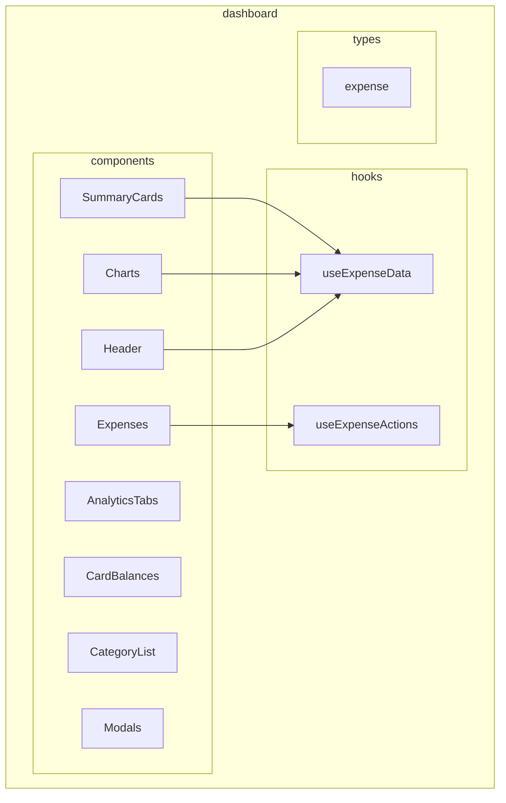
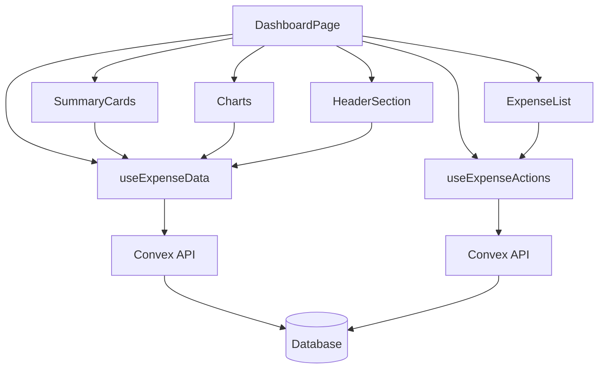
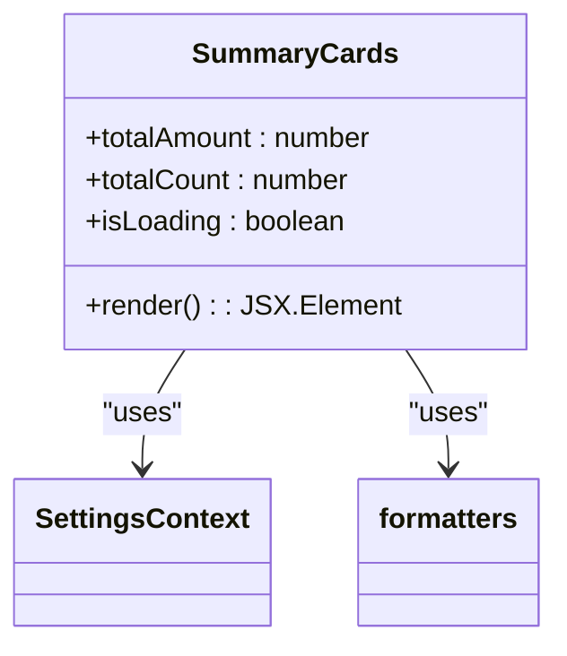
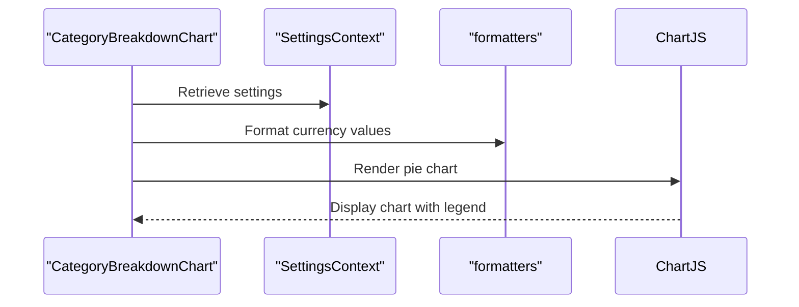
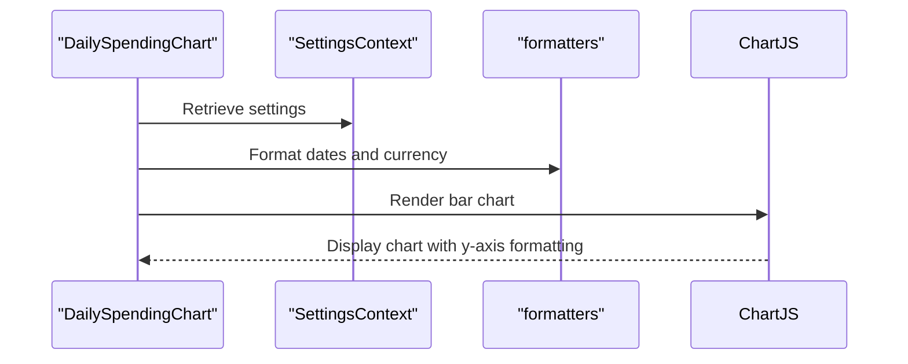
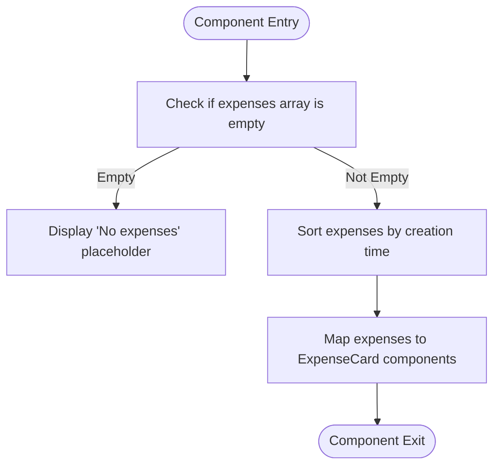
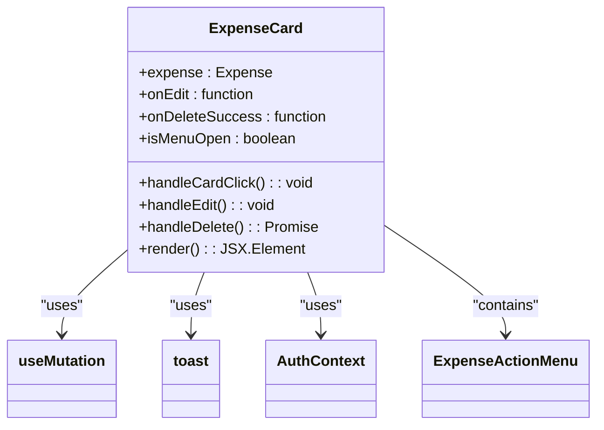
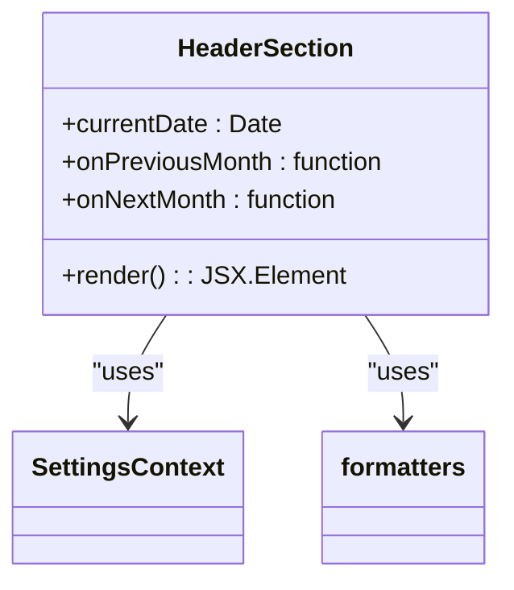
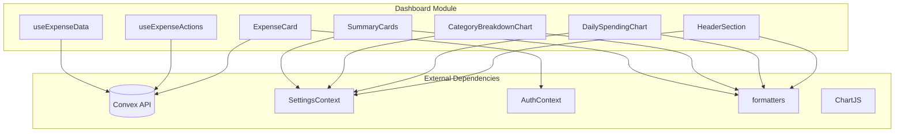

# Features - Dashboard Functional Module

<cite>
**Referenced Files in This Document**   
- [useExpenseData.ts](file://src/features/dashboard/hooks/useExpenseData.ts)
- [useExpenseActions.ts](file://src/features/dashboard/hooks/useExpenseActions.ts)
- [expense.ts](file://src/features/dashboard/types/expense.ts)
- [SummaryCards.tsx](file://src/features/dashboard/components/SummaryCards/SummaryCards.tsx)
- [CategoryBreakdownChart.tsx](file://src/features/dashboard/components/Charts/CategoryBreakdownChart.tsx)
- [DailySpendingChart.tsx](file://src/features/dashboard/components/Charts/DailySpendingChart.tsx)
- [ExpenseList.tsx](file://src/features/dashboard/components/Expenses/ExpenseList.tsx)
- [ExpenseCard.tsx](file://src/features/dashboard/components/Expenses/ExpenseCard.tsx)
- [HeaderSection.tsx](file://src/features/dashboard/components/Header/HeaderSection.tsx)
- [index.ts](file://src/features/dashboard/hooks/index.ts)
- [index.ts](file://src/features/dashboard/types/index.ts)
- [page.tsx](file://src/app/dashboard/page.tsx)
</cite>

## Table of Contents
1. [Introduction](#introduction)
2. [Project Structure](#project-structure)
3. [Core Components](#core-components)
4. [Architecture Overview](#architecture-overview)
5. [Detailed Component Analysis](#detailed-component-analysis)
6. [Dependency Analysis](#dependency-analysis)
7. [Performance Considerations](#performance-considerations)
8. [Conclusion](#conclusion)

## Introduction
The dashboard module in the Expense Tracker application provides a comprehensive financial overview interface that visualizes spending patterns, summarizes expenses, and enables user interaction with expense data. This document details the architecture, components, data flow, and integration patterns of the dashboard module, focusing on its key features including financial summaries, data visualization, and expense management.

## Project Structure
The dashboard module follows a feature-based organization with clearly separated concerns for components, hooks, and types. The structure promotes modularity and maintainable code organization.

**Diagram sources**
- [src/features/dashboard](file://src/features/dashboard)

**Section sources**
- [src/features/dashboard](file://src/features/dashboard)

## Core Components
The dashboard module consists of several core components that work together to provide a cohesive user experience. These include UI components for displaying financial data, custom hooks for data management, and type definitions for ensuring type safety.

**Section sources**
- [src/features/dashboard/components](file://src/features/dashboard/components)
- [src/features/dashboard/hooks](file://src/features/dashboard/hooks)
- [src/features/dashboard/types](file://src/features/dashboard/types)

## Architecture Overview
The dashboard module implements a clean separation of concerns with components responsible for presentation, hooks managing data and business logic, and types ensuring data integrity. The architecture follows React best practices with custom hooks abstracting complex logic and components focusing on UI rendering.

**Diagram sources**
- [page.tsx](file://src/app/dashboard/page.tsx)
- [useExpenseData.ts](file://src/features/dashboard/hooks/useExpenseData.ts)
- [useExpenseActions.ts](file://src/features/dashboard/hooks/useExpenseActions.ts)

## Detailed Component Analysis

### SummaryCards Component
The SummaryCards component displays key financial metrics in a card-based layout, providing users with an immediate overview of their spending.

**Diagram sources**
- [SummaryCards.tsx](file://src/features/dashboard/components/SummaryCards/SummaryCards.tsx)

**Section sources**
- [SummaryCards.tsx](file://src/features/dashboard/components/SummaryCards/SummaryCards.tsx)

### Charts Components
The dashboard includes two primary chart components for visualizing spending patterns: CategoryBreakdownChart and DailySpendingChart.

#### Category Breakdown Chart
Visualizes expenses by category using a pie chart, with color-coded segments and formatted currency tooltips.

**Diagram sources**
- [CategoryBreakdownChart.tsx](file://src/features/dashboard/components/Charts/CategoryBreakdownChart.tsx)

#### Daily Spending Chart
Displays daily spending patterns using a bar chart, showing expenses over time with proper date formatting.

**Diagram sources**
- [DailySpendingChart.tsx](file://src/features/dashboard/components/Charts/DailySpendingChart.tsx)

**Section sources**
- [CategoryBreakdownChart.tsx](file://src/features/dashboard/components/Charts/CategoryBreakdownChart.tsx)
- [DailySpendingChart.tsx](file://src/features/dashboard/components/Charts/DailySpendingChart.tsx)

### Expenses Management Components
The expenses management system consists of components for listing and interacting with individual expense entries.

#### ExpenseList Component
Renders a list of expenses sorted by creation time, with animation for smooth updates.

**Diagram sources**
- [ExpenseList.tsx](file://src/features/dashboard/components/Expenses/ExpenseList.tsx)

#### ExpenseCard Component
Displays individual expense details and provides access to edit/delete actions through a context menu.

**Diagram sources**
- [ExpenseCard.tsx](file://src/features/dashboard/components/Expenses/ExpenseCard.tsx)

**Section sources**
- [ExpenseList.tsx](file://src/features/dashboard/components/Expenses/ExpenseList.tsx)
- [ExpenseCard.tsx](file://src/features/dashboard/components/Expenses/ExpenseCard.tsx)

### Header Component
The HeaderSection component provides month navigation controls and displays the current period.

**Diagram sources**
- [HeaderSection.tsx](file://src/features/dashboard/components/Header/HeaderSection.tsx)

**Section sources**
- [HeaderSection.tsx](file://src/features/dashboard/components/Header/HeaderSection.tsx)

## Dependency Analysis
The dashboard module has well-defined dependencies that follow the dependency inversion principle, with components depending on abstractions rather than concrete implementations.

**Diagram sources**
- [useExpenseData.ts](file://src/features/dashboard/hooks/useExpenseData.ts)
- [useExpenseActions.ts](file://src/features/dashboard/hooks/useExpenseActions.ts)
- [SummaryCards.tsx](file://src/features/dashboard/components/SummaryCards/SummaryCards.tsx)
- [CategoryBreakdownChart.tsx](file://src/features/dashboard/components/Charts/CategoryBreakdownChart.tsx)
- [DailySpendingChart.tsx](file://src/features/dashboard/components/Charts/DailySpendingChart.tsx)
- [HeaderSection.tsx](file://src/features/dashboard/components/Header/HeaderSection.tsx)
- [ExpenseCard.tsx](file://src/features/dashboard/components/Expenses/ExpenseCard.tsx)

**Section sources**
- [src/features/dashboard/hooks](file://src/features/dashboard/hooks)
- [src/features/dashboard/components](file://src/features/dashboard/components)

## Performance Considerations
The dashboard module implements several performance optimizations to ensure smooth user experience:

1. **Memoization**: The `monthlyData` object in `useExpenseData` is memoized using `useMemo` to prevent unnecessary recalculations when expenses data hasn't changed.

2. **Efficient Rendering**: Components use `useMemo` and `useCallback` to prevent unnecessary re-renders, and `AnimatePresence` from framer-motion for smooth list transitions.

3. **Data Fetching**: The module uses Convex's real-time capabilities with proper dependency management, and implements a key-based refetch mechanism to control data updates.

4. **Chart Optimization**: Charts are rendered with `maintainAspectRatio: false` and specific height constraints to prevent layout thrashing.

5. **Conditional Rendering**: Components like charts and summary cards conditionally render based on data availability, avoiding unnecessary DOM operations.

6. **Event Delegation**: The ExpenseCard component uses event delegation for the context menu, reducing the number of event listeners.

**Section sources**
- [useExpenseData.ts](file://src/features/dashboard/hooks/useExpenseData.ts#L30-L45)
- [ExpenseCard.tsx](file://src/features/dashboard/components/Expenses/ExpenseCard.tsx#L25-L35)

## Conclusion
The dashboard module in the Expense Tracker application demonstrates a well-architected React component system with clear separation of concerns. By organizing functionality into components, hooks, and types, the module achieves high maintainability and reusability. The use of custom hooks abstracts complex data fetching and mutation logic, while the component hierarchy ensures a consistent user experience. Integration with Convex provides real-time data capabilities, and the implementation of performance optimizations ensures a responsive interface. The module can be extended with additional visualizations or data filters by following the established patterns of creating new components that consume data from the existing hooks.