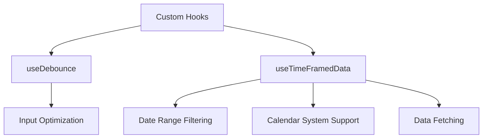
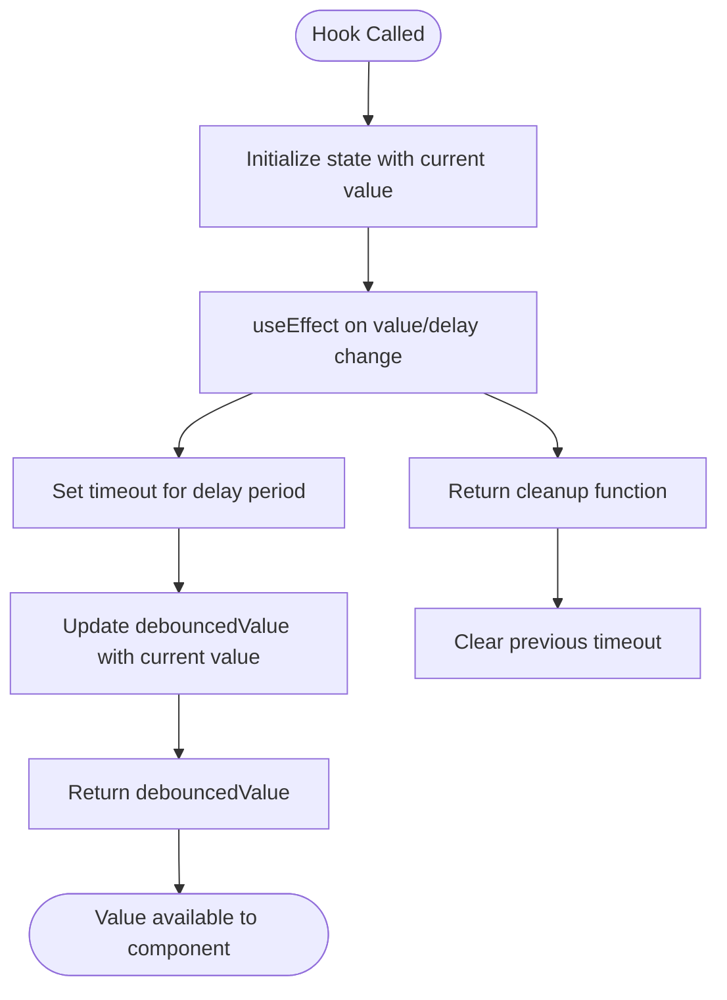
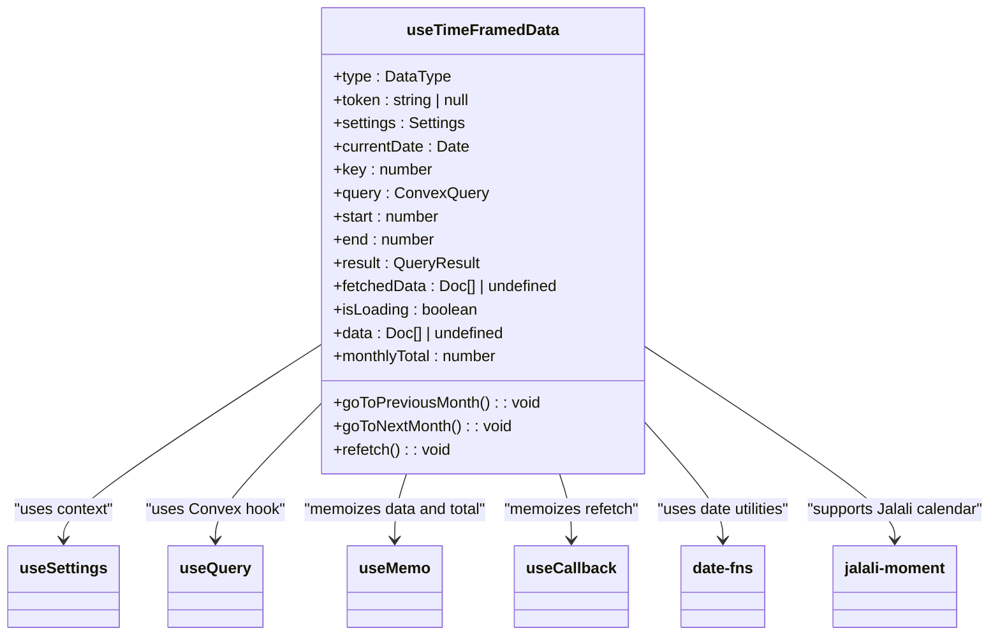
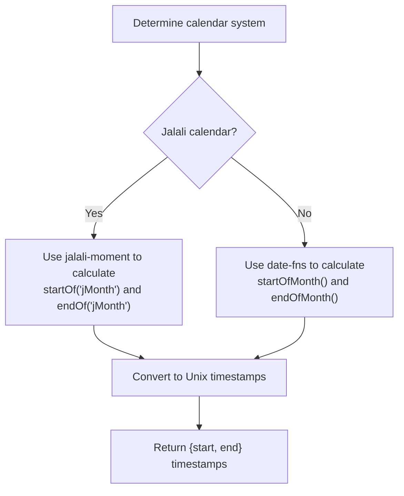
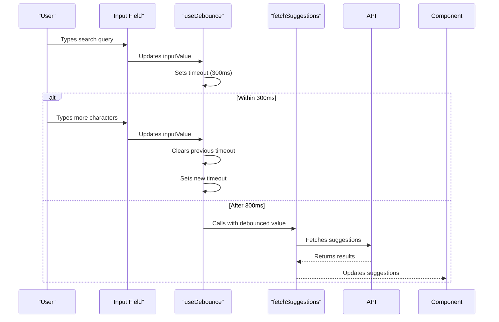
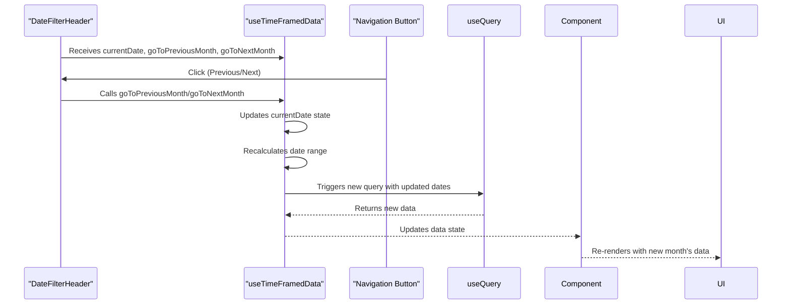

# Hooks - Shared Logic Abstractions

<cite>
**Referenced Files in This Document**   
- [useDebounce.ts](file://src/hooks/useDebounce.ts)
- [useTimeFramedData.ts](file://src/hooks/useTimeFramedData.ts)
- [SmartSelectInput.tsx](file://src/components/SmartSelectInput.tsx)
- [expenses/page.tsx](file://src/app/expenses/page.tsx)
- [income/page.tsx](file://src/app/income/page.tsx)
- [DateFilterHeader.tsx](file://src/components/DateFilterHeader.tsx)
- [formatters.ts](file://src/lib/formatters.ts)
</cite>

## Table of Contents
1. [Introduction](#introduction)
2. [Core Hooks Overview](#core-hooks-overview)
3. [useDebounce Hook Analysis](#usedebounce-hook-analysis)
4. [useTimeFramedData Hook Analysis](#usetimeframeddata-hook-analysis)
5. [Usage Examples and Implementation Contexts](#usage-examples-and-implementation-contexts)
6. [Performance and Optimization Benefits](#performance-and-optimization-benefits)
7. [Best Practices for Creating New Hooks](#best-practices-for-creating-new-hooks)
8. [Conclusion](#conclusion)

## Introduction
This document provides comprehensive documentation for the custom React hooks in the `hooks/` directory of the Expense Tracker application. These hooks encapsulate reusable logic for common patterns such as input debouncing and time-based data filtering. The analysis covers implementation details, usage patterns, performance benefits, and best practices for extending the hook system. The documentation is designed to be accessible to developers with varying levels of technical expertise while providing deep technical insights for advanced users.

## Core Hooks Overview
The `hooks/` directory contains two primary custom React hooks that serve distinct purposes in the application:

1. **useDebounce**: Delays the processing of rapidly changing values (like user input) to optimize performance
2. **useTimeFramedData**: Filters financial records based on configurable date ranges and calendar systems

These hooks follow React's custom hook conventions by using the `use` prefix and leveraging built-in hooks like `useState`, `useEffect`, `useMemo`, and `useCallback` to manage state, side effects, and memoization.



**Diagram sources**
- [useDebounce.ts](file://src/hooks/useDebounce.ts)
- [useTimeFramedData.ts](file://src/hooks/useTimeFramedData.ts)

**Section sources**
- [useDebounce.ts](file://src/hooks/useDebounce.ts)
- [useTimeFramedData.ts](file://src/hooks/useTimeFramedData.ts)

## useDebounce Hook Analysis
The `useDebounce` hook implements a standard debouncing pattern to delay the propagation of rapidly changing values, typically used with user input fields to prevent excessive processing.

### Type Signature and Parameters
```typescript
export function useDebounce<T>(value: T, delay: number): T
```

**Parameters:**
- `value`: The input value to debounce (generic type T)
- `delay`: The delay time in milliseconds before the value is updated

**Return Value:**
- The debounced value of type T, which updates after the specified delay when the input value changes

### Implementation Details
The hook uses `useState` to maintain the debounced value and `useEffect` to set up and clean up the timeout:



**Diagram sources**
- [useDebounce.ts](file://src/hooks/useDebounce.ts#L2-L16)

### Key Implementation Patterns
- **Generic Type Parameter**: The hook is generic (`<T>`) to work with any data type
- **Dependency Array**: The effect depends on both `value` and `delay` to respond to changes in either
- **Cleanup Function**: Returns a cleanup function to clear the timeout, preventing memory leaks and race conditions
- **Immediate Return**: Returns the debounced value immediately, which initially equals the input value

**Section sources**
- [useDebounce.ts](file://src/hooks/useDebounce.ts#L2-L16)

## useTimeFramedData Hook Analysis
The `useTimeFramedData` hook provides comprehensive functionality for filtering financial records based on date ranges, with support for multiple calendar systems and navigation controls.

### Type Signature and Parameters
```typescript
export function useTimeFramedData(type: DataType, token: string | null)
```

**Type Definitions:**
```typescript
type DataType = "expense" | "income";
```

**Parameters:**
- `type`: Specifies whether to fetch expense or income data
- `token`: Authentication token for data access (null when unauthenticated)

**Return Object:**
The hook returns an object containing:
- `currentDate`: Current date being viewed
- `data`: Filtered and sorted financial records
- `monthlyTotal`: Sum of all amounts in the current time frame
- `isLoading`: Boolean indicating loading state
- `goToPreviousMonth`: Function to navigate to previous month
- `goToNextMonth`: Function to navigate to next month
- `refetch`: Function to refresh data (cache busting)

### Implementation Architecture


**Diagram sources**
- [useTimeFramedData.ts](file://src/hooks/useTimeFramedData.ts#L10-L95)

### Key Implementation Patterns
- **Calendar System Support**: Detects user preference (Gregorian vs. Jalali) from settings context
- **Dynamic Query Selection**: Chooses between expense and income queries based on type parameter
- **Date Range Calculation**: Computes month boundaries using appropriate date libraries
- **Cache Busting**: Uses a key state variable to force query refetching
- **Memoization**: Uses `useMemo` to prevent unnecessary recalculations of sorted data and totals
- **Callback Memoization**: Uses `useCallback` to memoize the refetch function

### Date Range Calculation Logic
The hook implements different date range calculations based on the calendar system:



**Section sources**
- [useTimeFramedData.ts](file://src/hooks/useTimeFramedData.ts#L10-L95)

## Usage Examples and Implementation Contexts
The custom hooks are integrated into various components across the application, demonstrating their reusability and practical benefits.

### useDebounce Usage Example
The `useDebounce` hook is used in the `SmartSelectInput` component to optimize search functionality:



**Code Implementation:**
```typescript
const debouncedSearchTerm = useDebounce(inputValue, 300);

useEffect(() => {
  const fetchAndSetSuggestions = async () => {
    if (!debouncedSearchTerm) {
      setSuggestions([]);
      return;
    }
    // Fetch suggestions using debouncedSearchTerm
  };
  // ... effect logic
}, [debouncedSearchTerm, /* other dependencies */]);
```

This implementation prevents excessive API calls during rapid typing, improving performance and reducing server load.

**Section sources**
- [SmartSelectInput.tsx](file://src/components/SmartSelectInput.tsx#L38)
- [useDebounce.ts](file://src/hooks/useDebounce.ts)

### useTimeFramedData Usage Examples
The `useTimeFramedData` hook is used in both the expenses and income pages to manage time-framed financial data.

#### Expenses Page Implementation
```typescript
const { 
  currentDate, 
  data: expenses, 
  isLoading,
  goToPreviousMonth, 
  goToNextMonth, 
  refetch 
} = useTimeFramedData('expense', token);
```

#### Income Page Implementation
```typescript
const { 
  currentDate, 
  data: income, 
  isLoading,
  goToPreviousMonth, 
  goToNextMonth, 
  refetch 
} = useTimeFramedData('income', token);
```

#### Integration with DateFilterHeader
The hook's navigation functions are passed to the `DateFilterHeader` component:

```typescript
<DateFilterHeader 
  currentDate={currentDate} 
  onPreviousMonth={goToPreviousMonth} 
  onNextMonth={goToNextMonth} 
  title="Expenses History"
/>
```



**Diagram sources**
- [expenses/page.tsx](file://src/app/expenses/page.tsx#L72)
- [income/page.tsx](file://src/app/income/page.tsx#L66)
- [DateFilterHeader.tsx](file://src/components/DateFilterHeader.tsx)

**Section sources**
- [expenses/page.tsx](file://src/app/expenses/page.tsx)
- [income/page.tsx](file://src/app/income/page.tsx)
- [DateFilterHeader.tsx](file://src/components/DateFilterHeader.tsx)

## Performance and Optimization Benefits
Both hooks provide significant performance optimizations for the application.

### useDebounce Performance Benefits
- **Reduced API Calls**: Prevents excessive backend requests during rapid user input
- **Improved Responsiveness**: Maintains UI responsiveness by avoiding expensive operations on every keystroke
- **Lower Server Load**: Reduces server load and bandwidth usage
- **Better User Experience**: Eliminates lag during typing in search fields

**Performance Impact Analysis:**
Without debouncing, typing a 10-character search term could trigger 10 API calls. With a 300ms debounce, it typically triggers only 1-2 calls, representing an 80-90% reduction in network requests.

### useTimeFramedData Performance Benefits
- **Efficient Data Fetching**: Only retrieves data for the current time frame
- **Memoized Computations**: Avoids recalculating sorted data and totals on every render
- **Cache Management**: Uses key-based cache busting for controlled refetching
- **Calendar Optimization**: Efficient date calculations using specialized libraries

**Data Flow Optimization:**
```mermaid
flowchart LR
A[User Action] --> B{Needs Data Refresh?}
B --> |Yes| C[Call refetch()]
B --> |No| D[Use memoized data]
C --> E[Increment key state]
E --> F[Trigger useQuery re-execution]
F --> G[Fetch new data]
G --> H[Update memoized values]
H --> I[Re-render component]
D --> I
```

**Section sources**
- [useDebounce.ts](file://src/hooks/useDebounce.ts)
- [useTimeFramedData.ts](file://src/hooks/useTimeFramedData.ts)

## Best Practices for Creating New Hooks
Based on the existing hook implementations, the following best practices should be followed when creating new custom hooks:

### Design Principles
- **Single Responsibility**: Each hook should address one specific concern
- **Reusability**: Design hooks to be usable across multiple components
- **Type Safety**: Use TypeScript generics and precise type definitions
- **Self-Contained**: Minimize external dependencies beyond React and essential utilities

### Implementation Guidelines
- **Use Appropriate React Hooks**: Leverage `useState`, `useEffect`, `useMemo`, `useCallback` as needed
- **Handle Cleanup**: Always clean up side effects (timers, subscriptions, etc.)
- **Memoize Expensive Operations**: Use `useMemo` for derived data and `useCallback` for functions
- **Provide Clear APIs**: Use descriptive parameter names and comprehensive JSDoc comments

### Example Hook Template
```typescript
import { useState, useEffect, useMemo, useCallback } from 'react';

// Define specific types for the hook
type HookInputType = /* specific type */;
type HookReturnType = {
  data: DataType[];
  isLoading: boolean;
  refresh: () => void;
  /* other properties */
};

/**
 * Custom hook description
 * @param param1 - Description of first parameter
 * @param param2 - Description of second parameter
 * @returns Object with hook return values
 */
export function useCustomHook(param1: HookInputType, param2: string): HookReturnType {
  // State declarations
  const [state, setState] = useState<DataType[]>([]);
  const [isLoading, setIsLoading] = useState(false);
  
  // Memoized values
  const processedData = useMemo(() => {
    // Expensive processing
    return state.sort(/* sorting logic */);
  }, [state]);
  
  // Callback functions
  const refresh = useCallback(() => {
    setIsLoading(true);
    // Fetch or update logic
    setIsLoading(false);
  }, [/* dependencies */]);
  
  // Side effects
  useEffect(() => {
    // Setup logic
    return () => {
      // Cleanup logic
    };
  }, [/* dependencies */]);
  
  // Return hook API
  return {
    data: processedData,
    isLoading,
    refresh,
    // other return values
  };
}
```

### Testing Considerations
- **Unit Tests**: Test hook logic in isolation using React Testing Library
- **Edge Cases**: Test null/undefined inputs, empty arrays, and error conditions
- **Performance**: Verify that memoization works correctly and prevents unnecessary re-renders
- **Cleanup**: Ensure side effects are properly cleaned up

**Section sources**
- [useDebounce.ts](file://src/hooks/useDebounce.ts)
- [useTimeFramedData.ts](file://src/hooks/useTimeFramedData.ts)

## Conclusion
The custom hooks in the `hooks/` directory effectively encapsulate reusable logic for common patterns in the Expense Tracker application. The `useDebounce` hook optimizes performance during rapid user interactions by delaying input processing, while the `useTimeFramedData` hook provides comprehensive functionality for filtering financial records based on date ranges with support for multiple calendar systems.

Both hooks demonstrate excellent use of React's hook system, leveraging `useState`, `useEffect`, `useMemo`, and `useCallback` to manage state, side effects, and performance optimizations. They follow best practices for custom hook design, including clear APIs, proper cleanup, and type safety.

The implementation patterns established by these hooks provide a solid foundation for creating additional custom hooks in the future. By following the documented best practices, developers can create reusable, testable, and performant hooks that enhance the maintainability and scalability of the application.

The integration of these hooks with components like `SmartSelectInput`, `expenses/page.tsx`, and `income/page.tsx` demonstrates their practical value in real-world scenarios, improving both application performance and developer productivity.