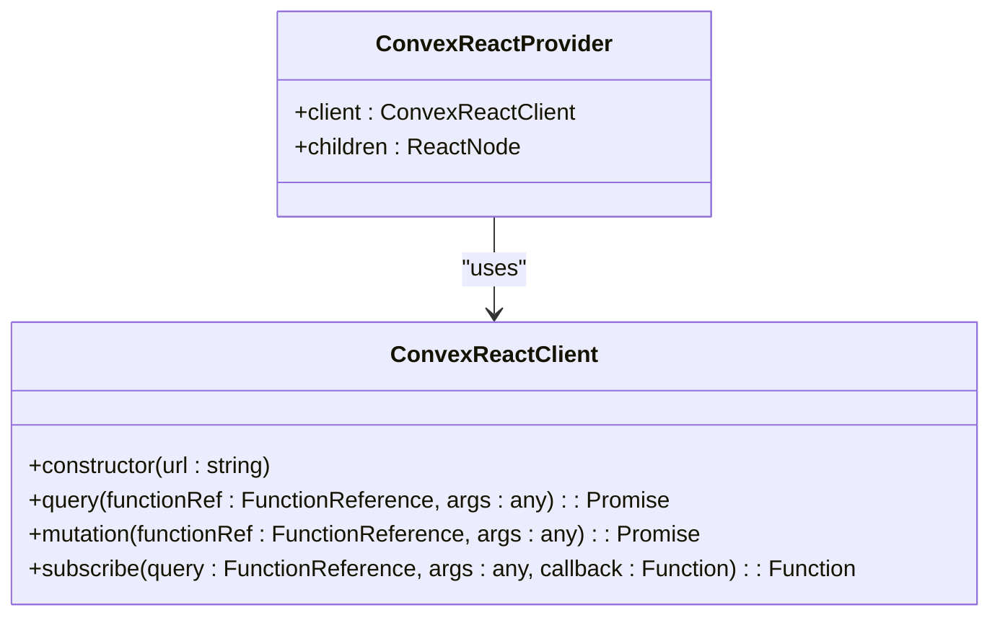
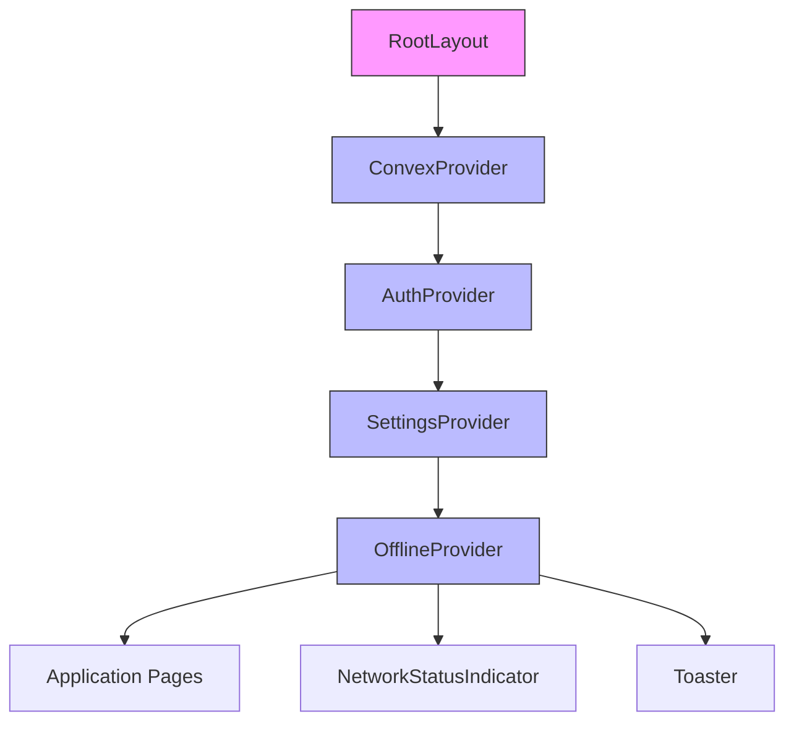
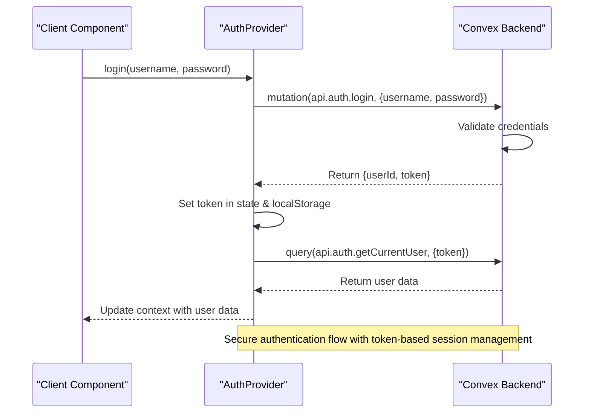
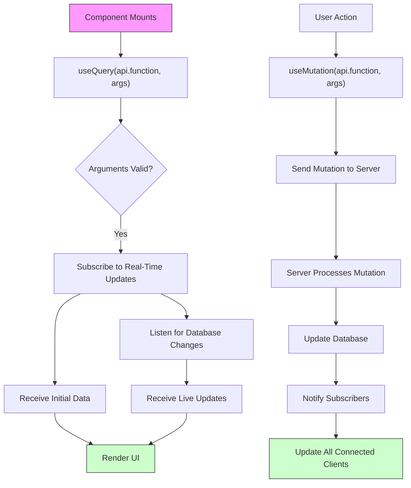
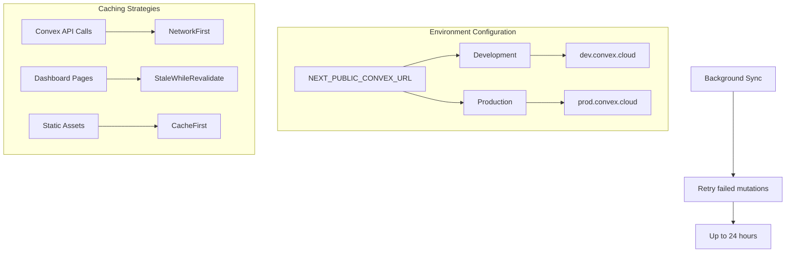
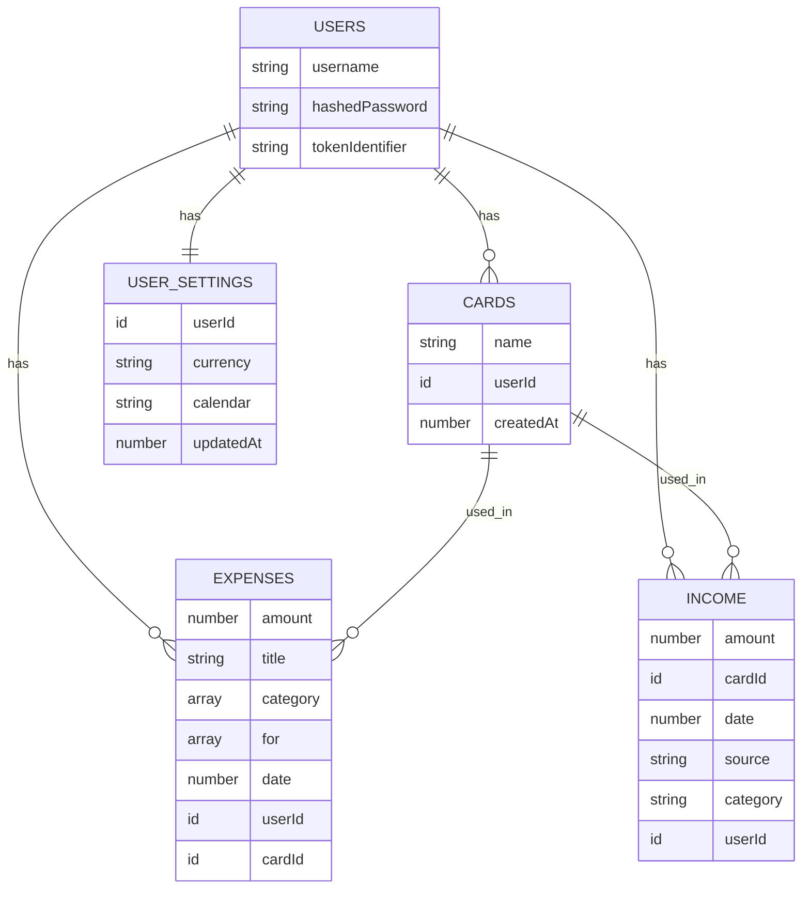

# Providers - Application-Wide Services

<cite>
**Referenced Files in This Document**   
- [ConvexProvider.tsx](file://src/providers/ConvexProvider.tsx)
- [layout.tsx](file://src/app/layout.tsx)
- [AuthContext.tsx](file://src/contexts/AuthContext.tsx)
- [schema.ts](file://convex/schema.ts)
- [next.config.mjs](file://next.config.mjs)
</cite>

## Table of Contents
1. [Introduction](#introduction)
2. [ConvexProvider Implementation](#convexprovider-implementation)
3. [Integration with Application Providers](#integration-with-application-providers)
4. [Authentication Flow with AuthContext](#authentication-flow-with-authcontext)
5. [Using Convex Queries and Mutations](#using-convex-queries-and-mutations)
6. [Error Handling and Connection States](#error-handling-and-connection-states)
7. [Environment Configuration and Optimization](#environment-configuration-and-optimization)
8. [Real-Time Subscriptions and Performance Tips](#real-time-subscriptions-and-performance-tips)

## Introduction
The `ConvexProvider` component is a foundational element in the application architecture, responsible for initializing and configuring the Convex client to enable real-time data synchronization across the entire application. It wraps the app with Convex's React integration, allowing components to access live data through queries and perform state mutations securely. This document provides a comprehensive analysis of how `ConvexProvider` is implemented, integrated, and optimized within the expense tracking application.

**Section sources**
- [ConvexProvider.tsx](file://src/providers/ConvexProvider.tsx)

## ConvexProvider Implementation
The `ConvexProvider` component initializes the Convex client using environment variables and provides it to the React component tree via context. It acts as a wrapper that enables all child components to interact with the Convex backend for real-time data access.

```tsx
"use client";

import { ConvexProvider as ConvexReactProvider } from "convex/react";
import { ConvexReactClient } from "convex/react";
import { ReactNode } from "react";

const convex = new ConvexReactClient(process.env.NEXT_PUBLIC_CONVEX_URL!);

export function ConvexProvider({ children }: { children: ReactNode }) {
  return (
    <ConvexReactProvider client={convex}>
      {children}
    </ConvexReactProvider>
  );
}
```

This implementation uses the `ConvexReactClient` from the `convex/react` package, which connects to the Convex deployment specified by the `NEXT_PUBLIC_CONVEX_URL` environment variable. The client instance is created at module level to ensure singleton behavior across the application.



**Diagram sources**
- [ConvexProvider.tsx](file://src/providers/ConvexProvider.tsx#L6-L8)

**Section sources**
- [ConvexProvider.tsx](file://src/providers/ConvexProvider.tsx#L1-L15)

## Integration with Application Providers
The `ConvexProvider` is integrated at the root layout level, ensuring that all application components have access to the Convex client. It is wrapped around other context providers to establish a proper dependency hierarchy.

```tsx
// src/app/layout.tsx
import { ConvexProvider } from "@/providers/ConvexProvider";
import { AuthProvider } from "@/contexts/AuthContext";
import { SettingsProvider } from "@/contexts/SettingsContext";
import { OfflineProvider } from "@/contexts/OfflineContext";

export default function RootLayout({ children }: { children: React.ReactNode }) {
  return (
    <html lang="en">
      <body>
        <ConvexProvider>
          <AuthProvider>
            <SettingsProvider>
              <OfflineProvider>
                {children}
                <div id="modal-root"></div>
                <NetworkStatusIndicator />
                <Toaster position="top-center" />
              </OfflineProvider>
            </SettingsProvider>
          </AuthProvider>
        </ConvexProvider>
      </body>
    </html>
  );
}
```

This hierarchical structure ensures that:
- Convex client is available to all providers
- Authentication state (AuthProvider) can use Convex queries/mutations
- Settings and offline states depend on authenticated Convex access
- Network status indicators can reflect Convex connection state



**Diagram sources**
- [layout.tsx](file://src/app/layout.tsx#L1-L58)

**Section sources**
- [layout.tsx](file://src/app/layout.tsx#L1-L58)

## Authentication Flow with AuthContext
The `AuthContext` integrates with Convex to manage user sessions and secure API calls. It uses Convex queries and mutations to handle login, registration, and session validation.

```tsx
// src/contexts/AuthContext.tsx
const loginMutation = useMutation(api.auth.login);
const user = useQuery(api.auth.getCurrentUser, token ? { token } : "skip");

const login = async (username: string, password: string) => {
  const result = await loginMutation({ username, password });
  setToken(result.token);
  localStorage.setItem("auth-token", result.token);
};
```

The authentication flow works as follows:
1. User submits credentials
2. `loginMutation` calls Convex function `auth.login`
3. Server validates credentials and returns authentication token
4. Token is stored in localStorage and context state
5. `getCurrentUser` query uses token to fetch user data
6. User session is maintained across page reloads



**Diagram sources**
- [AuthContext.tsx](file://src/contexts/AuthContext.tsx#L25-L95)

**Section sources**
- [AuthContext.tsx](file://src/contexts/AuthContext.tsx#L1-L96)
- [auth.ts](file://convex/auth.ts#L46-L104)

## Using Convex Queries and Mutations
Components consume Convex data using the `useQuery` and `useMutation` hooks provided by the Convex React integration. These hooks enable real-time data access and state modification.

### Query Example
```tsx
// Accessing user settings
const settings = useQuery(api.userSettings.get, token ? { token } : "skip");
```

### Mutation Example
```tsx
// Updating user settings
const updateMutation = useMutation(api.userSettings.update);
await updateMutation({ currency: "USD", token });
```

The `api` object is auto-generated from Convex functions and provides type-safe references to all available queries and mutations. This enables IDE autocomplete and compile-time type checking.



**Diagram sources**
- [AuthContext.tsx](file://src/contexts/AuthContext.tsx#L25-L30)
- [SettingsContext.tsx](file://src/contexts/SettingsContext.tsx#L25-L30)

**Section sources**
- [AuthContext.tsx](file://src/contexts/AuthContext.tsx#L25-L30)
- [SettingsContext.tsx](file://src/contexts/SettingsContext.tsx#L25-L30)
- [README.md](file://convex/README.md#L0-L90)

## Error Handling and Connection States
The application handles errors and connection states through a combination of Convex's built-in mechanisms and custom UI components. Network status is monitored and displayed to users.

### Connection State Management
The PWA configuration in `next.config.mjs` includes caching strategies for Convex API calls:

```js
// next.config.mjs
runtimeCaching: [
  {
    urlPattern: ({ url }) => url.protocol.startsWith('https') && url.hostname.endsWith('.convex.cloud'),
    handler: 'NetworkFirst',
    options: {
      cacheName: 'convex-api-cache',
      networkTimeoutSeconds: 10,
      backgroundSync: {
        name: 'convex-mutations-queue',
        options: {
          maxRetentionTime: 24 * 60, // Retry for up to 24 hours
        },
      },
    },
  },
]
```

This configuration ensures:
- Network-first strategy for fresh data
- Background sync for mutations when offline
- Up to 24 hours of retry attempts for failed mutations
- Caching of successful responses

### UI Indicators
The `NetworkStatusIndicator` component visually represents the connection state:

```tsx
// src/components/NetworkStatusIndicator.tsx
function NetworkStatusIndicator() {
  const { isOnline } = useOffline();
  return (
    <div style={{ backgroundColor: isOnline ? '#22c55e' : '#ef4444' }} />
  );
}
```

```mermaid
stateDiagram-v2
[*] --> Initializing
Initializing --> Connected : "Client initialized"
Initializing --> Offline : "No network"
Connected --> Offline : "Network lost"
Offline --> Reconnecting : "Attempting reconnect"
Reconnecting --> Connected : "Reconnected"
Reconnecting --> Offline : "Reconnect failed"
Connected --> Error : "API error"
Error --> Connected : "Error resolved"
Note over Connected,Offline : Automatic reconnection and state synchronization
```

**Diagram sources**
- [next.config.mjs](file://next.config.mjs#L30-L50)
- [NetworkStatusIndicator.tsx](file://src/components/NetworkStatusIndicator.tsx#L0-L21)

**Section sources**
- [next.config.mjs](file://next.config.mjs#L30-L50)
- [NetworkStatusIndicator.tsx](file://src/components/NetworkStatusIndicator.tsx#L0-L21)
- [settings/page.tsx](file://src/app/settings/page.tsx#L75-L108)

## Environment Configuration and Optimization
The application configures Convex differently for development and production environments through environment variables and build configurations.

### Environment Variables
The `NEXT_PUBLIC_CONVEX_URL` environment variable is used to configure the Convex client endpoint. This allows different deployments for development, staging, and production.

### PWA Caching Strategy
The Next.js PWA configuration optimizes Convex API calls with specific caching strategies:

- **NetworkFirst**: For Convex API calls to ensure fresh data
- **StaleWhileRevalidate**: For dashboard and expense pages
- **CacheFirst**: For static assets (images, fonts, etc.)

This multi-layered caching approach improves performance while maintaining data freshness.



**Diagram sources**
- [next.config.mjs](file://next.config.mjs#L0-L61)
- [ConvexProvider.tsx](file://src/providers/ConvexProvider.tsx#L6)

**Section sources**
- [next.config.mjs](file://next.config.mjs#L0-L61)
- [ConvexProvider.tsx](file://src/providers/ConvexProvider.tsx#L6)

## Real-Time Subscriptions and Performance Tips
The application leverages Convex's real-time capabilities through indexed queries and optimized data access patterns.

### Data Model Indexing
The schema defines indexes to optimize query performance:

```ts
// convex/schema.ts
users: defineTable({
  // fields
}).index("by_username", ["username"]).index("by_token", ["tokenIdentifier"]),

expenses: defineTable({
  // fields
}).index("by_user", ["userId"]).index("by_user_date", ["userId", "date"]),
```

These indexes enable efficient querying for:
- User lookup by username or authentication token
- Expense filtering by user and date range
- Category and for-values lookups by user

### Performance Optimization Tips
1. **Use Specific Indexes**: Always use indexed fields in query filters
2. **Minimize Data Transfer**: Only request needed fields in queries
3. **Batch Operations**: Use transactions for multiple related mutations
4. **Optimize Re-renders**: Use React memoization with Convex hooks
5. **Handle Loading States**: Implement proper loading and error UI

The real-time subscription system automatically pushes updates to all connected clients when data changes, ensuring consistency across devices.



**Diagram sources**
- [schema.ts](file://convex/schema.ts#L1-L61)

**Section sources**
- [schema.ts](file://convex/schema.ts#L1-L61)
- [next.config.mjs](file://next.config.mjs#L30-L50)