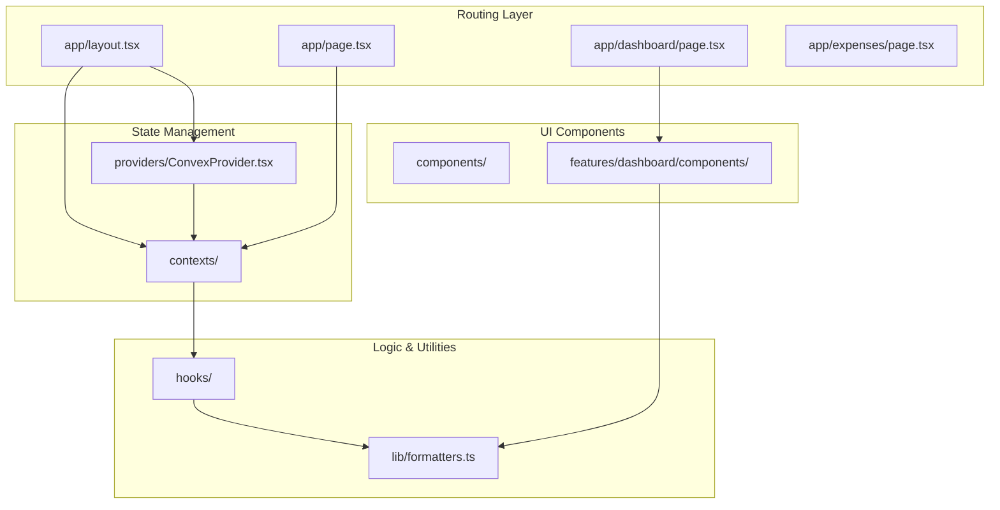
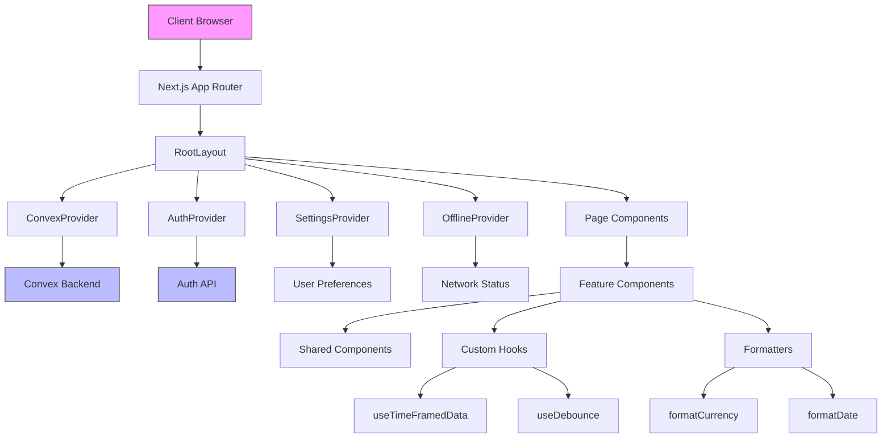
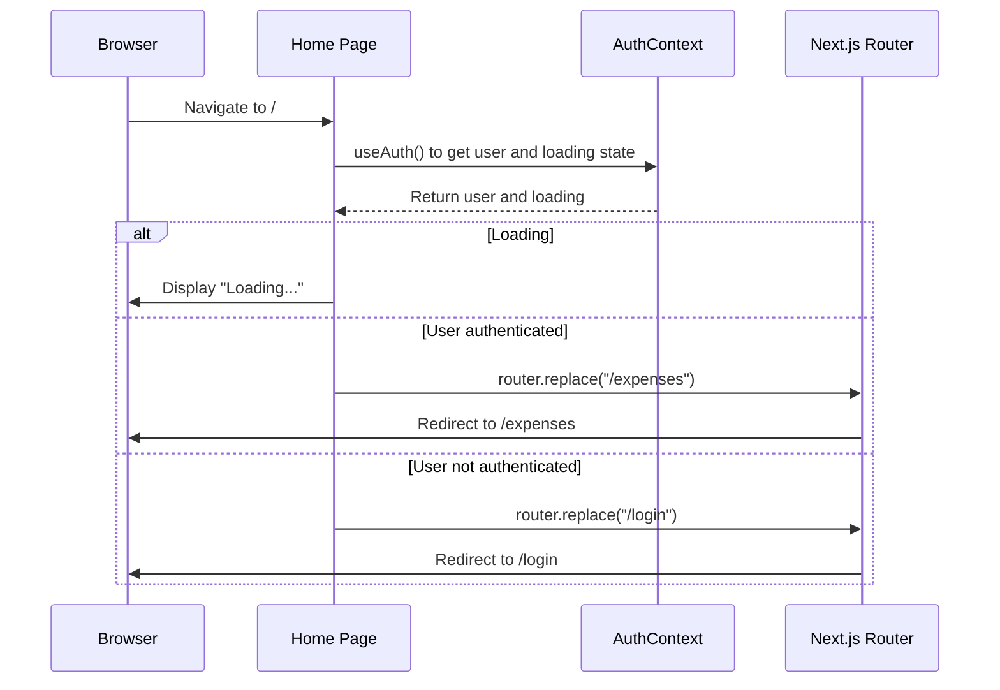
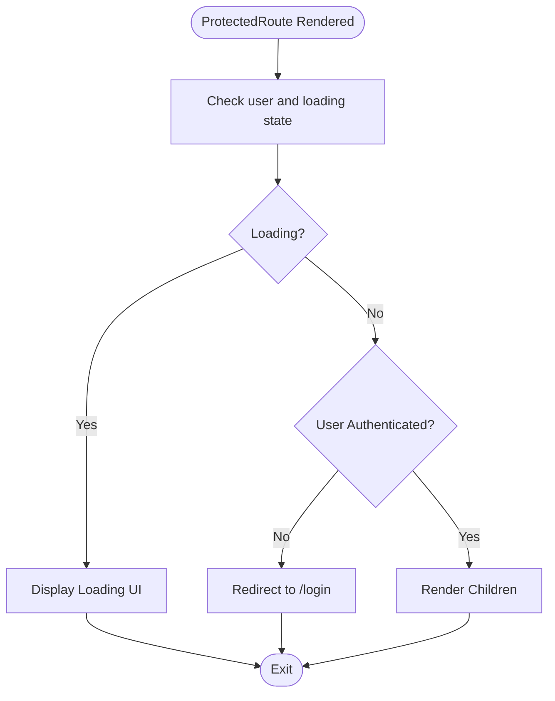
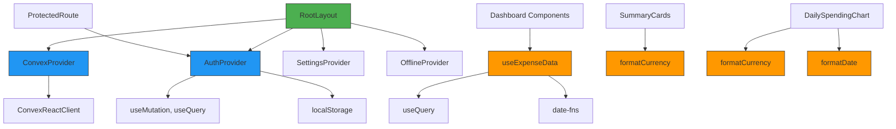

# Src Directory - Frontend Source Code

<cite>
**Referenced Files in This Document**   
- [app/layout.tsx](file://src/app/layout.tsx)
- [app/page.tsx](file://src/app/page.tsx)
- [components/ProtectedRoute.tsx](file://src/components/ProtectedRoute.tsx)
- [contexts/AuthContext.tsx](file://src/contexts/AuthContext.tsx)
- [providers/ConvexProvider.tsx](file://src/providers/ConvexProvider.tsx)
- [lib/formatters.ts](file://src/lib/formatters.ts)
- [hooks/useDebounce.ts](file://src/hooks/useDebounce.ts)
- [hooks/useTimeFramedData.ts](file://src/hooks/useTimeFramedData.ts)
- [features/dashboard/hooks/useExpenseData.ts](file://src/features/dashboard/hooks/useExpenseData.ts)
- [features/dashboard/types/expense.ts](file://src/features/dashboard/types/expense.ts)
- [features/dashboard/components/SummaryCards/SummaryCards.tsx](file://src/features/dashboard/components/SummaryCards/SummaryCards.tsx)
- [features/dashboard/components/Charts/DailySpendingChart.tsx](file://src/features/dashboard/components/Charts/DailySpendingChart.tsx)
</cite>

## Table of Contents
1. [Introduction](#introduction)
2. [Project Structure](#project-structure)
3. [Core Components](#core-components)
4. [Architecture Overview](#architecture-overview)
5. [Detailed Component Analysis](#detailed-component-analysis)
6. [Dependency Analysis](#dependency-analysis)
7. [Performance Considerations](#performance-considerations)
8. [Troubleshooting Guide](#troubleshooting-guide)
9. [Conclusion](#conclusion)

## Introduction
This document provides a comprehensive analysis of the `src/` directory in the Expense Tracker application, a Next.js frontend that leverages Convex for real-time data synchronization. The codebase follows a modular architecture with clear separation of concerns across routing, components, state management, and utilities. The application supports authentication, offline detection, user preferences, and internationalization features such as Jalali calendar support. This documentation details the structure, integration points, and implementation patterns used throughout the frontend.

## Project Structure

The `src/` directory is organized into feature-based and layer-based subdirectories that promote reusability and maintainability:

- **app/**: Next.js App Router structure defining routes and layouts
- **components/**: Reusable UI elements used across the application
- **contexts/**: Global state management via React Context API
- **features/**: Feature-specific components, hooks, and types (e.g., dashboard)
- **hooks/**: Shared custom hooks for cross-cutting logic
- **lib/**: Utility functions for formatting and data processing
- **providers/**: Provider components that wrap the application with external services



**Diagram sources**
- [app/layout.tsx](file://src/app/layout.tsx#L1-L58)
- [contexts/AuthContext.tsx](file://src/contexts/AuthContext.tsx#L1-L96)
- [providers/ConvexProvider.tsx](file://src/providers/ConvexProvider.tsx#L1-L15)

## Core Components

The application's core functionality is built around several key components that manage routing, authentication, data access, and presentation. The `RootLayout` component serves as the entry point, wrapping all context providers. The `ProtectedRoute` component ensures authenticated access to secured pages. Context providers like `AuthContext` and `ConvexProvider` enable global state and real-time data access. Utility modules such as `formatters.ts` standardize data presentation across the UI.

**Section sources**
- [app/layout.tsx](file://src/app/layout.tsx#L1-L58)
- [components/ProtectedRoute.tsx](file://src/components/ProtectedRoute.tsx#L1-L34)
- [contexts/AuthContext.tsx](file://src/contexts/AuthContext.tsx#L1-L96)
- [providers/ConvexProvider.tsx](file://src/providers/ConvexProvider.tsx#L1-L15)
- [lib/formatters.ts](file://src/lib/formatters.ts#L1-L48)

## Architecture Overview

The application follows a layered architecture with clear separation between presentation, logic, and data layers. The Next.js App Router handles navigation and page rendering. React Context provides global state management for authentication, settings, and offline status. Convex enables real-time data synchronization with the backend. Custom hooks encapsulate reusable logic, while utility functions handle data formatting.



**Diagram sources**
- [app/layout.tsx](file://src/app/layout.tsx#L1-L58)
- [contexts/AuthContext.tsx](file://src/contexts/AuthContext.tsx#L1-L96)
- [providers/ConvexProvider.tsx](file://src/providers/ConvexProvider.tsx#L1-L15)
- [lib/formatters.ts](file://src/lib/formatters.ts#L1-L48)

## Detailed Component Analysis

### Routing and Authentication Flow

The application routing is managed through the Next.js App Router, with authentication state determining the initial redirect. The home page checks authentication status and redirects users to either `/expenses` or `/login`.



**Diagram sources**
- [app/page.tsx](file://src/app/page.tsx#L1-L30)
- [contexts/AuthContext.tsx](file://src/contexts/AuthContext.tsx#L1-L96)

### Protected Route Implementation

The `ProtectedRoute` component wraps secured pages and redirects unauthenticated users to the login page.



**Diagram sources**
- [components/ProtectedRoute.tsx](file://src/components/ProtectedRoute.tsx#L1-L34)

### Authentication Context

The `AuthContext` manages user authentication state using Convex mutations and localStorage persistence.

```mermaid
classDiagram
class AuthContext {
+user : User | null
+token : string | null
+loading : boolean
+login(username, password) : Promise~void~
+register(username, password) : Promise~void~
+logout() : Promise~void~
}
class AuthProvider {
-token : string | null
-loading : boolean
-loginMutation : Mutation
-registerMutation : Mutation
-logoutMutation : Mutation
-userQuery : Query
+value : AuthContextType
}
AuthProvider --> AuthContext : "provides"
AuthProvider --> "convex/react" : "uses"
AuthProvider --> "localStorage" : "persists token"
```

**Diagram sources**
- [contexts/AuthContext.tsx](file://src/contexts/AuthContext.tsx#L1-L96)

### Data Formatting Utilities

The `formatters.ts` module provides standardized formatting for currency and dates, supporting multiple currencies and calendar systems.

```mermaid
flowchart TD
A["formatCurrency(amount, currency)"] --> B{Currency == "IRR"?}
B --> |Yes| C["Return 'amount T'"]
B --> |No| D["Return 'symbolamount'"]
C --> E["Return formatted string"]
D --> E
F["formatDate(date, calendar, format)"] --> G{Calendar == "jalali"?}
G --> |Yes| H["Use jalali-moment with converted tokens"]
G --> |No| I["Use date-fns format"]
H --> J["Return formatted date"]
I --> J
```

**Diagram sources**
- [lib/formatters.ts](file://src/lib/formatters.ts#L1-L48)

## Dependency Analysis

The application has a well-defined dependency hierarchy that prevents circular dependencies and promotes loose coupling.



**Diagram sources**
- [app/layout.tsx](file://src/app/layout.tsx#L1-L58)
- [contexts/AuthContext.tsx](file://src/contexts/AuthContext.tsx#L1-L96)
- [hooks/useExpenseData.ts](file://src/features/dashboard/hooks/useExpenseData.ts#L1-L86)
- [lib/formatters.ts](file://src/lib/formatters.ts#L1-L48)

## Performance Considerations

The application implements several performance optimizations:

- **Debouncing**: The `useDebounce` hook prevents excessive re-renders during user input
- **Memoization**: `useMemo` is used in data processing hooks to avoid redundant calculations
- **Conditional Queries**: Convex queries use "skip" parameter to prevent execution when token is unavailable
- **Cache Busting**: Key-based refetching allows controlled data refresh without full page reloads
- **Lazy Loading**: Next.js App Router enables route-based code splitting

The `useTimeFramedData` hook efficiently handles calendar-specific date calculations and data aggregation, while the `useDebounce` hook ensures smooth user experience during input operations.

**Section sources**
- [hooks/useDebounce.ts](file://src/hooks/useDebounce.ts#L1-L17)
- [hooks/useTimeFramedData.ts](file://src/hooks/useTimeFramedData.ts#L1-L96)
- [features/dashboard/hooks/useExpenseData.ts](file://src/features/dashboard/hooks/useExpenseData.ts#L1-L86)

## Troubleshooting Guide

Common issues and their solutions:

**Authentication Persistence Failure**
- **Symptom**: User not remembered after page refresh
- **Cause**: Token not properly saved to localStorage
- **Solution**: Verify `localStorage.setItem("auth-token", result.token)` executes after login

**Date Formatting Issues with Jalali Calendar**
- **Symptom**: Incorrect date display in Persian calendar
- **Cause**: Token conversion mapping incomplete
- **Solution**: Ensure `convertToJalaliTokens` handles all required format tokens

**Real-time Updates Not Working**
- **Symptom**: Data changes not reflected immediately
- **Cause**: Convex client connection issue
- **Solution**: Verify `NEXT_PUBLIC_CONVEX_URL` environment variable is set correctly

**Currency Formatting Incorrect**
- **Symptom**: Wrong symbol or placement for IRR currency
- **Cause**: Logic in `formatCurrency` function
- **Solution**: Verify conditional logic for IRR formatting

**Section sources**
- [contexts/AuthContext.tsx](file://src/contexts/AuthContext.tsx#L1-L96)
- [lib/formatters.ts](file://src/lib/formatters.ts#L1-L48)
- [providers/ConvexProvider.tsx](file://src/providers/ConvexProvider.tsx#L1-L15)

## Conclusion

The `src/` directory demonstrates a well-structured Next.js application with clean separation of concerns, effective state management, and robust integration with Convex for real-time data. The architecture supports scalability through modular components and reusable hooks. Internationalization features like Jalali calendar support and multiple currency formatting enhance user experience. The application follows modern React patterns including Server Components, Client Components, and Suspense for optimal performance. By adhering to these patterns, developers can confidently extend the application with new features while maintaining code quality and type safety.