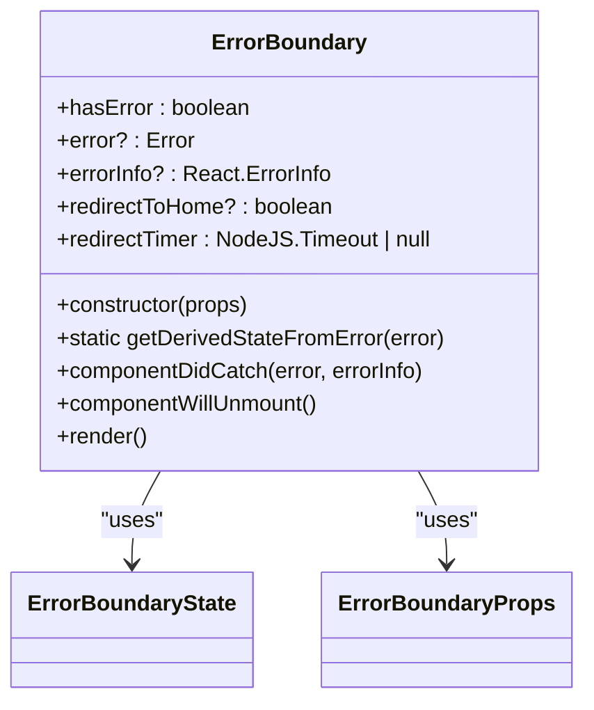
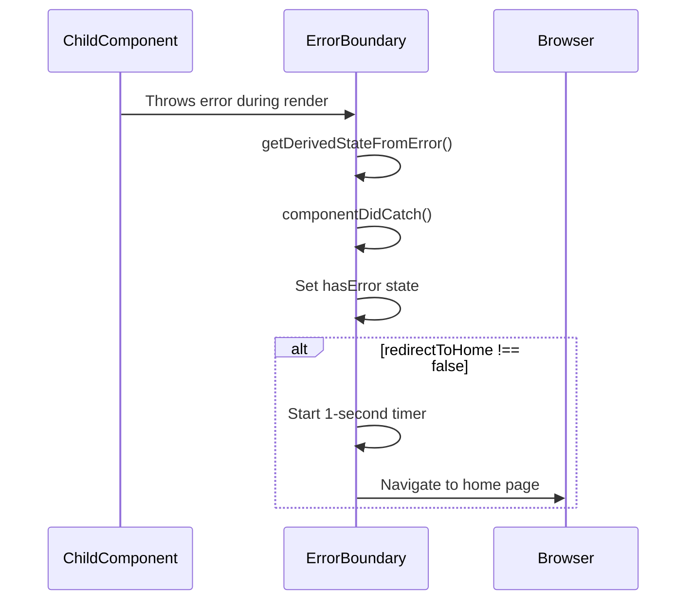
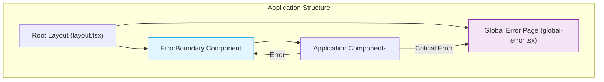
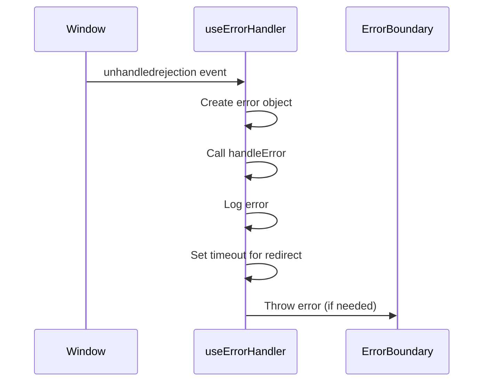

# Error Boundary Component

<cite>
**Referenced Files in This Document**   
- [ErrorBoundary.tsx](file://src/components/ErrorBoundary.tsx#L1-L129)
- [layout.tsx](file://src/app/layout.tsx#L13-L90)
- [global-error.tsx](file://src/app/global-error.tsx#L1-L39)
</cite>

## Table of Contents
1. [Introduction](#introduction)
2. [Error Boundary Overview](#error-boundary-overview)
3. [Error Catching Mechanism](#error-catching-mechanism)
4. [Auto-Redirect Functionality](#auto-redirect-functionality)
5. [Fallback UI and User Experience](#fallback-ui-and-user-experience)
6. [Integration with Global Error Handling](#integration-with-global-error-handling)
7. [Usage Patterns and Configuration](#usage-patterns-and-configuration)
8. [Hook Version: useErrorHandler](#hook-version-useerrorhandler)
9. [Component Architecture](#component-architecture)

## Introduction
The ErrorBoundary component is a critical error handling mechanism in the Expense Tracker application. It provides a robust way to catch JavaScript errors anywhere in the component tree, log those errors, and display a fallback UI instead of crashing the entire application. This documentation details its implementation, functionality, and integration within the Next.js application architecture.

## Error Boundary Overview
The ErrorBoundary component is a React class component designed to catch JavaScript errors in child components during rendering, in lifecycle methods, and in constructors. It implements React's error boundary pattern to prevent unhandled errors from breaking the entire application.

The component serves two primary purposes:
- Catch and handle runtime errors gracefully
- Provide a consistent user experience during application failures



**Diagram sources**
- [ErrorBoundary.tsx](file://src/components/ErrorBoundary.tsx#L5-L16)

**Section sources**
- [ErrorBoundary.tsx](file://src/components/ErrorBoundary.tsx#L1-L129)

## Error Catching Mechanism
The ErrorBoundary component implements React's standard error boundary API with two key lifecycle methods:

### getDerivedStateFromError
This static method is called when an error is thrown in a descendant component. It receives the error object and returns a new state that triggers the fallback UI.

```typescript
static getDerivedStateFromError(error: Error): ErrorBoundaryState {
  return {
    hasError: true,
    error
  };
}
```

### componentDidCatch
This method is invoked after an error has been thrown and captures both the error and additional error information, including the component stack trace.

```typescript
componentDidCatch(error: Error, errorInfo: React.ErrorInfo) {
  console.error('ErrorBoundary caught an error:', error, errorInfo);
  this.setState({
    error,
    errorInfo
  });
}
```

The component maintains internal state to track error conditions:
- `hasError`: Boolean flag indicating if an error has occurred
- `error`: The caught Error object
- `errorInfo`: React.ErrorInfo containing component stack trace

**Section sources**
- [ErrorBoundary.tsx](file://src/components/ErrorBoundary.tsx#L24-L38)

## Auto-Redirect Functionality
The ErrorBoundary component includes configurable auto-redirect functionality that automatically navigates users to the home page when an error occurs.

### Redirect Configuration
The behavior is controlled by the `redirectToHome` prop:
- When `redirectToHome` is `true` or undefined: Auto-redirect is enabled
- When `redirectToHome` is `false`: Auto-redirect is disabled

### Implementation Details
The redirect mechanism uses a timer to delay navigation, giving users a brief moment to see the error state before being redirected.

```typescript
if (this.props.redirectToHome !== false) {
  this.redirectTimer = setTimeout(() => {
    window.location.href = '/';
  }, 1000); // 1 second delay
}
```

### Cleanup
The component properly cleans up the timer in `componentWillUnmount` to prevent memory leaks:

```typescript
componentWillUnmount() {
  if (this.redirectTimer) {
    clearTimeout(this.redirectTimer);
  }
}
```



**Diagram sources**
- [ErrorBoundary.tsx](file://src/components/ErrorBoundary.tsx#L32-L50)

**Section sources**
- [ErrorBoundary.tsx](file://src/components/ErrorBoundary.tsx#L32-L50)

## Fallback UI and User Experience
The ErrorBoundary component provides two distinct fallback UI states based on the `redirectToHome` configuration.

### Redirect Mode (Default)
When auto-redirect is enabled, a minimal loading interface is displayed:

```tsx
return (
  <div className="min-h-screen bg-gray-50 flex items-center justify-center">
    <div className="text-center">
      <div className="inline-block h-8 w-8 animate-spin rounded-full border-4 border-solid border-blue-600 border-r-transparent align-[-0.125em] motion-reduce:animate-[spin_1.5s_linear_infinite]"></div>
      <div className="mt-4 text-lg font-medium text-gray-900">Redirecting...</div>
      <div className="mt-2 text-sm text-gray-600">Taking you to the home page</div>
    </div>
  </div>
);
```

### Custom Error Mode
When `redirectToHome` is set to `false`, a more detailed error message is displayed:

```tsx
return (
  <div className="min-h-screen bg-gray-50 flex items-center justify-center p-4">
    <div className="text-center max-w-md">
      <div className="text-red-500 mb-4">
        <svg className="mx-auto h-12 w-12" fill="none" viewBox="0 0 24 24" stroke="currentColor">
          <path strokeLinecap="round" strokeLinejoin="round" strokeWidth={2} d="M12 9v2m0 4h.01m-6.938 4h13.856c1.54 0 2.502-1.667 1.732-2.5L13.732 4c-.77-.833-1.964-.833-2.732 0L3.732 16.5c-.77.833.192 2.5 1.732 2.5z" />
        </svg>
      </div>
      <h2 className="text-lg font-semibold text-gray-900 mb-2">
        Application Error
      </h2>
      <p className="text-gray-600 mb-6">
        Something went wrong. Please try refreshing the page or contact support if the problem persists.
      </p>
    </div>
  </div>
);
```

**Section sources**
- [ErrorBoundary.tsx](file://src/components/ErrorBoundary.tsx#L50-L73)

## Integration with Global Error Handling
The ErrorBoundary component is integrated at the root layout level, providing application-wide error protection.

### Root Layout Integration
The component is wrapped around the entire application in `layout.tsx`:

```tsx
export default function RootLayout({
  children,
}: Readonly<{
  children: React.ReactNode;
}>) {
  return (
    <html lang="en">
      <body>
        <ErrorBoundary>
          <ServiceWorkerRegistration />
          <ConvexProvider>
            <AuthProvider>
              {/* Other providers */}
              {children}
            </AuthProvider>
          </ConvexProvider>
        </ErrorBoundary>
        {/* Analytics */}
      </body>
    </html>
  );
}
```

### Global Error Page
The application also implements Next.js's `global-error.tsx` for handling errors that occur outside React's rendering tree:

```tsx
export default function GlobalError({
  error,
  reset,
}: {
  error: Error & { digest?: string };
  reset: () => void;
}) {
  const router = useRouter();

  useEffect(() => {
    console.error('Global error caught:', error);
    const timer = setTimeout(() => {
      router.replace('/');
    }, 1000);
    return () => clearTimeout(timer);
  }, [error, router]);

  return (
    <html>
      <body>
        <div className="min-h-screen bg-gray-50 flex items-center justify-center">
          <div className="text-center">
            <div className="inline-block h-8 w-8 animate-spin rounded-full border-4 border-solid border-blue-600 border-r-transparent"></div>
            <div className="mt-4 text-lg font-medium text-gray-900">Redirecting...</div>
            <div className="mt-2 text-sm text-gray-600">Taking you to the home page</div>
          </div>
        </div>
      </body>
    </html>
  );
}
```



**Diagram sources**
- [layout.tsx](file://src/app/layout.tsx#L73-L90)
- [global-error.tsx](file://src/app/global-error.tsx#L1-L39)

**Section sources**
- [layout.tsx](file://src/app/layout.tsx#L73-L90)
- [global-error.tsx](file://src/app/global-error.tsx#L1-L39)

## Usage Patterns and Configuration
The ErrorBoundary component can be used in various ways throughout the application with different configuration options.

### Basic Usage
Wrap any component tree that might throw errors:

```tsx
<ErrorBoundary>
  <ProtectedRoute>
    <Dashboard />
  </ProtectedRoute>
</ErrorBoundary>
```

### Configuration Options
The component accepts one optional prop:

**redirectToHome**: Controls auto-redirect behavior
- Type: `boolean | undefined`
- Default: `true`
- When `false`: Shows error UI without redirecting
- When `true` or `undefined`: Shows loading spinner and redirects after 1 second

### Example Usage Patterns
1. **Global Application Protection** (in layout.tsx):
```tsx
<ErrorBoundary> {/* Auto-redirect enabled */}
  {children}
</ErrorBoundary>
```

2. **Local Error Handling**:
```tsx
<ErrorBoundary redirectToHome={false}>
  <Suspense fallback={<Loading />}>
    <ProblematicComponent />
  </Suspense>
</ErrorBoundary>
```

**Section sources**
- [ErrorBoundary.tsx](file://src/components/ErrorBoundary.tsx#L11-L16)

## Hook Version: useErrorHandler
The component file also exports a hook version for functional components that need error handling capabilities.

### Implementation
```typescript
export function useErrorHandler() {
  const [error, setError] = React.useState<Error | null>(null);
  const router = useRouter();

  const handleError = React.useCallback((error: Error) => {
    console.error('Error caught by useErrorHandler:', error);
    setTimeout(() => {
      router.push('/');
    }, 1000);
  }, [router]);

  React.useEffect(() => {
    const handleUnhandledRejection = (event: PromiseRejectionEvent) => {
      handleError(new Error(`Unhandled promise rejection: ${event.reason}`));
    };

    const handleGlobalError = (event: ErrorEvent) => {
      handleError(new Error(`Unhandled error: ${event.error}`));
    };

    window.addEventListener('unhandledrejection', handleUnhandledRejection);
    window.addEventListener('error', handleGlobalError);

    return () => {
      window.removeEventListener('unhandledrejection', handleUnhandledRejection);
      window.removeEventListener('error', handleGlobalError);
    };
  }, [handleError]);

  if (error) {
    throw error; // Let ErrorBoundary handle it
  }

  return { handleError, resetError };
}
```

### Key Features
- Catches unhandled promise rejections
- Catches global JavaScript errors
- Auto-redirects to home page
- Integrates with the main ErrorBoundary component
- Provides `handleError` and `resetError` functions



**Diagram sources**
- [ErrorBoundary.tsx](file://src/components/ErrorBoundary.tsx#L111-L129)

**Section sources**
- [ErrorBoundary.tsx](file://src/components/ErrorBoundary.tsx#L80-L129)

## Component Architecture
The ErrorBoundary component follows a clean, maintainable architecture that separates concerns and provides extensible error handling.

### Architecture Overview
The component implements a layered approach to error handling:
1. **Detection Layer**: React's built-in error boundary methods
2. **Processing Layer**: Error logging and state management
3. **Presentation Layer**: Fallback UI rendering
4. **Navigation Layer**: Auto-redirect functionality

### Design Patterns
- **Error Boundary Pattern**: Standard React error boundary implementation
- **Configuration Pattern**: Optional props for customizable behavior
- **Timer Pattern**: Controlled navigation with cleanup
- **Hook Integration**: Composable error handling for functional components

### Performance Considerations
- Minimal state updates
- Proper cleanup of timers
- Lightweight fallback UI
- Efficient event listener management

### Best Practices Implemented
- Comprehensive error logging
- Graceful degradation
- User-friendly error messages
- Configurable behavior
- Memory leak prevention
- Integration with Next.js routing

**Section sources**
- [ErrorBoundary.tsx](file://src/components/ErrorBoundary.tsx#L1-L129)