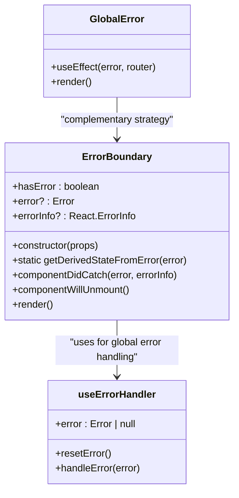
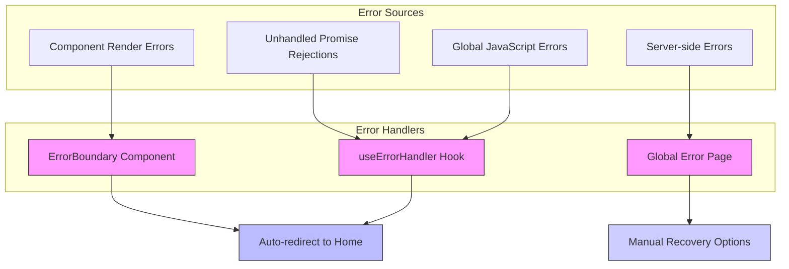
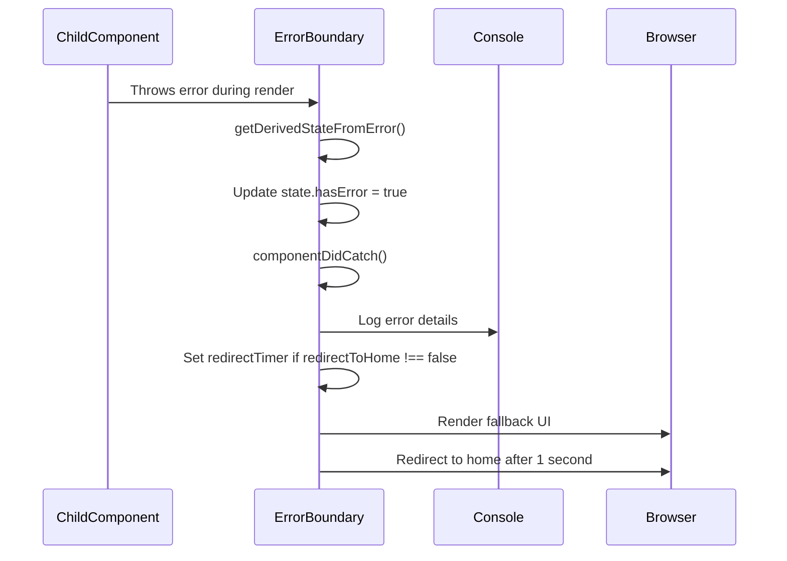
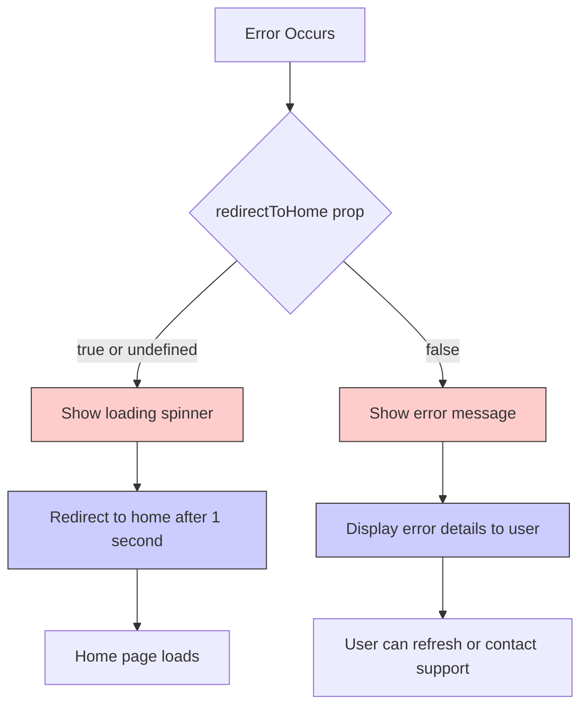
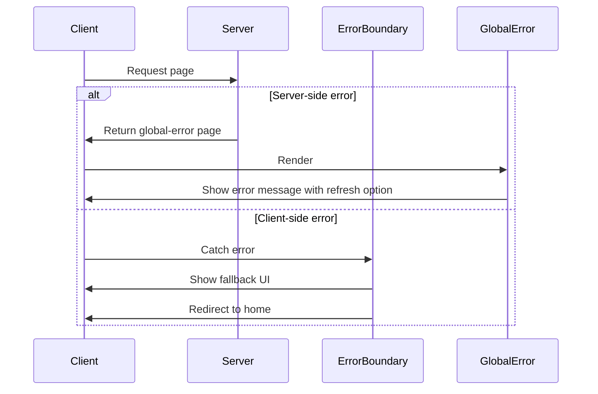
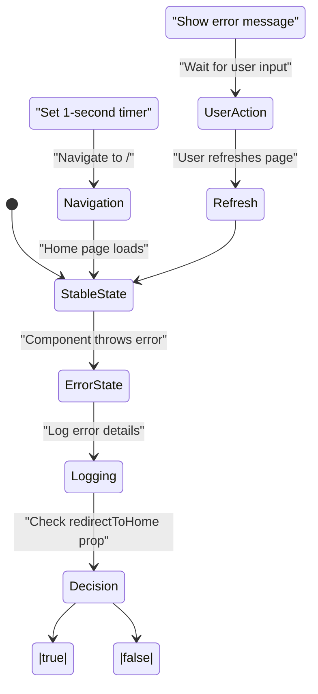

# Error Boundary Implementation

<cite>
**Referenced Files in This Document**   
- [ErrorBoundary.tsx](file://src/components/ErrorBoundary.tsx#L1-L129) - *Updated to maintain auto-redirect behavior for component errors*
- [global-error.tsx](file://src/app/global-error.tsx#L1-L48) - *Modified to prevent redirect loops by removing auto-redirect*
- [not-found.tsx](file://src/app/not-found.tsx#L1-L41) - *Updated to prevent redirect loops on 404 errors*
- [layout.tsx](file://src/app/layout.tsx#L13-L90) - *Contains root-level ErrorBoundary wrapper*
</cite>

## Update Summary
**Changes Made**   
- Updated documentation to reflect changes in error handling strategy across components
- Removed outdated information about global error auto-redirect behavior
- Added clarification on redirect loop prevention in global error handlers
- Maintained accurate description of ErrorBoundary's auto-redirect functionality
- Updated section sources to reflect current file states and recent modifications

## Table of Contents
1. [Introduction](#introduction)
2. [Core Components](#core-components)
3. [Error Handling Architecture](#error-handling-architecture)
4. [Detailed Component Analysis](#detailed-component-analysis)
5. [Integration with Global Error Strategy](#integration-with-global-error-strategy)
6. [Usage Patterns](#usage-patterns)
7. [Error Recovery Mechanisms](#error-recovery-mechanisms)
8. [Conclusion](#conclusion)

## Introduction
The ErrorBoundary component in the Expense Tracker application serves as a critical error handling mechanism that captures JavaScript errors anywhere in the component tree, logs them, and provides a fallback UI. This documentation details its implementation, behavior, and integration within the application's error handling strategy. The component is designed to prevent the entire application from crashing due to unhandled errors in child components while providing a graceful recovery path through automatic redirection.

## Core Components
The error handling system consists of three main components: the ErrorBoundary class component, the useErrorHandler hook, and the global error page. These components work together to provide comprehensive error coverage across the application.



**Diagram sources**
- [ErrorBoundary.tsx](file://src/components/ErrorBoundary.tsx#L16-L129)
- [global-error.tsx](file://src/app/global-error.tsx#L1-L48)

**Section sources**
- [ErrorBoundary.tsx](file://src/components/ErrorBoundary.tsx#L1-L129)

## Error Handling Architecture
The application employs a multi-layered error handling strategy that combines React's error boundary mechanism with global error event listeners and Next.js's built-in error handling features. This layered approach ensures comprehensive coverage of different error types and scenarios.



**Diagram sources**
- [ErrorBoundary.tsx](file://src/components/ErrorBoundary.tsx#L1-L129)
- [global-error.tsx](file://src/app/global-error.tsx#L1-L48)

## Detailed Component Analysis

### ErrorBoundary Class Component
The ErrorBoundary class component implements React's error boundary pattern using the getDerivedStateFromError and componentDidCatch lifecycle methods. It maintains state to track error conditions and provides configurable behavior for error recovery.



**Diagram sources**
- [ErrorBoundary.tsx](file://src/components/ErrorBoundary.tsx#L24-L50)

**Section sources**
- [ErrorBoundary.tsx](file://src/components/ErrorBoundary.tsx#L16-L73)

#### Key Implementation Details
- **State Management**: The component maintains a state with `hasError`, `error`, and `errorInfo` properties to track error conditions and details
- **Error Detection**: Uses `getDerivedStateFromError` static method to update state when an error is detected during rendering
- **Error Logging**: Implements `componentDidCatch` to log error details to the console for debugging purposes
- **Cleanup**: Implements `componentWillUnmount` to clear the redirect timer and prevent memory leaks

### Fallback UI and Auto-Redirect Behavior
The ErrorBoundary component provides two distinct fallback UI experiences based on the `redirectToHome` prop configuration. This flexibility allows different error handling strategies for different parts of the application.



**Diagram sources**
- [ErrorBoundary.tsx](file://src/components/ErrorBoundary.tsx#L46-L73)

**Section sources**
- [ErrorBoundary.tsx](file://src/components/ErrorBoundary.tsx#L46-L73)

#### Fallback UI Variants
- **Redirect Mode** (default): Displays a minimal loading spinner with "Redirecting..." text, automatically navigating to the home page after a 1-second delay
- **Standalone Mode** (redirectToHome=false): Shows a user-friendly error message with an error icon, clear explanation, and guidance for recovery

#### Auto-Redirect Mechanism
The auto-redirect functionality is implemented using a timer that triggers a navigation to the root path (`/`). The timer is set in `componentDidCatch` and cleared in `componentWillUnmount` to prevent memory leaks:

```typescript
// Auto-redirect to home page after a short delay
if (this.props.redirectToHome !== false) {
  this.redirectTimer = setTimeout(() => {
    window.location.href = '/';
  }, 1000); // 1 second delay
}
```

This approach ensures that users are automatically taken to a stable state (the home page) after an error occurs, improving the user experience by preventing them from being stuck on a broken page.

## Integration with Global Error Strategy

### Application-Wide Integration
The ErrorBoundary component is integrated at the root layout level, wrapping the entire application to catch errors from any component:

```tsx
<ErrorBoundary>
  <ServiceWorkerRegistration />
  <ConvexProvider>
    <AuthProvider>
      <OfflineFirstWrapper>
        <SettingsProvider>
          <OfflineProvider>
            {children}
            {/* ... */}
          </OfflineProvider>
        </SettingsProvider>
      </OfflineFirstWrapper>
    </AuthProvider>
  </ConvexProvider>
</ErrorBoundary>
```

This strategic placement ensures that any unhandled error in the component tree will be caught by the ErrorBoundary, preventing the entire application from crashing.

**Section sources**
- [layout.tsx](file://src/app/layout.tsx#L73-L90)

### Complementary Global Error Page
The application also implements Next.js's global error handling through the `global-error.tsx` file, which serves as a backup error boundary for server-side errors or cases where the client-side ErrorBoundary might fail. Unlike the ErrorBoundary component, the global error page has been updated to prevent redirect loops by removing automatic redirection:



**Diagram sources**
- [global-error.tsx](file://src/app/global-error.tsx#L1-L48)
- [ErrorBoundary.tsx](file://src/components/ErrorBoundary.tsx#L1-L129)

**Section sources**
- [global-error.tsx](file://src/app/global-error.tsx#L1-L48)

The global error page now displays a user-friendly interface with a "Refresh Page" button instead of automatically redirecting, preventing potential redirect loops while still allowing users to recover from errors. This change was made specifically to address issues where automatic redirects could create infinite loops in certain error scenarios.

## Usage Patterns

### Standard Wrapper Pattern
The most common usage pattern is wrapping the entire application in the root layout, as shown in the layout.tsx file. This ensures comprehensive error coverage:

```tsx
<ErrorBoundary>
  {children}
</ErrorBoundary>
```

### Selective Error Boundary
For components that might fail independently without affecting the entire application, the ErrorBoundary can be used more selectively:

```tsx
<ErrorBoundary redirectToHome={false}>
  <UnstableComponent />
</ErrorBoundary>
```

By setting `redirectToHome={false}`, the component will display the error message UI instead of automatically redirecting, allowing users to potentially recover from the error without losing their current context.

### Functional Component Error Handling
For functional components that need error handling capabilities, the `useErrorHandler` hook provides a convenient alternative to class-based error boundaries:

```typescript
export function useErrorHandler() {
  const [error, setError] = React.useState<Error | null>(null);
  const router = useRouter();

  const handleError = React.useCallback((error: Error) => {
    console.error('Error caught by useErrorHandler:', error);
    // Auto-redirect to home on error
    setTimeout(() => {
      router.push('/');
    }, 1000);
  }, [router]);

  React.useEffect(() => {
    const handleUnhandledRejection = (event: PromiseRejectionEvent) => {
      handleError(new Error(`Unhandled promise rejection: ${event.reason}`));
    };

    const handleGlobalError = (event: ErrorEvent) => {
      handleError(new Error(`Unhandled error: ${event.error}`));
    };

    window.addEventListener('unhandledrejection', handleUnhandledRejection);
    window.addEventListener('error', handleGlobalError);

    return () => {
      window.removeEventListener('unhandledrejection', handleUnhandledRejection);
      window.removeEventListener('error', handleGlobalError);
    };
  }, [handleError]);

  if (error) {
    throw error; // Let ErrorBoundary handle it
  }

  return { handleError, resetError };
}
```

This hook automatically listens to unhandled promise rejections and global JavaScript errors, providing a safety net for asynchronous operations that might fail outside the React component lifecycle.

**Section sources**
- [ErrorBoundary.tsx](file://src/components/ErrorBoundary.tsx#L92-L129)

## Error Recovery Mechanisms

### Automatic Recovery Flow
The primary error recovery mechanism for component-level errors is the automatic redirection to the home page after a 1-second delay. This approach balances the need to inform users of an error with the goal of quickly returning them to a functional state.



**Diagram sources**
- [ErrorBoundary.tsx](file://src/components/ErrorBoundary.tsx#L32-L50)

### Error Information Preservation
While the user interface focuses on recovery, the system preserves detailed error information for debugging purposes:

- **Console Logging**: All caught errors are logged to the console with full error and errorInfo objects
- **Error State**: The component maintains error details in its state, which could be extended to send to error reporting services
- **Consistent Timing**: The 1-second delay provides enough time for error reporting to complete before navigation

### Memory Management
The implementation includes proper cleanup to prevent memory leaks:

```typescript
componentWillUnmount() {
  if (this.redirectTimer) {
    clearTimeout(this.redirectTimer);
  }
}
```

This ensures that the redirect timer is cleared when the component is unmounted, preventing the callback from executing on an unmounted component.

**Section sources**
- [ErrorBoundary.tsx](file://src/components/ErrorBoundary.tsx#L46-L50)

## Conclusion
The ErrorBoundary implementation in the Expense Tracker application provides a robust and user-friendly error handling solution. By combining React's error boundary pattern with global error event listeners and strategic application integration, it creates a comprehensive safety net that prevents application crashes while guiding users back to a stable state. The configurable redirect behavior and complementary global error page ensure consistent error handling across different scenarios. 

Recent updates have refined the error handling strategy by removing automatic redirects from the global error page and 404 page to prevent redirect loops, while maintaining the ErrorBoundary's auto-redirect functionality for component-level errors. This distinction ensures that server-side errors and routing issues don't trigger infinite redirect cycles, while client-side component errors still benefit from automatic recovery.

The implementation demonstrates best practices in error handling, including proper state management, memory cleanup, and informative logging for debugging. This approach significantly improves the application's reliability and user experience by gracefully handling unexpected errors and providing clear recovery paths.