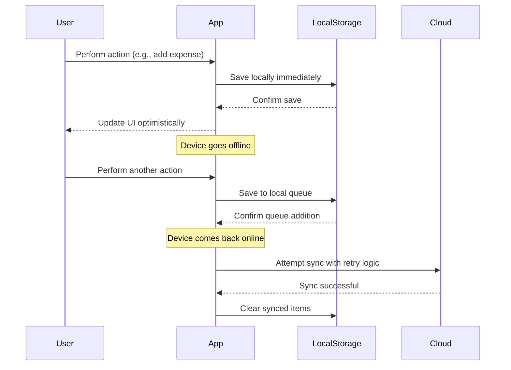
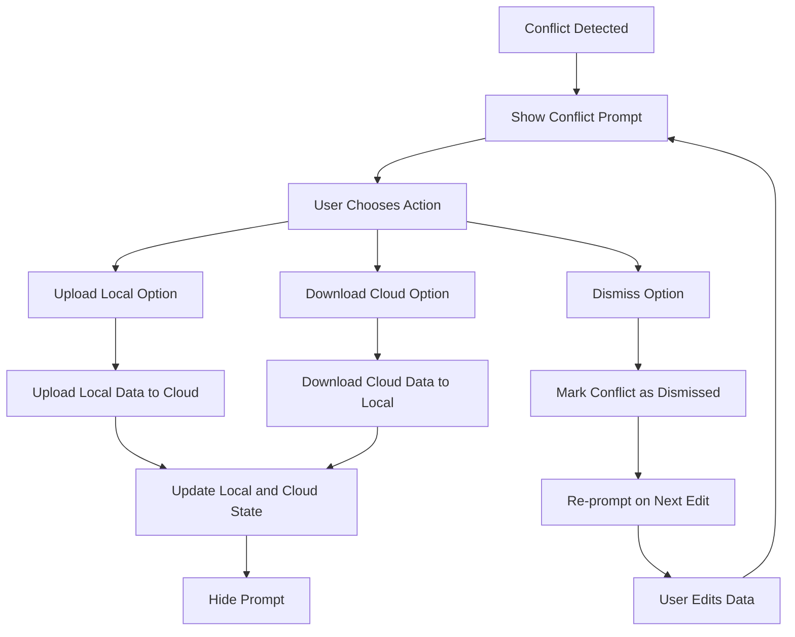
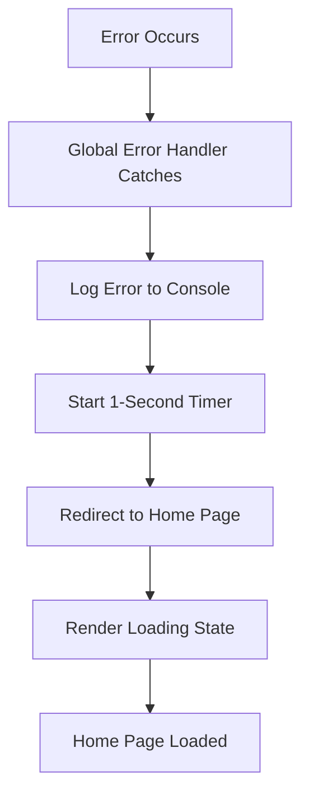
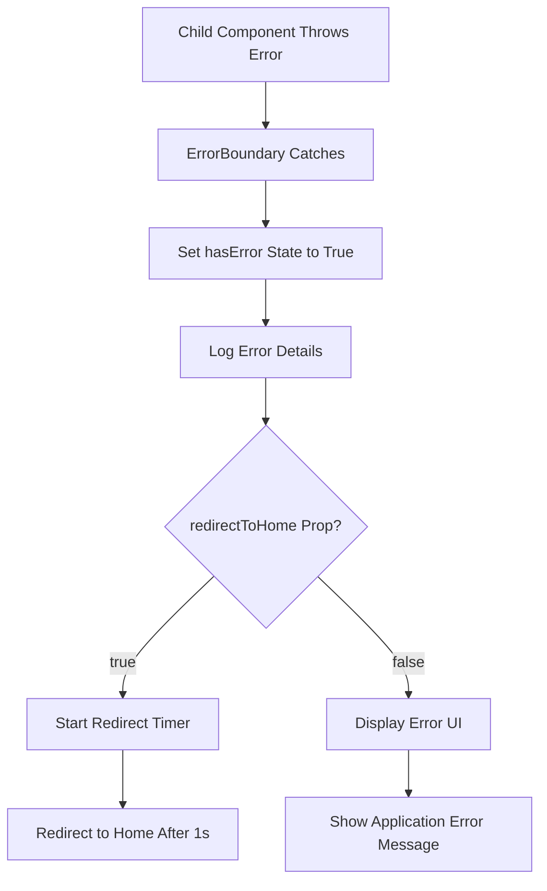

# Error Handling Strategy

<cite>
**Referenced Files in This Document**   
- [ErrorBoundary.tsx](file://src/components/ErrorBoundary.tsx)
- [global-error.tsx](file://src/app/global-error.tsx)
- [not-found.tsx](file://src/app/not-found.tsx)
- [OfflineContext.tsx](file://src/contexts/OfflineContext.tsx)
- [CloudSyncManager.ts](file://src/lib/sync/CloudSyncManager.ts)
- [useOfflineQueue.ts](file://src/hooks/useOfflineQueue.ts)
- [OfflineFirstProvider.tsx](file://src/providers/OfflineFirstProvider.tsx)
</cite>

## Table of Contents
1. [Introduction](#introduction)
2. [Global Error Handling](#global-error-handling)
3. [ErrorBoundary Component](#errorboundary-component)
4. [Not-Found Page Handling](#not-found-page-handling)
5. [Error Recovery in Online and Offline Scenarios](#error-recovery-in-online-and-offline-scenarios)
6. [Conflict and Sync Error Management](#conflict-and-sync-error-management)
7. [Error Handling Flow Diagrams](#error-handling-flow-diagrams)

## Introduction
The Expense Tracker application implements a robust error handling strategy to ensure reliability and usability across varying network conditions. This document details the mechanisms used to catch, display, and recover from errors, with a focus on the global error boundary, not-found page, and the ErrorBoundary component. The system is designed to provide a seamless user experience, even during network outages or unexpected failures.

**Section sources**
- [ErrorBoundary.tsx](file://src/components/ErrorBoundary.tsx#L1-L130)
- [global-error.tsx](file://src/app/global-error.tsx#L1-L40)
- [not-found.tsx](file://src/app/not-found.tsx#L1-L27)

## Global Error Handling
The application uses Next.js's built-in `global-error.tsx` to catch unhandled errors at the root level. When an uncaught error occurs, the user is shown a minimal loading interface while the application automatically redirects to the home page after a one-second delay. This ensures that the app remains in a usable state and prevents the user from being stuck on a broken screen.

The global error handler logs the error to the console for debugging purposes and leverages the Next.js router to perform the redirect. This approach provides a consistent recovery mechanism across the entire application.

```tsx
// src/app/global-error.tsx
export default function GlobalError({
  error,
  reset,
}: {
  error: Error & { digest?: string };
  reset: () => void;
}) {
  const router = useRouter();

  useEffect(() => {
    console.error('Global error caught:', error);
    const timer = setTimeout(() => {
      router.replace('/');
    }, 1000);
    return () => clearTimeout(timer);
  }, [error, router]);

  return (
    <html>
      <body>
        <div className="min-h-screen bg-gray-50 flex items-center justify-center">
          <div className="text-center">
            <div className="inline-block h-8 w-8 animate-spin rounded-full border-4 border-solid border-blue-600 border-r-transparent"></div>
            <div className="mt-4 text-lg font-medium text-gray-900">Redirecting...</div>
            <div className="mt-2 text-sm text-gray-600">Taking you to the home page</div>
          </div>
        </div>
      </body>
    </html>
  );
}
```

**Section sources**
- [global-error.tsx](file://src/app/global-error.tsx#L1-L40)

## ErrorBoundary Component
The `ErrorBoundary` component is a React class component that catches JavaScript errors anywhere in its child component tree. It implements the `getDerivedStateFromError` and `componentDidCatch` lifecycle methods to handle errors gracefully.

When an error is caught, it is logged to the console, and the component enters an error state. By default, the component automatically redirects to the home page after a one-second delay. However, this behavior can be disabled by setting the `redirectToHome` prop to `false`, in which case a user-friendly error message is displayed.

The component also manages a timer to ensure cleanup on unmount, preventing memory leaks.

```tsx
// src/components/ErrorBoundary.tsx
export class ErrorBoundary extends React.Component<ErrorBoundaryProps, ErrorBoundaryState> {
  private redirectTimer: NodeJS.Timeout | null = null;

  static getDerivedStateFromError(error: Error): ErrorBoundaryState {
    return { hasError: true, error };
  }

  componentDidCatch(error: Error, errorInfo: React.ErrorInfo) {
    console.error('ErrorBoundary caught an error:', error, errorInfo);
    this.setState({ error, errorInfo });

    if (this.props.redirectToHome !== false) {
      this.redirectTimer = setTimeout(() => {
        window.location.href = '/';
      }, 1000);
    }
  }

  componentWillUnmount() {
    if (this.redirectTimer) {
      clearTimeout(this.redirectTimer);
    }
  }

  render() {
    if (this.state.hasError) {
      if (this.props.redirectToHome === false) {
        return (
          <div className="min-h-screen bg-gray-50 flex items-center justify-center p-4">
            <div className="text-center max-w-md">
              <div className="text-red-500 mb-4">
                <svg className="mx-auto h-12 w-12" fill="none" viewBox="0 0 24 24" stroke="currentColor">
                  <path strokeLinecap="round" strokeLinejoin="round" strokeWidth={2} d="M12 9v2m0 4h.01m-6.938 4h13.856c1.54 0 2.502-1.667 1.732-2.5L13.732 4c-.77-.833-1.964-.833-2.732 0L3.732 16.5c-.77.833.192 2.5 1.732 2.5z" />
                </svg>
              </div>
              <h2 className="text-lg font-semibold text-gray-900 mb-2">
                Application Error
              </h2>
              <p className="text-gray-600 mb-6">
                Something went wrong. Please try refreshing the page or contact support if the problem persists.
              </p>
            </div>
          </div>
        );
      }

      return (
        <div className="min-h-screen bg-gray-50 flex items-center justify-center">
          <div className="text-center">
            <div className="inline-block h-8 w-8 animate-spin rounded-full border-4 border-solid border-blue-600 border-r-transparent"></div>
            <div className="mt-4 text-lg font-medium text-gray-900">Redirecting...</div>
            <div className="mt-2 text-sm text-gray-600">Taking you to the home page</div>
          </div>
        </div>
      );
    }

    return this.props.children;
  }
}
```

**Section sources**
- [ErrorBoundary.tsx](file://src/components/ErrorBoundary.tsx#L1-L130)

## Not-Found Page Handling
The `not-found.tsx` file handles cases where a requested route does not exist. Similar to the global error handler, it displays a loading spinner and automatically redirects the user to the home page after a one-second delay. This ensures a consistent user experience when navigating to invalid URLs.

The component uses the Next.js router to perform the redirect and includes cleanup logic to clear the timeout on unmount.

```tsx
// src/app/not-found.tsx
export default function NotFound() {
  const router = useRouter();

  useEffect(() => {
    const timer = setTimeout(() => {
      router.replace('/');
    }, 1000);
    return () => clearTimeout(timer);
  }, [router]);

  return (
    <div className="min-h-screen bg-gray-50 flex items-center justify-center">
      <div className="text-center">
        <div className="inline-block h-8 w-8 animate-spin rounded-full border-4 border-solid border-blue-600 border-r-transparent"></div>
        <div className="mt-4 text-lg font-medium text-gray-900">Redirecting...</div>
        <div className="mt-2 text-sm text-gray-600">Taking you to the home page</div>
      </div>
    </div>
  );
}
```

**Section sources**
- [not-found.tsx](file://src/app/not-found.tsx#L1-L27)

## Error Recovery in Online and Offline Scenarios
The application's error recovery strategy is designed to function seamlessly in both online and offline scenarios. In offline mode, the `OfflineContext` and `OfflineFirstProvider` ensure that user data is stored locally using IndexedDB, allowing full functionality without internet connectivity.

When the application detects that the user is back online, it automatically synchronizes pending operations with the cloud. The `CloudSyncManager` handles this process with retry mechanisms and exponential backoff to handle transient network issues.



**Diagram sources**
- [OfflineContext.tsx](file://src/contexts/OfflineContext.tsx#L30-L61)
- [CloudSyncManager.ts](file://src/lib/sync/CloudSyncManager.ts#L428-L475)
- [useOfflineQueue.ts](file://src/hooks/useOfflineQueue.ts#L1-L66)

**Section sources**
- [OfflineContext.tsx](file://src/contexts/OfflineContext.tsx#L30-L61)
- [CloudSyncManager.ts](file://src/lib/sync/CloudSyncManager.ts#L428-L475)
- [useOfflineQueue.ts](file://src/hooks/useOfflineQueue.ts#L1-L66)

## Conflict and Sync Error Management
The application includes sophisticated conflict detection and resolution mechanisms. The `ConflictDetector` identifies discrepancies between local and cloud data using hash-based comparison. When conflicts are detected, the `ConflictPrompt` component is displayed, allowing users to choose between uploading local data, downloading cloud data, or dismissing the conflict for later resolution.

Sync errors are managed through a retry mechanism with exponential backoff and jitter to prevent overwhelming the server. Retryable errors include network issues, rate limits, and server errors, while non-retryable errors include unauthorized access and bad requests.



**Diagram sources**
- [OfflineContext.tsx](file://src/contexts/OfflineContext.tsx#L370-L426)
- [OfflineFirstProvider.tsx](file://src/providers/OfflineFirstProvider.tsx#L278-L325)

**Section sources**
- [OfflineContext.tsx](file://src/contexts/OfflineContext.tsx#L370-L426)
- [OfflineFirstProvider.tsx](file://src/providers/OfflineFirstProvider.tsx#L278-L325)

## Error Handling Flow Diagrams
The following diagrams illustrate the key error handling and recovery flows in the application.

### Global Error Handling Flow


**Diagram sources**
- [global-error.tsx](file://src/app/global-error.tsx#L1-L40)

### ErrorBoundary Flow


**Diagram sources**
- [ErrorBoundary.tsx](file://src/components/ErrorBoundary.tsx#L1-L130)