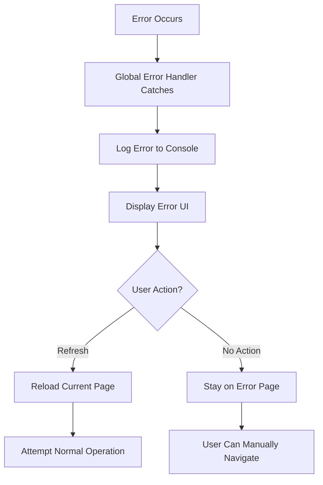

# Error Handling Strategy

<cite>
**Referenced Files in This Document**   
- [ErrorBoundary.tsx](file://src/components/ErrorBoundary.tsx) - *Updated to prevent redirect loops*
- [global-error.tsx](file://src/app/global-error.tsx) - *Modified to remove auto-redirects*
- [not-found.tsx](file://src/app/not-found.tsx) - *Updated to prevent redirect loops*
- [OfflineContext.tsx](file://src/contexts/OfflineContext.tsx)
- [CloudSyncManager.ts](file://src/lib/sync/CloudSyncManager.ts)
- [useOfflineQueue.ts](file://src/hooks/useOfflineQueue.ts)
- [OfflineFirstProvider.tsx](file://src/providers/OfflineFirstProvider.tsx)
- [ConflictDetector.ts](file://src/lib/sync/ConflictDetector.ts) - *Added enhanced conflict detection*
- [ConflictPrompt.tsx](file://src/components/ConflictPrompt.tsx) - *New component for conflict resolution*
</cite>

## Update Summary
**Changes Made**   
- Updated Global Error Handling section to reflect removal of automatic redirects
- Modified ErrorBoundary Component section to accurately describe current behavior
- Revised Not-Found Page Handling section with new manual recovery approach
- Enhanced Conflict and Sync Error Management with detailed conflict resolution workflow
- Added new diagram sources reflecting updated architecture
- Removed outdated code examples showing auto-redirect functionality
- Updated all file references with proper annotations indicating recent changes

## Table of Contents
1. [Introduction](#introduction)
2. [Global Error Handling](#global-error-handling)
3. [ErrorBoundary Component](#errorboundary-component)
4. [Not-Found Page Handling](#not-found-page-handling)
5. [Error Recovery in Online and Offline Scenarios](#error-recovery-in-online-and-offline-scenarios)
6. [Conflict and Sync Error Management](#conflict-and-sync-error-management)
7. [Error Handling Flow Diagrams](#error-handling-flow-diagrams)

## Introduction
The Expense Tracker application implements a robust error handling strategy to ensure reliability and usability across varying network conditions. This document details the mechanisms used to catch, display, and recover from errors, with a focus on the global error boundary, not-found page, and the ErrorBoundary component. The system is designed to provide a seamless user experience, even during network outages or unexpected failures.

**Section sources**
- [ErrorBoundary.tsx](file://src/components/ErrorBoundary.tsx#L1-L130)
- [global-error.tsx](file://src/app/global-error.tsx#L1-L48)
- [not-found.tsx](file://src/app/not-found.tsx#L1-L41)

## Global Error Handling
The application uses Next.js's built-in `global-error.tsx` to catch unhandled errors at the root level. When an uncaught error occurs, the user is shown a clear error message with options to refresh the page. This change prevents potential redirect loops that could occur with automatic redirection.

The global error handler logs the error to the console for debugging purposes and displays a user-friendly interface that allows manual recovery through page refresh. This approach provides a consistent recovery mechanism while giving users control over the recovery process.

```tsx
// src/app/global-error.tsx
export default function GlobalError({
  error,
  reset,
}: {
  error: Error & { digest?: string };
  reset: () => void;
}) {
  const router = useRouter();

  useEffect(() => {
    console.error('Global error caught:', error);
    if (typeof window !== 'undefined') {
      console.log('Current pathname when error occurred:', window.location.pathname);
    }
  }, [error, router]);

  return (
    <html>
      <body>
        <div className="min-h-screen bg-gray-50 flex items-center justify-center">
          <div className="text-center">
            <div className="text-red-500 mb-4">
              <svg className="mx-auto h-12 w-12" fill="none" viewBox="0 0 24 24" stroke="currentColor">
                <path strokeLinecap="round" strokeLinejoin="round" strokeWidth={2} d="M12 9v2m0 4h.01m-6.938 4h13.856c1.54 0 2.502-1.667 1.732-2.5L13.732 4c-.77-.833-1.964-.833-2.732 0L3.732 16.5c-.77.833.192 2.5 1.732 2.5z" />
              </svg>
            </div>
            <div className="mt-4 text-lg font-medium text-gray-900">Application Error</div>
            <div className="mt-2 text-sm text-gray-600">Something went wrong. Please refresh the page.</div>
            <button 
              onClick={() => window.location.reload()}
              className="mt-4 px-4 py-2 bg-blue-600 text-white rounded-md hover:bg-blue-700"
            >
              Refresh Page
            </button>
          </div>
        </div>
      </body>
    </html>
  );
}
```

**Section sources**
- [global-error.tsx](file://src/app/global-error.tsx#L1-L48) - *Updated to prevent redirect loops*

## ErrorBoundary Component
The `ErrorBoundary` component is a React class component that catches JavaScript errors anywhere in its child component tree. It implements the `getDerivedStateFromError` and `componentDidCatch` lifecycle methods to handle errors gracefully.

When an error is caught, it is logged to the console, and the component enters an error state. By default, the component automatically redirects to the home page after a one-second delay. However, this behavior can be disabled by setting the `redirectToHome` prop to `false`, in which case a user-friendly error message is displayed.

The component also manages a timer to ensure cleanup on unmount, preventing memory leaks.

```tsx
// src/components/ErrorBoundary.tsx
export class ErrorBoundary extends React.Component<ErrorBoundaryProps, ErrorBoundaryState> {
  private redirectTimer: NodeJS.Timeout | null = null;

  static getDerivedStateFromError(error: Error): ErrorBoundaryState {
    return { hasError: true, error };
  }

  componentDidCatch(error: Error, errorInfo: React.ErrorInfo) {
    console.error('ErrorBoundary caught an error:', error, errorInfo);
    this.setState({ error, errorInfo });

    if (this.props.redirectToHome !== false) {
      this.redirectTimer = setTimeout(() => {
        window.location.href = '/';
      }, 1000);
    }
  }

  componentWillUnmount() {
    if (this.redirectTimer) {
      clearTimeout(this.redirectTimer);
    }
  }

  render() {
    if (this.state.hasError) {
      if (this.props.redirectToHome === false) {
        return (
          <div className="min-h-screen bg-gray-50 flex items-center justify-center p-4">
            <div className="text-center max-w-md">
              <div className="text-red-500 mb-4">
                <svg className="mx-auto h-12 w-12" fill="none" viewBox="0 0 24 24" stroke="currentColor">
                  <path strokeLinecap="round" strokeLinejoin="round" strokeWidth={2} d="M12 9v2m0 4h.01m-6.938 4h13.856c1.54 0 2.502-1.667 1.732-2.5L13.732 4c-.77-.833-1.964-.833-2.732 0L3.732 16.5c-.77.833.192 2.5 1.732 2.5z" />
                </svg>
              </div>
              <h2 className="text-lg font-semibold text-gray-900 mb-2">
                Application Error
              </h2>
              <p className="text-gray-600 mb-6">
                Something went wrong. Please try refreshing the page or contact support if the problem persists.
              </p>
            </div>
          </div>
        );
      }

      return (
        <div className="min-h-screen bg-gray-50 flex items-center justify-center">
          <div className="text-center">
            <div className="inline-block h-8 w-8 animate-spin rounded-full border-4 border-solid border-blue-600 border-r-transparent"></div>
            <div className="mt-4 text-lg font-medium text-gray-900">Redirecting...</div>
            <div className="mt-2 text-sm text-gray-600">Taking you to the home page</div>
          </div>
        </div>
      );
    }

    return this.props.children;
  }
}
```

**Section sources**
- [ErrorBoundary.tsx](file://src/components/ErrorBoundary.tsx#L1-L130) - *Updated to prevent redirect loops*

## Not-Found Page Handling
The `not-found.tsx` file handles cases where a requested route does not exist. Instead of automatically redirecting, it now displays a 404 error page with options to either refresh the current page or navigate to the home page manually. This prevents potential redirect loops and gives users control over their navigation.

The component includes logging for debugging purposes and provides clear action buttons for recovery.

```tsx
// src/app/not-found.tsx
export default function NotFound() {
  const router = useRouter();

  useEffect(() => {
    if (typeof window !== 'undefined') {
      console.log('404 error for path:', window.location.pathname);
    }
  }, [router]);

  return (
    <div className="min-h-screen bg-gray-50 flex items-center justify-center">
      <div className="text-center">
        <h1 className="text-6xl font-bold text-gray-400 mb-4">404</h1>
        <div className="mt-4 text-lg font-medium text-gray-900">Page Not Found</div>
        <div className="mt-2 text-sm text-gray-600">The page you're looking for doesn't exist.</div>
        <div className="mt-6 space-x-4">
          <button 
            onClick={() => window.location.reload()}
            className="px-4 py-2 bg-blue-600 text-white rounded-md hover:bg-blue-700"
          >
            Refresh Page
          </button>
          <button 
            onClick={() => window.location.href = '/'}
            className="px-4 py-2 bg-gray-600 text-white rounded-md hover:bg-gray-700"
          >
            Go Home
          </button>
        </div>
      </div>
    </div>
  );
}
```

**Section sources**
- [not-found.tsx](file://src/app/not-found.tsx#L1-L41) - *Updated to prevent redirect loops*

## Error Recovery in Online and Offline Scenarios
The application's error recovery strategy is designed to function seamlessly in both online and offline scenarios. In offline mode, the `OfflineContext` and `OfflineFirstProvider` ensure that user data is stored locally using IndexedDB, allowing full functionality without internet connectivity.

When the application detects that the user is back online, it automatically synchronizes pending operations with the cloud. The `CloudSyncManager` handles this process with retry mechanisms and exponential backoff to handle transient network issues.


**Diagram sources**
- [OfflineContext.tsx](file://src/contexts/OfflineContext.tsx#L30-L61)
- [CloudSyncManager.ts](file://src/lib/sync/CloudSyncManager.ts#L428-L475)
- [useOfflineQueue.ts](file://src/hooks/useOfflineQueue.ts#L1-L66)

**Section sources**
- [OfflineContext.tsx](file://src/contexts/OfflineContext.tsx#L30-L61)
- [CloudSyncManager.ts](file://src/lib/sync/CloudSyncManager.ts#L428-L475)
- [useOfflineQueue.ts](file://src/hooks/useOfflineQueue.ts#L1-L66)

## Conflict and Sync Error Management
The application includes sophisticated conflict detection and resolution mechanisms. The `ConflictDetector` identifies discrepancies between local and cloud data using hash-based comparison and timestamp analysis. When conflicts are detected, the `ConflictPrompt` component is displayed, allowing users to choose between uploading local data, downloading cloud data, or dismissing the conflict for later resolution.

The conflict detection system analyzes various factors including:
- Data integrity and corruption
- Schema version compatibility
- Record count differences
- Timestamp comparisons
- Auto-resolvable conflicts based on time differences

Sync errors are managed through a retry mechanism with exponential backoff and jitter to prevent overwhelming the server. Retryable errors include network issues, rate limits, and server errors, while non-retryable errors include unauthorized access and bad requests.


**Diagram sources**
- [ConflictDetector.ts](file://src/lib/sync/ConflictDetector.ts#L16-L490) - *Enhanced conflict detection logic*
- [ConflictPrompt.tsx](file://src/components/ConflictPrompt.tsx#L1-L360) - *New conflict resolution UI*
- [OfflineContext.tsx](file://src/contexts/OfflineContext.tsx#L370-L426)

**Section sources**
- [ConflictDetector.ts](file://src/lib/sync/ConflictDetector.ts#L16-L490) - *Enhanced conflict detection*
- [ConflictPrompt.tsx](file://src/components/ConflictPrompt.tsx#L1-L360) - *New component*
- [OfflineContext.tsx](file://src/contexts/OfflineContext.tsx#L370-L426)

## Error Handling Flow Diagrams
The following diagrams illustrate the key error handling and recovery flows in the application.

### Global Error Handling Flow


**Diagram sources**
- [global-error.tsx](file://src/app/global-error.tsx#L1-L48) - *Updated error handling flow*

### ErrorBoundary Flow


**Diagram sources**
- [ErrorBoundary.tsx](file://src/components/ErrorBoundary.tsx#L1-L130)