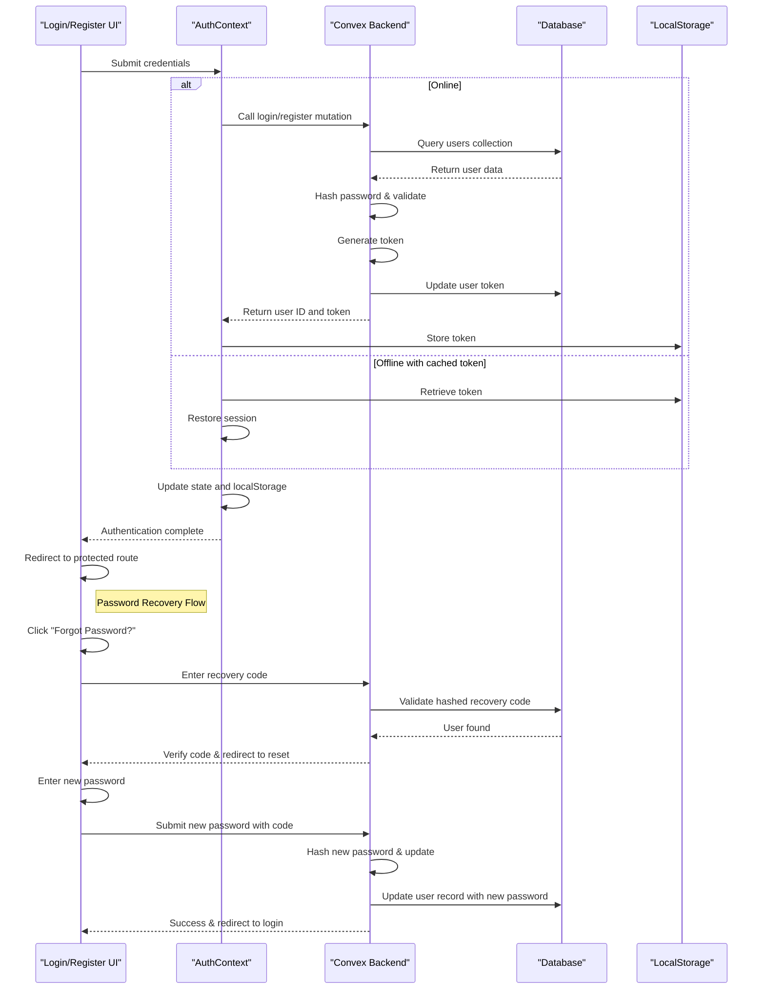
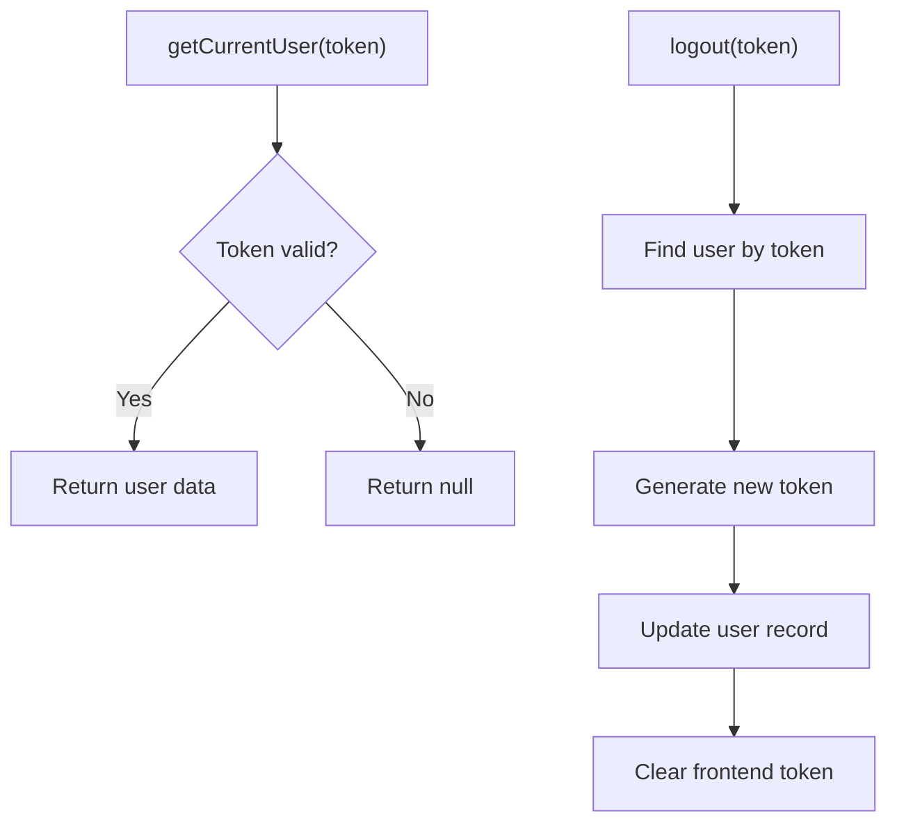
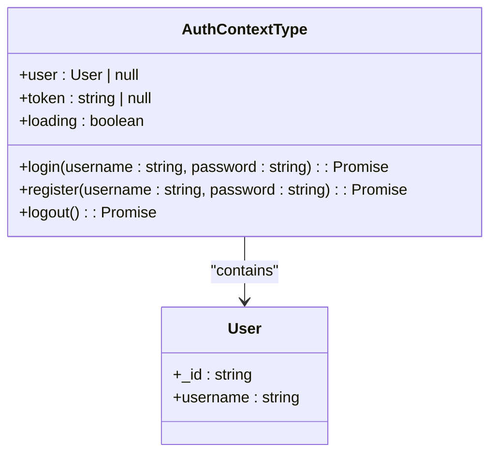
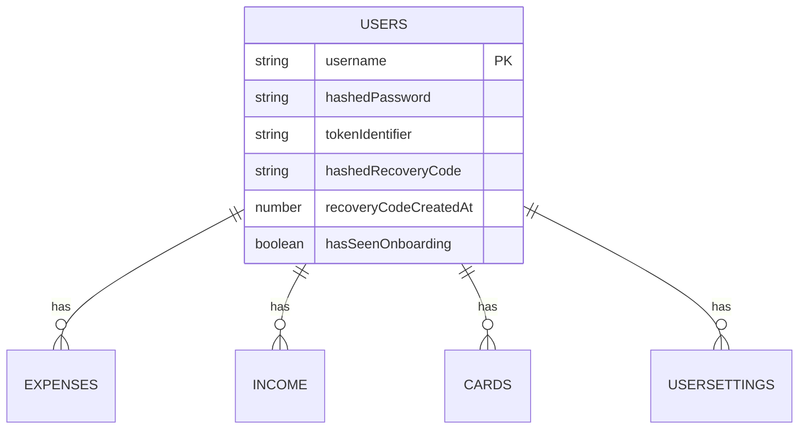
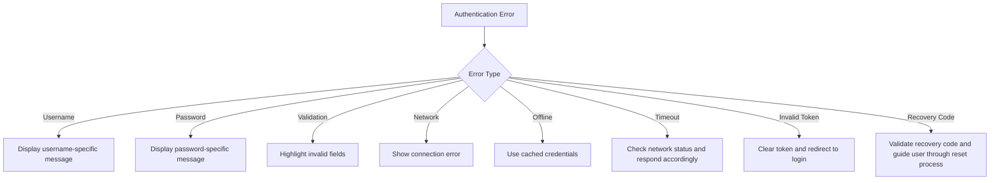
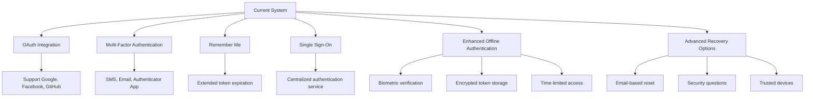

# Authentication System

<cite>
**Referenced Files in This Document**   
- [auth.ts](file://convex/auth.ts) - *Updated with recovery code system for password reset*
- [AuthContext.tsx](file://src/contexts/AuthContext.tsx) - *Updated for offline-first authentication and token caching*
- [ProtectedRoute.tsx](file://src/components/ProtectedRoute.tsx) - *Updated for offline capability integration and centralized authentication flow*
- [login/page.tsx](file://src/app/login/page.tsx) - *Updated for improved error messaging, offline support, and password recovery link*
- [register/page.tsx](file://src/app/register/page.tsx) - *Updated for improved error messaging*
- [schema.ts](file://convex/schema.ts)
- [OfflineFirstProvider.tsx](file://src/providers/OfflineFirstProvider.tsx) - *Added for offline capability management*
- [OfflineFirstWrapper.tsx](file://src/providers/OfflineFirstWrapper.tsx) - *Added for offline context wrapping*
- [forgot-password/page.tsx](file://src/app/forgot-password/page.tsx) - *Added for recovery code based password reset*
- [reset-password/page.tsx](file://src/app/reset-password/page.tsx) - *Added for password reset with recovery code*
- [RecoveryCodeCard.tsx](file://src/components/RecoveryCodeCard.tsx) - *Added for recovery code generation and display*
- [settings/page.tsx](file://src/app/settings/page.tsx) - *Updated to include recovery code management*
</cite>

## Update Summary
- **Password Recovery System**: Implemented complete recovery code-based password reset system with new pages and components
- **New Password Reset Flow**: Added forgot-password and reset-password pages for recovery code verification and password reset
- **Recovery Code Management**: Added RecoveryCodeCard component in settings for generating and managing recovery codes
- **Enhanced Login Page**: Added "Forgot Password?" link to login page for password recovery access
- **Backend Recovery Functions**: Added validateRecoveryCode and resetPasswordWithRecoveryCode mutations in auth.ts
- **User Settings Integration**: Integrated recovery code functionality into user settings with generate and regenerate options
- **Security Enhancements**: Implemented secure recovery code generation, hashing, and validation process
- **Improved Error Handling**: Enhanced error messaging for password recovery scenarios
- **Centralized Authentication Flow**: Authentication logic has been centralized in ProtectedRoute, eliminating redundant checks in individual pages
- **Enhanced Error Handling**: Improved error handling in ProtectedRoute with try-catch for offline capability hook initialization
- **Reduced Authentication Timeout**: Changed from 15 seconds to 5 seconds in AuthContext for faster response to authentication query timeouts
- **Enhanced Token Validation**: Added automatic token clearing when getCurrentUser query returns null, indicating an invalid token
- **Improved Loading State Management**: Updated loading state logic in AuthContext to handle authentication states more accurately
- **Automatic Redirection**: Implemented automatic redirection to login page in ProtectedRoute for unauthenticated users
- **Centralized Authentication Error Handling**: Introduced useAuthErrorHandler hook to manage authentication errors consistently across the application
- **Updated File Structure**: Modified layout.tsx to include AuthProvider in the component tree for global authentication access

## Table of Contents
1. [Authentication System Overview](#authentication-system-overview)
2. [Core Components](#core-components)
3. [Authentication Flow](#authentication-flow)
4. [Backend Authentication Implementation](#backend-authentication-implementation)
5. [Frontend State Management](#frontend-state-management)
6. [Route Protection Mechanism](#route-protection-mechanism)
7. [User Interface Components](#user-interface-components)
8. [Data Model and Schema](#data-model-and-schema)
9. [Error Handling and Edge Cases](#error-handling-and-edge-cases)
10. [Security Considerations](#security-considerations)
11. [Extension Opportunities](#extension-opportunities)

## Authentication System Overview
The authentication system in the Expense Tracker application provides secure user registration, login, session management, and token persistence using Convex backend functions and React Context. The system enables users to create accounts, authenticate their identity, and access protected routes while maintaining session state across application restarts. This document details the implementation of the authentication flow from UI forms to backend logic, including password hashing, token handling, and integration with route protection mechanisms. The system has been enhanced with offline-first capabilities, allowing users to authenticate using cached credentials when disconnected from the network. A comprehensive password recovery system has been implemented using recovery codes, enabling users to reset their passwords when they forget them.

**Section sources**
- [auth.ts](file://convex/auth.ts#L1-L261)
- [AuthContext.tsx](file://src/contexts/AuthContext.tsx#L1-L146)

## Core Components
The authentication system consists of several key components that work together to provide a seamless and secure user experience:

- **auth.ts**: Backend implementation of authentication logic using Convex mutations and queries, now including recovery code functionality
- **AuthContext.tsx**: Frontend state management using React Context to maintain user session with offline-first enhancements
- **ProtectedRoute.tsx**: Component that restricts access to authenticated users only, with support for offline capabilities and centralized authentication flow
- **login/page.tsx**: UI component for user login functionality with offline mode support and password recovery link
- **register/page.tsx**: UI component for user registration functionality
- **forgot-password/page.tsx**: New UI component for recovery code entry during password reset process
- **reset-password/page.tsx**: New UI component for setting a new password after recovery code verification
- **RecoveryCodeCard.tsx**: New component for generating and displaying recovery codes in user settings
- **settings/page.tsx**: Updated settings page with integrated recovery code management
- **OfflineFirstProvider.tsx**: Provider that manages offline capabilities and synchronization state
- **OfflineFirstWrapper.tsx**: Wrapper component that provides offline context based on authentication state

These components form a cohesive system where user interactions in the UI trigger frontend logic that communicates with backend authentication functions, while session state is maintained throughout the user's interaction with the application, including when operating in offline mode. The newly added password recovery components provide a secure way for users to regain access to their accounts when they forget their passwords.

**Section sources**
- [auth.ts](file://convex/auth.ts#L1-L261)
- [AuthContext.tsx](file://src/contexts/AuthContext.tsx#L1-L146)
- [ProtectedRoute.tsx](file://src/components/ProtectedRoute.tsx#L1-L97)
- [forgot-password/page.tsx](file://src/app/forgot-password/page.tsx#L1-L113)
- [reset-password/page.tsx](file://src/app/reset-password/page.tsx#L1-L227)
- [RecoveryCodeCard.tsx](file://src/components/RecoveryCodeCard.tsx#L1-L155)
- [settings/page.tsx](file://src/app/settings/page.tsx#L1-L211)
- [OfflineFirstProvider.tsx](file://src/providers/OfflineFirstProvider.tsx#L1-L100)
- [OfflineFirstWrapper.tsx](file://src/providers/OfflineFirstWrapper.tsx#L1-L18)

## Authentication Flow
The authentication flow in the Expense Tracker application follows a standard pattern for web applications, with specific implementations tailored to the Convex backend and React frontend architecture. The flow begins with user interaction through the registration or login forms, proceeds through frontend state management, communicates with backend authentication functions, and concludes with session establishment and route protection. The system now includes offline-first capabilities, allowing users to access cached credentials when disconnected from the network. Additionally, a new password recovery flow has been implemented using recovery codes, providing users with a secure way to reset their passwords when forgotten.



**Diagram sources**
- [auth.ts](file://convex/auth.ts#L1-L261)
- [AuthContext.tsx](file://src/contexts/AuthContext.tsx#L1-L146)
- [login/page.tsx](file://src/app/login/page.tsx#L1-L171)
- [forgot-password/page.tsx](file://src/app/forgot-password/page.tsx#L1-L113)
- [reset-password/page.tsx](file://src/app/reset-password/page.tsx#L1-L227)

## Backend Authentication Implementation
The backend authentication logic is implemented in the `auth.ts` file within the convex directory. This file contains Convex mutations and queries that handle user registration, login, session retrieval, logout functionality, and the new password recovery system.

### User Registration
The registration process begins when a user submits the registration form. The backend checks if the username already exists, normalizes the username to lowercase, hashes the password, generates a token, creates a new user record, and explicitly initializes the `hasSeenOnboarding` flag to false.

```typescript
export const register = mutation({
  args: {
    username: v.string(),
    password: v.string(),
  },
  handler: async (ctx, args) => {
    // Normalize username to lowercase
    const normalizedUsername = args.username.toLowerCase();

    // Check if user already exists (case-insensitive because we always store lowercase)
    const existingUser = await ctx.db
      .query("users")
      .withIndex("by_username", (q) => q.eq("username", normalizedUsername))
      .first();

    if (existingUser) {
      throw new ConvexError({ message: "Username already exists" });
    }

    // Create new user with hasSeenOnboarding explicitly set to false
    const hashedPassword = hashPassword(args.password);
    const tokenIdentifier = generateToken();

    const user = {
      username: normalizedUsername,
      hashedPassword,
      tokenIdentifier,
      hasSeenOnboarding: false,
    };

    const userId = await ctx.db.insert("users", user);

    // Seed default income categories
    const defaultIncomeCategories = [
      "Salary",
      "Freelance",
      "Investment",
      "Gift",
      "Other",
    ];

    for (const categoryName of defaultIncomeCategories) {
      await ctx.db.insert("incomeCategories", {
        name: categoryName,
        userId: userId,
      });
    }

    return { userId, token: tokenIdentifier };
  },
});
```

### User Login
The login process verifies user credentials by checking the username (normalized to lowercase), hashing the provided password, and comparing it with the stored hash. Upon successful authentication, a new token is generated and stored.

```typescript
export const login = mutation({
  args: {
    username: v.string(),
    password: v.string(),
  },
  handler: async (ctx, args) => {
    const normalizedUsername = args.username.toLowerCase();
    const user = await ctx.db
      .query("users")
      .withIndex("by_username", (q) => q.eq("username", normalizedUsername))
      .first();

    if (!user) {
      throw new ConvexError({ message: "Username not found" });
    }

    const hashedPassword = hashPassword(args.password);
    if (user.hashedPassword !== hashedPassword) {
      throw new ConvexError({ message: "Incorrect password" });
    }

    // Generate new token
    const tokenIdentifier = generateToken();
    await ctx.db.patch(user._id, { tokenIdentifier });

    return { userId: user._id, token: tokenIdentifier };
  },
});
```

### Session Management
The system maintains user sessions through token-based authentication. The current user is retrieved using the token, and logout functionality invalidates the current token.



### Password Recovery System
The system implements a secure password recovery mechanism using randomly generated recovery codes. When a user forgets their password, they can use a recovery code to verify their identity and reset their password.

#### Recovery Code Generation
Users can generate a recovery code from their settings page. The system creates a 10-character alphanumeric code formatted with hyphens (e.g., AB12-CD34-EF).

```typescript
// Helper function to generate recovery code (10 characters alphanumeric)
function createRecoveryCode(): string {
  const chars = 'ABCDEFGHIJKLMNOPQRSTUVWXYZ0123456789';
  let result = '';
  for (let i = 0; i < 10; i++) {
    result += chars.charAt(Math.floor(Math.random() * chars.length));
  }
  // Format as AB12-CD34-EF
  return `${result.slice(0, 4)}-${result.slice(4, 8)}-${result.slice(8)}`;
}

// Generate recovery code for user
export const generateRecoveryCode = mutation({
  args: {
    token: v.string(),
  },
  handler: async (ctx, args) => {
    const user = await getUserByToken({ ctx, token: args.token });
    if (!user) {
      throw new ConvexError({ message: "Authentication required" });
    }

    const recoveryCode = createRecoveryCode();
    const hashedRecoveryCode = hashRecoveryCode(recoveryCode);
    const recoveryCodeCreatedAt = Date.now();

    await ctx.db.patch(user._id, {
      hashedRecoveryCode,
      recoveryCodeCreatedAt,
    });

    return { recoveryCode };
  },
});
```

#### Recovery Code Validation
When a user enters a recovery code on the forgot-password page, the system validates it by hashing the provided code and searching for a matching user.

```typescript
// Validate recovery code and allow password reset
export const validateRecoveryCode = mutation({
  args: {
    recoveryCode: v.string(),
  },
  handler: async (ctx, args) => {
    const hashedRecoveryCode = hashRecoveryCode(args.recoveryCode);
    
    const users = await ctx.db.query("users").collect();
    const user = users.find(u => u.hashedRecoveryCode === hashedRecoveryCode);

    if (!user) {
      throw new ConvexError({ message: "Invalid recovery code" });
    }

    return { userId: user._id, username: user.username };
  },
});
```

#### Password Reset with Recovery Code
After successful recovery code validation, users can reset their password using the reset-password page. The system updates the user's password and generates a new authentication token.

```typescript
// Reset password using recovery code
export const resetPasswordWithRecoveryCode = mutation({
  args: {
    recoveryCode: v.string(),
    newPassword: v.string(),
  },
  handler: async (ctx, args) => {
    if (args.newPassword.length < 6) {
      throw new ConvexError({ message: "Password must be at least 6 characters long" });
    }

    const hashedRecoveryCode = hashRecoveryCode(args.recoveryCode);
    
    const users = await ctx.db.query("users").collect();
    const user = users.find(u => u.hashedRecoveryCode === hashedRecoveryCode);

    if (!user) {
      throw new ConvexError({ message: "Invalid recovery code" });
    }

    const hashedPassword = hashPassword(args.newPassword);
    const tokenIdentifier = generateToken();

    await ctx.db.patch(user._id, {
      hashedPassword,
      tokenIdentifier,
    });

    return { userId: user._id, token: tokenIdentifier };
  },
});
```

**Diagram sources**
- [auth.ts](file://convex/auth.ts#L1-L261)

**Section sources**
- [auth.ts](file://convex/auth.ts#L1-L261)

## Frontend State Management
The frontend authentication state is managed using React Context in the `AuthContext.tsx` file. This context provides a centralized way to manage user authentication state across the application with enhanced offline-first capabilities.

### AuthContext Implementation
The AuthContext uses Convex's useMutation and useQuery hooks to interact with the backend authentication functions. It maintains the user object, authentication token, and loading state with comprehensive offline support.

```typescript
const AuthContext = createContext<AuthContextType | undefined>(undefined);

export function AuthProvider({ children }: { children: ReactNode }) {
  const [token, setToken] = useState<string | null>(null);
  const [loading, setLoading] = useState(true);
  const [initialLoad, setInitialLoad] = useState(true);
  const [hasSetTimeout, setHasSetTimeout] = useState(false);

  const loginMutation = useMutation(api.auth.login);
  const registerMutation = useMutation(api.auth.register);
  const logoutMutation = useMutation(api.auth.logout);

  const user = useQuery(api.auth.getCurrentUser, token ? { token } : "skip");

  useEffect(() => {
    // Load token from localStorage on mount
    const savedToken = localStorage.getItem("auth-token");
    if (savedToken) {
      setToken(savedToken);
    }
    setInitialLoad(false);
  }, []);

  // Update loading state when user query resolves or when we have no token
  useEffect(() => {
    if (!initialLoad) {
      if (!token) {
        // No token, not loading
        setLoading(false);
        setHasSetTimeout(false);
      } else {
        // Have token - check if user query has resolved
        if (user !== undefined) {
          // Query resolved (either with user data or null)
          if (user === null) {
            // User query returned null - token is invalid
            console.warn('Token appears to be invalid, clearing auth state');
            setToken(null);
            localStorage.removeItem('auth-token');
          }
          setLoading(false);
          setHasSetTimeout(false);
        } else if (!hasSetTimeout) {
          // Check if we're offline
          if (!navigator.onLine) {
            // If offline and we have a token, assume user is authenticated
            console.log('AuthContext: Offline mode - keeping token and stopping loading');
            setLoading(false);
            setHasSetTimeout(false);
            return;
          }
          
          // Query still loading and we haven't set a timeout yet
          setHasSetTimeout(true);
          const timeoutId = setTimeout(() => {
            console.warn('Auth query timeout after 5 seconds, checking if offline');
            if (!navigator.onLine) {
              // If offline, keep the token and stop loading
              console.log('AuthContext: Timeout while offline - keeping authentication state');
              setLoading(false);
            } else {
              // If online but query failed, token may be invalid
              console.warn('Clearing invalid token after timeout');
              setToken(null);
              localStorage.removeItem('auth-token');
              setLoading(false);
            }
            setHasSetTimeout(false);
          }, 5000); // Reduced to 5 seconds for faster response
          
          return () => {
            clearTimeout(timeoutId);
            setHasSetTimeout(false);
          };
        }
      }
    }
  }, [token, user, initialLoad, hasSetTimeout]);

  const login = async (username: string, password: string) => {
    try {
      const result = await loginMutation({ username, password });
      setToken(result.token);
      localStorage.setItem("auth-token", result.token);
    } catch (error) {
      throw error;
    }
  };

  const register = async (username: string, password: string) => {
    try {
      const result = await registerMutation({ username, password });
      setToken(result.token);
      localStorage.setItem("auth-token", result.token);
    } catch (error) {
      throw error;
    }
  };

  const logout = async () => {
    if (token) {
      try {
        await logoutMutation({ token });
      } catch (error) {
        console.error("Logout error:", error);
      }
    }
    setToken(null);
    localStorage.removeItem("auth-token");
  };

  return (
    <AuthContext.Provider
      value={{
        user: user || null,
        token,
        login,
        register,
        logout,
        loading,
      }}
    >
      {children}
    </AuthContext.Provider>
  );
}
```

### Token Persistence
The authentication system persists tokens using localStorage, allowing users to remain authenticated across browser sessions. When the application loads, the AuthProvider checks for a saved token and automatically attempts to restore the user session. The system now includes enhanced offline handling with query timeout and network status detection.



**Diagram sources**
- [AuthContext.tsx](file://src/contexts/AuthContext.tsx#L1-L146)

**Section sources**
- [AuthContext.tsx](file://src/contexts/AuthContext.tsx#L1-L146)

## Route Protection Mechanism
The ProtectedRoute component ensures that only authenticated users can access certain parts of the application. It uses the authentication state from AuthContext to determine whether to render the protected content or redirect to the login page. The component has been updated to support offline-first functionality, allowing access when the user has cached credentials and is operating offline. Authentication flow has been centralized in ProtectedRoute, eliminating redundant checks in individual pages.

### ProtectedRoute Implementation
The ProtectedRoute component checks the user authentication status and handles the redirection logic accordingly, with support for offline capabilities and improved error handling.

```typescript
export function ProtectedRoute({ children }: ProtectedRouteProps) {
  const { user, loading, token } = useAuth();
  const router = useRouter();
  const [hasRedirected, setHasRedirected] = useState(false);
  
  // Use a try-catch for the offline capability hook in case it's not properly initialized
  let offlineState = {
    canFunctionOffline: false,
    isInitialized: false,
    isOnline: true
  };
  
  try {
    offlineState = useOfflineCapability();
  } catch (error) {
    console.warn('ProtectedRoute: OfflineCapability not available, proceeding with online-only mode:', error);
    // If offline provider fails, mark as initialized to prevent blocking
    offlineState.isInitialized = true;
  }
  
  const { canFunctionOffline, isInitialized, isOnline } = offlineState;

  useEffect(() => {
    // Don't redirect while still loading authentication or offline capabilities
    if (loading || !isInitialized || hasRedirected) {
      return;
    }

    // If we have a user, we're authenticated and good to go
    if (user) {
      return;
    }

    // If offline but can function with local data, allow access
    if (canFunctionOffline && !isOnline) {
      console.log('ProtectedRoute: Allowing offline access with local data');
      return;
    }

    // If we have a token but no user (possible network issue), allow temporary access
    if (token && !user && isOnline) {
      // Give the user query a bit more time to resolve
      const timer = setTimeout(() => {
        if (!user && token) {
          console.log('ProtectedRoute: Token exists but no user after timeout, continuing anyway');
        }
      }, 2000);
      return () => clearTimeout(timer);
    }

    // No authentication available - redirect to login
    if (!user && !token && !hasRedirected) {
      console.log('ProtectedRoute: No authentication, redirecting to login');
      setHasRedirected(true);
      router.replace("/login");
    }
  }, [user, loading, router, canFunctionOffline, isInitialized, isOnline, token, hasRedirected]);

  // Single loading screen while initializing
  if (loading || !isInitialized) {
    return (
      <div className="min-h-screen bg-gray-50 flex items-center justify-center">
        <div className="text-center">
          <div className="inline-block h-8 w-8 animate-spin rounded-full border-4 border-solid border-blue-600 border-r-transparent align-[-0.125em] motion-reduce:animate-[spin_1.5s_linear_infinite]"></div>
          <div className="mt-4 text-lg font-medium text-gray-900">Loading...</div>
          <div className="mt-2 text-sm text-gray-600">Initializing your session</div>
        </div>
      </div>
    );
  }

  // Allow access if authenticated or can function offline
  if (user || (canFunctionOffline && !isOnline) || token) {
    return <>{children}</>;
  }

  // If we get here, redirect is in progress
  return (
    <div className="min-h-screen bg-gray-50 flex items-center justify-center">
      <div className="text-center">
        <div className="inline-block h-8 w-8 animate-spin rounded-full border-4 border-solid border-blue-600 border-r-transparent align-[-0.125em] motion-reduce:animate-[spin_1.5s_linear_infinite]"></div>
        <div className="mt-4 text-lg font-medium text-gray-900">Redirecting...</div>
        <div className="mt-2 text-sm text-gray-600">Taking you to the login page</div>
      </div>
    </div>
  );
}
```

### Protected Routes Usage
The ProtectedRoute component is used to wrap content in various pages that require authentication, with enhanced support for offline access:

```mermaid
graph TB
subgraph "Protected Routes"
A["/dashboard"] --> ProtectedRoute
B["/expenses"] --> ProtectedRoute
C["/income"] --> ProtectedRoute
D["/cards"] --> ProtectedRoute
E["/settings"] --> ProtectedRoute
end
ProtectedRoute --> AuthContext : "checks user state"
AuthContext --> Backend : "verifies token"
ProtectedRoute --> OfflineFirstProvider : "checks offline capability"
```

**Diagram sources**
- [ProtectedRoute.tsx](file://src/components/ProtectedRoute.tsx#L1-L97)
- [OfflineFirstProvider.tsx](file://src/providers/OfflineFirstProvider.tsx#L1-L100)

**Section sources**
- [ProtectedRoute.tsx](file://src/components/ProtectedRoute.tsx#L1-L97)
- [OfflineFirstProvider.tsx](file://src/providers/OfflineFirstProvider.tsx#L1-L100)

## User Interface Components
The user interface for authentication consists of several components: the login page, registration page, and the new password recovery components. These components provide forms for users to authenticate, create new accounts, or reset forgotten passwords. The login page has been enhanced with offline-first functionality, allowing users to access cached credentials when disconnected from the network. The new password recovery flow provides a secure way for users to reset their passwords when they forget them.

### Login Page
The login page implements a form that collects username and password, handles form submission, and provides specific feedback to the user based on error types. It now includes offline mode detection, cached credential usage, and a link to the password recovery flow.

```typescript
const handleSubmit = async (e: React.FormEvent) => {
  e.preventDefault();
  
  if (!username.trim() || !password.trim()) {
    toast.error("Please enter your username and password.");
    return;
  }

  // Check if offline
  if (!navigator.onLine) {
    const cachedToken = localStorage.getItem("auth-token");
    if (cachedToken) {
      toast.success("Using cached credentials (offline mode)");
      router.push("/expenses");
      return;
    } else {
      toast.error("No internet connection. Please connect to login for the first time.");
      return;
    }
  }

  setIsLoading(true);
  try {
    await login(username.trim(), password);
    toast.success("Welcome back!");
    router.push("/expenses");
  } catch (error: unknown) {
    const message = error instanceof ConvexError ? (error.data as { message: string }).message : error instanceof Error ? error.message : "Login failed. Please try again.";
    if (message.toLowerCase().includes("username not found")) {
      toast.error("Username not found. Please check your entry or create an account.");
      router.push("/register");
    } else if (message.toLowerCase().includes("incorrect password")) {
      toast.error("The password you entered is incorrect.");
    } else {
      toast.error(message);
    }
  } finally {
    setIsLoading(false);
  }
};
```

### Registration Page
The registration page includes additional validation for password confirmation and length requirements, with user-friendly error messages.

```typescript
const handleSubmit = async (e: React.FormEvent) => {
  e.preventDefault();
  
  if (!username.trim() || !password.trim() || !confirmPassword.trim()) {
    toast.error("Please fill out all fields to continue.");
    return;
  }

  if (password !== confirmPassword) {
    toast.error("The passwords you entered do not match. Please try again.");
    return;
  }

  if (password.length < 6) {
    toast.error("For security, your password must be at least 6 characters long.");
    return;
  }

  setIsLoading(true);
  try {
    await register(username.trim(), password);
    toast.success("Welcome! Your account has been created successfully.");
    router.push("/onboarding");
  } catch (error: unknown) {
    const message = error instanceof ConvexError ? (error.data as { message: string }).message : error instanceof Error ? error.message : "Account creation failed. Please try again.";
    if (message.toLowerCase().includes("username already exists")) {
      toast.error("This username is already taken. Please choose another or sign in.");
    } else {
      toast.error(message);
    }
  } finally {
    setIsLoading(false);
  }
};
```

### Forgot Password Page
The forgot-password page allows users to enter their recovery code to initiate the password reset process. It validates the recovery code with the backend and redirects to the reset-password page upon successful validation.

```typescript
const handleSubmit = async (e: React.FormEvent) => {
  e.preventDefault();
  
  if (!recoveryCode.trim()) {
    toast.error("Please enter your recovery code.");
    return;
  }

  setIsLoading(true);
  try {
    const result = await validateRecoveryMutation({ recoveryCode: recoveryCode.trim() });
    toast.success("Recovery code verified!");
    
    // Navigate to reset password page with the validated user info
    router.push(`/reset-password?code=${encodeURIComponent(recoveryCode.trim())}&username=${encodeURIComponent(result.username)}`);
  } catch (error: unknown) {
    const message = error instanceof ConvexError 
      ? (error.data as { message: string }).message 
      : error instanceof Error 
      ? error.message 
      : "Invalid recovery code. Please try again.";
    toast.error(message);
  } finally {
    setIsLoading(false);
  }
};
```

### Reset Password Page
The reset-password page allows users to set a new password after their recovery code has been validated. It includes password strength validation and securely submits the new password with the recovery code to the backend.

```typescript
const handleSubmit = async (e: React.FormEvent) => {
  e.preventDefault();
  
  if (!newPassword.trim() || !confirmPassword.trim()) {
    toast.error("Please fill in all password fields.");
    return;
  }

  if (newPassword !== confirmPassword) {
    toast.error("Passwords do not match.");
    return;
  }

  if (newPassword.length < 6) {
    toast.error("Password must be at least 6 characters long.");
    return;
  }

  if (!recoveryCode) {
    toast.error("Recovery code is missing.");
    return;
  }

  setIsLoading(true);
  try {
    const result = await resetPasswordMutation({ 
      recoveryCode,
      newPassword 
    });
    
    toast.success("Password reset successfully! Logging you in...");
    
    // Store the new token and redirect
    localStorage.setItem("auth-token", result.token);
    router.push("/expenses");
  } catch (error: unknown) {
    const message = error instanceof ConvexError 
      ? (error.data as { message: string }).message 
      : error instanceof Error 
      ? error.message 
      : "Failed to reset password. Please try again.";
    toast.error(message);
    
    // If recovery code is invalid, redirect back to forgot password
    if (message.toLowerCase().includes("invalid recovery code")) {
      setTimeout(() => router.push("/forgot-password"), 2000);
    }
  } finally {
    setIsLoading(false);
  }
};
```

### Recovery Code Card
The RecoveryCodeCard component in the settings page allows users to generate and manage their recovery codes. It displays a modal with the generated code and provides options to show/hide and copy the code.

```typescript
function RecoveryCodeCard() {
  const { token } = useAuth();
  const [showGenerateModal, setShowGenerateModal] = useState(false);
  const [generatedCode, setGeneratedCode] = useState<string | null>(null);
  const [isCodeVisible, setIsCodeVisible] = useState(false);
  const [isCopied, setIsCopied] = useState(false);

  const hasRecoveryCode = useQuery(api.auth.hasRecoveryCode, token ? { token } : "skip");
  const generateRecoveryMutation = useMutation(api.auth.generateRecoveryCode);

  const handleGenerateCode = async () => {
    if (!token) return;
    
    try {
      const result = await generateRecoveryMutation({ token });
      setGeneratedCode(result.recoveryCode);
      setShowGenerateModal(true);
      toast.success("Recovery code generated successfully!");
    } catch (error: any) {
      toast.error(error.message || "Failed to generate recovery code");
    }
  };

  const handleCopyCode = async () => {
    if (!generatedCode) return;
    
    try {
      await navigator.clipboard.writeText(generatedCode);
      setIsCopied(true);
      toast.success("Recovery code copied to clipboard!");
      setTimeout(() => setIsCopied(false), 2000);
    } catch {
      toast.error("Failed to copy to clipboard");
    }
  };

  const handleCloseModal = () => {
    setShowGenerateModal(false);
    setGeneratedCode(null);
    setIsCodeVisible(false);
    setIsCopied(false);
  };

  return (
    <>
      <div className="mb-6">
        <h3 className="text-lg font-semibold text-gray-900 mb-4">Security</h3>
        
        <div className="p-4 bg-gray-50 rounded-lg border border-gray-200">
          <div className="flex items-center justify-between">
            <div className="flex items-center space-x-3">
              <Shield className="text-blue-600" size={20} />
              <div>
                <div className="font-medium text-gray-900">Recovery Code</div>
                <div className="text-sm text-gray-600">
                  {hasRecoveryCode 
                    ? "You have a recovery code set up" 
                    : "Set up a recovery code for password reset"
                  }
                </div>
              </div>
            </div>
            
            <button
              onClick={handleGenerateCode}
              className="px-4 py-2 bg-blue-600 text-white rounded-md hover:bg-blue-700 text-sm"
            >
              {hasRecoveryCode ? "Regenerate" : "Generate"}
            </button>
          </div>
        </div>
      </div>
    </>
  );
}
```

**Section sources**
- [login/page.tsx](file://src/app/login/page.tsx#L1-L171)
- [register/page.tsx](file://src/app/register/page.tsx#L1-L152)
- [forgot-password/page.tsx](file://src/app/forgot-password/page.tsx#L1-L113)
- [reset-password/page.tsx](file://src/app/reset-password/page.tsx#L1-L227)
- [RecoveryCodeCard.tsx](file://src/components/RecoveryCodeCard.tsx#L1-L155)
- [settings/page.tsx](file://src/app/settings/page.tsx#L1-L211)

## Data Model and Schema
The user data model is defined in the `schema.ts` file, which specifies the structure of the users table and its indexes.

### User Schema
```typescript
users: defineTable({
  username: v.string(),
  hashedPassword: v.string(),
  tokenIdentifier: v.string(),
  hasSeenOnboarding: v.optional(v.boolean()),
}).index("by_username", ["username"]).index("by_token", ["tokenIdentifier"]),
```

The schema includes:
- **username**: Unique identifier for the user (stored in lowercase)
- **hashedPassword**: Password stored in hashed form
- **tokenIdentifier**: Current authentication token
- **hasSeenOnboarding**: Optional flag to track onboarding status, explicitly initialized to false for new users

The table has two indexes:
- `by_username`: Enables efficient lookup by username during login
- `by_token`: Enables efficient session validation by token

Additionally, the password recovery system uses the following fields in the user schema:
- **hashedRecoveryCode**: Stores the hashed version of the recovery code
- **recoveryCodeCreatedAt**: Timestamp when the recovery code was generated



**Diagram sources**
- [schema.ts](file://convex/schema.ts#L1-L66)

**Section sources**
- [schema.ts](file://convex/schema.ts#L1-L66)

## Error Handling and Edge Cases
The authentication system includes comprehensive error handling for various scenarios that may occur during user authentication.

### Common Issues and Solutions
**Failed Logins**
- **Cause**: Incorrect username or password
- **Handling**: The backend returns specific error messages ("Username not found", "Incorrect password") which are processed by the frontend to display user-friendly messages
- **User Experience**: Specific feedback helps users understand whether they need to check their username or password

**Username Conflicts**
- **Cause**: Attempting to register with an existing username
- **Handling**: Backend returns "Username already exists" error, frontend displays "This username is already taken. Please choose another or sign in."
- **Security**: Error message suggests signing in as an alternative action

**Session Expiration**
- **Cause**: Token invalidation after logout or system maintenance
- **Handling**: The ProtectedRoute component detects the lack of valid authentication and redirects to the login page
- **User Experience**: Seamless redirection without displaying error messages

**Offline Authentication**
- **Cause**: Network connectivity issues preventing communication with the backend
- **Handling**: The system now supports offline-first authentication by checking for cached tokens in localStorage and allowing access to protected routes when offline with valid cached credentials
- **User Experience**: Users see a clear "Offline Mode" indicator and can continue using the application with cached data

**Authentication Query Timeout**
- **Cause**: Slow network connection causing the getCurrentUser query to take longer than expected
- **Handling**: The AuthContext implements a 5-second timeout (reduced from 15 seconds) that checks the network status and either continues with the cached token (if offline) or clears the token (if online but query failed)
- **User Experience**: Prevents indefinite loading states and provides appropriate feedback based on network conditions

**Invalid Token Handling**
- **Cause**: Token is no longer valid (user deleted, token expired, etc.)
- **Handling**: When getCurrentUser query returns null, the system automatically clears the invalid token and removes it from localStorage
- **User Experience**: Users are seamlessly redirected to login when their session is no longer valid

**Password Recovery Issues**
- **Invalid Recovery Code**: When a user enters an incorrect recovery code, the system displays "Invalid recovery code. Please try again." and allows them to re-enter the code
- **Missing Recovery Code**: If a user hasn't generated a recovery code, they're prompted to do so from the settings page
- **Expired Recovery Code**: Currently, recovery codes don't expire, but this could be implemented by checking the recoveryCodeCreatedAt timestamp
- **Recovery Code Security**: The system emphasizes that recovery codes should be stored securely and never shared, as they allow anyone to reset the password



**Diagram sources**
- [auth.ts](file://convex/auth.ts#L1-L261)
- [AuthContext.tsx](file://src/contexts/AuthContext.tsx#L1-L146)
- [login/page.tsx](file://src/app/login/page.tsx#L1-L171)
- [forgot-password/page.tsx](file://src/app/forgot-password/page.tsx#L1-L113)
- [reset-password/page.tsx](file://src/app/reset-password/page.tsx#L1-L227)

**Section sources**
- [auth.ts](file://convex/auth.ts#L1-L261)
- [AuthContext.tsx](file://src/contexts/AuthContext.tsx#L1-L146)
- [login/page.tsx](file://src/app/login/page.tsx#L1-L171)
- [forgot-password/page.tsx](file://src/app/forgot-password/page.tsx#L1-L113)
- [reset-password/page.tsx](file://src/app/reset-password/page.tsx#L1-L227)

## Security Considerations
The authentication system implements several security measures to protect user data and prevent common vulnerabilities.

### Password Hashing
The system uses a simple hashing function for password storage:
```typescript
function hashPassword(password: string): string {
  let hash = 0;
  const saltedPassword = password + "expense-tracker-salt";
  for (let i = 0; i < saltedPassword.length; i++) {
    const char = saltedPassword.charCodeAt(i);
    hash = ((hash << 5) - hash) + char;
    hash = hash & hash;
  }
  return hash.toString(36);
}
```

**Note**: This is a simple hash function for demonstration purposes. In production, bcrypt or similar password hashing algorithms should be used.

### Username Normalization
Usernames are normalized to lowercase before storage and comparison, preventing case-based username conflicts and ensuring consistent user identification.

### Error Handling Security
The system uses structured error objects with data payloads to safely transmit error information from backend to frontend:
```typescript
throw new ConvexError({ message: "Username not found" });
```

This approach allows the frontend to access error details through `error.data` while preventing exposure of internal implementation details in production.

### Token Management
- Tokens are generated using random string generation
- Tokens are stored in the database and updated on each login
- Tokens are stored in localStorage for persistence
- Tokens are invalidated on logout by generating a new one
- Invalid tokens are automatically cleared when detected (getCurrentUser returns null)

### Recovery Code Security
The password recovery system implements several security measures:
- **Random Generation**: Recovery codes are randomly generated 10-character alphanumeric strings
- **Secure Storage**: Recovery codes are hashed before storage using the same method as passwords
- **One-way Verification**: The system only stores the hash of the recovery code, not the plain text version
- **User Education**: Users are warned about the sensitivity of recovery codes and advised to store them securely
- **Regeneration Option**: Users can regenerate their recovery code if they suspect it has been compromised

### Security Recommendations
1. **Upgrade Password Hashing**: Replace the simple hash function with bcrypt or Argon2
2. **Implement HTTPS**: Ensure all authentication requests are transmitted over encrypted connections
3. **Add Rate Limiting**: Prevent brute force attacks by limiting login attempts
4. **Use HttpOnly Cookies**: Consider using HttpOnly cookies instead of localStorage for token storage to prevent XSS attacks
5. **Implement Token Expiration**: Add expiration times to tokens for enhanced security
6. **Add CSRF Protection**: Implement CSRF tokens for additional protection against cross-site request forgery
7. **Enhance Offline Security**: Consider encrypting stored tokens and implementing token refresh mechanisms for offline scenarios
8. **Recovery Code Expiration**: Implement expiration for recovery codes to enhance security
9. **Multi-Factor Authentication**: Add additional authentication factors beyond just recovery codes
10. **Audit Logging**: Implement logging of authentication events for security monitoring

**Section sources**
- [auth.ts](file://convex/auth.ts#L1-L261)

## Extension Opportunities
The authentication system can be extended to support additional authentication methods and security features.

### OAuth Integration
The system can be extended to support OAuth providers such as Google, Facebook, or GitHub. This would involve:
- Adding OAuth configuration to the backend
- Implementing OAuth callback handlers
- Creating social login buttons in the UI
- Mapping OAuth identities to user accounts

### Multi-Factor Authentication
Multi-factor authentication (MFA) can be implemented by:
- Adding a second factor field to the user schema (e.g., phone number or email)
- Implementing MFA enrollment process
- Modifying the login flow to require a second factor
- Integrating with SMS or authenticator apps for code delivery

### Remember Me Functionality
Enhance the token persistence system to support "Remember Me" functionality with different expiration policies based on user preference.

### Single Sign-On (SSO)
Implement SSO capabilities to allow users to authenticate across multiple applications with a single set of credentials.

### Enhanced Offline Authentication
Extend the offline-first capabilities with:
- Biometric authentication for cached sessions
- Time-limited offline access
- Synchronized authentication state across devices
- Encrypted local token storage

### Advanced Recovery Options
Expand the recovery system with additional options:
- Email-based password reset
- Security questions
- Trusted device recognition
- Account recovery contacts



**Diagram sources**
- [auth.ts](file://convex/auth.ts#L1-L261)
- [AuthContext.tsx](file://src/contexts/AuthContext.tsx#L1-L146)

**Section sources**
- [auth.ts](file://convex/auth.ts#L1-L261)
- [AuthContext.tsx](file://src/contexts/AuthContext.tsx#L1-L146)