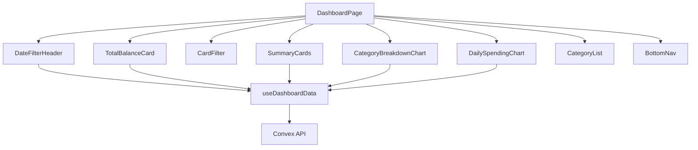
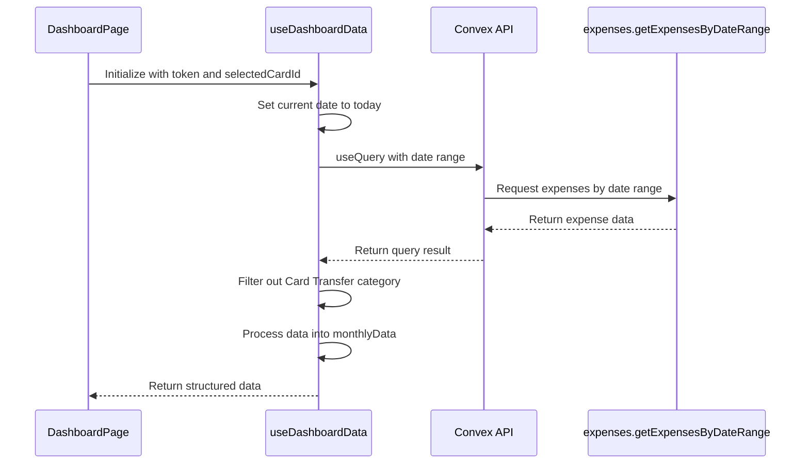
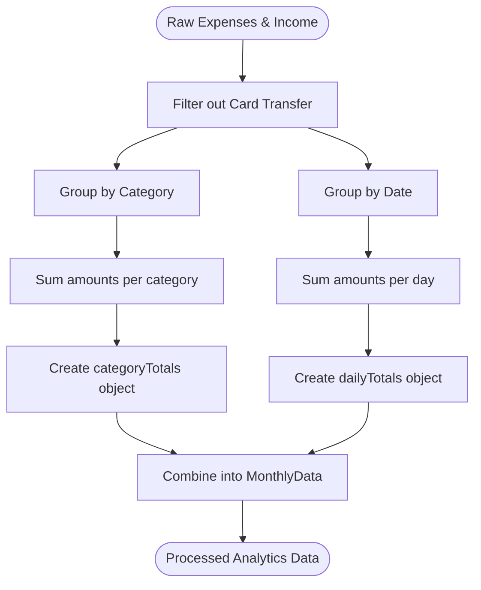
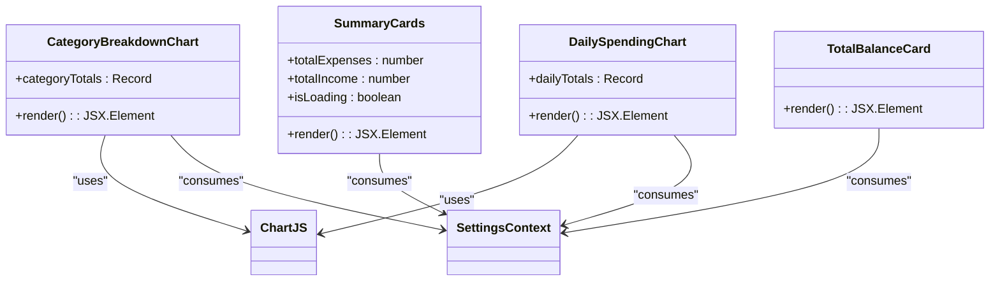

# Dashboard & Analytics

<cite>
**Referenced Files in This Document**   
- [page.tsx](file://src/app/dashboard/page.tsx) - *Updated to use TotalBalanceCard and useDashboardData*
- [useDashboardData.ts](file://src/features/dashboard/hooks/useDashboardData.ts) - *Updated to exclude Card Transfer category from calculations*
- [CategoryBreakdownChart.tsx](file://src/features/dashboard/components/Charts/CategoryBreakdownChart.tsx) - *Updated to filter out Card Transfer category*
- [CategoryList.tsx](file://src/features/dashboard/components/CategoryList/CategoryList.tsx) - *Updated to exclude Card Transfer from category list*
- [TotalBalanceCard.tsx](file://src/features/dashboard/components/TotalBalanceCard/TotalBalanceCard.tsx) - *New component replacing CardBalances*
- [SummaryCards.tsx](file://src/features/dashboard/components/SummaryCards/SummaryCards.tsx)
- [expense.ts](file://src/features/dashboard/types/expense.ts)
- [formatters.ts](file://src/lib/formatters.ts)
- [SettingsContext.tsx](file://src/contexts/SettingsContext.tsx)
</cite>

## Update Summary
**Changes Made**   
- Updated documentation to reflect exclusion of "Card Transfer" category from dashboard calculations and visualizations
- Replaced references to CardBalances component with TotalBalanceCard
- Updated data fetching hook reference from useExpenseData to useDashboardData
- Added new component TotalBalanceCard to referenced files
- Updated section sources to reflect actual file changes in recent commits

## Table of Contents
1. [Dashboard & Analytics](#dashboard--analytics)
2. [Dashboard Layout and Component Structure](#dashboard-layout-and-component-structure)
3. [Real-Time Data Fetching with useDashboardData Hook](#real-time-data-fetching-with-usedashboarddata-hook)
4. [Data Transformation and Aggregation](#data-transformation-and-aggregation)
5. [Visualization of Spending Trends](#visualization-of-spending-trends)
6. [Performance Considerations](#performance-considerations)
7. [Customization Options](#customization-options)
8. [Troubleshooting Common Issues](#troubleshooting-common-issues)

## Dashboard Layout and Component Structure

The Dashboard & Analytics page serves as the central hub for financial insights, displaying key metrics and visualizations of user spending behavior. The layout is organized into a clean, mobile-first design with a top navigation header, summary cards, and multiple data visualization sections.

The main dashboard component (`page.tsx`) orchestrates the UI by importing and composing several modular components from the `features/dashboard` directory. These include:

- **DateFilterHeader**: Displays the current month and navigation controls
- **SummaryCards**: Shows total income, expenses and expense count
- **TotalBalanceCard**: Displays total balance across all cards with navigation to cards page
- **CardFilter**: Allows filtering data by specific card
- **CategoryBreakdownChart**: Visualizes spending by category
- **DailySpendingChart**: Shows daily spending trends
- **CategoryList**: Lists categories with their respective spending

The dashboard uses Framer Motion for smooth animations and follows a responsive design pattern optimized for mobile devices with a maximum width of 768px.

**Diagram sources**
- [page.tsx](file://src/app/dashboard/page.tsx)
- [useDashboardData.ts](file://src/features/dashboard/hooks/useDashboardData.ts)

**Section sources**
- [page.tsx](file://src/app/dashboard/page.tsx)

## Real-Time Data Fetching with useDashboardData Hook

The `useDashboardData` hook is the core data-fetching mechanism for the dashboard, responsible for retrieving and managing expense and income data from the Convex backend. It uses the `useQuery` hook from Convex to fetch expenses and income within a specific date range based on the current month.

The hook accepts an authentication token and selected card ID, and returns several key pieces of state:
- `currentDate`: The currently displayed month
- `expenses`: Raw expense data for the current month
- `monthlyData`: Processed data including totals and aggregations
- `isLoading`: Loading state indicator
- Navigation functions: `goToPreviousMonth`, `goToNextMonth`
- `refetchExpenses`: Function to manually refresh data

Date filtering is implemented using `jalali-moment` utilities to calculate the start and end of the current month, supporting both Gregorian and Jalali calendar systems based on user settings. The hook uses a `key` state variable to force re-fetching of data when needed, providing a manual refresh mechanism.

The hook now filters out "Card Transfer" category from both expenses and income calculations to prevent double-counting of funds that are simply moved between cards.

**Diagram sources**
- [useDashboardData.ts](file://src/features/dashboard/hooks/useDashboardData.ts)

**Section sources**
- [useDashboardData.ts](file://src/features/dashboard/hooks/useDashboardData.ts)

## Data Transformation and Aggregation

Raw expense and income data is transformed into meaningful analytics through data aggregation in the `useDashboardData` hook. The transformation process uses `useMemo` to optimize performance by memoizing the results and only recalculating when the underlying `expenses` or `income` data changes.

Two primary aggregation methods are implemented:

1. **Category Totals**: Expenses are grouped by category using `Array.reduce()`. The implementation handles both single categories and arrays of categories, summing amounts for each category. The "Card Transfer" category is explicitly filtered out to prevent double-counting.

2. **Daily Totals**: Expenses are grouped by date using a formatted date string as the key (e.g., "2024-01-15"). This creates a time-series dataset suitable for charting daily spending patterns.

The aggregated data is structured in the `MonthlyData` interface, which includes:
- `totalExpenses`: Sum of all expenses (excluding Card Transfer)
- `totalIncome`: Sum of all income (excluding Card Transfer)
- `totalCount`: Number of expense items
- `categoryTotals`: Object mapping category names to total amounts
- `dailyTotals`: Object mapping date strings to daily totals

**Diagram sources**
- [useDashboardData.ts](file://src/features/dashboard/hooks/useDashboardData.ts)
- [expense.ts](file://src/features/dashboard/types/expense.ts)

**Section sources**
- [useDashboardData.ts](file://src/features/dashboard/hooks/useDashboardData.ts)
- [expense.ts](file://src/features/dashboard/types/expense.ts)

## Visualization of Spending Trends

### Category Breakdown Chart

The `CategoryBreakdownChart` component visualizes spending distribution across categories using a pie chart powered by Chart.js. It receives `categoryTotals` as a prop and renders a responsive pie chart with the following features:

- **Category Filtering**: Explicitly filters out "Card Transfer" category from visualization
- **Color Scheme**: Uses a predefined array of 10 colors for consistent visual identity
- **Interactive Legend**: Displays below the chart with point-style markers
- **Currency Formatting**: Displays values in the user's selected currency format
- **Responsive Design**: Adapts to container width with fixed height

The chart uses the `useSettings` hook to access user preferences for currency formatting, ensuring consistent display across the application.

### Daily Spending Chart

The `DailySpendingChart` component displays time-series spending data using a bar chart. Key features include:

- **X-Axis**: Dates formatted according to user preferences
- **Y-Axis**: Currency values with proper formatting
- **Tooltips**: Display exact amounts on hover
- **Visual Design**: Blue gradient bars with dark blue borders

Both charts use Framer Motion for entrance animations with staggered delays, enhancing the user experience with smooth transitions.

**Diagram sources**
- [CategoryBreakdownChart.tsx](file://src/features/dashboard/components/Charts/CategoryBreakdownChart.tsx)
- [DailySpendingChart.tsx](file://src/features/dashboard/components/Charts/DailySpendingChart.tsx)
- [SummaryCards.tsx](file://src/features/dashboard/components/SummaryCards/SummaryCards.tsx)
- [TotalBalanceCard.tsx](file://src/features/dashboard/components/TotalBalanceCard/TotalBalanceCard.tsx)
- [SettingsContext.tsx](file://src/contexts/SettingsContext.tsx)

**Section sources**
- [CategoryBreakdownChart.tsx](file://src/features/dashboard/components/Charts/CategoryBreakdownChart.tsx)
- [DailySpendingChart.tsx](file://src/features/dashboard/components/Charts/DailySpendingChart.tsx)
- [SummaryCards.tsx](file://src/features/dashboard/components/SummaryCards/SummaryCards.tsx)
- [TotalBalanceCard.tsx](file://src/features/dashboard/components/TotalBalanceCard/TotalBalanceCard.tsx)

## Performance Considerations

The dashboard implements several performance optimizations to ensure smooth rendering and efficient data processing:

1. **Memoization**: The `monthlyData` object is wrapped in `useMemo` to prevent unnecessary recalculations when the component re-renders. This is particularly important for the aggregation operations which process all expenses and income.

2. **Conditional Rendering**: Components are only rendered when data is available. The dashboard uses conditional logic to show loading states, empty states, or the actual visualizations.

3. **Efficient Data Fetching**: The `useQuery` hook from Convex provides automatic caching and revalidation, minimizing network requests. The manual refetch mechanism using a `key` state variable allows for controlled data refreshes without remounting components.

4. **Lazy Loading**: Charts are only rendered when there is data to display, preventing unnecessary component initialization.

5. **Optimized Dependencies**: The `refetchExpenses` function is wrapped in `useCallback` to prevent unnecessary re-creation and potential performance issues in child components.

The absence of additional `useMemo` calls in other components suggests that the current data volume and component complexity do not require further memoization at this stage.

**Section sources**
- [useDashboardData.ts](file://src/features/dashboard/hooks/useDashboardData.ts)

## Customization Options

The dashboard supports user customization through the `SettingsContext`, which provides access to user preferences for:

1. **Currency Format**: Users can select from multiple currencies (USD, EUR, GBP, IRR), which affects how all monetary values are displayed throughout the dashboard.

2. **Calendar System**: Users can choose between Gregorian and Jalali calendar systems, which impacts date formatting in all components.

The `formatters.ts` utility library implements these customizations with two key functions:

- `formatCurrency(amount, currency)`: Formats numbers with appropriate symbols and separators
- `formatDate(date, calendar, formatString)`: Formats dates according to the selected calendar system

The dashboard components consume these settings via the `useSettings` hook, ensuring consistent formatting across all visualizations. For example, the charts display currency values in the user's preferred format in tooltips and axes.

Export functionality is not currently implemented in the analyzed components, and there are no options for changing chart types or color schemes beyond the predefined palette.

**Section sources**
- [formatters.ts](file://src/lib/formatters.ts)
- [SettingsContext.tsx](file://src/contexts/SettingsContext.tsx)

## Troubleshooting Common Issues

### Missing Data or Empty Dashboard

**Symptoms**: Dashboard shows "Loading..." indefinitely or displays "No expenses for this month"

**Potential Causes**:
- Authentication token is missing or invalid
- No expenses exist for the current month
- Network connectivity issues
- Convex API endpoint failure

**Solutions**:
1. Verify authentication status and token validity
2. Check that expenses exist in the database for the selected month
3. Use the `refetchExpenses` function to manually refresh data
4. Verify network connectivity and API availability

### Chart Rendering Issues

**Symptoms**: Charts not displaying, distorted appearance, or JavaScript errors

**Potential Causes**:
- Empty or malformed data passed to chart components
- Chart.js initialization problems
- CSS styling conflicts
- Responsive sizing issues

**Solutions**:
1. Ensure `categoryTotals` or `dailyTotals` contain valid data before rendering charts
2. Verify Chart.js components are properly registered
3. Check container dimensions and CSS constraints
4. Validate data structure matches expected format

### Performance Problems

**Symptoms**: Slow rendering, laggy navigation, high CPU usage

**Potential Causes**:
- Large volume of expenses causing slow aggregation
- Unnecessary re-renders
- Memory leaks

**Solutions**:
1. Optimize the aggregation logic for large datasets
2. Add memoization to other computationally expensive operations
3. Implement pagination or data sampling for historical data
4. Monitor component lifecycle and clean up event listeners

### Formatting Issues

**Symptoms**: Incorrect currency symbols, date formatting errors

**Potential Causes**:
- Settings not properly loaded
- Invalid currency or calendar values
- Formatter function errors

**Solutions**:
1. Verify settings are loaded before use
2. Add error handling in formatter functions
3. Provide fallback formatting for unsupported values

**Section sources**
- [useDashboardData.ts](file://src/features/dashboard/hooks/useDashboardData.ts)
- [CategoryBreakdownChart.tsx](file://src/features/dashboard/components/Charts/CategoryBreakdownChart.tsx)
- [DailySpendingChart.tsx](file://src/features/dashboard/components/Charts/DailySpendingChart.tsx)
- [formatters.ts](file://src/lib/formatters.ts)
- [SettingsContext.tsx](file://src/contexts/SettingsContext.tsx)