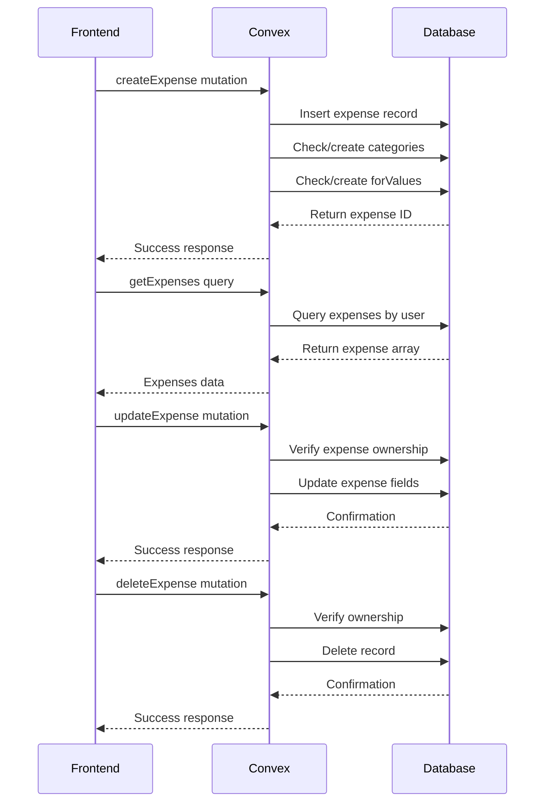
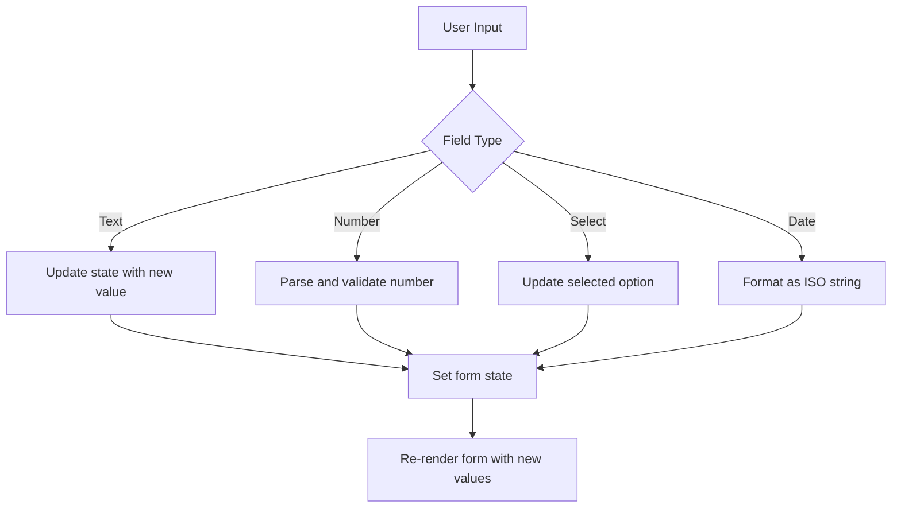
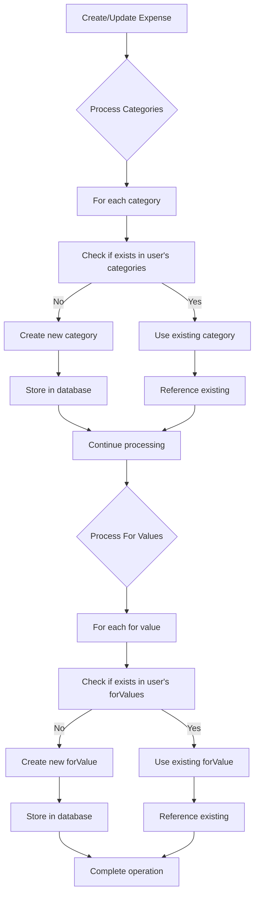
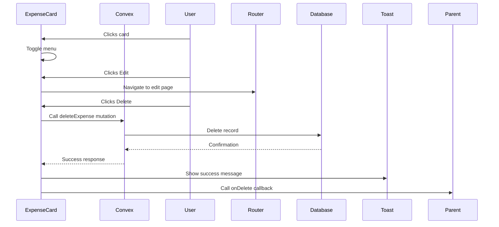
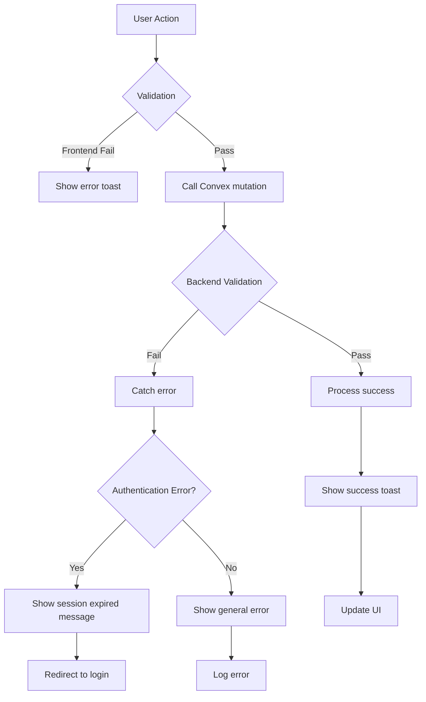
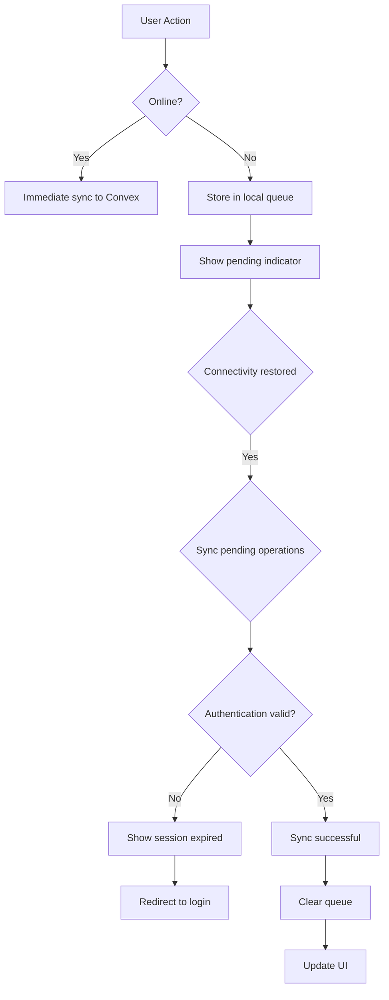

# Expense Management

<cite>
**Referenced Files in This Document**   
- [expenses.ts](file://convex/expenses.ts#L1-L325) - *Updated with enhanced error handling*
- [page.tsx](file://src/app/expenses/page.tsx#L1-L525) - *Updated with authentication error handling during sync and removed redundant loading states*
- [ExpenseCard.tsx](file://src/components/cards/ExpenseCard.tsx#L1-L138)
- [useExpenseActions.ts](file://src/features/dashboard/hooks/useExpenseActions.ts#L1-L17)
- [useOfflineQueue.ts](file://src/hooks/useOfflineQueue.ts#L1-L68) - *Added for offline queue management*
- [ProtectedRoute.tsx](file://src/components/ProtectedRoute.tsx#L1-L98) - *Centralized authentication handling*
</cite>

## Update Summary
**Changes Made**   
- Updated offline behavior and syncing section with detailed authentication error handling
- Enhanced validation rules and error handling section with authentication error detection
- Added new content about offline queue management using useOfflineQueue hook
- Updated success feedback section with retry functionality for failed sync operations
- Removed redundant loading states from ExpensesPage as authentication handling is now centralized in ProtectedRoute
- Added sources for new and updated files including ProtectedRoute.tsx

## Table of Contents
1. [Introduction](#introduction)
2. [Project Structure](#project-structure)
3. [Core CRUD Operations](#core-crud-operations)
4. [Form Handling and Data Binding](#form-handling-and-data-binding)
5. [Category and For Field Management](#category-and-for-field-management)
6. [Date Filtering and Time-Framed Data](#date-filtering-and-time-framed-data)
7. [Frontend-Backend Interaction with Convex](#frontend-backend-interaction-with-convex)
8. [Validation Rules and Error Handling](#validation-rules-and-error-handling)
9. [Success Feedback with Sonner Notifications](#success-feedback-with-sonner-notifications)
10. [Offline Behavior and Syncing](#offline-behavior-and-syncing)
11. [Future Extension Options](#future-extension-options)

## Introduction
The Expense Management system is a comprehensive solution for tracking personal expenses, enabling users to create, read, update, and delete expense records. Built using Next.js and Convex, the application provides a responsive interface for managing financial data with robust backend validation and real-time synchronization. This document details the implementation of CRUD operations, form handling, category management, date filtering, and interaction between frontend components and Convex mutations. Special attention is given to user experience elements such as validation, error handling, and success feedback through Sonner notifications.

## Project Structure
The project follows a feature-based organization with clear separation between frontend components, backend logic, and shared utilities. The core expense management functionality is distributed across several key directories:

- **convex/**: Contains backend logic including schema definitions and mutations
- **src/app/expenses/**: Houses the main expense management pages
- **src/components/cards/**: Includes reusable UI components like ExpenseCard
- **src/features/dashboard/**: Contains dashboard-specific components and hooks
- **src/hooks/**: Provides custom React hooks for state management

```mermaid
graph TB
subgraph "Frontend"
A[src/app/expenses/page.tsx] --> B[src/components/cards/ExpenseCard.tsx]
A --> C[src/app/expenses/edit/[id]/page.tsx]
D[src/features/dashboard/hooks/useExpenseActions.ts] --> E[src/features/dashboard/components/Expenses/ExpenseCard.tsx]
end
subgraph "Backend"
F[convex/expenses.ts] --> G[convex/schema.ts]
end
A --> F
B --> F
C --> F
E --> F
```

**Diagram sources**
- [expenses.ts](file://convex/expenses.ts#L1-L325)
- [page.tsx](file://src/app/expenses/page.tsx#L1-L525)
- [ExpenseCard.tsx](file://src/components/cards/ExpenseCard.tsx#L1-L138)
- [ExpenseCard.tsx](file://src/features/dashboard/components/Expenses/ExpenseCard.tsx#L1-L111)
- [useExpenseActions.ts](file://src/features/dashboard/hooks/useExpenseActions.ts#L1-L17)

**Section sources**
- [expenses.ts](file://convex/expenses.ts#L1-L325)
- [page.tsx](file://src/app/expenses/page.tsx#L1-L525)

## Core CRUD Operations
The expense management system implements full CRUD (Create, Read, Update, Delete) functionality through Convex mutations and queries. These operations are exposed via the `expenses.ts` file in the convex directory and consumed by frontend components.

### Create Operation
The `createExpense` mutation handles new expense creation with comprehensive validation:
- Requires authentication token, amount, title, category, date, and card ID
- Automatically creates user-specific categories and "for" values if they don't exist
- Stores expense with timestamp and user association

### Read Operations
Multiple query functions enable flexible expense retrieval:
- `getExpenses`: Retrieves all expenses with optional month/year filtering
- `getExpensesByDateRange`: Fetches expenses within a specific date range
- `getExpenseById`: Retrieves a single expense by ID with authorization check

### Update Operation
The `updateExpense` mutation allows modification of existing expenses:
- Validates user ownership before updating
- Updates all expense fields including amount, title, categories, and date
- Maintains referential integrity by updating associated categories and "for" values

### Delete Operation
The `deleteExpense` mutation handles expense removal:
- Verifies user authorization before deletion
- Returns success confirmation
- Triggers UI updates through parent component callbacks



**Diagram sources**
- [expenses.ts](file://convex/expenses.ts#L50-L325)

**Section sources**
- [expenses.ts](file://convex/expenses.ts#L50-L325)

## Form Handling and Data Binding
The expense creation form in `page.tsx` demonstrates sophisticated data binding patterns using React state management. The form maintains a structured state object that maps directly to the expense data model.

### Form State Structure
```typescript
interface ExpenseFormData {
  amount: string;
  title: string;
  category: string[];
  for: string[];
  date: string;
  cardId: string;
}
```

### Data Binding Implementation
Each form field is bound to the corresponding state property using `onChange` handlers that update the state immutably:



The form employs controlled components where the React state serves as the single source of truth. When the user submits the form, the state is validated and converted to the appropriate types (e.g., string amount to number) before being sent to the Convex mutation.

**Section sources**
- [page.tsx](file://src/app/expenses/page.tsx#L50-L525)

## Category and For Field Management
The system implements intelligent management of categories and "for" fields through specialized components and backend logic.

### SmartSelectInput Component
The `SmartSelectInput` component provides an enhanced user experience for category and "for" field management:
- Supports both selection from existing values and creation of new ones
- Provides real-time suggestions based on user input
- Handles formatting of new entries (capitalization)
- Integrates with Convex mutations for creating new categories

### Backend Category Management
The `createCategory` and `createForValue` mutations handle the creation of new values:
- Format names with proper capitalization
- Prevent creation of empty values
- Check for existing duplicates before insertion
- Return existing IDs if the value already exists

### Automatic Category Population
When a new expense is created or updated, the system automatically ensures all categories and "for" values are stored in the user's personal lists:



**Diagram sources**
- [expenses.ts](file://convex/expenses.ts#L250-L325)
- [page.tsx](file://src/app/expenses/page.tsx#L100-L200)

**Section sources**
- [expenses.ts](file://convex/expenses.ts#L250-L325)
- [page.tsx](file://src/app/expenses/page.tsx#L100-L200)

## Date Filtering and Time-Framed Data
The expense management system implements sophisticated date filtering through the `useTimeFramedData` custom hook and `DateFilterHeader` component.

### useTimeFramedData Hook
This custom hook manages date-based data retrieval with the following features:
- Maintains current date context (month and year)
- Provides navigation functions for moving between time periods
- Handles data fetching and caching
- Returns loading states for UX feedback

### DateFilterHeader Component
The header component provides a user-friendly interface for date navigation:
- Displays current month and year
- Includes buttons for navigating to previous and next months
- Triggers data refetching when the time period changes

### Backend Date Filtering
The `getExpenses` query supports optional month and year parameters, converting them to timestamp ranges for database filtering:

```typescript
// Convert month/year to date range
const startOfMonth = new Date(args.year, args.month - 1, 1).getTime();
const endOfMonth = new Date(args.year, args.month, 0).getTime();
```

This approach enables efficient server-side filtering while maintaining a responsive client-side experience.

**Section sources**
- [page.tsx](file://src/app/expenses/page.tsx#L80-L150)
- [expenses.ts](file://convex/expenses.ts#L100-L120)

## Frontend-Backend Interaction with Convex
The system demonstrates a clean separation of concerns between frontend components and backend logic through Convex's React integration.

### Mutation Usage Pattern
Frontend components use the `useMutation` hook to access Convex mutations:

```typescript
const createExpenseMutation = useMutation(api.expenses.createExpense);
```

This pattern provides:
- Type safety through generated API definitions
- Automatic loading states
- Error handling integration
- Optimistic updates support

### Query Usage Pattern
Data retrieval uses the `useQuery` hook:

```typescript
const categories = useQuery(api.expenses.getCategories, token ? { token } : "skip");
```

The conditional second parameter ("skip") prevents queries from running when authentication is not available.

### Component Examples
The `ExpenseCard` component illustrates the interaction pattern:



**Diagram sources**
- [page.tsx](file://src/app/expenses/page.tsx#L30-L525)
- [ExpenseCard.tsx](file://src/components/cards/ExpenseCard.tsx#L1-L138)

**Section sources**
- [page.tsx](file://src/app/expenses/page.tsx#L30-L525)
- [ExpenseCard.tsx](file://src/components/cards/ExpenseCard.tsx#L1-L138)

## Validation Rules and Error Handling
The system implements comprehensive validation at both frontend and backend levels to ensure data integrity.

### Frontend Validation
The expense form enforces several client-side validation rules:
- Required fields: amount, title, category, card ID
- Numeric validation for amount (must be positive number)
- Form submission disabled when validation fails
- Immediate feedback through error toasts

### Backend Validation
The Convex mutations provide server-side validation:
- Authentication verification for all operations
- Authorization checks to ensure users can only access their own data
- Data type validation through Convex value types
- Business logic validation (e.g., non-empty category names)

### Error Handling Strategy
The system uses a layered error handling approach with specific authentication error detection:



The system now specifically checks for authentication errors during both form submission and offline sync operations, providing appropriate user feedback and handling session expiration:

```typescript
// Authentication error detection pattern
if (error && typeof error === 'object' && 'message' in error) {
  const errorMessage = (error as any).message || '';
  if (errorMessage.includes('Authentication required') || errorMessage.includes('authentication')) {
    toast.error("Your session has expired. Please log in again.");
    router.push('/login');
    return;
  }
}
```

**Section sources**
- [page.tsx](file://src/app/expenses/page.tsx#L200-L250)
- [expenses.ts](file://convex/expenses.ts#L1-L50)

## Success Feedback with Sonner Notifications
The application uses Sonner notifications to provide immediate feedback on user actions, enhancing the user experience.

### Notification Implementation
The `toast` utility from Sonner is imported and used throughout the application:

```typescript
import { toast } from "sonner";
```

### Success Scenarios
Notifications are triggered for various successful operations:
- **Expense creation**: "Expense added successfully!"
- **Expense deletion**: "Expense deleted successfully!"
- **Category creation**: "Category created successfully!"

### Error Scenarios
Notifications also inform users of failures:
- **Authentication issues**: "Authentication failed."
- **Validation errors**: "Please fill in all required fields"
- **General failures**: "Failed to add expense"

### Retry Functionality
The system now includes retry functionality for failed offline sync operations:
- Users can retry individual failed sync operations
- Retry attempts show appropriate feedback messages
- Failed operations can be retried multiple times

```typescript
const handleRetrySync = async (itemId: string) => {
  const itemToRetry = offlineExpenses.find(item => item.id === itemId);
  if (!itemToRetry) return;

  toast.info(`Retrying to sync expense: ${itemToRetry.data.title}`);
  try {
    await createExpenseMutation({ token: token!, ...itemToRetry.data });
    removeFromQueue(itemToRetry.id);
    toast.success("Expense synced successfully!");
    refetch();
  } catch (error) {
    console.error("Failed to sync expense:", error);
    updateItemStatus(itemToRetry.id, 'failed');
    toast.error("Sync failed again. Please check your connection or the data.");
  }
};
```

### Notification Patterns
The system follows consistent patterns for notifications:
- Success messages use `toast.success()`
- Error messages use `toast.error()`
- Messages are concise and user-friendly
- Notifications are displayed temporarily and then dismissed

This feedback system ensures users are always aware of the outcome of their actions, even when operations occur asynchronously.

**Section sources**
- [page.tsx](file://src/app/expenses/page.tsx#L20-L525)
- [ExpenseCard.tsx](file://src/components/cards/ExpenseCard.tsx#L1-L138)

## Offline Behavior and Syncing
The system now implements robust offline capabilities with proper authentication error handling.

### Offline Queue Management
The system uses the `useOfflineQueue` hook to manage offline operations:

```typescript
export type OfflineItem<T> = {
  id: string;
  data: T;
  status: 'pending' | 'failed';
  createdAt: number;
};

export function useOfflineQueue<T>(queueName: string) {
  // Implementation details...
}
```

This hook provides:
- Local storage of pending operations in localStorage
- Status tracking for each offline item
- Methods to add, remove, and update items in the queue

### Current Offline Behavior
When offline:
- New expenses are stored in a local queue
- Users receive confirmation that expenses will sync when online
- Failed sync operations are marked and can be retried

### Authentication Error Handling
The system now specifically handles authentication errors during sync operations:



When a sync operation fails due to authentication:
- The system detects authentication-related error messages
- Users are notified that their session has expired
- The application redirects to the login page
- Failed operations remain in the queue for retry after re-authentication

### Sync Process
The sync process is triggered automatically when connectivity is restored:

```typescript
useEffect(() => {
  if (isOnline && offlineExpenses.length > 0 && !isSyncing) {
    const syncOfflineExpenses = async () => {
      setIsSyncing(true);
      const itemsToSync = offlineExpenses.filter(item => item.status === 'pending');
      
      // Sync each item and handle authentication errors
      const syncPromises = itemsToSync.map(async (item) => {
        try {
          await createExpenseMutation({ token: token!, ...item.data });
          removeFromQueue(item.id);
        } catch (error) {
          // Handle authentication errors specifically
          if (error && typeof error === 'object' && 'message' in error) {
            const errorMessage = (error as any).message || '';
            if (errorMessage.includes('Authentication required') || errorMessage.includes('authentication')) {
              toast.error("Your session has expired during sync. Please log in again.");
              router.push('/login');
              return;
            }
          }
          updateItemStatus(item.id, 'failed');
        }
      });
      
      await Promise.all(syncPromises);
    };
    syncOfflineExpenses();
  }
}, [isOnline, offlineExpenses, isSyncing, token, createExpenseMutation, removeFromQueue, updateItemStatus, refetch]);
```

**Section sources**
- [page.tsx](file://src/app/expenses/page.tsx#L300-L400)
- [useOfflineQueue.ts](file://src/hooks/useOfflineQueue.ts#L1-L68)
- [expenses.ts](file://convex/expenses.ts)
- [ProtectedRoute.tsx](file://src/components/ProtectedRoute.tsx#L1-L98)

## Future Extension Options
The system architecture supports several potential extensions to enhance functionality.

### Tag Support
Adding tags to expenses could be implemented by:
- Extending the expense schema to include a tags array
- Creating a tags management system similar to categories
- Adding a tag input component to the expense form
- Implementing tag-based filtering and reporting

### Recurrence
Recurring expenses could be supported by:
- Adding recurrence rules to the expense model (frequency, end date)
- Creating a background job to generate recurring expenses
- Implementing a recurrence pattern selector in the UI
- Providing options for one-time overrides of recurring expenses

### Attachments
File attachments could be added by:
- Integrating Convex's file storage capabilities
- Adding an attachment upload component
- Storing file references in the expense record
- Implementing attachment preview and download functionality

### Enhanced Analytics
Additional features could include:
- Custom date range selection
- Export to CSV/Excel
- Budget vs. actual comparisons
- Predictive spending analysis
- Integration with financial institutions

These extensions would build upon the existing architecture while maintaining the clean separation between frontend and backend logic.

**Section sources**
- [expenses.ts](file://convex/expenses.ts#L1-L325)
- [schema.ts](file://convex/schema.ts)