# Feature-Specific Documentation

<cite>
**Referenced Files in This Document**   
- [auth.ts](file://convex/auth.ts#L1-L260)
- [schema.ts](file://convex/schema.ts#L1-L61)
- [expenses.ts](file://convex/expenses.ts#L1-L324)
- [userSettings.ts](file://convex/userSettings.ts#L1-L59)
- [AuthContext.tsx](file://src/contexts/AuthContext.tsx#L1-L96)
- [OfflineContext.tsx](file://src/contexts/OfflineContext.tsx#L1-L171)
- [SettingsContext.tsx](file://src/contexts/SettingsContext.tsx#L1-L67) - *Updated with error handling*
- [page.tsx](file://src/app/page.tsx#L1-L30)
- [login/page.tsx](file://src/app/login/page.tsx#L1-L171) - *Updated with offline-first authentication and password recovery*
- [register/page.tsx](file://src/app/register/page.tsx#L1-L146)
- [expenses/page.tsx](file://src/app/expenses/page.tsx#L1-L525) - *Updated with offline queue and authentication error handling*
- [expenses/edit/[id]/page.tsx](file://src/app/expenses/edit/[id]/page.tsx#L1-L394) - *Updated with CurrencyInput component*
- [dashboard/page.tsx](file://src/app/dashboard/page.tsx#L1-L126) - *Updated with bottom sheet integration*
- [settings/page.tsx](file://src/app/settings/page.tsx#L1-L218) - *Updated with redirect loop fix and temporary RecoveryCodeCard disable*
- [income/page.tsx](file://src/app/income/page.tsx#L1-L320) - *Updated with undo functionality*
- [ExpenseCard.tsx](file://src/components/cards/ExpenseCard.tsx#L1-L180) - *Updated with deletion undo support*
- [IncomeCard.tsx](file://src/components/cards/IncomeCard.tsx#L1-L165) - *Updated with deletion undo support*
- [BottomSheet.tsx](file://src/components/BottomSheet.tsx#L1-L95) - *Added in recent commit*
- [CategoryList.tsx](file://src/features/dashboard/components/CategoryList/CategoryList.tsx#L1-L132) - *Updated with bottom sheet integration*
- [useOfflineQueue.ts](file://src/hooks/useOfflineQueue.ts#L1-L88) - *Added in recent commit*
- [useOnlineStatus.ts](file://src/hooks/useOnlineStatus.ts#L1-L42) - *Added in recent commit*
- [CurrencyInput.tsx](file://src/components/CurrencyInput.tsx#L1-L75) - *Added in recent commit*
- [sw.js](file://public/sw.js) - *Updated with enhanced caching strategy*
- [useAuthErrorHandler.ts](file://src/hooks/useAuthErrorHandler.ts#L1-L39) - *Added for centralized authentication error handling*
- [EnhancedNetworkStatusIndicator.tsx](file://src/components/EnhancedNetworkStatusIndicator.tsx#L1-L255) - *Added for improved network status visualization*
- [ProtectedRoute.tsx](file://src/components/ProtectedRoute.tsx#L1-L98) - *Updated with single loading state*
- [OfflineFirstProvider.tsx](file://src/providers/OfflineFirstProvider.tsx#L1-L326) - *Updated with initialization improvements*
- [forgot-password/page.tsx](file://src/app/forgot-password/page.tsx#L1-L113) - *Added recovery code password reset system*
- [reset-password/page.tsx](file://src/app/reset-password/page.tsx#L1-L227) - *Added recovery code password reset system*
- [RecoveryCodeCard.tsx](file://src/components/RecoveryCodeCard.tsx#L1-L155) - *Added recovery code management component, temporarily disabled due to redirect issues*
</cite>

## Update Summary
**Changes Made**   
- Updated Settings Customization section to reflect changes in SettingsContext error handling
- Modified Recovery Code Management section to indicate temporary disablement of RecoveryCodeCard due to redirect loop issues
- Added explanation of SafeRecoveryCodeCard wrapper implementation in settings page
- Updated source tracking to reflect current file states and modifications
- Added notes about temporary limitations in recovery code functionality

## Table of Contents
1. [Authentication](#authentication)
2. [Expense Management](#expense-management)
3. [Income Tracking](#income-tracking)
4. [Dashboard Analytics](#dashboard-analytics)
5. [Settings Customization](#settings-customization)
6. [Offline Functionality](#offline-functionality)
7. [PWA Features](#pwa-features)

## Authentication

The authentication system implements a custom username/password solution using Convex as the backend. It provides user registration, login, session persistence, password recovery, and logout functionality with enhanced offline support.

### User Registration
The registration process creates a new user account with a hashed password and unique token identifier.

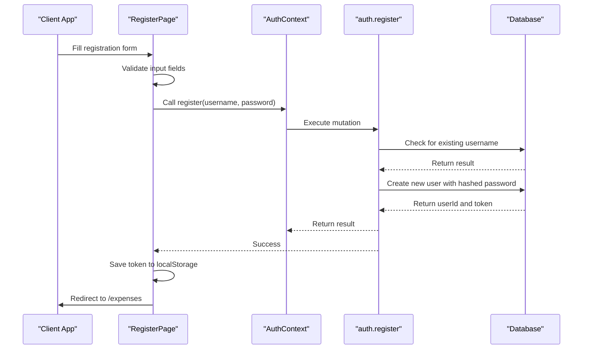
```mermaid
sequenceDiagram
participant Client as "Client App"
participant RegisterPage as "RegisterPage"
participant AuthContext as "AuthContext"
participant AuthMutation as "auth.register"
participant DB as "Database"
Client->>RegisterPage : Fill registration form
RegisterPage->>RegisterPage : Validate input fields
RegisterPage->>AuthContext : Call register(username, password)
AuthContext->>AuthMutation : Execute mutation
AuthMutation->>DB : Check for existing username
DB-->>AuthMutation : Return result
AuthMutation->>DB : Create new user with hashed password
DB-->>AuthMutation : Return userId and token
AuthMutation-->>AuthContext : Return result
AuthMutation-->>RegisterPage : Success
RegisterPage->>RegisterPage : Save token to localStorage
RegisterPage->>Client : Redirect to /expenses
```

**Section sources**
- [register/page.tsx](file://src/app/register/page.tsx#L1-L146)
- [auth.ts](file://convex/auth.ts#L1-L260)

### User Login
The login process authenticates users by verifying their credentials against stored data and establishing a session, with support for offline access using cached credentials.

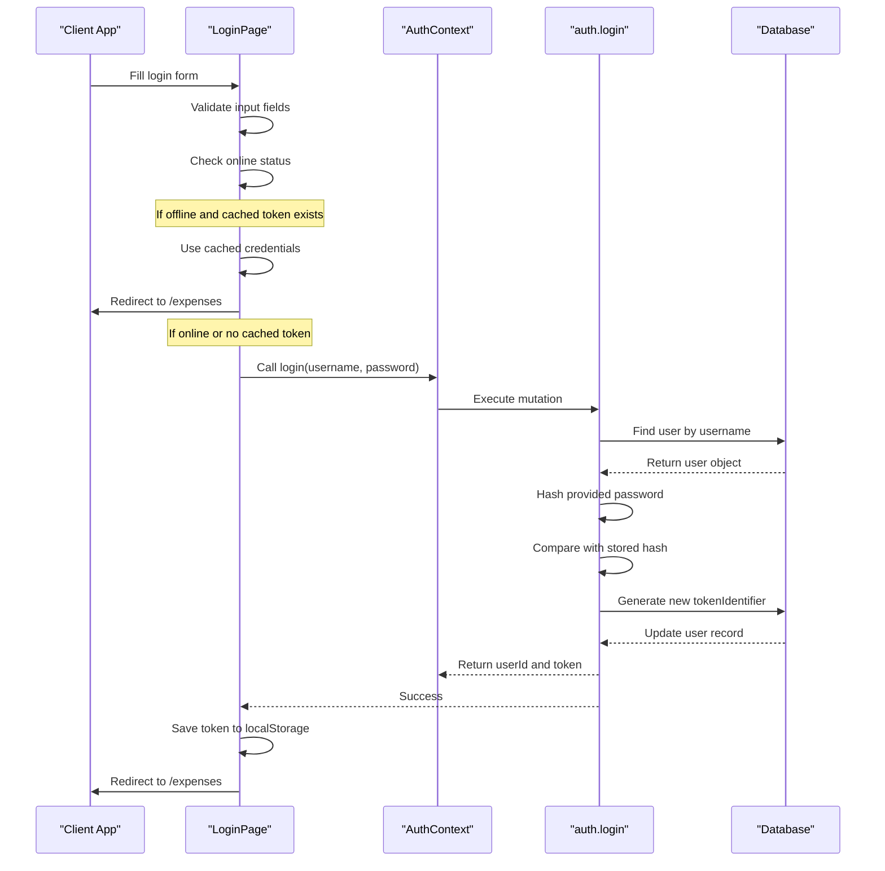
```mermaid
sequenceDiagram
participant Client as "Client App"
participant LoginPage as "LoginPage"
participant AuthContext as "AuthContext"
participant AuthMutation as "auth.login"
participant DB as "Database"
Client->>LoginPage : Fill login form
LoginPage->>LoginPage : Validate input fields
LoginPage->>LoginPage : Check online status
Note over LoginPage : If offline and cached token exists
LoginPage->>LoginPage : Use cached credentials
LoginPage->>Client : Redirect to /expenses
Note over LoginPage : If online or no cached token
LoginPage->>AuthContext : Call login(username, password)
AuthContext->>AuthMutation : Execute mutation
AuthMutation->>DB : Find user by username
DB-->>AuthMutation : Return user object
AuthMutation->>AuthMutation : Hash provided password
AuthMutation->>AuthMutation : Compare with stored hash
AuthMutation->>DB : Generate new tokenIdentifier
DB-->>AuthMutation : Update user record
AuthMutation-->>AuthContext : Return userId and token
AuthMutation-->>LoginPage : Success
LoginPage->>LoginPage : Save token to localStorage
LoginPage->>Client : Redirect to /expenses
```

**Section sources**
- [login/page.tsx](file://src/app/login/page.tsx#L1-L171) - *Updated with offline-first authentication and password recovery link*

### Password Recovery System
The application now includes a secure recovery code-based password reset system that allows users to regain access to their accounts when they forget their passwords.

#### Recovery Code Generation
Users can generate a recovery code from the settings page, which is securely stored and can be used to reset their password.

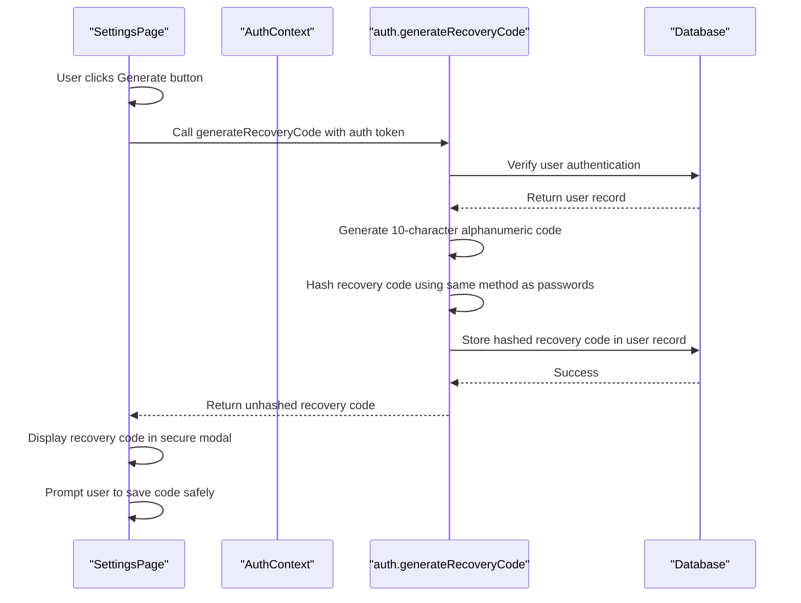
```mermaid
sequenceDiagram
participant Client as "SettingsPage"
participant Context as "AuthContext"
participant Mutation as "auth.generateRecoveryCode"
participant DB as "Database"
Client->>Client : User clicks Generate button
Client->>Mutation : Call generateRecoveryCode with auth token
Mutation->>DB : Verify user authentication
DB-->>Mutation : Return user record
Mutation->>Mutation : Generate 10-character alphanumeric code
Mutation->>Mutation : Hash recovery code using same method as passwords
Mutation->>DB : Store hashed recovery code in user record
DB-->>Mutation : Success
Mutation-->>Client : Return unhashed recovery code
Client->>Client : Display recovery code in secure modal
Client->>Client : Prompt user to save code safely
```

**Section sources**
- [settings/page.tsx](file://src/app/settings/page.tsx#L1-L218) - *Contains recovery code UI (temporarily disabled)*
- [RecoveryCodeCard.tsx](file://src/components/RecoveryCodeCard.tsx#L1-L155) - *Recovery code component (currently not rendered)*
- [auth.ts](file://convex/auth.ts#L1-L260) - *Contains generateRecoveryCode mutation*

#### Forgot Password Flow
When users forget their password, they can use their recovery code to initiate the password reset process.

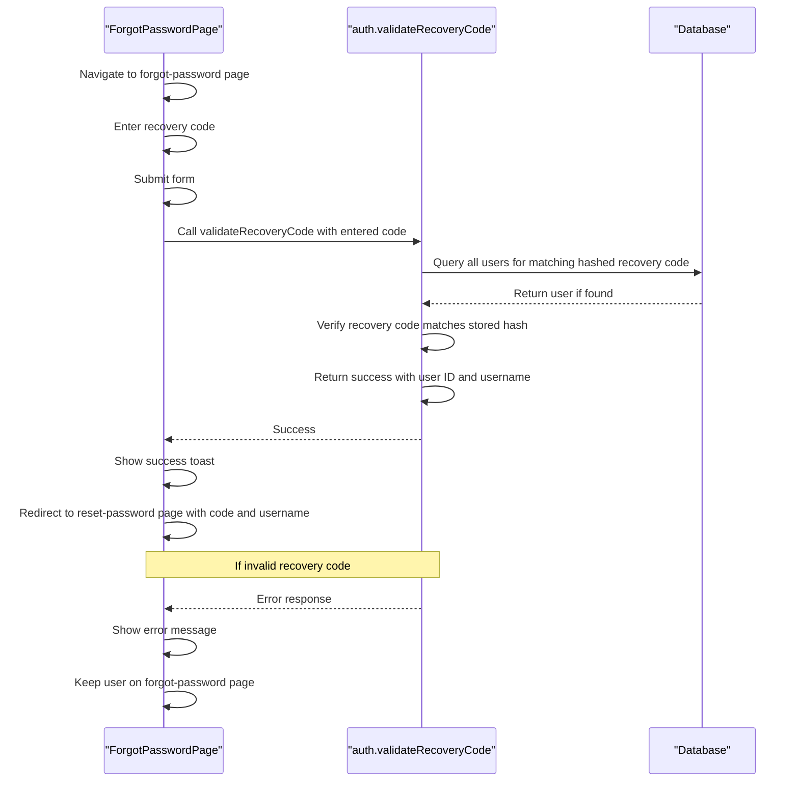
```mermaid
sequenceDiagram
participant Client as "ForgotPasswordPage"
participant Mutation as "auth.validateRecoveryCode"
participant DB as "Database"
Client->>Client : Navigate to forgot-password page
Client->>Client : Enter recovery code
Client->>Client : Submit form
Client->>Mutation : Call validateRecoveryCode with entered code
Mutation->>DB : Query all users for matching hashed recovery code
DB-->>Mutation : Return user if found
Mutation->>Mutation : Verify recovery code matches stored hash
Mutation->>Mutation : Return success with user ID and username
Mutation-->>Client : Success
Client->>Client : Show success toast
Client->>Client : Redirect to reset-password page with code and username
Note over Client,Mutation : If invalid recovery code
Mutation-->>Client : Error response
Client->>Client : Show error message
Client->>Client : Keep user on forgot-password page
```

**Section sources**
- [forgot-password/page.tsx](file://src/app/forgot-password/page.tsx#L1-L113) - *Forgot password page implementation*
- [auth.ts](file://convex/auth.ts#L1-L260) - *Contains validateRecoveryCode mutation*

#### Reset Password Flow
After validating their recovery code, users can set a new password for their account.

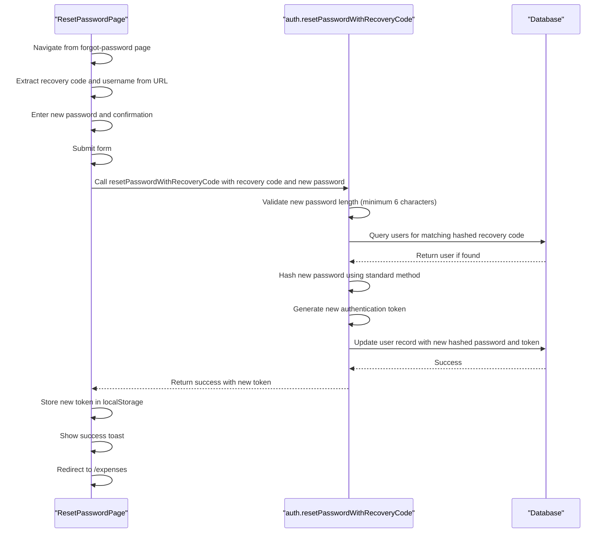
```mermaid
sequenceDiagram
participant Client as "ResetPasswordPage"
participant Mutation as "auth.resetPasswordWithRecoveryCode"
participant DB as "Database"
Client->>Client : Navigate from forgot-password page
Client->>Client : Extract recovery code and username from URL
Client->>Client : Enter new password and confirmation
Client->>Client : Submit form
Client->>Mutation : Call resetPasswordWithRecoveryCode with recovery code and new password
Mutation->>Mutation : Validate new password length (minimum 6 characters)
Mutation->>DB : Query users for matching hashed recovery code
DB-->>Mutation : Return user if found
Mutation->>Mutation : Hash new password using standard method
Mutation->>Mutation : Generate new authentication token
Mutation->>DB : Update user record with new hashed password and token
DB-->>Mutation : Success
Mutation-->>Client : Return success with new token
Client->>Client : Store new token in localStorage
Client->>Client : Show success toast
Client->>Client : Redirect to /expenses
```

**Section sources**
- [reset-password/page.tsx](file://src/app/reset-password/page.tsx#L1-L227) - *Reset password page implementation*
- [auth.ts](file://convex/auth.ts#L1-L260) - *Contains resetPasswordWithRecoveryCode mutation*

### Session Persistence
The application maintains user sessions using localStorage to store authentication tokens, enabling persistent login across browser sessions.

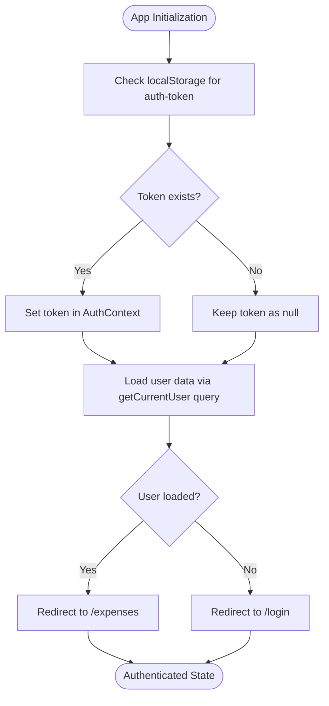
```mermaid
flowchart TD
Start([App Initialization]) --> CheckStorage["Check localStorage for auth-token"]
CheckStorage --> HasToken{"Token exists?"}
HasToken --> |Yes| SetToken["Set token in AuthContext"]
HasToken --> |No| NoToken["Keep token as null"]
SetToken --> LoadUser["Load user data via getCurrentUser query"]
NoToken --> LoadUser
LoadUser --> UserLoaded{"User loaded?"}
UserLoaded --> |Yes| RedirectHome["Redirect to /expenses"]
UserLoaded --> |No| RedirectLogin["Redirect to /login"]
RedirectHome --> End([Authenticated State])
RedirectLogin --> End
```

**Section sources**
- [AuthContext.tsx](file://src/contexts/AuthContext.tsx#L1-L96)

### Authentication Error Handling
A centralized authentication error handling system detects expired sessions and automatically logs out users, preventing data corruption during sync operations.

```mermaid
flowchart TD
Start([Error Occurs]) --> ErrorHandler["useAuthErrorHandler hook"]
ErrorHandler --> CheckError{"Error is authentication-related?"}
CheckError --> |Yes| HandleAuth["Handle authentication error"]
CheckError --> |No| Propagate["Propagate error normally"]
subgraph HandleAuth
HandleAuth --> ShowToast["Show session expired toast"]
ShowToast --> Logout["Call logout function"]
Logout --> Redirect["Redirect to /login"]
end
```

**Section sources**
- [useAuthErrorHandler.ts](file://src/hooks/useAuthErrorHandler.ts#L1-L39) - *New centralized error handler*
- [expenses/page.tsx](file://src/app/expenses/page.tsx#L1-L525) - *Implements error handling in expense operations*

## Expense Management

The expense management system allows users to create, edit, and delete expenses with support for multiple categories, attribution fields, and date tracking.

### Expense Creation
Users can add new expenses through a form interface that validates input and communicates with the backend via Convex mutations.

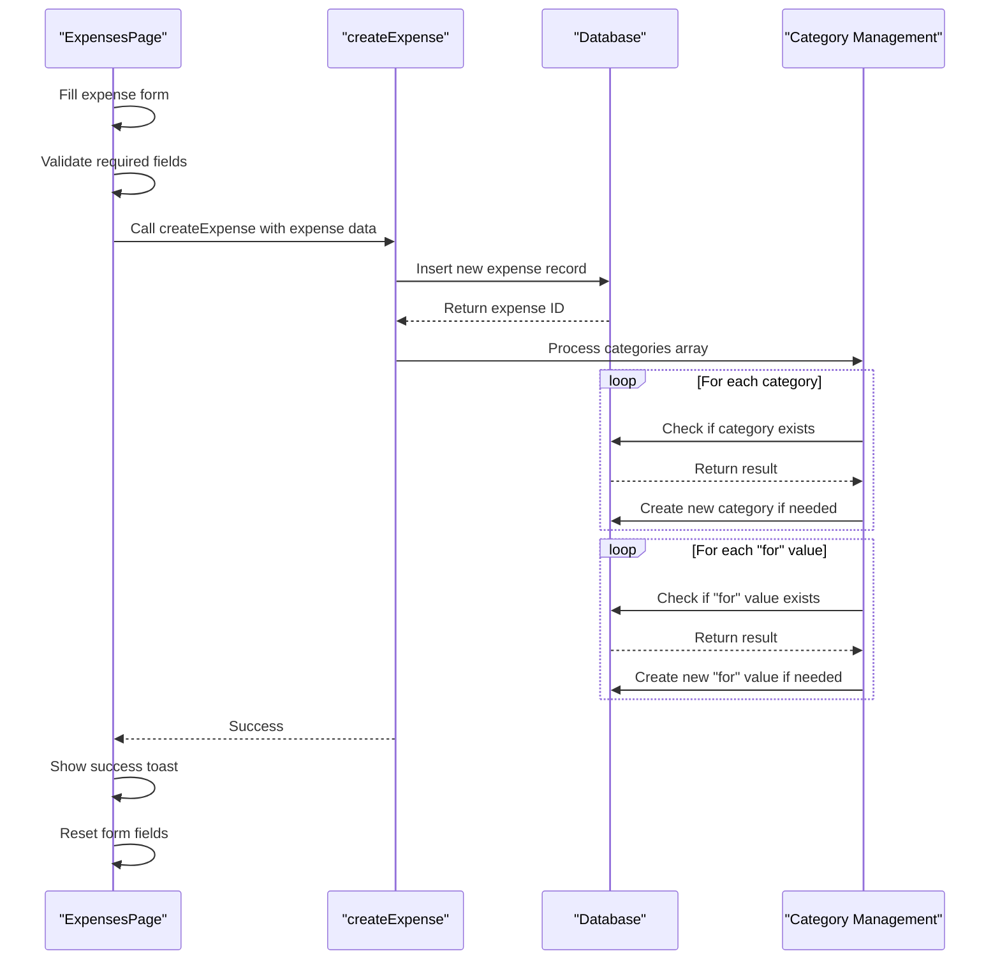
```mermaid
sequenceDiagram
participant Client as "ExpensesPage"
participant Mutation as "createExpense"
participant DB as "Database"
participant Categories as "Category Management"
Client->>Client : Fill expense form
Client->>Client : Validate required fields
Client->>Mutation : Call createExpense with expense data
Mutation->>DB : Insert new expense record
DB-->>Mutation : Return expense ID
Mutation->>Categories : Process categories array
loop For each category
Categories->>DB : Check if category exists
DB-->>Categories : Return result
Categories->>DB : Create new category if needed
end
loop For each "for" value
Categories->>DB : Check if "for" value exists
DB-->>Categories : Return result
Categories->>DB : Create new "for" value if needed
end
Mutation-->>Client : Success
Client->>Client : Show success toast
Client->>Client : Reset form fields
```

**Section sources**
- [expenses/page.tsx](file://src/app/expenses/page.tsx#L1-L525)
- [expenses.ts](file://convex/expenses.ts#L1-L324)

### Expense Editing
The application supports editing existing expenses through a dedicated edit page that pre-fills form data and updates records upon submission.

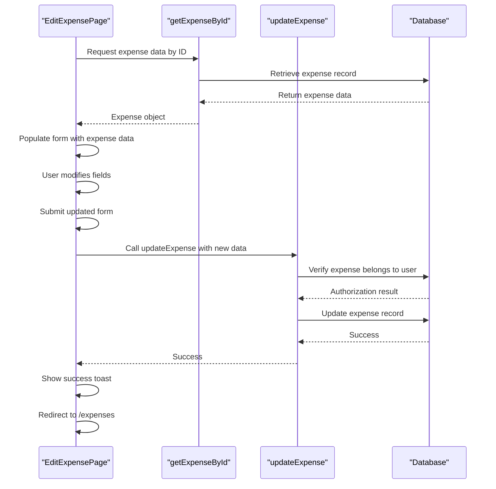
```mermaid
sequenceDiagram
participant Client as "EditExpensePage"
participant Query as "getExpenseById"
participant Mutation as "updateExpense"
participant DB as "Database"
Client->>Query : Request expense data by ID
Query->>DB : Retrieve expense record
DB-->>Query : Return expense data
Query-->>Client : Expense object
Client->>Client : Populate form with expense data
Client->>Client : User modifies fields
Client->>Client : Submit updated form
Client->>Mutation : Call updateExpense with new data
Mutation->>DB : Verify expense belongs to user
DB-->>Mutation : Authorization result
Mutation->>DB : Update expense record
DB-->>Mutation : Success
Mutation-->>Client : Success
Client->>Client : Show success toast
Client->>Client : Redirect to /expenses
```

**Section sources**
- [expenses/edit/[id]/page.tsx](file://src/app/expenses/edit/[id]/page.tsx#L1-L394)

### Category and For Fields
The system implements tag-based category and "for" fields with auto-suggestions and creation capabilities.

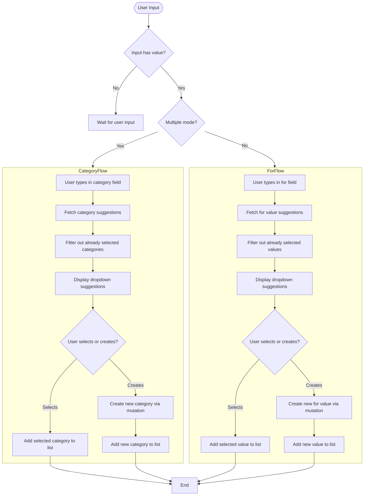
```mermaid
flowchart TD
Start([User Input]) --> HasInput{"Input has value?"}
HasInput --> |No| WaitInput["Wait for user input"]
HasInput --> |Yes| CheckMode{"Multiple mode?"}
CheckMode --> |Yes| CategoryFlow["Category Field Flow"]
CheckMode --> |No| ForFlow["For Field Flow"]
subgraph CategoryFlow
CategoryInput["User types in category field"]
CategoryInput --> FetchSuggestions["Fetch category suggestions"]
FetchSuggestions --> FilterExisting["Filter out already selected categories"]
FilterExisting --> DisplaySuggestions["Display dropdown suggestions"]
DisplaySuggestions --> UserAction{"User selects or creates?"}
UserAction --> |Selects| SelectCategory["Add selected category to list"]
UserAction --> |Creates| CreateCategory["Create new category via mutation"]
CreateCategory --> AddCategory["Add new category to list"]
end
subgraph ForFlow
ForInput["User types in for field"]
ForInput --> FetchForSuggestions["Fetch for value suggestions"]
FetchForSuggestions --> FilterForExisting["Filter out already selected values"]
FilterForExisting --> DisplayForSuggestions["Display dropdown suggestions"]
DisplayForSuggestions --> ForAction{"User selects or creates?"}
ForAction --> |Selects| SelectFor["Add selected value to list"]
ForAction --> |Creates| CreateFor["Create new for value via mutation"]
CreateFor --> AddFor["Add new value to list"]
end
SelectCategory --> End
AddCategory --> End
SelectFor --> End
AddFor --> End
```

**Section sources**
- [expenses/page.tsx](file://src/app/expenses/page.tsx#L1-L525)
- [SmartSelectInput.tsx](file://src/components/SmartSelectInput.tsx)
- [expenses.ts](file://convex/expenses.ts#L1-L324)

### Expense Deletion with Undo
Users can delete expenses with an undo option that temporarily preserves the expense and allows recovery.

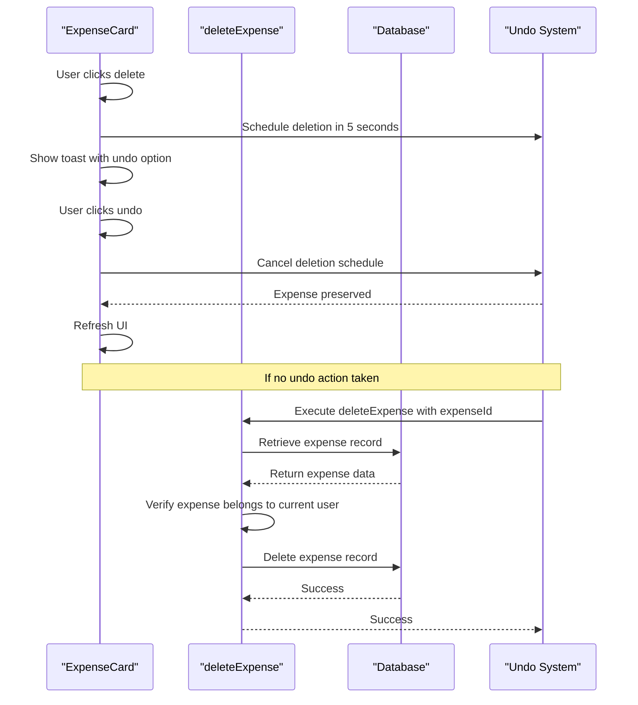
```mermaid
sequenceDiagram
participant Client as "ExpenseCard"
participant Mutation as "deleteExpense"
participant DB as "Database"
participant Undo as "Undo System"
Client->>Client : User clicks delete
Client->>Undo : Schedule deletion in 5 seconds
Client->>Client : Show toast with undo option
Client->>Client : User clicks undo
Client->>Undo : Cancel deletion schedule
Undo-->>Client : Expense preserved
Client->>Client : Refresh UI
Note over Client,Undo : If no undo action taken
Undo->>Mutation : Execute deleteExpense with expenseId
Mutation->>DB : Retrieve expense record
DB-->>Mutation : Return expense data
Mutation->>Mutation : Verify expense belongs to current user
Mutation->>DB : Delete expense record
DB-->>Mutation : Success
Mutation-->>Undo : Success
```

**Section sources**
- [expenses/page.tsx](file://src/app/expenses/page.tsx#L1-L525) - *Updated with undo functionality*
- [ExpenseCard.tsx](file://src/components/cards/ExpenseCard.tsx#L1-L180) - *Added undo support*

### Authentication Error Handling During Sync
When syncing offline expenses, the system detects authentication errors and handles them gracefully by redirecting to the login page.

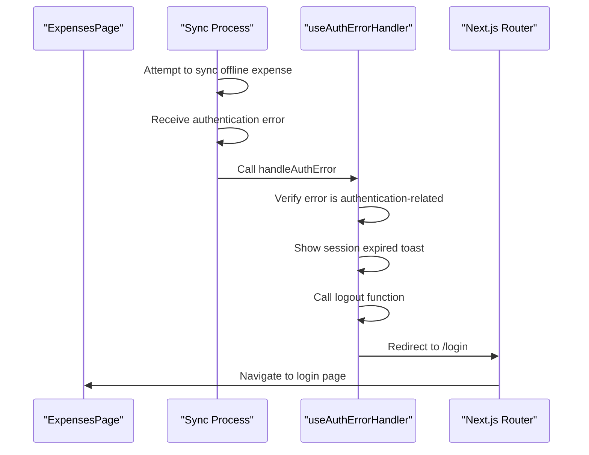
```mermaid
sequenceDiagram
participant Client as "ExpensesPage"
participant Sync as "Sync Process"
participant AuthHandler as "useAuthErrorHandler"
participant Router as "Next.js Router"
Sync->>Sync : Attempt to sync offline expense
Sync->>Sync : Receive authentication error
Sync->>AuthHandler : Call handleAuthError
AuthHandler->>AuthHandler : Verify error is authentication-related
AuthHandler->>AuthHandler : Show session expired toast
AuthHandler->>AuthHandler : Call logout function
AuthHandler->>Router : Redirect to /login
Router->>Client : Navigate to login page
```

**Section sources**
- [expenses/page.tsx](file://src/app/expenses/page.tsx#L1-L525) - *Implements sync error handling*
- [useAuthErrorHandler.ts](file://src/hooks/useAuthErrorHandler.ts#L1-L39) - *Centralized error handling logic*

## Income Tracking

The income tracking feature allows users to record income transactions associated with specific cards, providing a complete financial picture.

### Income Data Model
The system uses a dedicated income table in the database schema with specific fields for tracking income sources.

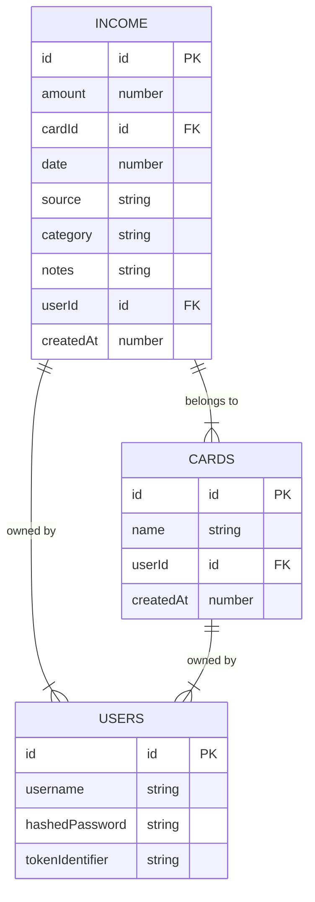
```mermaid
erDiagram
INCOME {
id id PK
amount number
cardId id FK
date number
source string
category string
notes string
userId id FK
createdAt number
}
CARDS {
id id PK
name string
userId id FK
createdAt number
}
USERS {
id id PK
username string
hashedPassword string
tokenIdentifier string
}
INCOME ||--|{ CARDS : "belongs to"
INCOME ||--|{ USERS : "owned by"
CARDS ||--|{ USERS : "owned by"
```

**Section sources**
- [schema.ts](file://convex/schema.ts#L1-L61)
- [cardsAndIncome.ts](file://convex/cardsAndIncome.ts)

### Income Deletion with Undo
Similar to expenses, income deletion now includes an undo capability with temporary preservation.

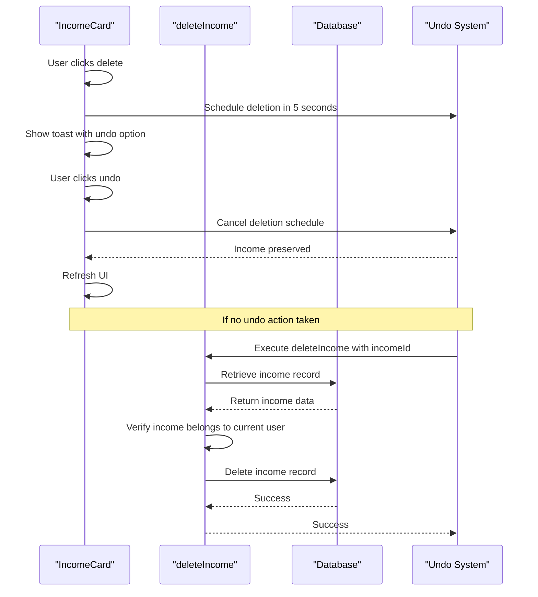
```mermaid
sequenceDiagram
participant Client as "IncomeCard"
participant Mutation as "deleteIncome"
participant DB as "Database"
participant Undo as "Undo System"
Client->>Client : User clicks delete
Client->>Undo : Schedule deletion in 5 seconds
Client->>Client : Show toast with undo option
Client->>Client : User clicks undo
Client->>Undo : Cancel deletion schedule
Undo-->>Client : Income preserved
Client->>Client : Refresh UI
Note over Client,Undo : If no undo action taken
Undo->>Mutation : Execute deleteIncome with incomeId
Mutation->>DB : Retrieve income record
DB-->>Mutation : Return income data
Mutation->>Mutation : Verify income belongs to current user
Mutation->>DB : Delete income record
DB-->>Mutation : Success
Mutation-->>Undo : Success
```

**Section sources**
- [income/page.tsx](file://src/app/income/page.tsx#L1-L320) - *Updated with undo functionality*
- [IncomeCard.tsx](file://src/components/cards/IncomeCard.tsx#L1-L165) - *Added undo support*

## Dashboard Analytics

The dashboard provides comprehensive analytics through visualizations and summary cards, helping users understand their spending patterns.

### Data Processing Pipeline
The dashboard processes raw expense data into meaningful analytics through a structured pipeline.

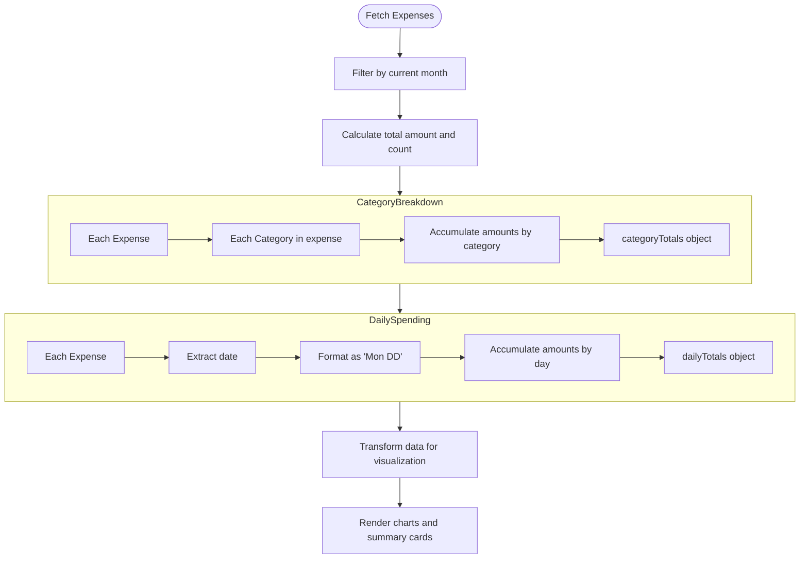
```mermaid
flowchart TD
Start([Fetch Expenses]) --> FilterDate["Filter by current month"]
FilterDate --> CalculateTotals["Calculate total amount and count"]
CalculateTotals --> CategoryBreakdown["Process category totals"]
CategoryBreakdown --> DailySpending["Process daily spending totals"]
DailySpending --> TransformData["Transform data for visualization"]
TransformData --> RenderCharts["Render charts and summary cards"]
subgraph CategoryBreakdown
Expense["Each Expense"]
Expense --> Categories["Each Category in expense"]
Categories --> Accumulate["Accumulate amounts by category"]
Accumulate --> CategoryTotals["categoryTotals object"]
end
subgraph DailySpending
Expense2["Each Expense"]
Expense2 --> ExtractDate["Extract date"]
ExtractDate --> FormatKey["Format as 'Mon DD'"]
FormatKey --> AccumulateDaily["Accumulate amounts by day"]
AccumulateDaily --> DailyTotals["dailyTotals object"]
end
```

**Section sources**
- [useDashboardData.ts](file://src/features/dashboard/hooks/useDashboardData.ts#L1-L86)
- [dashboard/page.tsx](file://src/app/dashboard/page.tsx#L1-L126)

### Category Details Bottom Sheet
A new bottom sheet component displays detailed category information when users interact with category items.

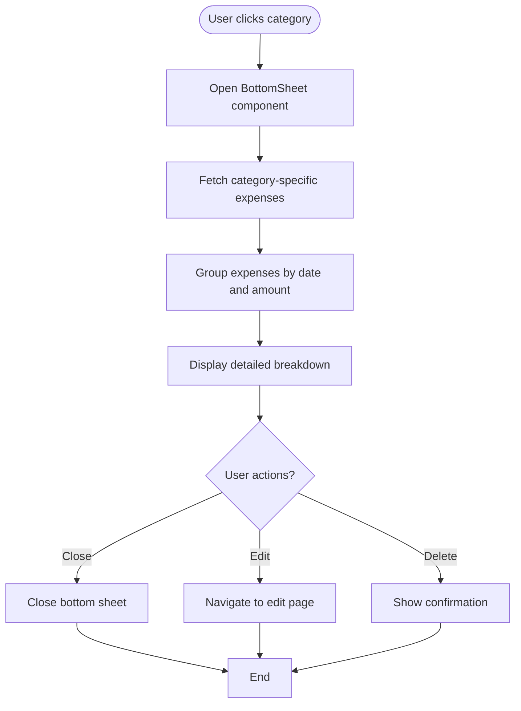
```mermaid
flowchart TD
Start([User clicks category]) --> OpenSheet["Open BottomSheet component"]
OpenSheet --> FetchData["Fetch category-specific expenses"]
FetchData --> ProcessData["Group expenses by date and amount"]
ProcessData --> DisplayDetails["Display detailed breakdown"]
DisplayDetails --> UserInteraction{"User actions?"}
UserInteraction --> |Close| CloseSheet["Close bottom sheet"]
UserInteraction --> |Edit| NavigateEdit["Navigate to edit page"]
UserInteraction --> |Delete| ConfirmDelete["Show confirmation"]
CloseSheet --> End
NavigateEdit --> End
ConfirmDelete --> End
```

**Diagram sources**
- [dashboard/page.tsx](file://src/app/dashboard/page.tsx#L1-L126) - *Integrated bottom sheet*
- [CategoryList.tsx](file://src/features/dashboard/components/CategoryList/CategoryList.tsx#L1-L132) - *Added bottom sheet trigger*
- [BottomSheet.tsx](file://src/components/BottomSheet.tsx#L1-L95) - *New component*

**Section sources**
- [dashboard/page.tsx](file://src/app/dashboard/page.tsx#L1-L126)
- [CategoryList.tsx](file://src/features/dashboard/components/CategoryList/CategoryList.tsx#L1-L132)

## Settings Customization

The settings system allows users to customize application preferences including currency, calendar, and security settings.

### Currency and Calendar Preferences
Users can select their preferred currency and calendar system, which are stored in the userSettings table.

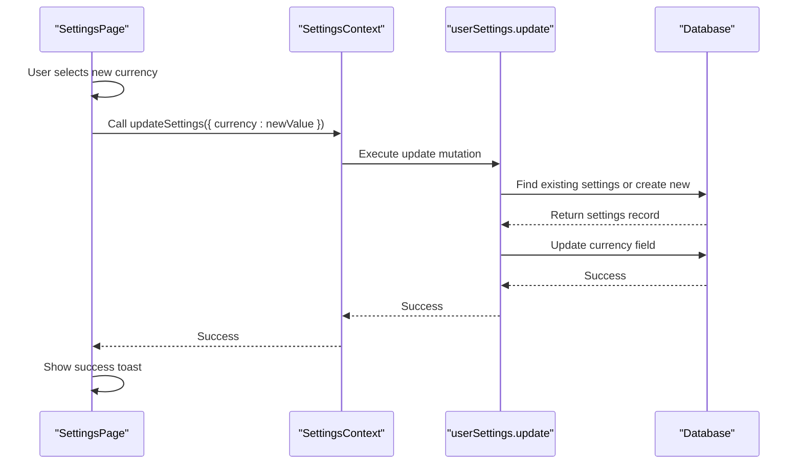
```mermaid
sequenceDiagram
participant Client as "SettingsPage"
participant Context as "SettingsContext"
participant Mutation as "userSettings.update"
participant DB as "Database"
Client->>Client : User selects new currency
Client->>Context : Call updateSettings({ currency : newValue })
Context->>Mutation : Execute update mutation
Mutation->>DB : Find existing settings or create new
DB-->>Mutation : Return settings record
Mutation->>DB : Update currency field
DB-->>Mutation : Success
Mutation-->>Context : Success
Context-->>Client : Success
Client->>Client : Show success toast
```

**Section sources**
- [settings/page.tsx](file://src/app/settings/page.tsx#L1-L218)
- [SettingsContext.tsx](file://src/contexts/SettingsContext.tsx#L1-L67) - *Includes error handling for settings queries*

### Recovery Code Management
The settings page includes a security section where users can manage their recovery codes for password reset purposes. Due to recent redirect loop issues, this functionality has been temporarily disabled while investigations continue.

#### Current Implementation Status
The RecoveryCodeCard component has been wrapped in a SafeRecoveryCodeCard wrapper that currently returns null to prevent redirect loops. This temporary measure was implemented after identifying issues with the authentication flow causing infinite redirects.

```tsx
const SafeRecoveryCodeCard = () => {
  // Temporarily return null to debug redirect issue
  return null;
  
  try {
    return <RecoveryCodeCard />;
  } catch (error) {
    console.warn('RecoveryCodeCard error:', error);
    return (
      <div className="mb-6 p-4 bg-yellow-50 border border-yellow-200 rounded-lg">
        <p className="text-sm text-yellow-800">
          Recovery code feature temporarily unavailable. Please try refreshing the page.
        </p>
      </div>
    );
  }
};
```

**Updated** The recovery code management feature is currently disabled due to redirect loop issues identified in commit `986c9de5f89db5c10ecd63e7adf51c4f77a2f3f4`. The component remains in the codebase but is not rendered in the UI.

**Section sources**
- [settings/page.tsx](file://src/app/settings/page.tsx#L1-L218) - *Contains SafeRecoveryCodeCard implementation*
- [RecoveryCodeCard.tsx](file://src/components/RecoveryCodeCard.tsx#L1-L155) - *Component exists but not rendered*
- [SettingsContext.tsx](file://src/contexts/SettingsContext.tsx#L1-L67) - *Added error handling for settings queries*

## Offline Functionality

The application provides robust offline support through IndexedDB storage and automatic synchronization when connectivity is restored.

### Offline Data Flow with Queue System
The system implements an enhanced offline data management strategy using local storage and sync mechanisms with a pending queue.

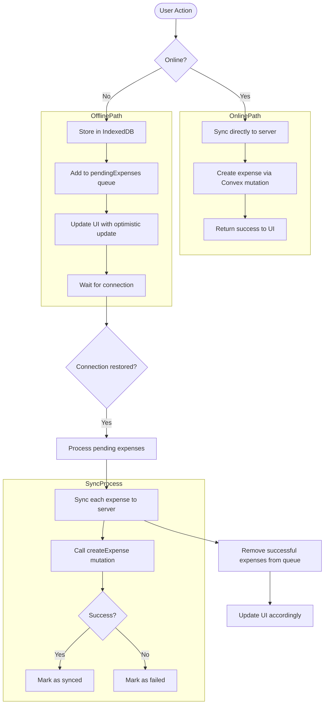
```mermaid
flowchart TD
Start([User Action]) --> IsOnline{"Online?"}
IsOnline --> |Yes| DirectSync["Sync directly to server"]
IsOnline --> |No| LocalStorage["Store in IndexedDB"]
subgraph OnlinePath
DirectSync --> Server["Create expense via Convex mutation"]
Server --> Success["Return success to UI"]
end
subgraph OfflinePath
LocalStorage --> Queue["Add to pendingExpenses queue"]
Queue --> UI["Update UI with optimistic update"]
UI --> WaitOnline["Wait for connection"]
end
WaitOnline --> ConnectionRestored{"Connection restored?"}
ConnectionRestored --> |Yes| ProcessQueue["Process pending expenses"]
ProcessQueue --> SyncEach["Sync each expense to server"]
SyncEach --> RemoveFromQueue["Remove successful expenses from queue"]
RemoveFromQueue --> UpdateUI["Update UI accordingly"]
subgraph SyncProcess
SyncEach --> CallMutation["Call createExpense mutation"]
CallMutation --> ServerResponse{"Success?"}
ServerResponse --> |Yes| SuccessPath["Mark as synced"]
ServerResponse --> |No| FailedPath["Mark as failed"]
end
```

**Diagram sources**
- [useOfflineQueue.ts](file://src/hooks/useOfflineQueue.ts#L1-L88) - *New offline queue implementation*
- [useOnlineStatus.ts](file://src/hooks/useOnlineStatus.ts#L1-L42) - *Online status tracking*
- [expenses/page.tsx](file://src/app/expenses/page.tsx#L1-L525) - *Integrated offline queue*

**Section sources**
- [OfflineContext.tsx](file://src/contexts/OfflineContext.tsx#L1-L171)
- [useOfflineQueue.ts](file://src/hooks/useOfflineQueue.ts#L1-L88)
- [useOnlineStatus.ts](file://src/hooks/useOnlineStatus.ts#L1-L42)

### Manual Sync Mechanism
Users can manually trigger synchronization of pending offline expenses through the settings interface.

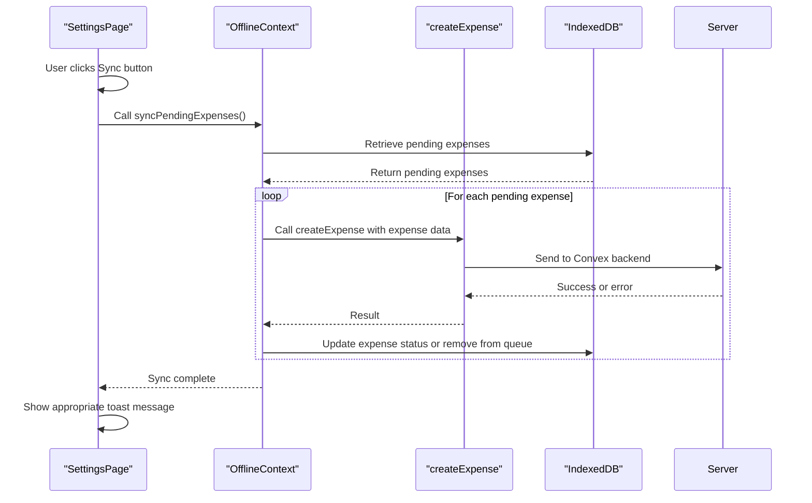
```mermaid
sequenceDiagram
participant Client as "SettingsPage"
participant Context as "OfflineContext"
participant Mutation as "createExpense"
participant DB as "IndexedDB"
Client->>Client : User clicks Sync button
Client->>Context : Call syncPendingExpenses()
Context->>DB : Retrieve pending expenses
DB-->>Context : Return pending expenses
loop For each pending expense
Context->>Mutation : Call createExpense with expense data
Mutation->>Server : Send to Convex backend
Server-->>Mutation : Success or error
Mutation-->>Context : Result
Context->>DB : Update expense status or remove from queue
end
Context-->>Client : Sync complete
Client->>Client : Show appropriate toast message
```

**Section sources**
- [settings/page.tsx](file://src/app/settings/page.tsx#L1-L218)

### Enhanced Network Status Indicator
The application now features an enhanced network status indicator that provides detailed information about connection status and sync operations.

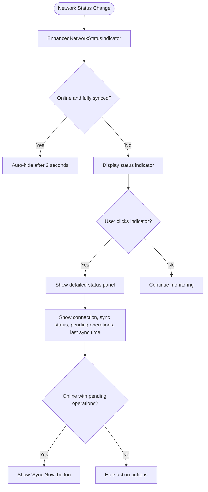
```mermaid
flowchart TD
Start([Network Status Change]) --> Indicator["EnhancedNetworkStatusIndicator"]
Indicator --> CheckStatus{"Online and fully synced?"}
CheckStatus --> |Yes| AutoHide["Auto-hide after 3 seconds"]
CheckStatus --> |No| ShowIndicator["Display status indicator"]
ShowIndicator --> UserInteraction{"User clicks indicator?"}
UserInteraction --> |Yes| ShowDetails["Show detailed status panel"]
UserInteraction --> |No| MonitorStatus["Continue monitoring"]
ShowDetails --> DisplayInfo["Show connection, sync status, pending operations, last sync time"]
DisplayInfo --> ShowActions{"Online with pending operations?"}
ShowActions --> |Yes| ShowSyncButton["Show 'Sync Now' button"]
ShowActions --> |No| HideActions["Hide action buttons"]
```

**Section sources**
- [EnhancedNetworkStatusIndicator.tsx](file://src/components/EnhancedNetworkStatusIndicator.tsx#L1-L255) - *New enhanced indicator component*
- [OfflineFirstProvider.tsx](file://src/providers/OfflineFirstProvider.tsx) - *Provides sync status context*

### Protected Route Initialization
The ProtectedRoute component now uses a unified initialization process that coordinates authentication and offline capability loading, eliminating redundant loading states.

```mermaid
flowchart TD
Start([Component Mount]) --> CheckLoading{"Loading or not initialized?"}
CheckLoading --> |Yes| ShowLoading["Display single loading screen"]
CheckLoading --> |No| CheckAccess{"Has access?"}
ShowLoading --> WaitInit["Wait for auth and offline initialization"]
WaitInit --> CheckAccess
CheckAccess --> |Yes| RenderContent["Render children"]
CheckAccess --> |No| RedirectLogin["Redirect to /login"]
```

**Section sources**
- [ProtectedRoute.tsx](file://src/components/ProtectedRoute.tsx#L1-L98) - *Consolidated loading states*
- [OfflineFirstProvider.tsx](file://src/providers/OfflineFirstProvider.tsx#L1-L326) - *Initialization coordination*

## PWA Features

The application is implemented as a Progressive Web App with installability and service worker functionality, enhanced with improved caching strategies.

### Installability
The PWA can be installed on various platforms through standard browser mechanisms.

```mermaid
flowchart TD
Start([User visits site]) --> PWAReady{"PWA ready?"}
PWAReady --> |Yes| ShowInstall["Show install prompt"]
subgraph MobileInstallation
ShowInstall --> Safari["iOS Safari: Share -> Add to Home Screen"]
ShowInstall --> Chrome["Android Chrome: Address bar install icon"]
end
subgraph DesktopInstallation
ShowInstall --> ChromeDesktop["Chrome/Edge: Address bar install icon"]
ShowInstall --> Manual["Manual: Create shortcut"]
end
Safari --> InstallComplete["App installed to home screen"]
Chrome --> InstallComplete
ChromeDesktop --> InstallComplete
Manual --> InstallComplete
InstallComplete --> NativeLike["App launches in native-like window"]
NativeLike --> OfflineAccess["Full offline functionality available"]
```

**Section sources**
- [manifest.json](file://public/manifest.json)
- [sw.js](file://public/sw.js)

### Service Worker Behavior
The service worker provides offline caching and background synchronization capabilities with an enhanced caching strategy for critical application routes.

```mermaid
stateDiagram-v2
[*] --> Idle
Idle --> FetchEvent : "Network request"
FetchEvent --> IsCached{"Resource cached?"}
IsCached --> |Yes| ReturnCached : "Serve from cache"
IsCached --> |No| NetworkRequest : "Fetch from network"
NetworkRequest --> NetworkSuccess{"Success?"}
NetworkSuccess --> |Yes| CacheAndReturn : "Cache response & return"
NetworkSuccess --> |No| ReturnCachedFail : "Return cached or error"
Idle --> SyncEvent : "Background sync"
SyncEvent --> HasPending{"Pending expenses?"}
HasPending --> |Yes| ProcessQueue : "Sync pending expenses"
ProcessQueue --> UpdateServer : "Send to Convex backend"
UpdateServer --> Success{"All synced?"}
Success --> |Yes| ClearQueue : "Clear local queue"
Success --> |No| KeepQueue : "Keep failed items"
SyncEvent --> Idle
```

**Section sources**
- [sw.js](file://public/sw.js) - *Enhanced caching strategy*
- [ServiceWorkerRegistration.tsx](file://src/components/ServiceWorkerRegistration.tsx) - *Handles registration*

### Offline Authentication Flow
The service worker and login page work together to enable offline authentication using cached credentials.

```mermaid
flowchart TD
Start([User visits login page]) --> CheckOnline{"Online?"}
CheckOnline --> |Yes| NormalLogin["Proceed with normal login"]
CheckOnline --> |No| CheckCache["Check for cached auth-token"]
CheckCache --> HasToken{"Token exists?"}
HasToken --> |Yes| UseCached["Use cached credentials"]
HasToken --> |No| ShowError["Show connection error"]
UseCached --> Redirect["Redirect to /expenses"]
NormalLogin --> Authenticate["Authenticate with server"]
Authenticate --> Success{"Success?"}
Success --> |Yes| StoreToken["Store token in localStorage"]
Success --> |No| ShowAuthError["Show authentication error"]
StoreToken --> Redirect
ShowError --> WaitOnline["Wait for connection"]
WaitOnline --> ConnectionRestored{"Connection restored?"}
ConnectionRestored --> |Yes| RetryLogin["Retry login process"]
RetryLogin --> NormalLogin
```

**Diagram sources**
- [login/page.tsx](file://src/app/login/page.tsx#L1-L171) - *Handles offline authentication*
- [sw.js](file://public/sw.js) - *Caches critical routes*

**Section sources**
- [login/page.tsx](file://src/app/login/page.tsx#L1-L171)
- [sw.js](file://public/sw.js)