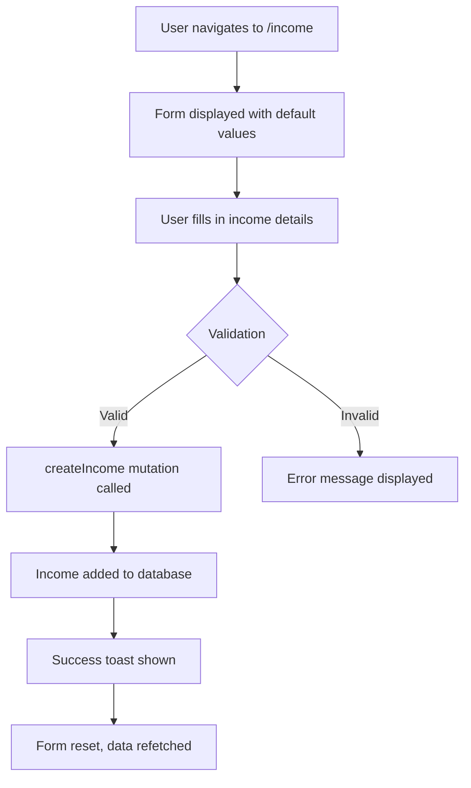
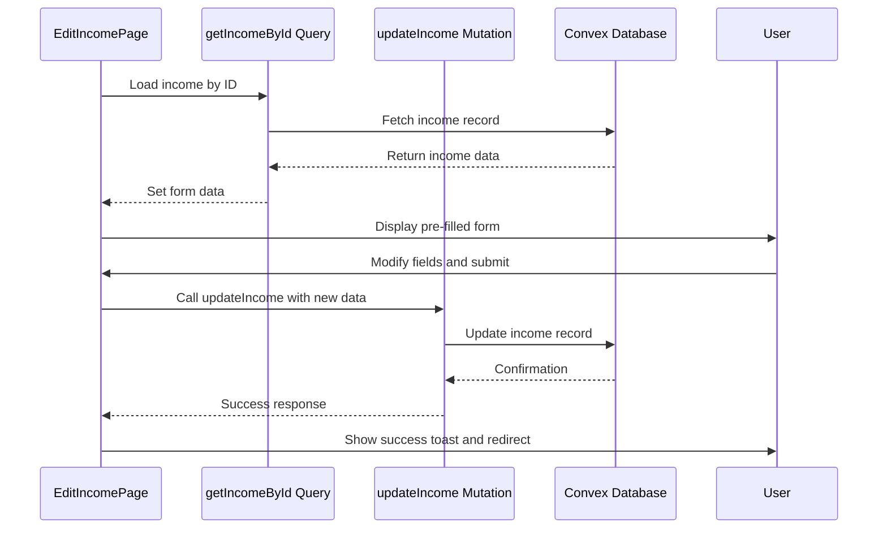
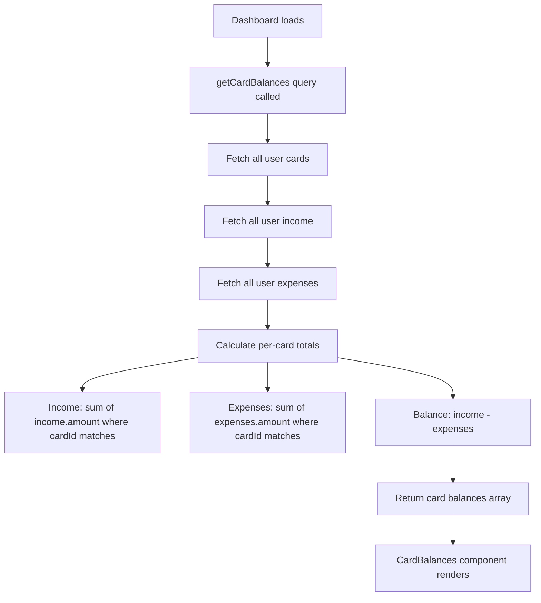
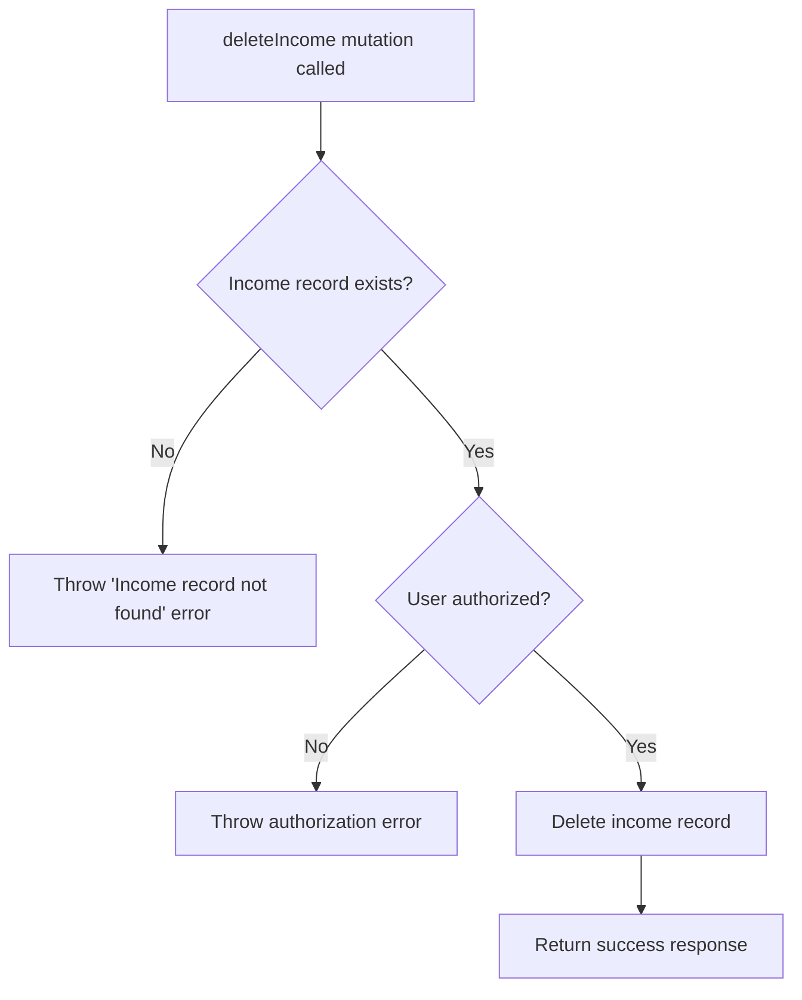

# Income Tracking

<cite>
**Referenced Files in This Document**   
- [cardsAndIncome.ts](file://convex/cardsAndIncome.ts#L1-L285)
- [page.tsx](file://src/app/income/page.tsx#L1-L307)
- [edit/[id]/page.tsx](file://src/app/income/edit/[id]/page.tsx#L1-L241)
- [CardBalances.tsx](file://src/features/dashboard/components/CardBalances/CardBalances.tsx#L1-L102)
- [IncomeCard.tsx](file://src/components/cards/IncomeCard.tsx#L1-L106)
</cite>

## Table of Contents
1. [Income Tracking](#income-tracking)
2. [Core Components](#core-components)
3. [Data Structure and Convex Mutations](#data-structure-and-convex-mutations)
4. [UI Flow for Income Management](#ui-flow-for-income-management)
5. [Integration with Dashboard for Balance Calculations](#integration-with-dashboard-for-balance-calculations)
6. [Data Consistency and Deletion Logic](#data-consistency-and-deletion-logic)
7. [Potential Enhancements](#potential-enhancements)

## Core Components

The income tracking system is built around several key components that manage the creation, viewing, editing, and deletion of income entries. These components are implemented using Convex mutations and queries, React hooks, and reusable UI components.

The main entry points for income management are:
- **Income Page**: Allows users to add new income entries and view existing ones.
- **Edit Income Page**: Enables modification of existing income records.
- **Income Card Component**: Displays individual income entries with edit/delete options.
- **Card Balances Component**: Integrates income data into the dashboard for financial summaries.

These components work together to provide a seamless experience for managing personal income.

**Section sources**
- [page.tsx](file://src/app/income/page.tsx#L1-L307)
- [edit/[id]/page.tsx](file://src/app/income/edit/[id]/page.tsx#L1-L241)
- [IncomeCard.tsx](file://src/components/cards/IncomeCard.tsx#L1-L106)

## Data Structure and Convex Mutations

The income data structure is defined in the Convex backend and includes the following fields:

```json
{
  "amount": "number",
  "cardId": "Id<'cards'>",
  "date": "number (timestamp)",
  "source": "string",
  "category": "string",
  "notes": "string (optional)",
  "userId": "Id<'users'>",
  "createdAt": "number (timestamp)"
}
```

The system implements several Convex mutations and queries for income management:

```mermaid
classDiagram
class createIncome {
+token : string
+amount : number
+cardId : Id<"cards">
+date : number
+source : string
+category : string
+notes : string (optional)
+handler() : Promise~Id<"income">~
}
class getIncome {
+token : string
+handler() : Promise~Doc<"income">[]~
}
class getIncomeById {
+token : string
+incomeId : Id<"income">
+handler() : Promise~Doc<"income">~
}
class updateIncome {
+token : string
+incomeId : Id<"income">
+amount : number
+source : string
+category : string
+date : number
+cardId : Id<"cards">
+notes : string (optional)
+handler() : Promise~{success : boolean}~
}
class deleteIncome {
+token : string
+incomeId : Id<"income">
+handler() : Promise~{success : boolean}~
}
class getCardBalances {
+token : string
+handler() : Promise~{cardId : Id<"cards">, cardName : string, totalIncome : number, totalExpenses : number, balance : number}[]~
}
```

**Diagram sources**
- [cardsAndIncome.ts](file://convex/cardsAndIncome.ts#L1-L285)

**Section sources**
- [cardsAndIncome.ts](file://convex/cardsAndIncome.ts#L1-L285)

## UI Flow for Income Management

The user interface for income management follows a consistent pattern across the application, with dedicated pages for adding and editing income entries.

### Add Income Flow

The income addition process begins on the main income page (`/income`), which contains a form with the following fields:

- **Amount**: Numeric input with validation for positive values
- **Source**: Text input for income source (e.g., "Salary", "Freelance")
- **Category**: Smart select input with suggestions from existing categories
- **Card Selection**: Dropdown to select the associated card
- **Date**: Custom date picker component
- **Notes**: Optional textarea for additional information



**Diagram sources**
- [page.tsx](file://src/app/income/page.tsx#L1-L307)

### Edit Income Flow

The income editing process occurs on the dynamic route `/income/edit/[id]`, which loads the existing income data and allows modification:



**Diagram sources**
- [edit/[id]/page.tsx](file://src/app/income/edit/[id]/page.tsx#L1-L241)

**Section sources**
- [page.tsx](file://src/app/income/page.tsx#L1-L307)
- [edit/[id]/page.tsx](file://src/app/income/edit/[id]/page.tsx#L1-L241)

## Integration with Dashboard for Balance Calculations

The income data is integrated into the dashboard through the `getCardBalances` query, which calculates financial summaries for each card by combining income and expense data.



The `CardBalances` component visualizes this data in the dashboard, displaying each card's name, total income, total expenses, and current balance. The balance is color-coded (green for positive, red for negative) to provide immediate visual feedback on financial health.

**Diagram sources**
- [cardsAndIncome.ts](file://convex/cardsAndIncome.ts#L239-L284)
- [CardBalances.tsx](file://src/features/dashboard/components/CardBalances/CardBalances.tsx#L1-L102)

**Section sources**
- [cardsAndIncome.ts](file://convex/cardsAndIncome.ts#L239-L284)
- [CardBalances.tsx](file://src/features/dashboard/components/CardBalances/CardBalances.tsx#L1-L102)

## Data Consistency and Deletion Logic

The system ensures data consistency when managing income entries, particularly during deletion operations. The `deleteIncome` mutation includes authorization checks to prevent unauthorized access:



The implementation in `cardsAndIncome.ts` shows that the system verifies both the existence of the income record and that the requesting user owns the record before deletion is permitted. This prevents both accidental deletion of non-existent records and unauthorized access to other users' data.

Unlike the card deletion logic (which checks for linked income and expenses), the income deletion does not have additional dependency checks, indicating that income records can be deleted independently without affecting other system components.

**Diagram sources**
- [cardsAndIncome.ts](file://convex/cardsAndIncome.ts#L215-L237)

**Section sources**
- [cardsAndIncome.ts](file://convex/cardsAndIncome.ts#L215-L237)
- [IncomeCard.tsx](file://src/components/cards/IncomeCard.tsx#L1-L106)

## Potential Enhancements

Based on the current implementation, several potential enhancements could improve the income tracking functionality:

### Recurring Income Modeling

The current system only supports one-time income entries. Implementing recurring income would require:
- Adding frequency field (e.g., weekly, bi-weekly, monthly)
- Creating a background job to generate recurring income entries
- Adding recurrence rules and end dates
- Providing a calendar view for recurring income

### Tax Categorization

Enhancing the system with tax-related features could include:
- Adding tax category field (e.g., "Taxable", "Non-taxable")
- Implementing tax rate associations
- Generating tax reports by category
- Adding year-end tax summary reports

### Additional Features

Other potential improvements:
- **Income forecasting**: Predict future income based on historical data
- **Income vs. Budget comparison**: Compare actual income against budgeted amounts
- **Multiple currency support**: Handle income in different currencies
- **Income attachments**: Allow users to attach documents (e.g., pay stubs)
- **Income verification**: Add status field (e.g., "Pending", "Verified")

These enhancements would build upon the existing robust foundation of the income tracking system, making it more comprehensive for personal financial management.

**Section sources**
- [cardsAndIncome.ts](file://convex/cardsAndIncome.ts#L1-L285)
- [page.tsx](file://src/app/income/page.tsx#L1-L307)
- [edit/[id]/page.tsx](file://src/app/income/edit/[id]/page.tsx#L1-L241)