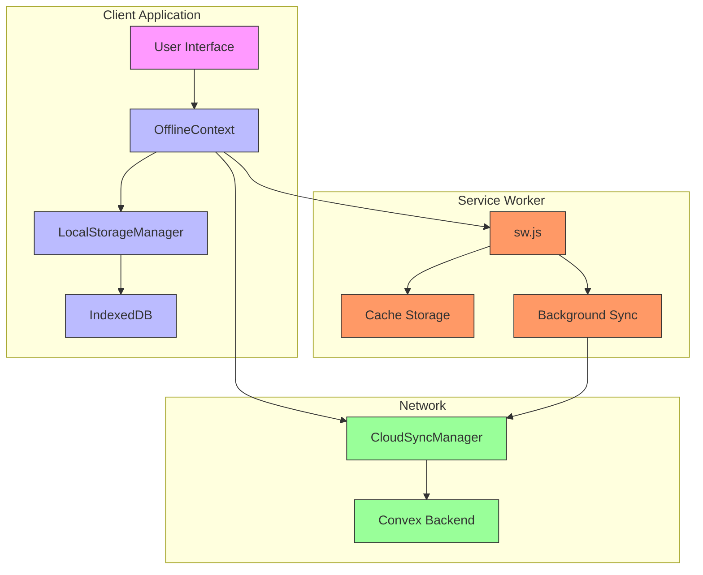
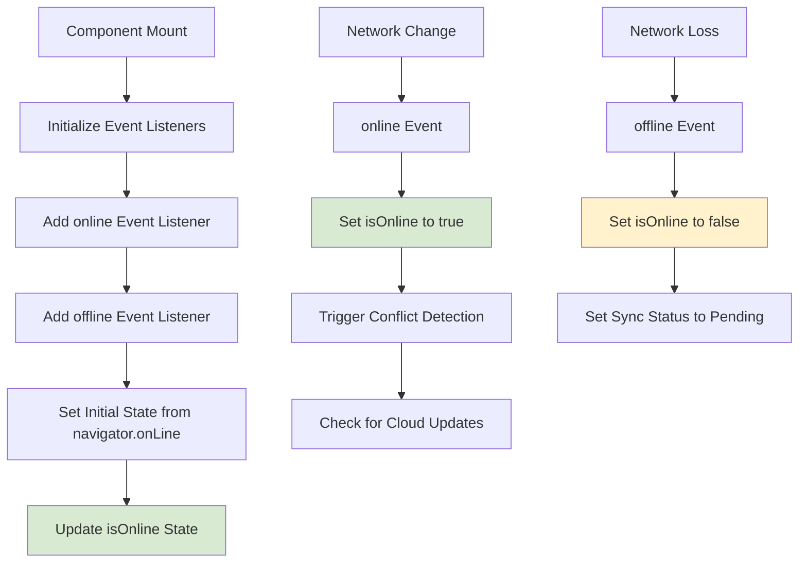
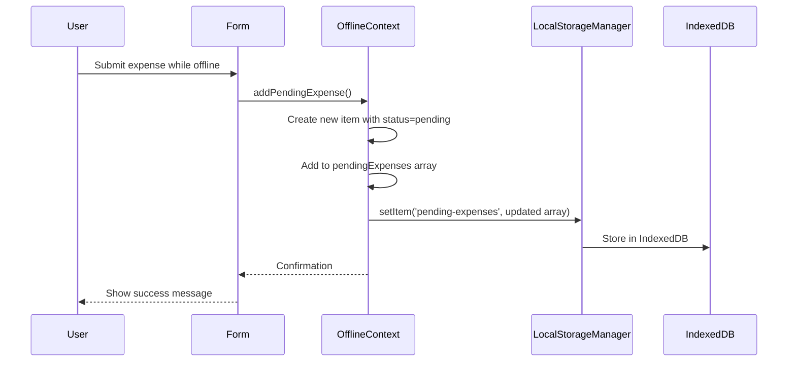
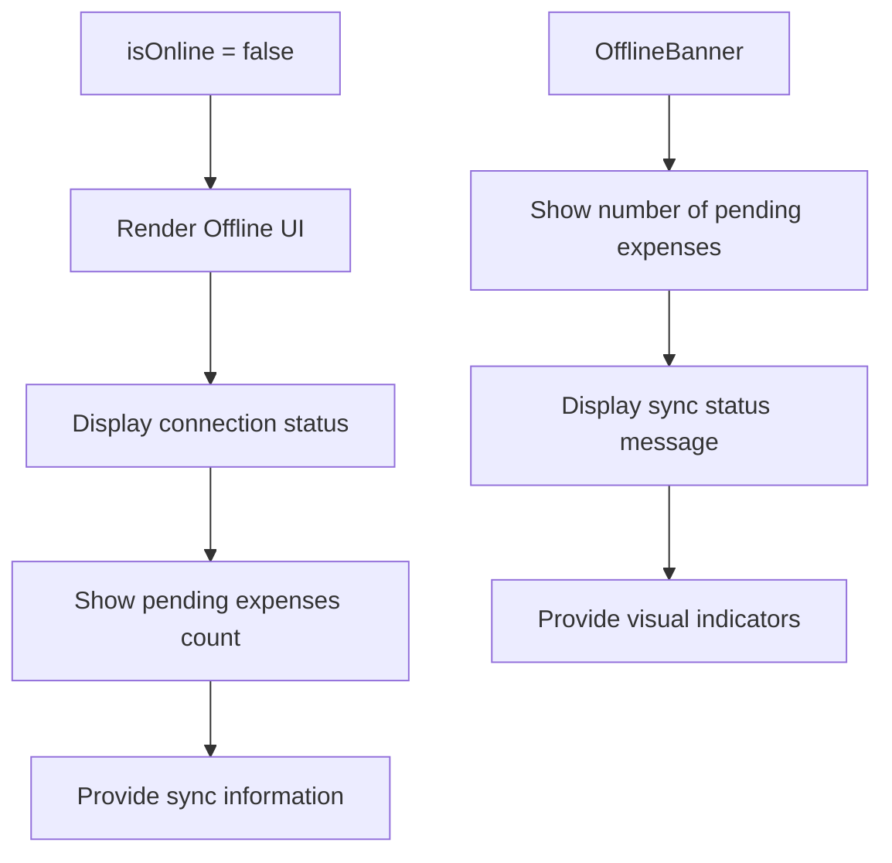
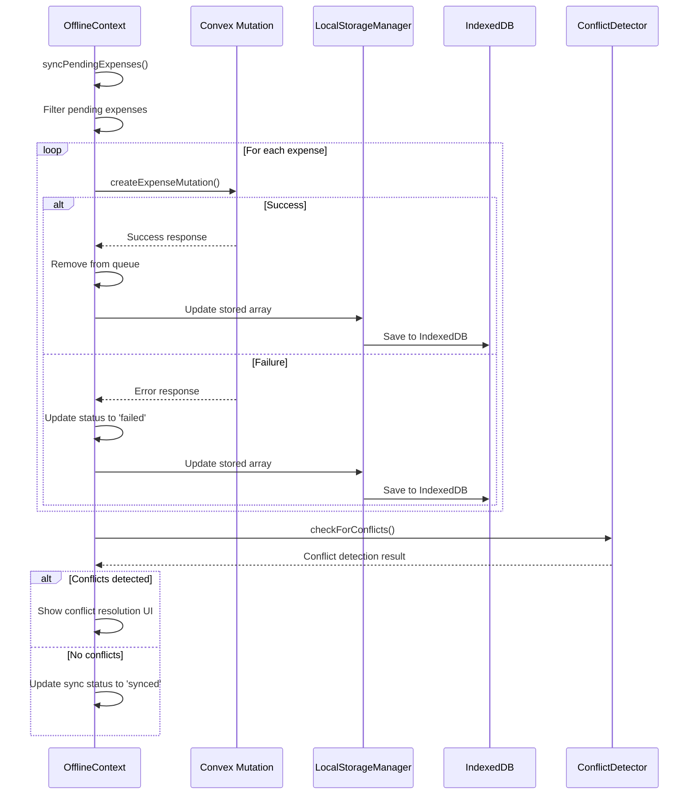
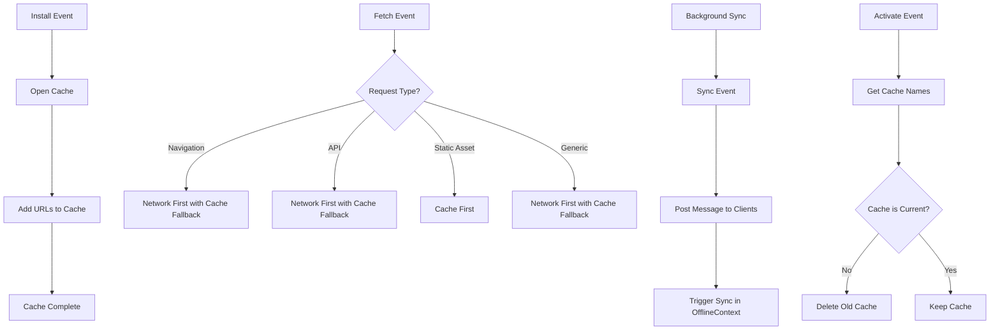

# Offline Functionality

<cite>
**Referenced Files in This Document**   
- [OfflineContext.tsx](file://src/contexts/OfflineContext.tsx) - *Updated in recent commit*
- [OfflineBanner.tsx](file://src/components/OfflineBanner.tsx) - *Updated in recent commit*
- [sw.js](file://public/sw.js) - *Updated in recent commit*
- [LocalStorageManager.ts](file://src/lib/storage/LocalStorageManager.ts) - *Added in recent commit*
- [CloudSyncManager.ts](file://src/lib/sync/CloudSyncManager.ts) - *Added in recent commit*
- [ConflictDetector.ts](file://src/lib/sync/ConflictDetector.ts) - *Added in recent commit*
- [LocalFirstConvexClient.ts](file://src/lib/client/LocalFirstConvexClient.ts) - *Added in recent commit*
</cite>

## Update Summary
**Changes Made**   
- Updated offline architecture overview to reflect new localforage-based IndexedDB storage
- Added comprehensive section on conflict detection and resolution strategies
- Updated data storage section to reflect LocalStorageManager implementation
- Added new section on advanced sync methods and background sync capabilities
- Updated service worker section to include background sync and message handling
- Added new section on performance optimization strategies
- Updated UI feedback mechanisms to reflect enhanced OfflineBanner functionality
- Added section on sync statistics and monitoring
- Removed outdated information about localStorage usage in favor of IndexedDB

## Table of Contents
1. [Offline Architecture Overview](#offline-architecture-overview)
2. [Core Components](#core-components)
3. [Data Storage with IndexedDB](#data-storage-with-indexeddb)
4. [Connectivity Detection](#connectivity-detection)
5. [Pending Operations Queue](#pending-operations-queue)
6. [UI Feedback Mechanisms](#ui-feedback-mechanisms)
7. [Sync Process and Conflict Resolution](#sync-process-and-conflict-resolution)
8. [Form Integration](#form-integration)
9. [Service Worker Caching and Background Sync](#service-worker-caching-and-background-sync)
10. [Limitations and Considerations](#limitations-and-considerations)
11. [Debugging and Optimization](#debugging-and-optimization)

## Offline Architecture Overview

The application implements an advanced offline-first architecture that enables users to continue interacting with expense and income tracking features even when network connectivity is unavailable. This is achieved through a combination of IndexedDB storage via localforage, service worker caching, and intelligent state management with conflict detection.

The architecture consists of four main layers:
- **Service Worker Layer**: Handles static asset caching, network request interception, and background sync
- **Storage Layer**: Uses IndexedDB (via localforage) for persistent storage of pending operations and local data
- **Application Layer**: Manages offline state, queues operations, and handles synchronization
- **Conflict Resolution Layer**: Detects and resolves data conflicts between local and cloud data

This multi-layered approach ensures that users can access the application interface offline and continue adding expenses and income records, which are then synchronized with the backend when connectivity is restored, with sophisticated conflict resolution capabilities.



**Diagram sources**
- [OfflineContext.tsx](file://src/contexts/OfflineContext.tsx#L1-L428)
- [LocalStorageManager.ts](file://src/lib/storage/LocalStorageManager.ts#L1-L130)
- [sw.js](file://public/sw.js#L1-L289)

**Section sources**
- [OfflineContext.tsx](file://src/contexts/OfflineContext.tsx#L1-L428)
- [LocalStorageManager.ts](file://src/lib/storage/LocalStorageManager.ts#L1-L130)
- [sw.js](file://public/sw.js#L1-L289)

## Core Components

The offline functionality is implemented through several key components that work together to provide a seamless offline experience:

- **OfflineContext**: Central state management for offline operations and conflict resolution
- **LocalStorageManager**: Comprehensive interface for IndexedDB operations using localforage
- **OfflineBanner**: Visual feedback component for offline status and pending operations
- **sw.js**: Service worker for asset caching, network interception, and background sync
- **CloudSyncManager**: Handles synchronization between local and cloud data
- **ConflictDetector**: Detects conflicts between local and cloud data versions
- **LocalFirstConvexClient**: Enhanced client for local-first operations with Convex

These components form the foundation of the advanced offline-first architecture, enabling the application to function effectively without network connectivity while providing sophisticated conflict resolution capabilities.

**Section sources**
- [OfflineContext.tsx](file://src/contexts/OfflineContext.tsx#L1-L428)
- [LocalStorageManager.ts](file://src/lib/storage/LocalStorageManager.ts#L1-L130)
- [OfflineBanner.tsx](file://src/components/OfflineBanner.tsx#L1-L27)
- [sw.js](file://public/sw.js#L1-L289)
- [CloudSyncManager.ts](file://src/lib/sync/CloudSyncManager.ts)
- [ConflictDetector.ts](file://src/lib/sync/ConflictDetector.ts)
- [LocalFirstConvexClient.ts](file://src/lib/client/LocalFirstConvexClient.ts)

## Data Storage with IndexedDB

The application uses IndexedDB via localforage to store pending operations and local data when offline. This provides a robust, high-capacity storage solution that supports complex data structures and transactions.

```mermaid
classDiagram
class IndexedDB {
+open()
+transaction()
+objectStore()
}
class localforage {
+getItem()
+setItem()
+removeItem()
+createInstance()
}
class LocalStorageManager {
- storage : typeof localforage
+initialize()
+getMetadata()
+updateMetadata()
+getSyncState()
+updateSyncState()
+exportData()
+importData()
}
class LocalDataSchema {
+metadata : LocalMetadata
+syncState : SyncState
+expenses : { [id : string] : LocalExpense }
+income : { [id : string] : LocalIncome }
+categories : { [id : string] : LocalCategory }
+cards : { [id : string] : LocalCard }
+forValues : { [id : string] : LocalForValue }
}
IndexedDB --> localforage : "abstracted by"
localforage --> LocalStorageManager : "used by"
LocalStorageManager --> LocalDataSchema : "manages"
```

**Diagram sources**
- [LocalStorageManager.ts](file://src/lib/storage/LocalStorageManager.ts#L1-L130)
- [localforage](file://node_modules/localforage)

**Section sources**
- [LocalStorageManager.ts](file://src/lib/storage/LocalStorageManager.ts#L1-L130)
- [OfflineContext.tsx](file://src/contexts/OfflineContext.tsx#L1-L428)

The storage is managed by the `LocalStorageManager` class, which provides a comprehensive interface for data operations:

```typescript
export class LocalStorageManager {
  private storage: typeof localforage;
  private initialized = false;

  constructor() {
    this.storage = localforage.createInstance({
      name: 'ExpenseTrackerV2',
      storeName: 'local_first_data',
      description: 'Local-first data storage with cloud sync capabilities',
      version: 2.0
    });
  }

  async initialize(userId: string): Promise<void> {
    if (this.initialized) return;

    try {
      // Initialize metadata if it doesn't exist
      const metadata = await this.getMetadata();
      if (!metadata) {
        await this.initializeMetadata(userId);
      }

      // Initialize sync state if it doesn't exist
      const syncState = await this.getSyncState();
      if (!syncState) {
        await this.initializeSyncState();
      }

      this.initialized = true;
    } catch (error) {
      console.error('Failed to initialize LocalStorageManager:', error);
      throw error;
    }
  }

  // ... other methods
}
```

The data schema includes comprehensive metadata and sync state tracking:

```typescript
interface SyncState {
  lastSync: number;
  pendingOperations: PendingOperation[];
  dataHash: string;
  conflictResolutions: ConflictResolution[];
  totalRecords: number;
  lastModified: number;
}

interface LocalMetadata {
  version: string;
  deviceId: string;
  userId: string;
  createdAt: number;
  updatedAt: number;
  schemaVersion: number;
}
```

This approach provides a robust foundation for local-first data management with proper versioning, conflict tracking, and device identification.

## Connectivity Detection

The application detects network connectivity status using the browser's built-in online/offline events and the navigator.onLine property. This detection is implemented in the `OfflineContext` provider.



**Diagram sources**
- [OfflineContext.tsx](file://src/contexts/OfflineContext.tsx#L1-L428)

**Section sources**
- [OfflineContext.tsx](file://src/contexts/OfflineContext.tsx#L1-L428)

The implementation uses React's useEffect hook to set up event listeners when the provider is mounted:

```typescript
useEffect(() => {
  const handleOnline = () => {
    setIsOnline(true);
    // Trigger conflict detection when coming back online
    setTimeout(() => {
      checkForConflicts();
    }, 1000);
  };
  
  const handleOffline = () => {
    setIsOnline(false);
    setSyncStatus('pending');
  };

  window.addEventListener("online", handleOnline);
  window.addEventListener("offline", handleOffline);

  setIsOnline(navigator.onLine);

  return () => {
    window.removeEventListener("online", handleOnline);
    window.removeEventListener("offline", handleOffline);
  };
}, [token]);
```

Additionally, the context includes app focus detection to trigger conflict resolution when the user returns to the application:

```typescript
useEffect(() => {
  const handleFocus = () => {
    if (isOnline) {
      setTimeout(() => {
        checkForConflicts();
      }, 500);
    }
  };

  window.addEventListener('focus', handleFocus);
  return () => window.removeEventListener('focus', handleFocus);
}, [isOnline, checkForConflicts]);
```

This comprehensive approach ensures that the application responds immediately to changes in network connectivity and user activity, updating the UI and enabling/disabling synchronization accordingly.

## Pending Operations Queue

The application maintains a queue of pending expenses that need to be synchronized with the server. This queue is managed by the `OfflineContext` and stored persistently using IndexedDB via localforage.



**Diagram sources**
- [OfflineContext.tsx](file://src/contexts/OfflineContext.tsx#L1-L428)
- [LocalStorageManager.ts](file://src/lib/storage/LocalStorageManager.ts#L1-L130)

**Section sources**
- [OfflineContext.tsx](file://src/contexts/OfflineContext.tsx#L1-L428)
- [LocalStorageManager.ts](file://src/lib/storage/LocalStorageManager.ts#L1-L130)

The queue implementation includes the following key features:

- **Persistent Storage**: Pending expenses are saved to IndexedDB, ensuring they survive page reloads
- **Status Tracking**: Each pending expense has a status field that tracks its synchronization state (pending, syncing, synced, failed)
- **Error Handling**: Failed synchronization attempts are marked as 'failed' and can be retried
- **Automatic Cleanup**: Successfully synchronized expenses are removed from the queue
- **Conflict Detection**: The system checks for conflicts when connectivity is restored or when the app gains focus

The `addPendingExpense` function creates a new item object with a timestamp-based ID and adds it to both the in-memory state and persistent storage:

```typescript
const addPendingExpense = async (expense: Omit<PendingExpense, 'id' | 'status'>) => {
  const newExpense: PendingExpense = {
    ...expense,
    id: Date.now().toString(),
    status: 'pending',
  };

  const updated = [...pendingExpenses, newExpense];
  setPendingExpenses(updated);
  try {
    await localforage.setItem('pending-expenses', updated);
  } catch (error) {
    console.error("Failed to save pending expense to IndexedDB:", error);
  }
};
```

## UI Feedback Mechanisms

The application provides clear visual feedback to users about their offline status and pending operations through the OfflineBanner component and enhanced status indicators.



**Diagram sources**
- [OfflineBanner.tsx](file://src/components/OfflineBanner.tsx#L1-L27)
- [OfflineContext.tsx](file://src/contexts/OfflineContext.tsx#L1-L428)

**Section sources**
- [OfflineBanner.tsx](file://src/components/OfflineBanner.tsx#L1-L27)
- [OfflineContext.tsx](file://src/contexts/OfflineContext.tsx#L1-L428)

The OfflineBanner component displays the current offline status and the number of pending expenses:

```typescript
export const OfflineBanner: React.FC = () => {
  const { isOnline, pendingExpenses } = useOffline();

  if (isOnline) return null;

  return (
    <div className="w-full bg-orange-100 text-orange-800 px-4 py-2 text-sm flex items-center gap-2">
      <AlertTriangle size={16} className="shrink-0" />
      <span>
        You are offline. {pendingExpenses.length} pending expense
        {pendingExpenses.length === 1 ? "" : "s"} will sync when you're back
        online.
      </span>
    </div>
  );
};
```

The component is integrated into the application layout to provide persistent feedback:

```typescript
// In layout.tsx
<OfflineProvider>
  <ServiceWorkerRegistration />
  <OfflineBanner />
  {/* Main application content */}
</OfflineProvider>
```

Additionally, the OfflineContext provides enhanced sync status information that can be used by other components:

```typescript
interface OfflineContextType {
  // ... other properties
  syncStatus: SyncStatus; // 'pending', 'syncing', 'synced', 'failed'
  lastSyncTime?: Date;
  conflictState: ConflictState;
  getSyncStatistics: () => Promise<{ pendingOperations: number; lastSync: Date | null; }>;
}
```

## Sync Process and Conflict Resolution

The synchronization process is automatically triggered when connectivity is restored or when the application gains focus, but can also be manually initiated by the user. The system handles synchronization of pending expenses to the Convex backend with sophisticated conflict detection and resolution capabilities.



**Diagram sources**
- [OfflineContext.tsx](file://src/contexts/OfflineContext.tsx#L1-L428)
- [ConflictDetector.ts](file://src/lib/sync/ConflictDetector.ts)

**Section sources**
- [OfflineContext.tsx](file://src/contexts/OfflineContext.tsx#L1-L428)
- [ConflictDetector.ts](file://src/lib/sync/ConflictDetector.ts)

The synchronization process follows these steps:

1. Check for authentication token and online status
2. Filter pending expenses (status: 'pending' or 'failed')
3. For each expense:
   - Attempt to create the expense via Convex mutation
   - On success: remove from queue and update storage
   - On failure: update status to 'failed' and update storage

```typescript
const syncPendingExpenses = async () => {
  if (!token || !isOnline) return;

  const expensesToSync = pendingExpenses.filter(e => e.status === 'pending' || e.status === 'failed');
  if (expensesToSync.length === 0) return;

  for (const expense of expensesToSync) {
    await updateExpenseStatus(expense.id, 'syncing');
    try {
      await createExpenseMutation({
        token,
        amount: expense.amount,
        title: expense.title,
        category: expense.category,
        for: expense.for,
        date: expense.date,
      });
      // On success, remove it from the pending list
      const remainingExpenses = pendingExpenses.filter(e => e.id !== expense.id);
      setPendingExpenses(remainingExpenses);
      await localforage.setItem('pending-expenses', remainingExpenses);
    } catch (error) {
      console.error(`Failed to sync expense ${expense.id}:`, error);
      await updateExpenseStatus(expense.id, 'failed');
    }
  }
};
```

### Conflict Resolution Strategy

The implementation uses a sophisticated conflict detection and resolution strategy that goes beyond simple last-write-wins:

```mermaid
flowchart TD
A[Connectivity Restored] --> B[checkForConflicts()]
B --> C[Export Local Data]
C --> D[Fetch Cloud Data]
D --> E[Detect Conflicts]
E --> F{Conflicts Found?}
F --> |Yes| G[Show ConflictPrompt]
G --> H[User Selects Resolution]
H --> I[resolveConflict()]
I --> J[Upload Local or Download Cloud]
F --> |No| K[Update Sync Status]
K --> L[Sync Complete]
```

**Diagram sources**
- [ConflictDetector.ts](file://src/lib/sync/ConflictDetector.ts)
- [OfflineContext.tsx](file://src/contexts/OfflineContext.tsx#L1-L428)

**Section sources**
- [ConflictDetector.ts](file://src/lib/sync/ConflictDetector.ts)
- [OfflineContext.tsx](file://src/contexts/OfflineContext.tsx#L1-L428)

The conflict resolution methods in OfflineContext:

```typescript
const checkForConflicts = useCallback(async () => {
  if (!isOnline || !localStorageManager || !conflictDetector || !token) {
    return;
  }

  try {
    // Export current local data
    const localData = await localStorageManager.exportData();
    
    // Get cloud data (this would require cloudSyncManager)
    // const cloudData = await cloudSyncManager.syncFromCloud(token);
    
    // Detect conflicts
    // const conflictResult = await conflictDetector.detectConflicts(localData, cloudData);
    
    // if (conflictResult.hasConflicts) {
    //   setConflictState({
    //     hasConflicts: true,
    //     conflictResult,
    //     isResolving: false,
    //     lastDetectionTime: new Date()
    //   });
    // } else {
    //   setConflictState({
    //     hasConflicts: false,
    //     isResolving: false
    //   });
    // }
    
  } catch (error) {
    console.error('Conflict detection failed:', error);
  }
}, [isOnline, localStorageManager, conflictDetector, token]);

const resolveConflict = useCallback(async (action: 'upload_local' | 'download_cloud' | 'dismiss') => {
  if (!conflictState.hasConflicts || !localFirstClient || !token) {
    return;
  }

  setConflictState(prev => ({ ...prev, isResolving: true }));

  try {
    switch (action) {
      case 'upload_local':
        await localFirstClient.uploadLocalData(token);
        break;
      case 'download_cloud':
        await localFirstClient.downloadCloudData(token);
        break;
      case 'dismiss':
        // Just dismiss the conflict without action
        break;
    }

    setConflictState({
      hasConflicts: false,
      isResolving: false
    });
    
    setSyncStatus('synced');
    setLastSyncTime(new Date());
    
  } catch (error) {
    console.error('Conflict resolution failed:', error);
    setConflictState(prev => ({ ...prev, isResolving: false }));
  }
}, [conflictState.hasConflicts, localFirstClient, token]);
```

The system supports three resolution actions:
- **Upload Local**: Keep local changes and overwrite cloud data
- **Download Cloud**: Discard local changes and use cloud data
- **Dismiss**: Keep the conflict notification but continue working

This approach provides users with control over their data while maintaining data integrity across devices.

## Form Integration

The offline functionality is integrated into the expense and income form components, allowing users to continue adding financial records even when offline.

```mermaid
flowchart TD
A[User fills form] --> B[Submit button clicked]
B --> C{Online?}
C --> |Yes| D[Direct Convex mutation]
C --> |No| E[addPendingExpense()]
D --> F[Show success message]
E --> G[Store in IndexedDB]
G --> H[Show success message]
H --> I[Expense appears in list]
style D fill:#d9ead3
style E fill:#fff2cc
```

**Diagram sources**
- [OfflineContext.tsx](file://src/contexts/OfflineContext.tsx#L1-L428)
- [expenses/page.tsx](file://src/app/expenses/page.tsx)
- [income/page.tsx](file://src/app/income/page.tsx)

**Section sources**
- [OfflineContext.tsx](file://src/contexts/OfflineContext.tsx#L1-L428)
- [expenses/page.tsx](file://src/app/expenses/page.tsx)
- [income/page.tsx](file://src/app/income/page.tsx)

### Expense Form Integration

The expenses page integrates with the offline system by using the `useOffline` hook to access the offline context:

```typescript
const handleSubmit = async (e: React.FormEvent) => {
  e.preventDefault();
  
  // Validation logic...
  
  setIsSubmitting(true);

  const expenseData: ExpenseCreationData = {
    amount,
    title: formData.title,
    category: formData.category,
    for: formData.for,
    date: parsedDate.getTime(),
    cardId: formData.cardId as any,
  };

  try {
    if (isOnline) {
      await createExpenseMutation({ token: token!, ...expenseData });
      toast.success("Your expense has been added.");
      refetch();
    } else {
      await addPendingExpense(expenseData);
      toast.success("You are offline. Expense saved locally and will be synced later.");
    }
    
    // Reset form
    setFormData({
      amount: "",
      title: "",
      category: [],
      for: [],
      date: new Date(),
      cardId: formData.cardId,
    });
  } catch (error: unknown) {
    toast.error("Could not add your expense. Please try again.");
    console.error(error);
  } finally {
    setIsSubmitting(false);
  }
};
```

When offline, the form submission uses the `addPendingExpense` function to store the expense data in IndexedDB for later synchronization.

### Income Form Integration

Similarly, the income form follows the same pattern, using the same offline context to ensure data persistence when offline.

## Service Worker Caching and Background Sync

The service worker (sw.js) implements advanced caching strategies and background sync capabilities to ensure the application remains accessible offline and can synchronize data even when the application is not actively open.



**Diagram sources**
- [sw.js](file://public/sw.js#L1-L289)

**Section sources**
- [sw.js](file://public/sw.js#L1-L289)

The service worker implements several key events and capabilities:

### Install Event
Caches essential application resources during installation:

```javascript
self.addEventListener('install', (event) => {
  console.log('Service Worker: Installing...');
  
  event.waitUntil(
    (async () => {
      try {
        const cache = await caches.open(STATIC_CACHE);
        console.log('Service Worker: Caching essential resources');
        
        // Cache essential pages one by one to handle failures gracefully
        const cachePromises = ESSENTIAL_CACHE.map(async (url) => {
          try {
            await cache.add(url);
            console.log(`Service Worker: Cached ${url}`);
          } catch (error) {
            console.warn(`Service Worker: Failed to cache ${url}:`, error);
          }
        });
        
        await Promise.allSettled(cachePromises);
        console.log('Service Worker: Essential resources cached');
      } catch (error) {
        console.error('Service Worker: Install failed:', error);
      }
    })()
  );
  
  // Force activation of new service worker
  self.skipWaiting();
});
```

### Fetch Event
Intercepts network requests and applies different caching strategies based on request type:

```javascript
self.addEventListener('fetch', (event) => {
  const { request } = event;
  
  // Skip non-GET requests
  if (request.method !== 'GET') {
    return;
  }

  // Handle navigation requests (page loads)
  if (request.mode === 'navigate') {
    event.respondWith(handleNavigationRequest(request));
    return;
  }

  // Handle API requests (Convex and other APIs)
  if (request.url.includes('/api/') || request.url.includes('convex.cloud')) {
    event.respondWith(handleApiRequest(request));
    return;
  }

  // Handle static assets
  if (request.destination === 'script' || request.destination === 'style' || 
      request.destination === 'image' || request.url.includes('/_next/')) {
    event.respondWith(handleStaticAsset(request));
    return;
  }

  // Default handling for other requests
  event.respondWith(handleGenericRequest(request));
});
```

### Background Sync
Enables synchronization even when the application is not actively open:

```javascript
// Background sync for pending operations (if supported)
if ('sync' in self.registration) {
  self.addEventListener('sync', (event) => {
    if (event.tag === 'background-sync') {
      console.log('Service Worker: Background sync triggered');
      event.waitUntil(
        self.clients.matchAll().then(clients => {
          clients.forEach(client => {
            client.postMessage({ type: 'BACKGROUND_SYNC' });
          });
        })
      );
    }
  });
}
```

### Activate Event
Cleans up old caches when a new version is activated:

```javascript
self.addEventListener('activate', (event) => {
  console.log('Service Worker: Activating...');
  
  event.waitUntil(
    (async () => {
      // Clean up old caches
      const cacheNames = await caches.keys();
      const currentCaches = [STATIC_CACHE, DYNAMIC_CACHE];
      
      const deletePromises = cacheNames
        .filter(cacheName => !currentCaches.includes(cacheName))
        .map(cacheName => {
          console.log('Service Worker: Deleting old cache:', cacheName);
          return caches.delete(cacheName);
        });
      
      await Promise.all(deletePromises);
      console.log('Service Worker: Cache cleanup completed');
    })()
  );
  
  // Take control of all pages immediately
  self.clients.claim();
  console.log('Service Worker: Now controlling all pages');
});
```

The cached resources include:
- Main application routes (/, /login, /register, etc.)
- Essential pages (/expenses, /dashboard, /settings)
- Manifest and icon files for PWA functionality

This advanced caching strategy ensures that users can access the application interface even when offline, with intelligent fallbacks for different types of requests.

## Limitations and Considerations

While the offline functionality provides significant benefits, there are several limitations and considerations to be aware of:

### Real-time Collaboration
The application does not support real-time collaboration, which is a deliberate design choice given the personal finance tracking use case. Multiple users accessing the same account from different devices could potentially create data conflicts, but this scenario is considered unlikely.

### Eventual Consistency
The system follows an eventually consistent model, where data modifications made offline will be synchronized with the server when connectivity is restored. However, there is no guarantee of immediate consistency across devices.

### Conflict Resolution
While the implementation includes sophisticated conflict detection, the resolution strategies are user-driven rather than automatic. This places the responsibility on users to resolve conflicts when they occur, which could lead to data loss if not handled properly.

### Storage Limits
While IndexedDB provides significantly more storage capacity than localStorage (typically 50% of disk space), there are still practical limits. Users with extensive transaction histories might encounter storage limitations on devices with limited disk space.

### Data Freshness
When offline, users work with potentially stale data. The application does not cache server data for display, so any changes made by the user on other devices will not be visible until connectivity is restored and synchronization occurs.

### Battery and Performance
Continuous synchronization attempts when offline could impact device battery life, although the current implementation is efficient in this regard. The background sync capability could also impact performance on low-end devices.

### Browser Support
While IndexedDB and service workers are widely supported, there are still some older browsers and environments where these features may not be available or may have limitations.

## Debugging and Optimization

### Debugging Techniques

Developers can use browser DevTools to debug offline functionality:

1. **Application Tab**: Inspect IndexedDB to view pending expenses and local data
2. **Network Tab**: Use the "Offline" checkbox to simulate offline conditions
3. **Console**: Monitor error messages from failed synchronization attempts
4. **Application Cache**: View cached resources in the Cache Storage section
5. **Service Workers**: Monitor service worker lifecycle and cache status
6. **Sources Tab**: Set breakpoints in the service worker code

### Optimization Strategies

Several strategies can optimize sync performance:

1. **Batch Processing**: Group multiple pending operations into a single request when possible
2. **Prioritization**: Implement priority levels for different types of operations
3. **Retry Logic**: Add exponential backoff for failed synchronization attempts
4. **Bandwidth Detection**: Adjust sync behavior based on network quality
5. **Progressive Sync**: Sync critical data first, then less important data
6. **Background Sync**: Use the Background Sync API to synchronize data even when the application is not active

### Performance Monitoring

Key performance metrics to monitor:
- Time to first interaction when offline
- Synchronization duration for various numbers of pending operations
- Storage usage growth over time
- Service worker activation and update frequency
- Conflict detection and resolution rates

The current implementation provides a robust foundation for offline functionality, with clear opportunities for enhancement in future iterations.