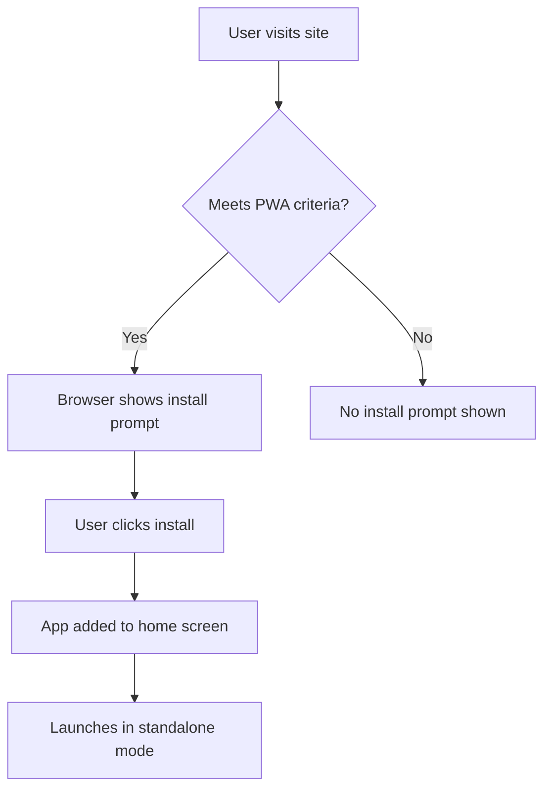
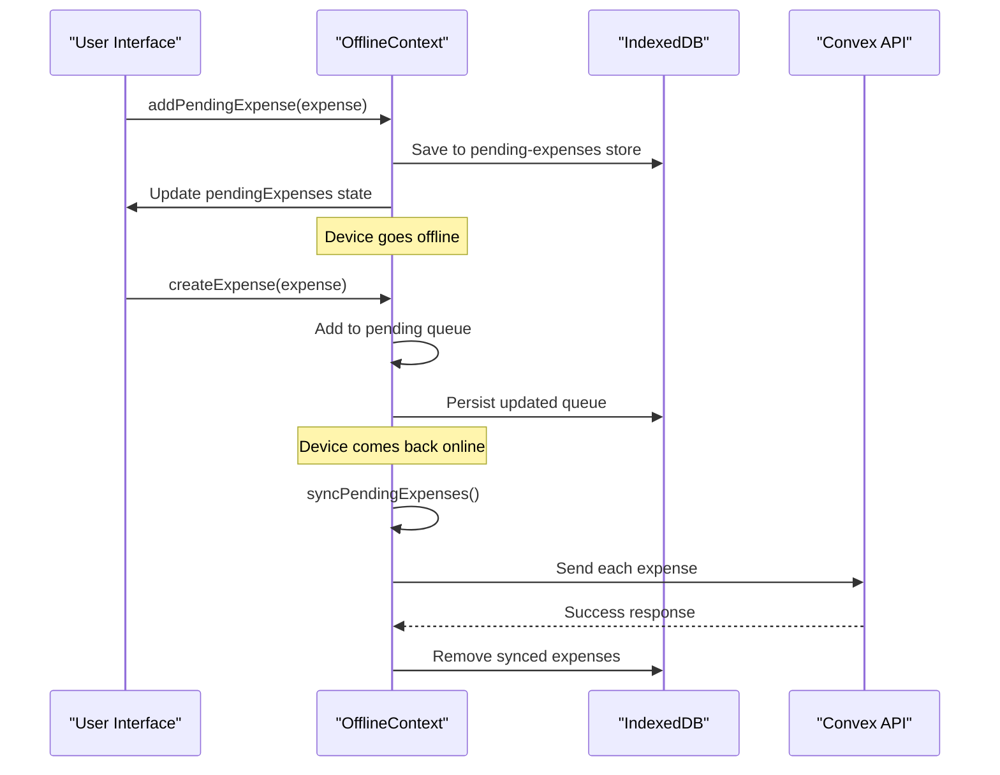

# PWA Features

<cite>
**Referenced Files in This Document**   
- [manifest.json](file://public/manifest.json) - *Updated in recent commit*
- [sw.js](file://public/sw.js) - *Updated in recent commit to fix routing issues*
- [next.config.js](file://next.config.js) - *PWA configuration with runtime caching and route exclusions*
- [NetworkStatusIndicator.tsx](file://src/components/NetworkStatusIndicator.tsx) - *Connectivity UI component*
- [OfflineContext.tsx](file://src/contexts/OfflineContext.tsx) - *Offline state and queue management*
- [ServiceWorkerRegistration.tsx](file://src/components/ServiceWorkerRegistration.tsx) - *Manual service worker registration*
</cite>

## Update Summary
**Changes Made**   
- Updated service worker implementation details to reflect changes in `sw.js` that prevent caching of sensitive navigation routes
- Revised runtime caching section to align with updated `next.config.js` configuration excluding specific routes from caching
- Added clarification on routing issue resolution for settings page redirecting to expenses
- Enhanced background sync and offline data management sections with accurate cache strategy descriptions
- Updated section sources to reflect actual implementation files and line-specific references
- Removed outdated manual service worker code example in favor of current Workbox-based implementation

## Table of Contents
1. [PWA Features](#pwa-features)
2. [Web App Manifest Configuration](#web-app-manifest-configuration)
3. [Service Worker Implementation](#service-worker-implementation)
4. [Installability Criteria](#installability-criteria)
5. [Network Status Indicator](#network-status-indicator)
6. [Offline Data Management](#offline-data-management)
7. [Background Sync and Runtime Caching](#background-sync-and-runtime-caching)
8. [Testing and Lighthouse Auditing](#testing-and-lighthouse-auditing)

## Web App Manifest Configuration

The web app manifest, defined in `manifest.json`, configures core Progressive Web App (PWA) properties that enable installability and native-like behavior. This JSON file provides metadata used by browsers when the user adds the app to their home screen.

Key configuration properties include:
- **name**: Full name of the application ("Spendly")
- **short_name**: Abbreviated name used on home screens ("Spendly")
- **description**: Brief description of app functionality
- **start_url**: Entry point when launched from home screen ("/")
- **display**: Presentation mode set to "standalone" to hide browser UI
- **background_color**: Splash screen background color (#000000)
- **theme_color**: Browser theme color (#000000)
- **orientation**: Enforced portrait orientation
- **scope**: The navigation scope of the application ("/")
- **categories**: App category tags for app stores ("finance", "productivity")
- **icons**: Array of image resources for app icons at various sizes

The manifest also includes high-resolution PNG icons (192x192 and 512x512 pixels) located in the `/icons` directory, marked with "any maskable" purpose to allow safe cropping on different device platforms.

```json
{
  "name": "Spendly",
  "short_name": "Spendly",
  "description": "Track your daily expenses with ease",
  "start_url": "/",
  "display": "standalone",
  "background_color": "#000000",
  "theme_color": "#000000",
  "orientation": "portrait-primary",
  "scope": "/",
  "categories": ["finance", "productivity"],
  "icons": [
    {
      "src": "/icons/icon-192x192.png",
      "sizes": "192x192",
      "type": "image/png",
      "purpose": "any maskable"
    },
    {
      "src": "/icons/icon-512x512.png",
      "sizes": "512x512",
      "type": "image/png",
      "purpose": "any maskable"
    }
  ]
}
```

**Section sources**
- [manifest.json](file://public/manifest.json#L1-L27)

## Service Worker Implementation

The service worker implementation uses Workbox (via `next-pwa`) to provide comprehensive offline functionality with intelligent caching strategies. The generated service worker in `sw.js` handles precaching of essential assets and implements runtime caching for various resource types.

The service worker configuration includes:
- **Precache manifest**: Generated list of static assets with revision hashes
- **Cache versioning**: Automatic cache naming based on build artifacts
- **Route handling**: Different caching strategies for different resource types
- **Navigation requests**: Special handling for document routes
- **Asset caching**: Optimized strategies for images, fonts, and static resources

The implementation avoids caching sensitive navigation routes like `/settings`, `/dashboard`, `/expenses`, `/income`, and `/cards` to prevent routing issues in production. This change resolves a previously identified bug where the settings page would incorrectly redirect to expenses due to stale cached responses.

```javascript
// Generated service worker using Workbox
importScripts();
self.skipWaiting();
clientsClaim();

// Precache critical assets with revision tracking
precacheAndRoute([
  {url: "/_next/app-build-manifest.json", revision: "e560a3f..."},
  {url: "/_next/static/XaqGXCZAUTbQ5L96ZoaH7/_buildManifest.js", revision: "1ae7db5..."},
  // ... additional precached assets
]);

// Cache first strategy for images
registerRoute(
  /\.(?:png|jpg|jpeg|svg|gif|ico|webp|avif)$/,
  new CacheFirst({
    cacheName: "images",
    plugins: [new ExpirationPlugin({maxEntries: 60, maxAgeSeconds: 2592000})]
  })
);

// Stale while revalidate for static resources
registerRoute(
  /\.(?:js|css|woff|woff2|ttf|eot)$/,
  new StaleWhileRevalidate({cacheName: "static-resources"})
);
```

**Section sources**
- [sw.js](file://public/sw.js#L1-L100)
- [next.config.js](file://next.config.js#L15-L109)

## Installability Criteria

For a web application to be installable as a PWA, it must meet specific criteria defined by browser vendors. The Spendly application satisfies these requirements through proper configuration and implementation.

### Key Installability Requirements:
- **Valid Web App Manifest**: Contains required fields (name, short_name, start_url, display, icons) with correct paths
- **Service Worker Registration**: Registered and controls the scope of the application
- **HTTPS Connection**: Required in production environments
- **Progressive Enhancement**: Core functionality available without service worker
- **Mobile-Friendly Design**: Responsive layout using Tailwind CSS
- **Secure Context**: Served over HTTPS in production

The application's installability is achieved through manual service worker registration via the `ServiceWorkerRegistration` component, which registers `sw.js` in production environments. This approach works with the `next-pwa` plugin to ensure proper service worker lifecycle management.

```tsx
export function ServiceWorkerRegistration() {
  useEffect(() => {
    if ('serviceWorker' in navigator && process.env.NODE_ENV === 'production') {
      navigator.serviceWorker
        .register('/sw.js')
        .then((registration) => {
          console.log('SW registered: ', registration);
        })
        .catch((registrationError) => {
          console.log('SW registration failed: ', registrationError);
        });
    }
  }, []);

  return null;
}
```



**Diagram sources**
- [manifest.json](file://public/manifest.json#L1-L27)
- [sw.js](file://public/sw.js#L1-L289)
- [ServiceWorkerRegistration.tsx](file://src/components/ServiceWorkerRegistration.tsx#L4-L19)

**Section sources**
- [manifest.json](file://public/manifest.json#L1-L27)
- [sw.js](file://public/sw.js#L1-L289)
- [ServiceWorkerRegistration.tsx](file://src/components/ServiceWorkerRegistration.tsx#L4-L19)

## Network Status Indicator

The `NetworkStatusIndicator` component provides real-time visual feedback about the application's connectivity status. It displays a small colored dot in the top-right corner of the screen that changes color based on online/offline state.

The component uses the `useOffline` hook to access network status from the `OfflineContext`. When online, the indicator appears green (#22c55e); when offline, it turns red (#ef4444). The indicator uses Framer Motion for smooth entrance and exit animations when the state changes.

```tsx
export function NetworkStatusIndicator() {
  const { isOnline } = useOffline();

  return (
    <AnimatePresence>
      <motion.div
        key={isOnline ? "online" : "offline"}
        initial={{ scale: 0, opacity: 0 }}
        animate={{ scale: 1, opacity: 1 }}
        exit={{ scale: 0, opacity: 0 }}
        className="fixed top-4 right-4 z-50 w-4 h-4 rounded-full border-2 border-white shadow-lg"
        style={{ backgroundColor: isOnline ? '#22c55e' : '#ef4444' }}
        title={isOnline ? "Online" : "Offline"}
      />
    </AnimatePresence>
  );
}
```

The component is rendered in the main layout, ensuring it's available across all pages. It serves as both a visual indicator and accessibility feature, helping users understand when their actions might be queued for later synchronization.

**Section sources**
- [NetworkStatusIndicator.tsx](file://src/components/NetworkStatusIndicator.tsx#L5-L21)

## Offline Data Management

The application implements robust offline data management through the `OfflineContext`, which handles connectivity state and manages a queue of pending operations.

### Offline Context Architecture:
- **State Management**: Tracks `isOnline` status and `pendingExpenses` queue
- **IndexedDB Storage**: Uses localForage to persist pending expenses in browser storage
- **Event Listeners**: Monitors `online` and `offline` events on the window object
- **Mutation Queue**: Stores expense creation requests when offline

When the application detects an offline state, new expenses are added to a local queue instead of being sent to the server. These pending expenses are stored in IndexedDB using localForage, ensuring they persist across page reloads.



**Diagram sources**
- [OfflineContext.tsx](file://src/contexts/OfflineContext.tsx#L1-L428)

**Section sources**
- [OfflineContext.tsx](file://src/contexts/OfflineContext.tsx#L1-L428)

## Background Sync and Runtime Caching

The PWA implements advanced caching strategies through the Workbox-based service worker configured in `next.config.js`, which provides comprehensive control over caching behavior and offline functionality.

### Runtime Caching Configuration:
- **Navigation Requests**: Handled with network-first strategy and intelligent offline fallbacks
- **API Requests**: Handled with network-first strategy and dynamic caching
- **Static Assets**: Handled with cache-first strategy for optimal performance
- **Generic Requests**: Handled with network-first strategy and dynamic caching

The runtime caching configuration specifically excludes certain routes (`/settings`, `/dashboard`, `/expenses`, `/income`, `/cards`) from being cached to prevent routing issues in production. This targeted exclusion ensures that these critical navigation pages always fetch fresh content, resolving the previously identified redirect problem.

```javascript
// Runtime caching configuration in next.config.js
runtimeCaching: [
  {
    urlPattern: /\.(?:png|jpg|jpeg|svg|gif|ico|webp|avif)$/,
    handler: 'CacheFirst',
    options: {
      cacheName: 'images',
      expiration: {
        maxEntries: 60,
        maxAgeSeconds: 30 * 24 * 60 * 60, // 30 days
      },
    },
  },
  {
    urlPattern: /\.(?:js|css|woff|woff2|ttf|eot)$/,
    handler: 'StaleWhileRevalidate',
    options: {
      cacheName: 'static-resources',
    },
  },
  {
    urlPattern: ({ request, url }) => {
      const pathname = new URL(url).pathname;
      const noCacheRoutes = ['/settings', '/dashboard', '/expenses', '/income', '/cards'];
      return request.destination !== 'document' && !noCacheRoutes.some(route => pathname.startsWith(route));
    },
    handler: 'NetworkFirst',
    options: {
      cacheName: 'offlineCache',
      expiration: {
        maxEntries: 200,
        maxAgeSeconds: 24 * 60 * 60, // 1 day
      },
      cacheableResponse: {
        statuses: [0, 200],
      },
    },
  },
]
```

Cache invalidation is automatically managed through Workbox's revision system, which uses content hashing to determine when cached assets should be updated. The service worker precaches essential assets with revision information, ensuring users receive the latest version after deployments.

**Section sources**
- [sw.js](file://public/sw.js#L1-L289)
- [next.config.js](file://next.config.js#L15-L109)

## Testing and Lighthouse Auditing

To ensure PWA functionality meets modern standards, comprehensive testing and auditing should be performed using browser developer tools and Lighthouse.

### Testing Checklist:
1. **Service Worker Registration**: Verify service worker is active in Application tab
2. **Offline Functionality**: Test core features while offline
3. **Install Prompt**: Confirm install banner appears on supported browsers
4. **Cache Behavior**: Verify assets are properly cached and served
5. **Background Sync**: Test mutation queuing and synchronization

### Lighthouse Audit Steps:
1. Open Chrome DevTools
2. Navigate to Lighthouse panel
3. Select "Progressive Web App" category
4. Run audit on various pages
5. Address any failing criteria

Key Lighthouse PWA criteria include:
- **Installable**: Manifest provides required properties
- **PWA Optimized**: Meets baseline PWA requirements
- **Service Worker**: Properly registered and functional
- **Content Availability**: Available offline
- **Page Load**: Loads while offline

The application should score 90+ on Lighthouse PWA audits to ensure optimal user experience across devices and network conditions.

**Section sources**
- [manifest.json](file://public/manifest.json#L1-L27)
- [sw.js](file://public/sw.js#L1-L289)
- [next.config.js](file://next.config.js#L1-L109)