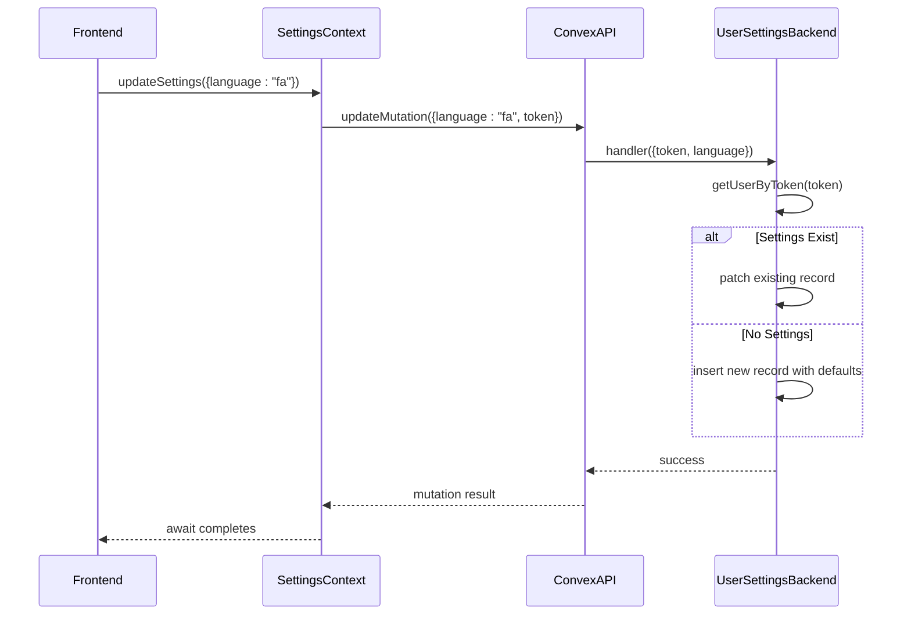
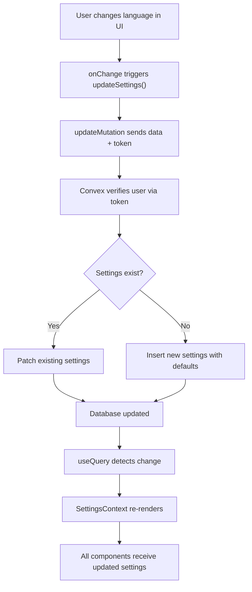

# Settings Management

<cite>
**Referenced Files in This Document**   
- [userSettings.ts](file://convex/userSettings.ts) - *Updated to include language preference support*
- [SettingsContext.tsx](file://src/contexts/SettingsContext.tsx) - *Enhanced error handling and language type added*
- [page.tsx](file://src/app/settings/page.tsx) - *Modified SafeRecoveryCodeCard due to redirect loop fix*
- [auth.ts](file://convex/auth.ts) - *Supports recovery code generation and validation*
- [RecoveryCodeCard.tsx](file://src/components/RecoveryCodeCard.tsx) - *Security component for password recovery*
</cite>

## Update Summary
**Changes Made**   
- Updated documentation to reflect recent changes in settings management logic
- Added information about language preference support in user settings
- Documented temporary deactivation of RecoveryCodeCard due to redirect loop issue
- Enhanced error handling details in SettingsContext and backend validation
- Updated section sources with proper annotations for modified files

## Table of Contents
1. [Settings Management Overview](#settings-management-overview)
2. [Core Components](#core-components)
3. [Data Flow and Mutation Process](#data-flow-and-mutation-process)
4. [User Interface and Real-Time Feedback](#user-interface-and-real-time-feedback)
5. [Currency and Date Formatting System](#currency-and-date-formatting-system)
6. [Error Handling and Validation](#error-handling-and-validation)
7. [Potential Extensions and Future Features](#potential-extensions-and-future-features)

## Settings Management Overview
The Settings Management system in the Expense Tracker application enables users to personalize their experience through persistent preferences such as currency selection, calendar system, and language. These settings are stored securely on the backend using Convex, a serverless database platform, and made globally accessible via React Context. The implementation ensures that user preferences persist across sessions and are synchronized in real time when updated.

This system supports three primary user preferences:
- **Currency**: Users can select from USD, EUR, GBP, or IRR.
- **Calendar System**: Users can choose between Gregorian and Jalali calendars.
- **Language**: Users can select between English ("en") and Persian ("fa").

These choices influence how financial data, dates, and UI text are displayed throughout the application, ensuring localization and personalization.

**Section sources**
- [userSettings.ts](file://convex/userSettings.ts#L1-L62)
- [SettingsContext.tsx](file://src/contexts/SettingsContext.tsx#L1-L67)

## Core Components

### Settings Context and Global State Management
The `SettingsContext` provides a centralized state management solution for user preferences. It leverages React’s Context API to make settings available to any component without prop drilling.

The context exposes three key values:
- `settings`: The current user settings object (currency, calendar, language).
- `updateSettings`: An asynchronous function to update settings.
- `isLoading`: A boolean indicating whether settings are being fetched.

```mermaid
classDiagram
class SettingsContext {
+settings : Doc<"userSettings"> | null | undefined
+updateSettings(args : { currency? : Currency; calendar? : Calendar; language? : Language }) : Promise~void~
+isLoading : boolean
}
class SettingsProvider {
-token : string
-settings : useQuery result
-updateMutation : useMutation
+value : SettingsContextType
}
class useSettings {
+returns context
}
SettingsProvider --> SettingsContext : "provides"
useSettings --> SettingsContext : "consumes"
```

**Diagram sources**
- [SettingsContext.tsx](file://src/contexts/SettingsContext.tsx#L1-L67)

**Section sources**
- [SettingsContext.tsx](file://src/contexts/SettingsContext.tsx#L1-L67)

### Backend Storage with Convex Mutations
User settings are persisted in the Convex database via structured queries and mutations defined in `userSettings.ts`. The backend logic handles both creation and updates of user settings based on authentication tokens.

When a user updates their preferences:
1. The frontend sends the new values along with the authentication token.
2. The backend verifies the token and retrieves the associated user.
3. If settings already exist, they are patched; otherwise, a new record is created.

Default values are applied when no preference is specified:
- Default currency: **USD**
- Default calendar: **gregorian**
- Default language: **en**



**Diagram sources**
- [userSettings.ts](file://convex/userSettings.ts#L1-L62)
- [SettingsContext.tsx](file://src/contexts/SettingsContext.tsx#L34-L45)

**Section sources**
- [userSettings.ts](file://convex/userSettings.ts#L1-L62)

## Data Flow and Mutation Process
The data flow for updating user settings follows a unidirectional pattern from UI input to backend persistence:

1. **UI Input**: User selects a new currency, calendar, or language in the settings form.
2. **Context Update**: The `onChange` handler calls `updateSettings` with the selected value.
3. **Mutation Execution**: `useMutation(api.userSettings.update)` sends the update request.
4. **Backend Processing**: Convex checks authentication and either patches or inserts the settings.
5. **Real-Time Sync**: The `useQuery(api.userSettings.get)` automatically reflects changes due to Convex’s reactivity.

This reactive update mechanism ensures that any component consuming `useSettings()` receives updated values immediately after a successful mutation.



**Diagram sources**
- [userSettings.ts](file://convex/userSettings.ts#L1-L62)
- [SettingsContext.tsx](file://src/contexts/SettingsContext.tsx#L34-L45)

**Section sources**
- [userSettings.ts](file://convex/userSettings.ts#L1-L62)
- [SettingsContext.tsx](file://src/contexts/SettingsContext.tsx#L34-L45)

## User Interface and Real-Time Feedback
The settings UI is implemented in `settings/page.tsx` and provides an intuitive interface for managing user preferences. Form controls include dropdowns for currency, calendar, and language selection, with real-time preview of changes enabled through immediate state updates.

Key UI features:
- **Real-Time Updates**: Changes take effect instantly without requiring a page reload.
- **Success Feedback**: Toast notifications confirm successful updates.
- **Loading States**: A loading indicator is shown while settings are being fetched.
- **Form Controls**: Native `<select>` elements ensure accessibility and simplicity.

```tsx
<select
  value={settings?.currency || "USD"}
  onChange={async (e) => {
    await updateSettings({ currency: e.target.value as Currency });
    toast.success("Currency updated");
  }}
>
  {(["USD", "EUR", "GBP", "IRR"] as Currency[]).map((cur) => (
    <option key={cur} value={cur}>{cur}</option>
  ))}
</select>
```

The UI also includes fallback content during loading states and gracefully handles missing settings by applying default values.

### Recovery Code Section Status
The RecoveryCodeCard component has been temporarily disabled due to redirect loop issues. The `SafeRecoveryCodeCard` wrapper currently returns `null` to prevent routing problems while debugging continues.

```tsx
const SafeRecoveryCodeCard = () => {
  // Temporarily return null to debug redirect issue
  return null;
};
```

This change was implemented to stabilize the settings page while maintaining core functionality. The recovery code feature remains fully functional in other areas like password reset.

**Section sources**
- [page.tsx](file://src/app/settings/page.tsx#L23-L39)
- [RecoveryCodeCard.tsx](file://src/components/RecoveryCodeCard.tsx#L1-L155)

## Currency and Date Formatting System
The application uses a centralized formatting system in `formatters.ts` to ensure consistent display of financial and temporal data based on user preferences.

### Currency Formatting
The `formatCurrency` function applies appropriate symbols and formatting:
- USD → `$1,000`
- EUR → `€1,000`
- GBP → `£1,000`
- IRR → `1,000 T` (symbol placed after amount)

It uses `Intl.NumberFormat` for standard numeric formatting and maps currencies to their respective symbols via a lookup table.

### Date Formatting
The `formatDate` function supports both Gregorian and Jalali calendars:
- For **Gregorian**, it uses `date-fns` for formatting.
- For **Jalali**, it converts the format string to `jalali-moment` tokens and renders Persian calendar dates.

This ensures that all date displays (e.g., transaction dates, reports) align with the user’s selected calendar system.

```mermaid
flowchart TD
A["formatDate(date, calendar)"] --> B{Calendar == "jalali"?}
B --> |Yes| C["Convert format string to jalali tokens"]
C --> D["Use jalali-moment to format"]
B --> |No| E["Use date-fns to format"]
D --> F["Return formatted date string"]
E --> F
```

**Diagram sources**
- [formatters.ts](file://src/lib/formatters.ts#L1-L49)

**Section sources**
- [formatters.ts](file://src/lib/formatters.ts#L1-L49)

## Error Handling and Validation
The system includes robust error handling at multiple levels:

### Frontend Validation
- Prevents updates if the authentication token is missing.
- Logs errors to the console and rethrows them for debugging.
- Displays user-friendly toast notifications on success.
- Includes try-catch blocks around critical operations like query execution.

```ts
try {
  settings = useQuery(api.userSettings.get, token ? { token } : "skip");
} catch (error) {
  console.error('Settings query error:', error);
  settings = null;
}
```

### Backend Validation
- Rejects requests with invalid or missing tokens.
- Enforces strict type validation using Convex’s value system:
  ```ts
  language: v.optional(v.union(v.literal("en"), v.literal("fa")))
  ```
- Ensures data integrity by only allowing predefined values.

### Default Fallbacks
If settings are not found (e.g., first-time user), default values are automatically applied:
- `currency: "USD"`
- `calendar: "gregorian"`
- `language: "en"`

This prevents undefined states and ensures a consistent user experience.

**Section sources**
- [userSettings.ts](file://convex/userSettings.ts#L1-L62)
- [SettingsContext.tsx](file://src/contexts/SettingsContext.tsx#L34-L45)

## Potential Extensions and Future Features
The current implementation lays a strong foundation for future enhancements. Based on the "Coming Soon" section in the UI, potential extensions include:

### Theme Switching
Introduce a `theme` preference (light/dark) that dynamically adjusts CSS variables or class names across the app. This could be stored alongside other settings and applied via a `ThemeProvider`.

### Language Localization
Support multiple languages by adding a `language` setting. Text content could be loaded from JSON files or a translation service, with the active language influencing all UI strings. The current implementation already supports "en" and "fa" options.

### Backup and Export
Allow users to export their settings (and data) as JSON or CSV. This would require:
- A new endpoint in Convex to generate export payloads.
- UI controls to trigger and download exports.
- Optional encryption for sensitive data.

### Profile Editing
Enable users to modify personal information (username, avatar, etc.), which would extend the `userSettings` table or introduce a new `profile` collection.

### Notification Preferences
Add settings for push/email notifications, such as:
- Expense alerts
- Monthly summary emails
- Budget threshold warnings

These features can be incrementally added while maintaining the same architectural pattern: UI → Context → Convex Mutation → Persistent Storage.

**Section sources**
- [page.tsx](file://src/app/settings/page.tsx#L218-L225)