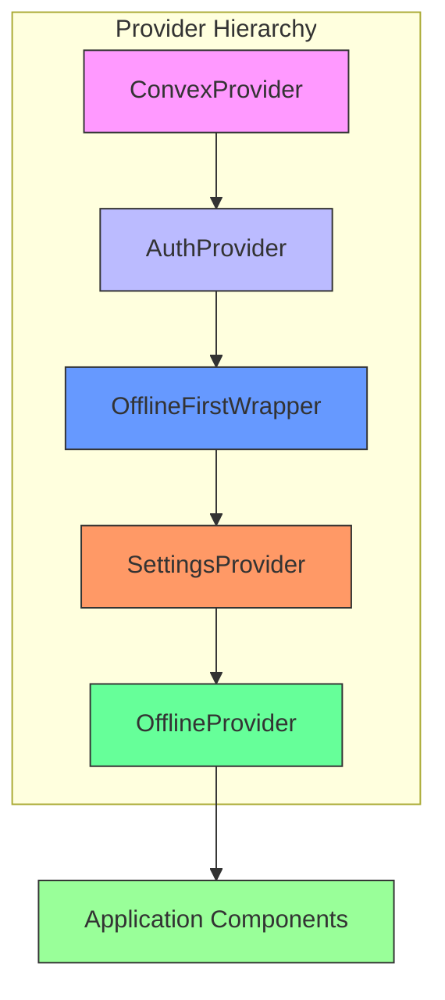
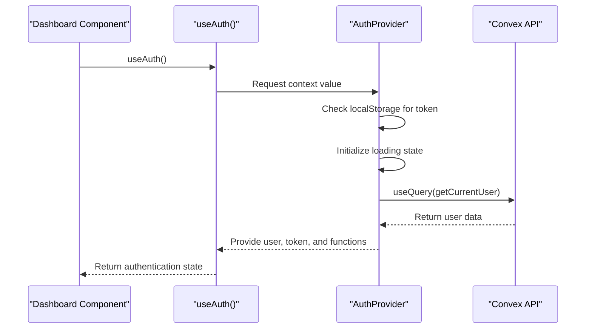
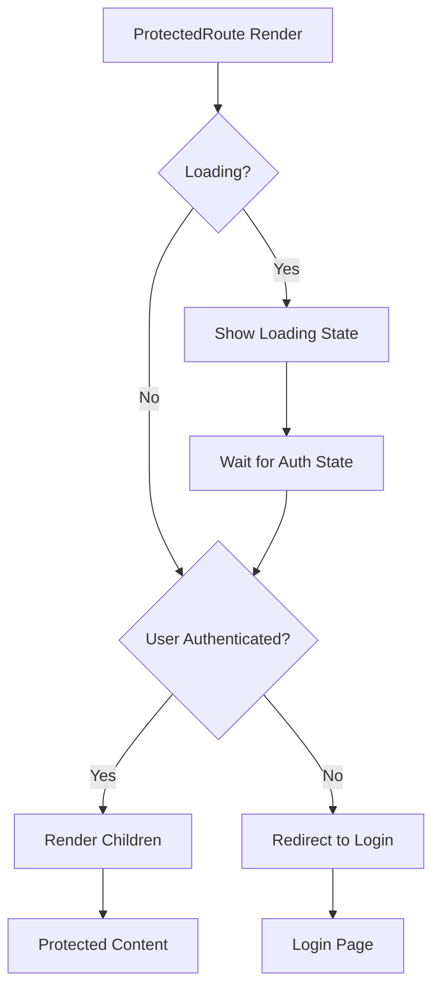
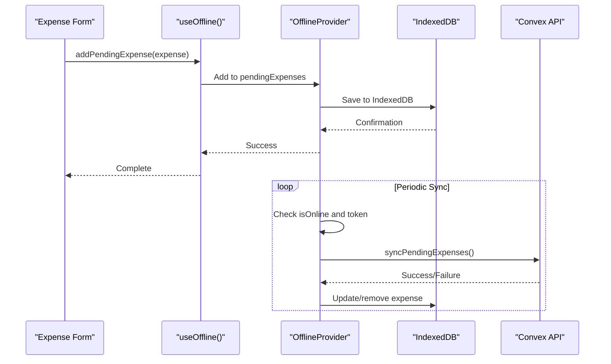
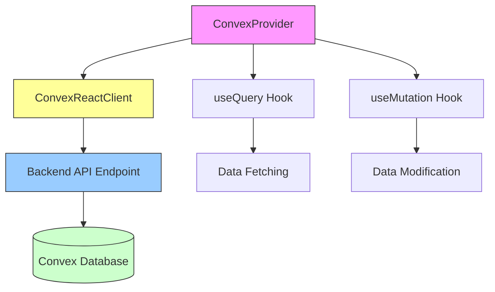
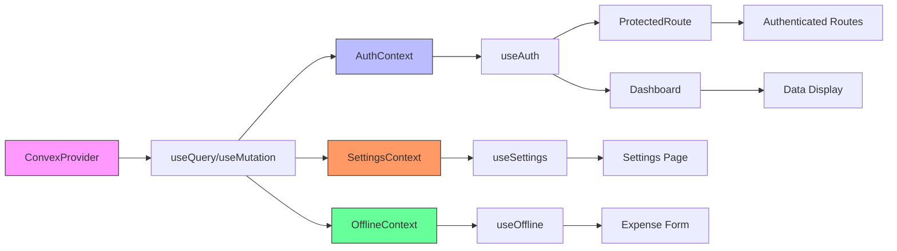
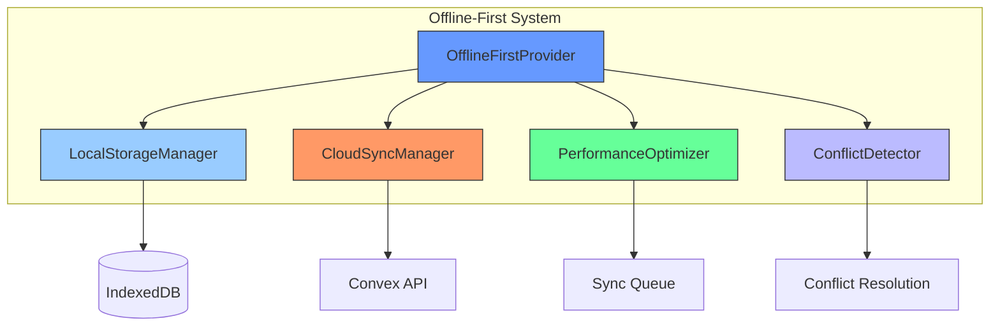

# Component Tree and Provider Hierarchy

<cite>
**Referenced Files in This Document**   
- [layout.tsx](file://src/app/layout.tsx#L1-L94) - *Updated with service worker registration and offline-first wrapper*
- [ServiceWorkerRegistration.tsx](file://src/components/ServiceWorkerRegistration.tsx#L1-L20) - *Newly added for service worker management*
- [OfflineFirstWrapper.tsx](file://src/providers/OfflineFirstWrapper.tsx#L1-L19) - *New wrapper component for offline-first functionality*
- [OfflineFirstProvider.tsx](file://src/providers/OfflineFirstProvider.tsx#L1-L326) - *Comprehensive offline-first implementation*
- [AuthContext.tsx](file://src/contexts/AuthContext.tsx#L1-L132) - *Provides authentication context for offline initialization*
- [SettingsContext.tsx](file://src/contexts/SettingsContext.tsx#L1-L59)
- [OfflineContext.tsx](file://src/contexts/OfflineContext.tsx#L1-L171)
- [ProtectedRoute.tsx](file://src/components/ProtectedRoute.tsx#L1-L35)
</cite>

## Update Summary
**Changes Made**   
- Updated Root Layout section to reflect new service worker registration and offline-first provider structure
- Added comprehensive documentation for OfflineFirstProvider and OfflineFirstWrapper components
- Enhanced provider dependency explanation with new offline-first architecture
- Added new diagram showing the complete provider hierarchy including offline-first components
- Updated section sources to reflect all analyzed files
- Added detailed explanation of service worker integration and background sync capabilities

## Table of Contents
1. [Component Tree and Provider Hierarchy](#component-tree-and-provider-hierarchy)
2. [Root Layout and Provider Composition](#root-layout-and-provider-composition)
3. [Provider Dependency Order and Significance](#provider-dependency-order-and-significance)
4. [AuthContext and Authentication Flow](#authcontext-and-authentication-flow)
5. [ProtectedRoute and Conditional Rendering](#protectedroute-and-conditional-rendering)
6. [SettingsContext and User Preferences](#settingscontext-and-user-preferences)
7. [OfflineContext and Network Resilience](#offlinecontext-and-network-resilience)
8. [ConvexProvider and Backend Integration](#convexprovider-and-backend-integration)
9. [Data Flow and Hook Usage](#data-flow-and-hook-usage)
10. [Best Practices for Extending Provider Structure](#best-practices-for-extending-provider-structure)
11. [OfflineFirstProvider and Offline-First Architecture](#offlinefirstprovider-and-offline-first-architecture)

## Root Layout and Provider Composition

The `RootLayout` component in `layout.tsx` serves as the foundation of the application's component tree, wrapping all child components with essential context providers. This hierarchical composition enables global state access across the entire Expense-Tracker---Warp application.

The layout establishes a nested provider structure that ensures proper dependency resolution and state availability. Each provider is responsible for managing a specific aspect of the application's state, including authentication, user settings, offline capabilities, and Convex database connectivity.

```tsx
export default function RootLayout({
  children,
}: Readonly<{
  children: React.ReactNode;
}>) {
  return (
    <html lang="en">
      <head>
        <link rel="icon" type="image/png" sizes="16x16" href="/favicon-16x16.png" />
        <link rel="icon" type="image/png" sizes="32x32" href="/favicon-32x32.png" />
        <link rel="apple-touch-icon" sizes="180x180" href="/apple-touch-icon.png" />
        <meta name="apple-mobile-web-app-capable" content="yes" />
        <meta name="apple-mobile-web-app-status-bar-style" content="black-translucent" />
        <meta name="apple-mobile-web-app-title" content="Expense Tracker" />
      </head>
      <body className={`${poppins.variable} ${geistMono.variable} font-sans antialiased`}>
        <ServiceWorkerRegistration />
        <ConvexProvider>
          <AuthProvider>
            <OfflineFirstWrapper>
              <SettingsProvider>
                <OfflineProvider>
                  {children}
                  <div id="modal-root"></div>
                  <EnhancedNetworkStatusIndicator />
                  <OfflineModeIndicator />
                  <Toaster position="top-center" />
                </OfflineProvider>
              </SettingsProvider>
            </OfflineFirstWrapper>
          </AuthProvider>
        </ConvexProvider>
        <Analytics />
        <SpeedInsights />
      </body>
    </html>
  );
}
```

This structure ensures that all components rendered within the application have access to the global state managed by these providers, eliminating the need for prop drilling and enabling efficient state management. The recent update integrates service worker registration at the root level, enabling progressive web app capabilities and background synchronization.

**Section sources**
- [layout.tsx](file://src/app/layout.tsx#L44-L94)
- [ServiceWorkerRegistration.tsx](file://src/components/ServiceWorkerRegistration.tsx#L1-L20)

## Provider Dependency Order and Significance

The order of provider nesting in the `RootLayout` is critical for proper dependency resolution and application functionality. The hierarchy follows a specific sequence where each inner provider may depend on state or functionality provided by outer providers.



**Diagram sources**
- [layout.tsx](file://src/app/layout.tsx#L44-L94)
- [OfflineFirstWrapper.tsx](file://src/providers/OfflineFirstWrapper.tsx#L1-L19)

**Section sources**
- [layout.tsx](file://src/app/layout.tsx#L44-L94)

The nesting order is significant because:

1. **ConvexProvider** must be outermost as it initializes the Convex client connection, which is required by all Convex-dependent hooks used in other providers
2. **AuthProvider** depends on the Convex client to make authenticated API calls for user management
3. **OfflineFirstWrapper** requires the authenticated user ID to initialize the offline-first system with user-specific data isolation
4. **SettingsProvider** requires the authentication token from AuthContext to fetch user-specific settings
5. **OfflineProvider** needs both the authentication token and Convex client to sync offline data when connectivity is restored

This dependency chain ensures that each provider has access to the necessary resources when it initializes, preventing race conditions and undefined state errors. The addition of the OfflineFirstWrapper enables user-specific offline data management, ensuring data isolation between different users.

## AuthContext and Authentication Flow

The `AuthContext` provides authentication state and functionality to all components in the application. It manages user login, registration, logout, and token persistence using localStorage, with enhanced timeout management to prevent infinite loading states.



**Diagram sources**
- [AuthContext.tsx](file://src/contexts/AuthContext.tsx#L1-L132)

**Section sources**
- [AuthContext.tsx](file://src/contexts/AuthContext.tsx#L1-L132)

Key aspects of the authentication implementation:

- **Token Management**: Authentication tokens are stored in localStorage for persistence across sessions
- **State Synchronization**: The context synchronizes authentication state between UI components and the backend
- **Loading State**: A loading state is maintained to handle the initial token check and user data retrieval, with a 15-second timeout to prevent infinite loading
- **Error Handling**: Login and registration functions include error handling for authentication failures
- **Timeout Management**: Implements cleanup logic with `clearTimeout` to prevent memory leaks and ensure proper state management

The `useAuth` custom hook provides a clean interface for components to access authentication state and perform authentication operations. The updated implementation includes timeout management that clears the authentication token if the user query takes longer than 15 seconds, preventing infinite loading states during mobile keyboard interactions or network latency.

## ProtectedRoute and Conditional Rendering

The `ProtectedRoute` component leverages `AuthContext` to conditionally render authenticated routes, ensuring that only authenticated users can access protected pages.

```tsx
export function ProtectedRoute({ children }: ProtectedRouteProps) {
  const { user, loading } = useAuth();
  const router = useRouter();

  useEffect(() => {
    if (!loading && !user) {
      router.replace("/login");
    }
  }, [user, loading, router]);

  if (loading) {
    return (
      <div className="min-h-screen flex items-center justify-center">
        <div className="text-lg">Loading...</div>
      </div>
    );
  }

  if (!user) {
    return null;
  }

  return <>{children}</>;
}
```

This implementation follows a three-state pattern:

1. **Loading**: Display a loading indicator while authentication state is being determined
2. **Authenticated**: Render the protected content when a user is logged in
3. **Unauthenticated**: Redirect to the login page when no user is authenticated



**Diagram sources**
- [ProtectedRoute.tsx](file://src/components/ProtectedRoute.tsx#L1-L35)

**Section sources**
- [ProtectedRoute.tsx](file://src/components/ProtectedRoute.tsx#L1-L35)

The component uses Next.js routing to redirect unauthenticated users to the login page, providing a seamless authentication experience. The loading state is now more resilient due to the timeout mechanism implemented in AuthContext, ensuring users are not stuck in an infinite loading state during mobile interactions.

## SettingsContext and User Preferences

The `SettingsContext` manages user-specific preferences such as currency and calendar settings. It depends on `AuthContext` to access the authentication token required for API calls.

```mermaid
classDiagram
class SettingsContextType {
+settings : Doc<"userSettings"> | null | undefined
+updateSettings : (args : { currency? : Currency; calendar? : Calendar }) => Promise<void>
+loading : boolean
}
class SettingsProvider {
-token : string
-settings : QueryResult
-updateMutation : Mutation
+updateSettings(args) : Promise<void>
}
class useSettings {
+settings : Doc<"userSettings"> | null | undefined
+updateSettings : (args : { currency? : Currency; calendar? : Calendar }) => Promise<void>
+loading : boolean
}
SettingsProvider --> SettingsContextType : "provides"
useSettings --> SettingsContext : "consumes"
SettingsProvider --> "Convex API" : "uses"
SettingsProvider --> AuthContext : "depends on"
```

**Diagram sources**
- [SettingsContext.tsx](file://src/contexts/SettingsContext.tsx#L1-L59)

**Section sources**
- [SettingsContext.tsx](file://src/contexts/SettingsContext.tsx#L1-L59)

Key features of the settings implementation:

- **Token Dependency**: Uses the authentication token from `useAuth()` to make authenticated API calls
- **Automatic Loading**: Fetches user settings when the provider is mounted and token is available
- **Type Safety**: Leverages Convex-generated types for type-safe settings management
- **Error Handling**: Includes error handling for failed settings updates

The context exposes an `updateSettings` function that allows components to modify user preferences, which are then persisted to the backend via Convex mutations.

## OfflineContext and Network Resilience

The `OfflineContext` provides offline capabilities by managing a queue of pending expenses that can be synced when connectivity is restored. It uses `localforage` to persist pending expenses in IndexedDB.



**Diagram sources**
- [OfflineContext.tsx](file://src/contexts/OfflineContext.tsx#L1-L171)

**Section sources**
- [OfflineContext.tsx](file://src/contexts/OfflineContext.tsx#L1-L171)

The offline functionality includes:

- **Network Detection**: Listens to browser online/offline events to detect connectivity changes
- **Persistent Storage**: Uses `localforage` to store pending expenses in IndexedDB for durability
- **Automatic Syncing**: Attempts to sync pending expenses when connectivity is restored
- **Retry Mechanism**: Provides a way to retry failed expense submissions
- **Status Tracking**: Maintains status for each pending expense (pending, syncing, synced, failed)

This implementation ensures that users can continue to add expenses even when offline, with data being automatically synced when the connection is restored.

## ConvexProvider and Backend Integration

The `ConvexProvider` initializes the Convex client connection and makes it available to all components through React context. This is the foundation for all backend interactions in the application.

```tsx
const convex = new ConvexReactClient(process.env.NEXT_PUBLIC_CONVEX_URL!);

export function ConvexProvider({ children }: { children: ReactNode }) {
  return (
    <ConvexReactProvider client={convex}>
      {children}
    </ConvexReactProvider>
  );
}
```



**Diagram sources**
- [ConvexProvider.tsx](file://src/providers/ConvexProvider.tsx#L1-L15)

**Section sources**
- [ConvexProvider.tsx](file://src/providers/ConvexProvider.tsx#L1-L15)

Key aspects of the Convex integration:

- **Client Initialization**: Creates a singleton `ConvexReactClient` instance with the backend URL from environment variables
- **Context Provision**: Wraps children with `ConvexReactProvider` to make the client available via React context
- **Environment Configuration**: Uses `NEXT_PUBLIC_CONVEX_URL` environment variable for backend connectivity
- **Global Availability**: Ensures all components have access to Convex hooks like `useQuery` and `useMutation`

This provider must be outermost in the hierarchy because all other providers and components that use Convex hooks depend on the client being available in context.

## Data Flow and Hook Usage

The application demonstrates a clear data flow pattern where components consume context through custom hooks, which in turn use Convex hooks to interact with the backend.



**Diagram sources**
- [layout.tsx](file://src/app/layout.tsx#L44-L94)
- [useExpenseData.ts](file://src/features/dashboard/hooks/useExpenseData.ts#L1-L86)

**Section sources**
- [useExpenseData.ts](file://src/features/dashboard/hooks/useExpenseData.ts#L1-L86)

An example of this pattern can be seen in the `useExpenseData` hook:

```tsx
export function useExpenseData(token: string | null) {
  const result = useQuery(
    api.expenses.getExpensesByDateRange,
    token
      ? {
          token,
          startDate: startOfMonth(currentDate).getTime(),
          endDate: endOfMonth(currentDate).getTime(),
          key,
        }
      : "skip"
  );
  
  // Process and return data
  return {
    currentDate,
    expenses,
    monthlyData,
    isLoading,
    goToPreviousMonth,
    goToNextMonth,
    refetchExpenses,
  };
}
```

This hook:
- Accepts a token from `useAuth()` as a dependency
- Uses `useQuery` to fetch expenses for the current month
- Processes the raw data into a structured format
- Returns navigation and refresh functions
- Handles loading states appropriately

## Best Practices for Extending Provider Structure

When extending the provider structure with new providers, follow these best practices to maintain code quality and avoid common pitfalls:

### Provider Scoping Guidelines
- **Minimize Scope**: Only wrap components that actually need access to the provider's state
- **Avoid Over-nesting**: Keep the provider hierarchy as flat as possible while maintaining necessary dependencies
- **Consider Performance**: Providers that cause frequent re-renders should be placed as deeply as possible in the tree

### Dependency Management
- **Explicit Dependencies**: Clearly document dependencies between providers in code comments
- **Circular Dependency Prevention**: Ensure no circular dependencies exist between providers
- **Initialization Order**: Place providers with external dependencies (like API clients) outermost

### Error Handling and Resilience
- **Graceful Degradation**: Implement fallback behavior when providers fail to initialize
- **Error Boundaries**: Consider wrapping providers with error boundaries to prevent app crashes
- **Loading States**: Always provide clear loading states during initialization

### Example: Adding a New Analytics Provider
```tsx
// Correct implementation
<ConvexProvider>
  <AuthProvider>
    <SettingsProvider>
      <OfflineProvider>
        <AnalyticsProvider> {/* New provider */}
          {children}
        </AnalyticsProvider>
      </OfflineProvider>
    </SettingsProvider>
  </AuthProvider>
</ConvexProvider>

// analyticsProvider.tsx
export function AnalyticsProvider({ children }: { children: ReactNode }) {
  const { user } = useAuth(); // Depends on AuthProvider
  const [analyticsClient] = useState(() => new AnalyticsClient());
  
  useEffect(() => {
    if (user) {
      analyticsClient.identify(user._id);
    }
  }, [user]);
  
  return (
    <AnalyticsContext.Provider value={analyticsClient}>
      {children}
    </AnalyticsContext.Provider>
  );
}
```

Following these practices ensures that the provider structure remains maintainable, performant, and scalable as the application grows.

**Section sources**
- [layout.tsx](file://src/app/layout.tsx#L44-L94)
- [AuthContext.tsx](file://src/contexts/AuthContext.tsx#L1-L132)
- [ConvexProvider.tsx](file://src/providers/ConvexProvider.tsx#L1-L15)

## OfflineFirstProvider and Offline-First Architecture

The `OfflineFirstProvider` implements a comprehensive offline-first architecture that enables the application to function seamlessly regardless of network connectivity. This provider manages local data storage, synchronization with the cloud, conflict detection, and performance optimization.



**Diagram sources**
- [OfflineFirstProvider.tsx](file://src/providers/OfflineFirstProvider.tsx#L1-L326)
- [OfflineFirstWrapper.tsx](file://src/providers/OfflineFirstWrapper.tsx#L1-L19)

**Section sources**
- [OfflineFirstProvider.tsx](file://src/providers/OfflineFirstProvider.tsx#L1-L326)
- [OfflineFirstWrapper.tsx](file://src/providers/OfflineFirstWrapper.tsx#L1-L19)

Key components of the offline-first architecture:

- **LocalStorageManager**: Manages local data persistence using IndexedDB with user-specific data isolation
- **CloudSyncManager**: Handles synchronization between local storage and the Convex backend with retry mechanisms
- **PerformanceOptimizer**: Optimizes sync operations with configurable intervals and caching strategies
- **ConflictDetector**: Resolves data conflicts that may arise from offline edits and concurrent modifications

The `OfflineFirstWrapper` component serves as a bridge between authentication and offline functionality, ensuring that the offline system is initialized with the current user's ID:

```tsx
export function OfflineFirstWrapper({ children }: OfflineFirstWrapperProps) {
  const { user } = useAuth();
  
  return (
    <OfflineFirstProvider userId={user?._id}>
      {children}
    </OfflineFirstProvider>
  );
}
```

This architecture enables several key features:

1. **Background Sync**: Service worker integration allows for background synchronization even when the app is not active
2. **Automatic Conflict Resolution**: The conflict detector identifies and resolves data conflicts when multiple devices modify the same data
3. **Performance Optimization**: The performance optimizer manages sync frequency and query caching to minimize battery and data usage
4. **User-Specific Data Isolation**: Each user's offline data is isolated and encrypted, ensuring privacy and security

The service worker registration in the root layout enables progressive web app capabilities:

```tsx
export function ServiceWorkerRegistration() {
  useEffect(() => {
    if ('serviceWorker' in navigator && process.env.NODE_ENV === 'production') {
      navigator.serviceWorker
        .register('/sw.js')
        .then((registration) => {
          console.log('SW registered: ', registration);
        })
        .catch((registrationError) => {
          console.log('SW registration failed: ', registrationError);
        });
    }
  }, []);

  return null;
}
```

This implementation ensures that the application can function as a progressive web app with offline capabilities, background synchronization, and reliable data management.