# Data Flow and Client-Side Operations

<cite>
**Referenced Files in This Document**   
- [useExpenseActions.ts](file://src/features/dashboard/hooks/useExpenseActions.ts)
- [useExpenseData.ts](file://src/features/dashboard/hooks/useExpenseData.ts)
- [OfflineContext.tsx](file://src/contexts/OfflineContext.tsx)
- [AuthContext.tsx](file://src/contexts/AuthContext.tsx)
- [ProtectedRoute.tsx](file://src/components/ProtectedRoute.tsx)
- [SmartSelectInput.tsx](file://src/components/SmartSelectInput.tsx)
- [expenses.ts](file://convex/expenses.ts)
- [page.tsx](file://src/app/expenses/page.tsx)
- [OfflineFirstProvider.tsx](file://src/providers/OfflineFirstProvider.tsx)
</cite>

## Update Summary
**Changes Made**   
- Updated Authentication and Protected Access section to reflect centralized authentication state management in ProtectedRoute
- Added new Offline Capability Detection section to document useOfflineCapability hook
- Updated Client-Side Data Flow Overview with new local-first architecture details
- Enhanced Sequence Diagrams with offline capability checks
- Updated Debugging Strategies with new offline initialization issues
- Removed references to useOfflineQueue as it has been superseded by OfflineFirstProvider

## Table of Contents
1. [Introduction](#introduction)
2. [Client-Side Data Flow Overview](#client-side-data-flow-overview)
3. [Form Input and State Management](#form-input-and-state-management)
4. [Expense Creation: From Input to Mutation](#expense-create-from-input-to-mutation)
5. [Real-Time Data Fetching and Caching](#real-time-data-fetching-and-caching)
6. [Error Handling and Optimistic Updates](#error-handling-and-optimistic-updates)
7. [Offline Operations and Synchronization](#offline-operations-and-synchronization)
8. [Authentication and Protected Access](#authentication-and-protected-access)
9. [Offline Capability Detection](#offline-capability-detection)
10. [Sequence Diagrams](#sequence-diagrams)
11. [Debugging Strategies](#debugging-strategies)

## Introduction
This document provides a comprehensive analysis of the client-side data flow in the Expense Tracker application, focusing on the lifecycle of expense creation from user interaction to persistence. The system leverages Convex for real-time data synchronization and implements robust offline capabilities using IndexedDB via LocalStorageManager. The architecture incorporates React hooks for state management, context providers for global state, and a well-defined separation of concerns between UI components and business logic. This documentation traces the complete journey of an expense record through the application, including form input handling, mutation execution, data fetching, error management, and offline synchronization.

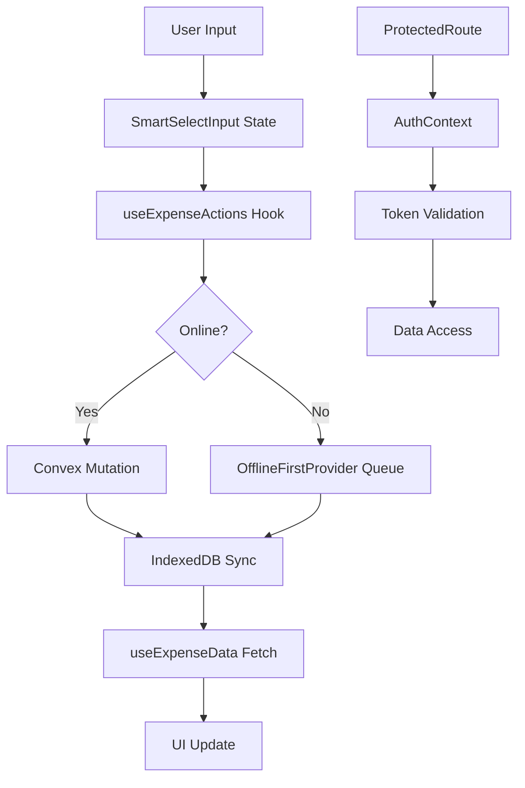

**Diagram sources**
- [SmartSelectInput.tsx](file://src/components/SmartSelectInput.tsx)
- [useExpenseActions.ts](file://src/features/dashboard/hooks/useExpenseActions.ts)
- [OfflineFirstProvider.tsx](file://src/providers/OfflineFirstProvider.tsx)
- [useExpenseData.ts](file://src/features/dashboard/hooks/useExpenseData.ts)
- [ProtectedRoute.tsx](file://src/components/ProtectedRoute.tsx)
- [AuthContext.tsx](file://src/contexts/AuthContext.tsx)

**Section sources**
- [SmartSelectInput.tsx](file://src/components/SmartSelectInput.tsx)
- [useExpenseActions.ts](file://src/features/dashboard/hooks/useExpenseActions.ts)
- [useExpenseData.ts](file://src/features/dashboard/hooks/useExpenseData.ts)
- [OfflineFirstProvider.tsx](file://src/providers/OfflineFirstProvider.tsx)
- [ProtectedRoute.tsx](file://src/components/ProtectedRoute.tsx)

## Client-Side Data Flow Overview
The client-side data flow in the Expense Tracker application follows a structured pattern from user interaction to data persistence. When a user creates an expense, the input flows through a SmartSelectInput component that manages multi-select state for categories and recipients. This state is then processed by the useExpenseActions hook, which coordinates with Convex mutations for online persistence or the OfflineFirstProvider for offline queuing. The useExpenseData hook handles data retrieval through Convex's real-time queries, automatically caching and updating expense records. The system employs optimistic updates for responsive UI feedback and implements comprehensive error handling throughout the data flow. Authentication is enforced via ProtectedRoute components that verify user sessions before allowing data access, with enhanced offline capability detection through the useOfflineCapability hook.

**Diagram sources**
- [SmartSelectInput.tsx](file://src/components/SmartSelectInput.tsx)
- [useExpenseActions.ts](file://src/features/dashboard/hooks/useExpenseActions.ts)
- [OfflineFirstProvider.tsx](file://src/providers/OfflineFirstProvider.tsx)
- [useExpenseData.ts](file://src/features/dashboard/hooks/useExpenseData.ts)
- [ProtectedRoute.tsx](file://src/components/ProtectedRoute.tsx)
- [AuthContext.tsx](file://src/contexts/AuthContext.tsx)

**Section sources**
- [SmartSelectInput.tsx](file://src/components/SmartSelectInput.tsx)
- [useExpenseActions.ts](file://src/features/dashboard/hooks/useExpenseActions.ts)
- [useExpenseData.ts](file://src/features/dashboard/hooks/useExpenseData.ts)
- [OfflineFirstProvider.tsx](file://src/providers/OfflineFirstProvider.tsx)
- [ProtectedRoute.tsx](file://src/components/ProtectedRoute.tsx)

## Form Input and State Management
The SmartSelectInput component serves as the primary interface for expense data entry, providing a sophisticated multi-select input with autocomplete and dynamic creation capabilities. It maintains internal state for the current input value, suggestions, and selected items, implementing debounced search to minimize backend requests. The component supports both single and multiple selection modes and allows users to create new entries directly from the input field. When a user types in the input field, the component triggers a debounced search that fetches suggestions from the backend based on the current query. Selected items are displayed as removable chips above the input field, and keyboard navigation is fully supported for accessibility.

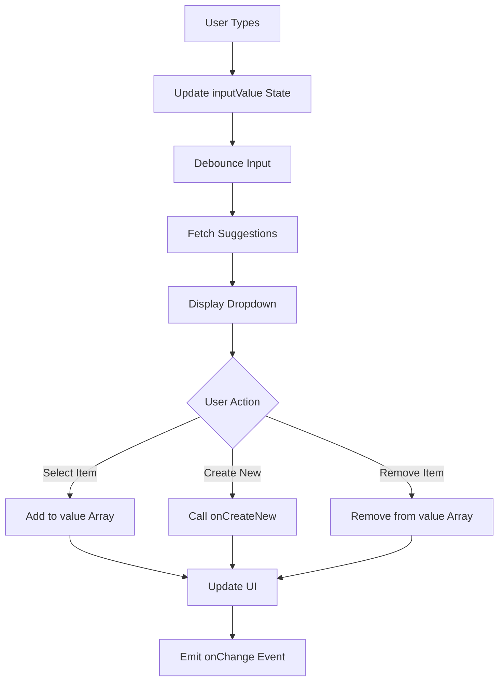

**Diagram sources**
- [SmartSelectInput.tsx](file://src/components/SmartSelectInput.tsx#L38-L237)

**Section sources**
- [SmartSelectInput.tsx](file://src/components/SmartSelectInput.tsx)

## Expense Creation: From Input to Mutation
The expense creation process begins with the expenses page component, which integrates the SmartSelectInput with the useExpenseActions hook and Convex mutations. When the user submits the expense form, the handleSubmit function validates the input data and prepares it for submission. The amount is converted to a floating-point number, and the date is transformed into a Unix timestamp. The form data is then passed to the createExpenseMutation, which sends the data to the Convex backend. If the user is offline, the OfflineFirstProvider intercepts the mutation and queues the expense for later synchronization. The system provides immediate feedback through toast notifications, indicating success or failure of the operation.

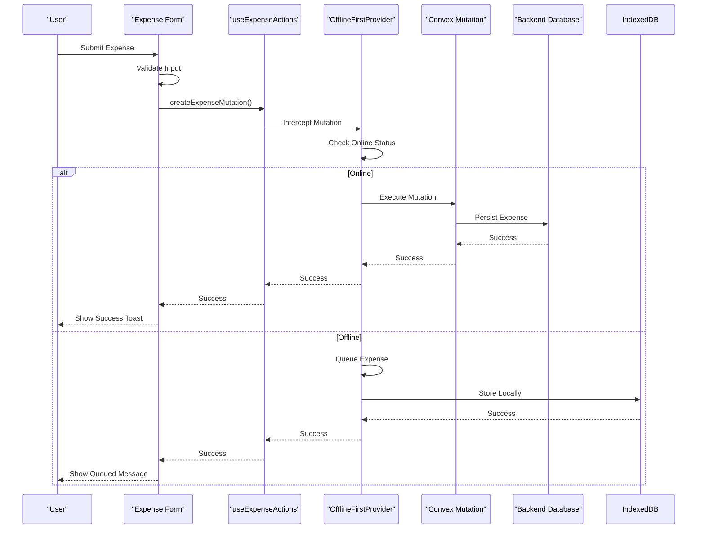

**Diagram sources**
- [page.tsx](file://src/app/expenses/page.tsx#L152-L351)
- [useExpenseActions.ts](file://src/features/dashboard/hooks/useExpenseActions.ts)
- [OfflineFirstProvider.tsx](file://src/providers/OfflineFirstProvider.tsx)

**Section sources**
- [page.tsx](file://src/app/expenses/page.tsx)
- [useExpenseActions.ts](file://src/features/dashboard/hooks/useExpenseActions.ts)
- [OfflineFirstProvider.tsx](file://src/providers/OfflineFirstProvider.tsx)

## Real-Time Data Fetching and Caching
The useExpenseData hook implements a robust data fetching mechanism that leverages Convex's real-time querying capabilities to retrieve and cache expense records. It uses the useQuery hook from Convex to subscribe to expense data for the current month, automatically updating when new data becomes available. The hook manages pagination through month navigation functions (goToPreviousMonth and goToNextMonth) that update the currentDate state and trigger new queries. Data is processed into a structured format that includes monthly summaries, category totals, and daily spending patterns. The hook also implements a refetch mechanism using a key-based cache busting strategy to force data refresh when needed.

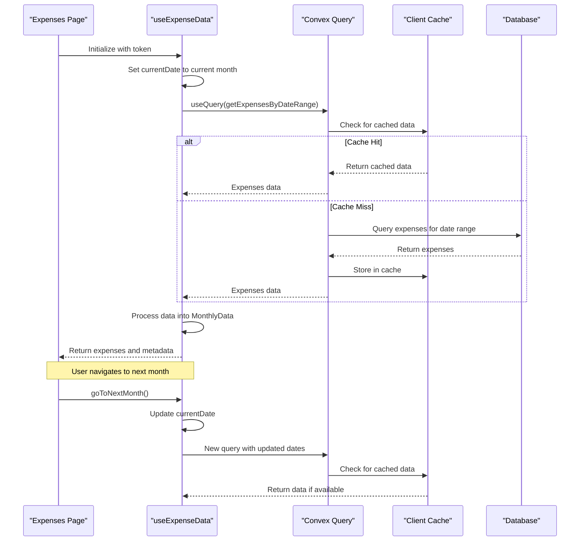

**Diagram sources**
- [useExpenseData.ts](file://src/features/dashboard/hooks/useExpenseData.ts#L0-L86)

**Section sources**
- [useExpenseData.ts](file://src/features/dashboard/hooks/useExpenseData.ts)

## Error Handling and Optimistic Updates
The application implements comprehensive error handling throughout the data flow, with specific strategies for different operation types. When creating an expense, the handleSubmit function wraps the mutation in a try-catch block to capture any errors from the Convex backend or network layer. Errors are displayed to the user through toast notifications with descriptive messages. The system employs optimistic updates to provide immediate feedback, assuming successful operations will complete. If an error occurs, the UI state is corrected, and the user is notified. The useExpenseActions hook maintains a selectedExpense state that enables optimistic rendering of edited expenses before they are persisted.

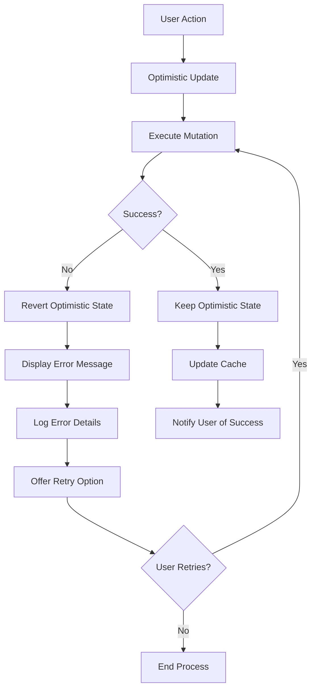

**Diagram sources**
- [page.tsx](file://src/app/expenses/page.tsx#L152-L351)
- [useExpenseActions.ts](file://src/features/dashboard/hooks/useExpenseActions.ts)

**Section sources**
- [page.tsx](file://src/app/expenses/page.tsx)
- [useExpenseActions.ts](file://src/features/dashboard/hooks/useExpenseActions.ts)

## Offline Operations and Synchronization
The OfflineFirstProvider provides a sophisticated offline capability that allows users to create expenses even when disconnected from the network. It uses LocalStorageManager to store pending expenses in IndexedDB and listens to browser online/offline events to detect connectivity changes. When a user creates an expense while offline, the system stores the expense in the pending operations queue and saves it to IndexedDB. The syncPendingExpenses function automatically runs when connectivity is restored, attempting to sync all pending expenses with the Convex backend. Failed expenses remain in the queue for manual retry through the retryFailedExpense function.

The system implements a comprehensive local-first architecture with background synchronization, conflict detection, and performance optimization. The LocalStorageManager handles all local data operations, while the CloudSyncManager manages cloud synchronization with retry mechanisms. The ConflictDetector identifies data conflicts, and the PerformanceOptimizer handles background sync and performance optimizations.

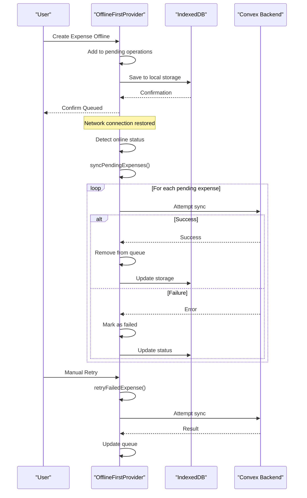

**Diagram sources**
- [OfflineFirstProvider.tsx](file://src/providers/OfflineFirstProvider.tsx#L0-L325)

**Section sources**
- [OfflineFirstProvider.tsx](file://src/providers/OfflineFirstProvider.tsx)

## Authentication and Protected Access
The ProtectedRoute component ensures that only authenticated users can access expense data by verifying the user's authentication status through the AuthContext. When a protected route is accessed, the component checks for a valid user session. If no user is authenticated and loading is complete, the user is redirected to the login page. The AuthContext manages the authentication state by storing the authentication token in localStorage and providing login, registration, and logout functionality. The context also handles token persistence across page reloads by loading the token from localStorage on initialization.

The ProtectedRoute has been enhanced with centralized authentication state management and offline capability checks. It now uses the useOfflineCapability hook to determine if the application can function offline, allowing access to protected routes even when offline if local data is available. The component implements a single loading screen during initialization and handles edge cases such as having a token but no user data due to network issues.

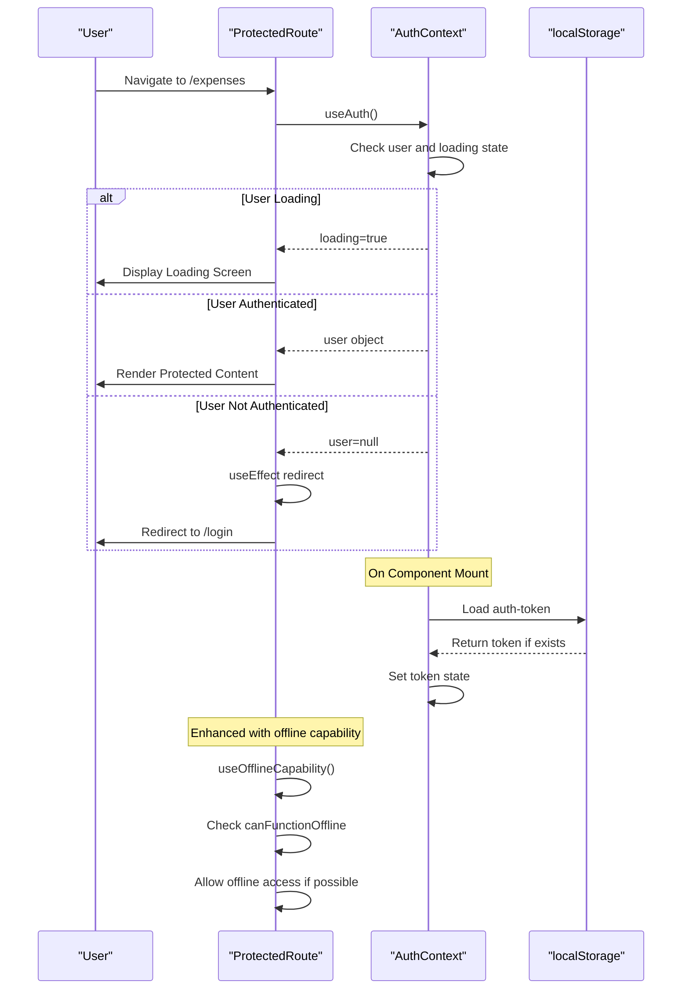

**Diagram sources**
- [ProtectedRoute.tsx](file://src/components/ProtectedRoute.tsx#L0-L97)
- [AuthContext.tsx](file://src/contexts/AuthContext.tsx#L0-L131)

**Section sources**
- [ProtectedRoute.tsx](file://src/components/ProtectedRoute.tsx)
- [AuthContext.tsx](file://src/contexts/AuthContext.tsx)

## Offline Capability Detection
The OfflineFirstProvider introduces a new capability detection system through the useOfflineCapability hook, which determines whether the application can function offline with local data. This hook checks the initialization status of the offline system and the availability of the localStorageManager to determine offline functionality. The ProtectedRoute component uses this capability to allow access to protected routes even when offline, as long as local data is available.

The useOfflineCapability hook returns an object with several properties:
- **canFunctionOffline**: Indicates whether the application can function with local data
- **isInitialized**: Indicates whether the offline system has been initialized
- **isOnline**: Current network connectivity status
- **shouldShowOfflineMessage**: Whether to show an offline message to the user
- **isFullyFunctional**: Whether the application is fully functional (online or capable offline)

This capability detection system enables a more sophisticated offline experience, allowing users to access their financial data even without internet connectivity.

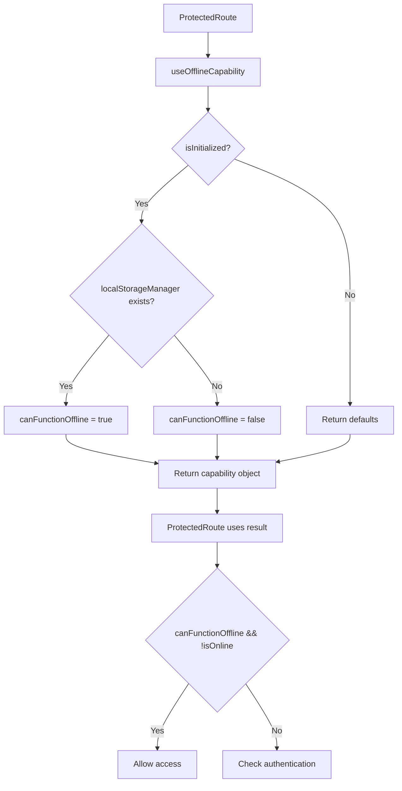

**Diagram sources**
- [OfflineFirstProvider.tsx](file://src/providers/OfflineFirstProvider.tsx#L297-L325)
- [ProtectedRoute.tsx](file://src/components/ProtectedRoute.tsx#L11-L97)

**Section sources**
- [OfflineFirstProvider.tsx](file://src/providers/OfflineFirstProvider.tsx)
- [ProtectedRoute.tsx](file://src/components/ProtectedRoute.tsx)

## Sequence Diagrams
### Online Expense Creation Flow
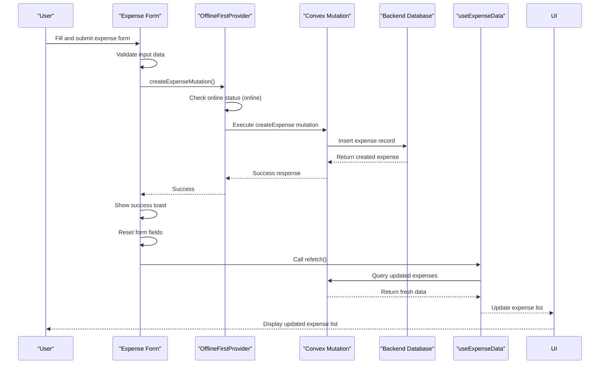

**Diagram sources**
- [page.tsx](file://src/app/expenses/page.tsx)
- [OfflineFirstProvider.tsx](file://src/providers/OfflineFirstProvider.tsx)
- [useExpenseData.ts](file://src/features/dashboard/hooks/useExpenseData.ts)

### Offline Expense Creation and Sync Flow
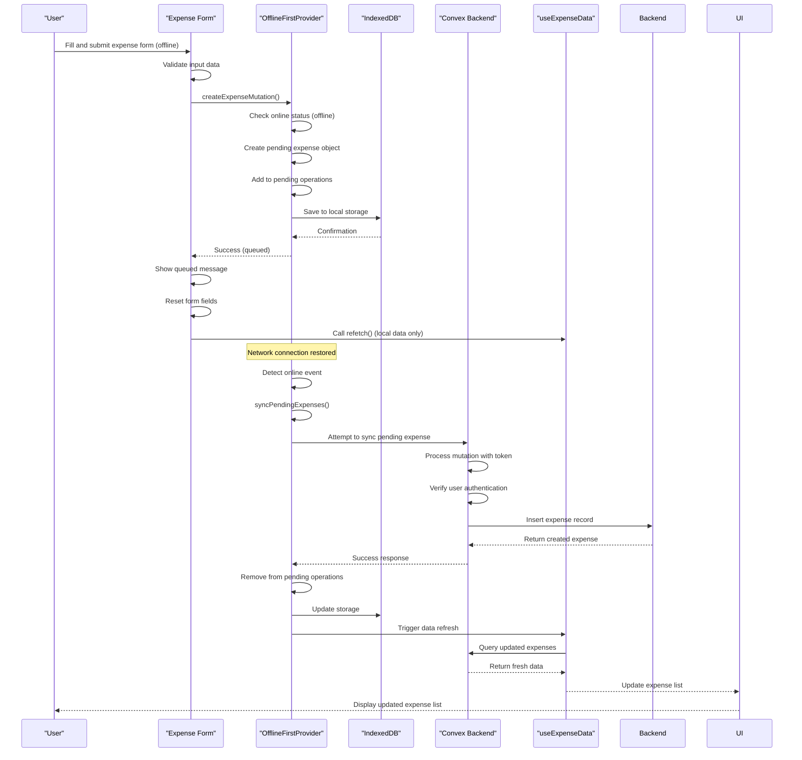

**Diagram sources**
- [OfflineFirstProvider.tsx](file://src/providers/OfflineFirstProvider.tsx)
- [page.tsx](file://src/app/expenses/page.tsx)
- [useExpenseData.ts](file://src/features/dashboard/hooks/useExpenseData.ts)

### Authentication with Offline Capability Flow
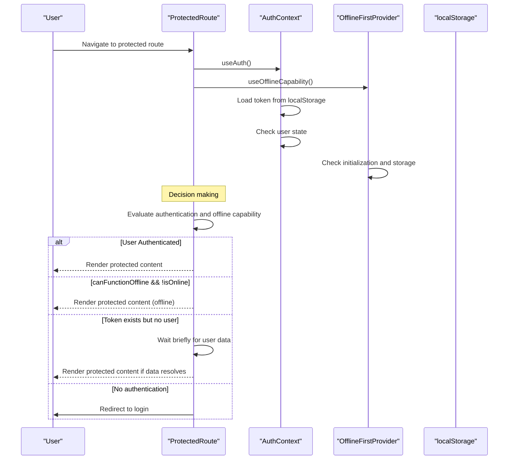

**Diagram sources**
- [ProtectedRoute.tsx](file://src/components/ProtectedRoute.tsx#L11-L97)
- [AuthContext.tsx](file://src/contexts/AuthContext.tsx#L0-L131)
- [OfflineFirstProvider.tsx](file://src/providers/OfflineFirstProvider.tsx#L297-L325)

## Debugging Strategies
### Common Issues and Solutions
**Stale Data Issues**
- **Symptom**: Expense list does not update after creation
- **Diagnosis**: Check if refetch function is called after mutation
- **Solution**: Ensure refetch is triggered in handleSubmit success handler
- **Debug Steps**: 
  1. Verify useExpenseData hook receives updated data
  2. Check Convex query dependencies
  3. Confirm key-based cache busting is working

**Sync Conflicts**
- **Symptom**: Duplicate expenses appear after coming online
- **Diagnosis**: Multiple sync attempts or race conditions
- **Solution**: Implement unique identifiers and deduplication
- **Debug Steps**:
  1. Check pending operations state during sync
  2. Verify IndexedDB storage updates correctly
  3. Monitor network requests for duplicates

**Authentication Errors**
- **Symptom**: Unable to access protected routes
- **Diagnosis**: Token not persisted or expired
- **Solution**: Verify localStorage storage and token validation
- **Debug Steps**:
  1. Check localStorage for auth-token
  2. Verify token format and expiration
  3. Test login flow with network inspection

**Offline Initialization Issues**
- **Symptom**: Application hangs on loading screen
- **Diagnosis**: OfflineFirstProvider not initializing properly
- **Solution**: Check userId availability and LocalStorageManager initialization
- **Debug Steps**:
  1. Verify userId is passed to OfflineFirstProvider
  2. Check console for initialization errors
  3. Test with valid user credentials
  4. Monitor IndexedDB storage creation

**Offline Capability Detection**
- **Symptom**: Cannot access app offline despite having data
- **Diagnosis**: useOfflineCapability not detecting local storage
- **Solution**: Verify LocalStorageManager initialization
- **Debug Steps**:
  1. Check if localStorageManager is null in OfflineFirstContext
  2. Verify user ID is available during initialization
  3. Test LocalStorageManager functionality independently
  4. Monitor console for initialization errors

**Performance Optimization**
- **Issue**: Slow rendering with large expense datasets
- **Solution**: Implement virtualized lists and pagination
- **Monitoring**: Use React DevTools to identify re-renders
- **Optimization**: Memoize expensive calculations in useExpenseData

**Section sources**
- [useExpenseData.ts](file://src/features/dashboard/hooks/useExpenseData.ts)
- [OfflineFirstProvider.tsx](file://src/providers/OfflineFirstProvider.tsx)
- [ProtectedRoute.tsx](file://src/components/ProtectedRoute.tsx)
- [page.tsx](file://src/app/expenses/page.tsx)
- [AuthContext.tsx](file://src/contexts/AuthContext.tsx)