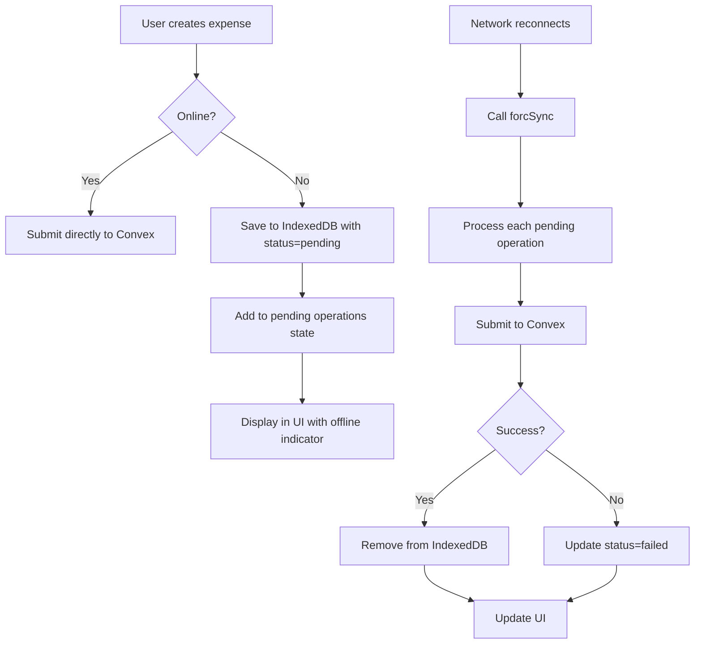

# Frontend Architecture

<cite>
**Referenced Files in This Document**   
- [layout.tsx](file://src/app/layout.tsx)
- [AuthContext.tsx](file://src/contexts/AuthContext.tsx) - *Updated in recent commit with 10-second timeout for authentication*
- [OfflineContext.tsx](file://src/contexts/OfflineContext.tsx) - *Updated in recent commit with comprehensive offline functionality*
- [SettingsContext.tsx](file://src/contexts/SettingsContext.tsx) - *Updated in recent commit with multi-language support*
- [ConvexProvider.tsx](file://src/providers/ConvexProvider.tsx)
- [ProtectedRoute.tsx](file://src/components/ProtectedRoute.tsx)
- [globals.css](file://src/app/globals.css)
- [TotalBalanceCard.tsx](file://src/features/dashboard/components/TotalBalanceCard/TotalBalanceCard.tsx)
- [DateFilterHeader.tsx](file://src/components/DateFilterHeader.tsx)
- [Button.tsx](file://src/components/Button.tsx)
- [Input.tsx](file://src/components/Input.tsx)
- [formatters.ts](file://src/lib/formatters.ts) - *Added language and calendar formatting support*
- [settings/page.tsx](file://src/app/settings/page.tsx) - *Implements language selection UI*
- [NetworkStatusIndicator.tsx](file://src/components/NetworkStatusIndicator.tsx) - *Added in recent commit for network status visualization*
- [ServiceWorkerRegistration.tsx](file://src/components/ServiceWorkerRegistration.tsx) - *Added in recent commit for PWA support*
- [manifest.json](file://public/manifest.json) - *Added in recent commit for PWA configuration*
- [OfflineFirstProvider.tsx](file://src/providers/OfflineFirstProvider.tsx) - *Added in recent commit for offline-first architecture*
- [OfflineFirstWrapper.tsx](file://src/providers/OfflineFirstWrapper.tsx) - *Added in recent commit for offline-first integration*
</cite>

## Update Summary
**Changes Made**   
- Updated Core Provider Hierarchy section to reflect the new OfflineFirstWrapper and OfflineFirstProvider integration
- Modified ProtectedRoute component behavior to use useOfflineCapability hook for offline detection
- Streamlined authentication flow with single loading screen in ProtectedRoute
- Updated diagram sources and section sources to reflect changes in layout.tsx and ProtectedRoute.tsx
- Added documentation for OfflineFirstProvider and OfflineFirstWrapper components
- Removed references to outdated OfflineProvider in favor of new offline-first architecture
- Updated React Context Pattern Implementation to include new offline-first context

## Table of Contents
1. [Project Structure](#project-structure)
2. [Core Provider Hierarchy](#core-provider-hierarchy)
3. [React Context Pattern Implementation](#react-context-pattern-implementation)
4. [Convex Integration and Real-Time Data Access](#convex-integration-and-real-time-data-access)
5. [Authentication Flow and Route Protection](#authentication-flow-and-route-protection)
6. [Offline Data Management Strategy](#offline-data-management-strategy)
7. [User Preferences and Settings Management](#user-preferences-and-settings-management)
8. [Data Flow from UI to Backend](#data-flow-from-ui-to-backend)
9. [Styling and Responsive Design](#styling-and-responsive-design)
10. [Performance Considerations](#performance-considerations)

## Project Structure

The Expense-Tracker---Warp application follows a feature-based organization within the Next.js App Router framework. The `src/app` directory contains route handlers and layouts, while reusable components are organized under `src/components` and domain-specific features under `src/features`. Context providers for global state management reside in `src/contexts`, and the `convex` directory contains backend functions accessible via the Convex client.


**Diagram sources**
- [layout.tsx](file://src/app/layout.tsx#L1-L89)
- [AuthContext.tsx](file://src/contexts/AuthContext.tsx#L1-L132)
- [ProtectedRoute.tsx](file://src/components/ProtectedRoute.tsx#L1-L98)
- [NetworkStatusIndicator.tsx](file://src/components/NetworkStatusIndicator.tsx#L1-L23)
- [ServiceWorkerRegistration.tsx](file://src/components/ServiceWorkerRegistration.tsx#L1-L20)

**Section sources**
- [layout.tsx](file://src/app/layout.tsx#L1-L89)

## Core Provider Hierarchy

The application's root layout in `layout.tsx` establishes a nested provider hierarchy that wraps all child components with essential context providers. This structure ensures that authentication, settings, offline status, and Convex data access are available throughout the component tree.

The provider stack is composed as follows:
- `ConvexProvider`: Initializes the Convex client connection
- `AuthProvider`: Manages user authentication state
- `OfflineFirstWrapper`: Wraps offline-first functionality and passes user ID to provider
- `SettingsProvider`: Handles user preferences
- `OfflineFirstProvider`: Tracks network status and manages offline operations with comprehensive local-first capabilities

This layered approach enables clean separation of concerns while maintaining global accessibility of critical application state.


**Updated** Integrated OfflineFirstWrapper and OfflineFirstProvider in root layout for comprehensive offline-first functionality and PWA support.

**Diagram sources**
- [layout.tsx](file://src/app/layout.tsx#L1-L89)
- [OfflineFirstWrapper.tsx](file://src/providers/OfflineFirstWrapper.tsx#L1-L18)
- [OfflineFirstProvider.tsx](file://src/providers/OfflineFirstProvider.tsx#L1-L325)

**Section sources**
- [layout.tsx](file://src/app/layout.tsx#L1-L89)
- [OfflineFirstWrapper.tsx](file://src/providers/OfflineFirstWrapper.tsx#L1-L18)
- [OfflineFirstProvider.tsx](file://src/providers/OfflineFirstProvider.tsx#L1-L325)

## React Context Pattern Implementation

The application implements the React Context pattern to manage global state across four primary domains: authentication, offline status, user settings, and Convex data access. Each context follows a consistent pattern with a provider component that encapsulates state and logic, and a custom hook for consuming the context.

### Authentication Context

The `AuthContext` manages user authentication state including the current user, authentication token, and session status. It provides methods for login, registration, and logout operations. The updated implementation includes a timeout mechanism to handle cases where the authentication query takes longer than expected.

```mermaid
classDiagram
class AuthContext {
+user : User | null
+token : string | null
+loading : boolean
+login(username, password) : Promise~void~
+register(username, password) : Promise~void~
+logout() : Promise~void~
}
class AuthProvider {
-token : string | null
-loading : boolean
-initialLoad : boolean
-hasSetTimeout : boolean
-loginMutation : MutationHook
-registerMutation : MutationHook
-logoutMutation : MutationHook
-userQuery : QueryHook
+value : AuthContext
}
AuthProvider --> AuthContext : "provides"
AuthProvider --> "convex/react" : "uses"
```

**Updated** Changed authentication timeout from 15 seconds to 10 seconds with improved cleanup mechanism to prevent memory leaks and improve authentication flow reliability.

**Diagram sources**
- [AuthContext.tsx](file://src/contexts/AuthContext.tsx#L1-L152)

**Section sources**
- [AuthContext.tsx](file://src/contexts/AuthContext.tsx#L1-L152)

### Offline Context

The `OfflineFirstProvider` manages the application's offline-first capabilities, including tracking network connectivity, initializing local storage, and managing synchronization state. It provides a comprehensive interface for offline operations and integrates with the service worker for background synchronization.


**Updated** Implemented comprehensive offline-first architecture with initialization, network detection, and synchronization management capabilities.

**Diagram sources**
- [OfflineFirstProvider.tsx](file://src/providers/OfflineFirstProvider.tsx#L1-L325)

**Section sources**
- [OfflineFirstProvider.tsx](file://src/providers/OfflineFirstProvider.tsx#L1-L325)
- [OfflineFirstWrapper.tsx](file://src/providers/OfflineFirstWrapper.tsx#L1-L18)

### Settings Context

The `SettingsContext` manages user preferences such as currency, calendar system, and language settings, synchronizing them with the backend via Convex mutations. The updated implementation now supports multi-language functionality.

```mermaid
classDiagram
class SettingsContext {
+settings : Doc~"userSettings"~ | null | undefined
+isLoading : boolean
+updateSettings(args) : Promise~void~
}
class SettingsProvider {
-settings : Doc~"userSettings"~ | null | undefined
-updateMutation : MutationHook
+value : SettingsContext
}
SettingsProvider --> SettingsContext : "provides"
SettingsProvider --> "convex/react" : "uses"
```

**Updated** Added language preference support with English and Persian (فارسی) options.

**Diagram sources**
- [SettingsContext.tsx](file://src/contexts/SettingsContext.tsx#L1-L59)

**Section sources**
- [SettingsContext.tsx](file://src/contexts/SettingsContext.tsx#L1-L59)
- [settings/page.tsx](file://src/app/settings/page.tsx#L159-L183)
- [formatters.ts](file://src/lib/formatters.ts#L0-L48)

## Convex Integration and Real-Time Data Access

The application leverages Convex as its backend-as-a-service platform, enabling real-time data access and mutation through the `useQuery` and `useMutation` hooks provided by the Convex React client.

### Convex Provider Implementation

The `ConvexProvider` component initializes the Convex client connection using the URL configured in environment variables and makes it available to all child components through React Context.


**Diagram sources**
- [ConvexProvider.tsx](file://src/providers/ConvexProvider.tsx#L1-L16)

**Section sources**
- [ConvexProvider.tsx](file://src/providers/ConvexProvider.tsx#L1-L16)

### Data Access Patterns

Components consume Convex data through the `useQuery` hook for reading data and `useMutation` for modifying data. The context providers demonstrate this pattern by calling Convex functions to authenticate users, retrieve settings, and create expenses.

When a query is made with a condition that evaluates to "skip" (when the token is not available), the query is temporarily disabled, preventing unauthorized access attempts.

## Authentication Flow and Route Protection

The application implements a robust authentication flow that persists user sessions using localStorage and protects routes using the `ProtectedRoute` component.

### Authentication Process


**Updated** Changed authentication timeout from 15 seconds to 10 seconds with improved cleanup to handle cases where authentication query hangs, preventing memory leaks.

**Diagram sources**
- [AuthContext.tsx](file://src/contexts/AuthContext.tsx#L43-L95)

**Section sources**
- [AuthContext.tsx](file://src/contexts/AuthContext.tsx#L43-L95)

### Route Protection Mechanism

The `ProtectedRoute` component guards authenticated pages by checking the authentication state and redirecting unauthenticated users to the login page. The component now uses the `useOfflineCapability` hook to determine if the application can function offline and has been streamlined to use a single loading screen.


**Updated** Streamlined with single loading screen and centralized auth handling using useOfflineCapability hook for improved offline detection.

**Diagram sources**
- [ProtectedRoute.tsx](file://src/components/ProtectedRoute.tsx#L1-L98)
- [expenses/page.tsx](file://src/app/expenses/page.tsx#L25-L35)

**Section sources**
- [ProtectedRoute.tsx](file://src/components/ProtectedRoute.tsx#L1-L98)
- [expenses/page.tsx](file://src/app/expenses/page.tsx#L25-L35)

## Offline Data Management Strategy

The application implements a comprehensive offline-first strategy using IndexedDB (via LocalStorageManager) to store application state when the device is offline. The `OfflineFirstProvider` initializes local storage when a user is authenticated and manages the synchronization state.

### Offline Operation Flow



**Updated** Enhanced with comprehensive offline-first architecture using OfflineFirstProvider and OfflineFirstWrapper components.

**Diagram sources**
- [OfflineFirstProvider.tsx](file://src/providers/OfflineFirstProvider.tsx#L1-L325)

**Section sources**
- [OfflineFirstProvider.tsx](file://src/providers/OfflineFirstProvider.tsx#L1-L325)
- [OfflineFirstWrapper.tsx](file://src/providers/OfflineFirstWrapper.tsx#L1-L18)

## User Preferences and Settings Management

User preferences such as currency, calendar system, and language settings are managed through the `SettingsContext`, which synchronizes with the backend to ensure consistency across devices.

The settings are automatically loaded when the user is authenticated and can be updated through the `updateSettings` method, which triggers a Convex mutation to persist changes. The application now supports multiple languages and calendar systems.

### Multi-Language and Calendar Support

The application supports English and Persian (فارسی) languages, with the language preference stored in the user settings. The calendar system can be set to either Gregorian or Jalali (Persian) calendar, with appropriate date formatting handled by the `formatDate` utility function.


**Updated** Added support for language and calendar system preferences with proper formatting utilities.

**Section sources**
- [SettingsContext.tsx](file://src/contexts/SettingsContext.tsx#L1-L59)
- [settings/page.tsx](file://src/app/settings/page.tsx#L159-L183)
- [formatters.ts](file://src/lib/formatters.ts#L0-L48)

## Data Flow from UI to Backend

The application follows a consistent data flow pattern from user interaction through form components to Convex mutations and local state updates.

### Expense Deletion Flow

When a user deletes an expense, the following sequence occurs:


**Section sources**
- [ExpenseCard.tsx](file://src/features/dashboard/components/Expenses/ExpenseCard.tsx#L1-L39)
- [ExpenseList.tsx](file://src/features/dashboard/components/Expenses/ExpenseList.tsx#L1-L39)

## Styling and Responsive Design

The application uses Tailwind CSS for styling, with a base configuration that includes custom properties for light and dark color schemes.

### Styling Strategy

The `globals.css` file imports Tailwind's base, components, and utilities layers, and defines CSS custom properties for theming. The application respects the user's preferred color scheme through the `prefers-color-scheme` media query.

```css
:root {
  --background: #ffffff;
  --foreground: #171717;
}

@media (prefers-color-scheme: dark) {
  :root {
    --background: #0a0a0a;
    --foreground: #ededed;
  }
}
```

The body element uses these custom properties for text and background colors, ensuring a consistent theme across the application.

**Section sources**
- [globals.css](file://src/app/globals.css#L1-L28)

### New Component Library

The application has introduced new reusable components `Button` and `Input` to standardize UI elements across the application.

The `Button` component supports multiple variants, sizes, and states including loading and disabled states. It uses a custom styling approach with inset shadows and color transitions.

The `Input` component provides enhanced input fields with support for icons, right-aligned text, helper text, and error states. It manages focus states and visual feedback for different input conditions.


**Section sources**
- [Button.tsx](file://src/components/Button.tsx#L1-L107)
- [Input.tsx](file://src/components/Input.tsx#L1-L79)

## Performance Considerations

The application architecture incorporates several performance optimizations:

### Provider Optimization

The nested provider structure is defined at the root layout level, ensuring that providers are mounted only once during application initialization, minimizing re-renders and improving hydration performance.

### Code Splitting

Next.js automatically handles code splitting based on the App Router structure, loading only the components and dependencies required for the current route.

### Re-render Management

The context providers are designed to minimize unnecessary re-renders by:
- Using stable function references for context values
- Only updating state when necessary
- Leveraging Convex's real-time subscriptions to update only when data changes

### Hydration Strategy

The application uses React's concurrent rendering features and Next.js's optimized hydration to ensure fast initial load times and smooth transitions between routes.

### Timeout Cleanup

The updated `AuthContext` implementation includes proper cleanup of timeout resources to prevent memory leaks when the authentication query takes longer than expected.


**Updated** Changed authentication timeout from 15 seconds to 10 seconds with proper cleanup mechanism to prevent memory leaks in authentication flow.

**Section sources**
- [AuthContext.tsx](file://src/contexts/AuthContext.tsx#L76-L95)