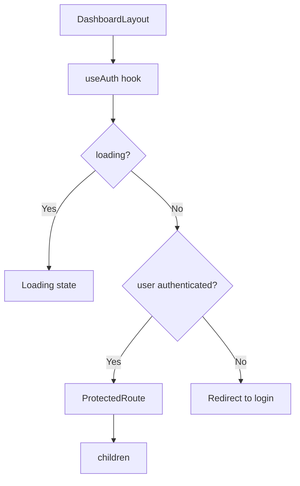
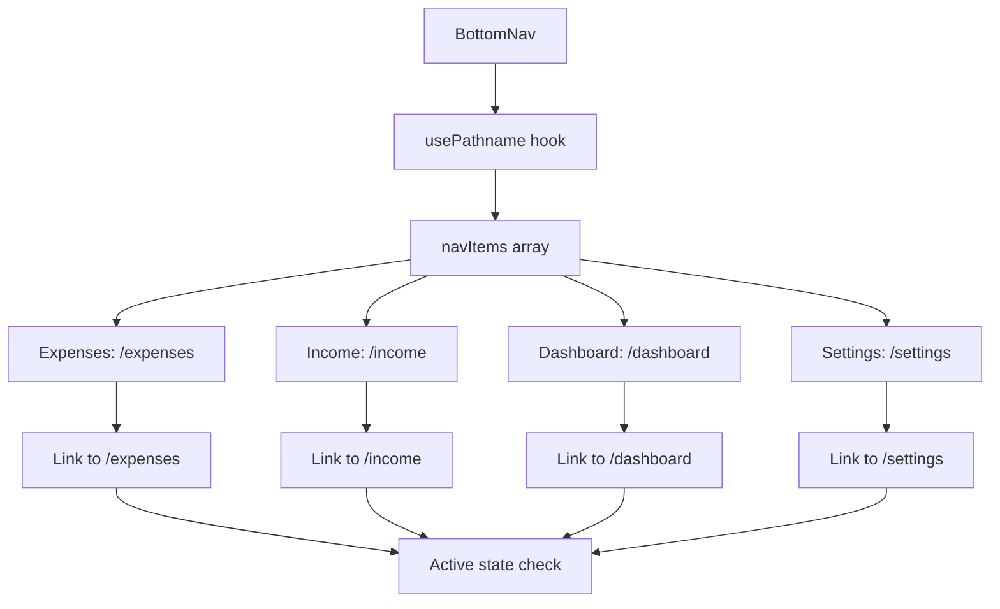
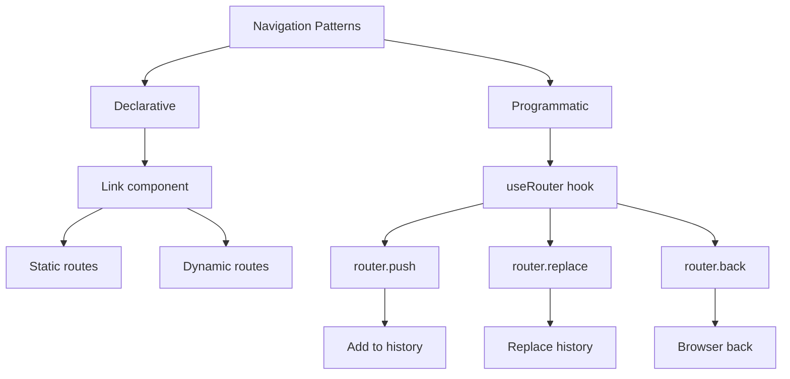
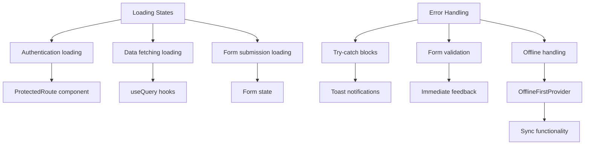

# Routing and Navigation

<cite>
**Referenced Files in This Document**   
- [src/app/layout.tsx](file://src/app/layout.tsx) - *Updated in recent commit*
- [src/components/ProtectedRoute.tsx](file://src/components/ProtectedRoute.tsx) - *Updated in recent commit*
- [src/providers/OfflineFirstProvider.tsx](file://src/providers/OfflineFirstProvider.tsx) - *Added in recent commit*
- [src/providers/OfflineFirstWrapper.tsx](file://src/providers/OfflineFirstWrapper.tsx) - *Added in recent commit*
- [src/app/dashboard/layout.tsx](file://src/app/dashboard/layout.tsx)
- [src/app/page.tsx](file://src/app/page.tsx)
- [src/app/login/page.tsx](file://src/app/login/page.tsx)
- [src/app/register/page.tsx](file://src/app/register/page.tsx)
- [src/app/onboarding/page.tsx](file://src/app/onboarding/page.tsx)
- [src/app/expenses/page.tsx](file://src/app/expenses/page.tsx)
- [src/app/income/page.tsx](file://src/app/income/page.tsx)
- [src/app/cards/page.tsx](file://src/app/cards/page.tsx)
- [src/app/settings/page.tsx](file://src/app/settings/page.tsx)
- [src/app/expenses/edit/[id]/page.tsx](file://src/app/expenses/edit/[id]/page.tsx)
- [src/app/income/edit/[id]/page.tsx](file://src/app/income/edit/[id]/page.tsx)
- [src/components/BottomNav.tsx](file://src/components/BottomNav.tsx)
</cite>

## Update Summary
**Changes Made**   
- Updated ProtectedRoute implementation to include offline capability checks and centralized loading state
- Added OfflineFirstProvider and OfflineFirstWrapper for offline-first functionality
- Revised route protection logic to handle offline scenarios gracefully
- Updated root layout to use OfflineFirstWrapper instead of direct OfflineProvider
- Enhanced loading state management to prevent multiple loading screens

## Table of Contents
1. [Introduction](#introduction)
2. [Project Structure and File-Based Routing](#project-structure-and-file-based-routing)
3. [Root Layout and Shared UI Shell](#root-layout-and-shared-ui-shell)
4. [Dashboard Layout and Route Protection](#dashboard-layout-and-route-protection)
5. [BottomNav Component and Mobile-First Navigation](#bottomnav-component-and-mobile-first-navigation)
6. [Route Protection with ProtectedRoute](#route-protection-with-protectedroute)
7. [Dynamic Routing and Parameter Handling](#dynamic-routing-and-parameter-handling)
8. [Navigation Patterns and Programmatic Routing](#navigation-patterns-and-programmatic-routing)
9. [Loading States and Error Handling](#loading-states-and-error-handling)
10. [SEO and Metadata Configuration](#seo-and-metadata-configuration)
11. [Responsive Design Principles](#responsive-design-principles)
12. [Conclusion](#conclusion)

## Introduction
This document provides a comprehensive analysis of the routing and navigation system in the Expense Tracker application. The application leverages Next.js App Router for file-based routing, implementing a mobile-first navigation strategy with a persistent bottom navigation bar. The system includes route protection for authenticated pages, dynamic routing for editing records, and responsive design principles that adapt to different device sizes. Recent updates have enhanced the route protection mechanism to support offline-first functionality and prevent multiple loading screens.

## Project Structure and File-Based Routing
The application uses Next.js App Router for file-based routing, where the directory structure under `src/app` directly maps to the application's URL routes. Each directory containing a `page.tsx` file represents a route in the application. The structure includes static routes for main sections like dashboard, expenses, income, cards, and settings, as well as dynamic routes for editing expense and income records.

```mermaid
graph TD
A[src/app] --> B[cards/page.tsx]
A --> C[dashboard/layout.tsx]
A --> C[dashboard/page.tsx]
A --> D[expenses/page.tsx]
A --> D[expenses/edit/[id]/page.tsx]
A --> E[income/page.tsx]
A --> E[income/edit/[id]/page.tsx]
A --> F[login/page.tsx]
A --> G[onboarding/page.tsx]
A --> H[register/page.tsx]
A --> I[settings/page.tsx]
A --> J[globals.css]
A --> K[layout.tsx]
A --> L[page.tsx]
```

**Diagram sources**
- [src/app](file://src/app)

**Section sources**
- [src/app](file://src/app)

## Root Layout and Shared UI Shell
The root layout in `src/app/layout.tsx` provides a shared UI shell for the entire application, wrapping all pages with essential providers and global components. This layout defines the HTML structure, applies global fonts, and wraps children with context providers for authentication, settings, offline status, and Convex integration.

The layout now uses `OfflineFirstWrapper` which conditionally provides the `OfflineFirstProvider` based on the authenticated user's ID. This wrapper ensures that offline capabilities are initialized only when a user is authenticated, preventing initialization errors. The layout also includes global UI elements such as the network status indicator and toast notifications, which are rendered outside the main content flow but available across all routes.

```mermaid
graph TD
A[RootLayout] --> B[html lang="en"]
B --> C[body]
C --> D[ConvexProvider]
D --> E[AuthProvider]
E --> F[OfflineFirstWrapper]
F --> G[OfflineFirstProvider]
G --> H[SettingsProvider]
H --> I[OfflineProvider]
I --> J[children]
I --> K[div#modal-root]
I --> L[NetworkStatusIndicator]
I --> M[Toaster]
```

**Diagram sources**
- [src/app/layout.tsx](file://src/app/layout.tsx#L1-L97)
- [src/providers/OfflineFirstWrapper.tsx](file://src/providers/OfflineFirstWrapper.tsx#L1-L18)

**Section sources**   
- [src/app/layout.tsx](file://src/app/layout.tsx#L1-L97) - *Updated in recent commit*
- [src/providers/OfflineFirstWrapper.tsx](file://src/providers/OfflineFirstWrapper.tsx#L1-L18) - *Added in recent commit*

## Dashboard Layout and Route Protection
The dashboard section has its own layout file at `src/app/dashboard/layout.tsx`, which provides route protection and loading states specific to the dashboard route. This nested layout wraps the dashboard page and its children, ensuring that only authenticated users can access the dashboard content.

The layout uses the `useAuth` hook to check authentication status and displays a loading state while authentication state is being determined. Once the authentication state is known, it either renders the protected content or redirects unauthenticated users to the login page through the `ProtectedRoute` component. This layout no longer handles route protection directly, delegating this responsibility to the centralized `ProtectedRoute` component.



**Diagram sources**
- [src/app/dashboard/layout.tsx](file://src/app/dashboard/layout.tsx#L1-L22)

**Section sources**
- [src/app/dashboard/layout.tsx](file://src/app/dashboard/layout.tsx#L1-L22)

## BottomNav Component and Mobile-First Navigation
The `BottomNav` component implements a mobile-first navigation strategy, providing persistent navigation between key application sections. The component is designed to be visible only on mobile devices (hidden on medium and larger screens using the `md:hidden` Tailwind class), reflecting a mobile-first design philosophy.

The navigation includes four main sections: Expenses, Income, Dashboard, and Settings, each represented by an icon and label. The component uses Next.js `usePathname` hook to determine the current route and highlight the active navigation item. It also implements smooth tap animations using Framer Motion for enhanced user experience.



**Diagram sources**
- [src/components/BottomNav.tsx](file://src/components/BottomNav.tsx#L1-L58)

**Section sources**
- [src/components/BottomNav.tsx](file://src/components/BottomNav.tsx#L1-L58)

## Route Protection with ProtectedRoute
The `ProtectedRoute` component provides a centralized mechanism for protecting routes that require authentication. It uses the `useAuth` hook to access the current user's authentication state and the `useOfflineCapability` hook to determine offline functionality. The component now handles multiple initialization states and prevents multiple loading screens by consolidating loading states.

The component manages authentication and offline initialization through a single loading screen while both authentication and offline capabilities are being determined. It allows access when the user is authenticated, when offline functionality is available, or when a token exists (for network recovery scenarios). The implementation includes error handling for cases where the offline capability hook is not properly initialized.

```mermaid
graph TD
A[ProtectedRoute] --> B[useAuth hook]
A --> C[useOfflineCapability hook]
B --> D{loading?}
C --> E{isInitialized?}
D --> |Yes| F[Single loading screen]
E --> |No| F
D --> |No| G{user authenticated?}
G --> |Yes| H[Render children]
G --> |No| I{can function offline?}
I --> |Yes| H
G --> |No| J{token exists?}
J --> |Yes| H
J --> |No| K[router.replace("/login")]
K --> L[Return null]
```

**Diagram sources**
- [src/components/ProtectedRoute.tsx](file://src/components/ProtectedRoute.tsx#L1-L98) - *Updated in recent commit*
- [src/providers/OfflineFirstProvider.tsx](file://src/providers/OfflineFirstProvider.tsx#L1-L325) - *Added in recent commit*

**Section sources**   
- [src/components/ProtectedRoute.tsx](file://src/components/ProtectedRoute.tsx#L1-L98) - *Updated in recent commit*
- [src/providers/OfflineFirstProvider.tsx](file://src/providers/OfflineFirstProvider.tsx#L1-L325) - *Added in recent commit*

## Dynamic Routing and Parameter Handling
The application implements dynamic routing for editing expense and income records using Next.js dynamic route segments. The routes are defined as `src/app/expenses/edit/[id]/page.tsx` and `src/app/income/edit/[id]/page.tsx`, where `[id]` is a dynamic parameter that captures the record ID from the URL.

The dynamic route pages use the `useParams` hook to extract the ID parameter from the URL and the `useRouter` hook for navigation after form submission. The component fetches the specific record data using the ID and pre-fills the form with the existing data. After successful update, it navigates back to the appropriate listing page.

```mermaid
graph TD
A[Dynamic Route: /expenses/edit/[id]] --> B[useParams hook]
B --> C[Extract id parameter]
C --> D[Fetch expense data by id]
D --> E[Pre-fill form]
E --> F[Handle form submission]
F --> G[Update expense via mutation]
G --> H[router.push("/expenses")]
```

**Diagram sources**
- [src/app/expenses/edit/[id]/page.tsx](file://src/app/expenses/edit/[id]/page.tsx#L1-L394)
- [src/app/income/edit/[id]/page.tsx](file://src/app/income/edit/[id]/page.tsx#L1-L394)

**Section sources**
- [src/app/expenses/edit/[id]/page.tsx](file://src/app/expenses/edit/[id]/page.tsx#L1-L394)
- [src/app/income/edit/[id]/page.tsx](file://src/app/income/edit/[id]/page.tsx#L1-L394)

## Navigation Patterns and Programmatic Routing
The application uses both declarative and programmatic navigation patterns. Declarative navigation is implemented using Next.js `Link` component for navigation between top-level sections, while programmatic navigation is used for form submissions, authentication flows, and other dynamic navigation scenarios.

Programmatic navigation is handled using the `useRouter` hook from Next.js, which provides access to the router object for imperative navigation. The `router.push` method is used for regular navigation that adds to the browser history, while `router.replace` is used for replacing the current history entry, typically in authentication flows to prevent users from navigating back to login pages.



**Diagram sources**
- [src/app/expenses/page.tsx](file://src/app/expenses/page.tsx#L77)
- [src/app/login/page.tsx](file://src/app/login/page.tsx#L18)
- [src/app/page.tsx](file://src/app/page.tsx#L13)
- [src/components/ProtectedRoute.tsx](file://src/components/ProtectedRoute.tsx#L16)

**Section sources**
- [src/app/expenses/page.tsx](file://src/app/expenses/page.tsx#L77)
- [src/app/login/page.tsx](file://src/app/login/page.tsx#L18)
- [src/app/page.tsx](file://src/app/page.tsx#L13)
- [src/components/ProtectedRoute.tsx](file://src/components/ProtectedRoute.tsx#L16)

## Loading States and Error Handling
The application implements consistent loading states and error handling across routes. Loading states are displayed when authentication status is being determined, when data is being fetched from the backend, or when forms are being submitted. The updated `ProtectedRoute` component now provides a single, centralized loading screen that prevents multiple loading states from appearing during initialization.

Error handling is implemented using try-catch blocks around asynchronous operations, with user-friendly error messages displayed using toast notifications. The `ProtectedRoute` component includes error handling for cases where the offline capability hook is not available, providing fallback behavior to prevent blocking the application. Network errors and offline scenarios are handled through the offline context and sync functionality.



**Section sources**
- [src/components/ProtectedRoute.tsx](file://src/components/ProtectedRoute.tsx#L1-L98) - *Updated in recent commit*
- [src/app/expenses/page.tsx](file://src/app/expenses/page.tsx#L1-L351)
- [src/app/settings/page.tsx](file://src/app/settings/page.tsx#L1-L234)

## SEO and Metadata Configuration
The application configures SEO metadata in the root layout file using Next.js `Metadata` type. This includes the application title, description, manifest file, theme color, and viewport settings. These metadata values are applied globally to all pages in the application, ensuring consistent SEO configuration.

The viewport meta tag is configured for mobile-first design with `width=device-width, initial-scale=1, maximum-scale=1`, preventing users from zooming in on mobile devices and ensuring a consistent mobile experience. The manifest file enables Progressive Web App (PWA) functionality, allowing users to install the application on their devices.

```mermaid
graph TD
A[Metadata Configuration] --> B[Title: "Expense Tracker"]
A --> C[Description: "Track your daily expenses with ease"]
A --> D[Manifest: "/manifest.json"]
A --> E[Theme Color: "#000000"]
A --> F[Viewport: "width=device-width, initial-scale=1, maximum-scale=1"]
```

**Diagram sources**
- [src/app/layout.tsx](file://src/app/layout.tsx#L1-L97)

**Section sources**
- [src/app/layout.tsx](file://src/app/layout.tsx#L1-L97)

## Responsive Design Principles
The application implements responsive design principles to provide an optimal user experience across different device sizes. The mobile-first approach is evident in the persistent bottom navigation bar, which is hidden on medium and larger screens using Tailwind's `md:hidden` class.

The layout uses a max-width container (`max-w-md`) with horizontal padding, centering the content and preventing it from becoming too wide on larger screens. This creates a consistent reading width that is comfortable for users regardless of their device size. Form elements and buttons are designed with minimum height requirements (`min-h-[44px]`) to ensure adequate touch targets on mobile devices.

The application also uses responsive typography and spacing, with font sizes and padding that adapt to different screen sizes. The overall design prioritizes usability on mobile devices while maintaining a clean and organized layout on larger screens.

```mermaid
graph TD
A[Responsive Design] --> B[Mobile-First Approach]
B --> C[BottomNav: md:hidden]
A --> D[Layout Constraints]
D --> E[max-w-md container]
D --> F[Centered content]
A --> G[Touch-Friendly Design]
G --> H[min-h-[44px] elements]
G --> I[Adequate touch targets]
A --> J[Adaptive Typography]
J --> K[Responsive font sizes]
J --> L[Flexible spacing]
```

**Section sources**
- [src/components/BottomNav.tsx](file://src/components/BottomNav.tsx#L1-L58)
- [src/app/expenses/page.tsx](file://src/app/expenses/page.tsx#L1-L351)
- [src/app/dashboard/page.tsx](file://src/app/dashboard/page.tsx#L1-L126)

## Conclusion
The Expense Tracker application implements a comprehensive routing and navigation system using Next.js App Router. The file-based routing structure provides a clear mapping between directory structure and application routes, while the layout system enables shared UI elements and route-specific wrappers. The mobile-first navigation approach with the BottomNav component ensures easy access to key sections on mobile devices.

Recent updates have enhanced the route protection mechanism through the `ProtectedRoute` component, which now provides centralized authentication handling with a single loading screen and consistent redirect patterns. The implementation integrates offline-first capabilities through the `OfflineFirstProvider` and `OfflineFirstWrapper`, allowing the application to function when offline. Route protection is consistently implemented, safeguarding authenticated pages and redirecting unauthenticated users to the login page.

Dynamic routing enables editing of expense and income records with parameter handling through the `useParams` hook. The application uses both declarative and programmatic navigation patterns, with `Link` components for static navigation and `useRouter` for dynamic scenarios. Loading states and error handling are implemented consistently across the application, providing feedback to users during asynchronous operations and handling errors gracefully. SEO metadata is configured globally in the root layout, ensuring consistent metadata across all pages. The responsive design principles prioritize mobile usability while maintaining a clean layout on larger screens, creating a seamless user experience across device sizes.