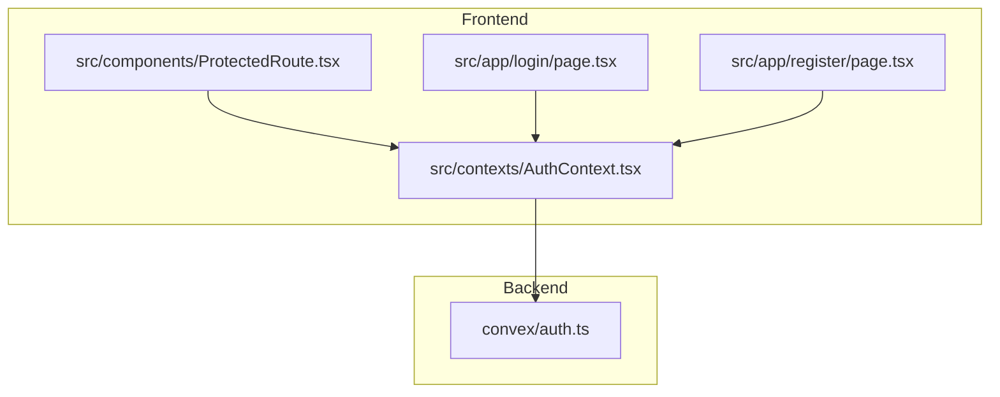
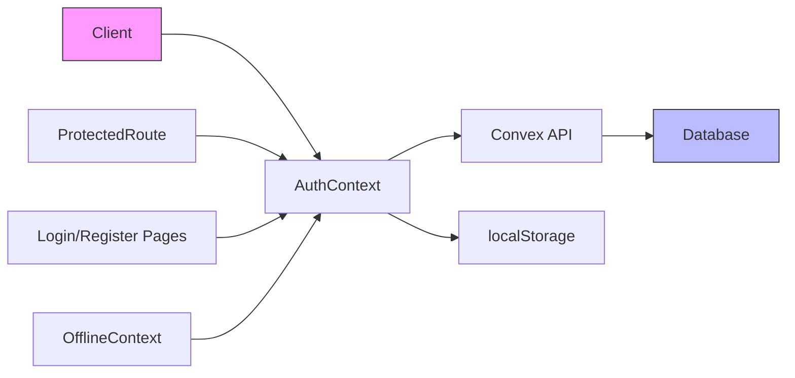
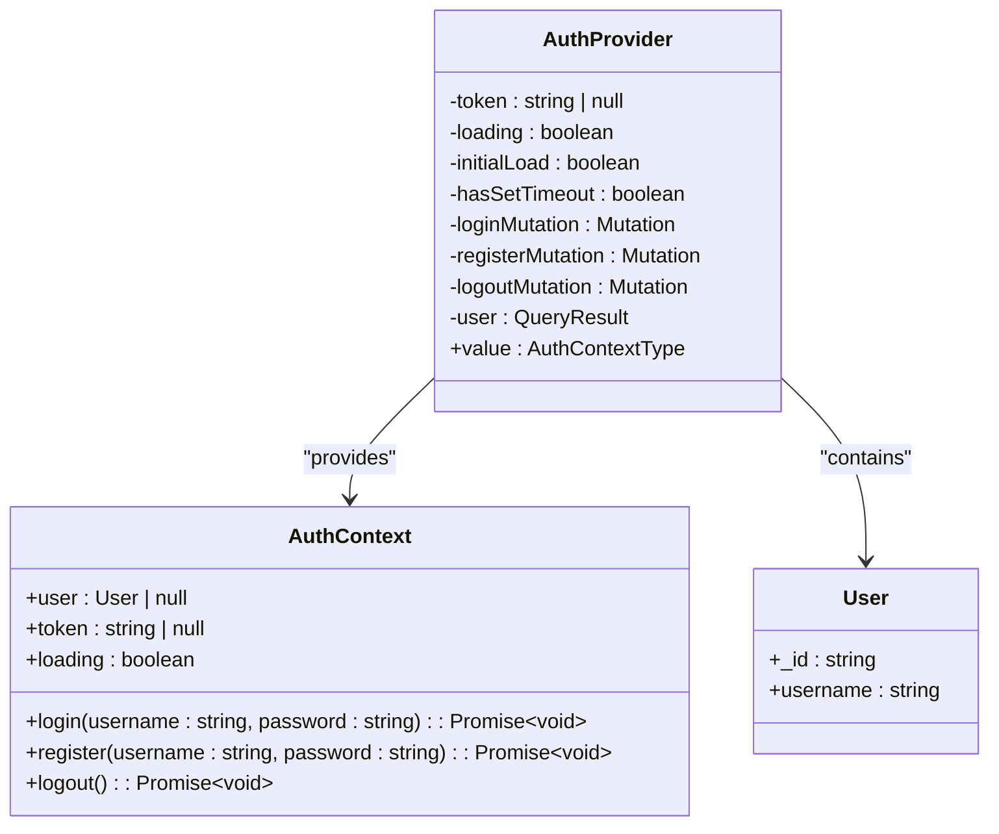
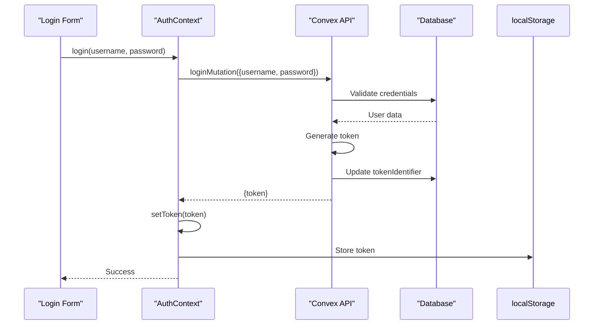
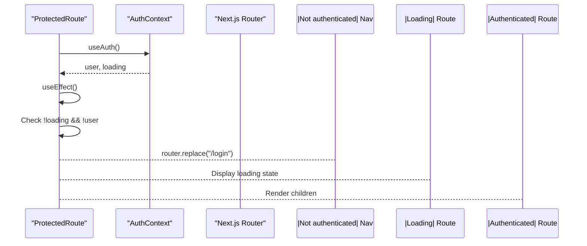
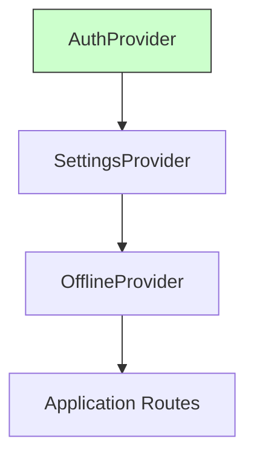
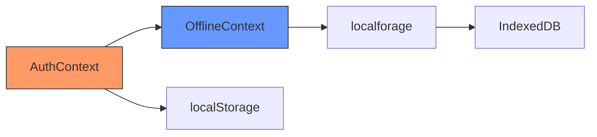

# Auth Context Management

<cite>
**Referenced Files in This Document**   
- [AuthContext.tsx](file://src/contexts/AuthContext.tsx#L1-L153) - *Updated with 10-second timeout and enhanced token validation*
- [ProtectedRoute.tsx](file://src/components/ProtectedRoute.tsx#L1-L56) - *Updated with offline capability integration*
- [layout.tsx](file://src/app/layout.tsx#L1-L95) - *Updated with provider hierarchy*
- [auth.ts](file://convex/auth.ts#L1-L155) - *Convex authentication functions*
</cite>

## Update Summary
**Changes Made**   
- Updated AuthContext implementation to include 10-second timeout mechanism for authentication queries
- Enhanced token validation logic to automatically invalidate tokens when user query returns null
- Added cleanup mechanism for timeout operations to prevent memory leaks
- Updated loading state management to handle initialization phase and offline scenarios
- Improved ProtectedRoute to support offline access with local data capabilities
- Fixed edge cases related to infinite loading states and auto-logout issues

## Table of Contents
1. [Introduction](#introduction)
2. [Project Structure](#project-structure)
3. [Core Components](#core-components)
4. [Architecture Overview](#architecture-overview)
5. [Detailed Component Analysis](#detailed-component-analysis)
6. [Authentication Flow](#authentication-flow)
7. [Protected Route Enforcement](#protected-route-enforcement)
8. [Session Persistence and Edge Cases](#session-persistence-and-edge-cases)
9. [Error Handling and Best Practices](#error-handling-and-best-practices)
10. [Offline Authentication Integration](#offline-authentication-integration)
11. [Conclusion](#conclusion)

## Introduction
The AuthContext system is a central state management solution for handling user authentication in the Expense Tracker application. It leverages React Context to provide global access to authentication state, including login, registration, and logout functionality. The system integrates with Convex backend services for secure token handling and user validation, while maintaining session persistence through localStorage. This document provides a comprehensive analysis of the AuthContext implementation, its integration points, and best practices for usage across the application.

## Project Structure
The project follows a feature-based organization with clear separation between UI components, business logic, and backend services. Authentication-related code is distributed across frontend contexts and backend Convex functions.



**Diagram sources**
- [AuthContext.tsx](file://src/contexts/AuthContext.tsx#L1-L153)
- [auth.ts](file://convex/auth.ts#L1-L155)

**Section sources**
- [AuthContext.tsx](file://src/contexts/AuthContext.tsx#L1-L153)
- [layout.tsx](file://src/app/layout.tsx#L1-L95)

## Core Components
The authentication system consists of several key components that work together to manage user state:

- **AuthContext**: Central state container for authentication data and methods
- **AuthProvider**: React provider component that wraps the application
- **useAuth hook**: Custom hook for consuming authentication state
- **ProtectedRoute**: Higher-order component for access control
- **Convex auth functions**: Server-side authentication handlers

These components follow the React Context pattern for state management, allowing authentication state to be accessed from any component in the tree without prop drilling.

**Section sources**
- [AuthContext.tsx](file://src/contexts/AuthContext.tsx#L1-L153)
- [ProtectedRoute.tsx](file://src/components/ProtectedRoute.tsx#L1-L56)

## Architecture Overview
The authentication architecture follows a client-server pattern with React Context managing client-side state and Convex handling server-side authentication logic.



**Diagram sources**
- [AuthContext.tsx](file://src/contexts/AuthContext.tsx#L1-L153)
- [auth.ts](file://convex/auth.ts#L1-L155)

## Detailed Component Analysis

### AuthContext Implementation
The AuthContext component manages the complete authentication state lifecycle, including user data, token management, and authentication methods.



**Diagram sources**
- [AuthContext.tsx](file://src/contexts/AuthContext.tsx#L1-L153)

**Section sources**
- [AuthContext.tsx](file://src/contexts/AuthContext.tsx#L1-L153)

### AuthContext State Management
The AuthContext uses React's useState and useEffect hooks to manage authentication state. It initializes by checking localStorage for an existing token and uses Convex mutations for authentication operations.

```typescript
const AuthContext = createContext<AuthContextType | undefined>(undefined);

export function AuthProvider({ children }: { children: ReactNode }) {
  const [token, setToken] = useState<string | null>(null);
  const [loading, setLoading] = useState(true);
  const [initialLoad, setInitialLoad] = useState(true);
  const [hasSetTimeout, setHasSetTimeout] = useState(false);

  const loginMutation = useMutation(api.auth.login);
  const registerMutation = useMutation(api.auth.register);
  const logoutMutation = useMutation(api.auth.logout);

  const user = useQuery(api.auth.getCurrentUser, token ? { token } : "skip");
```

The context exposes a value object containing the current user, token, authentication methods, and loading state. The loading state accounts for both initialization and user query status. The implementation now includes `initialLoad` and `hasSetTimeout` state variables to manage the hydration process and prevent infinite loading states. The timeout has been reduced from 15 to 10 seconds for improved responsiveness.

**Section sources**
- [AuthContext.tsx](file://src/contexts/AuthContext.tsx#L1-L153)

### Authentication Methods
The AuthContext provides three primary methods for user authentication: login, register, and logout. Each method interacts with corresponding Convex mutations.



**Diagram sources**
- [AuthContext.tsx](file://src/contexts/AuthContext.tsx#L1-L153)
- [auth.ts](file://convex/auth.ts#L1-L155)

**Section sources**
- [AuthContext.tsx](file://src/contexts/AuthContext.tsx#L1-L153)

## Authentication Flow

### Login Process
The login process begins with user input validation in the login page component, followed by authentication through the AuthContext.

```mermaid
flowchart TD
A[User enters credentials] --> B{Validate input}
B --> |Invalid| C[Show error message]
B --> |Valid| D[Call login() method]
D --> E[Execute loginMutation]
E --> F{Authentication successful?}
F --> |No| G[Throw error]
F --> |Yes| H[Store token in state]
H --> I[Save token to localStorage]
I --> J[Redirect to dashboard]
G --> K[Display error toast]
```

The login page uses the useAuth hook to access the login function and handles loading states and error display through toast notifications.

**Section sources**
- [page.tsx](file://src/app/login/page.tsx#L1-L120)
- [AuthContext.tsx](file://src/contexts/AuthContext.tsx#L1-L153)

### Registration Process
The registration flow includes client-side validation before submitting to the authentication system.

```mermaid
flowchart TD
A[User enters registration data] --> B{Validate fields}
B --> |Missing fields| C[Show error]
B --> |Passwords don't match| D[Show error]
B --> |Password too short| E[Show error]
B --> |Valid| F[Call register() method]
F --> G[Execute registerMutation]
G --> H{Registration successful?}
H --> |No| I[Throw error]
H --> |Yes| J[Store token in state]
J --> K[Save token to localStorage]
K --> L[Redirect to dashboard]
I --> M[Display error toast]
```

The registration page performs validation for required fields, password matching, and minimum length requirements before attempting registration.

**Section sources**
- [page.tsx](file://src/app/register/page.tsx#L1-L147)
- [AuthContext.tsx](file://src/contexts/AuthContext.tsx#L1-L153)

## Protected Route Enforcement
The ProtectedRoute component consumes AuthContext to enforce access control on private routes.



**Diagram sources**
- [ProtectedRoute.tsx](file://src/components/ProtectedRoute.tsx#L1-L56)
- [AuthContext.tsx](file://src/contexts/AuthContext.tsx#L1-L153)

The ProtectedRoute component renders a loading state while authentication status is being determined, redirects to login if unauthenticated, and only renders protected content when authenticated. The updated implementation also considers offline capabilities, allowing access when the user can function offline with local data.

```typescript
export function ProtectedRoute({ children }: ProtectedRouteProps) {
  const { user, loading } = useAuth();
  const { canFunctionOffline, isInitialized, isOnline } = useOfflineCapability();
  const router = useRouter();

  useEffect(() => {
    if (!loading && !user && isInitialized && !canFunctionOffline) {
      router.replace("/login");
      return;
    }
    
    if (!user && canFunctionOffline && !isOnline) {
      console.log('ProtectedRoute: Allowing offline access with local data');
      return;
    }
  }, [user, loading, router, canFunctionOffline, isInitialized, isOnline]);

  if (loading || !isInitialized) {
    return (
      <div className="min-h-screen flex items-center justify-center">
        <div className="text-lg">Loading...</div>
      </div>
    );
  }

  if (user || (canFunctionOffline && !isOnline)) {
    return <>{children}</>;
  }

  return null;
}
```

**Section sources**
- [ProtectedRoute.tsx](file://src/components/ProtectedRoute.tsx#L1-L56)

## Session Persistence and Edge Cases

### localStorage Integration
The AuthContext uses localStorage to persist authentication tokens across browser sessions.

```typescript
useEffect(() => {
  const savedToken = localStorage.getItem("auth-token");
  if (savedToken) {
    setToken(savedToken);
  }
  setInitialLoad(false);
}, []);

// During login/register
localStorage.setItem("auth-token", result.token);

// During logout
localStorage.removeItem("auth-token");
```

This implementation ensures that users remain authenticated between visits to the application.

**Section sources**
- [AuthContext.tsx](file://src/contexts/AuthContext.tsx#L1-L153)

### Edge Case Management
The authentication system handles several edge cases:

- **Token expiration**: The system implements a 10-second timeout for authentication queries (reduced from 15 seconds). If the query doesn't resolve within this timeframe, the system checks the online status. If online, it assumes the token may be invalid and clears it from state and localStorage. If offline, it maintains the token to support offline access.
- **Offline login state**: The system maintains login state in localStorage, allowing users to access cached data while offline, but API calls will fail.
- **Race conditions during hydration**: The loading state prevents rendering protected content before authentication status is determined. The implementation includes proper cleanup of timeout operations through the useEffect cleanup function, preventing memory leaks and ensuring consistent state management.
- **Invalid token handling**: When the user query returns null (indicating an invalid token), the system automatically clears the token from state and localStorage, preventing stale authentication states.

The timeout mechanism is implemented with a `hasSetTimeout` flag to prevent multiple timeouts from being set during the same authentication attempt, and includes cleanup logic to clear the timeout when the component unmounts or dependencies change.

**Section sources**
- [AuthContext.tsx](file://src/contexts/AuthContext.tsx#L1-L153)

## Error Handling and Best Practices

### Error Handling Strategy
The authentication system implements a consistent error handling pattern:

```typescript
const login = async (username: string, password: string) => {
  try {
    const result = await loginMutation({ username, password });
    setToken(result.token);
    localStorage.setItem("auth-token", result.token);
  } catch (error) {
    throw error;
  }
};
```

Errors are propagated to the calling component, which handles user-facing error display through toast notifications. The logout method includes specific error handling that logs errors but continues with local state cleanup to ensure users can always log out even if the server request fails.

**Section sources**
- [AuthContext.tsx](file://src/contexts/AuthContext.tsx#L1-L153)

### Best Practices
Recommended best practices for using AuthContext:

- **Loading states**: Always check the loading state before rendering authentication-dependent content
- **Error boundaries**: Wrap authentication components in error boundaries for graceful failure
- **Memoization**: The context value is automatically memoized by React, preventing unnecessary re-renders
- **Provider placement**: The AuthProvider is correctly placed in layout.tsx, ensuring availability throughout the application



**Diagram sources**
- [layout.tsx](file://src/app/layout.tsx#L1-L95)

**Section sources**
- [layout.tsx](file://src/app/layout.tsx#L1-L95)

## Offline Authentication Integration
The AuthContext integrates with OfflineContext to provide a seamless experience when network connectivity is lost.



**Diagram sources**
- [AuthContext.tsx](file://src/contexts/AuthContext.tsx#L1-L153)
- [OfflineContext.tsx](file://src/contexts/OfflineContext.tsx#L1-L172)

The OfflineContext maintains a queue of pending operations that can be synchronized when connectivity is restored, preserving user data even during offline periods. The ProtectedRoute component now considers offline capabilities, allowing access to users who can function offline with local data even when not authenticated through the server. This integration ensures a smooth user experience across varying network conditions.

**Section sources**
- [OfflineContext.tsx](file://src/contexts/OfflineContext.tsx#L1-L172)

## Conclusion
The AuthContext system provides a robust foundation for authentication state management in the Expense Tracker application. By leveraging React Context and Convex backend services, it offers a clean, maintainable solution for user authentication. The system effectively handles login, registration, and session persistence while providing clear integration points for access control through ProtectedRoute. Recent updates have significantly improved the system's resilience by adding a 10-second timeout mechanism to prevent infinite loading states and implementing automatic token invalidation when user queries return null. The implementation now includes proper cleanup of timeout operations and better handling of edge cases during authentication hydration. The integration with offline capabilities allows users to access their data even when network connectivity is lost. Future enhancements could include more sophisticated token refresh functionality and enhanced offline authentication capabilities.