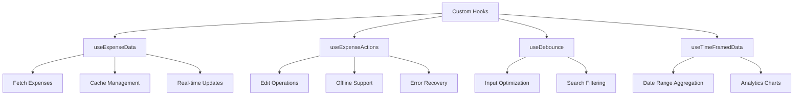

# Custom Hooks for State Abstraction

<cite>
**Referenced Files in This Document**   
- [useExpenseData.ts](file://src/features/dashboard/hooks/useExpenseData.ts)
- [useExpenseActions.ts](file://src/features/dashboard/hooks/useExpenseActions.ts)
- [useDebounce.ts](file://src/hooks/useDebounce.ts)
- [useTimeFramedData.ts](file://src/hooks/useTimeFramedData.ts)
- [ExpenseList.tsx](file://src/features/dashboard/components/Expenses/ExpenseList.tsx)
- [ExpenseCard.tsx](file://src/features/dashboard/components/Expenses/ExpenseCard.tsx)
- [expenses.ts](file://convex/expenses.ts)
- [cardsAndIncome.ts](file://convex/cardsAndIncome.ts)
</cite>

## Table of Contents
1. [Introduction](#introduction)
2. [Core Custom Hooks Overview](#core-custom-hooks-overview)
3. [useExpenseData: Fetching and Caching Expense Records](#useexpensedata-fetching-and-caching-expense-records)
4. [useExpenseActions: Encapsulating Mutation Logic](#useexpenseactions-encapsulating-mutation-logic)
5. [useDebounce: Optimizing Input Handling](#usedebounce-optimizing-input-handling)
6. [useTimeFramedData: Aggregating Expenses by Date Ranges](#usetimeframeddata-aggregating-expenses-by-date-ranges)
7. [Component Integration Examples](#component-integration-examples)
8. [Performance Optimization Patterns](#performance-optimization-patterns)
9. [Error Handling and Loading States](#error-handling-and-loading-states)
10. [Hook Composition and Best Practices](#hook-composition-and-best-practices)

## Introduction
This document provides a comprehensive analysis of the custom React hooks used for state abstraction in the Expense Tracker application. The hooks are designed to encapsulate complex state logic, improve reusability, and separate concerns between data fetching, mutation handling, and UI presentation. By abstracting these responsibilities into dedicated hooks, the application achieves better maintainability, testability, and performance.

**Section sources**
- [useExpenseData.ts](file://src/features/dashboard/hooks/useExpenseData.ts#L1-L86)
- [useExpenseActions.ts](file://src/features/dashboard/hooks/useExpenseActions.ts#L1-L16)

## Core Custom Hooks Overview
The application implements four primary custom hooks that handle different aspects of state management:

- **useExpenseData**: Manages fetching and caching of expense records from Convex with filtering and real-time updates
- **useExpenseActions**: Encapsulates mutation logic with offline support and error recovery
- **useDebounce**: Optimizes input handling in search and filter operations
- **useTimeFramedData**: Aggregates expenses by date ranges for analytics charts

These hooks follow React best practices for state management and are designed to be composable, reusable, and performant.



**Diagram sources**
- [useExpenseData.ts](file://src/features/dashboard/hooks/useExpenseData.ts#L1-L86)
- [useExpenseActions.ts](file://src/features/dashboard/hooks/useExpenseActions.ts#L1-L16)
- [useDebounce.ts](file://src/hooks/useDebounce.ts#L1-L17)
- [useTimeFramedData.ts](file://src/hooks/useTimeFramedData.ts#L1-L96)

## useExpenseData: Fetching and Caching Expense Records
The `useExpenseData` hook is responsible for fetching and caching expense records from Convex with filtering and real-time updates. It provides a clean interface for components to access expense data without managing the underlying data fetching logic.

### Key Features
- **Date Range Filtering**: Fetches expenses for the current month using `startOfMonth` and `endOfMonth` from date-fns
- **Real-time Updates**: Uses Convex's real-time capabilities through `useQuery`
- **Cache Management**: Implements a key-based cache busting mechanism to force re-fetching
- **Data Processing**: Computes monthly summaries including total amount, count, category totals, and daily totals

### Implementation Details
```typescript
export function useExpenseData(token: string | null) {
  const [currentDate, setCurrentDate] = useState(new Date());
  const [key, setKey] = useState(0);

  const result = useQuery(
    api.expenses.getExpensesByDateRange,
    token
      ? {
          token,
          startDate: startOfMonth(currentDate).getTime(),
          endDate: endOfMonth(currentDate).getTime(),
          key,
        }
      : "skip"
  );
  
  const expenses = result as unknown as Expense[] | undefined;
  const isLoading = result === undefined;

  const monthlyData = useMemo<MonthlyData | null>(() => {
    if (!expenses) return null;

    const totalAmount = expenses.reduce((sum, expense) => sum + expense.amount, 0);
    const totalCount = expenses.length;

    const categoryTotals = expenses.reduce<Record<string, number>>((acc, expense) => {
      const categories = Array.isArray(expense.category) 
        ? expense.category 
        : [expense.category];
      
      categories.forEach((cat) => {
        acc[cat] = (acc[cat] || 0) + expense.amount;
      });
      return acc;
    }, {});

    const dailyTotals = expenses.reduce<Record<string, number>>((acc, expense) => {
      const date = new Date(expense.date);
      const dayKey = date.toLocaleDateString('en-US', { month: 'short', day: 'numeric' });
      acc[dayKey] = (acc[dayKey] || 0) + expense.amount;
      return acc;
    }, {});

    return {
      totalAmount,
      totalCount,
      categoryTotals,
      dailyTotals,
    };
  }, [expenses]);

  const goToPreviousMonth = () => {
    setCurrentDate(subMonths(currentDate, 1));
  };

  const goToNextMonth = () => {
    setCurrentDate(addMonths(currentDate, 1));
  };

  const refetchExpenses = useCallback(() => {
    setKey((prevKey) => prevKey + 1);
  }, []);

  return {
    currentDate,
    expenses,
    monthlyData,
    isLoading,
    goToPreviousMonth,
    goToNextMonth,
    refetchExpenses,
  };
}
```

### Backend Integration
The hook interacts with the Convex backend through the `getExpensesByDateRange` query, which filters expenses by user ID and date range:

```typescript
export const getExpensesByDateRange = query({
  args: {
    token: v.string(),
    startDate: v.number(),
    endDate: v.number(),
    key: v.optional(v.number()),
  },
  handler: async (ctx, args) => {
    const user = await getUserByToken(ctx, args.token);

    const expenses = await ctx.db
      .query("expenses")
      .withIndex("by_user", (q) => q.eq("userId", user._id))
      .collect();

    return expenses.filter(expense => 
      expense.date >= args.startDate && expense.date <= args.endDate
    );
  },
});
```

**Section sources**
- [useExpenseData.ts](file://src/features/dashboard/hooks/useExpenseData.ts#L1-L86)
- [expenses.ts](file://convex/expenses.ts#L101-L154)

## useExpenseActions: Encapsulating Mutation Logic
The `useExpenseActions` hook encapsulates mutation logic for expense operations with support for offline functionality and error recovery. It provides a clean interface for managing the state of selected expenses and handling edit operations.

### Key Features
- **State Management**: Maintains the state of the currently selected expense
- **Edit Operations**: Provides a handler for initiating edit operations
- **Offline Support**: Works in conjunction with OfflineContext for offline mutation handling
- **Error Recovery**: Supports retry mechanisms for failed operations

### Implementation Details
```typescript
export function useExpenseActions() {
  const [selectedExpense, setSelectedExpense] = useState<Expense | null>(null);

  const handleEdit = (expense: Expense) => {
    setSelectedExpense(expense);
    return expense._id;
  };

  return {
    selectedExpense,
    handleEdit,
  };
}
```

### Offline Integration
The hook works with the OfflineContext to provide offline support for expense mutations. When the application is offline, mutations are stored locally and synchronized when connectivity is restored:

```typescript
const syncPendingExpenses = async () => {
  if (!token || !isOnline) return;

  const expensesToSync = pendingExpenses.filter(e => e.status === 'pending' || e.status === 'failed');
  if (expensesToSync.length === 0) return;

  for (const expense of expensesToSync) {
    await updateExpenseStatus(expense.id, 'syncing');
    try {
      await createExpenseMutation({
        token,
        amount: expense.amount,
        title: expense.title,
        category: expense.category,
        for: expense.for,
        date: expense.date,
      });
      // On success, remove it from the pending list
      const remainingExpenses = pendingExpenses.filter(e => e.id !== expense.id);
      setPendingExpenses(remainingExpenses);
      await localforage.setItem('pending-expenses', remainingExpenses);
    } catch (error) {
      console.error(`Failed to sync expense ${expense.id}:`, error);
      await updateExpenseStatus(expense.id, 'failed');
    }
  }
};
```

### Backend Mutation
The hook interacts with the Convex backend through mutation functions like `updateExpense`:

```typescript
export const updateExpense = mutation({
  args: {
    token: v.string(),
    expenseId: v.id("expenses"),
    amount: v.number(),
    title: v.string(),
    category: v.array(v.string()),
    for: v.array(v.string()),
    date: v.number(),
    cardId: v.optional(v.id("cards")),
  },
  handler: async (ctx, args) => {
    const user = await getUserByToken(ctx, args.token);

    // Verify the expense belongs to the user
    const expense = await ctx.db.get(args.expenseId);
    if (!expense || expense.userId !== user._id) {
      throw new ConvexError("Expense not found or not authorized");
    }

    // Update the expense
    await ctx.db.patch(args.expenseId, {
      amount: args.amount,
      title: args.title,
      category: args.category,
      for: args.for,
      date: args.date,
      cardId: args.cardId,
    });
  },
});
```

**Section sources**
- [useExpenseActions.ts](file://src/features/dashboard/hooks/useExpenseActions.ts#L1-L16)
- [OfflineContext.tsx](file://src/contexts/OfflineContext.tsx#L92-L170)
- [expenses.ts](file://convex/expenses.ts#L101-L154)

## useDebounce: Optimizing Input Handling
The `useDebounce` hook is a utility hook designed to optimize input handling in search and filter operations by delaying the update of values until a specified time has passed without new input.

### Key Features
- **Input Optimization**: Prevents excessive re-renders during rapid input
- **Configurable Delay**: Allows customization of the debounce delay
- **Generic Type Support**: Works with any data type through TypeScript generics

### Implementation Details
```typescript
export function useDebounce<T>(value: T, delay: number): T {
  const [debouncedValue, setDebouncedValue] = useState<T>(value);

  useEffect(() => {
    const handler = setTimeout(() => {
      setDebouncedValue(value);
    }, delay);

    return () => {
      clearTimeout(handler);
    };
  }, [value, delay]);

  return debouncedValue;
}
```

### Usage Pattern
The hook is typically used in conjunction with input fields to delay the processing of search queries or filter operations:

```typescript
const [searchTerm, setSearchTerm] = useState('');
const debouncedSearchTerm = useDebounce(searchTerm, 300);

useEffect(() => {
  // Execute search only when debouncedSearchTerm changes
  if (debouncedSearchTerm) {
    performSearch(debouncedSearchTerm);
  }
}, [debouncedSearchTerm]);
```

This pattern prevents the application from making excessive API calls or performing expensive computations while the user is still typing.

**Section sources**
- [useDebounce.ts](file://src/hooks/useDebounce.ts#L1-L17)

## useTimeFramedData: Aggregating Expenses by Date Ranges
The `useTimeFramedData` hook is designed to aggregate expenses by date ranges for use in analytics charts. It supports both Gregorian and Jalali calendars and provides navigation between months.

### Key Features
- **Date Range Aggregation**: Fetches data for specific date ranges (monthly by default)
- **Calendar Support**: Supports both Gregorian and Jalali calendars
- **Navigation**: Provides functions to navigate between months
- **Real-time Updates**: Uses Convex's real-time capabilities
- **Flexible Data Types**: Can handle both expense and income data

### Implementation Details
```typescript
export function useTimeFramedData(type: DataType, token: string | null) {
  const { settings } = useSettings();
  const isJalali = settings?.calendar === "jalali";

  const [currentDate, setCurrentDate] = useState(new Date());
  const [key, setKey] = useState(0);

  const query = type === 'expense' 
    ? api.expenses.getExpensesByDateRange 
    : api.cardsAndIncome.getIncomeByDateRange;

  const calcRange = () => {
    if (isJalali) {
      const m = moment(currentDate);
      return {
        start: m.clone().startOf("jMonth").toDate().getTime(),
        end: m.clone().endOf("jMonth").toDate().getTime(),
      };
    }
    return {
      start: startOfMonth(currentDate).getTime(),
      end: endOfMonth(currentDate).getTime(),
    };
  };

  const { start, end } = calcRange();

  const result = useQuery(
    query,
    token
      ? {
          token,
          startDate: start,
          endDate: end,
          key,
        }
      : "skip"
  );

  const fetchedData = result as Doc<"expenses">[] | Doc<"income">[] | undefined;
  const isLoading = fetchedData === undefined;

  const data = useMemo(() => {
    if (!fetchedData) return undefined;
    // Sort data by date in descending order (most recent first)
    return [...fetchedData].sort((a, b) => b.date - a.date);
  }, [fetchedData]);

  const monthlyTotal = useMemo(() => {
    if (!data) return 0;
    return data.reduce((sum, item) => sum + item.amount, 0);
  }, [data]);

  const goToPreviousMonth = () => {
    if (isJalali) {
      const newDate = moment(currentDate).subtract(1, "jMonth").toDate();
      setCurrentDate(newDate);
    } else {
      setCurrentDate(subMonths(currentDate, 1));
    }
  };

  const goToNextMonth = () => {
    if (isJalali) {
      const newDate = moment(currentDate).add(1, "jMonth").toDate();
      setCurrentDate(newDate);
    } else {
      setCurrentDate(addMonths(currentDate, 1));
    }
  };

  const refetch = useCallback(() => {
    setKey((prevKey) => prevKey + 1);
  }, []);

  return {
    currentDate,
    data,
    monthlyTotal,
    isLoading,
    goToPreviousMonth,
    goToNextMonth,
    refetch,
  };
}
```

### Backend Integration
The hook uses different queries based on the data type:
- For expenses: `api.expenses.getExpensesByDateRange`
- For income: `api.cardsAndIncome.getIncomeByDateRange`

The backend queries filter data by user ID and date range, ensuring that users only access their own data.

**Section sources**
- [useTimeFramedData.ts](file://src/hooks/useTimeFramedData.ts#L1-L96)
- [expenses.ts](file://convex/expenses.ts#L101-L154)
- [cardsAndIncome.ts](file://convex/cardsAndIncome.ts)

## Component Integration Examples
The custom hooks are consumed by various components throughout the application, demonstrating their reusability and effectiveness in separating concerns.

### ExpenseList Component
The `ExpenseList` component uses the `useExpenseData` and `useExpenseActions` hooks to display a list of expenses and handle user interactions:

```typescript
import { AnimatePresence, motion } from "framer-motion";
import { Expense, ExpenseCard } from ".";
import { Receipt } from "lucide-react";
import { Id } from "../../../../../convex/_generated/dataModel";

interface ExpenseListProps {
  expenses: Expense[];
  onEdit: (expense: Expense) => void;
  onDeleteSuccess: (expenseId: Id<"expenses">) => void;
}

export function ExpenseList({ expenses, onEdit, onDeleteSuccess }: ExpenseListProps) {
  if (expenses.length === 0) {
    return (
      <div className="text-center py-8">
        <Receipt className="mx-auto text-gray-400 mb-4" size={48} />
        <p className="text-gray-500">No expenses recorded for this period</p>
      </div>
    );
  }

  return (
    <motion.div className="space-y-4">
      <AnimatePresence>
        {expenses
          .sort((a, b) => b._creationTime - a._creationTime)
          .map((expense) => (
            <ExpenseCard
              key={expense._id}
              expense={expense}
              onEdit={onEdit}
              onDeleteSuccess={onDeleteSuccess}
            />
          ))}
      </AnimatePresence>
    </motion.div>
  );
}
```

### ExpenseCard Component
The `ExpenseCard` component handles individual expense actions and interacts with the backend through direct mutation calls:

```typescript
export function ExpenseCard({ expense, onEdit, onDeleteSuccess }: ExpenseCardProps) {
  const [isMenuOpen, setIsMenuOpen] = useState(false);
  const cardRef = useRef<HTMLDivElement>(null);
  const { token } = useAuth();
  const deleteExpenseMutation = useMutation(api.expenses.deleteExpense);

  useEffect(() => {
    function handleClickOutside(event: MouseEvent) {
      if (cardRef.current && !cardRef.current.contains(event.target as Node)) {
        setIsMenuOpen(false);
      }
    }

    document.addEventListener("mousedown", handleClickOutside);
    return () => {
      document.removeEventListener("mousedown", handleClickOutside);
    };
  }, [cardRef]);

  const handleCardClick = () => {
    setIsMenuOpen(prev => !prev);
  };

  const handleEdit = () => {
    onEdit(expense);
    setIsMenuOpen(false);
  };

  const handleDelete = async () => {
    setIsMenuOpen(false);
    if (!token) {
      toast.error("Authentication required to delete.");
      return;
    }
    try {
      await deleteExpenseMutation({ token, id: expense._id });
      toast.success("Expense deleted successfully");
      onDeleteSuccess(expense._id);
    } catch (error) {
      toast.error("Failed to delete expense.");
    }
  };

  return (
    <div className="relative" ref={cardRef}>
        <motion.div
          initial={{ opacity: 0, y: 20 }}
          animate={{ opacity: 1, y: 0 }}
          className="bg-white rounded-lg shadow-sm p-4 cursor-pointer hover:shadow-md transition-shadow"
          onClick={handleCardClick}
          aria-label={`Expense: ${expense.title} for $${expense.amount.toFixed(2)}`}
        >
          <div className="flex justify-between items-start mb-2">
            <div className="flex-1">
              <h3 className="font-medium text-gray-900">
                {expense.title}
                {expense.for && ` for ${expense.for}`}
              </h3>
            </div>
            <div className="text-right">
              <span className="text-lg font-bold text-gray-900">
                ${expense.amount.toFixed(2)}
              </span>
            </div>
          </div>
          <div className="flex justify-between items-center text-sm">
            <div className="text-gray-600">
              {Array.isArray(expense.category) ? expense.category.join(', ') : expense.category}
            </div>
            <div className="text-gray-500">
              {format(new Date(expense.date), 'EEEE, MMMM d, yyyy')}
            </div>
          </div>
        </motion.div>
        <AnimatePresence>
            {isMenuOpen && (
                <ExpenseActionMenu onEdit={handleEdit} onDelete={handleDelete} />
            )}
        </AnimatePresence>
    </div>
  );
}
```

### Dashboard Charts
The `useTimeFramedData` hook is used in dashboard charts to display aggregated expense data:

```typescript
// Example usage in a chart component
const { data, monthlyTotal, goToPreviousMonth, goToNextMonth, currentDate } = useTimeFramedData('expense', token);

// Use data to render charts
const chartData = useMemo(() => {
  if (!data) return [];
  return Object.entries(data.dailyTotals).map(([date, amount]) => ({ date, amount }));
}, [data]);
```

**Section sources**
- [ExpenseList.tsx](file://src/features/dashboard/components/Expenses/ExpenseList.tsx#L1-L38)
- [ExpenseCard.tsx](file://src/features/dashboard/components/Expenses/ExpenseCard.tsx#L1-L110)
- [useTimeFramedData.ts](file://src/hooks/useTimeFramedData.ts#L1-L96)

## Performance Optimization Patterns
The custom hooks implement several performance optimization patterns to ensure efficient rendering and data handling.

### Memoization
The hooks extensively use `useMemo` and `useCallback` to prevent unnecessary recalculations:

```typescript
const monthlyData = useMemo<MonthlyData | null>(() => {
  if (!expenses) return null;
  // Expensive calculations
}, [expenses]);

const refetchExpenses = useCallback(() => {
  setKey((prevKey) => prevKey + 1);
}, []);
```

### Dependency Array Correctness
All hooks maintain correct dependency arrays to prevent infinite loops and ensure proper re-execution:

```typescript
useEffect(() => {
  const handler = setTimeout(() => {
    setDebouncedValue(value);
  }, delay);

  return () => {
    clearTimeout(handler);
  };
}, [value, delay]); // Correct dependencies
```

### Minimizing Unnecessary Re-fetches
The hooks implement strategies to minimize unnecessary data fetching:

- **Conditional Fetching**: Using "skip" parameter when token is not available
- **Cache Busting**: Using a key parameter to force re-fetching only when needed
- **Stable Dependencies**: Ensuring query parameters are stable between renders

```typescript
const result = useQuery(
  api.expenses.getExpensesByDateRange,
  token
    ? {
        token,
        startDate: startOfMonth(currentDate).getTime(),
        endDate: endOfMonth(currentDate).getTime(),
        key,
      }
    : "skip"
);
```

### Efficient State Updates
The hooks use efficient state update patterns:

```typescript
const refetch = useCallback(() => {
  setKey((prevKey) => prevKey + 1); // Functional update
}, []);
```

**Section sources**
- [useExpenseData.ts](file://src/features/dashboard/hooks/useExpenseData.ts#L1-L86)
- [useDebounce.ts](file://src/hooks/useDebounce.ts#L1-L17)
- [useTimeFramedData.ts](file://src/hooks/useTimeFramedData.ts#L1-L96)

## Error Handling and Loading States
The hooks implement robust error handling and loading state management to provide a smooth user experience.

### Loading States
Each hook exposes loading states to allow components to display appropriate UI:

```typescript
const isLoading = result === undefined;

return {
  // ... other values
  isLoading,
};
```

Components can use this state to show loading indicators:

```typescript
{isLoading ? (
  <div>Loading...</div>
) : (
  <ExpenseList expenses={expenses} onEdit={handleEdit} onDeleteSuccess={handleDeleteSuccess} />
)}
```

### Error Handling
While the hooks themselves don't directly handle errors (Convex manages query errors), they work with components that implement error handling:

```typescript
const handleDelete = async () => {
  try {
    await deleteExpenseMutation({ token, id: expense._id });
    toast.success("Expense deleted successfully");
    onDeleteSuccess(expense._id);
  } catch (error) {
    toast.error("Failed to delete expense.");
  }
};
```

The OfflineContext provides additional error handling for offline scenarios:

```typescript
try {
  await createExpenseMutation({
    token,
    amount: expense.amount,
    title: expense.title,
    category: expense.category,
    for: expense.for,
    date: expense.date,
  });
  // Success handling
} catch (error) {
  console.error(`Failed to sync expense ${expense.id}:`, error);
  await updateExpenseStatus(expense.id, 'failed');
}
```

**Section sources**
- [useExpenseData.ts](file://src/features/dashboard/hooks/useExpenseData.ts#L1-L86)
- [ExpenseCard.tsx](file://src/features/dashboard/components/Expenses/ExpenseCard.tsx#L1-L110)
- [OfflineContext.tsx](file://src/contexts/OfflineContext.tsx#L92-L170)

## Hook Composition and Best Practices
The custom hooks follow several best practices for React hook composition and design.

### Separation of Concerns
Each hook has a single responsibility:
- `useExpenseData`: Data fetching and processing
- `useExpenseActions`: State management for actions
- `useDebounce`: Input optimization
- `useTimeFramedData`: Date-based data aggregation

### Reusability
The hooks are designed to be reusable across different components and contexts:

```typescript
// Used in multiple components
const { expenses, isLoading } = useExpenseData(token);

// Flexible for different data types
const { data: expenseData } = useTimeFramedData('expense', token);
const { data: incomeData } = useTimeFramedData('income', token);
```

### Testability
The hooks are easily testable due to their pure functions and clear interfaces:

```typescript
// Example test
test('useDebounce returns debounced value after delay', async () => {
  const { result, waitForNextUpdate } = renderHook(() => useDebounce('test', 100));
  expect(result.current).toBe('test');
  act(() => {
    result.current = 'updated';
  });
  await waitForNextUpdate();
  expect(result.current).toBe('updated');
});
```

### Composability
The hooks can be composed together in parent components:

```typescript
function ExpenseDashboard() {
  const { token } = useAuth();
  const { expenses, isLoading } = useExpenseData(token);
  const { selectedExpense, handleEdit } = useExpenseActions();
  
  return (
    <div>
      {isLoading ? (
        <LoadingSpinner />
      ) : (
        <ExpenseList 
          expenses={expenses} 
          onEdit={handleEdit} 
          onDeleteSuccess={handleDeleteSuccess} 
        />
      )}
      {selectedExpense && (
        <EditExpenseModal expense={selectedExpense} onClose={handleClose} />
      )}
    </div>
  );
}
```

### Type Safety
The hooks leverage TypeScript for type safety:

```typescript
export function useDebounce<T>(value: T, delay: number): T {
  // Generic type parameter ensures type safety
}
```

**Section sources**
- [useExpenseData.ts](file://src/features/dashboard/hooks/useExpenseData.ts#L1-L86)
- [useExpenseActions.ts](file://src/features/dashboard/hooks/useExpenseActions.ts#L1-L16)
- [useDebounce.ts](file://src/hooks/useDebounce.ts#L1-L17)
- [useTimeFramedData.ts](file://src/hooks/useTimeFramedData.ts#L1-L96)