# Offline Context Management

<cite>
**Referenced Files in This Document**   
- [OfflineContext.tsx](file://src/contexts/OfflineContext.tsx) - *Updated with enhanced error handling and authentication error management*
- [sw.js](file://public/sw.js)
- [OfflineBanner.tsx](file://src/components/OfflineBanner.tsx)
- [NetworkStatusIndicator.tsx](file://src/components/NetworkStatusIndicator.tsx)
- [useExpenseActions.ts](file://src/features/dashboard/hooks/useExpenseActions.ts)
- [expenses.ts](file://convex/expenses.ts)
- [LocalStorageManager.ts](file://src/lib/storage/LocalStorageManager.ts) - *Added in local-first architecture*
- [CloudSyncManager.ts](file://src/lib/sync/CloudSyncManager.ts) - *Added in local-first architecture*
- [ConflictDetector.ts](file://src/lib/sync/ConflictDetector.ts) - *Added in local-first architecture*
- [LocalFirstConvexClient.ts](file://src/lib/client/LocalFirstConvexClient.ts) - *Added in local-first architecture*
- [local-storage.ts](file://src/lib/types/local-storage.ts) - *Added in local-first architecture*
</cite>

## Update Summary
**Changes Made**   
- Updated error handling and authentication error management in OfflineContext
- Added comprehensive conflict detection and resolution system
- Enhanced local-first data architecture with dedicated managers
- Added detailed data consistency and conflict resolution strategies
- Updated performance considerations for large datasets
- Added new sections for local-first architecture components

## Table of Contents
1. [Introduction](#introduction)
2. [Project Structure](#project-structure)
3. [Core Components](#core-components)
4. [Architecture Overview](#architecture-overview)
5. [Detailed Component Analysis](#detailed-component-analysis)
6. [Dependency Analysis](#dependency-analysis)
7. [Performance Considerations](#performance-considerations)
8. [Troubleshooting Guide](#troubleshooting-guide)
9. [Conclusion](#conclusion)

## Introduction
The Offline Context Management system in the Expense Tracker application provides robust offline functionality, allowing users to continue managing their expenses even without internet connectivity. This document details how the system leverages localforage to interface with IndexedDB for persistent data storage, intercepts Convex mutations when offline, and synchronizes data upon reconnection. The system integrates with a service worker for network detection and provides user feedback through components like OfflineBanner and NetworkStatusIndicator.

## Project Structure
The project follows a Next.js application structure with a clear separation of concerns. The offline functionality is primarily implemented in the contexts directory with supporting components in the components directory. Convex backend functions are located in the convex directory, while service worker functionality is in the public directory.

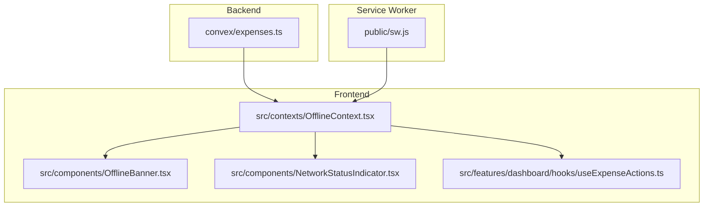

**Diagram sources**
- [OfflineContext.tsx](file://src/contexts/OfflineContext.tsx)
- [sw.js](file://public/sw.js)
- [OfflineBanner.tsx](file://src/components/OfflineBanner.tsx)
- [NetworkStatusIndicator.tsx](file://src/components/NetworkStatusIndicator.tsx)
- [useExpenseActions.ts](file://src/features/dashboard/hooks/useExpenseActions.ts)
- [expenses.ts](file://convex/expenses.ts)

**Section sources**
- [OfflineContext.tsx](file://src/contexts/OfflineContext.tsx)
- [sw.js](file://public/sw.js)

## Core Components
The core components of the offline system include the OfflineContext which manages the state, localforage for IndexedDB interaction, and the service worker for network detection. The system intercepts Convex mutations when offline and queues them for later synchronization. Components like OfflineBanner and NetworkStatusIndicator consume the offline state to inform users of their connection status and pending operations.

**Section sources**
- [OfflineContext.tsx](file://src/contexts/OfflineContext.tsx)
- [OfflineBanner.tsx](file://src/components/OfflineBanner.tsx)
- [NetworkStatusIndicator.tsx](file://src/components/NetworkStatusIndicator.tsx)

## Architecture Overview
The offline architecture follows a state management pattern where network status is monitored and stored in context. When offline, expense operations are stored locally using localforage and IndexedDB. Upon reconnection, these operations are automatically synchronized with the Convex backend. The service worker caches essential application resources to ensure functionality even when offline.

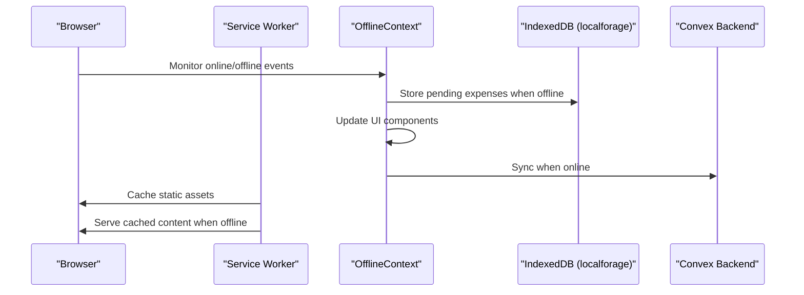

**Diagram sources**
- [OfflineContext.tsx](file://src/contexts/OfflineContext.tsx)
- [sw.js](file://public/sw.js)

## Detailed Component Analysis

### OfflineContext Analysis
The OfflineContext component is the central piece of the offline management system. It uses React Context to provide offline state and functionality to consuming components. The context manages the online status, pending expenses queue, and synchronization logic.

```mermaid
classDiagram
class OfflineContext {
+isOnline : boolean
+pendingExpenses : PendingExpense[]
+addPendingExpense(expense) : Promise~void~
+syncPendingExpenses() : Promise~void~
+retryFailedExpense(expenseId) : Promise~void~
+localFirstClient : LocalFirstConvexClient
+conflictState : ConflictState
+syncStatus : SyncStatus
+lastSyncTime : Date
+checkForConflicts() : Promise~void~
+resolveConflict(action) : Promise~void~
+dismissConflict() : void
+forceSyncToCloud() : Promise~void~
+downloadCloudData() : Promise~void~
+getSyncStatistics() : Promise~SyncStatistics~
}
class PendingExpense {
+id : string
+amount : number
+title : string
+category : string[]
+for : string[]
+date : number
+status : ExpenseStatus
}
class ConflictState {
+hasConflicts : boolean
+conflictResult : ConflictDetectionResult
+isResolving : boolean
+lastDetectionTime : Date
}
enum ExpenseStatus {
pending
syncing
synced
failed
}
OfflineContext --> PendingExpense : "contains"
OfflineContext --> ConflictState : "manages"
OfflineContext --> LocalFirstConvexClient : "uses"
```

**Diagram sources**
- [OfflineContext.tsx](file://src/contexts/OfflineContext.tsx#L13-L43)

**Section sources**
- [OfflineContext.tsx](file://src/contexts/OfflineContext.tsx#L0-L171)

### Offline Data Storage Mechanism
The system uses localforage to interface with IndexedDB for persistent offline data storage. This provides a simple key-value storage API with promise-based operations that work across browsers.

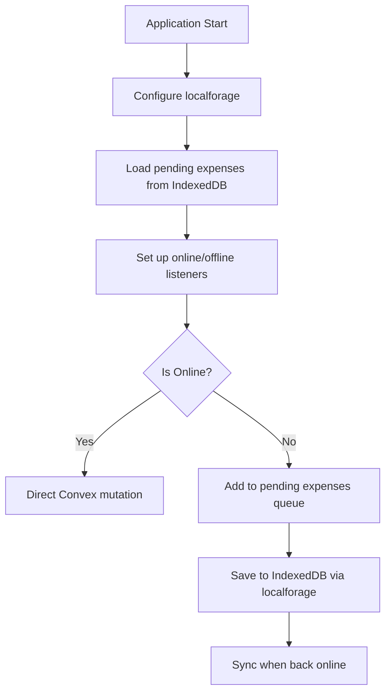

**Diagram sources**
- [OfflineContext.tsx](file://src/contexts/OfflineContext.tsx#L45-L90)

### Mutation Interception and Queuing
When offline, the system intercepts Convex mutations by queuing them in IndexedDB instead of sending them directly to the backend. This ensures data persistence and allows for synchronization when connectivity is restored.

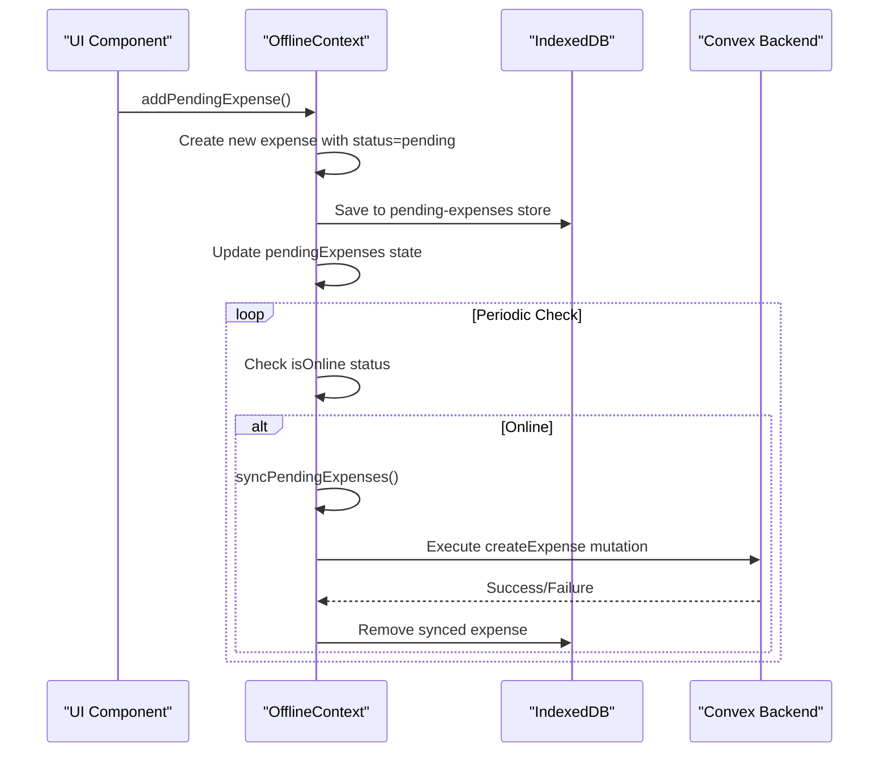

**Diagram sources**
- [OfflineContext.tsx](file://src/contexts/OfflineContext.tsx#L92-L128)

### Service Worker Integration
The service worker (sw.js) handles network detection and resource caching, working in conjunction with the OfflineContext to provide a seamless offline experience.

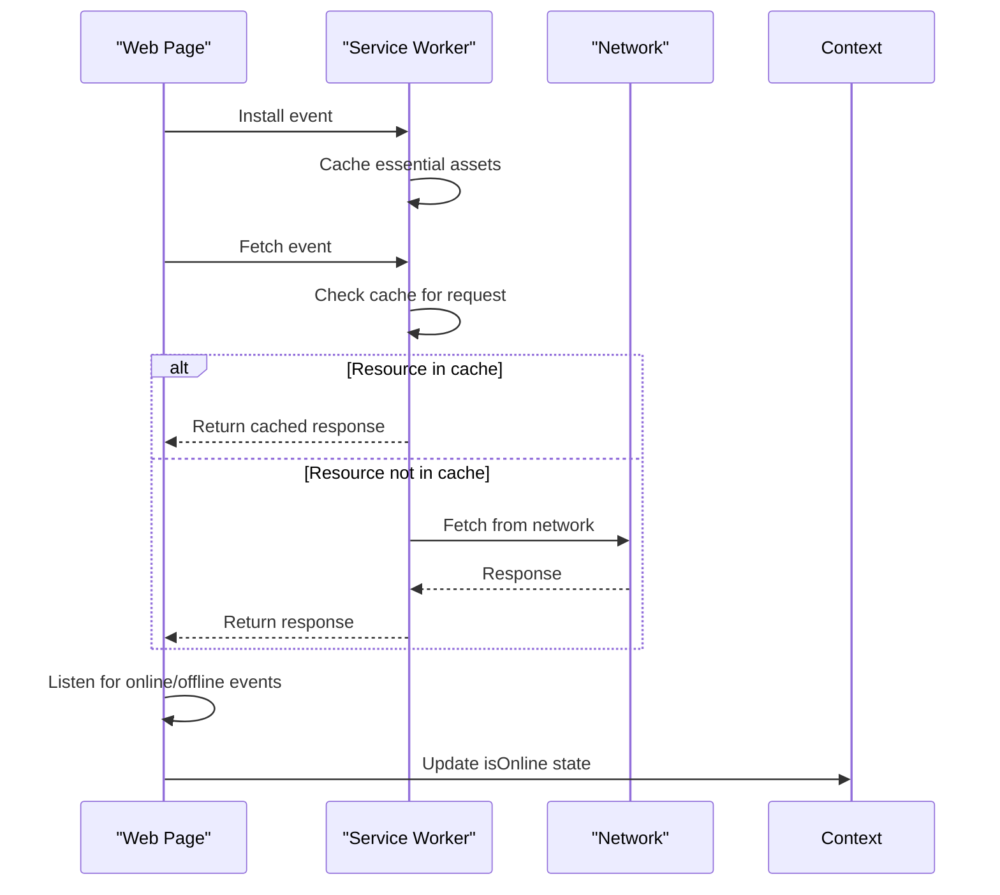

**Diagram sources**
- [sw.js](file://public/sw.js#L0-L48)

### User Interface Components
UI components consume the offline state to provide feedback to users about their connection status and pending operations.

#### OfflineBanner Component
The OfflineBanner displays a notification when the user is offline, showing the number of pending expenses that will sync when connectivity is restored.

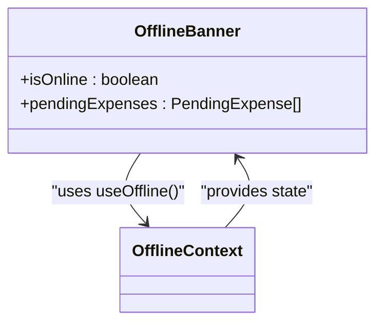

**Diagram sources**
- [OfflineBanner.tsx](file://src/components/OfflineBanner.tsx#L0-L25)

#### NetworkStatusIndicator Component
The NetworkStatusIndicator provides a visual indicator of the current network status in the corner of the screen.

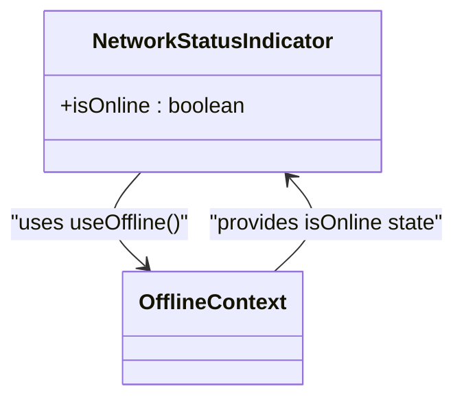

**Diagram sources**
- [NetworkStatusIndicator.tsx](file://src/components/NetworkStatusIndicator.tsx#L0-L21)

### useExpenseActions Hook Integration
The useExpenseActions hook interacts with the OfflineContext to handle expense operations seamlessly, whether online or offline.

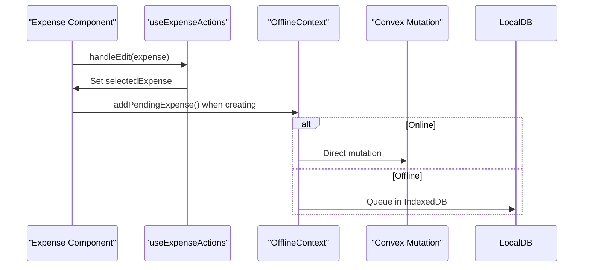

**Section sources**
- [useExpenseActions.ts](file://src/features/dashboard/hooks/useExpenseActions.ts#L0-L15)

### Enhanced Local-First Architecture
The system has been upgraded to a comprehensive local-first architecture with dedicated components for data management, synchronization, and conflict detection.

#### LocalStorageManager
The LocalStorageManager class provides a structured interface for local data operations using IndexedDB via localforage abstraction. It handles all CRUD operations, data export/import, and storage management.

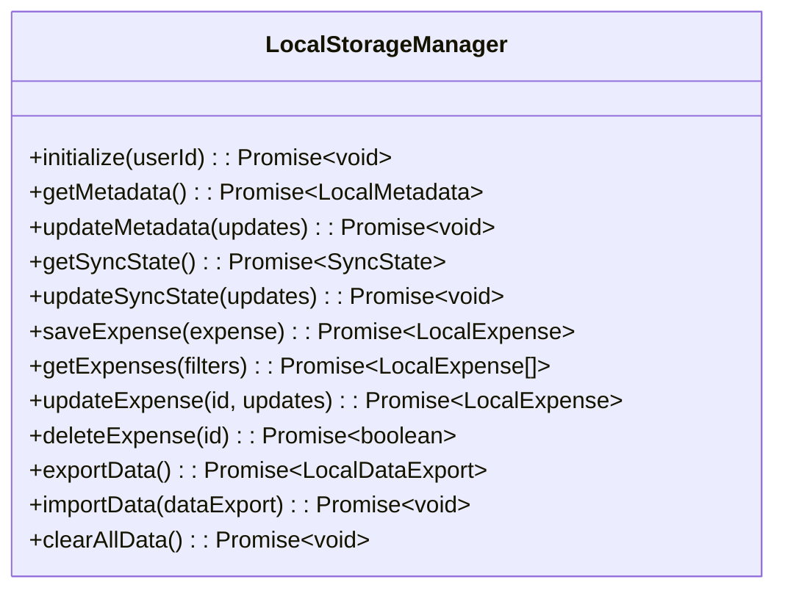

**Section sources**
- [LocalStorageManager.ts](file://src/lib/storage/LocalStorageManager.ts#L0-L487)

#### CloudSyncManager
The CloudSyncManager handles all cloud synchronization operations with robust error handling, retry mechanisms, and intelligent conflict detection.

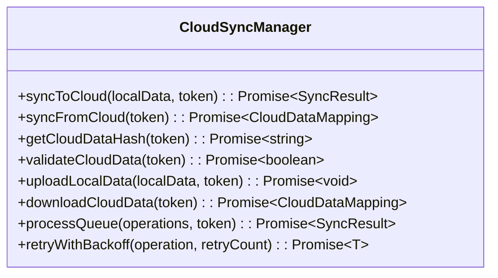

**Section sources**
- [CloudSyncManager.ts](file://src/lib/sync/CloudSyncManager.ts#L0-L663)

#### ConflictDetector
The ConflictDetector provides comprehensive conflict detection capabilities for local-first data synchronization using hash-based comparison and intelligent analysis.

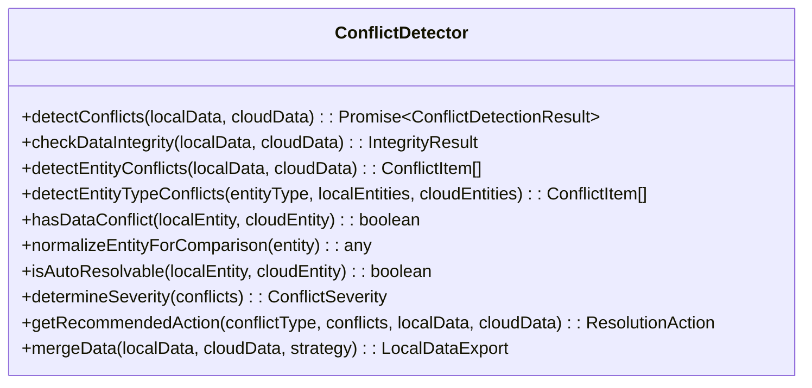

**Section sources**
- [ConflictDetector.ts](file://src/lib/sync/ConflictDetector.ts#L0-L491)

#### LocalFirstConvexClient
The LocalFirstConvexClient provides a seamless API wrapper that prioritizes local storage operations while managing cloud synchronization in the background.

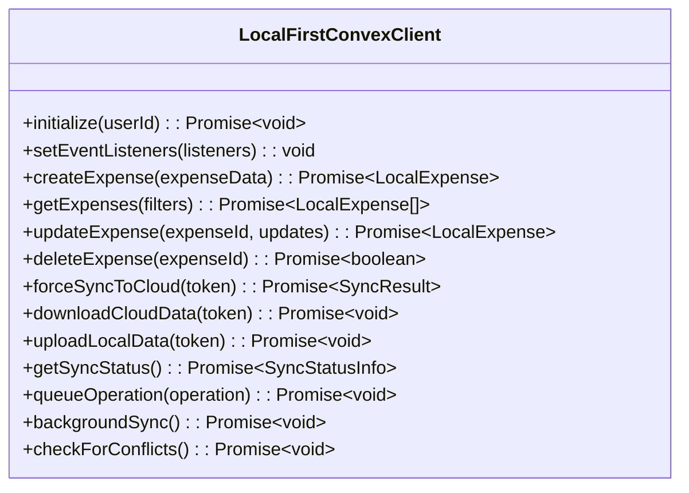

**Section sources**
- [LocalFirstConvexClient.ts](file://src/lib/client/LocalFirstConvexClient.ts#L0-L666)

## Dependency Analysis
The offline system has a well-defined dependency structure with clear boundaries between components.

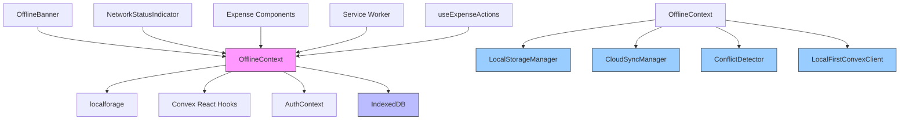

**Diagram sources**
- [OfflineContext.tsx](file://src/contexts/OfflineContext.tsx)
- [package.json](file://package.json)
- [LocalStorageManager.ts](file://src/lib/storage/LocalStorageManager.ts)
- [CloudSyncManager.ts](file://src/lib/sync/CloudSyncManager.ts)
- [ConflictDetector.ts](file://src/lib/sync/ConflictDetector.ts)
- [LocalFirstConvexClient.ts](file://src/lib/client/LocalFirstConvexClient.ts)

## Performance Considerations
The offline system includes several performance optimizations:

1. **Batch Processing**: The syncPendingExpenses function processes all pending expenses in sequence, minimizing network requests.
2. **Memory Management**: Pending expenses are stored in IndexedDB rather than memory, preventing memory leaks with large datasets.
3. **Efficient State Updates**: The context uses React's useState with functional updates to ensure efficient re-renders.
4. **Caching Strategy**: The service worker caches static assets, reducing network load and improving load times.
5. **Background Sync**: The system performs background synchronization and conflict detection to avoid blocking the main thread.
6. **Exponential Backoff**: Failed operations use exponential backoff with jitter to prevent thundering herd problems.

The system handles large datasets by storing them in IndexedDB rather than component state, and only loads pending expenses into memory when needed. The batch synchronization process ensures that network requests are minimized when connectivity is restored.

**Section sources**
- [OfflineContext.tsx](file://src/contexts/OfflineContext.tsx)
- [sw.js](file://public/sw.js)
- [CloudSyncManager.ts](file://src/lib/sync/CloudSyncManager.ts)
- [LocalStorageManager.ts](file://src/lib/storage/LocalStorageManager.ts)

## Troubleshooting Guide
Common issues and their solutions:

1. **Pending expenses not syncing**: Ensure the user is authenticated and online. Check browser console for errors. Verify that the token is properly passed to mutation functions.
2. **Data loss concerns**: Verify that localforage is properly saving to IndexedDB by checking browser storage tools. Check that LocalStorageManager is properly initialized with the user ID.
3. **Service worker not caching**: Check that the service worker is registered and that the cache names match. Verify that the service worker has the correct scope.
4. **Conflict resolution**: The system now includes comprehensive conflict detection and resolution. Check the conflictState in OfflineContext to see if conflicts are detected. Use the checkForConflicts method to manually trigger detection.
5. **Authentication errors during sync**: The system now includes specific error handling for authentication errors. Ensure the user's session is valid and the token is refreshed when needed.

Error handling is implemented with try-catch blocks around localforage operations and Convex mutations, with errors logged to the console. Failed operations are marked with 'failed' status and can be retried manually. The system distinguishes between retryable errors (network issues, timeouts) and non-retryable errors (authentication failures, validation errors).

**Section sources**
- [OfflineContext.tsx](file://src/contexts/OfflineContext.tsx)
- [expenses.ts](file://convex/expenses.ts)
- [CloudSyncManager.ts](file://src/lib/sync/CloudSyncManager.ts)
- [LocalFirstConvexClient.ts](file://src/lib/client/LocalFirstConvexClient.ts)

## Conclusion
The Offline Context Management system provides a comprehensive solution for offline functionality in the Expense Tracker application. By leveraging localforage and IndexedDB for persistent storage, intercepting Convex mutations when offline, and integrating with a service worker for network detection, the system ensures a seamless user experience regardless of connectivity. The architecture is well-structured with clear separation of concerns, making it maintainable and extensible.

The recent enhancements have introduced a robust local-first architecture with dedicated components for data management, synchronization, and conflict detection. This includes the LocalStorageManager for structured local data operations, CloudSyncManager for reliable cloud synchronization with retry mechanisms, ConflictDetector for comprehensive conflict analysis, and LocalFirstConvexClient for a seamless API wrapper that prioritizes local operations.

Future improvements could include more sophisticated conflict resolution strategies with user interface components for manual conflict resolution, enhanced data encryption for sensitive financial data, and improved performance monitoring for synchronization operations.