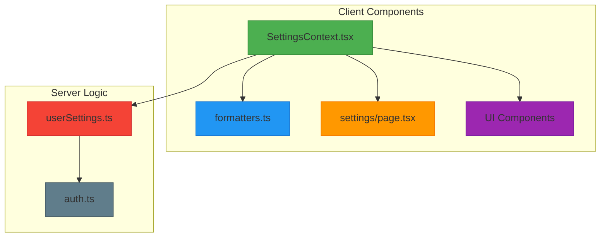
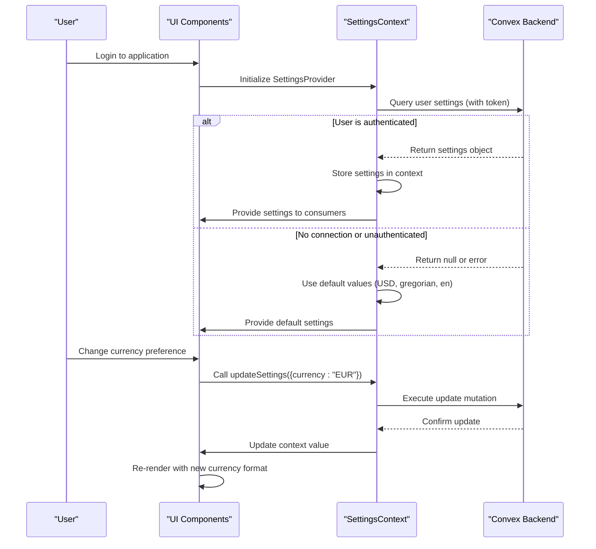
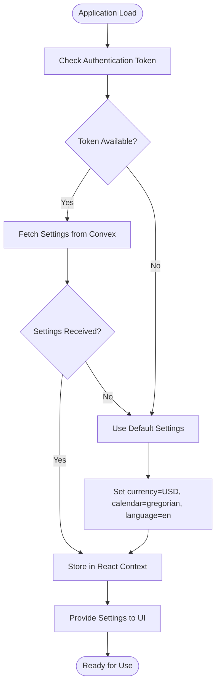
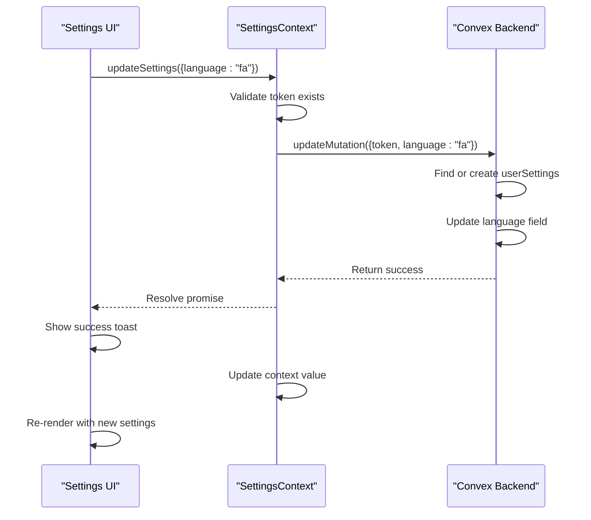
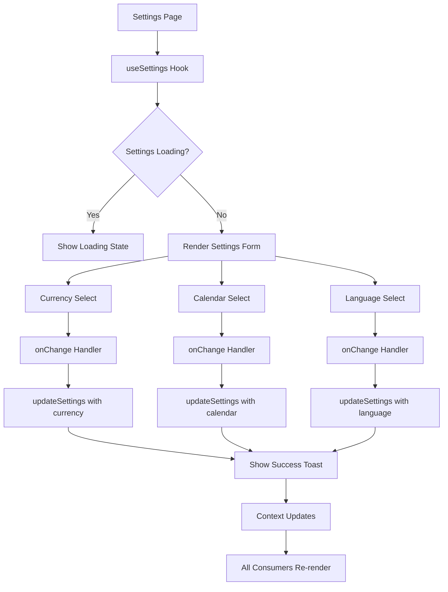
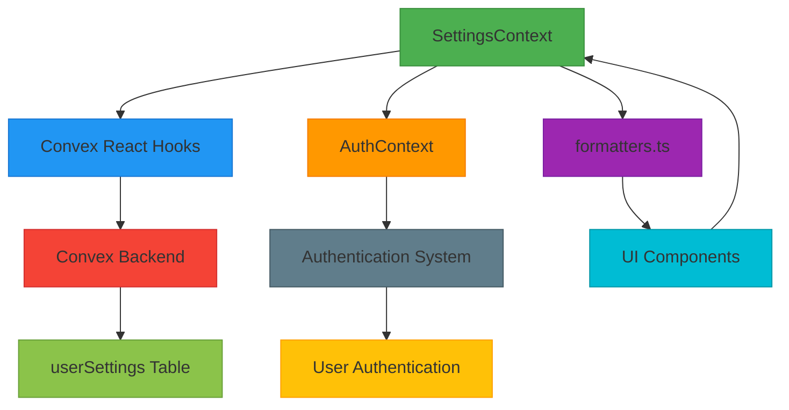

# Settings Context Management

<cite>
**Referenced Files in This Document**   
- [SettingsContext.tsx](file://src/contexts/SettingsContext.tsx) - *Updated to include language preference support*
- [formatters.ts](file://src/lib/formatters.ts)
- [userSettings.ts](file://convex/userSettings.ts) - *Updated to include language field*
- [settings/page.tsx](file://src/app/settings/page.tsx) - *Updated with language selector UI*
- [AuthContext.tsx](file://src/contexts/AuthContext.tsx)
- [ExpenseCard.tsx](file://src/components/cards/ExpenseCard.tsx)
- [CategoryBreakdownChart.tsx](file://src/features/dashboard/components/Charts/CategoryBreakdownChart.tsx)
</cite>

## Update Summary
**Changes Made**   
- Updated documentation to reflect addition of language preference management in SettingsContext
- Added details about new language setting type and its integration across the system
- Enhanced architecture diagrams to include language flow
- Updated settings initialization and persistence sections to include language field
- Modified formatter integration section to reflect potential future localization use
- Added troubleshooting guidance for language-related issues

## Table of Contents
1. [Introduction](#introduction)
2. [Project Structure](#project-structure)
3. [Core Components](#core-components)
4. [Architecture Overview](#architecture-overview)
5. [Detailed Component Analysis](#detailed-component-analysis)
6. [Dependency Analysis](#dependency-analysis)
7. [Performance Considerations](#performance-considerations)
8. [Troubleshooting Guide](#troubleshooting-guide)
9. [Conclusion](#conclusion)

## Introduction
The SettingsContext system provides centralized management of user preferences in the Expense Tracker application. It enables users to customize their experience through currency format, calendar system, and language selections, which are then applied consistently across the entire user interface. The system integrates with Convex for cloud-based persistence while providing offline capabilities through local storage fallback mechanisms. This documentation details the implementation, integration points, and extension possibilities for the SettingsContext state management system.

## Project Structure
The SettingsContext system is organized across multiple directories following a feature-based architecture pattern. The core context implementation resides in the contexts directory, while related functionality is distributed across components, lib, and server-side convex modules.



**Diagram sources**
- [SettingsContext.tsx](file://src/contexts/SettingsContext.tsx)
- [formatters.ts](file://src/lib/formatters.ts)
- [userSettings.ts](file://convex/userSettings.ts)

**Section sources**
- [SettingsContext.tsx](file://src/contexts/SettingsContext.tsx)
- [formatters.ts](file://src/lib/formatters.ts)

## Core Components
The SettingsContext system comprises several core components that work together to manage user preferences. The primary component is the SettingsContext itself, which provides a React Context for consuming settings throughout the application. This is complemented by the formatters utility that applies the settings to UI elements, and the server-side userSettings module that handles data persistence.

**Section sources**
- [SettingsContext.tsx](file://src/contexts/SettingsContext.tsx#L1-L58)
- [formatters.ts](file://src/lib/formatters.ts#L1-L49)
- [userSettings.ts](file://convex/userSettings.ts#L1-L60)

## Architecture Overview
The SettingsContext follows a client-server architecture with React Context serving as the state management layer on the client side and Convex providing the backend persistence layer. The system initializes settings on login by fetching from Convex, with automatic fallback to local defaults when offline.



**Diagram sources**
- [SettingsContext.tsx](file://src/contexts/SettingsContext.tsx#L1-L58)
- [userSettings.ts](file://convex/userSettings.ts#L1-L60)

## Detailed Component Analysis

### SettingsContext Implementation
The SettingsContext implementation provides a clean API for consuming and updating user preferences. It leverages React Context for state distribution and Convex hooks for data synchronization. The recent update adds language preference management to the existing currency and calendar settings.

```mermaid
classDiagram
class SettingsContextType {
+settings : Doc<"userSettings"> | null | undefined
+updateSettings(args : {currency? : Currency, calendar? : Calendar, language? : Language}) : Promise<void>
+loading : boolean
}
class SettingsProvider {
-token : string | null
-settings : QueryResult
-updateMutation : Mutation
+value : SettingsContextType
}
class useSettings {
+returns : SettingsContextType
}
SettingsProvider --> SettingsContextType : "provides"
useSettings --> SettingsContextType : "consumes"
SettingsProvider --> "Convex" : "uses useQuery"
SettingsProvider --> "Convex" : "uses useMutation"
```

**Diagram sources**
- [SettingsContext.tsx](file://src/contexts/SettingsContext.tsx#L1-L58)

**Section sources**
- [SettingsContext.tsx](file://src/contexts/SettingsContext.tsx#L1-L58)

### Settings Initialization Process
The SettingsContext initializes user preferences through a well-defined process that prioritizes cloud data while providing offline resilience. When a user logs in, the system attempts to fetch their saved settings from Convex using their authentication token. The initialization now includes the language preference with a default value of "en" (English).



**Diagram sources**
- [SettingsContext.tsx](file://src/contexts/SettingsContext.tsx#L1-L58)
- [AuthContext.tsx](file://src/contexts/AuthContext.tsx#L1-L97)

**Section sources**
- [SettingsContext.tsx](file://src/contexts/SettingsContext.tsx#L1-L58)

### Settings Persistence and Synchronization
The system implements a robust persistence strategy that ensures settings are saved both locally and in the cloud. When users modify their preferences, the changes are immediately propagated through the context system and asynchronously synced to Convex. The update mutation now includes the language field.



**Diagram sources**
- [SettingsContext.tsx](file://src/contexts/SettingsContext.tsx#L1-L58)
- [userSettings.ts](file://convex/userSettings.ts#L1-L60)

**Section sources**
- [SettingsContext.tsx](file://src/contexts/SettingsContext.tsx#L1-L58)

### Formatter Integration
The formatters.ts module demonstrates tight integration with SettingsContext, consuming the current settings to dynamically format currency and date values across the application interface. While the current implementation doesn't use the language setting, it's available for future localization enhancements.

```mermaid
classDiagram
class formatCurrency {
+amount : number
+currency : Currency
+returns : string
}
class formatDate {
+date : number | Date
+calendar : Calendar
+formatString : string
+returns : string
}
class currencySymbols {
+USD : "$"
+EUR : "€"
+GBP : "£"
+IRR : "T"
}
class SettingsContext {
+settings : object
}
SettingsContext --> formatCurrency : "provides currency"
SettingsContext --> formatDate : "provides calendar"
formatCurrency --> currencySymbols : "uses"
formatDate --> "jalali-moment" : "uses"
formatDate --> "date-fns" : "uses"
```

**Diagram sources**
- [formatters.ts](file://src/lib/formatters.ts#L1-L49)
- [SettingsContext.tsx](file://src/contexts/SettingsContext.tsx#L1-L58)

**Section sources**
- [formatters.ts](file://src/lib/formatters.ts#L1-L49)

### Settings Page Implementation
The settings page provides the user interface for modifying preferences, demonstrating how context consumers interact with the SettingsContext API to enable real-time updates. The UI now includes a language selector that allows users to switch between English ("en") and Persian ("fa").



**Diagram sources**
- [settings/page.tsx](file://src/app/settings/page.tsx#L1-L235)
- [SettingsContext.tsx](file://src/contexts/SettingsContext.tsx#L1-L58)

**Section sources**
- [settings/page.tsx](file://src/app/settings/page.tsx#L1-L235)

## Dependency Analysis
The SettingsContext system has well-defined dependencies that enable its functionality while maintaining separation of concerns. The client-side context depends on Convex for data persistence and AuthContext for authentication state.



**Diagram sources**
- [SettingsContext.tsx](file://src/contexts/SettingsContext.tsx#L1-L58)
- [formatters.ts](file://src/lib/formatters.ts#L1-L49)
- [userSettings.ts](file://convex/userSettings.ts#L1-L60)

**Section sources**
- [SettingsContext.tsx](file://src/contexts/SettingsContext.tsx#L1-L58)

## Performance Considerations
The SettingsContext implementation is optimized for performance through several mechanisms. The use of React Context ensures that only components that consume settings are re-rendered when settings change. Convex's real-time subscriptions automatically update the context when settings are modified, eliminating the need for manual polling.

The formatters are designed to be lightweight and synchronous, ensuring that UI rendering is not blocked by formatting operations. Default values are used to prevent rendering delays when settings are being loaded, providing a smooth user experience even on slow connections.

The system minimizes network requests by fetching settings only once per session and relying on Convex's real-time updates for any changes made from other clients.

## Troubleshooting Guide
When troubleshooting issues with the SettingsContext system, consider the following common scenarios and their solutions:

**Section sources**
- [SettingsContext.tsx](file://src/contexts/SettingsContext.tsx#L1-L58)
- [userSettings.ts](file://convex/userSettings.ts#L1-L60)
- [settings/page.tsx](file://src/app/settings/page.tsx#L1-L235)

### Authentication Token Missing
**Symptom**: Settings cannot be loaded or updated, with console errors about missing authentication token.
**Solution**: Ensure the user is properly authenticated and the token is available in AuthContext. Verify that the AuthProvider is properly wrapped around the SettingsProvider in the component hierarchy.

### Settings Not Persisting
**Symptom**: Changes to settings appear to succeed but are not saved to the database.
**Solution**: Check the Convex dashboard for mutation errors. Verify that the userSettings table has the proper indexes and that the update mutation has the correct permissions configured.

### Formatting Issues
**Symptom**: Currency or date formatting displays incorrectly or shows raw values.
**Solution**: Ensure that components are properly handling the case where settings are still loading (settings === undefined). Implement appropriate fallback formatting using default values (USD, gregorian, en) during the loading state.

### Language Setting Not Applied
**Symptom**: Language setting changes successfully but UI text doesn't update.
**Solution**: The current implementation stores the language preference but doesn't yet implement full UI localization. This setting is currently stored for future localization implementation. Consider integrating a i18n library to utilize the stored language preference.

### Offline Behavior Problems
**Symptom**: Settings changes are not preserved when offline.
**Solution**: While the current implementation does not include local storage for settings, consider implementing localStorage fallback in the SettingsProvider to cache the last known settings state for offline use.

## Conclusion
The SettingsContext system provides a robust solution for managing user preferences in the Expense Tracker application. By leveraging React Context and Convex, it delivers a seamless experience that works both online and offline. The system's architecture enables consistent formatting across the UI while providing a clean API for settings management.

To extend the system with new preference types, developers should update the TypeScript types in SettingsContext, modify the Convex schema and validation rules, and add corresponding UI controls in the settings page. The existing pattern provides a clear template for adding new settings while maintaining type safety and proper error handling.

The integration with formatters demonstrates how application-wide consistency can be achieved through centralized state management, making it easy to support additional currencies, calendar systems, or other localization features in the future. The recent addition of language preference management lays the groundwork for full application localization in upcoming releases.