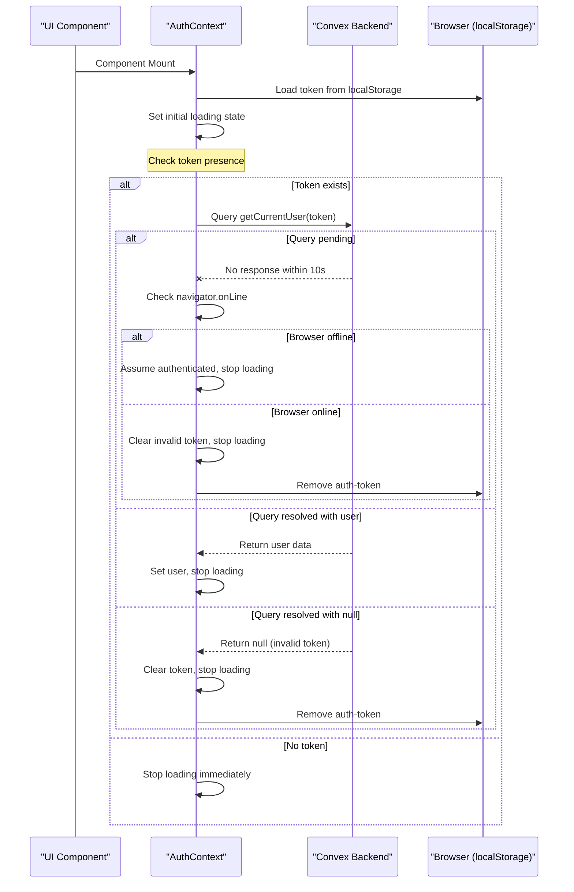
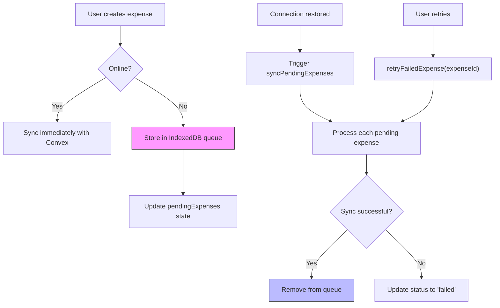
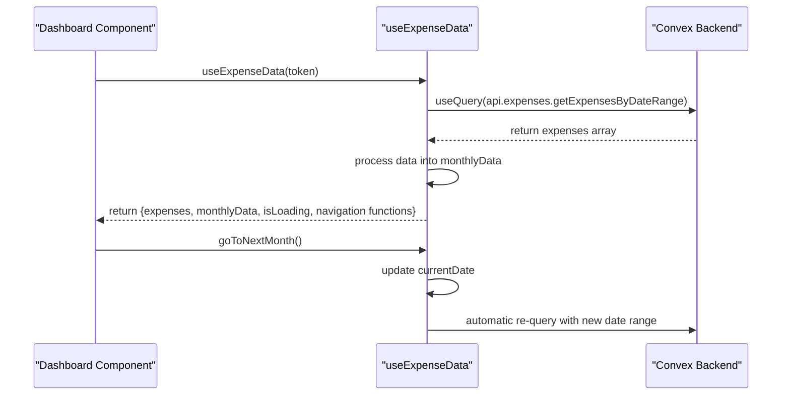
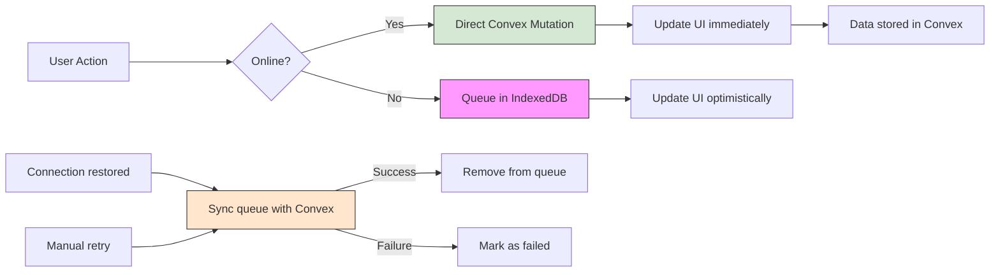

# State Management Patterns

<cite>
**Referenced Files in This Document**   
- [AuthContext.tsx](file://src/contexts/AuthContext.tsx) - *Updated in recent commit*
- [SettingsContext.tsx](file://src/contexts/SettingsContext.tsx) - *Updated in recent commit*
- [OfflineContext.tsx](file://src/contexts/OfflineContext.tsx)
- [useExpenseData.ts](file://src/features/dashboard/hooks/useExpenseData.ts)
- [useExpenseActions.ts](file://src/features/dashboard/hooks/useExpenseActions.ts)
- [auth.ts](file://convex/auth.ts)
- [expenses.ts](file://convex/expenses.ts)
- [userSettings.ts](file://convex/userSettings.ts)
</cite>

## Update Summary
**Changes Made**   
- Updated **AuthContext** section to include new timeout mechanism and automatic token invalidation logic
- Added details about 10-second timeout for authentication queries and handling of offline scenarios
- Enhanced explanation of token invalidation when user query returns null
- Updated sequence diagram to reflect timeout and offline handling behavior
- Added reference to useAuthErrorHandler hook for global authentication error handling
- Maintained all other sections as no changes were made to SettingsContext or OfflineContext

## Table of Contents
1. [Introduction](#introduction)
2. [Core State Management Contexts](#core-state-management-contexts)
3. [Custom Hooks for Feature-Specific Logic](#custom-hooks-for-feature-specific-logic)
4. [Architecture Overview](#architecture-overview)
5. [Detailed Component Analysis](#detailed-component-analysis)
6. [Performance Considerations](#performance-considerations)
7. [Conclusion](#conclusion)

## Introduction
This document provides a comprehensive analysis of the state management architecture in the Expense Tracker application. The system leverages React Context for global state management and custom hooks for feature-specific logic abstraction. Key components include authentication, offline data synchronization, user preferences, and expense data handling, all integrated with Convex as the backend. The architecture emphasizes separation of concerns, reusability, and robust error handling while supporting offline-first functionality. Recent updates have enhanced the authentication flow with a 10-second timeout mechanism and improved token invalidation logic when user data cannot be retrieved.

## Core State Management Contexts

### AuthContext: Authentication State Management
The `AuthContext` manages user authentication state using Convex backend functions and localStorage persistence. It provides a centralized mechanism for login, registration, and logout operations while maintaining session state across page reloads. The recent update introduced a 10-second timeout mechanism to prevent infinite loading states and implemented automatic token invalidation when the user query returns null, enhancing reliability in both online and offline scenarios.

Key features:
- **Token persistence**: Authentication tokens are stored in localStorage to maintain sessions
- **Loading state**: Tracks initialization and authentication operation status with timeout protection
- **User data**: Stores current user information retrieved from Convex
- **Error handling**: Propagates authentication errors to consumers and handles token invalidation
- **Timeout mechanism**: Implements 10-second timeout for authentication queries to prevent hanging states
- **Offline support**: Gracefully handles offline scenarios by assuming authentication when token exists



**Section sources**
- [AuthContext.tsx](file://src/contexts/AuthContext.tsx#L1-L152)
- [auth.ts](file://convex/auth.ts#L115-L134)
- [useAuthErrorHandler.ts](file://src/hooks/useAuthErrorHandler.ts#L1-L38)

**Diagram sources**
- [AuthContext.tsx](file://src/contexts/AuthContext.tsx#L43-L95)
- [auth.ts](file://convex/auth.ts#L115-L134)

### OfflineContext: Offline Data Synchronization
The `OfflineContext` implements an offline-first strategy using localforage to persist data in IndexedDB and synchronize with Convex when online. It manages a queue of pending operations and handles retry logic for failed sync attempts.

Key features:
- **IndexedDB storage**: Uses localforage for persistent offline storage
- **Connection monitoring**: Listens to browser online/offline events
- **Operation queue**: Maintains pending expenses with status tracking
- **Automatic sync**: Attempts to sync pending operations when connection is restored
- **Manual retry**: Allows users to retry individual failed operations



**Diagram sources**
- [OfflineContext.tsx](file://src/contexts/OfflineContext.tsx#L1-L172)

**Section sources**
- [OfflineContext.tsx](file://src/contexts/OfflineContext.tsx#L1-L172)

### SettingsContext: User Preferences Management
The `SettingsContext` handles user preferences such as currency, calendar, and language settings. It synchronizes settings between the frontend and Convex backend, providing a simple interface for updating user-specific configurations. The recent update added language preference support, allowing users to select between English and Persian (Farsi) interfaces.

Key features:
- **Type-safe settings**: Uses Convex data model types for currency, calendar, and language
- **Conditional queries**: Skips queries when token is unavailable
- **Loading state**: Indicates when settings are being fetched
- **Update mechanism**: Provides a clean API for modifying user preferences
- **Language support**: New functionality for interface language selection

```mermaid
classDiagram
class SettingsContextType {
+settings : Doc<"userSettings"> | null | undefined
+updateSettings(args : {currency? : Currency, calendar? : Calendar, language? : Language}) : Promise<void>
+loading : boolean
}
class Currency {
<<type>>
USD
EUR
GBP
IRR
}
class Calendar {
<<type>>
gregorian
jalali
}
class Language {
<<type>>
en
fa
}
SettingsContextType --> Currency : "uses"
SettingsContextType --> Calendar : "uses"
SettingsContextType --> Language : "uses"
```

**Diagram sources**
- [SettingsContext.tsx](file://src/contexts/SettingsContext.tsx#L1-L58)
- [userSettings.ts](file://convex/userSettings.ts#L1-L61)

**Section sources**
- [SettingsContext.tsx](file://src/contexts/SettingsContext.tsx#L1-L58)
- [userSettings.ts](file://convex/userSettings.ts#L39-L61)
- [settings/page.tsx](file://src/app/settings/page.tsx#L159-L183)

## Custom Hooks for Feature-Specific Logic

### useExpenseData: Data Fetching Abstraction
The `useExpenseData` custom hook abstracts the logic for fetching and processing expense data from Convex. It integrates with Convex queries to retrieve expenses for a specific date range and transforms the raw data into meaningful analytics.

Key features:
- **Date-based filtering**: Fetches expenses for the current month using date-fns utilities
- **Data processing**: Computes monthly summaries including total amount, count, and category breakdowns
- **Navigation**: Provides functions to navigate between months
- **Refetch mechanism**: Implements a key-based re-query strategy to force data refresh
- **Memoization**: Uses useMemo to optimize expensive data processing operations



**Diagram sources**
- [useExpenseData.ts](file://src/features/dashboard/hooks/useExpenseData.ts#L1-L87)
- [expenses.ts](file://convex/expenses.ts#L1-L325)

**Section sources**
- [useExpenseData.ts](file://src/features/dashboard/hooks/useExpenseData.ts#L1-L87)
- [expenses.ts](file://convex/expenses.ts#L1-L325)

### useExpenseActions: State Management for UI Interactions
The `useExpenseActions` custom hook manages the state related to user interactions with expenses, particularly the selection of expenses for editing.

Key features:
- **Selection state**: Tracks the currently selected expense for editing
- **Action handlers**: Provides functions to handle edit operations
- **Simple interface**: Exposes a minimal API focused on the specific use case

**Section sources**
- [useExpenseActions.ts](file://src/features/dashboard/hooks/useExpenseActions.ts#L1-L17)

## Architecture Overview

```mermaid
graph TB
subgraph "Global State Contexts"
AuthContext["AuthContext<br/>Authentication & Session"]
OfflineContext["OfflineContext<br/>IndexedDB Sync"]
SettingsContext["SettingsContext<br/>User Preferences"]
end
subgraph "Feature-Specific Hooks"
useExpenseData["useExpenseData<br/>Expense Data Fetching"]
useExpenseActions["useExpenseActions<br/>UI State Management"]
end
subgraph "Backend Integration"
Convex["Convex Backend<br/>Queries & Mutations"]
LocalStorage["localStorage<br/>Token Persistence"]
IndexedDB["IndexedDB<br/>localforage"]
end
AuthContext --> Convex
AuthContext --> LocalStorage
OfflineContext --> Convex
OfflineContext --> IndexedDB
SettingsContext --> Convex
useExpenseData --> Convex
useExpenseActions --> null
style AuthContext fill:#e6f3ff,stroke:#333
style OfflineContext fill:#e6f3ff,stroke:#333
style SettingsContext fill:#e6f3ff,stroke:#333
style useExpenseData fill:#fff2cc,stroke:#333
style useExpenseActions fill:#fff2cc,stroke:#333
style Convex fill:#d5e8d4,stroke:#333
style LocalStorage fill:#d5e8d4,stroke:#333
style IndexedDB fill:#d5e8d4,stroke:#333
Note right of AuthContext: Global state<br/>Accessible anywhere
Note right of useExpenseData: Feature-specific<br/>Dashboard only
```

**Diagram sources**
- [AuthContext.tsx](file://src/contexts/AuthContext.tsx#L1-L152)
- [OfflineContext.tsx](file://src/contexts/OfflineContext.tsx#L1-L172)
- [SettingsContext.tsx](file://src/contexts/SettingsContext.tsx#L1-L58)
- [useExpenseData.ts](file://src/features/dashboard/hooks/useExpenseData.ts#L1-L87)
- [useExpenseActions.ts](file://src/features/dashboard/hooks/useExpenseActions.ts#L1-L17)

## Detailed Component Analysis

### Context vs. Custom Hooks: Architecture Decision
The application employs a hybrid state management approach, using React Context for global state and custom hooks for feature-specific logic. This separation follows React best practices by:

- **Minimizing re-renders**: Context splitting prevents unnecessary re-renders when unrelated state changes
- **Encapsulation**: Custom hooks encapsulate complex logic behind simple interfaces
- **Reusability**: Context providers can be used across the entire application
- **Testability**: Hooks can be tested independently of UI components

The architecture demonstrates a clear distinction:
- **Context**: Used for truly global state (authentication, offline status, user settings)
- **Custom hooks**: Used for feature-specific data fetching and UI state management

### Data Flow and Synchronization
The system implements a sophisticated data flow that handles both online and offline scenarios:



**Diagram sources**
- [OfflineContext.tsx](file://src/contexts/OfflineContext.tsx#L1-L172)
- [expenses.ts](file://convex/expenses.ts#L1-L325)

## Performance Considerations

### Optimization Strategies
The state management system incorporates several performance optimizations:

- **Memoization**: The `useExpenseData` hook uses `useMemo` to prevent recalculation of monthly summaries on every render
- **Conditional queries**: Convex queries are skipped when authentication tokens are unavailable, preventing unnecessary network requests
- **Context splitting**: Separate contexts prevent global re-renders when only specific state changes
- **Efficient re-fetching**: The key-based re-query mechanism in `useExpenseData` allows controlled data refresh without remounting components

### Loading and Error States
All state management components properly handle loading and error states:

- **AuthContext**: Manages loading state during initialization and authentication operations with timeout protection
- **SettingsContext**: Indicates when settings are being fetched from the backend
- **useExpenseData**: Provides explicit loading state for expense data retrieval
- **Error boundaries**: While not explicitly shown, the architecture allows for error handling at the component level

These patterns ensure a smooth user experience by providing appropriate feedback during data loading and handling failures gracefully.

## Conclusion
The state management architecture in the Expense Tracker application demonstrates a well-structured approach to handling complex state requirements. By combining React Context for global state with custom hooks for feature-specific logic, the system achieves a balance between reusability and performance. The offline-first design using localforage and IndexedDB ensures data persistence and synchronization, while the integration with Convex provides a robust backend for data storage and retrieval. Recent enhancements have improved the authentication flow with a 10-second timeout mechanism to prevent infinite loading states and implemented automatic token invalidation when the user query returns null, making the system more resilient in various network conditions. The architecture follows React best practices with proper separation of concerns, memoization for performance, and comprehensive error handling, resulting in a scalable and maintainable state management solution.