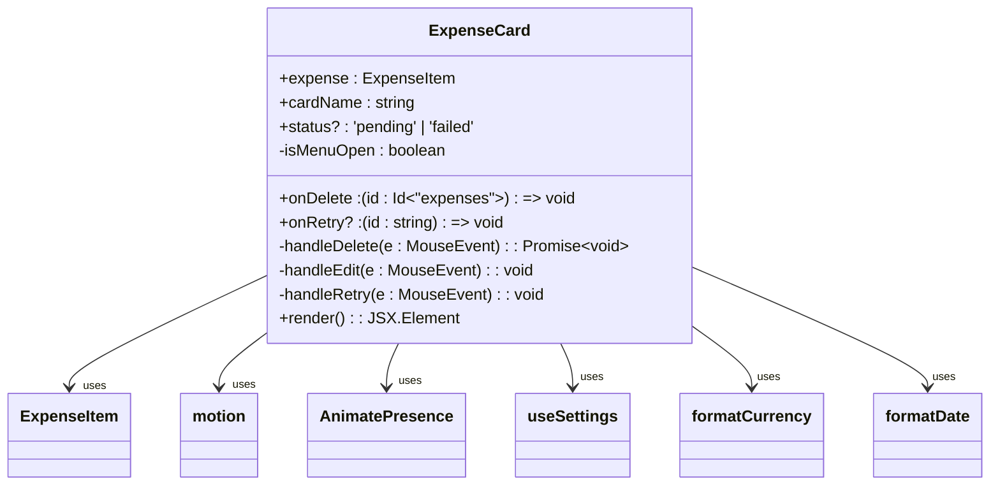
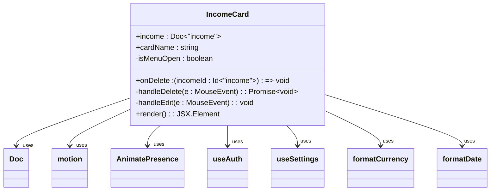
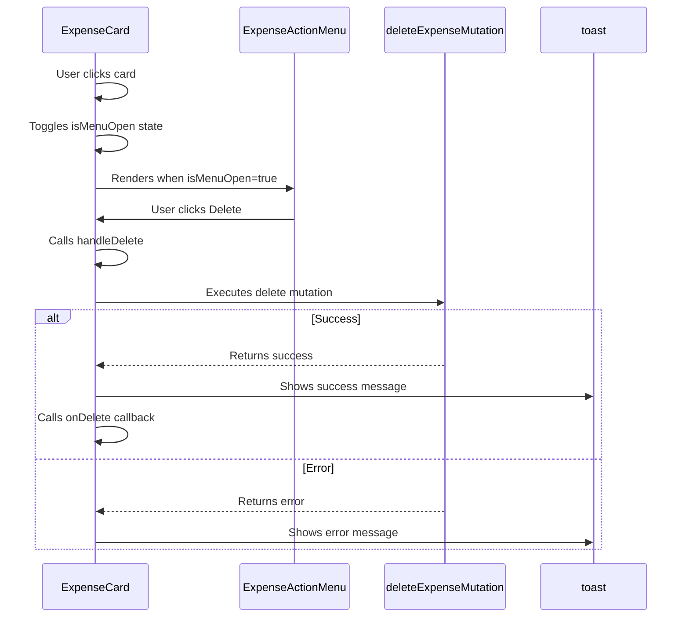
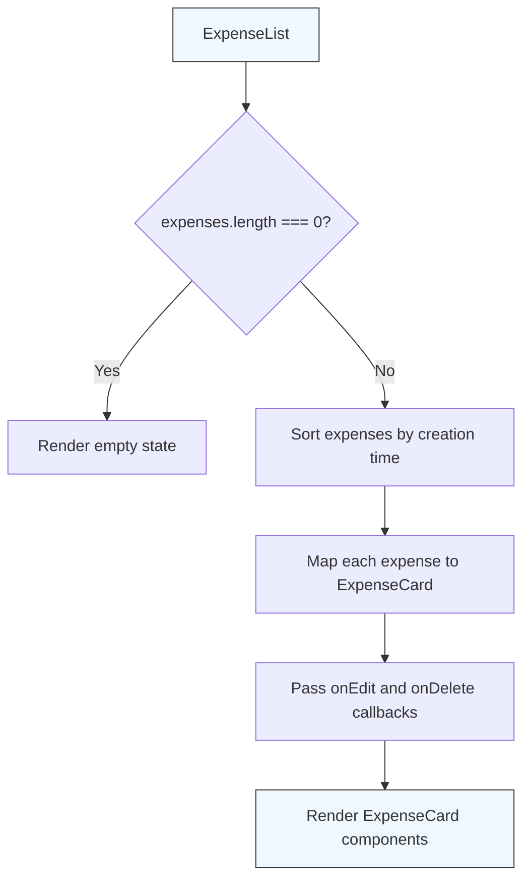
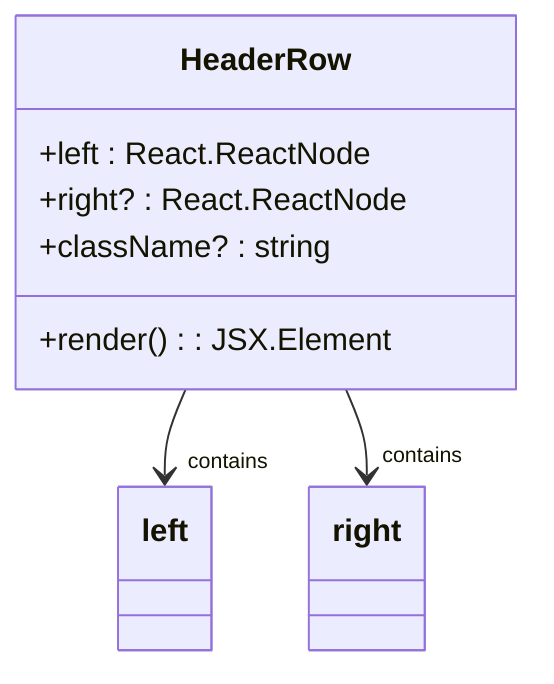
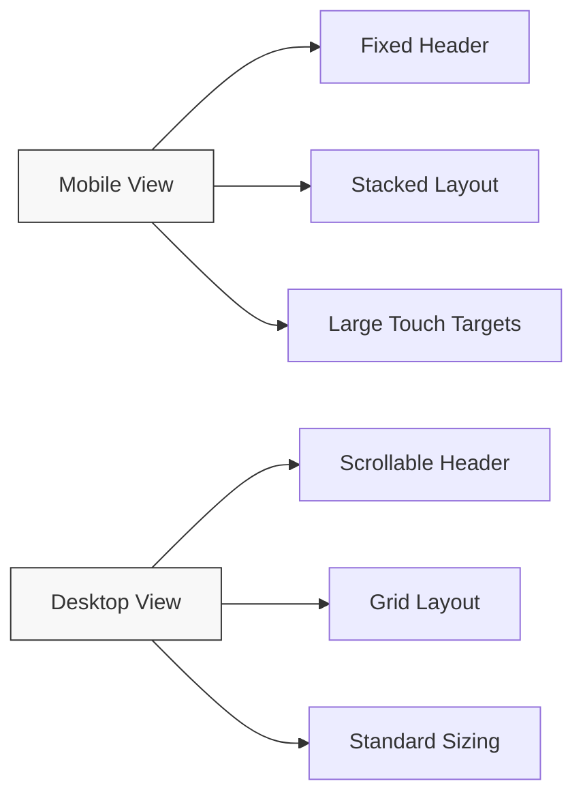
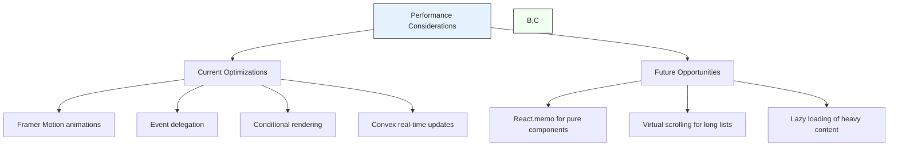
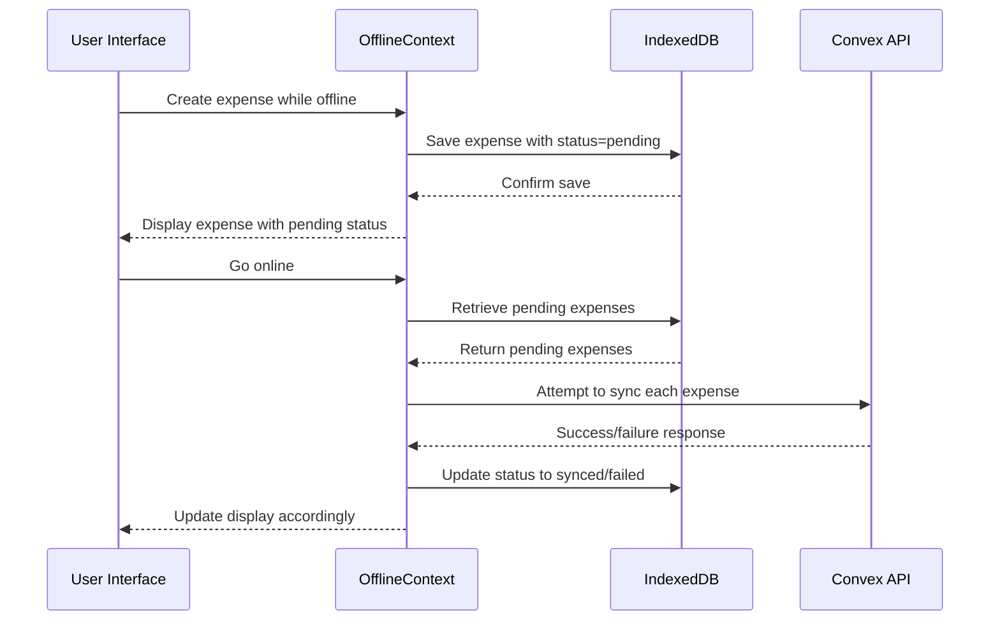

# Card Components and UI Composition Patterns

<cite>
**Referenced Files in This Document**   
- [ExpenseCard.tsx](file://src/components/cards/ExpenseCard.tsx) - *Updated with offline status support in commit 16*
- [IncomeCard.tsx](file://src/components/cards/IncomeCard.tsx)
- [ExpenseCard.tsx](file://src/features/dashboard/components/Expenses/ExpenseCard.tsx)
- [ExpenseList.tsx](file://src/features/dashboard/components/Expenses/ExpenseList.tsx)
- [SmartSelectInput.tsx](file://src/components/SmartSelectInput.tsx)
- [CustomDatePicker.tsx](file://src/components/CustomDatePicker.tsx)
- [HeaderRow.tsx](file://src/components/HeaderRow.tsx)
- [expenses/page.tsx](file://src/app/expenses/page.tsx)
- [OfflineBanner.tsx](file://src/components/OfflineBanner.tsx) - *Added offline status support*
- [OfflineContext.tsx](file://src/contexts/OfflineContext.tsx) - *Added offline expense tracking*
</cite>

## Update Summary
**Changes Made**   
- Updated **Shared Card Components Analysis** section to reflect new offline status functionality in ExpenseCard
- Added documentation for offline status indicators and retry functionality
- Updated props interface documentation for ExpenseCard to include new onRetry and status props
- Enhanced **Performance Considerations** section to include offline queue management
- Added new **Offline Status and Synchronization** section to document offline capabilities
- Updated file references to include OfflineBanner and OfflineContext components

## Table of Contents
1. [Card-Based UI Composition Strategy](#card-based-ui-composition-strategy)
2. [Shared Card Components Analysis](#shared-card-components-analysis)
3. [Dashboard-Specific ExpenseCard](#dashboard-specific-expensecard)
4. [Component Composition Pattern](#component-composition-pattern)
5. [Styling Implementation with Tailwind CSS](#styling-implementation-with-tailwind-css)
6. [Responsive Design and Accessibility](#responsive-design-and-accessibility)
7. [Performance Considerations](#performance-considerations)
8. [Offline Status and Synchronization](#offline-status-and-synchronization)
9. [Best Practices for Card Component Development](#best-practices-for-card-component-development)

## Card-Based UI Composition Strategy

The application implements a card-based UI composition strategy that provides a consistent, modular, and reusable approach to displaying financial data across different contexts. This pattern enables the application to maintain visual consistency while allowing for feature-specific customizations where necessary. The card components serve as self-contained units that encapsulate complex data displays, interactive elements, and visual indicators in a cohesive package.

The card-based approach follows a composition pattern where higher-level card components are built from primitive UI elements, creating a hierarchical structure that promotes code reuse and maintainability. This strategy allows developers to create new card types by combining existing primitives rather than duplicating code, reducing the potential for inconsistencies and making the UI system more scalable.

**Section sources**
- [ExpenseCard.tsx](file://src/components/cards/ExpenseCard.tsx)
- [IncomeCard.tsx](file://src/components/cards/IncomeCard.tsx)

## Shared Card Components Analysis

### ExpenseCard and IncomeCard Components

The shared card components in the `src/components/cards` directory represent the foundation of the application's card-based UI system. These components follow a consistent design pattern while adapting to their specific data types and purposes.

#### ExpenseCard Component Structure

The `ExpenseCard` component displays expense information with a red color scheme to indicate negative financial impact. It accepts the following props:

```typescript
interface ExpenseCardProps {
  expense: ExpenseItem;
  cardName: string;
  onDelete: (id: Id<"expenses">) => void;
  onRetry?: (id: string) => void;
  status?: 'pending' | 'failed';
}
```

The component renders expense details including title, associated card name, categories, amount (displayed in red), and date. It implements an interactive menu system that appears when the card is clicked, providing edit and delete actions. The menu uses framer-motion for smooth animations and prevents event propagation to avoid unintended interactions.

A key enhancement in the latest update is the support for offline expense tracking. The component now accepts a `status` prop that indicates whether the expense is pending synchronization or has failed. When an expense is offline, the action menu is disabled to prevent editing or deletion until synchronization occurs.



**Diagram sources**
- [ExpenseCard.tsx](file://src/components/cards/ExpenseCard.tsx#L15-L137)

**Section sources**
- [ExpenseCard.tsx](file://src/components/cards/ExpenseCard.tsx#L1-L137)

#### IncomeCard Component Structure

The `IncomeCard` component follows a similar pattern to `ExpenseCard` but with adaptations for income data:

```typescript
interface IncomeCardProps {
  income: Doc<"income">;
  cardName: string;
  onDelete: (incomeId: Id<"income">) => void;
}
```

Key differences include:
- Displaying the income source rather than a title
- Using a green color scheme to indicate positive financial impact
- Showing a single category rather than multiple categories
- Different mutation endpoint for deletion (`api.cardsAndIncome.deleteIncome`)

The component shares the same interactive menu pattern with edit and delete actions, maintaining consistency in user experience across different card types.



**Diagram sources**
- [IncomeCard.tsx](file://src/components/cards/IncomeCard.tsx#L15-L127)

**Section sources**
- [IncomeCard.tsx](file://src/components/cards/IncomeCard.tsx#L1-L127)

## Dashboard-Specific ExpenseCard

### Feature-Specific Customization

The dashboard-specific `ExpenseCard` component in `src/features/dashboard/components/Expenses/ExpenseCard.tsx` demonstrates how the application extends the shared component pattern for feature-specific needs. While sharing the same purpose as the shared `ExpenseCard`, this version implements different interaction patterns and visual styling to suit the dashboard context.

Key differences from the shared component:

1. **Different Props Interface**:
```typescript
interface ExpenseCardProps {
  expense: Expense;
  onEdit: (expense: Expense) => void;
  onDelete: (expenseId: Id<"expenses">) => void;
}
```

2. **Enhanced Interaction Pattern**: Uses a click-outside detection mechanism with `useRef` and `useEffect` to close the menu when clicking outside the card, providing a more intuitive user experience.

3. **Different Styling**: Implements hover effects with `hover:shadow-md` and `transition-shadow` for a more dynamic appearance in the dashboard context.

4. **Action Menu Composition**: Delegates the action menu rendering to a separate `ExpenseActionMenu` component, promoting better separation of concerns.



**Diagram sources**
- [ExpenseCard.tsx](file://src/features/dashboard/components/Expenses/ExpenseCard.tsx#L1-L99)

**Section sources**
- [ExpenseCard.tsx](file://src/features/dashboard/components/Expenses/ExpenseCard.tsx#L1-L99)

### Usage in Dashboard Context

The dashboard-specific `ExpenseCard` is used within the `ExpenseList` component, which manages the rendering of multiple expenses:



**Diagram sources**
- [ExpenseList.tsx](file://src/features/dashboard/components/Expenses/ExpenseList.tsx#L1-L38)

**Section sources**
- [ExpenseList.tsx](file://src/features/dashboard/components/Expenses/ExpenseList.tsx#L1-L38)

## Component Composition Pattern

### Primitive Components Integration

The card components are built using a composition pattern that combines primitive UI components to create more complex, feature-rich interfaces. This approach follows the principle of building complex UIs from simple, reusable parts.

#### HeaderRow Component

The `HeaderRow` component serves as a consistent header pattern across the application:

```typescript
interface HeaderRowProps {
  left: React.ReactNode;
  right?: React.ReactNode;
  className?: string;
}
```

This component is used in the expenses page to provide a consistent header with the page title on the left and optional actions on the right.



**Diagram sources**
- [HeaderRow.tsx](file://src/components/HeaderRow.tsx#L1-L38)

**Section sources**
- [HeaderRow.tsx](file://src/components/HeaderRow.tsx#L1-L38)

#### SmartSelectInput Component

The `SmartSelectInput` component provides an enhanced input experience for selecting and creating categories and "for" values:

```typescript
interface SmartSelectInputProps {
  name: string;
  label: string;
  multiple?: boolean;
  value: string[];
  onChange: (newItems: string[]) => void;
  fetchSuggestions: (query: string) => Promise<string[]>;
  onCreateNew?: (value: string) => Promise<void>;
  formatNewItem?: (value: string) => string;
  placeholder?: string;
  className?: string;
}
```

This component is used in the expenses page to allow users to select existing categories or create new ones on the fly.

#### CustomDatePicker Component

The `CustomDatePicker` component handles date selection with support for different calendar systems:

```typescript
interface CustomDatePickerProps {
  value: string; // Expects date in "YYYY-MM-DD" format
  onChange: (date: string) => void;
  label: string;
}
```

The component integrates with the settings context to support different calendar systems (Gregorian and Jalali) based on user preferences.

### Composition in Practice

The expenses page demonstrates how these primitive components are composed together with the `ExpenseCard` to create a complete user interface:

```mermaid
flowchart TB
A[ExpensesPage] --> B[HeaderRow]
A --> C[Form]
C --> D[SmartSelectInput for categories]
C --> E[SmartSelectInput for "for" values]
C --> F[CustomDatePicker]
A --> G[ExpenseCard]
G --> H[Interactive menu with edit/delete]
style A fill:#e6f3ff,stroke:#333
style B fill:#f0fff0,stroke:#333
style C fill:#fff0f0,stroke:#333
style G fill:#fff0f0,stroke:#333
```

**Diagram sources**
- [expenses/page.tsx](file://src/app/expenses/page.tsx#L1-L352)

**Section sources**
- [expenses/page.tsx](file://src/app/expenses/page.tsx#L1-L352)

## Styling Implementation with Tailwind CSS

### Consistent Spacing and Typography

The card components use Tailwind CSS to maintain consistent spacing and typography across the application. Key styling patterns include:

- **Spacing**: Consistent use of `p-4` for padding, `mb-2` and `mt-2` for vertical spacing, and `flex-wrap gap-1` for category tags
- **Typography**: Standardized text sizes with `text-md` for main content, `text-sm` for secondary information, and `text-xs` for dates and small text
- **Elevation**: Use of `shadow-sm` for subtle shadows and `rounded-lg` for consistent corner radii

### Color Scheme and Visual Indicators

The application employs a deliberate color scheme to convey financial information:

- **Expenses**: Red text (`text-red-500`) to indicate money going out
- **Income**: Green text (`text-green-500`) to indicate money coming in
- **Neutral elements**: Gray text (`text-gray-600`, `text-gray-400`) for secondary information
- **Interactive elements**: Blue (`text-blue-600`) for primary actions and hover states

Category tags use a consistent design with `bg-gray-100` background and `text-gray-700` text, providing visual separation from the main content.

### Responsive Layout Adjustments

The card components are designed to be responsive and adapt to different screen sizes:

- **Mobile-first approach**: The `HeaderRow` component is fixed to the top of the screen on mobile devices
- **Flexible layouts**: Use of `flex` and `flex-wrap` utilities to ensure content reflows appropriately on smaller screens
- **Touch target sizing**: Interactive elements have sufficient size for touch interaction with `min-h-[44px]` on buttons and inputs



**Section sources**
- [ExpenseCard.tsx](file://src/components/cards/ExpenseCard.tsx)
- [IncomeCard.tsx](file://src/components/cards/IncomeCard.tsx)
- [expenses/page.tsx](file://src/app/expenses/page.tsx)

## Responsive Design and Accessibility

### Mobile Optimization

The card components are optimized for mobile devices with several key considerations:

- **Touch target sizing**: Interactive elements have a minimum height of 44px, which meets accessibility guidelines for touch targets
- **Gesture support**: The cards respond to tap gestures with visual feedback through cursor pointers and hover effects
- **Mobile-first layout**: The `HeaderRow` component is fixed to the top of the screen, ensuring navigation is always accessible

### Dark Mode Compatibility

While the current implementation primarily uses light mode styling with `bg-white` backgrounds and gray text colors, the application could be extended to support dark mode by:

1. Using Tailwind's dark mode variants (e.g., `dark:bg-gray-800`, `dark:text-gray-200`)
2. Implementing a theme context to manage the current theme state
3. Updating color references to use semantic names rather than literal colors

The current color palette would need to be adjusted for dark mode to ensure sufficient contrast and readability.

### Accessibility Features

The card components include several accessibility features:

- **Semantic HTML**: Use of appropriate HTML elements like `h3` for titles
- **ARIA labels**: The dashboard-specific `ExpenseCard` includes an `aria-label` attribute describing the expense
- **Keyboard navigation**: The interactive menu can be accessed via keyboard navigation
- **Focus states**: Interactive elements have visible focus states through `focus-within` utilities

## Performance Considerations

### Rendering Optimization

The application employs several performance optimization techniques:

- **Framer Motion animations**: The use of `motion` components from framer-motion provides hardware-accelerated animations that are performant even with multiple cards on screen
- **Event delegation**: Click events are properly handled with `stopPropagation` to prevent unnecessary re-renders
- **Conditional rendering**: The action menu is only rendered when `isMenuOpen` is true, reducing the DOM size when not needed

### Data Fetching and Caching

The card components benefit from Convex's real-time data fetching and caching:

- **useQuery hook**: Automatically handles data fetching, caching, and real-time updates
- **Optimistic updates**: The dashboard-specific `ExpenseCard` implements optimistic UI updates by calling `onDelete` before the mutation completes
- **Error handling**: Comprehensive error handling with user feedback through toast notifications

### Potential Optimization Opportunities

While the current implementation is performant, there are opportunities for further optimization:

1. **Memoization**: For complex card lists, consider using `React.memo` to prevent unnecessary re-renders of unchanged cards
2. **Virtualization**: For long lists of expenses, implement virtual scrolling to only render visible cards
3. **Lazy loading**: Load card images or heavy content only when they come into view



**Section sources**
- [ExpenseCard.tsx](file://src/components/cards/ExpenseCard.tsx)
- [IncomeCard.tsx](file://src/components/cards/IncomeCard.tsx)
- [expenses/page.tsx](file://src/app/expenses/page.tsx)

## Offline Status and Synchronization

### Offline Expense Tracking

The application now supports offline expense tracking, allowing users to create expenses even when disconnected from the internet. The `ExpenseCard` component has been enhanced to display the synchronization status of expenses.

When an expense is created offline, it is stored in IndexedDB using localforage and assigned a `pending` status. The `ExpenseCard` component displays a visual indicator of this status and disables the action menu to prevent editing or deletion until synchronization occurs.



**Diagram sources**
- [ExpenseCard.tsx](file://src/components/cards/ExpenseCard.tsx#L1-L137)
- [OfflineContext.tsx](file://src/contexts/OfflineContext.tsx#L1-L170)
- [expenses/page.tsx](file://src/app/expenses/page.tsx#L1-L352)

### Status Indicators and Retry Mechanism

The `ExpenseCard` component accepts a `status` prop that can be either `pending` or `failed`. When an expense has a status, the component:

1. Disables the action menu to prevent editing or deletion
2. Displays appropriate visual indicators
3. Provides a retry mechanism for failed expenses through the `onRetry` callback

The retry functionality is particularly important for handling temporary network issues or server errors. When a user attempts to retry a failed expense, the system attempts to resubmit the expense data to the Convex API.

**Section sources**
- [ExpenseCard.tsx](file://src/components/cards/ExpenseCard.tsx#L1-L137)
- [OfflineContext.tsx](file://src/contexts/OfflineContext.tsx#L1-L170)
- [expenses/page.tsx](file://src/app/expenses/page.tsx#L1-L352)

## Best Practices for Card Component Development

### Maintaining Consistency

To maintain consistency across card variants, follow these best practices:

1. **Shared primitives**: Build new card types from the same set of primitive components (inputs, buttons, date pickers)
2. **Consistent interaction patterns**: Use the same menu interaction pattern (click to open, click outside to close) across all cards
3. **Standardized props**: Define clear, consistent props interfaces for card components
4. **Themed styling**: Use a consistent color scheme and typography system

### Allowing Feature-Specific Adaptations

While maintaining consistency, allow for necessary feature-specific adaptations:

1. **Context-appropriate styling**: Adjust visual styling based on the context (e.g., dashboard vs. list view)
2. **Specialized functionality**: Add feature-specific actions or data displays when needed
3. **Performance optimizations**: Implement optimizations appropriate to the usage context (e.g., virtualization for long lists)

### Development Guidelines

When creating new card types, follow these guidelines:

1. **Start with primitives**: Compose new cards from existing primitive components rather than creating new ones
2. **Consider reusability**: Design components to be reusable across different contexts when possible
3. **Document props**: Clearly document all props and their expected types
4. **Test accessibility**: Ensure all interactive elements are accessible via keyboard and screen readers
5. **Optimize performance**: Consider rendering performance, especially for lists with many cards

By following these best practices, developers can create card components that are consistent, maintainable, and performant while meeting the specific needs of different features within the application.