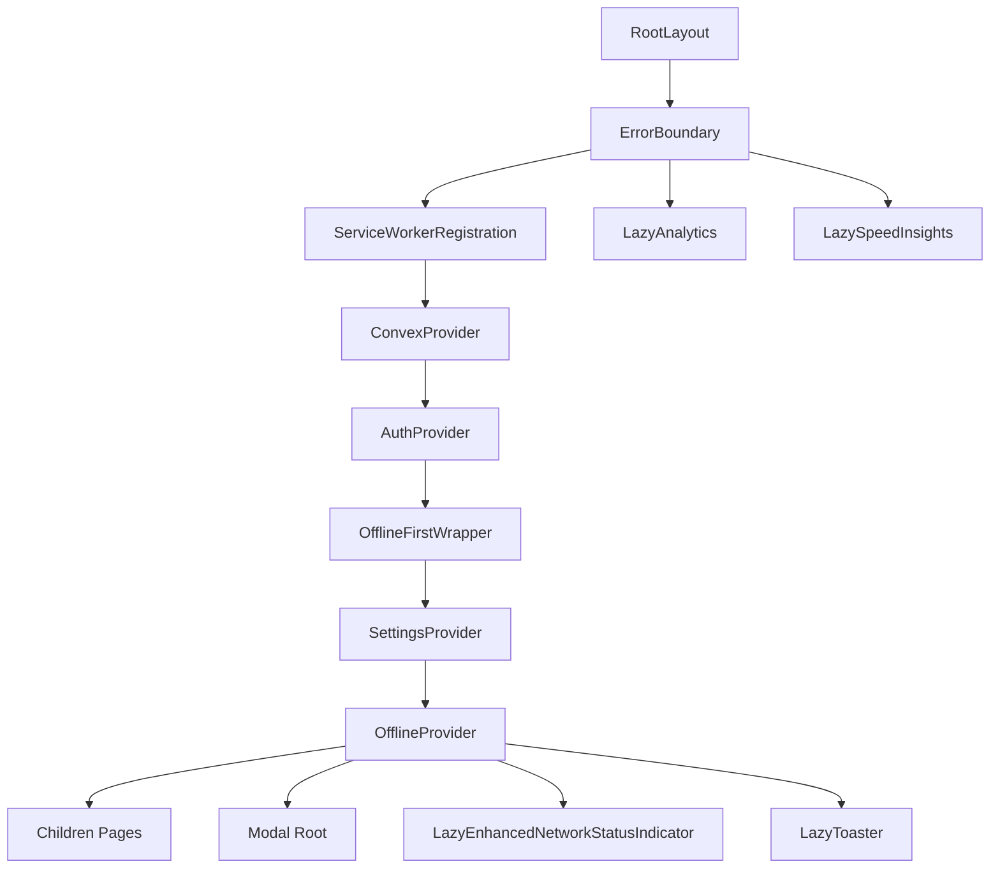
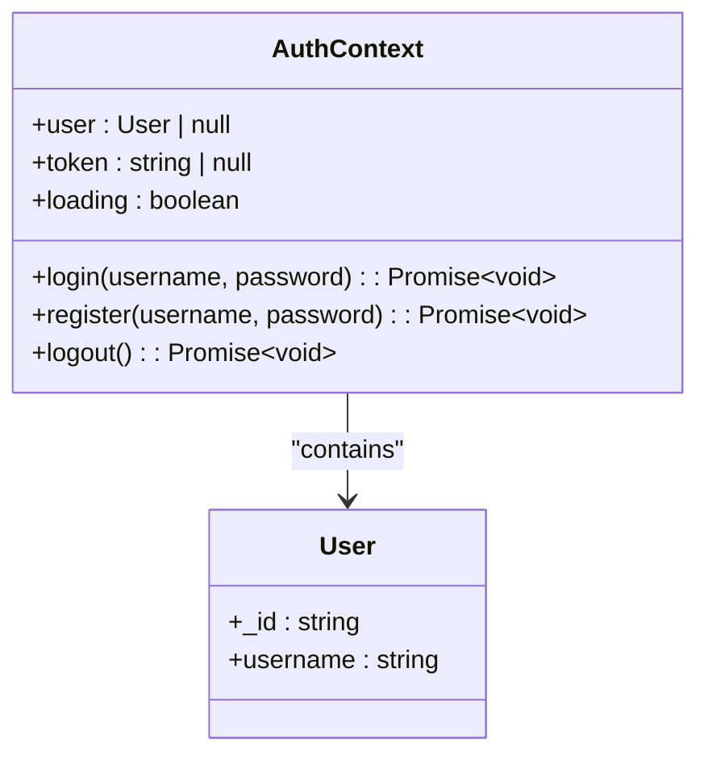
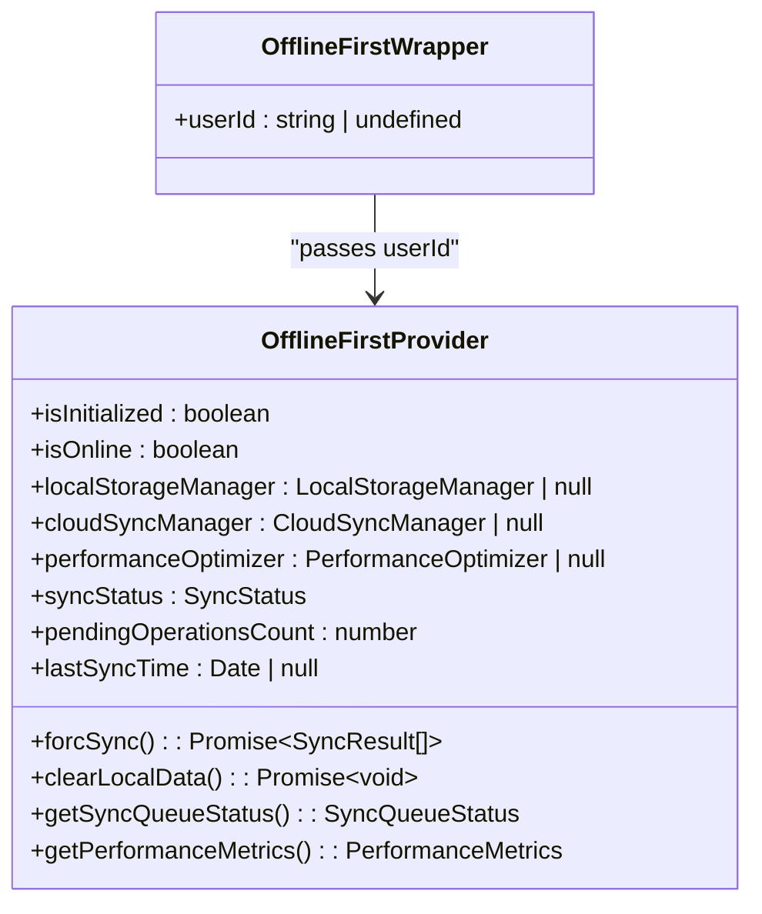
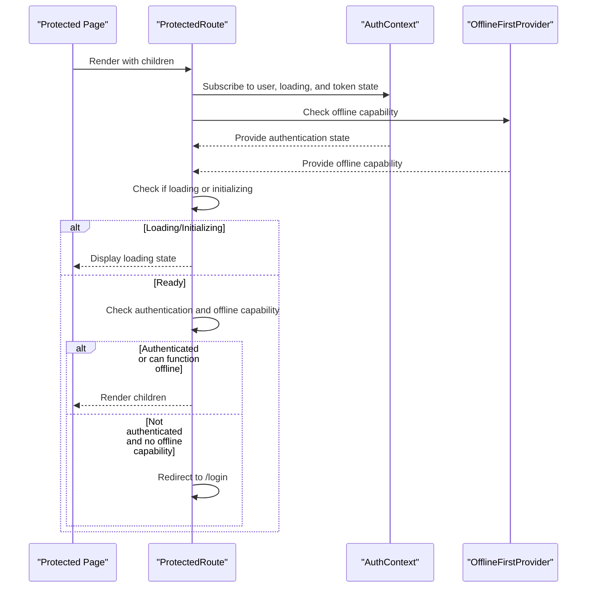
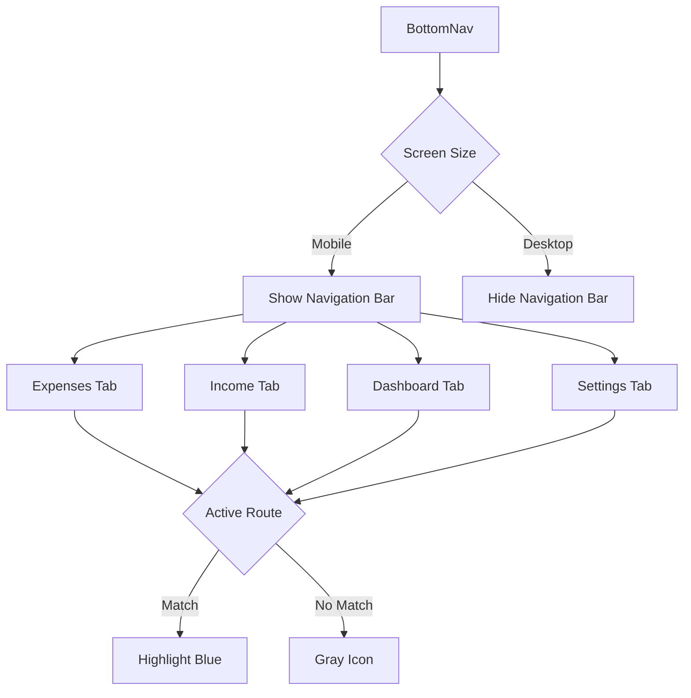
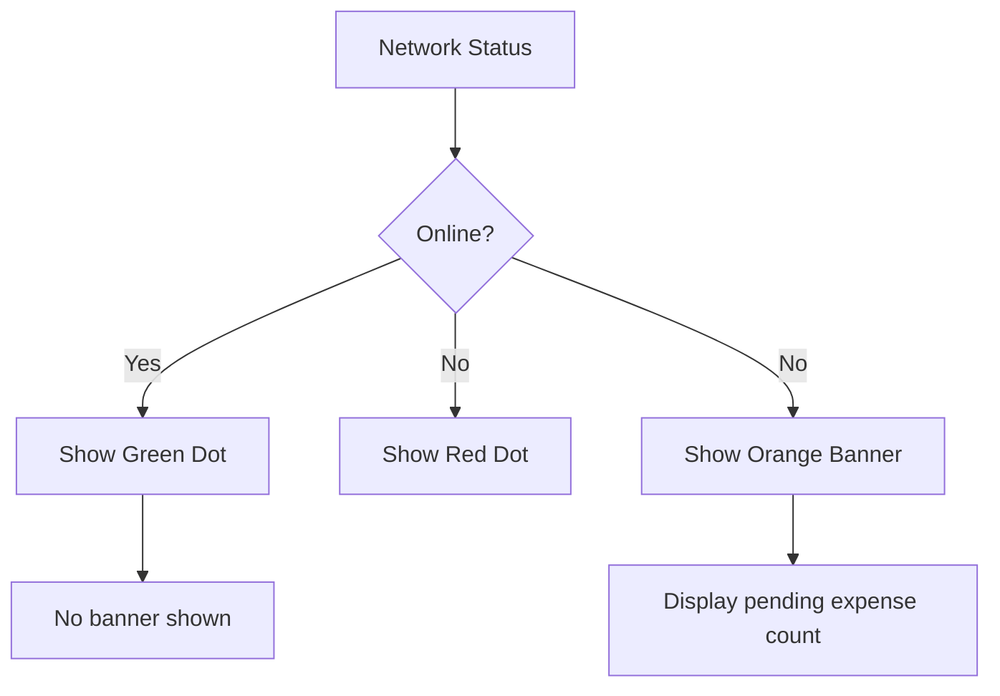

# Layout and Navigation Components

<cite>
**Referenced Files in This Document**   
- [layout.tsx](file://src/app/layout.tsx) - *Updated to include ErrorBoundary and new provider structure*
- [ProtectedRoute.tsx](file://src/components/ProtectedRoute.tsx) - *Enhanced with offline capability checks and error handling*
- [BottomNav.tsx](file://src/components/BottomNav.tsx)
- [NetworkStatusIndicator.tsx](file://src/components/NetworkStatusIndicator.tsx)
- [OfflineBanner.tsx](file://src/components/OfflineBanner.tsx)
- [AuthContext.tsx](file://src/contexts/AuthContext.tsx)
- [OfflineContext.tsx](file://src/contexts/OfflineContext.tsx)
- [SettingsContext.tsx](file://src/contexts/SettingsContext.tsx)
- [ConvexProvider.tsx](file://src/providers/ConvexProvider.tsx)
- [OfflineFirstProvider.tsx](file://src/providers/OfflineFirstProvider.tsx) - *New offline-first architecture*
- [OfflineFirstWrapper.tsx](file://src/providers/OfflineFirstWrapper.tsx) - *Added wrapper for user-based initialization*
- [ErrorBoundary.tsx](file://src/components/ErrorBoundary.tsx) - *Added global error handling*
- [HeaderRow.tsx](file://src/components/HeaderRow.tsx)
</cite>

## Update Summary
**Changes Made**   
- Updated Root Layout Architecture to reflect new provider hierarchy with OfflineFirstProvider
- Added ErrorBoundary implementation for global error handling
- Enhanced ProtectedRoute with offline capability detection
- Updated authentication flow to include offline-first considerations
- Added documentation for OfflineFirstProvider and OfflineFirstWrapper
- Updated diagram sources to reflect changes in layout structure
- Enhanced edge case handling for offline scenarios

## Table of Contents
1. [Layout and Navigation Components](#layout-and-navigation-components)
2. [Root Layout Architecture](#root-layout-architecture)
3. [Authentication and State Management](#authentication-and-state-management)
4. [Protected Route Implementation](#protected-route-implementation)
5. [Mobile Navigation with BottomNav](#mobile-navigation-with-bottomnav)
6. [Responsive Layout Strategy](#responsive-layout-strategy)
7. [System Status Indicators](#system-status-indicators)
8. [Offline Data Handling](#offline-data-handling)
9. [Adding New Protected Routes](#adding-new-protected-routes)
10. [Edge Case Handling](#edge-case-handling)
11. [Performance Considerations](#performance-considerations)
12. [PWA and Installability Support](#pwa-and-installability-support)
13. [Performance Monitoring](#performance-monitoring)

## Root Layout Architecture

The root layout (`layout.tsx`) serves as the foundational structure for the entire application, orchestrating the integration of global providers and UI components. It wraps all page-level content with essential context providers that enable state sharing across the app.

The layout integrates multiple context providers in a nested hierarchy:
- **ErrorBoundary**: Provides global error handling and recovery
- **ConvexProvider**: Establishes connection to the Convex backend
- **AuthProvider**: Manages user authentication state
- **OfflineFirstWrapper**: Conditional wrapper for offline-first functionality
- **SettingsProvider**: Handles user preferences
- **OfflineProvider**: Tracks offline status and pending operations

Additionally, the layout includes:
- **ServiceWorkerRegistration**: Registers service worker for PWA functionality
- **LazyEnhancedNetworkStatusIndicator**: Performance-optimized network status indicator
- **LazyToaster**: Lazy-loaded notification system
- **LazyAnalytics**: Lazy-loaded Vercel Analytics
- **LazySpeedInsights**: Lazy-loaded Vercel Speed Insights

The HTML structure includes proper metadata for PWA support, including manifest, theme color, and responsive viewport settings.



**Diagram sources**
- [layout.tsx](file://src/app/layout.tsx#L1-L97)

**Section sources**
- [layout.tsx](file://src/app/layout.tsx#L1-L97)
- [ErrorBoundary.tsx](file://src/components/ErrorBoundary.tsx#L1-L129)

## Authentication and State Management

The application implements a comprehensive state management system using React Context API, with specialized providers for different aspects of application state.

### AuthContext Implementation
The `AuthContext` manages user authentication state, including:
- **User object**: Contains user ID and username
- **Authentication token**: Stored in localStorage for persistence
- **Loading state**: Tracks initialization and authentication operations

Key features:
- Automatically loads authentication token from localStorage on app initialization
- Provides login, register, and logout methods that interact with Convex backend
- Uses Convex mutations for secure authentication operations
- Implements proper error handling and cleanup during logout



**Diagram sources**
- [AuthContext.tsx](file://src/contexts/AuthContext.tsx#L1-L96)

### SettingsContext Implementation
The `SettingsContext` manages user preferences such as currency and calendar settings. It:
- Fetches user settings from Convex backend when authenticated
- Provides update method for modifying settings
- Handles loading state during data retrieval

### OfflineContext Implementation
The `OfflineContext` manages offline capabilities with:
- Network status detection using browser online/offline events
- IndexedDB storage (via localforage) for pending expenses
- Automatic sync when connectivity is restored
- Detailed tracking of expense sync status (pending, syncing, synced, failed)

```mermaid
classDiagram
class OfflineContext {
+isOnline : boolean
+pendingExpenses : PendingExpense[]
+addPendingExpense(expense) : Promise~void~
+syncPendingExpenses() : Promise~void~
+retryFailedExpense(expenseId) : Promise~void~
}
class PendingExpense {
+id : string
+amount : number
+title : string
+category : string[]
+for : string[]
+date : number
+status : ExpenseStatus
}
enum ExpenseStatus {
pending
syncing
synced
failed
}
OfflineContext --> PendingExpense : "contains"
```

**Diagram sources**
- [OfflineContext.tsx](file://src/contexts/OfflineContext.tsx#L1-L171)

### OfflineFirstProvider Implementation
The `OfflineFirstProvider` implements a comprehensive offline-first architecture that enables the application to function seamlessly when connectivity is limited. It manages:

- **LocalStorageManager**: Handles local data persistence using IndexedDB
- **CloudSyncManager**: Manages synchronization with the Convex backend
- **PerformanceOptimizer**: Optimizes sync operations and resource usage
- **ConflictDetector**: Resolves data conflicts during sync operations

Key features:
- Initializes with user-specific data isolation
- Monitors sync state every 10 seconds
- Handles online/offline transitions
- Provides force sync capability
- Tracks sync metrics and performance

The provider is wrapped by `OfflineFirstWrapper` which automatically passes the current user ID from AuthContext, ensuring proper initialization when authentication state changes.



**Section sources**
- [OfflineFirstProvider.tsx](file://src/providers/OfflineFirstProvider.tsx#L1-L325)
- [OfflineFirstWrapper.tsx](file://src/providers/OfflineFirstWrapper.tsx#L1-L18)

**Diagram sources**
- [OfflineFirstProvider.tsx](file://src/providers/OfflineFirstProvider.tsx#L1-L325)
- [OfflineFirstWrapper.tsx](file://src/providers/OfflineFirstWrapper.tsx#L1-L18)

## Protected Route Implementation

The `ProtectedRoute` component implements authentication guarding for private routes in the application. It ensures that only authenticated users can access protected pages, with enhanced support for offline-first scenarios.

### Implementation Details
- Uses `useAuth` hook to access authentication state
- Implements redirect logic to login page when user is not authenticated
- Displays loading state during authentication initialization
- Returns null when user is not authenticated (after loading)
- Integrates with `useOfflineCapability` to support offline functionality

### Enhanced Authentication Flow
The component now handles multiple scenarios:
- **Authenticated online**: Normal access to protected routes
- **Authenticated offline with local data**: Access granted via offline-first capabilities
- **Token present but user not loaded**: Temporary access while waiting for user data
- **Unauthenticated**: Redirect to login page



**Diagram sources**
- [ProtectedRoute.tsx](file://src/components/ProtectedRoute.tsx#L1-L98)

**Section sources**
- [ProtectedRoute.tsx](file://src/components/ProtectedRoute.tsx#L1-L98)
- [OfflineFirstProvider.tsx](file://src/providers/OfflineFirstProvider.tsx#L1-L325)

## Mobile Navigation with BottomNav

The `BottomNav` component provides mobile-optimized navigation with a fixed bottom navigation bar that appears only on mobile devices.

### Key Features
- **Responsive design**: Hidden on medium screens and larger (`md:hidden`)
- **Route-based active indicators**: Highlights current page with blue color
- **Accessibility**: Proper labeling and semantic HTML structure
- **Visual feedback**: Uses framer-motion for tap animations (scale 0.95)

### Navigation Items
The component defines four primary navigation routes:
- **Expenses**: Create and manage expenses (Plus icon)
- **Income**: Track income sources (TrendingUp icon)
- **Dashboard**: View analytics and summaries (BarChart3 icon)
- **Settings**: Configure app preferences (Settings icon)



**Diagram sources**
- [BottomNav.tsx](file://src/components/BottomNav.tsx#L1-L58)

**Section sources**
- [BottomNav.tsx](file://src/components/BottomNav.tsx#L1-L58)

## Responsive Layout Strategy

The application implements a responsive navigation strategy that adapts to different screen sizes:

### Mobile Layout (Screen < 768px)
- **Bottom navigation**: Fixed bottom bar with icon-based navigation
- **Header row**: Fixed top bar with page title and actions
- **Content area**: Scrollable main content between header and navigation

### Desktop Layout (Screen ≥ 768px)
- **Bottom navigation hidden**: Uses `md:hidden` Tailwind class
- **Alternative navigation**: Expected to be implemented in sidebar or header (not visible in current code)
- **Full-height layout**: Content utilizes full viewport height

The responsive behavior is primarily controlled through Tailwind CSS's responsive prefixes, particularly the `md:hidden` class on the BottomNav component.

**Section sources**
- [BottomNav.tsx](file://src/components/BottomNav.tsx#L1-L58)
- [HeaderRow.tsx](file://src/components/HeaderRow.tsx#L1-L37)

## System Status Indicators

The application provides real-time feedback about system status through two complementary components:

### NetworkStatusIndicator
- **Visual indicator**: Small colored dot in top-right corner
- **Color coding**: Green for online, red for offline
- **Animation**: Smooth entrance and exit using framer-motion
- **Accessibility**: Title attribute provides text description

### OfflineBanner
- **Location**: Fixed top banner when offline
- **Information**: Displays count of pending expenses
- **Visual design**: Orange background with warning icon
- **Conditional rendering**: Only appears when offline



**Diagram sources**
- [NetworkStatusIndicator.tsx](file://src/components/NetworkStatusIndicator.tsx#L1-L22)
- [OfflineBanner.tsx](file://src/components/OfflineBanner.tsx#L1-L26)

**Section sources**
- [NetworkStatusIndicator.tsx](file://src/components/NetworkStatusIndicator.tsx#L1-L22)
- [OfflineBanner.tsx](file://src/components/OfflineBanner.tsx#L1-L26)

## Offline Data Handling

The application implements robust offline capabilities through the OfflineFirstProvider and local storage:

### Data Persistence Strategy
- **Storage**: IndexedDB via LocalStorageManager
- **Store name**: User-specific data isolation
- **Data structure**: Comprehensive sync state with pending operations tracking

### Sync Process
1. User creates expense while offline
2. Expense added to pending queue with "pending" status
3. When online, sync process automatically attempts to submit
4. Status updated to "syncing" during submission
5. On success, removed from queue; on failure, marked as "failed"

### Initialization Process
- When user authenticates, OfflineFirstProvider initializes with user ID
- LocalStorageManager sets up user-specific storage
- Sync state is monitored every 10 seconds
- Service worker messages are handled for background sync

### Error Recovery
- Failed expenses can be retried manually via force sync
- Comprehensive error logging for debugging
- Auto-retry attempts on connectivity restoration

**Section sources**
- [OfflineFirstProvider.tsx](file://src/providers/OfflineFirstProvider.tsx#L1-L325)
- [OfflineFirstWrapper.tsx](file://src/providers/OfflineFirstWrapper.tsx#L1-L18)

## Adding New Protected Routes

To add a new protected route to the application:

### Step 1: Create Page Component
Create a new page in the `app` directory with the desired route structure:
```tsx
// app/new-feature/page.tsx
export default function NewFeaturePage() {
  return (
    <div>
      <h1>New Feature</h1>
      {/* Page content */}
    </div>
  );
}
```

### Step 2: Wrap with ProtectedRoute
Ensure the page is wrapped with ProtectedRoute in the layout or directly in the page:
```tsx
// In layout or page
<ProtectedRoute>
  <NewFeaturePage />
</ProtectedRoute>
```

### Step 3: Update Navigation
Add the route to the BottomNav component for mobile access:
```tsx
// In BottomNav.tsx
{
  href: "/new-feature",
  icon: NewFeatureIcon,
  label: "New Feature",
}
```

### Step 4: Implement Desktop Navigation
Add the route to the desktop navigation system (implementation not visible in current code).

### Step 5: Consider Offline-First Requirements
For routes that need offline functionality:
- Ensure data models are compatible with local storage
- Implement appropriate conflict resolution strategies
- Test offline scenarios thoroughly

## Edge Case Handling

The application addresses several important edge cases:

### Deep Linking
- ProtectedRoute handles direct navigation to protected URLs
- If unauthenticated, redirects to login while preserving intended destination
- Loading state prevents flicker during authentication check
- Offline capability check allows access when appropriate

### Authentication State Changes
- ProtectedRoute uses useEffect to react to authentication state changes
- Immediate redirect when user logs out from a protected page
- Loading state prevents race conditions during authentication initialization
- OfflineFirstWrapper automatically reinitializes when user changes

### Offline Navigation Constraints
- Users can navigate freely while offline
- Data entry operations queue locally
- Navigation remains functional, but data sync delayed until online
- Clear visual feedback about offline status and pending operations
- Force sync capability available for manual synchronization

**Section sources**
- [ProtectedRoute.tsx](file://src/components/ProtectedRoute.tsx#L1-L98)
- [OfflineFirstProvider.tsx](file://src/providers/OfflineFirstProvider.tsx#L1-L325)
- [OfflineFirstWrapper.tsx](file://src/providers/OfflineFirstWrapper.tsx#L1-L18)

## Performance Considerations

The application implements several performance optimizations:

### Code Splitting
- Next.js automatically handles code splitting by route
- Each page component is loaded only when navigated to
- Shared components and contexts are cached and reused

### Lazy Loading
- Critical components are lazy-loaded to improve initial load time
- Analytics and performance monitoring are loaded after main content
- Heavy UI components can be dynamically imported

### Optimization Recommendations
1. **Implement dynamic imports** for heavy components like charts:
```tsx
const HeavyChart = dynamic(() => import('@/components/HeavyChart'));
```

2. **Optimize image loading** for any future image assets using Next.js Image component

3. **Implement pagination** for expense lists if data volume grows significantly

4. **Use React.memo** for expensive components that render frequently

5. **Consider code splitting** for the OfflineFirstProvider if it becomes too large

**Section sources**
- [LazyComponents.tsx](file://src/components/LazyComponents.tsx)
- [layout.tsx](file://src/app/layout.tsx#L1-L97)

## PWA and Installability Support

The application is configured as a Progressive Web App with the following features:

### Manifest Configuration
- **manifest.json**: Defines app name, icons, and display properties
- **Theme color**: Set to black for consistent appearance
- **Display mode**: Configured for standalone or fullscreen experience

### Viewport Handling
- Responsive viewport meta tag ensures proper scaling
- Initial scale set to 1.0 for consistent rendering
- Maximum scale prevents unwanted zooming

### Installability Cues
- Web app manifest provides installation metadata
- Service worker (`sw.js`) enables offline functionality
- Proper icons and splash screen configuration (in manifest)
- ServiceWorkerRegistration component handles registration

The combination of these features allows the application to be installed on user devices and function like a native app, with offline capabilities and home screen presence.

**Section sources**
- [layout.tsx](file://src/app/layout.tsx#L1-L97)
- [public/manifest.json](file://public/manifest.json)
- [ServiceWorkerRegistration.tsx](file://src/components/ServiceWorkerRegistration.tsx)

## Performance Monitoring

The application has been enhanced with Vercel's analytics and performance monitoring tools to track user behavior and optimize application performance.

### Vercel Analytics Implementation
- **Analytics component**: Imported from `@vercel/analytics/next`
- **Implementation**: Added to the root layout after the main content and providers
- **Purpose**: Tracks user interactions, page views, and engagement metrics
- **Configuration**: Default configuration with no additional setup required
- **Loading**: Lazy-loaded to prevent impact on initial page load

### Speed Insights Implementation
- **SpeedInsights component**: Imported from `@vercel/speed-insights/next`
- **Implementation**: Added alongside Analytics component in root layout
- **Purpose**: Monitors core web vitals and performance metrics
- **Metrics tracked**: 
  - First Contentful Paint (FCP)
  - Largest Contentful Paint (LCP)
  - Interaction to Next Paint (INP)
  - Cumulative Layout Shift (CLS)
- **Loading**: Lazy-loaded to prevent impact on initial page load

### Integration Details
Both analytics components are placed outside the main provider hierarchy but within the ErrorBoundary in the root layout to ensure they can collect data throughout the application lifecycle while still being protected from application errors.

```tsx
<LazyAnalytics />
<LazySpeedInsights />
```

This placement ensures that analytics data is collected for all pages and user interactions, providing comprehensive insights into application performance and user behavior, while maintaining optimal loading performance.

**Section sources**
- [layout.tsx](file://src/app/layout.tsx#L10-L11)
- [layout.tsx](file://src/app/layout.tsx#L70-L71)
- [LazyComponents.tsx](file://src/components/LazyComponents.tsx)