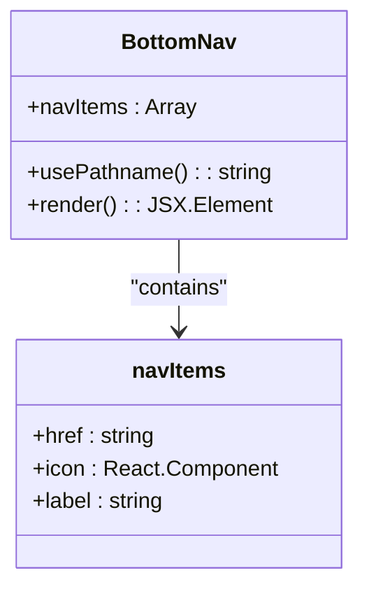
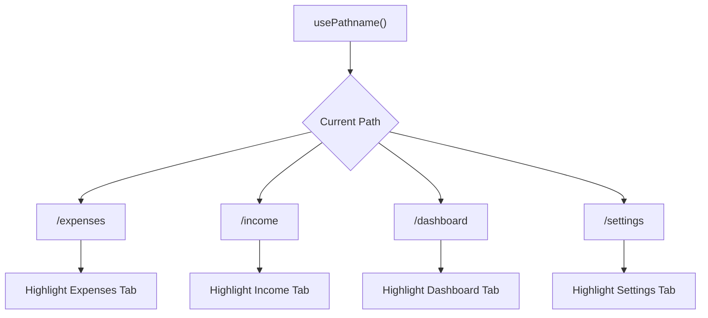
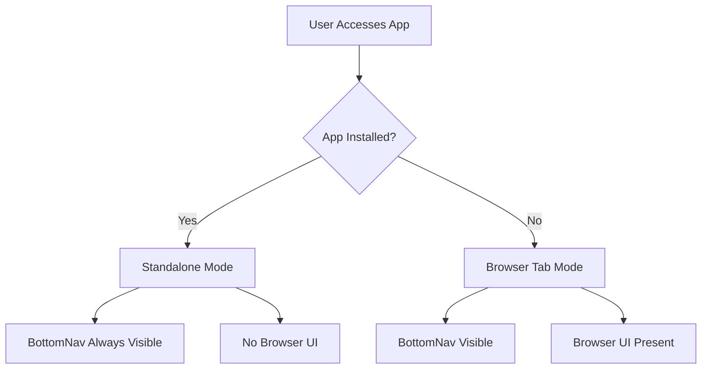
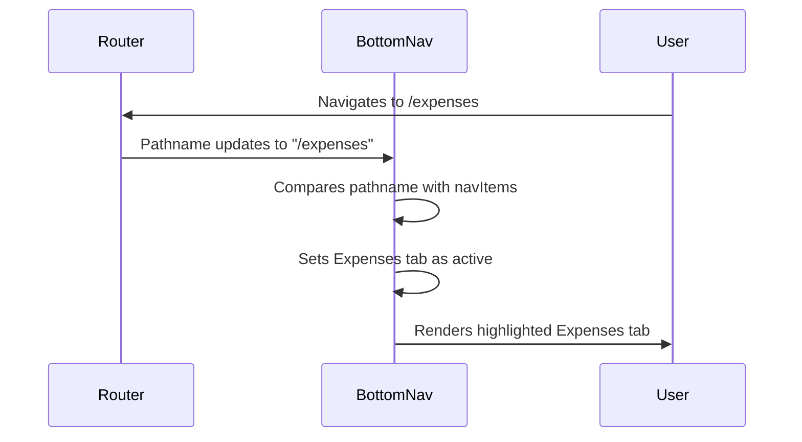
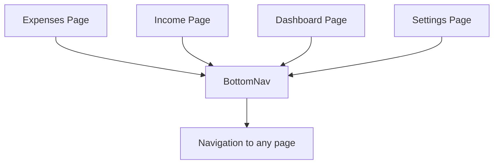

# BottomNav Component

<cite>
**Referenced Files in This Document**   
- [BottomNav.tsx](file://src/components/BottomNav.tsx)
- [expenses/page.tsx](file://src/app/expenses/page.tsx)
- [income/page.tsx](file://src/app/income/page.tsx)
- [dashboard/page.tsx](file://src/app/dashboard/page.tsx)
- [settings/page.tsx](file://src/app/settings/page.tsx)
- [manifest.json](file://public/manifest.json)
- [sw.js](file://public/sw.js)
</cite>

## Table of Contents
1. [Introduction](#introduction)
2. [Component Structure and Implementation](#component-structure-and-implementation)
3. [Navigation and Routing Integration](#navigation-and-routing-integration)
4. [Accessibility Features](#accessibility-features)
5. [PWA Integration and Installability](#pwa-integration-and-installability)
6. [State Management for Active Tab Highlighting](#state-management-for-active-tab-highlighting)
7. [Performance Considerations](#performance-considerations)
8. [Extensibility and Best Practices](#extensibility-and-best-practices)
9. [Usage Examples](#usage-examples)
10. [Conclusion](#conclusion)

## Introduction
The BottomNav component is a mobile-optimized navigation bar positioned at the bottom of the viewport in the Expense Tracker application. It provides quick access to key application sections including expenses, income, dashboard, and settings. The component is designed specifically for touch-based mobile interfaces and automatically hides on desktop views using responsive design principles. This documentation details its implementation, integration, accessibility features, and performance characteristics.

## Component Structure and Implementation

The BottomNav component is implemented as a client-side React component using Next.js App Router conventions. It leverages several modern frontend libraries and patterns to deliver a smooth user experience.



**Diagram sources**
- [BottomNav.tsx](file://src/components/BottomNav.tsx#L6-L23)

**Section sources**
- [BottomNav.tsx](file://src/components/BottomNav.tsx#L1-L58)

### Core Implementation
The component uses the following key technologies:
- **Next.js App Router**: For client-side navigation via `usePathname` and `Link`
- **Framer Motion**: For touch feedback animations
- **Lucide React**: For scalable vector icons
- **Tailwind CSS**: For responsive styling

The navigation items are defined as a static array within the component, each containing:
- `href`: The route path
- `icon`: The Lucide icon component
- `label`: The display text

### Responsive Design
The BottomNav is conditionally rendered only on mobile devices using the `md:hidden` Tailwind CSS class. This ensures the navigation remains unobtrusive on larger screens where alternative navigation patterns may be preferred.

## Navigation and Routing Integration

The BottomNav integrates with Next.js routing system to provide seamless navigation between key application views.



**Diagram sources**
- [BottomNav.tsx](file://src/components/BottomNav.tsx#L25-L58)

**Section sources**
- [BottomNav.tsx](file://src/components/BottomNav.tsx#L1-L58)
- [expenses/page.tsx](file://src/app/expenses/page.tsx)
- [income/page.tsx](file://src/app/income/page.tsx)
- [dashboard/page.tsx](file://src/app/dashboard/page.tsx)
- [settings/page.tsx](file://src/app/settings/page.tsx)

### Active Route Detection
The component uses Next.js `usePathname` hook to determine the current route and highlight the active navigation item:

```typescript
const pathname = usePathname();
const isActive = pathname === item.href;
```

This comparison returns true when the current path exactly matches the navigation item's href, triggering the active state styling (blue text color).

### Navigation Items
The BottomNav provides access to four primary routes:
- **Expenses**: Route `/expenses`, icon `Plus`, label "Expenses"
- **Income**: Route `/income`, icon `TrendingUp`, label "Income"
- **Dashboard**: Route `/dashboard`, icon `BarChart3`, label "Dashboard"
- **Settings**: Route `/settings`, icon `Settings`, label "Settings"

## Accessibility Features

The BottomNav component incorporates several accessibility features to ensure usability for all users.

**Section sources**
- [BottomNav.tsx](file://src/components/BottomNav.tsx#L1-L58)

### Focus Management
Each navigation link is wrapped in a `Link` component from Next.js, which provides built-in keyboard navigation support. The touch targets are sized at a minimum of 44px × 44px (via `min-w-[44px] min-h-[44px]`), meeting WCAG recommendations for touch target size.

### ARIA Current Page Indicators
While the component currently uses visual styling (color change) to indicate the active page, it could be enhanced with ARIA attributes:

```jsx
<span 
  aria-current={isActive ? "page" : undefined}
  className={`text-xs mt-1 ${isActive ? "font-medium" : ""}`}
>
  {item.label}
</span>
```

### Touch-Friendly Spacing
The navigation items are evenly distributed across the bottom bar using `justify-around`, providing adequate spacing between touch targets to prevent mis-taps. The padding (`p-2`) and flex layout ensure comfortable spacing on mobile devices.

## PWA Integration and Installability

The BottomNav component functions within a Progressive Web App (PWA) environment, with specific adaptations for installed versus browser-based usage.



**Diagram sources**
- [manifest.json](file://public/manifest.json)
- [sw.js](file://public/sw.js)

**Section sources**
- [manifest.json](file://public/manifest.json#L1-L25)
- [sw.js](file://public/sw.js#L1-L50)
- [settings/page.tsx](file://src/app/settings/page.tsx#L110-L127)

### PWA Configuration
The application's `manifest.json` file configures the PWA with:
- `"display": "standalone"`: Removes browser UI when installed
- App icons for various device resolutions
- Theme and background colors matching the app design

### Service Worker Integration
The service worker (`sw.js`) caches key routes including all BottomNav destinations, ensuring the navigation remains functional even in offline mode:

```javascript
const urlsToCache = [
  '/',
  '/login',
  '/register',
  '/expenses',
  '/dashboard',
  '/settings'
];
```

This caching strategy ensures that users can navigate between all BottomNav destinations even without network connectivity.

## State Management for Active Tab Highlighting

The BottomNav component manages the active tab state using client-side routing rather than application state management.



**Diagram sources**
- [BottomNav.tsx](file://src/components/BottomNav.tsx#L25-L58)

**Section sources**
- [BottomNav.tsx](file://src/components/BottomNav.tsx#L1-L58)

### Implementation Details
The active state is determined entirely by the current URL path:
- No additional state management libraries are required
- The `usePathname` hook provides real-time updates
- Active state is recalculated on every route change
- Visual feedback is immediate and consistent

### Highlighting Logic
The conditional class binding determines the text color:
```jsx
className={`flex flex-col items-center p-2 min-w-[44px] min-h-[44px] justify-center ${
  isActive ? "text-blue-600" : "text-gray-600"
}`}
```

Active tabs use blue (`text-blue-600`) while inactive tabs use gray (`text-gray-600`).

## Performance Considerations

The BottomNav component is optimized for performance with attention to icon loading and rendering efficiency.

**Section sources**
- [BottomNav.tsx](file://src/components/BottomNav.tsx#L1-L58)

### Icon Loading Strategy
The component uses Lucide React icons, which are:
- Imported directly as React components
- Tree-shaken to include only used icons
- Rendered as inline SVGs (no additional HTTP requests)
- Sized consistently at 20px

This approach eliminates network requests for icon assets and leverages the application's existing JavaScript bundle.

### Rendering Optimization
The component benefits from several performance optimizations:
- Static navigation items defined outside the component function
- Efficient `map` iteration over a small array (4 items)
- Minimal re-renders (only when pathname changes)
- Lightweight Framer Motion animation (scale transform only)

### Bundle Impact
The dependencies have minimal bundle impact:
- Lucide icons are modular and tree-shakable
- Framer Motion is already used elsewhere in the application
- Next.js routing components are already part of the bundle

## Extensibility and Best Practices

The BottomNav component can be extended while maintaining usability and performance.

**Section sources**
- [BottomNav.tsx](file://src/components/BottomNav.tsx#L1-L58)

### Adding New Navigation Items
To add a new navigation item, extend the `navItems` array:

```typescript
const navItems = [
  // existing items...
  {
    href: "/new-feature",
    icon: NewIcon,
    label: "New Feature",
  },
];
```

### Best Practices for Extension
1. **Limit Navigation Items**: Keep the count to 5 or fewer to maintain usability on small screens
2. **Consistent Icon Size**: Use 20px icons for visual consistency
3. **Short Labels**: Use concise labels (1-2 words) that fit on small screens
4. **Logical Order**: Arrange items in order of importance or user flow
5. **Test on Multiple Devices**: Ensure touch targets remain accessible

### Responsive Considerations
When adding new items, consider:
- The component automatically hides on desktop (`md:hidden`)
- On very small screens, consider using only icons without labels
- Ensure the total width doesn't cause horizontal scrolling

## Usage Examples

The BottomNav component is used in multiple pages throughout the application.



**Diagram sources**
- [expenses/page.tsx](file://src/app/expenses/page.tsx#L9)
- [income/page.tsx](file://src/app/income/page.tsx#L8)
- [dashboard/page.tsx](file://src/app/dashboard/page.tsx#L7)
- [settings/page.tsx](file://src/app/settings/page.tsx#L8)

**Section sources**
- [expenses/page.tsx](file://src/app/expenses/page.tsx#L1-L352)
- [income/page.tsx](file://src/app/income/page.tsx#L1-L307)
- [dashboard/page.tsx](file://src/app/dashboard/page.tsx#L1-L126)
- [settings/page.tsx](file://src/app/settings/page.tsx#L1-L234)

### Integration Pattern
The component is consistently imported and rendered at the end of the page content:

```tsx
import { BottomNav } from "@/components/BottomNav";

// ... page content ...

<BottomNav />
```

This pattern ensures the navigation is always positioned at the bottom of the viewport and remains accessible regardless of page content length.

### Protected Route Integration
All pages using BottomNav are wrapped in `ProtectedRoute`, ensuring authentication is handled before navigation is available:

```tsx
return (
  <ProtectedRoute>
    <div className="min-h-screen bg-gray-50">
      {/* Page content */}
      <BottomNav />
    </div>
  </ProtectedRoute>
);
```

## Conclusion
The BottomNav component serves as the primary mobile navigation interface for the Expense Tracker application. It provides intuitive, accessible navigation between key application sections using a clean, icon-based design. The component leverages Next.js routing for active state detection, incorporates accessibility best practices, and functions reliably in both online and offline PWA modes. Its simple yet effective implementation makes it easy to maintain and extend while providing a seamless user experience on mobile devices.