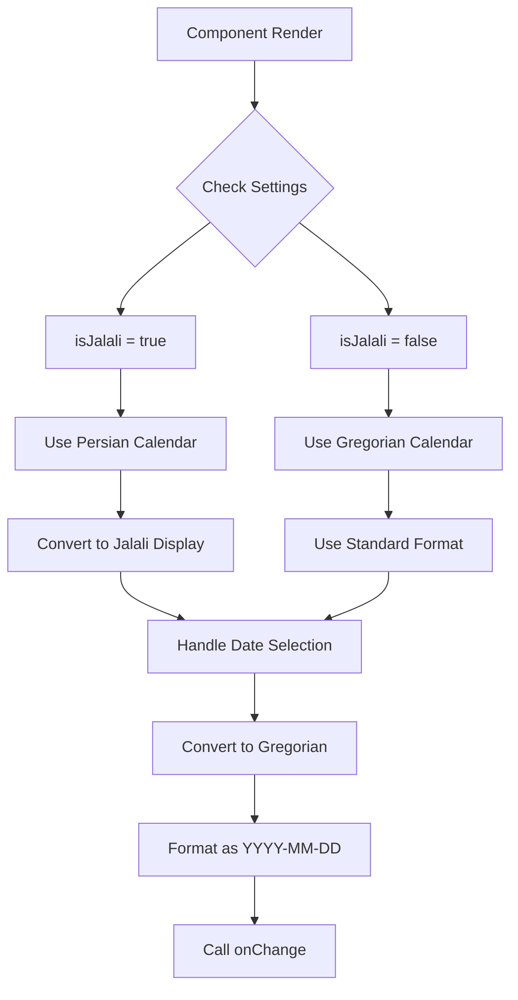
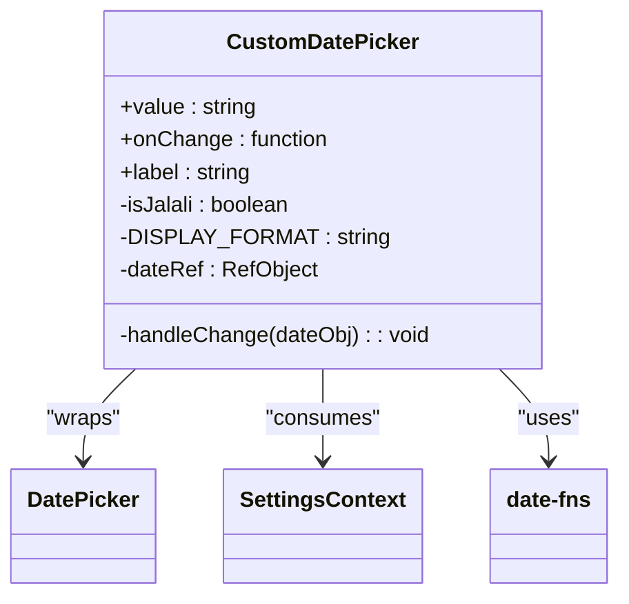
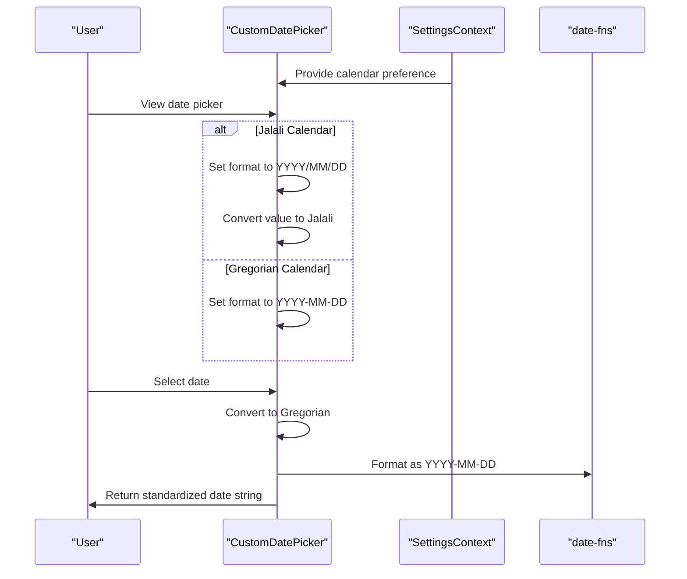
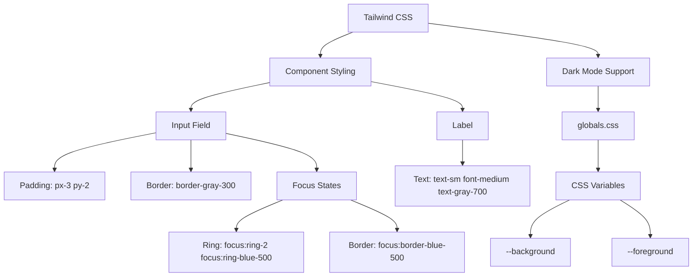
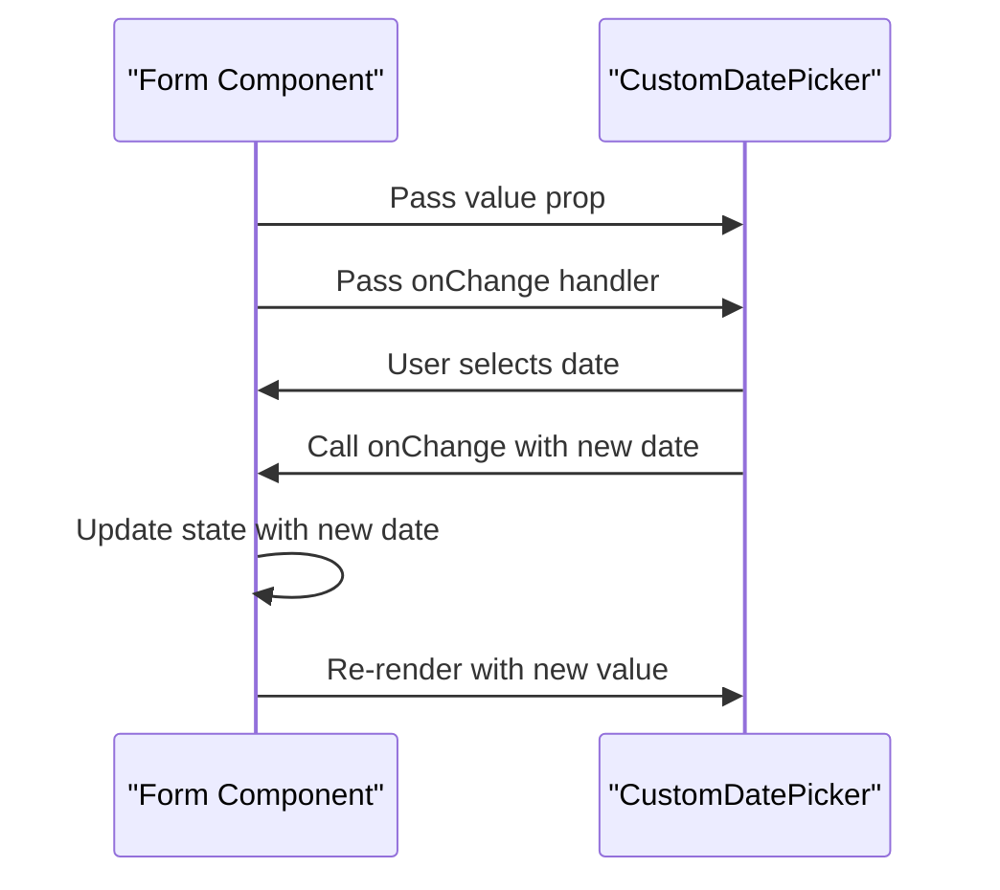
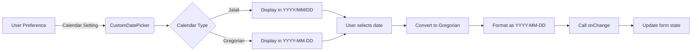

# CustomDatePicker Component

<cite>
**Referenced Files in This Document**   
- [CustomDatePicker.tsx](file://src/components/CustomDatePicker.tsx)
- [formatters.ts](file://src/lib/formatters.ts)
- [SettingsContext.tsx](file://src/contexts/SettingsContext.tsx)
- [tailwind.config.ts](file://tailwind.config.ts)
- [globals.css](file://src/app/globals.css)
- [edit/[id]/page.tsx](file://src/app/expenses/edit/[id]/page.tsx)
- [income/page.tsx](file://src/app/income/page.tsx)
- [userSettings.ts](file://convex/userSettings.ts)
</cite>

## Table of Contents
1. [Introduction](#introduction)
2. [Core Implementation](#core-implementation)
3. [Prop Usage and Configuration](#prop-usage-and-configuration)
4. [Calendar System Integration](#calendar-system-integration)
5. [Styling and Tailwind CSS](#styling-and-tailwind-css)
6. [Accessibility and Mobile UX](#accessibility-and-mobile-ux)
7. [Performance Optimization](#performance-optimization)
8. [Form Integration Patterns](#form-integration-patterns)
9. [Usage Examples](#usage-examples)
10. [Conclusion](#conclusion)

## Introduction
The CustomDatePicker component provides a mobile-friendly, themed date input compatible with PWA standards. It leverages the react-multi-date-picker library to deliver a robust date selection experience with support for multiple calendar systems. The component integrates seamlessly with the application's theme system and user preferences, offering consistent styling across devices and dark mode support. This documentation details its implementation, usage patterns, and integration with various parts of the expense tracking application.

## Core Implementation

The CustomDatePicker component is implemented as a client-side React component that wraps the react-multi-date-picker library. It handles date conversion between different calendar systems and ensures consistent formatting across the application.



**Diagram sources**
- [CustomDatePicker.tsx](file://src/components/CustomDatePicker.tsx#L1-L70)

**Section sources**
- [CustomDatePicker.tsx](file://src/components/CustomDatePicker.tsx#L1-L70)

## Prop Usage and Configuration

The component accepts three main props that control its behavior and appearance:

**CustomDatePickerProps**
- `value`: string - Expects date in "YYYY-MM-DD" format (Gregorian)
- `onChange`: (date: string) => void - Callback function triggered when date changes
- `label`: string - Label text displayed above the input field

The component does not currently implement min, max, or disabled props, focusing instead on core functionality and calendar system integration. The value is expected to be in ISO 8601 format (YYYY-MM-DD) regardless of the display calendar system.



**Diagram sources**
- [CustomDatePicker.tsx](file://src/components/CustomDatePicker.tsx#L1-L70)

**Section sources**
- [CustomDatePicker.tsx](file://src/components/CustomDatePicker.tsx#L1-L70)

## Calendar System Integration

The component integrates with the application's UserSettings to support both Gregorian and Jalali (Persian) calendar systems. This allows users to view dates in their preferred calendar while maintaining consistent data storage.



The calendar preference is stored in the user's settings and retrieved via the useSettings hook. When the calendar is set to "jalali", the component uses the Persian calendar and Persian-Farsi locale for display purposes, while internally converting all dates to Gregorian for consistent storage.

**Diagram sources**
- [CustomDatePicker.tsx](file://src/components/CustomDatePicker.tsx#L1-L70)
- [SettingsContext.tsx](file://src/contexts/SettingsContext.tsx#L1-L58)
- [userSettings.ts](file://convex/userSettings.ts#L1-L58)

**Section sources**
- [CustomDatePicker.tsx](file://src/components/CustomDatePicker.tsx#L1-L70)
- [SettingsContext.tsx](file://src/contexts/SettingsContext.tsx#L1-L58)

## Styling and Tailwind CSS

The component uses Tailwind CSS for consistent styling across devices and supports dark mode through CSS variables defined in the application's global styles.



The component's styling is implemented through the inputClass prop of the DatePicker component, which applies Tailwind utility classes for consistent appearance. The global CSS defines color variables that automatically adapt to the user's preferred color scheme via the prefers-color-scheme media query.

**Diagram sources**
- [CustomDatePicker.tsx](file://src/components/CustomDatePicker.tsx#L1-L70)
- [tailwind.config.ts](file://tailwind.config.ts#L1-L20)
- [globals.css](file://src/app/globals.css#L1-L26)

**Section sources**
- [CustomDatePicker.tsx](file://src/components/CustomDatePicker.tsx#L1-L70)
- [tailwind.config.ts](file://tailwind.config.ts#L1-L20)
- [globals.css](file://src/app/globals.css#L1-L26)

## Accessibility and Mobile UX

The component is designed with mobile usability and accessibility in mind, following PWA standards for touch-friendly interfaces.

**Accessibility Features:**
- Proper label association using HTML label elements
- Sufficient touch target size (minimum 44px height)
- Focus indicators for keyboard navigation
- Semantic HTML structure
- Icon integration for visual cues

The component ensures adequate touch target sizing with a minimum height of 44px, which meets mobile usability guidelines. The calendar icon is displayed inline with the label, providing visual context for the input field. Focus states are clearly defined with ring and border color changes to support keyboard navigation.

```mermaid
flowchart TD
A[Accessibility Requirements] --> B[Proper Labeling]
A --> C[Touch Target Size]
A --> D[Focus Management]
A --> E[Semantic Structure]
B --> F[<label> element]
B --> G[Associated with input]
C --> H[min-h-[44px]]
C --> I[Adequate spacing]
D --> J[focus:outline-none]
D --> K[focus:ring-2]
D --> L[focus:ring-blue-500]
E --> M[Div container]
E --> N[Label + Input structure]
```

**Diagram sources**
- [CustomDatePicker.tsx](file://src/components/CustomDatePicker.tsx#L1-L70)

**Section sources**
- [CustomDatePicker.tsx](file://src/components/CustomDatePicker.tsx#L1-L70)

## Performance Optimization

The component implements several performance optimizations to minimize unnecessary re-renders and maintain smooth user interactions.

**Performance Considerations:**
- useRef to maintain stable DateObject reference
- useEffect dependency array optimization
- Identity preservation to prevent picker reinitialization
- Efficient date comparison to avoid unnecessary updates

The component uses a ref (dateRef) to maintain a stable reference to the DateObject, preventing identity churn between renders. The useEffect hook that synchronizes the value prop with the internal date reference includes both value and isJalali in its dependency array, ensuring updates only when necessary. Before updating the ref, the component compares the formatted dates to avoid unnecessary reassignments.

```mermaid
flowchart TD
A[Performance Optimization] --> B[Stable References]
A --> C[Efficient Updates]
A --> D[Minimal Re-renders]
B --> E[dateRef = useRef()]
B --> F[Preserves DateObject identity]
C --> G[Compare formatted dates]
C --> H[Only update when changed]
D --> I[Dependency array optimization]
D --> J[Only watch value and isJalali]
```

**Diagram sources**
- [CustomDatePicker.tsx](file://src/components/CustomDatePicker.tsx#L1-L70)

**Section sources**
- [CustomDatePicker.tsx](file://src/components/CustomDatePicker.tsx#L1-L70)

## Form Integration Patterns

The component is designed to integrate seamlessly with form state management patterns used throughout the application.

**Usage in Expense Editing:**
```tsx
<CustomDatePicker
  label="Date"
  value={formData.date}
  onChange={(date) => setFormData({ ...formData, date })}
/>
```

**Usage in Income Management:**
```tsx
<CustomDatePicker
  label="Date *"
  value={formData.date}
  onChange={(date) => setFormData({ ...formData, date })}
/>
```

The component follows the controlled component pattern, where the parent component manages the state and passes it down as a prop. The onChange callback allows the parent to update its state in response to user interactions. This pattern is consistent across both expense and income forms, ensuring a uniform user experience.



**Diagram sources**
- [CustomDatePicker.tsx](file://src/components/CustomDatePicker.tsx#L1-L70)
- [edit/[id]/page.tsx](file://src/app/expenses/edit/[id]/page.tsx#L369-L393)
- [income/page.tsx](file://src/app/income/page.tsx#L235-L254)

**Section sources**
- [CustomDatePicker.tsx](file://src/components/CustomDatePicker.tsx#L1-L70)
- [edit/[id]/page.tsx](file://src/app/expenses/edit/[id]/page.tsx#L369-L393)
- [income/page.tsx](file://src/app/income/page.tsx#L235-L254)

## Usage Examples

The CustomDatePicker component is used in multiple forms throughout the application, demonstrating its versatility and consistent integration pattern.

**Expense Editing Page:**
The component is used in the expense editing form, allowing users to update the date of an existing expense. The date is stored in the formData state and updated via the onChange callback.

**Income Management:**
In both the income creation and editing forms, the component provides date selection functionality. The required asterisk in the label indicates that the date field is mandatory for income entries.

**Data Flow:**
When a date is selected, the component converts it from the display calendar (Jalali or Gregorian) to Gregorian calendar, then formats it as an ISO 8601 string (YYYY-MM-DD) before passing it to the onChange callback. This ensures consistent data storage regardless of the user's calendar preference.



**Diagram sources**
- [CustomDatePicker.tsx](file://src/components/CustomDatePicker.tsx#L1-L70)
- [edit/[id]/page.tsx](file://src/app/expenses/edit/[id]/page.tsx#L369-L393)
- [income/page.tsx](file://src/app/income/page.tsx#L235-L254)

**Section sources**
- [CustomDatePicker.tsx](file://src/components/CustomDatePicker.tsx#L1-L70)
- [edit/[id]/page.tsx](file://src/app/expenses/edit/[id]/page.tsx#L369-L393)
- [income/page.tsx](file://src/app/income/page.tsx#L235-L254)

## Conclusion
The CustomDatePicker component provides a robust, mobile-friendly date input solution that integrates seamlessly with the application's theming and user preference system. By leveraging the react-multi-date-picker library and Tailwind CSS, it delivers a consistent user experience across devices and supports both Gregorian and Jalali calendar systems. The component follows React best practices for state management and performance optimization, using refs to maintain stable references and minimizing unnecessary re-renders. Its controlled component pattern makes it easy to integrate with form state management, and its accessibility features ensure usability for all users. The implementation demonstrates a thoughtful approach to internationalization and user preference handling, converting dates between calendar systems while maintaining consistent data storage formats.