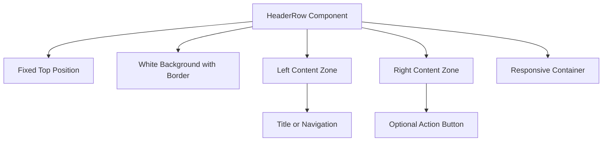
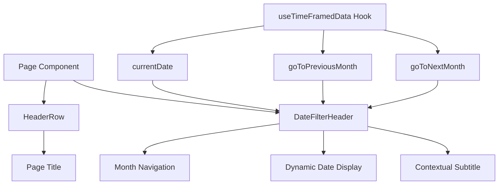
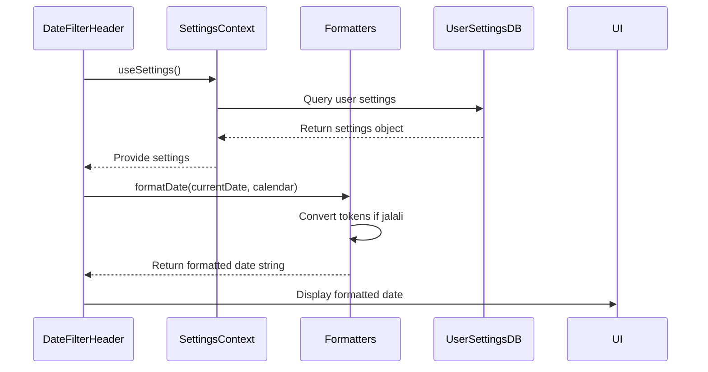
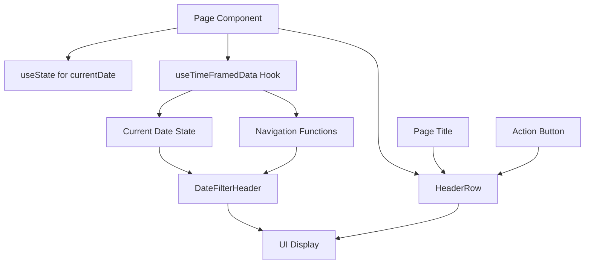

# HeaderRow Component

<cite>
**Referenced Files in This Document**   
- [HeaderRow.tsx](file://src/components/HeaderRow.tsx) - *Updated in recent commit*
- [DateFilterHeader.tsx](file://src/components/DateFilterHeader.tsx) - *Refactored to include HeaderSection functionality*
- [SettingsContext.tsx](file://src/contexts/SettingsContext.tsx)
- [formatters.ts](file://src/lib/formatters.ts)
- [dashboard/page.tsx](file://src/app/dashboard/page.tsx)
- [expenses/page.tsx](file://src/app/expenses/page.tsx)
- [income/page.tsx](file://src/app/income/page.tsx)
</cite>

## Update Summary
- Updated **Integration with DateFilterHeader** section to reflect refactoring of HeaderSection into DateFilterHeader
- Added new **Props Interface for DateFilterHeader** section detailing new `variant`, `isMainTitle`, and subtitle props
- Revised **Usage Examples** to reflect updated DateFilterHeader API
- Removed outdated references to standalone HeaderSection component
- Updated diagram sources and section references to align with current codebase structure

## Table of Contents
1. [Introduction](#introduction)
2. [Component Overview](#component-overview)
3. [Props Interface](#props-interface)
4. [Integration with DateFilterHeader](#integration-with-datefilterheader)
5. [Props Interface for DateFilterHeader](#props-interface-for-datefilterheader)
6. [User Settings and Calendar Preferences](#user-settings-and-calendar-preferences)
7. [Data Flow and Parent Integration](#data-flow-and-parent-integration)
8. [Usage Examples](#usage-examples)
9. [Responsive Design and Accessibility](#responsive-design-and-accessibility)
10. [Extensibility Guidelines](#extensibility-guidelines)

## Introduction
The **HeaderRow** component serves as a consistent, mobile-first header across main application views in the Expense Tracker application. It provides a fixed, top-aligned contextual header that maintains visual consistency on dashboard, expenses, and income pages. When combined with the **DateFilterHeader** component, it enables time-range filtering functionality, allowing users to navigate monthly data views. This document details its composition, integration with user settings, props interface, data flow, responsive behavior, and extensibility patterns.

**Section sources**
- [HeaderRow.tsx](file://src/components/HeaderRow.tsx#L1-L38)

## Component Overview
The **HeaderRow** component is a reusable UI element designed for consistent placement and styling across application pages. It is fixed to the top of the viewport with a white background, border, and subtle shadow to ensure visibility and separation from page content.

It supports two primary content zones:
- **Left**: Typically contains the page title or navigation elements
- **Right**: Optional area for action buttons or icons

The component uses Flexbox for layout and includes an 8-pixel gap between left-side elements via Tailwind's `gap-2`. It is wrapped in a responsive container (`max-w-md`) centered on larger screens.



**Diagram sources**
- [HeaderRow.tsx](file://src/components/HeaderRow.tsx#L1-L38)

**Section sources**
- [HeaderRow.tsx](file://src/components/HeaderRow.tsx#L1-L38)

## Props Interface
The **HeaderRow** component accepts a typed interface `HeaderRowProps` with the following properties:

**:left**  
- **Type**: `React.ReactNode`
- **Required**: Yes
- **Description**: Content to appear on the left side of the header. Usually a title or a combination of icon and text.

**:right**  
- **Type**: `React.ReactNode`
- **Required**: No
- **Description**: Optional content for the right side of the header (e.g., an icon button).

**:className**  
- **Type**: `string`
- **Required**: No
- **Description**: Extra class names for the outer container, allowing for custom styling extensions.

```tsx
interface HeaderRowProps {
  left: React.ReactNode;
  right?: React.ReactNode;
  className?: string;
}
```

**Section sources**
- [HeaderRow.tsx](file://src/components/HeaderRow.tsx#L5-L18)

## Integration with DateFilterHeader
The **HeaderRow** and **DateFilterHeader** components are used together across key pages to provide filtering capabilities. **DateFilterHeader** is typically placed within page content below **HeaderRow**, creating a two-tier header structure.

The **DateFilterHeader** component now incorporates functionality previously handled by a separate HeaderSection component. It provides:
- Month navigation buttons (previous/next)
- Dynamic month/year display
- Contextual subtitle
- Configurable typography via `isMainTitle` prop
- Flexible styling through `variant` prop

This integration simplifies the component hierarchy and centralizes date filtering logic within a single, reusable component.



**Diagram sources**
- [DateFilterHeader.tsx](file://src/components/DateFilterHeader.tsx#L1-L68)
- [expenses/page.tsx](file://src/app/expenses/page.tsx#L152-L351)

**Section sources**
- [DateFilterHeader.tsx](file://src/components/DateFilterHeader.tsx#L1-L68)
- [expenses/page.tsx](file://src/app/expenses/page.tsx#L152-L351)
- [income/page.tsx](file://src/app/income/page.tsx#L108-L307)

## Props Interface for DateFilterHeader
The **DateFilterHeader** component accepts a comprehensive interface that supports flexible configuration across different use cases:

**:monthName**  
- **Type**: `string`
- **Required**: Yes
- **Description**: The name of the current month (already formatted by parent component)

**:year**  
- **Type**: `string`
- **Required**: Yes
- **Description**: The current year as a string

**:onPreviousMonth**  
- **Type**: `() => void`
- **Required**: Yes
- **Description**: Callback function triggered when navigating to the previous month

**:onNextMonth**  
- **Type**: `() => void`
- **Required**: Yes
- **Description**: Callback function triggered when navigating to the next month

**:subtitle**  
- **Type**: `string`
- **Required**: No
- **Description**: Optional contextual subtitle displayed below the date

**:variant**  
- **Type**: `'card' | 'default'`
- **Default**: `'default'`
- **Description**: Controls styling variation; 'card' variant removes bottom margin for card-contained contexts

**:isMainTitle**  
- **Type**: `boolean`
- **Default**: `false`
- **Description**: When true, renders the date as an h1 element with larger, bolder styling

```tsx
interface DateFilterHeaderProps {
  monthName: string;
  year: string;
  onPreviousMonth: () => void;
  onNextMonth: () => void;
  subtitle?: string;
  variant?: 'card' | 'default';
  isMainTitle?: boolean;
}
```

**Section sources**
- [DateFilterHeader.tsx](file://src/components/DateFilterHeader.tsx#L5-L25)

## User Settings and Calendar Preferences
The **DateFilterHeader** component consumes user settings via the **useSettings** hook to format dates according to user preferences. The **SettingsContext** provides access to user-specific settings, including calendar type.

**:calendar**  
- **Type**: `"gregorian" | "jalali"`
- **Default**: `"gregorian"`
- **Source**: `Doc<"userSettings">["calendar"]`

The **formatDate** utility in `formatters.ts` handles calendar-specific formatting:
- For **gregorian**: Uses `date-fns` format function
- For **jalali**: Uses `jalali-moment` with token conversion

When the calendar is set to "jalali", the formatter converts date tokens (e.g., "MMMM" → "jMMMM") to support Persian calendar formatting.



**Diagram sources**
- [SettingsContext.tsx](file://src/contexts/SettingsContext.tsx#L0-L56)
- [formatters.ts](file://src/lib/formatters.ts#L0-L48)
- [DateFilterHeader.tsx](file://src/components/DateFilterHeader.tsx#L1-L68)

**Section sources**
- [SettingsContext.tsx](file://src/contexts/SettingsContext.tsx#L0-L56)
- [formatters.ts](file://src/lib/formatters.ts#L0-L48)
- [DateFilterHeader.tsx](file://src/components/DateFilterHeader.tsx#L1-L68)

## Data Flow and Parent Integration
The data flow for **HeaderRow** and **DateFilterHeader** originates from parent page components that manage state and provide callbacks.

Key data flow elements:
- **useTimeFramedData Hook**: Custom hook that manages date state and provides navigation callbacks
- **currentDate**: State representing the currently viewed month
- **goToPreviousMonth / goToNextMonth**: Functions that update currentDate state

Parent components (e.g., `expenses/page.tsx`) pass these values down to **DateFilterHeader**. The **HeaderRow** receives static or dynamic content via the `left` prop, often including the page title.



**Diagram sources**
- [expenses/page.tsx](file://src/app/expenses/page.tsx#L0-L351)
- [useTimeFramedData.ts](file://src/hooks/useTimeFramedData.ts)

**Section sources**
- [expenses/page.tsx](file://src/app/expenses/page.tsx#L0-L351)
- [dashboard/page.tsx](file://src/app/dashboard/page.tsx#L0-L126)

## Usage Examples
### Dashboard Page
The dashboard uses **HeaderRow** with a simple title:

```tsx
<HeaderRow
  left={<h1 className="text-xl font-bold text-gray-900">Dashboard</h1>}
/>
```

### Expenses Page
The expenses page uses **HeaderRow** with a back button and title:

```tsx
<HeaderRow
  left={
    <>
      <motion.button onClick={() => router.back()}>
        <ArrowLeft size={20} />
      </motion.button>
      <h1 className="text-xl font-bold text-gray-900">Expenses</h1>
    </>
  }
/>
```

### Income Page
Similar to expenses, with navigation:

```tsx
<HeaderRow
  left={
    <>
      <motion.button onClick={() => router.back()}>
        <ArrowLeft size={20} />
      </motion.button>
      <h1 className="text-xl font-bold text-gray-900">Income</h1>
    </>
  }
/>
```

### Date Filtering Example
On expenses and income pages, **DateFilterHeader** is used below **HeaderRow** with card variant:

```tsx
<DateFilterHeader 
  monthName={monthName} 
  year={year} 
  onPreviousMonth={goToPreviousMonth} 
  onNextMonth={goToNextMonth} 
  subtitle="Expense History"
  variant="card"
/>
```

On the dashboard page, it's used with `isMainTitle` for prominent display:

```tsx
<DateFilterHeader 
  monthName={monthName} 
  year={year} 
  onNextMonth={goToNextMonth} 
  onPreviousMonth={goToPreviousMonth} 
  subtitle="Monthly Summary"
  isMainTitle={true}
/>
```

**Section sources**
- [dashboard/page.tsx](file://src/app/dashboard/page.tsx#L24-L28)
- [expenses/page.tsx](file://src/app/expenses/page.tsx#L152-L351)
- [income/page.tsx](file://src/app/income/page.tsx#L108-L307)

## Responsive Design and Accessibility
### Responsive Behavior
- **Mobile-first**: Designed for mobile viewports with `max-w-md` container
- **Fixed Positioning**: Stays at top during scrolling
- **Touch Targets**: Navigation buttons have minimum 44px size for touch accessibility
- **Flexible Layout**: Uses Flexbox with responsive padding

### Accessibility Considerations
- **ARIA Labels**: Navigation buttons include `aria-label` attributes
- **Keyboard Navigation**: Buttons are focusable and operable via keyboard
- **Semantic HTML**: Uses proper heading levels (`h1`, `h2`)
- **Color Contrast**: Text has sufficient contrast against backgrounds
- **Focus States**: Visual indicators for keyboard focus

The component ensures screen reader users can understand the page context and navigate monthly data effectively.

**Section sources**
- [HeaderRow.tsx](file://src/components/HeaderRow.tsx#L1-L38)
- [DateFilterHeader.tsx](file://src/components/DateFilterHeader.tsx#L1-L68)

## Extensibility Guidelines
### Adding Action Buttons
To add action buttons, use the `right` prop:

```tsx
<HeaderRow
  left={<h1>Title</h1>}
  right={
    <button aria-label="Settings">
      <SettingsIcon />
    </button>
  }
/>
```

### Extending with Additional Filters
To add filter types:
1. Create a new filter component
2. Place it below **HeaderRow** but above content
3. Ensure it shares the same responsive container

### Visual Consistency
Maintain consistency by:
- Using the same button styles (44px min size, rounded)
- Keeping text styles consistent (font size, weight, color)
- Preserving spacing (use Tailwind's spacing scale)
- Following the same iconography pattern

Avoid modifying **HeaderRow** directly; instead, extend via props and composition to ensure uniformity across views.

**Section sources**
- [HeaderRow.tsx](file://src/components/HeaderRow.tsx#L1-L38)
- [DateFilterHeader.tsx](file://src/components/DateFilterHeader.tsx#L1-L68)