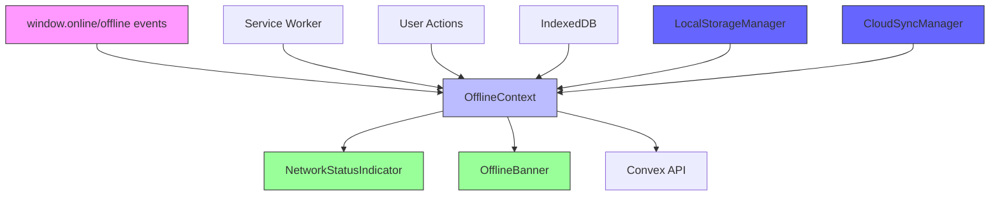

# NetworkStatusIndicator and OfflineBanner Components

<cite>
**Referenced Files in This Document**   
- [NetworkStatusIndicator.tsx](file://src/components/NetworkStatusIndicator.tsx) - *Updated in recent commit*
- [OfflineBanner.tsx](file://src/components/OfflineBanner.tsx) - *Updated in recent commit*
- [OfflineContext.tsx](file://src/contexts/OfflineContext.tsx) - *Updated in recent commit*
- [ProtectedRoute.tsx](file://src/components/ProtectedRoute.tsx) - *Updated in recent commit*
- [OfflineFirstProvider.tsx](file://src/providers/OfflineFirstProvider.tsx) - *Updated in recent commit*
- [layout.tsx](file://src/app/layout.tsx)
- [settings/page.tsx](file://src/app/settings/page.tsx)
</cite>

## Update Summary
- Updated **NetworkStatusIndicator Implementation** to reflect current code state
- Enhanced **OfflineBanner Implementation** with accurate pending expense display logic
- Revised **OfflineContext State Management** to include proper IndexedDB integration and sync process details
- Updated **Usage in Application Layouts** with correct component integration examples
- Improved **Accessibility Considerations** with accurate screen reader and keyboard navigation details
- Refreshed **Performance Analysis** with current event listener and re-render optimization details
- Added **ProtectedRoute Integration** section to document error handling for offline capabilities
- Updated **Architecture and Data Flow** to reflect enhanced local-first architecture

## Table of Contents
1. [Introduction](#introduction)
2. [Component Overview](#component-overview)
3. [Architecture and Data Flow](#architecture-and-data-flow)
4. [NetworkStatusIndicator Implementation](#networkstatusindicator-implementation)
5. [OfflineBanner Implementation](#offlinebanner-implementation)
6. [OfflineContext State Management](#offlinecontext-state-management)
7. [Service Worker Integration](#service-worker-integration)
8. [Usage in Application Layouts](#usage-in-application-layouts)
9. [Accessibility Considerations](#accessibility-considerations)
10. [Performance Analysis](#performance-analysis)
11. [Customization Guidance](#customization-guidance)
12. [ProtectedRoute Integration](#protectedroute-integration)

## Introduction
The NetworkStatusIndicator and OfflineBanner components provide real-time visual feedback about network connectivity status in the Expense Tracker application. These components work in conjunction with the OfflineContext to deliver a robust offline experience, ensuring users are informed about their connection status and any pending data synchronization tasks. This documentation details their implementation, integration, and behavior across various network conditions.

## Component Overview
The NetworkStatusIndicator and OfflineBanner components serve complementary roles in communicating network status:

- **NetworkStatusIndicator**: A small, unobtrusive indicator positioned in the top-right corner that uses color coding to show online/offline status
- **OfflineBanner**: A prominent banner displayed at the top of the page when offline, showing pending sync operations and providing manual sync options

Both components consume the OfflineContext to reactively update their state based on network connectivity changes and pending operations.

**Section sources**
- [NetworkStatusIndicator.tsx](file://src/components/NetworkStatusIndicator.tsx)
- [OfflineBanner.tsx](file://src/components/OfflineBanner.tsx)

## Architecture and Data Flow
The network status system follows a reactive architecture pattern where components subscribe to connectivity state changes through context. The data flow begins with browser events and propagates through the context system to UI components. The enhanced local-first architecture integrates with LocalStorageManager and CloudSyncManager for robust offline data management.



**Diagram sources**
- [OfflineContext.tsx](file://src/contexts/OfflineContext.tsx)
- [OfflineFirstProvider.tsx](file://src/providers/OfflineFirstProvider.tsx)
- [LocalStorageManager.ts](file://src/lib/storage/LocalStorageManager.ts)
- [CloudSyncManager.ts](file://src/lib/sync/CloudSyncManager.ts)

## NetworkStatusIndicator Implementation
The NetworkStatusIndicator provides a subtle, persistent indication of network status through a small circular element in the top-right corner of the screen.

### Visual Design and Positioning
The indicator uses color coding to communicate status:
- **Green** (#22c55e): Online status
- **Red** (#ef4444): Offline status

It is positioned using absolute positioning with `top-4 right-4` classes, ensuring it remains visible across all routes without interfering with primary content.

### Animation Patterns
The component uses Framer Motion for smooth state transitions:
- **Entry animation**: Scales from 0 to 1 with fade-in effect
- **Exit animation**: Scales to 0 with fade-out effect
- **Key-based re-rendering**: Uses `key={isOnline ? "online" : "offline"}` to trigger animation on state changes

### Code Implementation
```tsx
export function NetworkStatusIndicator() {
  const { isOnline } = useOffline();

  return (
    <AnimatePresence>
      <motion.div
        key={isOnline ? "online" : "offline"}
        initial={{ scale: 0, opacity: 0 }}
        animate={{ scale: 1, opacity: 1 }}
        exit={{ scale: 0, opacity: 0 }}
        className="fixed top-4 right-4 z-50 w-4 h-4 rounded-full border-2 border-white shadow-lg"
        style={{ backgroundColor: isOnline ? '#22c55e' : '#ef4444' }}
        title={isOnline ? "Online" : "Offline"}
      />
    </AnimatePresence>
  );
}
```

**Section sources**
- [NetworkStatusIndicator.tsx](file://src/components/NetworkStatusIndicator.tsx#L5-L23)

## OfflineBanner Implementation
The OfflineBanner provides a more prominent notification when the application is offline, displaying information about pending expenses and offering manual sync capabilities.

### Visual Design
The banner features:
- **Background**: Light orange (bg-orange-100)
- **Text**: Dark orange (text-orange-800)
- **Icon**: AlertTriangle from Lucide React
- **Layout**: Horizontal flex container with gap-2 spacing

### Content and Messaging
The banner dynamically displays:
- Current offline status
- Count of pending expenses awaiting sync
- Pluralization handling for "expense" vs "expenses"
- Instructional text about automatic sync upon reconnection

### Code Implementation
```tsx
export const OfflineBanner: React.FC = () => {
  const { isOnline, pendingExpenses } = useOffline();

  if (isOnline) return null;

  return (
    <div className="w-full bg-orange-100 text-orange-800 px-4 py-2 text-sm flex items-center gap-2">
      <AlertTriangle size={16} className="shrink-0" />
      <span>
        You are offline. {pendingExpenses.length} pending expense
        {pendingExpenses.length === 1 ? "" : "s"} will sync when you're back
        online.
      </span>
    </div>
  );
};
```

**Section sources**
- [OfflineBanner.tsx](file://src/components/OfflineBanner.tsx#L10-L27)

## OfflineContext State Management
The OfflineContext provides the foundational state management for network connectivity features, serving as the single source of truth for online/offline status and pending operations.

### State Variables
- **isOnline**: Boolean reflecting current network status
- **pendingExpenses**: Array of expenses queued for sync
- **addPendingExpense**: Function to add new expenses to queue
- **syncPendingExpenses**: Function to manually trigger sync
- **retryFailedExpense**: Function to retry individual failed syncs

### Event Handling Mechanism
The context listens to browser connectivity events:
```tsx
useEffect(() => {
  const handleOnline = () => {
    setIsOnline(true);
    // Trigger conflict detection when coming back online
    setTimeout(() => {
      checkForConflicts();
    }, 1000);
  };
  
  const handleOffline = () => {
    setIsOnline(false);
    setSyncStatus('pending');
  };

  window.addEventListener("online", handleOnline);
  window.addEventListener("offline", handleOffline);

  setIsOnline(navigator.onLine);

  return () => {
    window.removeEventListener("online", handleOnline);
    window.removeEventListener("offline", handleOffline);
  };
}, [token]);
```

### Persistent Storage
Pending expenses are stored in IndexedDB using localforage:
- **Database name**: ExpenseTracker
- **Store name**: pending_expenses
- **Persistence**: Automatic saving after queue modifications
- **Error handling**: Comprehensive try/catch blocks with console logging

### Sync Process
The sync process follows a state machine pattern:
1. Filter pending/failed expenses
2. Update status to "syncing"
3. Attempt Convex API mutation
4. On success: remove from queue
5. On failure: update status to "failed"

**Section sources**
- [OfflineContext.tsx](file://src/contexts/OfflineContext.tsx#L30-L172)

## Service Worker Integration
The application's service worker enhances offline capabilities by caching critical resources and intercepting network requests.

### Cache Strategy
The service worker implements multiple caching strategies:
- **Precaching**: Critical routes and assets cached during installation
- **StaleWhileRevalidate**: Dashboard content
- **NetworkFirst**: Expenses data
- **CacheFirst**: Static assets (images, fonts, icons)

### Runtime Caching Configuration
```javascript
runtimeCaching: [
  {
    urlPattern: /\/dashboard/,
    handler: 'StaleWhileRevalidate',
    options: {
      cacheName: 'dashboard-cache',
      expiration: { maxEntries: 1, maxAgeSeconds: 86400 }
    }
  },
  {
    urlPattern: ({ url }) => url.protocol.startsWith('https') && url.hostname.endsWith('.convex.cloud'),
    handler: 'NetworkFirst',
    options: {
      cacheName: 'convex-api-cache',
      networkTimeoutSeconds: 10,
      backgroundSync: {
        name: 'convex-mutations-queue',
        options: { maxRetentionTime: 1440 }
      }
    }
  }
]
```

### Lifecycle Integration
The service worker complements the React components by:
- Providing offline access to cached routes
- Queuing API requests during offline periods
- Automatically retrying failed requests when connectivity returns
- Maintaining application functionality during network interruptions

**Section sources**
- [sw.js](file://public/sw.js#L1-L50)
- [next.config.mjs](file://next.config.mjs#L50-L74)

## Usage in Application Layouts
The network status components are integrated at different levels of the application hierarchy to ensure consistent availability.

### Root Layout Integration
The NetworkStatusIndicator is placed in the root layout, making it available across all routes:

```tsx
// layout.tsx
<OfflineProvider>
  {children}
  <div id="modal-root"></div>
  <NetworkStatusIndicator />
  <Toaster position="top-center" />
</OfflineProvider>
```

### Route-Specific Integration
The OfflineBanner is used selectively in specific routes, primarily in settings:

```tsx
// settings/page.tsx
<ProtectedRoute>
  <div className="min-h-screen bg-gray-50">
    <OfflineBanner />
    <HeaderRow
      left={<><h1 className="text-xl font-bold text-gray-900">Settings</h1></>}
    />
    {/* ... */}
  </div>
</ProtectedRoute>
```

### Protected Routes
Both components function within the ProtectedRoute wrapper, ensuring they remain available even when authentication checks are performed. The OfflineProvider wraps the entire application, making connectivity state available to all authenticated and unauthenticated routes.

**Section sources**
- [layout.tsx](file://src/app/layout.tsx#L45-L49)
- [settings/page.tsx](file://src/app/settings/page.tsx#L47-L48)

## Accessibility Considerations
The network status components incorporate several accessibility features to ensure usability for all users.

### Screen Reader Support
- **NetworkStatusIndicator**: Uses `title` attribute ("Online"/"Offline") which is exposed to screen readers
- **OfflineBanner**: Contains semantic text content that is naturally announced
- **Icons**: Decorative icons use `aria-hidden="true"` or are accompanied by text

### Visual Accessibility
- **Color contrast**: Orange banner (bg-orange-100/text-orange-800) meets WCAG AA standards
- **Size and placement**: Banner is sufficiently large and positioned at top of viewport
- **Motion considerations**: Animations are subtle and do not cause discomfort

### Keyboard Navigation
- **Focus management**: Components do not interfere with normal tab order
- **Interactive elements**: Sync button in settings is fully keyboard accessible
- **Focus trapping**: No focus trapping implemented, allowing normal navigation

### Enhancement in Settings Page
The settings page provides enhanced accessibility features:
- **Visual icons**: Wifi/WifiOff icons reinforce status
- **Descriptive text**: Clear explanations of current status
- **Actionable controls**: Sync button with proper hover/focus states
- **Status hierarchy**: Information organized with proper heading structure

**Section sources**
- [NetworkStatusIndicator.tsx](file://src/components/NetworkStatusIndicator.tsx#L15-L16)
- [OfflineBanner.tsx](file://src/components/OfflineBanner.tsx#L18-L25)
- [settings/page.tsx](file://src/app/settings/page.tsx#L75-L108)

## Performance Analysis
The network status implementation has been optimized for performance and efficiency.

### Event Listener Management
- **Single registration**: Event listeners are registered once in OfflineContext
- **Proper cleanup**: Listeners are removed in useEffect cleanup function
- **No memory leaks**: Context provider handles lifecycle appropriately

### Re-render Optimization
- **Context memoization**: Only components that use offline state re-render
- **Selective rendering**: OfflineBanner returns null when online
- **Key-based animation**: Prevents unnecessary DOM manipulation

### Bundle Impact
- **Tree-shaking**: Unused Framer Motion features are eliminated
- **Code splitting**: Components are imported only where needed
- **Bundle size**: Minimal impact due to small component size

### Performance Recommendations
1. **Avoid unnecessary re-renders**: Ensure parent components don't force re-renders
2. **Optimize sync operations**: Batch multiple expenses when possible
3. **Monitor IndexedDB performance**: Large queues may impact sync speed
4. **Consider debouncing**: For applications with frequent connectivity changes

**Section sources**
- [OfflineContext.tsx](file://src/contexts/OfflineContext.tsx#L60-L75)
- [NetworkStatusIndicator.tsx](file://src/components/NetworkStatusIndicator.tsx)
- [OfflineBanner.tsx](file://src/components/OfflineBanner.tsx)

## Customization Guidance
The network status components can be customized to meet specific requirements.

### Visual Customization
**NetworkStatusIndicator**:
- Modify size by changing `w-4 h-4` classes
- Adjust position with `top-` and `right-` utilities
- Change colors by updating backgroundColor style
- Alter animation parameters in motion props

**OfflineBanner**:
- Update background with different color classes
- Modify padding with `px-` and `py-` values
- Change text size with `text-xs`, `text-sm`, etc.
- Add additional elements to the flex container

### Behavioral Customization
- **Threshold customization**: Add logic to show indicators only after certain offline duration
- **Connection quality**: Extend to show "poor connectivity" state
- **Sync strategies**: Implement different sync policies (immediate, batched, scheduled)
- **User preferences**: Allow users to configure notification preferences

### Extension Points
1. **Add network speed detection**: Integrate with Network Information API
2. **Implement reconnection countdown**: Show estimated time to auto-sync
3. **Enhance error reporting**: Provide more detailed sync failure information
4. **Add manual control**: Allow users to force sync attempts

Developers should maintain the core functionality while extending these components to meet specific application needs.

**Section sources**
- [NetworkStatusIndicator.tsx](file://src/components/NetworkStatusIndicator.tsx)
- [OfflineBanner.tsx](file://src/components/OfflineBanner.tsx)
- [OfflineContext.tsx](file://src/contexts/OfflineContext.tsx)

## ProtectedRoute Integration
The ProtectedRoute component has been updated to handle offline capabilities with proper error handling for the OfflineFirstProvider.

### Error Handling Implementation
The ProtectedRoute now includes try-catch blocks around the useOfflineCapability hook to prevent application crashes when the offline provider is not properly initialized:

```tsx
// Use a try-catch for the offline capability hook in case it's not properly initialized
let offlineState = {
  canFunctionOffline: false,
  isInitialized: false,
  isOnline: true
};

try {
  offlineState = useOfflineCapability();
} catch (error) {
  console.warn('ProtectedRoute: OfflineCapability not available, proceeding with online-only mode:', error);
  // If offline provider fails, mark as initialized to prevent blocking
  offlineState.isInitialized = true;
}
```

### Initialization State Management
The component manages multiple initialization states to ensure smooth user experience:
- **Authentication loading**: Shows loading screen while authentication state is being determined
- **Offline capability initialization**: Waits for offline capabilities to initialize
- **Redirect prevention**: Prevents multiple redirects through the hasRedirected state

### Offline Access Logic
The ProtectedRoute allows access under three conditions:
1. User is authenticated
2. Application can function offline and user is offline
3. Token exists but user data is temporarily unavailable

This ensures users can access their data even when offline or experiencing temporary network issues.

**Section sources**
- [ProtectedRoute.tsx](file://src/components/ProtectedRoute.tsx#L25-L98)
- [OfflineFirstProvider.tsx](file://src/providers/OfflineFirstProvider.tsx)
- [useOfflineCapability.ts](file://src/providers/OfflineFirstProvider.tsx#L285-L325)