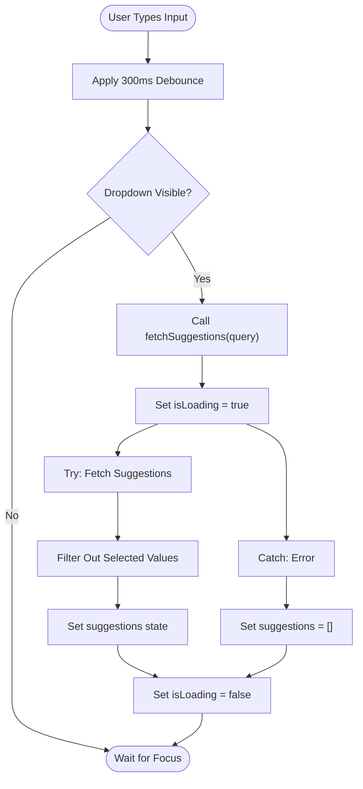
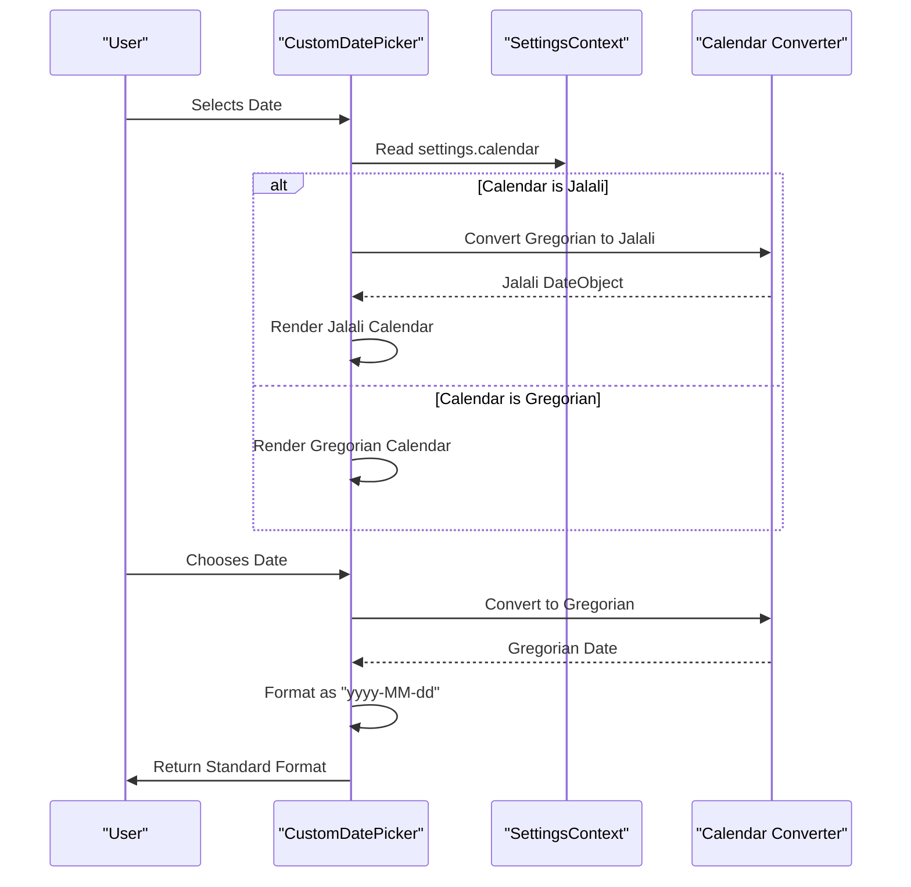
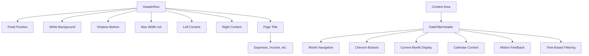
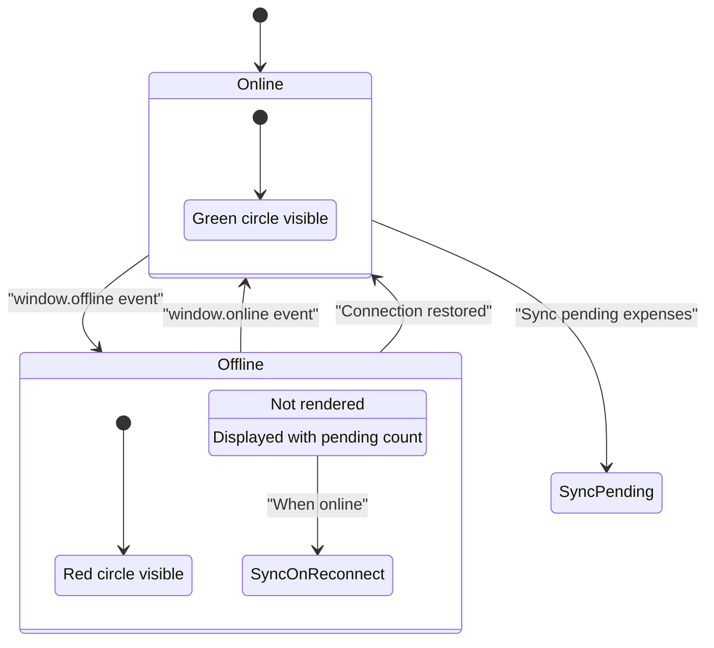
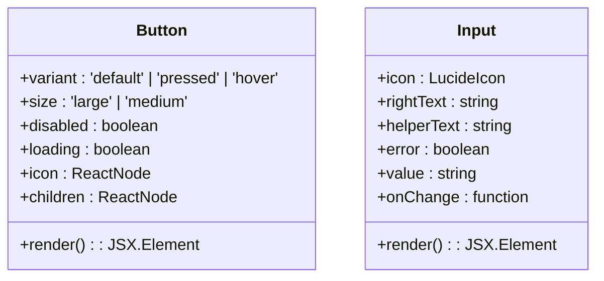
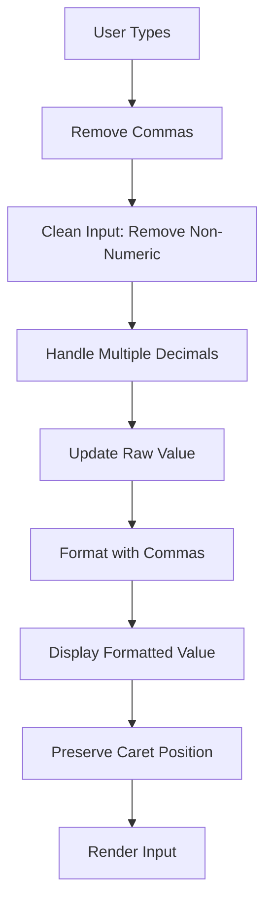
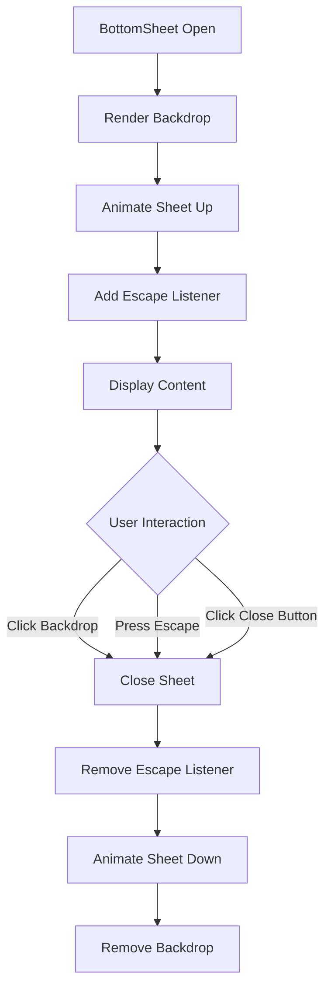
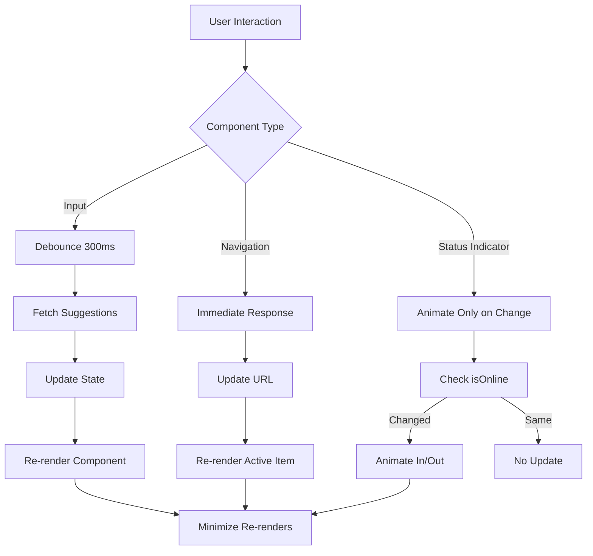

# Reusable UI Components Library

<cite>
**Referenced Files in This Document**   
- [SmartSelectInput.tsx](file://src/components/SmartSelectInput.tsx#L1-L237)
- [CustomDatePicker.tsx](file://src/components/CustomDatePicker.tsx#L1-L70)
- [HeaderRow.tsx](file://src/components/HeaderRow.tsx#L1-L38)
- [DateFilterHeader.tsx](file://src/components/DateFilterHeader.tsx#L1-L49)
- [BottomNav.tsx](file://src/components/BottomNav.tsx#L1-L58)
- [NetworkStatusIndicator.tsx](file://src/components/NetworkStatusIndicator.tsx#L1-L22)
- [OfflineBanner.tsx](file://src/components/OfflineBanner.tsx#L1-L26)
- [OfflineContext.tsx](file://src/contexts/OfflineContext.tsx#L1-L171)
- [SettingsContext.tsx](file://src/contexts/SettingsContext.tsx#L1-L57)
- [formatters.ts](file://src/lib/formatters.ts#L1-L48)
- [page.tsx](file://src/app/expenses/page.tsx#L152-L351)
- [page.tsx](file://src/app/expenses/edit/[id]/page.tsx#L195-L394)
- [Button.tsx](file://src/components/Button.tsx) - *Added in recent commit*
- [Input.tsx](file://src/components/Input.tsx) - *Added in recent commit*
- [CurrencyInput.tsx](file://src/components/CurrencyInput.tsx) - *Added in recent commit*
- [BottomSheet.tsx](file://src/components/BottomSheet.tsx) - *Added in recent commit*
- [ProtectedRoute.tsx](file://src/components/ProtectedRoute.tsx#L1-L98) - *Updated in recent commit*
- [OfflineFirstProvider.tsx](file://src/providers/OfflineFirstProvider.tsx#L1-L326) - *Updated in recent commit*
</cite>

## Update Summary
**Changes Made**   
- Added new section for `Button` and `Input` components
- Added new section for `CurrencyInput` component
- Added new section for `BottomSheet` component
- Updated `NetworkStatusIndicator` and `OfflineBanner` sections with new implementation details
- Added new diagram for `BottomSheet` component
- Updated referenced files list to include newly added components
- Added new section for `ProtectedRoute` component with updated authentication and offline capability handling
- Updated documentation to reflect changes in offline capability detection and initialization

## Table of Contents
1. [SmartSelectInput: Accessible Searchable Dropdown](#smartselectinput-accessible-searchable-dropdown)
2. [CustomDatePicker: Mobile-Friendly Date Input](#customdatepicker-mobile-friendly-date-input)
3. [HeaderRow and DateFilterHeader: Consistent Contextual Headers](#headerrow-and-datefilterheader-consistent-contextual-headers)
4. [BottomNav: PWA-Optimized Navigation](#bottomnav-pwa-optimized-navigation)
5. [NetworkStatusIndicator and OfflineBanner: Real-Time Connectivity Feedback](#networkstatusindicator-and-offlinebanner-real-time-connectivity-feedback)
6. [Button and Input: Foundational Form Components](#button-and-input-foundational-form-components)
7. [CurrencyInput: Specialized Amount Input](#currencyinput-specialized-amount-input)
8. [BottomSheet: Modal-Style Container for Mobile](#bottomsheet-modal-style-container-for-mobile)
9. [ProtectedRoute: Authentication and Offline Capability Management](#protectedroute-authentication-and-offline-capability-management)
10. [Component Composition and Integration Examples](#component-composition-and-integration-examples)
11. [Accessibility, Responsiveness, and Performance](#accessibility-responsiveness-and-performance)
12. [Extensibility and Design Consistency Guidelines](#extensibility-and-design-consistency-guidelines)

## SmartSelectInput: Accessible Searchable Dropdown

The `SmartSelectInput` component provides an accessible, searchable dropdown with dynamic options and validation states. It supports both single and multiple selection modes, with real-time suggestion fetching and the ability to create new items directly from user input.

Key features include:
- **Dynamic Suggestions**: Fetches suggestions asynchronously based on user input using the `fetchSuggestions` prop
- **Debounced Search**: Uses `useDebounce` hook to prevent excessive API calls (300ms delay)
- **New Item Creation**: Allows users to create new items when `onCreateNew` callback is provided
- **Keyboard Navigation**: Full keyboard support including arrow keys, Enter, Escape, and Backspace
- **Accessibility**: Proper ARIA labeling and focus management
- **Visual Feedback**: Highlights matching text in suggestions and shows loading states

The component maintains internal state for input value, suggestions, loading status, dropdown visibility, and active index for keyboard navigation. It uses `framer-motion` for smooth dropdown animations and handles clicks outside the component to close the dropdown.



**Section sources**
- [SmartSelectInput.tsx](file://src/components/SmartSelectInput.tsx#L1-L237)

## CustomDatePicker: Mobile-Friendly Date Input

The `CustomDatePicker` component implements a date input with native-like behavior and mobile PWA compatibility. It leverages the `react-multi-date-picker` library with support for both Gregorian and Jalali (Persian) calendars based on user settings.

Key implementation details:
- **Calendar System Support**: Uses `SettingsContext` to determine whether to display dates in Gregorian or Jalali calendar
- **Bidirectional Conversion**: Converts between calendar systems while maintaining Gregorian storage format
- **Consistent Formatting**: Uses `date-fns` for Gregorian formatting and `jalali-moment` for Jalali formatting
- **Stable References**: Uses `useRef` to maintain stable `DateObject` references and prevent unnecessary re-renders
- **Theming**: Styled with Tailwind CSS for consistent appearance with the application's design system

The component accepts dates in "YYYY-MM-DD" format and converts them to the appropriate calendar system for display. When a date is selected, it converts back to Gregorian calendar and formats it in the standard "yyyy-MM-dd" format for consistent storage.



**Diagram sources**
- [CustomDatePicker.tsx](file://src/components/CustomDatePicker.tsx#L1-L70)
- [SettingsContext.tsx](file://src/contexts/SettingsContext.tsx#L1-L57)

**Section sources**
- [CustomDatePicker.tsx](file://src/components/CustomDatePicker.tsx#L1-L70)

## HeaderRow and DateFilterHeader: Consistent Contextual Headers

The `HeaderRow` and `DateFilterHeader` components work together to provide consistent contextual time filtering across application pages. This composition ensures a unified user experience for navigating time-based data.

### HeaderRow
The `HeaderRow` component serves as a mobile-first header that is fixed to the top of the page with a white background and subtle shadow. Key characteristics:
- Fixed positioning with z-index 50 to stay above other content
- Responsive design with maximum width of md (640px) and horizontal padding
- Flexible layout with left and right content areas
- Automatic gap of 8px (Tailwind `gap-2`) between items on the left side
- Border bottom with light gray color for visual separation

### DateFilterHeader
The `DateFilterHeader` component provides month navigation controls and contextual time filtering:
- **Navigation Controls**: Left and right chevron buttons for month navigation
- **Dynamic Title**: Displays current month and year based on calendar settings
- **Context Awareness**: Uses `SettingsContext` to format dates according to user's preferred calendar
- **Motion Effects**: Uses `framer-motion` for button press feedback (scale 0.95)

When composed together, these components create a consistent header pattern where `HeaderRow` contains the main page title on the left, while `DateFilterHeader` appears in the content area below for time-based filtering.



**Diagram sources**
- [HeaderRow.tsx](file://src/components/HeaderRow.tsx#L1-L38)
- [DateFilterHeader.tsx](file://src/components/DateFilterHeader.tsx#L1-L49)

**Section sources**
- [HeaderRow.tsx](file://src/components/HeaderRow.tsx#L1-L38)
- [DateFilterHeader.tsx](file://src/components/DateFilterHeader.tsx#L1-L49)

## BottomNav: PWA-Optimized Navigation

The `BottomNav` component provides a mobile-optimized navigation bar that appears fixed at the bottom of the screen on mobile devices (hidden on medium screens and larger). It supports PWA installability considerations with touch-friendly targets and visual feedback.

Key features:
- **Responsive Design**: Only visible on mobile devices using `md:hidden` Tailwind class
- **Fixed Positioning**: Stays at the bottom of the viewport with proper z-index
- **Active State Indicators**: Visual distinction for the currently active route using blue text color
- **Touch Optimization**: Minimum 44px height and width for touch targets
- **Motion Feedback**: Uses `framer-motion` for button press animation (scale 0.95)
- **Accessibility**: Proper semantic HTML with `nav` element and descriptive labels

The component uses Next.js `usePathname` hook to determine the active route and highlight the corresponding navigation item. It contains four primary navigation items: Expenses, Income, Dashboard, and Settings, each with an icon and text label.

```mermaid
classDiagram
class BottomNav {
+navItems : Array<{href, icon, label}>
+pathname : string
+isActive : boolean
+render() : JSX.Element
}
class NavItem {
+href : string
+icon : React.Component
+label : string
+isActive : boolean
}
BottomNav --> NavItem : "maps"
BottomNav --> "usePathname" : "uses"
BottomNav --> "Link" : "uses Next.js Link"
BottomNav --> "motion" : "uses framer-motion"
```

**Diagram sources**
- [BottomNav.tsx](file://src/components/BottomNav.tsx#L1-L58)

**Section sources**
- [BottomNav.tsx](file://src/components/BottomNav.tsx#L1-L58)

## NetworkStatusIndicator and OfflineBanner: Real-Time Connectivity Feedback

These components provide real-time feedback about the application's network connectivity status using the `OfflineContext`. They work together to inform users about offline capabilities and synchronization status.

### NetworkStatusIndicator
A small, unobtrusive indicator that appears in the top-right corner of the screen:
- **Visual State**: Green circle when online, red circle when offline
- **Animation**: Uses `framer-motion` for smooth appearance and disappearance
- **Positioning**: Fixed position with high z-index to remain visible
- **Accessibility**: Title attribute provides screen reader information

### OfflineBanner
A more prominent banner that appears when the application is offline:
- **Conditional Rendering**: Only displayed when `isOnline` is false
- **Information Display**: Shows the number of pending expenses that will sync when connectivity is restored
- **Visual Design**: Orange background with appropriate text color for readability
- **Content**: Includes an alert icon and descriptive text about offline status

Both components consume the `useOffline` hook from `OfflineContext`, which manages the offline state, pending expenses queue, and synchronization logic.



**Diagram sources**
- [NetworkStatusIndicator.tsx](file://src/components/NetworkStatusIndicator.tsx#L1-L22)
- [OfflineBanner.tsx](file://src/components/OfflineBanner.tsx#L1-L26)
- [OfflineContext.tsx](file://src/contexts/OfflineContext.tsx#L1-L171)

**Section sources**
- [NetworkStatusIndicator.tsx](file://src/components/NetworkStatusIndicator.tsx#L1-L22)
- [OfflineBanner.tsx](file://src/components/OfflineBanner.tsx#L1-L26)

## Button and Input: Foundational Form Components

The `Button` and `Input` components form the foundational building blocks for forms and interactive elements throughout the application.

### Button
The `Button` component provides a consistent, accessible interface for user actions with multiple variants and states:
- **Variants**: Default, pressed, and hover states with appropriate visual feedback
- **Sizes**: Large and medium options with consistent padding and text sizing
- **States**: Disabled and loading states with appropriate visual indicators
- **Accessibility**: Proper button semantics and keyboard interaction
- **Theming**: Custom styling using CSS variables and Tailwind classes

The component uses a variant system to manage different visual states and applies appropriate transitions for interactive feedback.

### Input
The `Input` component provides a styled text input with support for icons, helper text, and validation states:
- **States**: Default, filled, focused, error, and disabled states with distinct visual appearance
- **Icons**: Support for left-aligned icons via the `icon` prop
- **Right Text**: Optional right-aligned text (e.g., currency selector)
- **Helper Text**: Descriptive text below the input for guidance
- **Error Handling**: Visual indication of validation errors

The component manages focus state internally and applies appropriate styling based on the current state.



**Section sources**
- [Button.tsx](file://src/components/Button.tsx)
- [Input.tsx](file://src/components/Input.tsx)

## CurrencyInput: Specialized Amount Input

The `CurrencyInput` component is a specialized input for handling monetary values with automatic formatting and currency symbol display.

Key features:
- **Currency Symbol**: Displays the appropriate currency symbol from `SettingsContext` or custom prop
- **Thousand Separators**: Automatically formats numbers with commas (e.g., 8,580,909)
- **Raw Value Management**: Maintains raw numeric string (without commas) in parent state for form submission
- **Input Validation**: Allows only digits and decimal points, preventing invalid characters
- **Caret Positioning**: Maintains caret position at the end during formatting updates

The component wraps the base `Input` component and uses `InputContainer` for consistent styling. It extracts the currency symbol from the settings context and formats the display value while maintaining a clean raw value for data handling.



**Diagram sources**
- [CurrencyInput.tsx](file://src/components/CurrencyInput.tsx#L1-L95)
- [SettingsContext.tsx](file://src/contexts/SettingsContext.tsx#L1-L57)
- [InputContainer.tsx](file://src/components/InputContainer.tsx)

**Section sources**
- [CurrencyInput.tsx](file://src/components/CurrencyInput.tsx#L1-L95)

## BottomSheet: Modal-Style Container for Mobile

The `BottomSheet` component provides a modal-style container that slides up from the bottom of the screen, ideal for displaying additional information on mobile devices.

Key features:
- **Animation**: Uses `framer-motion` for smooth entrance and exit animations with spring physics
- **Backdrop**: Semi-transparent backdrop that closes the sheet when clicked
- **Escape Key**: Supports closing via Escape key press
- **Scrollable Content**: Contains a scrollable area for longer content
- **Fixed Positioning**: Stays at the bottom of the viewport with proper z-index stacking
- **Responsive Design**: Centered with maximum width on larger screens

The component uses `AnimatePresence` to manage the enter/exit animations and maintains accessibility by managing focus and keyboard interactions.



**Diagram sources**
- [BottomSheet.tsx](file://src/components/BottomSheet.tsx#L1-L64)

**Section sources**
- [BottomSheet.tsx](file://src/components/BottomSheet.tsx#L1-L64)

## ProtectedRoute: Authentication and Offline Capability Management

The `ProtectedRoute` component centralizes authentication state management and offline capability checks, providing standardized loading and redirect UI patterns. It ensures users are properly authenticated while supporting offline functionality when available.

Key features:
- **Authentication State Management**: Uses `useAuth` hook to track user authentication status, loading state, and token presence
- **Offline Capability Detection**: Integrates with `useOfflineCapability` hook to determine if the application can function offline
- **Graceful Error Handling**: Implements try-catch around offline capability hook to prevent blocking when provider is unavailable
- **Multiple Access Conditions**: Allows access under several conditions:
  - User is authenticated
  - Application can function offline and is currently offline
  - Authentication token exists but user data is temporarily unavailable
- **Loading States**: Displays unified loading screen during initialization
- **Redirect Management**: Prevents multiple redirects with `hasRedirected` state flag

The component implements a comprehensive access control strategy that balances security with usability, allowing temporary access when network issues prevent immediate user data retrieval while still enforcing authentication requirements.

```mermaid
flowchart TD
A[ProtectedRoute Render] --> B{Check States}
B --> C[loading || !isInitialized]
C --> |Yes| D[Show Loading Screen]
C --> |No| E{hasRedirected?}
E --> |Yes| F[Continue Processing]
E --> |No| G{user?}
G --> |Yes| H[Allow Access]
G --> |No| I{canFunctionOffline && !isOnline?}
I --> |Yes| J[Allow Offline Access]
I --> |No| K{token && isOnline?}
K --> |Yes| L[Allow Temporary Access]
K --> |No| M[Set hasRedirected=true]
M --> N[Redirect to /login]
N --> O[Show Redirecting Screen]
```

**Section sources**
- [ProtectedRoute.tsx](file://src/components/ProtectedRoute.tsx#L1-L98)
- [OfflineFirstProvider.tsx](file://src/providers/OfflineFirstProvider.tsx#L1-L326)

## Component Composition and Integration Examples

This section demonstrates how the reusable components are composed together in actual application pages, showing their integration with form handling logic and contextual usage.

### SmartSelectInput in Expense Form
In the expenses page, `SmartSelectInput` is used for both categories and "For" fields with different configurations:

```tsx
<SmartSelectInput
  name="category"
  label="Categories *"
  multiple
  value={formData.category}
  onChange={(newCategories) => setFormData({ ...formData, category: newCategories })}
  fetchSuggestions={fetchCategorySuggestions}
  onCreateNew={handleCreateCategory}
  formatNewItem={capitalizeWords}
  placeholder="Select or add categories"
/>

<SmartSelectInput
  name="for"
  label="For (optional)"
  multiple={false}
  value={formData.for}
  onChange={(newFor) => setFormData({ ...formData, for: newFor })}
  fetchSuggestions={fetchForSuggestions}
  onCreateNew={handleCreateForValue}
  formatNewItem={capitalizeWords}
  placeholder="Select or add a person"
/>
```

Key integration points:
- **Form State Management**: Directly updates `formData` state via `onChange` callback
- **Dynamic Suggestions**: Uses page-specific fetch functions that filter available options
- **Creation Handlers**: Calls page-specific functions to create new categories or "for" values
- **Text Formatting**: Applies `capitalizeWords` function to new items before creation

### Header Composition Pattern
The consistent header pattern combines `HeaderRow` and `DateFilterHeader`:

```tsx
<HeaderRow
  left={<h1 className="text-xl font-bold text-gray-900">Expenses</h1>}
/>

{/* Later in the content */}
<DateFilterHeader 
  currentDate={currentDate} 
  onPreviousMonth={goToPreviousMonth} 
  onNextMonth={goToNextMonth} 
  title="Expenses History"
/>
```

This creates a hierarchical information structure where:
1. `HeaderRow` provides the primary page context (Expenses)
2. `DateFilterHeader` provides secondary, time-based context for the content below

**Section sources**
- [page.tsx](file://src/app/expenses/page.tsx#L152-L351)
- [page.tsx](file://src/app/expenses/edit/[id]/page.tsx#L195-L394)

## Accessibility, Responsiveness, and Performance

### Accessibility Features
All components implement comprehensive accessibility features:

- **Keyboard Navigation**: `SmartSelectInput` supports full keyboard operation including arrow keys, Enter, Escape, and Backspace
- **Screen Reader Support**: Proper labeling with `aria-label` attributes and semantic HTML elements
- **Focus Management**: Maintains proper focus states and handles focus trapping in dropdowns
- **Color Contrast**: Sufficient contrast ratios for text and interactive elements
- **Motion Preferences**: Respects user preferences for reduced motion where applicable

### Responsive Behavior
Components are designed with mobile-first principles:

- **Flexible Layouts**: Use of flexbox and responsive Tailwind classes
- **Touch Targets**: Minimum 44px touch targets for mobile interaction
- **Adaptive Positioning**: Fixed positioning that works across device sizes
- **Conditional Rendering**: `BottomNav` only appears on mobile devices

### Performance Implications
Key performance considerations:

- **Debounced Inputs**: `SmartSelectInput` uses 300ms debounce to prevent excessive API calls
- **Stable References**: `CustomDatePicker` uses `useRef` to maintain stable `DateObject` references
- **Memoization**: Context consumers only re-render when relevant state changes
- **Conditional Rendering**: `OfflineBanner` only renders when offline, minimizing DOM updates
- **Event Cleanup**: Proper cleanup of event listeners in `useEffect` cleanup functions



**Diagram sources**
- [SmartSelectInput.tsx](file://src/components/SmartSelectInput.tsx#L45-L75)
- [CustomDatePicker.tsx](file://src/components/CustomDatePicker.tsx#L25-L35)
- [NetworkStatusIndicator.tsx](file://src/components/NetworkStatusIndicator.tsx#L1-L22)

**Section sources**
- [SmartSelectInput.tsx](file://src/components/SmartSelectInput.tsx#L1-L237)
- [CustomDatePicker.tsx](file://src/components/CustomDatePicker.tsx#L1-L70)
- [NetworkStatusIndicator.tsx](file://src/components/NetworkStatusIndicator.tsx#L1-L22)

## Extensibility and Design Consistency Guidelines

### Extending SmartSelectInput
To create new variants while maintaining consistency:

1. **Preserve Core Props**: Maintain the same prop interface for predictable usage
2. **Extend via Composition**: Wrap rather than modify the base component
3. **Theme Consistency**: Use Tailwind classes from the design system
4. **Animation Consistency**: Use `framer-motion` with similar transition values

Example of a specialized variant:
```tsx
const CategorySelect = (props) => (
  <SmartSelectInput
    {...props}
    formatNewItem={capitalizeWords}
    placeholder="Select categories"
    className="bg-purple-50 border-purple-200"
  />
);
```

### Extending Date Components
For new date-related components:

1. **Use Same Context**: Leverage `SettingsContext` for calendar preferences
2. **Consistent Formatting**: Use `formatDate` utility from `formatters.ts`
3. **Shared Styling**: Apply similar input styling with Tailwind
4. **Mobile Optimization**: Ensure touch-friendly targets

### Maintaining Header Consistency
When creating new pages with time-based data:

1. **Use HeaderRow for Primary Navigation**: Always use for main page title
2. **Use DateFilterHeader for Time Context**: When displaying time-filtered data
3. **Maintain Visual Hierarchy**: Primary title first, then time context
4. **Consistent Spacing**: Use standard Tailwind spacing values

### General Design Principles
- **Component Isolation**: Each component should have a single responsibility
- **Prop Consistency**: Similar components should have similar prop naming
- **Theme Integration**: Always use Tailwind classes rather than custom CSS
- **Motion Language**: Use `framer-motion` with consistent animation values
- **Error Boundaries**: Consider error states in component design
- **Loading States**: Provide visual feedback during async operations

**Section sources**
- [SmartSelectInput.tsx](file://src/components/SmartSelectInput.tsx#L1-L237)
- [CustomDatePicker.tsx](file://src/components/CustomDatePicker.tsx#L1-L70)
- [HeaderRow.tsx](file://src/components/HeaderRow.tsx#L1-L38)
- [DateFilterHeader.tsx](file://src/components/DateFilterHeader.tsx#L1-L49)