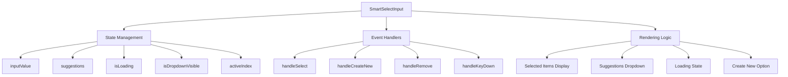
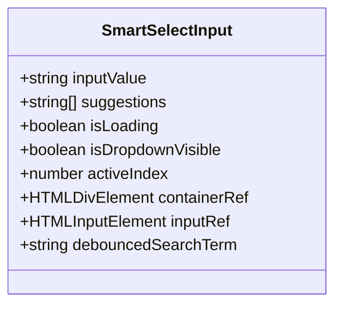
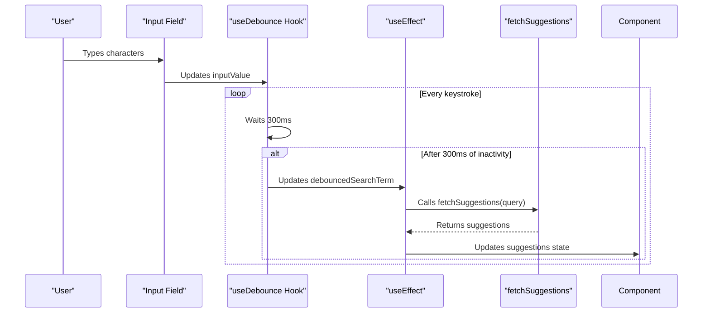
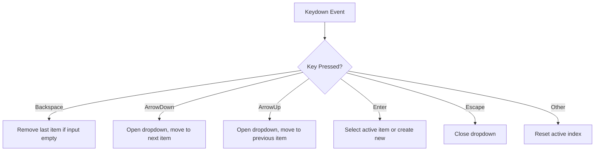
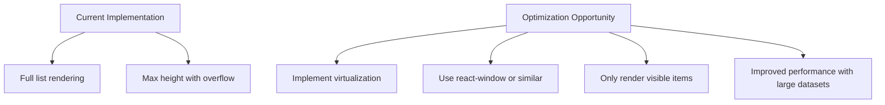

# SmartSelectInput Component

<cite>
**Referenced Files in This Document**   
- [SmartSelectInput.tsx](file://src/components/SmartSelectInput.tsx#L7-L237)
- [useDebounce.ts](file://src/hooks/useDebounce.ts#L1-L17)
- [page.tsx](file://src/app/expenses/page.tsx#L248-L279)
- [page.tsx](file://src/app/income/page.tsx#L202-L233)
- [page.tsx](file://src/app/expenses/page.tsx#L140-L145)
- [page.tsx](file://src/app/income/page.tsx#L127-L130)
- [page.tsx](file://src/app/expenses/page.tsx#L147-L158)
- [page.tsx](file://src/app/income/page.tsx#L30-L36)
</cite>

## Table of Contents
1. [Introduction](#introduction)
2. [Component Architecture](#component-architecture)
3. [Props Interface](#props-interface)
4. [State Management](#state-management)
5. [Debounced Filtering Logic](#debounced-filtering-logic)
6. [Usage Examples](#usage-examples)
7. [Accessibility Features](#accessibility-features)
8. [Performance Considerations](#performance-considerations)
9. [Extensibility and Customization](#extensibility-and-customization)
10. [Error Handling](#error-handling)

## Introduction
The SmartSelectInput component is a reusable, accessible dropdown input with search functionality and dynamic option rendering. It provides a sophisticated user experience for selecting from existing options or creating new ones, with support for both single and multiple selection modes. The component is designed to be integrated into form systems and supports asynchronous data loading for suggestions.

**Section sources**
- [SmartSelectInput.tsx](file://src/components/SmartSelectInput.tsx#L7-L237)

## Component Architecture
The SmartSelectInput component implements a controlled React component pattern with comprehensive state management for user interactions. It combines search functionality with dynamic suggestion rendering and supports creation of new items. The architecture follows React best practices with proper separation of concerns and efficient re-rendering through useCallback and useEffect hooks.

The component renders a label, input field, and a dropdown menu that appears when the user interacts with the input. Selected items are displayed as removable chips above the input field. The dropdown shows filtered suggestions with highlighted matches and an option to create new items when appropriate.



**Diagram sources**
- [SmartSelectInput.tsx](file://src/components/SmartSelectInput.tsx#L7-L237)

**Section sources**
- [SmartSelectInput.tsx](file://src/components/SmartSelectInput.tsx#L7-L237)

## Props Interface
The SmartSelectInput component accepts a well-defined TypeScript interface that specifies all configurable properties. This interface ensures type safety and provides clear documentation for component usage.

<details>
<summary>SmartSelectInputProps Interface</summary>

```typescript
interface SmartSelectInputProps {
  name: string;
  label: string;
  multiple?: boolean;
  value: string[];
  onChange: (newItems: string[]) => void;
  fetchSuggestions: (query: string) => Promise<string[]>;
  onCreateNew?: (value: string) => Promise<void>;
  formatNewItem?: (value: string) => string;
  placeholder?: string;
  className?: string;
}
```
</details>

**Key props:**
- **name**: The input name attribute for form integration
- **label**: The visible label for the input field
- **multiple**: Boolean flag to enable multiple selection mode (default: false)
- **value**: Array of currently selected string values
- **onChange**: Callback function triggered when selection changes
- **fetchSuggestions**: Async function that returns suggestions based on search query
- **onCreateNew**: Optional callback for creating new items from user input
- **formatNewItem**: Optional function to format new item values before creation
- **placeholder**: Placeholder text when no value is selected
- **className**: Additional CSS classes for styling customization

**Section sources**
- [SmartSelectInput.tsx](file://src/components/SmartSelectInput.tsx#L7-L19)

## State Management
The component maintains several state variables to track user interactions and UI state:



**Diagram sources**
- [SmartSelectInput.tsx](file://src/components/SmartSelectInput.tsx#L24-L33)

**Section sources**
- [SmartSelectInput.tsx](file://src/components/SmartSelectInput.tsx#L24-L33)

### State Variables
- **inputValue**: Tracks the current text in the search input
- **suggestions**: Stores the filtered list of available options based on search query
- **isLoading**: Indicates when suggestions are being fetched asynchronously
- **isDropdownVisible**: Controls the visibility of the suggestions dropdown
- **activeIndex**: Tracks keyboard navigation through suggestions (for accessibility)

The component uses useRef hooks to maintain references to the container and input elements, enabling proper event handling and focus management. The debouncedSearchTerm is derived from inputValue using the useDebounce hook, preventing excessive API calls during typing.

## Debounced Filtering Logic
The component implements debounced filtering to optimize performance and reduce unnecessary API calls. This is achieved through the useDebounce custom hook and a carefully designed useEffect dependency chain.



**Diagram sources**
- [SmartSelectInput.tsx](file://src/components/SmartSelectInput.tsx#L35-L98)
- [useDebounce.ts](file://src/hooks/useDebounce.ts#L1-L17)

**Section sources**
- [SmartSelectInput.tsx](file://src/components/SmartSelectInput.tsx#L35-L98)
- [useDebounce.ts](file://src/hooks/useDebounce.ts#L1-L17)

### useDebounce Implementation
The useDebounce hook is a generic utility that delays state updates by a specified timeout:

```typescript
export function useDebounce<T>(value: T, delay: number): T {
  const [debouncedValue, setDebouncedValue] = useState<T>(value);

  useEffect(() => {
    const handler = setTimeout(() => {
      setDebouncedValue(value);
    }, delay);

    return () => {
      clearTimeout(handler);
    };
  }, [value, delay]);

  return debouncedValue;
}
```

This implementation ensures that the debounced value only updates after the specified delay has elapsed without further changes to the input value, effectively throttling rapid successive updates.

## Usage Examples
The SmartSelectInput component is used in both expense and income forms within the application, demonstrating its versatility in different contexts.

### Expense Form Integration
In the expenses form, the component is used for category selection with multiple selection enabled:

```tsx
<SmartSelectInput
  name="category"
  label="Categories *"
  multiple
  value={formData.category}
  onChange={(newCategories) => setFormData({ ...formData, category: newCategories })}
  fetchSuggestions={fetchCategorySuggestions}
  onCreateNew={handleCreateCategory}
  formatNewItem={capitalizeWords}
  placeholder="Select or add categories"
/>
```

**Section sources**
- [page.tsx](file://src/app/expenses/page.tsx#L248-L279)

### Income Form Integration
In the income form, the component is used for category selection with single selection:

```tsx
<SmartSelectInput
  name="category"
  label="Category *"
  multiple={false}
  value={formData.category}
  onChange={(newCategory) => setFormData({ ...formData, category: newCategory })}
  fetchSuggestions={fetchCategorySuggestions}
  onCreateNew={async () => {}}
  formatNewItem={capitalizeWords}
  placeholder="Select or add a category"
/>
```

**Section sources**
- [page.tsx](file://src/app/income/page.tsx#L202-L233)

### Category Suggestion Fetching
The component integrates with form-specific logic to fetch category suggestions:

```typescript
// In expenses form
const fetchCategorySuggestions = async (query: string): Promise<string[]> => {
  if (!categories) return [];
  return categories
    .filter(cat => cat.name.toLowerCase().includes(query.toLowerCase()))
    .map(cat => cat.name);
};

// In income form  
const fetchCategorySuggestions = async (query: string): Promise<string[]> => {
  if (!allIncomeCategories) return [];
  return allIncomeCategories.filter((cat: string) => cat.toLowerCase().includes(query.toLowerCase()));
};
```

**Section sources**
- [page.tsx](file://src/app/expenses/page.tsx#L140-L145)
- [page.tsx](file://src/app/income/page.tsx#L127-L130)

### Category Creation
When users create new categories, the component integrates with mutation functions:

```typescript
const handleCreateCategory = async (name: string): Promise<void> => {
  if (!token) {
    toast.error("Authentication required");
    return;
  }
  try {
    await createCategoryMutation({ token, name });
    toast.success(`Category "${name}" created`);
  } catch (error) {
    toast.error("Failed to create category");
    console.error(error);
  }
};
```

**Section sources**
- [page.tsx](file://src/app/expenses/page.tsx#L147-L158)

### Item Formatting
The component supports formatting of new items before creation:

```typescript
const capitalizeWords = (str: string) => {
  return str
    .toLowerCase()
    .split(' ')
    .map(word => word.charAt(0).toUpperCase() + word.slice(1))
    .join(' ');
};
```

**Section sources**
- [page.tsx](file://src/app/income/page.tsx#L30-L36)

## Accessibility Features
The SmartSelectInput component implements comprehensive accessibility features to ensure usability for all users, including those using keyboard navigation or screen readers.

### Keyboard Navigation
The component supports full keyboard navigation through the handleKeyDown function:



**Diagram sources**
- [SmartSelectInput.tsx](file://src/components/SmartSelectInput.tsx#L100-L146)

**Section sources**
- [SmartSelectInput.tsx](file://src/components/SmartSelectInput.tsx#L100-L146)

### ARIA Compliance
The component implements proper ARIA attributes and semantic HTML:
- Uses proper label elements with htmlFor attributes
- Maintains focus management with inputRef
- Provides visual feedback for keyboard navigation
- Implements proper button roles for interactive elements
- Uses semantic HTML structure for screen reader comprehension

### Screen Reader Support
The component ensures screen reader compatibility through:
- Proper labeling with descriptive text
- Announcements of state changes (loading, selection)
- Clear indication of interactive elements
- Logical tab order and focus management

## Performance Considerations
The SmartSelectInput component incorporates several performance optimizations to ensure smooth user experience.

### Re-render Optimization
The component uses useCallback to memoize critical event handlers, preventing unnecessary re-creates on each render:

```typescript
const handleSelect = useCallback((item: string) => {
  // handler logic
}, [multiple, value, onChange]);
```

This optimization ensures that the onChange callback provided to parent components remains stable across renders unless its dependencies change.

### List Virtualization Potential
While the current implementation does not include list virtualization, the component is structured to support it:



**Section sources**
- [SmartSelectInput.tsx](file://src/components/SmartSelectInput.tsx#L198-L236)

For large suggestion lists, implementing virtualization would significantly improve performance by only rendering visible items in the dropdown.

## Extensibility and Customization
The SmartSelectInput component is designed to be extensible while maintaining type safety through TypeScript.

### Custom Option Templates
While the current implementation uses a standard rendering pattern, the component could be extended to support custom option templates by adding a renderOption prop:

```typescript
interface SmartSelectInputProps {
  // existing props
  renderOption?: (suggestion: string, isActive: boolean) => React.ReactNode;
}
```

This would allow consumers to customize the appearance of individual suggestions in the dropdown.

### Validation Rules
The component could be extended to support validation rules by adding validation-related props:

```typescript
interface SmartSelectInputProps {
  // existing props
  validate?: (value: string[]) => boolean | string;
  error?: string;
  required?: boolean;
}
```

These additions would enable form-level validation while preserving the component's core functionality.

## Error Handling
The component implements robust error handling for asynchronous operations:

```typescript
try {
  const fetched = await fetchSuggestions(debouncedSearchTerm);
  const filtered = fetched.filter(s => !value.includes(s));
  setSuggestions(filtered);
} catch (error) {
  console.error('Failed to fetch suggestions:', error);
  setSuggestions([]);
} finally {
  setIsLoading(false);
}
```

This pattern ensures that failed suggestion fetches do not break the component, instead gracefully handling errors by clearing suggestions and logging the error for debugging purposes. The loading state is always properly reset, even in error conditions.

**Section sources**
- [SmartSelectInput.tsx](file://src/components/SmartSelectInput.tsx#L52-L65)