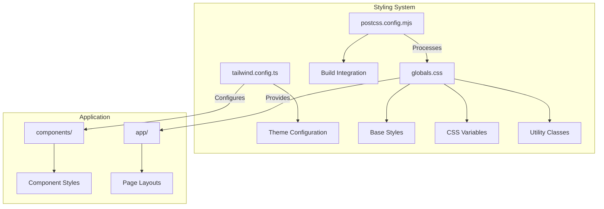
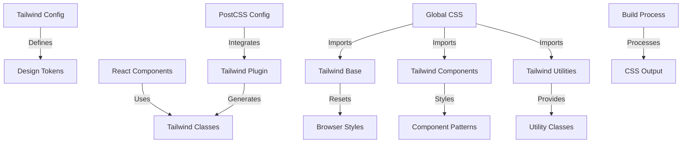
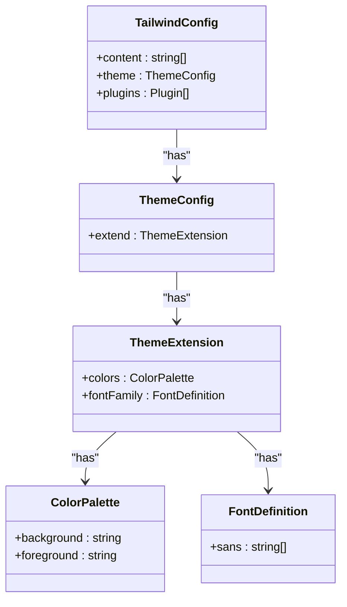
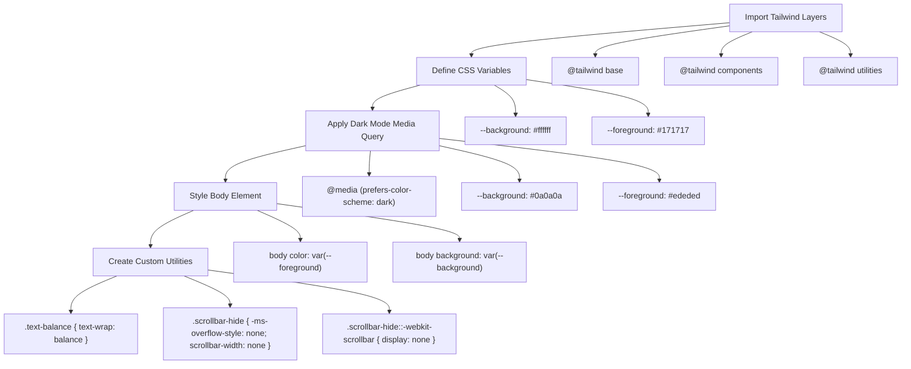
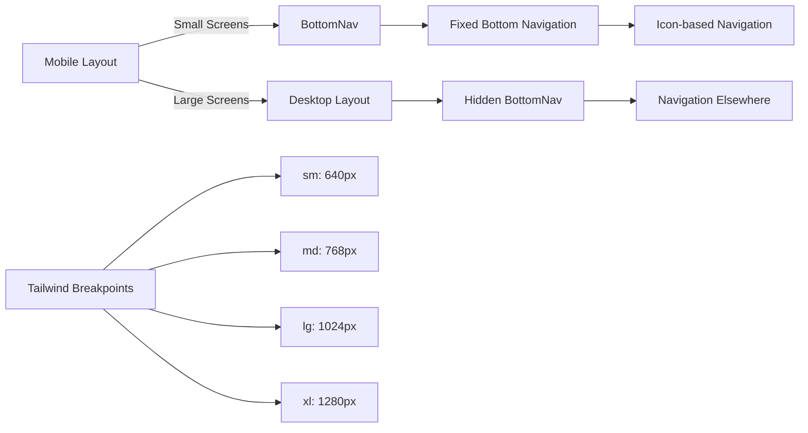
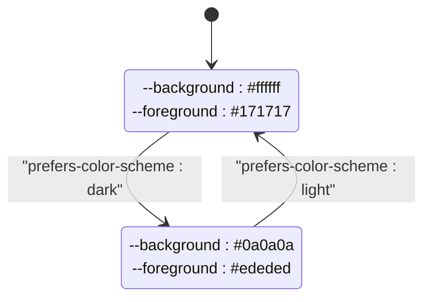
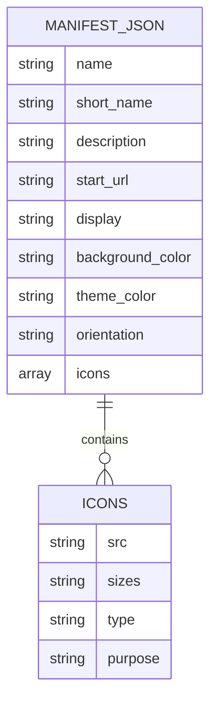

# Styling Architecture and Tailwind CSS Configuration

<cite>
**Referenced Files in This Document**   
- [tailwind.config.ts](file://tailwind.config.ts) - *Updated in commit ce856a27022b763a7599d22998d119e6557825ed*
- [postcss.config.mjs](file://postcss.config.mjs)
- [globals.css](file://src/app/globals.css) - *Contains custom scrollbar-hide utility*
- [manifest.json](file://public/manifest.json)
- [BottomNav.tsx](file://src/components/BottomNav.tsx)
- [HeaderRow.tsx](file://src/components/HeaderRow.tsx)
</cite>

## Update Summary
**Changes Made**   
- Removed references to tailwind-scrollbar plugin which was removed in recent commit
- Updated Tailwind configuration section to reflect current plugin state
- Added documentation for custom scrollbar-hide utility in globals.css
- Updated section sources to reflect file changes and additions
- Maintained accurate source tracking for all referenced files

## Table of Contents
1. [Introduction](#introduction)
2. [Project Structure](#project-structure)
3. [Core Styling Components](#core-styling-components)
4. [Architecture Overview](#architecture-overview)
5. [Detailed Component Analysis](#detailed-component-analysis)
6. [Responsive Design Implementation](#responsive-design-implementation)
7. [Dark Mode Strategy](#dark-mode-strategy)
8. [PWA Styling Considerations](#pwa-styling-considerations)
9. [Design System Extension](#design-system-extension)
10. [Performance Optimization](#performance-optimization)

## Introduction
This document provides comprehensive documentation for the styling system and Tailwind CSS integration in the Expense Tracker application. It details the architecture, configuration, and implementation strategies for consistent, performant, and accessible styling across the application. The system leverages Tailwind CSS with a utility-first approach, combined with CSS custom properties for theming and global resets for cross-browser consistency.

## Project Structure
The styling architecture is organized following a component-based structure with clear separation between global styles, framework configuration, and component-specific styling. The key styling files are located in standard locations according to Next.js conventions.



**Diagram sources**
- [tailwind.config.ts](file://tailwind.config.ts)
- [postcss.config.mjs](file://postcss.config.mjs)
- [globals.css](file://src/app/globals.css)

**Section sources**
- [tailwind.config.ts](file://tailwind.config.ts)
- [postcss.config.mjs](file://postcss.config.mjs)
- [globals.css](file://src/app/globals.css)

## Core Styling Components

The styling system consists of three core components that work together to provide a consistent and efficient styling solution:

1. **Tailwind Configuration**: Defines the design system tokens and plugin system
2. **PostCSS Integration**: Processes CSS during the build pipeline
3. **Global Styles**: Establishes base styles and custom properties

**Section sources**
- [tailwind.config.ts](file://tailwind.config.ts#L1-L20)
- [postcss.config.mjs](file://postcss.config.mjs#L1-L9)
- [globals.css](file://src/app/globals.css#L1-L28)

## Architecture Overview

The styling architecture follows a layered approach with Tailwind CSS at its core, providing utility classes that are consumed by React components. The system is configured to work seamlessly with Next.js through PostCSS, enabling JIT (Just-In-Time) compilation for optimal development experience and production bundle size.



**Diagram sources**
- [tailwind.config.ts](file://tailwind.config.ts#L1-L20)
- [postcss.config.mjs](file://postcss.config.mjs#L1-L9)
- [globals.css](file://src/app/globals.css#L1-L28)

## Detailed Component Analysis

### Tailwind Configuration Analysis

The Tailwind configuration file sets up the foundation of the design system, defining content sources for purgeCSS, theme extensions, and plugin registrations. The configuration has been simplified by removing the unused tailwind-scrollbar package.



**Diagram sources**
- [tailwind.config.ts](file://tailwind.config.ts#L1-L35)

**Section sources**
- [tailwind.config.ts](file://tailwind.config.ts#L1-L35)

### Global CSS Analysis

The globals.css file establishes the base styling for the entire application, including CSS custom properties for theming, global resets, and custom utility classes. Notably, it includes a custom scrollbar-hide utility that replaces the previously used tailwind-scrollbar plugin.



**Diagram sources**
- [globals.css](file://src/app/globals.css#L1-L48)

**Section sources**
- [globals.css](file://src/app/globals.css#L1-L48)

## Responsive Design Implementation

The application implements a mobile-first responsive design strategy using Tailwind's breakpoint system. Components are designed to work on mobile devices by default, with enhancements for larger screens.



**Diagram sources**
- [BottomNav.tsx](file://src/components/BottomNav.tsx#L1-L57)
- [HeaderRow.tsx](file://src/components/HeaderRow.tsx#L1-L37)

**Section sources**
- [BottomNav.tsx](file://src/components/BottomNav.tsx#L1-L57)
- [HeaderRow.tsx](file://src/components/HeaderRow.tsx#L1-L37)

The BottomNav component demonstrates the responsive strategy with a mobile-only navigation bar that is hidden on medium and larger screens using the `md:hidden` Tailwind class:

```tsx
<nav className="fixed bottom-0 left-0 right-0 bg-white border-t border-gray-200 px-4 py-2 md:hidden">
```

This approach ensures optimal mobile usability while allowing for more sophisticated navigation patterns on desktop.

## Dark Mode Strategy

The application implements a dark mode strategy using CSS custom properties combined with the `prefers-color-scheme` media query for automatic theme detection.



**Diagram sources**
- [globals.css](file://src/app/globals.css#L1-L28)

**Section sources**
- [globals.css](file://src/app/globals.css#L1-L28)

The implementation uses CSS variables defined in the `:root` selector, with a media query that overrides these values when the user's system preference is set to dark mode:

```css
:root {
  --background: #ffffff;
  --foreground: #171717;
}

@media (prefers-color-scheme: dark) {
  :root {
    --background: #0a0a0a;
    --foreground: #ededed;
  }
}
```

These variables are then applied to the body element, ensuring consistent theming across the entire application:

```css
body {
  color: var(--foreground);
  background: var(--background);
  font-family: Arial, Helvetica, sans-serif;
}
```

## PWA Styling Considerations

The application is configured as a Progressive Web App (PWA) with specific styling considerations for installation, viewport handling, and fullscreen behavior.



**Diagram sources**
- [manifest.json](file://public/manifest.json#L1-L25)

**Section sources**
- [manifest.json](file://public/manifest.json#L1-L25)

The `manifest.json` file configures key PWA styling properties:

- **display**: Set to "standalone" to provide a native app-like experience
- **background_color**: Black background for splash screen
- **theme_color**: Black theme color for browser UI elements
- **orientation**: Locked to portrait-primary for consistent mobile experience

These settings ensure the application appears and behaves like a native mobile application when installed, with proper splash screen handling and consistent theming.

## Design System Extension

The design system can be extended through both Tailwind configuration and custom CSS utilities, providing flexibility while maintaining consistency.

### Extending via Tailwind Configuration

New design tokens can be added to the `tailwind.config.ts` file by extending the theme:

```ts
theme: {
  extend: {
    colors: {
      background: "var(--background)",
      foreground: "var(--foreground)",
      // New custom colors can be added here
      primary: "#3b82f6",
      secondary: "#6b7280"
    },
    fontFamily: {
      sans: [
        'var(--font-poppins)',
        'ui-sans-serif',
        'system-ui',
        'Segoe UI',
        'Roboto',
        'Helvetica Neue',
        'Arial',
        'Noto Sans',
        '"Apple Color Emoji"',
        '"Segoe UI Emoji"',
        '"Segoe UI Symbol"',
        '"Noto Color Emoji"',
      ],
    },
    spacing: {
      // Custom spacing scales
    },
    typography: {
      // Custom typography rules
    }
  }
}
```

### Extending via Custom Utilities

Additional utility classes can be defined in the `globals.css` file using the `@layer utilities` directive. The application includes a custom `scrollbar-hide` utility that replaces the previously used tailwind-scrollbar plugin:

```css
@layer utilities {
  .text-balance {
    text-wrap: balance;
  }
  
  .scrollbar-hide {
    -ms-overflow-style: none;
    scrollbar-width: none;
    scroll-behavior: smooth;
  }
  
  .scrollbar-hide::-webkit-scrollbar {
    display: none;
    width: 0;
    height: 0;
  }
}
```

This approach allows for the creation of reusable utility classes that follow the same naming conventions as Tailwind's built-in utilities.

**Section sources**
- [tailwind.config.ts](file://tailwind.config.ts#L1-L35)
- [globals.css](file://src/app/globals.css#L1-L48)

## Performance Optimization

The styling system incorporates several performance optimization techniques to ensure fast load times and efficient rendering.

### PurgeCSS Configuration

The Tailwind configuration includes a content array that specifies which files should be scanned for class usage, enabling the removal of unused classes in production:

```ts
content: [
  "./src/pages/**/*.{js,ts,jsx,tsx,mdx}",
  "./src/components/**/*.{js,ts,jsx,tsx,mdx}",
  "./src/app/**/*.{js,ts,jsx,tsx,mdx}",
]
```

This configuration ensures that only classes actually used in the application are included in the final CSS bundle, significantly reducing file size.

### JIT Mode Benefits

Tailwind's Just-In-Time compiler is enabled by default in Next.js applications, providing several performance benefits:

- Dynamic generation of utility classes on-demand
- Faster build times during development
- Smaller production CSS bundles
- Support for arbitrary value syntax (e.g., `w-[200px]`)

### Minimizing Custom CSS

The architecture favors the use of Tailwind's built-in utilities over custom CSS, reducing the amount of custom CSS that needs to be maintained and parsed:

```tsx
{/* Preferred: Using Tailwind utilities */}
<div className="flex items-center justify-between p-4 bg-white rounded-lg shadow-sm">

{/* Avoided: Custom CSS classes */}
<div className="header-container">
```

This utility-first approach ensures consistency and reduces the risk of style bloat.

### Efficient Style Recalculations

Components are designed to minimize style recalculations by:

- Using stable class names that don't change frequently
- Leveraging Tailwind's atomic classes which are highly cacheable
- Avoiding inline styles that trigger re-renders
- Using CSS variables for theme changes instead of class toggling

The application implements a custom `scrollbar-hide` utility in globals.css rather than relying on a third-party plugin, reducing bundle size and improving performance:

```css
.scrollbar-hide {
  -ms-overflow-style: none;
  scrollbar-width: none;
}
.scrollbar-hide::-webkit-scrollbar {
  display: none;
}
```

**Section sources**
- [tailwind.config.ts](file://tailwind.config.ts#L1-L35)
- [postcss.config.mjs](file://postcss.config.mjs#L1-L9)
- [globals.css](file://src/app/globals.css#L1-L48)