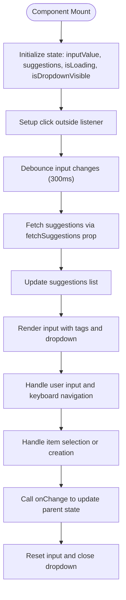
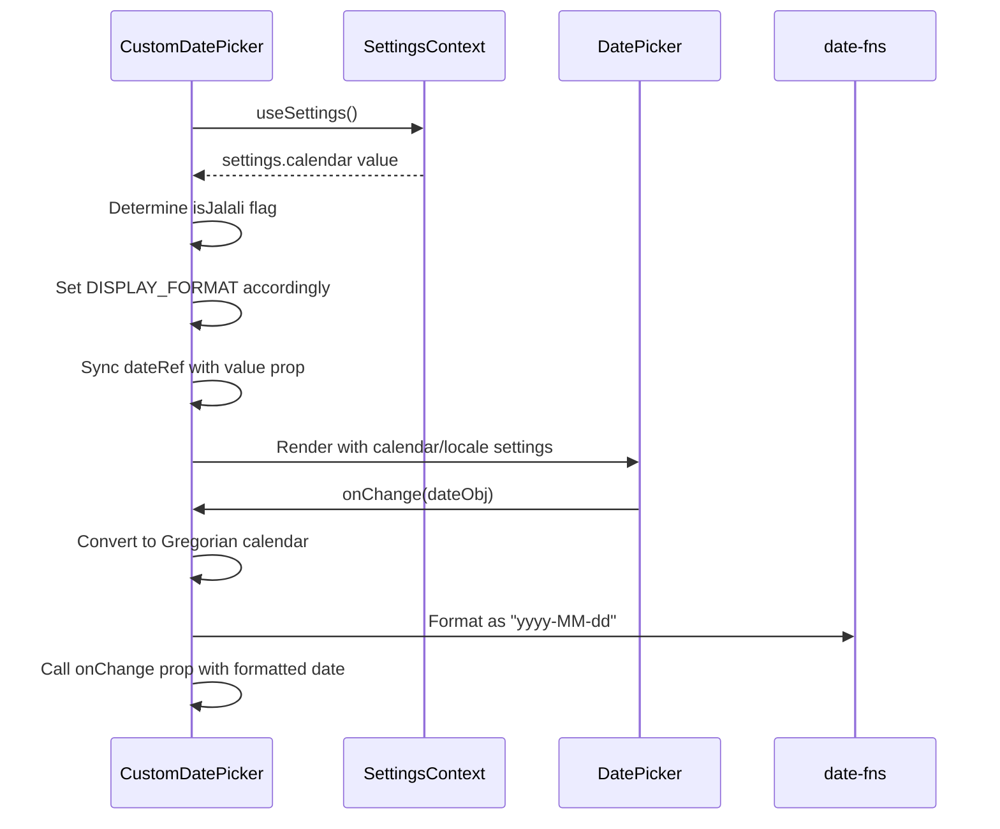
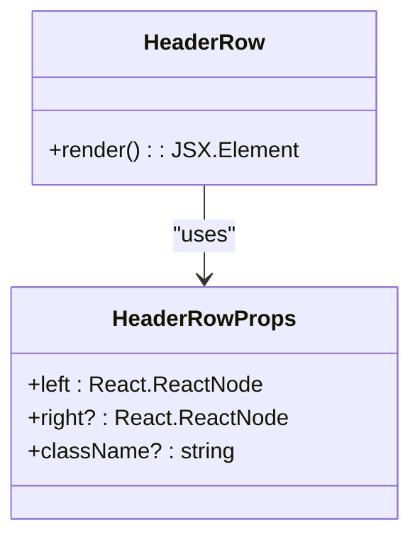
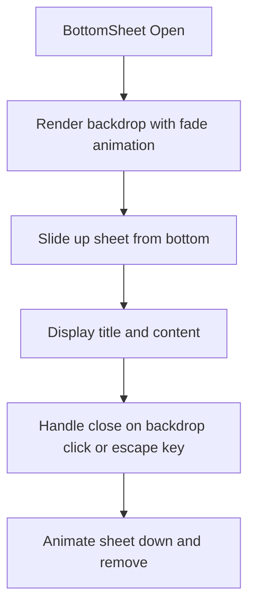
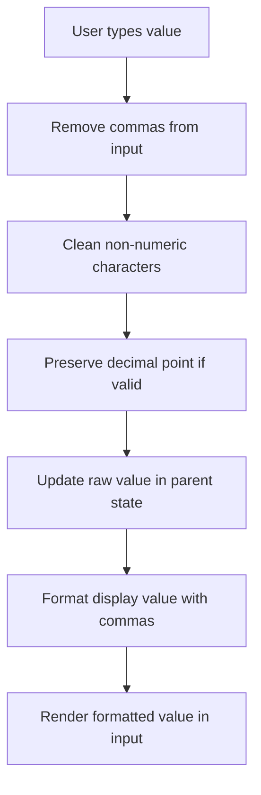
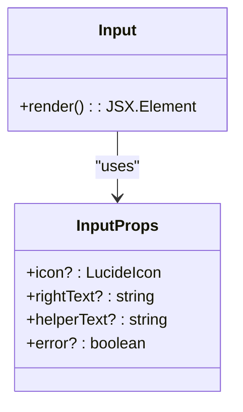
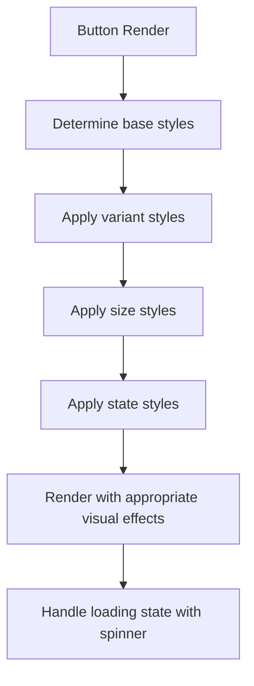
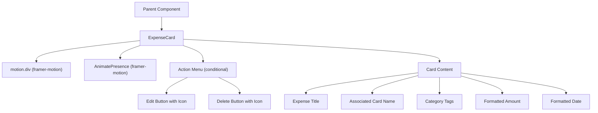
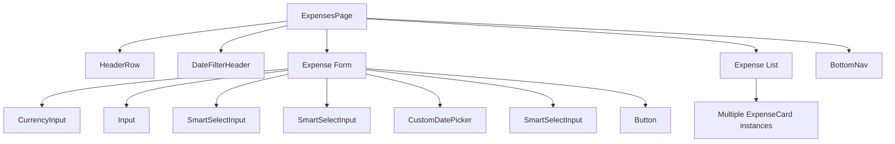
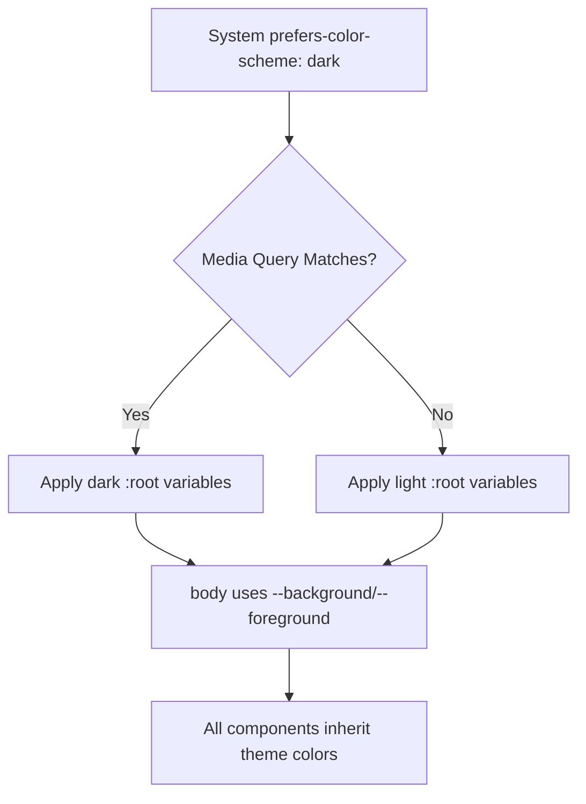

# UI Components and Styling Strategy

<cite>
**Referenced Files in This Document**   
- [SmartSelectInput.tsx](file://src/components/SmartSelectInput.tsx)
- [CustomDatePicker.tsx](file://src/components/CustomDatePicker.tsx)
- [HeaderRow.tsx](file://src/components/HeaderRow.tsx)
- [ExpenseCard.tsx](file://src/components/cards/ExpenseCard.tsx)
- [globals.css](file://src/app/globals.css)
- [tailwind.config.ts](file://tailwind.config.ts)
- [page.tsx](file://src/app/expenses/page.tsx)
- [BottomSheet.tsx](file://src/components/BottomSheet.tsx) - *Added in recent commit*
- [CurrencyInput.tsx](file://src/components/CurrencyInput.tsx) - *Added in recent commit*
- [Input.tsx](file://src/components/Input.tsx) - *Added in recent commit*
- [Button.tsx](file://src/components/Button.tsx) - *Added in recent commit*
- [ProtectedRoute.tsx](file://src/components/ProtectedRoute.tsx) - *Updated in recent commit*
</cite>

## Update Summary
**Changes Made**   
- Added documentation for new components: BottomSheet, CurrencyInput, Input, and Button
- Updated component composition section to reflect new form elements
- Enhanced styling architecture section with new component references
- Added new diagrams for newly introduced components
- Updated file references with proper annotations for added files
- Updated ProtectedRoute documentation to reflect standardized loading/redirect UI styles and type error fixes

## Table of Contents
1. [Introduction](#introduction)
2. [Core UI Components](#core-ui-components)
3. [Styling Architecture](#styling-architecture)
4. [Component Composition Patterns](#component-composition-patterns)
5. [Responsive Design and Layout](#responsive-design-and-layout)
6. [Performance Optimization](#performance-optimization)

## Introduction
This document provides a comprehensive analysis of the UI component library and styling strategy in the Expense Tracker application. The system leverages Tailwind CSS for utility-first styling, combined with reusable React components that encapsulate complex interactions, accessibility features, and validation logic. The architecture emphasizes consistency, maintainability, and performance across dashboard, expenses, and income views.

## Core UI Components

### SmartSelectInput Component
The SmartSelectInput component provides an enhanced select input with autocomplete, multi-selection, and dynamic creation capabilities. It implements accessibility best practices and integrates seamlessly with Tailwind CSS for consistent styling.



**Diagram sources**
- [SmartSelectInput.tsx](file://src/components/SmartSelectInput.tsx#L20-L236)

**Section sources**
- [SmartSelectInput.tsx](file://src/components/SmartSelectInput.tsx#L20-L236)

The component supports both single and multiple selection modes through the `multiple` prop. It features:
- **Debounced search**: Uses `useDebounce` hook to limit API calls
- **Dynamic creation**: Allows users to create new items not in suggestions
- **Keyboard navigation**: Full arrow key, Enter, and Escape support
- **Accessibility**: Proper labeling and focus management
- **Visual feedback**: Loading states and active item highlighting

Key accessibility features include proper labeling with `<label>`, focus management via `inputRef`, and keyboard navigation support. The component uses framer-motion for smooth dropdown animations and provides visual feedback for loading states and active selections.

### CustomDatePicker Component
The CustomDatePicker component wraps the react-multi-date-picker library with application-specific styling and functionality, supporting both Gregorian and Jalali calendars based on user settings.



**Diagram sources**
- [CustomDatePicker.tsx](file://src/components/CustomDatePicker.tsx#L17-L69)

**Section sources**
- [CustomDatePicker.tsx](file://src/components/CustomDatePicker.tsx#L17-L69)

The component implements several key patterns:
- **Calendar flexibility**: Supports both Gregorian and Jalali calendars
- **Stable references**: Uses `useRef` to maintain stable DateObject references
- **Locale independence**: Ensures output uses standard English digits
- **Two-way binding**: Synchronizes between component state and parent props

The integration with SettingsContext allows the calendar system to be user-configurable, while the conversion to Gregorian calendar before output ensures consistent data storage regardless of display preferences.

### HeaderRow Component
The HeaderRow component provides a consistent, fixed-position header across multiple pages including dashboard, expenses, and income views. It ensures a uniform navigation experience with responsive design.



**Diagram sources**
- [HeaderRow.tsx](file://src/components/HeaderRow.tsx#L24-L37)

**Section sources**
- [HeaderRow.tsx](file://src/components/HeaderRow.tsx#L24-L37)

The component implements a mobile-first design with the following characteristics:
- **Fixed positioning**: Stays at the top of the viewport with `position: fixed`
- **Z-index management**: Uses `z-50` to ensure it appears above other content
- **Responsive layout**: Centers content within a `max-w-md` container
- **Visual separation**: Includes border and shadow for depth
- **Flexible content**: Accepts arbitrary React nodes for left and right sections

The component is used across multiple pages:
- Dashboard: Displays time-filtered views
- Expenses: Shows expense list header
- Income: Provides income tracking header
- Settings: Presents application settings header

### BottomSheet Component
The BottomSheet component provides a modal-like interface that slides up from the bottom of the screen, ideal for displaying additional information or actions on mobile devices.



**Diagram sources**
- [BottomSheet.tsx](file://src/components/BottomSheet.tsx#L17-L64)

**Section sources**
- [BottomSheet.tsx](file://src/components/BottomSheet.tsx#L17-L64)

Key features of the BottomSheet component:
- **Animated transitions**: Uses framer-motion for smooth entrance and exit animations
- **Escape key support**: Closes when user presses Escape key
- **Click outside dismissal**: Closes when clicking on the backdrop
- **Scrollable content**: Contains overflow-y-auto for long content
- **Responsive design**: Max-width container ensures proper display on various screen sizes

The component is used in the CategoryList to display detailed category information, providing a mobile-friendly way to view expense details without navigating away from the current view.

### CurrencyInput Component
The CurrencyInput component provides a specialized input field for currency values with automatic formatting and symbol display.



**Diagram sources**
- [CurrencyInput.tsx](file://src/components/CurrencyInput.tsx#L17-L95)

**Section sources**
- [CurrencyInput.tsx](file://src/components/CurrencyInput.tsx#L17-L95)

The component implements:
- **Automatic formatting**: Adds thousands separators while preserving raw numeric value
- **Currency symbol display**: Shows appropriate symbol based on settings context
- **Input validation**: Allows only digits and decimal points
- **Caret preservation**: Maintains cursor position during formatting
- **Flexible currency support**: Maps currency codes to appropriate symbols

The raw numeric value (without commas) is passed to the parent via onChangeValue, while the displayed value includes formatting for better user experience.

### Input Component
The Input component provides a styled text input with support for icons, helper text, and error states.



**Diagram sources**
- [Input.tsx](file://src/components/Input.tsx#L17-L78)

**Section sources**
- [Input.tsx](file://src/components/Input.tsx#L17-L78)

Features include:
- **Visual state management**: Different styles for default, focus, error, and disabled states
- **Icon support**: Optional left-side icon via LucideIcon
- **Right text**: Additional text on the right side with chevron indicator
- **Helper text**: Optional descriptive text below input
- **Error state**: Visual indication of validation errors

The component uses state classes to manage appearance based on focus and error conditions, providing clear visual feedback to users.

### Button Component
The Button component provides a consistent, styled button with multiple variants and sizes.



**Diagram sources**
- [Button.tsx](file://src/components/Button.tsx#L17-L106)

**Section sources**
- [Button.tsx](file://src/components/Button.tsx#L17-L106)

Key characteristics:
- **Multiple variants**: Default, hover, and pressed states with appropriate shadows
- **Size options**: Large and medium sizes for different use cases
- **Loading state**: Shows spinner animation when loading
- **Disabled state**: Visual indication with reduced opacity
- **Icon support**: Option to display only an icon
- **Accessibility**: Proper button semantics and keyboard support

The component uses CSS variables for colors and shadows, providing a tactile, physical appearance consistent with the application's design language.

## Styling Architecture

### globals.css Base Styles
The globals.css file establishes the foundation for the application's visual design, including dark mode support and custom utility classes.

```css
@tailwind base;
@tailwind components;
@tailwind utilities;

:root {
  --background: #ffffff;
  --foreground: #171717;
}

@media (prefers-color-scheme: dark) {
  :root {
    --background: #0a0a0a;
    --foreground: #ededed;
  }
}

body {
  color: var(--foreground);
  background: var(--background);
  font-family: Arial, Helvetica, sans-serif;
}

@layer utilities {
  .text-balance {
    text-wrap: balance;
  }
}
```

**Section sources**
- [globals.css](file://src/app/globals.css#L1-L27)

The styling architecture implements several key patterns:
- **CSS variables**: Uses `--background` and `--foreground` for theme colors
- **Dark mode**: Respects system preference via `prefers-color-scheme`
- **Font stack**: Applies consistent typography across the application
- **Custom utilities**: Extends Tailwind with `.text-balance` for improved text rendering

### Tailwind Configuration
The tailwind.config.ts file configures the Tailwind CSS framework with custom theme extensions and content scanning rules.

```typescript
import type { Config } from "tailwindcss";

const config: Config = {
  content: [
    "./src/pages/**/*.{js,ts,jsx,tsx,mdx}",
    "./src/components/**/*.{js,ts,jsx,tsx,mdx}",
    "./src/app/**/*.{js,ts,jsx,tsx,mdx}",
  ],
  theme: {
    extend: {
      colors: {
        background: "var(--background)",
        foreground: "var(--foreground)",
      },
    },
  },
  plugins: [],
};
export default config;
```

**Section sources**
- [tailwind.config.ts](file://tailwind.config.ts#L1-L19)

The configuration includes:
- **Content scanning**: Includes all relevant source files for purgeCSS
- **Theme extension**: Maps CSS variables to Tailwind color palette
- **Plugin system**: Ready for extension with additional Tailwind plugins
- **Performance optimization**: PurgeCSS removes unused styles in production

The content configuration ensures all component files are scanned for Tailwind classes, preventing accidental removal of used utilities during the build process.

## Component Composition Patterns

### ExpenseCard Component
The ExpenseCard component demonstrates advanced composition by combining multiple primitive components and implementing complex interaction patterns.



**Diagram sources**
- [ExpenseCard.tsx](file://src/components/cards/ExpenseCard.tsx#L20-L114)

**Section sources**
- [ExpenseCard.tsx](file://src/components/cards/ExpenseCard.tsx#L20-L114)

The component implements several composition patterns:
- **State management**: Uses `useState` for menu open/close state
- **Animation**: Integrates framer-motion for entrance/exit animations
- **Event handling**: Prevents event propagation to enable click outside detection
- **Conditional rendering**: Shows action menu only when open
- **Responsive design**: Uses flexbox for layout on different screen sizes

Two variants of ExpenseCard exist in the codebase:
1. In `src/components/cards/`: Used in the main expenses view
2. In `src/features/dashboard/components/Expenses/`: Used in the dashboard context

This duplication suggests an opportunity for consolidation into a single, more flexible component.

### Form Composition in Expenses Page
The expenses page demonstrates how multiple components are composed together to create a complete user interface.



**Section sources**
- [page.tsx](file://src/app/expenses/page.tsx#L0-L199)
- [CurrencyInput.tsx](file://src/components/CurrencyInput.tsx#L17-L95) - *New component*
- [Input.tsx](file://src/components/Input.tsx#L17-L78) - *New component*
- [Button.tsx](file://src/components/Button.tsx#L17-L106) - *New component*

The composition includes:
- **Header**: HeaderRow for consistent navigation
- **Filter**: DateFilterHeader for time-based filtering
- **Form**: Multiple input components including CurrencyInput, Input, SmartSelectInput, and CustomDatePicker
- **List**: ExpenseCard components for displaying existing expenses
- **Navigation**: BottomNav for mobile navigation

The page uses several hooks to manage state and data:
- `useAuth` for authentication state
- `useTimeFramedData` for time-filtered expense data
- `useMutation` and `useQuery` for Convex database operations

The form now utilizes the new CurrencyInput component for amount fields, Input component for text fields, and Button component for the submit button, creating a more consistent and accessible user interface.

## Responsive Design and Layout

### Mobile-First Approach
The application follows a mobile-first design philosophy, with components optimized for small screens and scaling up appropriately.

The HeaderRow component exemplifies this approach with:
- Fixed positioning for easy access
- Max-width container (`max-w-md`) that matches typical mobile screen widths
- Flexible content areas that adapt to available space
- Touch-friendly tap targets

The BottomSheet component further enhances the mobile experience by providing a native-like modal interface that works well with touch interactions and small screens.

### Dark Mode Implementation
The dark mode system uses a combination of CSS variables and media queries to provide a system-preference-aware theme.



**Diagram sources**
- [globals.css](file://src/app/globals.css#L1-L27)
- [tailwind.config.ts](file://tailwind.config.ts#L1-L19)

The implementation ensures:
- Automatic theme selection based on system preferences
- Consistent color application across all components
- No flash of incorrect theme during page load
- Easy extension to user-controlled theme selection

## Performance Optimization

### purgeCSS Configuration
The Tailwind configuration includes optimized content scanning to ensure purgeCSS removes unused styles while preserving all necessary classes.

The content array includes:
- All pages and components
- Both JS and TS file extensions
- JSX and TSX variants
- MDX files for potential documentation

This comprehensive scanning prevents accidental removal of used classes during the build process.

### Component-Level Optimizations
Several components implement performance optimizations:

**SmartSelectInput**:
- Debounced search to limit API calls
- Memoized callbacks with `useCallback`
- Conditional rendering of dropdown only when visible
- Efficient event listener cleanup

**CustomDatePicker**:
- Stable DateObject references with `useRef`
- Selective re-renders based on actual date changes
- Efficient calendar conversion only when needed

**ExpenseCard**:
- Animation only on initial render and state changes
- Click outside detection with proper cleanup
- Optimized re-renders through state scoping

**BottomSheet**:
- Conditional rendering with AnimatePresence
- Efficient event listener management
- Proper cleanup of keyboard event listeners

These optimizations ensure the application remains responsive even with large datasets and on lower-powered devices.