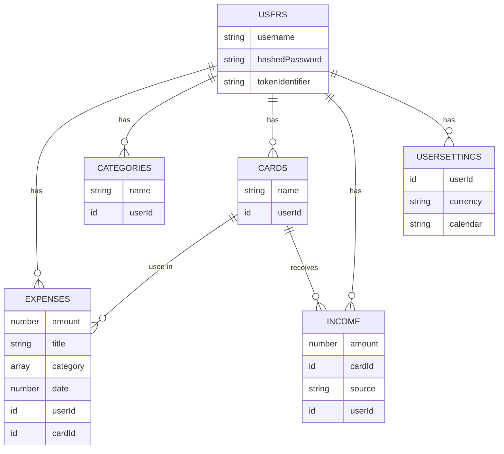
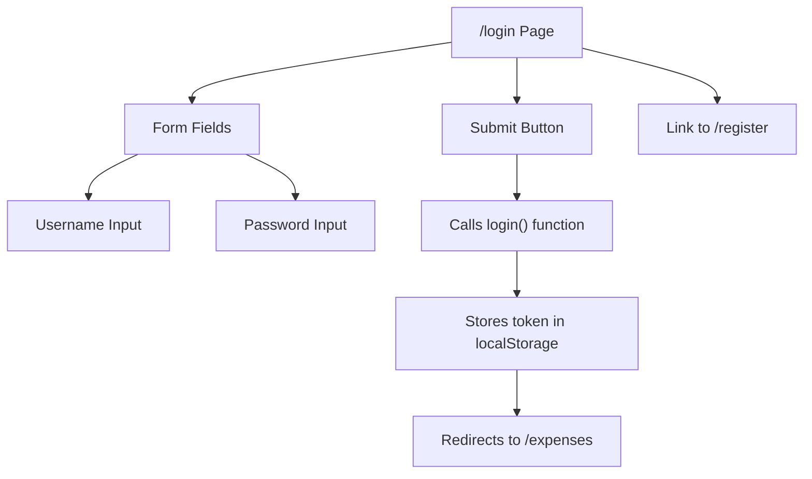

# Getting Started

<cite>
**Referenced Files in This Document**   
- [README.md](file://README.md#L0-L263)
- [package.json](file://package.json#L0-L48)
- [convex/schema.ts](file://convex/schema.ts#L0-L61)
- [src/app/page.tsx](file://src/app/page.tsx#L0-L30)
- [src/app/login/page.tsx](file://src/app/login/page.tsx#L0-L119)
- [src/app/dashboard/page.tsx](file://src/app/dashboard/page.tsx#L0-L126)
- [src/app/expenses/page.tsx](file://src/app/expenses/page.tsx#L0-L351)
- [src/contexts/AuthContext.tsx](file://src/contexts/AuthContext.tsx#L0-L96)
- [convex/auth.ts](file://convex/auth.ts#L0-L131)
- [next.config.js](file://next.config.js#L0-L13)
- [public/manifest.json](file://public/manifest.json#L0-L26) - *Updated in recent commit*
- [src/app/layout.tsx](file://src/app/layout.tsx#L0-L94) - *Updated in recent commit*
- [public/favicon-16x16.png](file://public/favicon-16x16.png) - *Added in recent commit*
- [public/favicon-32x32.png](file://public/favicon-32x32.png) - *Added in recent commit*
- [public/apple-touch-icon.png](file://public/apple-touch-icon.png) - *Added in recent commit*
- [public/icons/icon-192x192.png](file://public/icons/icon-192x192.png) - *Added in recent commit*
- [public/icons/icon-512x512.png](file://public/icons/icon-512x512.png) - *Added in recent commit*
</cite>

## Update Summary
**Changes Made**   
- Updated documentation to reflect new PWA and favicon assets
- Added information about updated manifest.json configuration
- Clarified discrepancies between app title in layout.tsx and manifest.json
- Enhanced troubleshooting section with icon-related issues
- Added new section on Progressive Web App (PWA) configuration

## Table of Contents
1. [Prerequisites](#prerequisites)
2. [Setup Instructions](#setup-instructions)
3. [Project Structure Overview](#project-structure-overview)
4. [Key Configuration Files](#key-configuration-files)
5. [Navigating the Application](#navigating-the-application)
6. [Troubleshooting Common Issues](#troubleshooting-common-issues)
7. [Quick Feature Tour](#quick-feature-tour)
8. [Verify Setup with a Simple Change](#verify-setup-with-a-simple-change)
9. [Progressive Web App Configuration](#progressive-web-app-configuration)

## Prerequisites

Before you begin, ensure your development environment meets the following requirements:

- **Node.js**: Version 18 or higher
- **Package Manager**: npm (included with Node.js) or yarn
- **Convex CLI**: Installed globally via `npm install -g convex`

These tools are essential for running the application and connecting to the Convex backend. The project uses modern JavaScript features and requires Node.js 18+ for compatibility with Next.js 14 and Convex functions.

**Section sources**
- [README.md](file://README.md#L100-L103)
- [package.json](file://package.json#L0-L48)

## Setup Instructions

Follow these steps to get the Expense-Tracker---Warp project up and running on your local machine.

### 1. Clone the Repository
Open your terminal and run:
```bash
git clone <repository-url>
cd Expense-Tracker---Warp
```

Replace `<repository-url>` with the actual GitHub or Git repository URL.

### 2. Install Dependencies
Use npm to install all required packages:
```bash
npm install
```
This command reads the `package.json` file and installs all dependencies listed under `dependencies` and `devDependencies`, including Next.js, Convex, Tailwind CSS, and other libraries.

### 3. Set Up Convex Backend
Initialize the Convex backend with:
```bash
npx convex dev
```
This command performs several critical actions:
- Creates a new Convex project if you don't have one
- Generates a `.env.local` file containing your `NEXT_PUBLIC_CONVEX_URL`
- Sets up the database schema based on `convex/schema.ts`
- Deploys all backend functions (auth, expenses, etc.)
- Starts the Convex development server

You'll be prompted to log in to your Convex account. If you don't have one, visit [https://convex.dev](https://convex.dev) to sign up.

### 4. Start the Development Server
Once Convex is linked, start the Next.js development server:
```bash
npm run dev
```
The application will be available at `http://localhost:3000`. Open this URL in your browser to access the app.

### 5. Build for Production (Optional)
To create an optimized production build:
```bash
npm run build
npm start
```
This generates static assets and starts the production server.

**Section sources**
- [README.md](file://README.md#L105-L140)
- [package.json](file://package.json#L3-L7)

## Project Structure Overview

The project follows a standard Next.js App Router structure with clear separation between frontend and backend code.

```
.
├── convex/               # Backend logic and database schema
├── src/app/              # Frontend pages using App Router
├── src/components/       # Reusable UI components
├── src/contexts/         # React context providers (Auth, Offline)
├── public/               # Static assets (manifest, service worker)
└── root config files     # Next.js, Tailwind, TypeScript, etc.
```

Key organizational patterns:
- **Feature-based routing**: Each major feature (expenses, dashboard) has its own route directory
- **Component encapsulation**: UI elements are broken into reusable components
- **Backend isolation**: All Convex functions and schema are contained in the `convex/` folder
- **Context management**: Authentication and offline state are managed via React Context

The `src/features/dashboard` directory demonstrates a modular approach, grouping related components, hooks, and types together for maintainability.

**Section sources**
- [README.md](file://README.md#L200-L230)
- [project_structure](file://project_structure#L0-L100)

## Key Configuration Files

### `convex/schema.ts`
This file defines the entire database schema using Convex's type-safe syntax. It includes tables for:
- **users**: Stores username, hashed password, and authentication tokens
- **expenses**: Contains expense details including amount, categories, and date
- **categories**: User-defined tags for organizing expenses
- **cards**: Financial instruments used for tracking spending sources
- **income**: Records income entries linked to specific cards
- **userSettings**: Stores user preferences like currency and calendar type

Each table includes indexes for efficient querying, such as `by_user` for filtering data by user ID.



**Diagram sources**
- [convex/schema.ts](file://convex/schema.ts#L0-L61)

### `src/contexts/AuthContext.tsx`
Implements authentication state management using React Context. Key features:
- Persists authentication token in `localStorage`
- Provides `useAuth()` hook for accessing user data across components
- Handles login, registration, and logout operations
- Automatically checks authentication status on app load

The context integrates with Convex backend functions (`api.auth.login`, etc.) to securely authenticate users.

### `next.config.js`
Contains Next.js configuration options:
- Disables ESLint checks during production builds (useful for Vercel deployment)
- Ignores TypeScript build errors to prevent deployment failures

This configuration prioritizes deployment reliability over strict type checking in production.

**Section sources**
- [convex/schema.ts](file://convex/schema.ts#L0-L61)
- [src/contexts/AuthContext.tsx](file://src/contexts/AuthContext.tsx#L0-L96)
- [next.config.js](file://next.config.js#L0-L13)

## Navigating the Application

After starting the server, you can access these key pages:

### `/login`
The authentication entry point where users can sign in with their username and password. If already authenticated, the app redirects to `/expenses`.



**Diagram sources**
- [src/app/login/page.tsx](file://src/app/login/page.tsx#L0-L119)
- [src/contexts/AuthContext.tsx](file://src/contexts/AuthContext.tsx#L50-L70)

### `/expenses`
The main expense tracking interface where users can:
- Add new expenses with amount, title, categories, and date
- Select which card was used for the expense
- View a history of past expenses
- Navigate between months using the date filter

When no cards exist, users are redirected to `/onboarding` to set up their first card.

### `/dashboard`
Displays analytics and summaries including:
- Monthly spending total and count
- Category breakdown via pie chart
- Daily spending patterns via bar chart
- Card balances summary
- Navigation between months

Data is fetched and processed using custom hooks like `useExpenseData`.

### Other Routes
- `/register`: Create a new user account
- `/settings`: View profile and connection status
- `/onboarding`: Set up initial cards and income sources

The `src/app/page.tsx` file acts as the root route, redirecting authenticated users to `/expenses` and unauthenticated users to `/login`.

**Section sources**
- [src/app/page.tsx](file://src/app/page.tsx#L0-L30)
- [src/app/login/page.tsx](file://src/app/login/page.tsx#L0-L119)
- [src/app/dashboard/page.tsx](file://src/app/dashboard/page.tsx#L0-L126)
- [src/app/expenses/page.tsx](file://src/app/expenses/page.tsx#L0-L351)

## Troubleshooting Common Issues

### Missing Dependencies
**Symptom**: `command not found` or module import errors  
**Solution**: Run `npm install` again and ensure Node.js 18+ is installed. Check with `node --version`.

### Convex Connection Errors
**Symptom**: `npx convex dev` fails or shows authentication errors  
**Solution**: 
1. Run `npx convex login` separately to authenticate
2. Ensure you have a Convex account at [https://convex.dev](https://convex.dev)
3. Check internet connection and firewall settings

### Build Failures
**Symptom**: `npm run build` fails with TypeScript or ESLint errors  
**Solution**: 
1. The project is configured to ignore these during production builds
2. For local development, fix the reported issues or temporarily modify `next.config.js`
3. Ensure all environment variables are set

### Authentication Not Persisting
**Symptom**: User gets logged out after page refresh  
**Solution**: Check that `localStorage` is working and the `auth-token` is being saved. Verify no browser extensions are blocking storage.

### Blank Screen on Load
**Symptom**: White screen with no content  
**Solution**: 
1. Check browser developer console for errors
2. Ensure Convex backend is running (`npx convex dev`)
3. Verify the `.env.local` file contains a valid `NEXT_PUBLIC_CONVEX_URL`

### PWA and Icon Issues
**Symptom**: App icons not displaying or PWA installation failing  
**Solution**:
1. Verify that all icon files exist in the correct locations: `/public/icons/icon-192x192.png`, `/public/icons/icon-512x512.png`
2. Check that `manifest.json` correctly references the icon paths
3. Ensure favicon files (`favicon-16x16.png`, `favicon-32x32.png`, `apple-touch-icon.png`) are present in the public directory
4. Clear browser cache and reload the page

**Section sources**
- [README.md](file://README.md#L100-L140)
- [src/contexts/AuthContext.tsx](file://src/contexts/AuthContext.tsx#L20-L30)
- [public/manifest.json](file://public/manifest.json#L0-L26)
- [src/app/layout.tsx](file://src/app/layout.tsx#L0-L94)

## Quick Feature Tour

The Expense-Tracker---Warp application offers these core features:

### Authentication System
- Secure username/password login and registration
- Persistent sessions using localStorage tokens
- Protected routes that require authentication
- Clean logout functionality

### Expense Management
- Add expenses with detailed information (amount, title, categories)
- Multiple category tagging with auto-suggestions
- Optional "for" field to attribute expenses
- Date selection with calendar picker
- Card-based expense tracking

### Dashboard Analytics
- Monthly spending summaries
- Interactive pie chart showing category distribution
- Bar chart displaying daily spending patterns
- Summary cards with total amount and count
- Month navigation controls

### Offline Support
- Fully functional offline mode
- Local data caching using IndexedDB
- Automatic synchronization when connection is restored
- Manual sync option in settings
- Visual offline status indicator

### Mobile-First Design
- Responsive layout optimized for mobile devices
- Bottom navigation for easy thumb access
- 44px minimum touch targets for usability
- Installable as a Progressive Web App (PWA)
- Smooth animations using Framer Motion

The application uses Convex for real-time data synchronization and Next.js for server-side rendering and routing.

**Section sources**
- [README.md](file://README.md#L10-L80)
- [src/app/dashboard/page.tsx](file://src/app/dashboard/page.tsx#L0-L126)

## Verify Setup with a Simple Change

To confirm your development environment is working correctly, make a simple modification to the app title.

### Step 1: Locate the Layout File
The main layout is defined in `src/app/layout.tsx`. This file wraps all pages with common UI elements.

### Step 2: Modify the Document Title
Find the `<title>` tag in the layout file and change it from "Expense Tracker" to "My Expense Tracker":

```tsx
<title>My Expense Tracker</title>
```

### Step 3: Verify the Change
Refresh your browser at `http://localhost:3000`. You should see:
- The browser tab title updated to "My Expense Tracker"
- No errors in the console
- All functionality still working

This confirms:
1. Your file editing is being detected by the development server
2. Hot reloading is functioning properly
3. The build pipeline is working
4. The frontend can communicate with the backend

If the change appears successfully, your development environment is fully operational and ready for further customization.

**Section sources**
- [src/app/layout.tsx](file://src/app/layout.tsx#L10-L15)
- [README.md](file://README.md#L130-L135)

## Progressive Web App Configuration

The application is configured as a Progressive Web App (PWA) with full offline support and installability.

### Manifest Configuration
The `public/manifest.json` file defines the PWA properties:
- **name**: "Spendly" (displayed when installed)
- **short_name**: "Spendly" (displayed on home screen)
- **description**: "Track your daily expenses with ease"
- **display**: "standalone" (app-like experience)
- **theme_color**: "#000000" (browser theme color)
- **icons**: References to 192x192 and 512x512 PNG icons in `/icons/` directory

### Icon Assets
The application includes comprehensive icon support:
- **Favicon**: 16x16 and 32x32 PNG files for browser tabs
- **Apple Touch Icon**: 180x180 PNG for iOS devices
- **PWA Icons**: 192x192 and 512x512 maskable PNGs for installation
- All icons are optimized for their respective platforms

### Apple-Specific Configuration
Additional meta tags in `src/app/layout.tsx` enable iOS-specific features:
- `apple-mobile-web-app-capable`: Enables full-screen mode
- `apple-mobile-web-app-status-bar-style`: Sets status bar style
- `apple-mobile-web-app-title`: Custom title for home screen

### Service Worker
The `public/sw.js` file implements the service worker for offline functionality and caching, while `src/components/ServiceWorkerRegistration.tsx` handles registration.

**Section sources**
- [public/manifest.json](file://public/manifest.json#L0-L26) - *Updated in recent commit*
- [src/app/layout.tsx](file://src/app/layout.tsx#L0-L94) - *Updated in recent commit*
- [public/favicon-16x16.png](file://public/favicon-16x16.png) - *Added in recent commit*
- [public/favicon-32x32.png](file://public/favicon-32x32.png) - *Added in recent commit*
- [public/apple-touch-icon.png](file://public/apple-touch-icon.png) - *Added in recent commit*
- [public/icons/icon-192x192.png](file://public/icons/icon-192x192.png) - *Added in recent commit*
- [public/icons/icon-512x512.png](file://public/icons/icon-512x512.png) - *Added in recent commit*