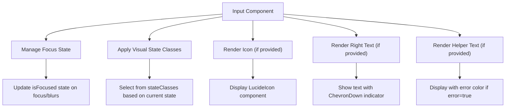
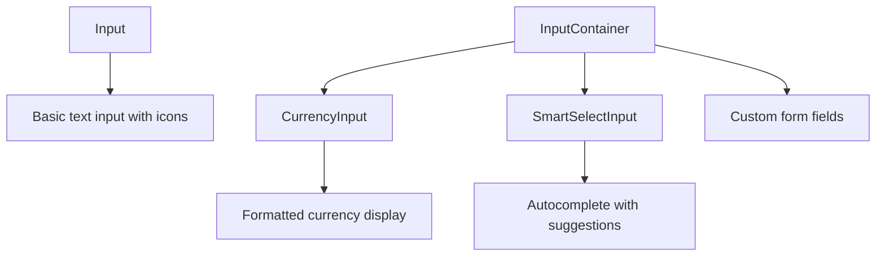

# Input Component

<cite>
**Referenced Files in This Document**   
- [Input.tsx](file://src/components/Input.tsx)
- [InputContainer.tsx](file://src/components/InputContainer.tsx)
- [CurrencyInput.tsx](file://src/components/CurrencyInput.tsx)
</cite>

## Table of Contents
1. [Introduction](#introduction)
2. [Core Functionality](#core-functionality)
3. [API Interface](#api-interface)
4. [Visual States](#visual-states)
5. [Integration Patterns](#integration-patterns)
6. [Component Relationships](#component-relationships)

## Introduction
The Input component is a reusable form input element designed for consistent styling and behavior across the Expense Tracker application. It provides a flexible interface for text input with support for icons, helper text, error states, and right-aligned text elements. The component is built with accessibility and user experience in mind, featuring visual feedback for focus and interaction states.

**Section sources**
- [Input.tsx](file://src/components/Input.tsx#L1-L79)

## Core Functionality
The Input component implements a controlled input field with enhanced visual feedback. It manages focus state internally while forwarding all standard HTML input attributes to the underlying input element. The component supports several key features:

- **Icon integration**: Left-aligned icons using Lucide React components
- **Right text display**: Text with dropdown indicator on the right side
- **Helper text**: Optional descriptive text below the input
- **Error state**: Visual indication of validation errors
- **Focus management**: Visual feedback when the input is focused

The component uses React's forwardRef to allow parent components to access the underlying input element for programmatic focus or other DOM operations.



**Diagram sources**
- [Input.tsx](file://src/components/Input.tsx#L15-L77)

**Section sources**
- [Input.tsx](file://src/components/Input.tsx#L1-L79)

## API Interface
The Input component exposes a comprehensive API through its props interface, extending standard HTML input attributes with additional custom properties.

### InputProps Interface
```typescript
export interface InputProps extends React.InputHTMLAttributes<HTMLInputElement> {
  icon?: LucideIcon;
  rightText?: string;
  helperText?: string;
  error?: boolean;
}
```

### Prop Descriptions
**icon**: LucideIcon component to display on the left side of the input. When provided, the icon is rendered using the specified Lucide icon component with predefined styling (size-4, gray-500 color).

**rightText**: String to display on the right side of the input, accompanied by a ChevronDown icon. This pattern is typically used for inputs that trigger dropdowns or selection menus.

**helperText**: Descriptive text displayed below the input field. The text color changes to red when the error prop is true, otherwise it appears in gray.

**error**: Boolean flag that enables error state styling for both the input border and helper text. When true, the input border turns red and text colors adjust accordingly.

**className**: Standard className prop that allows additional CSS classes to be applied to the outer container.

All remaining props are spread to the underlying HTML input element, supporting standard attributes like value, onChange, placeholder, disabled, etc.

```mermaid
classDiagram
class InputProps {
+icon : LucideIcon
+rightText : string
+helperText : string
+error : boolean
+className : string
+value : string
+onChange : function
+placeholder : string
+disabled : boolean
+type : string
}
class Input {
-isFocused : boolean
+handleFocus() : void
+handleBlur() : void
+currentState : string
}
InputProps <.. Input : "extends"
Input --> "stateClasses" : "uses"
```

**Diagram sources**
- [Input.tsx](file://src/components/Input.tsx#L5-L13)

**Section sources**
- [Input.tsx](file://src/components/Input.tsx#L5-L13)

## Visual States
The Input component implements a state-based visual system that changes the appearance based on user interaction and component properties. The visual states are managed through a stateClasses object that defines CSS classes for different conditions.

### State Priority Hierarchy
The component evaluates states in the following priority order:
1. **Focus**: When the input has focus (highest priority)
2. **Disabled**: When the input is disabled
3. **Error**: When the error prop is true
4. **Filled**: When the input has a value
5. **Default**: Initial state with no value

### State Definitions
**default**: Border color #D3D3D3, light gray background (#f8f8f8), gray text and placeholder

**filled**: Same as default but without placeholder text styling

**focus**: Black border, light gray background, inset shadow effect for depth

**error**: Red border (#ef4444), light gray background, red text and placeholder

**disabled**: Transparent border, light gray background, gray text with 50% opacity, not-allowed cursor

The transition between states is animated with a 300ms duration for smooth visual feedback.

```mermaid
stateDiagram-v2
[*] --> default
default --> focus : onFocus
default --> filled : value changes
default --> error : error=true
default --> disabled : disabled=true
focus --> default : onBlur
filled --> default : value cleared
error --> default : error=false
disabled --> default : disabled=false
focus --> error : error=true during focus
focus --> disabled : disabled=true during focus
```

**Diagram sources**
- [Input.tsx](file://src/components/Input.tsx#L25-L37)

**Section sources**
- [Input.tsx](file://src/components/Input.tsx#L25-L37)

## Integration Patterns
The Input component is designed to be integrated in various contexts throughout the application, often in conjunction with other form components.

### Basic Usage
```tsx
<Input 
  type="text" 
  placeholder="Enter your name" 
  value={name} 
  onChange={(e) => setName(e.target.value)} 
/>
```

### With Icon
```tsx
<Input 
  icon={UserIcon} 
  placeholder="Username" 
  value={username} 
  onChange={handleChange} 
/>
```

### With Helper Text and Error State
```tsx
<Input 
  type="email" 
  placeholder="Email address" 
  value={email} 
  onChange={handleChange} 
  helperText={emailError ? "Please enter a valid email" : "We'll never share your email"}
  error={!!emailError}
/>
```

### With Right Text (Dropdown Indicator)
```tsx
<Input 
  placeholder="Select category" 
  rightText="Category" 
  onClick={openDropdown} 
/>
```

The component is commonly used in forms throughout the application, such as in the income and expenses pages, where consistent input styling is essential for user experience.

**Section sources**
- [Input.tsx](file://src/components/Input.tsx#L39-L77)

## Component Relationships
The Input component exists within a broader ecosystem of form components in the application, with specific relationships to other input-related components.

### Relationship with InputContainer
While both components provide styled input containers, they serve different purposes:
- **Input**: Self-contained component with built-in icon, text, and state management
- **InputContainer**: Lower-level container for custom input layouts

InputContainer is used by other specialized components like CurrencyInput and SmartSelectInput, while Input provides a more opinionated, ready-to-use solution.

### Usage in CurrencyInput
The CurrencyInput component uses InputContainer rather than Input, demonstrating the component hierarchy:



**Diagram sources**
- [Input.tsx](file://src/components/Input.tsx#L1-L79)
- [InputContainer.tsx](file://src/components/InputContainer.tsx#L1-L40)
- [CurrencyInput.tsx](file://src/components/CurrencyInput.tsx#L1-L95)

**Section sources**
- [Input.tsx](file://src/components/Input.tsx#L1-L79)
- [InputContainer.tsx](file://src/components/InputContainer.tsx#L1-L40)
- [CurrencyInput.tsx](file://src/components/CurrencyInput.tsx#L1-L95)