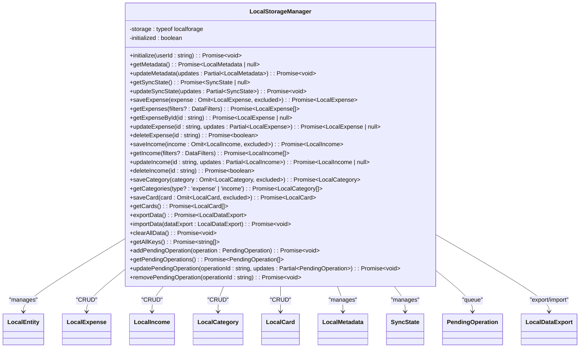

# Local Storage Management

<cite>
**Referenced Files in This Document**   
- [LocalStorageManager.ts](file://src/lib/storage/LocalStorageManager.ts#L1-L487)
- [local-storage.ts](file://src/lib/types/local-storage.ts#L1-L229)
- [useLocalFirst.ts](file://src/hooks/useLocalFirst.ts#L38-L516)
- [PerformanceOptimizer.ts](file://src/lib/optimization/PerformanceOptimizer.ts#L0-L136)
</cite>

## Table of Contents
1. [Introduction](#introduction)
2. [Project Structure](#project-structure)
3. [Core Components](#core-components)
4. [Architecture Overview](#architecture-overview)
5. [Detailed Component Analysis](#detailed-component-analysis)
6. [Dependency Analysis](#dependency-analysis)
7. [Performance Considerations](#performance-considerations)
8. [Troubleshooting Guide](#troubleshooting-guide)
9. [Conclusion](#conclusion)

## Introduction
The **LocalStorageManager** class is a central component in the Expense Tracker application's local-first architecture. It provides a robust interface for managing local data persistence using IndexedDB through the localforage library. This documentation details its purpose, initialization process, CRUD operations, data export/import functionality, and integration with the broader local-first sync system. The class ensures data integrity, supports offline operations, and facilitates seamless cloud synchronization.

## Project Structure
The LocalStorageManager is located within the `src/lib/storage/` directory, reflecting a modular architecture where storage concerns are separated from business logic and UI components. It works in conjunction with other key modules:
- **Types**: Defined in `src/lib/types/local-storage.ts`, providing TypeScript interfaces for data structures
- **Hooks**: Used in `src/hooks/useLocalFirst.ts` to expose storage functionality to React components
- **Optimization**: Integrated with `src/lib/optimization/PerformanceOptimizer.ts` for enhanced performance
- **Sync System**: Part of a larger local-first ecosystem including cloud sync and conflict detection


**Diagram sources**
- [LocalStorageManager.ts](file://src/lib/storage/LocalStorageManager.ts#L1-L487)
- [local-storage.ts](file://src/lib/types/local-storage.ts#L1-L229)
- [useLocalFirst.ts](file://src/hooks/useLocalFirst.ts#L38-L516)

**Section sources**
- [LocalStorageManager.ts](file://src/lib/storage/LocalStorageManager.ts#L1-L487)
- [local-storage.ts](file://src/lib/types/local-storage.ts#L1-L229)

## Core Components
The LocalStorageManager class serves as the primary interface for local data operations in the application. It encapsulates all interactions with the IndexedDB storage system, providing a clean API for CRUD operations, data synchronization, and storage management. Key responsibilities include:
- Initializing and maintaining the local database structure
- Managing metadata and sync state
- Performing CRUD operations on various entity types (expenses, income, categories, cards)
- Handling data export and import operations
- Supporting conflict detection through data hashing
- Maintaining pending operations queue for offline sync

The class leverages TypeScript generics and interfaces to ensure type safety across all operations, with comprehensive type definitions in the local-storage module.

**Section sources**
- [LocalStorageManager.ts](file://src/lib/storage/LocalStorageManager.ts#L1-L487)
- [local-storage.ts](file://src/lib/types/local-storage.ts#L1-L229)

## Architecture Overview
The LocalStorageManager implements a repository pattern for local data persistence, abstracting the underlying IndexedDB operations through the localforage library. It forms the foundation of the application's local-first architecture, enabling offline functionality and eventual consistency with cloud storage.


**Diagram sources**
- [LocalStorageManager.ts](file://src/lib/storage/LocalStorageManager.ts#L1-L487)
- [local-storage.ts](file://src/lib/types/local-storage.ts#L1-L229)

## Detailed Component Analysis

### LocalStorageManager Class Analysis
The LocalStorageManager class provides a comprehensive interface for local data operations using IndexedDB via the localforage abstraction. It handles all CRUD operations, data export/import, and storage management for the local-first architecture.

#### Class Diagram


**Diagram sources**
- [LocalStorageManager.ts](file://src/lib/storage/LocalStorageManager.ts#L1-L487)

#### Initialization Process
The initialization process sets up the local storage instance and ensures essential metadata and sync state are present:


**Diagram sources**
- [LocalStorageManager.ts](file://src/lib/storage/LocalStorageManager.ts#L54-L107)

**Section sources**
- [LocalStorageManager.ts](file://src/lib/storage/LocalStorageManager.ts#L54-L107)

### CRUD Operations Analysis
The LocalStorageManager provides comprehensive CRUD operations for various entity types, following a consistent pattern across all entity types.

#### Expense CRUD Operations


**Diagram sources**
- [LocalStorageManager.ts](file://src/lib/storage/LocalStorageManager.ts#L132-L200)

**Section sources**
- [LocalStorageManager.ts](file://src/lib/storage/LocalStorageManager.ts#L132-L200)

### Data Export/Import Analysis
The data export and import functionality enables backup, restore, and migration of local data.

#### Data Export/Import Flow


**Diagram sources**
- [LocalStorageManager.ts](file://src/lib/storage/LocalStorageManager.ts#L348-L400)

**Section sources**
- [LocalStorageManager.ts](file://src/lib/storage/LocalStorageManager.ts#L348-L400)

### Integration with Local-First Architecture
The LocalStorageManager integrates with the broader local-first architecture through various components.

#### Integration Flow


**Diagram sources**
- [LocalStorageManager.ts](file://src/lib/storage/LocalStorageManager.ts#L1-L487)
- [useLocalFirst.ts](file://src/hooks/useLocalFirst.ts#L38-L516)
- [PerformanceOptimizer.ts](file://src/lib/optimization/PerformanceOptimizer.ts#L90-L136)

**Section sources**
- [LocalStorageManager.ts](file://src/lib/storage/LocalStorageManager.ts#L1-L487)
- [useLocalFirst.ts](file://src/hooks/useLocalFirst.ts#L38-L516)
- [PerformanceOptimizer.ts](file://src/lib/optimization/PerformanceOptimizer.ts#L90-L136)

## Dependency Analysis
The LocalStorageManager has well-defined dependencies that support its functionality within the local-first architecture.


**Diagram sources**
- [LocalStorageManager.ts](file://src/lib/storage/LocalStorageManager.ts#L1-L487)
- [local-storage.ts](file://src/lib/types/local-storage.ts#L1-L229)
- [useLocalFirst.ts](file://src/hooks/useLocalFirst.ts#L38-L516)
- [PerformanceOptimizer.ts](file://src/lib/optimization/PerformanceOptimizer.ts#L0-L136)

**Section sources**
- [LocalStorageManager.ts](file://src/lib/storage/LocalStorageManager.ts#L1-L487)
- [local-storage.ts](file://src/lib/types/local-storage.ts#L1-L229)

## Performance Considerations
The LocalStorageManager is designed with performance in mind, leveraging several optimization strategies:

1. **Batched Operations**: The `setEntityCollection` method updates the entire collection at once, minimizing database transactions
2. **Efficient Filtering**: The `applyFilters` method uses JavaScript array methods for client-side filtering rather than database queries
3. **Minimal Writes**: The `updateLastModified` method only updates the sync state timestamp, avoiding full data writes
4. **Memory Efficiency**: Data is stored as objects with string keys, enabling fast lookups by ID
5. **Asynchronous Operations**: All methods return Promises, preventing UI blocking during storage operations

The integration with PerformanceOptimizer enables additional optimizations:
- Query caching for frequently accessed data
- Debounced updates to reduce redundant operations
- Background sync scheduling to optimize network usage
- Cleanup of completed operations to maintain performance

**Section sources**
- [LocalStorageManager.ts](file://src/lib/storage/LocalStorageManager.ts#L1-L487)
- [PerformanceOptimizer.ts](file://src/lib/optimization/PerformanceOptimizer.ts#L0-L136)

## Troubleshooting Guide
Common issues and their solutions when working with LocalStorageManager:

### Initialization Errors
**Symptom**: `Failed to initialize LocalStorageManager` error
**Causes**:
- Browser storage limitations
- Private browsing mode restrictions
- Corrupted local storage

**Solutions**:
```typescript
try {
  const storageManager = new LocalStorageManager();
  await storageManager.initialize(userId);
} catch (error) {
  console.error('Initialization failed:', error);
  // Fallback: Clear storage and retry
  await storageManager.clearAllData();
  await storageManager.initialize(userId);
}
```

### Data Sync Issues
**Symptom**: Pending operations not syncing
**Causes**:
- Network connectivity issues
- Cloud service unavailability
- Authentication token expiration

**Solutions**:
```typescript
// Check pending operations
const pending = await storageManager.getPendingOperations();
console.log(`Pending operations: ${pending.length}`);

// Force sync check
const syncState = await storageManager.getSyncState();
console.log(`Last sync: ${new Date(syncState?.lastSync || 0).toISOString()}`);
```

### Data Import Conflicts
**Symptom**: Data import fails or overwrites current data unexpectedly
**Causes**:
- Checksum validation preventing identical data import
- Schema version mismatches
- Data corruption in export file

**Solutions**:
```typescript
// Verify export data before import
const currentHash = await storageManager.getDataHash();
console.log('Current data hash:', currentHash);

// Check export file integrity
if (dataExport.checksum === currentHash) {
  console.log('Data is identical, skipping import');
} else {
  await storageManager.importData(dataExport);
}
```

### Memory Usage Concerns
**Symptom**: High memory usage or performance degradation
**Causes**:
- Large number of stored entities
- Unbounded pending operations queue
- Memory leaks in references

**Solutions**:
```typescript
// Monitor storage usage
const keys = await storageManager.getAllKeys();
console.log('Storage keys:', keys);

// Clear completed operations
const pendingOps = await storageManager.getPendingOperations();
const completed = pendingOps.filter(op => op.status === 'completed');
for (const op of completed) {
  await storageManager.removePendingOperation(op.id);
}
```

**Section sources**
- [LocalStorageManager.ts](file://src/lib/storage/LocalStorageManager.ts#L1-L487)
- [useLocalFirst.ts](file://src/hooks/useLocalFirst.ts#L475-L516)

## Conclusion
The LocalStorageManager class provides a robust foundation for local data management in the Expense Tracker application. Its comprehensive API supports all necessary CRUD operations, data export/import, and synchronization features required for a local-first architecture. The class is well-integrated with the broader system through clear interfaces and dependencies, enabling offline functionality, conflict detection, and eventual consistency with cloud storage. With proper error handling and performance optimization, it delivers a reliable user experience even in challenging network conditions.