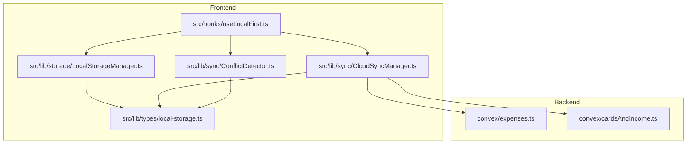
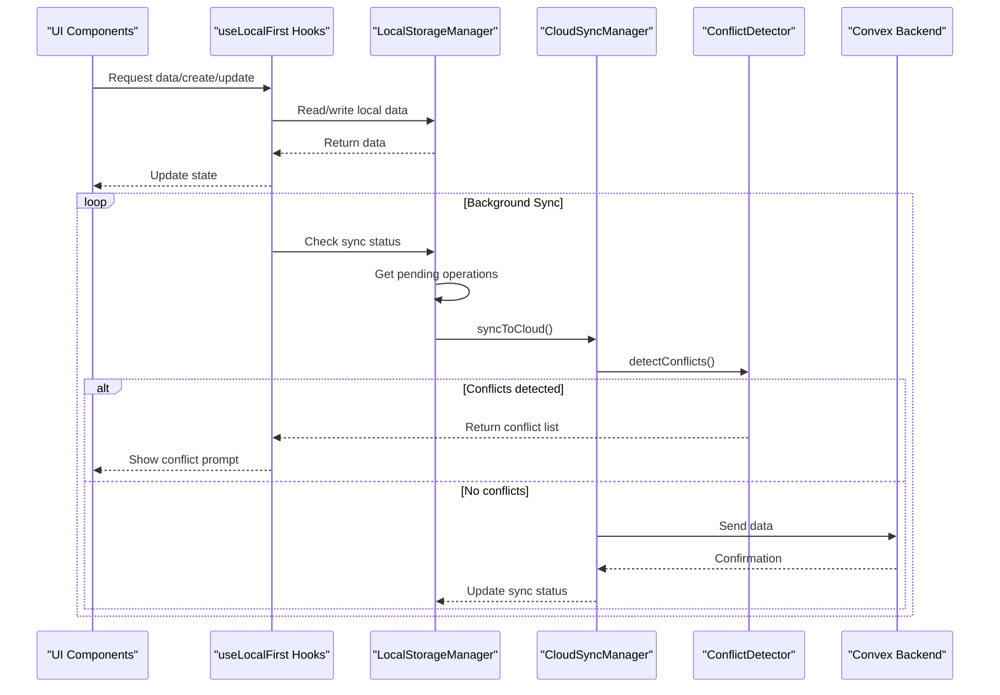
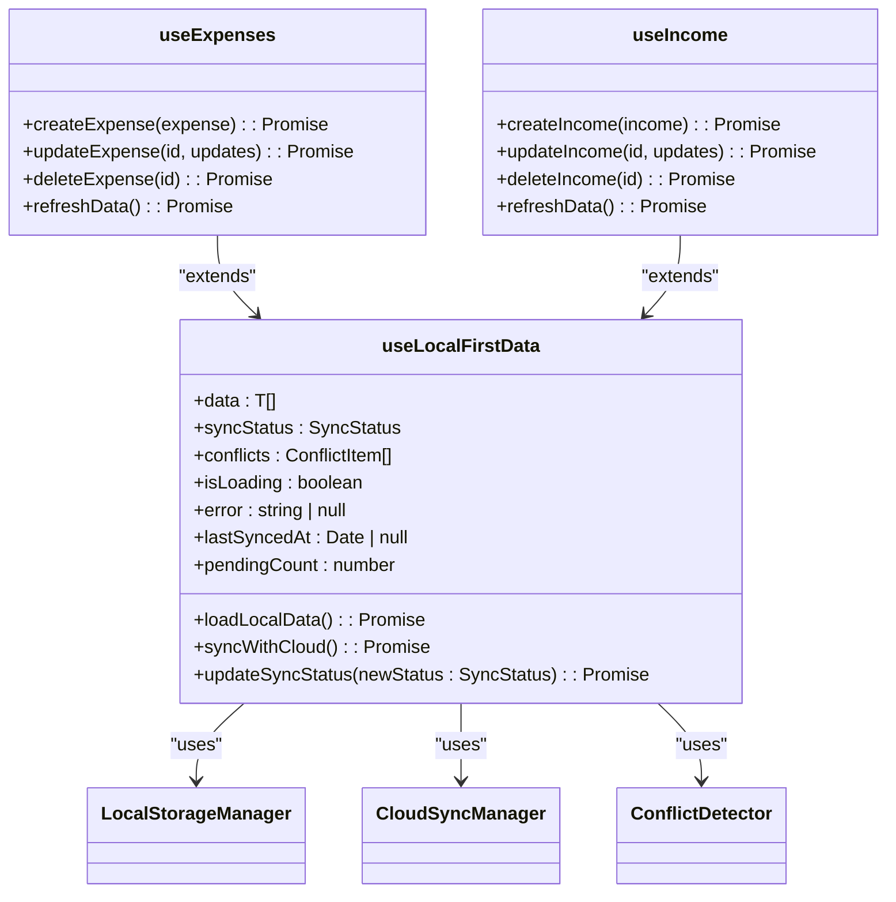
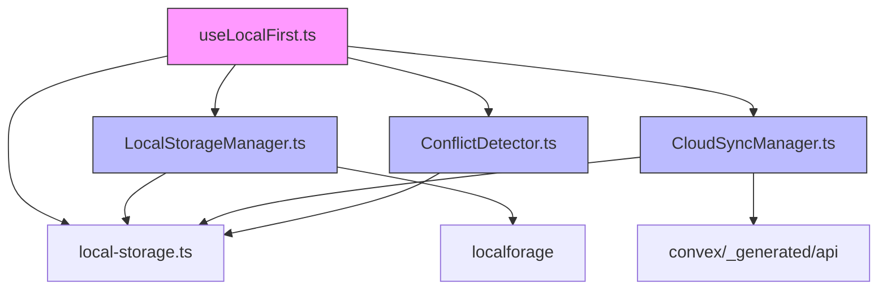

# Local-First Architecture

<cite>
**Referenced Files in This Document**   
- [useLocalFirst.ts](file://src/hooks/useLocalFirst.ts)
- [LocalStorageManager.ts](file://src/lib/storage/LocalStorageManager.ts)
- [CloudSyncManager.ts](file://src/lib/sync/CloudSyncManager.ts) - *Updated in recent commit*
- [ConflictDetector.ts](file://src/lib/sync/ConflictDetector.ts)
- [AuthContext.tsx](file://src/contexts/AuthContext.tsx) - *Updated in recent commit*
- [local-storage.ts](file://src/lib/types/local-storage.ts)
- [OfflineFirstProvider.tsx](file://src/providers/OfflineFirstProvider.tsx) - *Updated in recent commit*
</cite>

## Update Summary
**Changes Made**   
- Updated CloudSyncManager section to reflect enhanced error handling and retry mechanisms
- Added authentication error handling details in AuthContext
- Enhanced troubleshooting guide with new authentication failure scenarios
- Updated section sources to reflect modified files
- Added new error handling patterns for mutation and sync operations
- Fixed constructor parameters and type mismatches in OfflineFirstProvider
- Corrected method signatures in core local-first components

## Table of Contents
1. [Introduction](#introduction)
2. [Project Structure](#project-structure)
3. [Core Components](#core-components)
4. [Architecture Overview](#architecture-overview)
5. [Detailed Component Analysis](#detailed-component-analysis)
6. [Dependency Analysis](#dependency-analysis)
7. [Performance Considerations](#performance-considerations)
8. [Troubleshooting Guide](#troubleshooting-guide)
9. [Conclusion](#conclusion)

## Introduction
The Local-First Architecture in the Expense Tracker application enables users to interact with their financial data seamlessly, regardless of network connectivity. This architecture prioritizes local data availability, allowing full functionality offline, while automatically synchronizing changes with the cloud when online. The system handles conflict detection, data integrity, and background sync operations transparently, ensuring a reliable and responsive user experience. This document provides a comprehensive analysis of the implementation, including core components, data flow, and integration patterns.

## Project Structure
The project follows a feature-based organization with clear separation between UI components, business logic, and data management layers. The local-first functionality is primarily implemented in the `src/lib` directory, with supporting hooks in `src/hooks`. The architecture leverages Convex as the backend service for cloud synchronization.



**Diagram sources**
- [useLocalFirst.ts](file://src/hooks/useLocalFirst.ts)
- [LocalStorageManager.ts](file://src/lib/storage/LocalStorageManager.ts)
- [CloudSyncManager.ts](file://src/lib/sync/CloudSyncManager.ts)

**Section sources**
- [useLocalFirst.ts](file://src/hooks/useLocalFirst.ts)
- [LocalStorageManager.ts](file://src/lib/storage/LocalStorageManager.ts)

## Core Components
The local-first architecture consists of four core components that work together to provide offline-first data management:

1. **useLocalFirstData**: A React hook that provides a unified interface for accessing and managing local data with automatic sync capabilities
2. **LocalStorageManager**: Handles all local data operations using IndexedDB via localforage
3. **CloudSyncManager**: Manages cloud synchronization with retry mechanisms and error handling
4. **ConflictDetector**: Detects and resolves conflicts between local and cloud data

These components work in concert to ensure data consistency, handle offline scenarios, and provide a seamless user experience.

**Section sources**   
- [useLocalFirst.ts](file://src/hooks/useLocalFirst.ts#L1-L543)
- [LocalStorageManager.ts](file://src/lib/storage/LocalStorageManager.ts#L1-L486)
- [CloudSyncManager.ts](file://src/lib/sync/CloudSyncManager.ts#L1-L662) - *Updated in recent commit*
- [ConflictDetector.ts](file://src/lib/sync/ConflictDetector.ts#L1-L490)

## Architecture Overview
The local-first architecture follows a layered pattern with clear responsibilities. Data flows from the UI through specialized hooks to local storage, with background processes handling synchronization with the cloud backend.



**Diagram sources**
- [useLocalFirst.ts](file://src/hooks/useLocalFirst.ts#L1-L543)
- [LocalStorageManager.ts](file://src/lib/storage/LocalStorageManager.ts#L1-L486)
- [CloudSyncManager.ts](file://src/lib/sync/CloudSyncManager.ts#L1-L662) - *Updated in recent commit*
- [ConflictDetector.ts](file://src/lib/sync/ConflictDetector.ts#L1-L490)

## Detailed Component Analysis

### useLocalFirst Hook Analysis
The `useLocalFirstData` hook serves as the primary interface for components to interact with local-first data. It manages state, handles data loading, and orchestrates synchronization.



**Diagram sources**
- [useLocalFirst.ts](file://src/hooks/useLocalFirst.ts#L1-L543)

**Section sources**
- [useLocalFirst.ts](file://src/hooks/useLocalFirst.ts#L1-L543)

### LocalStorageManager Analysis
The LocalStorageManager class provides a robust interface for local data persistence using IndexedDB. It handles all CRUD operations, data filtering, and storage management.

```mermaid
classDiagram
class LocalStorageManager {
-storage : typeof localforage
-initialized : boolean
+initialize(userId : string) : Promise<void>
+getMetadata() : Promise<LocalMetadata | null>
+updateMetadata(updates) : Promise<void>
+getSyncState() : Promise<SyncState | null>
+updateSyncState(updates) : Promise<void>
+saveExpense(expense) : Promise<LocalExpense>
+getExpenses(filters?) : Promise<LocalExpense[]>
+updateExpense(id, updates) : Promise<LocalExpense | null>
+deleteExpense(id) : Promise<boolean>
+saveIncome(income) : Promise<LocalIncome>
+getIncome(filters?) : Promise<LocalIncome[]>
+updateIncome(id, updates) : Promise<LocalIncome | null>
+deleteIncome(id) : Promise<boolean>
+saveCategory(category) : Promise<LocalCategory>
+getCategories(type?) : Promise<LocalCategory[]>
+saveCard(card) : Promise<LocalCard>
+getCards() : Promise<LocalCard[]>
+exportData() : Promise<LocalDataExport>
+importData(dataExport) : Promise<void>
+clearAllData() : Promise<void>
+getAllKeys() : Promise<string[]>
+addPendingOperation(operation) : Promise<void>
+getPendingOperations() : Promise<PendingOperation[]>
+updatePendingOperation(operationId, updates) : Promise<void>
+removePendingOperation(operationId) : Promise<void>
}
class LocalStorageManager {
-generateDeviceId() : string
-initializeMetadata(userId) : Promise<void>
-initializeSyncState() : Promise<void>
-getEntityCollection(entityType) : Promise<{[id : string] : T}>
-setEntityCollection(entityType, collection) : Promise<void>
-updateLastModified() : Promise<void>
-applyFilters(data, filters) : T[]
-simpleHash(str) : string
}
```

**Diagram sources**
- [LocalStorageManager.ts](file://src/lib/storage/LocalStorageManager.ts#L1-L486)

**Section sources**
- [LocalStorageManager.ts](file://src/lib/storage/LocalStorageManager.ts#L1-L486)

### CloudSyncManager Analysis
The CloudSyncManager handles all cloud synchronization operations with robust error handling, retry mechanisms, and intelligent conflict detection. Recent updates have enhanced the error handling capabilities, particularly for authentication errors.

```mermaid
classDiagram
class CloudSyncManager {
-convexClient : ConvexClient
-retryPolicy : RetryPolicy
-activeSyncs : Set<string>
+syncToCloud(localData, token) : Promise<SyncResult>
+syncFromCloud(token) : Promise<CloudDataMapping>
+getCloudDataHash(token) : Promise<string>
+validateCloudData(token) : Promise<boolean>
+uploadLocalData(localData, token) : Promise<void>
+downloadCloudData(token) : Promise<CloudDataMapping>
+processQueue(operations, token) : Promise<SyncResult>
-syncExpenses(expenses, token) : Promise<{syncedCount, failedCount, errors}>
-syncIncome(income, token) : Promise<{syncedCount, failedCount, errors}>
-syncCategories(categories, token) : Promise<{syncedCount, failedCount, errors}>
-syncCards(cards, token) : Promise<{syncedCount, failedCount, errors}>
-retryWithBackoff(operation, retryCount) : Promise<T>
-calculateDelay(retryCount) : number
-sleep(ms) : Promise<void>
-isRetryableError(error) : boolean
-generateDataHash(data) : string
-processOperation(operation, token) : Promise<void>
-processExpenseOperation(operation, token) : Promise<void>
-processIncomeOperation(operation, token) : Promise<void>
-processCardOperation(operation, token) : Promise<void>
}
class RetryPolicy {
+maxRetries : number
+baseDelay : number
+maxDelay : number
+backoffFactor : number
+jitter : boolean
}
```

**Diagram sources**
- [CloudSyncManager.ts](file://src/lib/sync/CloudSyncManager.ts#L1-L662) - *Updated in recent commit*

**Section sources**
- [CloudSyncManager.ts](file://src/lib/sync/CloudSyncManager.ts#L1-L662) - *Updated in recent commit*

### ConflictDetector Analysis
The ConflictDetector provides comprehensive conflict detection capabilities for local-first data synchronization, using hash-based comparison and intelligent analysis.

```mermaid
classDiagram
class ConflictDetector {
+detectConflicts(localData, cloudData) : Promise<ConflictDetectionResult>
-checkDataIntegrity(localData, cloudData) : {hasConflicts, conflicts, type}
-detectEntityConflicts(localData, cloudData) : Promise<ConflictItem[]>
-detectEntityTypeConflicts(entityType, localEntities, cloudEntities) : ConflictItem[]
-hasDataConflict(localEntity, cloudEntity) : boolean
-normalizeEntityForComparison(entity) : any
-isAutoResolvable(localEntity, cloudEntity) : boolean
-determineSeverity(conflicts) : ConflictSeverity
-getRecommendedAction(conflictType, conflicts, localData, cloudData) : 'upload_local' | 'download_cloud' | 'manual_merge'
-countLocalRecords(localData) : number
-countCloudRecords(cloudData) : number
-validateDataHash(localHash, cloudHash) : Promise<boolean>
-generateDataHash(data) : string
+mergeData(localData, cloudData, strategy) : LocalDataExport
-convertCloudToLocalData(cloudData) : any
-mergeByTimestamp(localData, cloudData) : any
}
```

**Diagram sources**
- [ConflictDetector.ts](file://src/lib/sync/ConflictDetector.ts#L1-L490)

**Section sources**
- [ConflictDetector.ts](file://src/lib/sync/ConflictDetector.ts#L1-L490)

## Dependency Analysis
The local-first architecture components have well-defined dependencies that enable modularity and testability. The dependency graph shows a clear hierarchy from UI to storage layers.



**Diagram sources**
- [useLocalFirst.ts](file://src/hooks/useLocalFirst.ts)
- [LocalStorageManager.ts](file://src/lib/storage/LocalStorageManager.ts)
- [CloudSyncManager.ts](file://src/lib/sync/CloudSyncManager.ts) - *Updated in recent commit*
- [ConflictDetector.ts](file://src/lib/sync/ConflictDetector.ts)

**Section sources**
- [useLocalFirst.ts](file://src/hooks/useLocalFirst.ts)
- [LocalStorageManager.ts](file://src/lib/storage/LocalStorageManager.ts)
- [CloudSyncManager.ts](file://src/lib/sync/CloudSyncManager.ts) - *Updated in recent commit*
- [ConflictDetector.ts](file://src/lib/sync/ConflictDetector.ts)

## Performance Considerations
The local-first architecture is designed with performance in mind, particularly for offline scenarios:

1. **Local Data Access**: All data operations are performed locally using IndexedDB, ensuring fast response times regardless of network conditions
2. **Background Sync**: Synchronization occurs in the background with exponential backoff retry policies to handle transient network issues
3. **Data Filtering**: The LocalStorageManager supports filtered queries to minimize memory usage and improve performance
4. **Batch Operations**: Data export and import operations handle multiple records efficiently
5. **Hash-Based Conflict Detection**: Uses efficient hashing algorithms to detect data changes without transferring large amounts of data

The architecture minimizes cloud API calls by batching operations and only syncing when necessary, reducing both latency and bandwidth usage.

## Troubleshooting Guide
Common issues and their solutions in the local-first architecture:

**Section sources**
- [useLocalFirst.ts](file://src/hooks/useLocalFirst.ts#L1-L543)
- [LocalStorageManager.ts](file://src/lib/storage/LocalStorageManager.ts#L1-L486)
- [CloudSyncManager.ts](file://src/lib/sync/CloudSyncManager.ts#L1-L662) - *Updated in recent commit*
- [AuthContext.tsx](file://src/contexts/AuthContext.tsx#L43-L95) - *Updated in recent commit*

### Offline Data Not Syncing
**Symptoms**: Data remains in "pending" status even when online
**Causes**:
- Authentication token expired
- Network connectivity issues
- Cloud service unavailability

**Solutions**:
1. Check authentication status and refresh token if needed
2. Verify network connectivity using browser developer tools
3. Check Convex service status
4. Manually trigger sync using `triggerGlobalSync()` from `useSyncStatus`

### Conflict Resolution Issues
**Symptoms**: Conflicts persist or are not detected
**Causes**:
- Clock synchronization issues between devices
- Schema version mismatches
- Data corruption

**Solutions**:
1. Ensure device clocks are synchronized
2. Check schema versions in metadata
3. Use the ConflictDetector's `mergeData()` method with appropriate strategy
4. As last resort, clear local data and download from cloud

### Performance Degradation
**Symptoms**: Slow data loading or UI responsiveness
**Causes**:
- Large dataset size
- Frequent sync operations
- Inefficient data filtering

**Solutions**:
1. Implement pagination using offset and limit parameters
2. Optimize filters to reduce processed data
3. Monitor and clear old pending operations
4. Consider data archiving for historical records

### Authentication Error Handling
**Symptoms**: Session expiration during sync operations, automatic logout when token is invalid
**Causes**:
- Token invalidation on server side
- User query returning null due to expired token
- Authentication timeout during offline periods

**Solutions**:
1. Implement token refresh mechanism in AuthContext
2. Handle null user query results by clearing local token
3. Add timeout mechanism (10 seconds) for authentication queries
4. Display appropriate error messages and redirect to login page
5. Ensure offline operations are queued and synced when reauthenticated

## Conclusion
The local-first architecture in the Expense Tracker application provides a robust foundation for offline-capable applications. By prioritizing local data access and implementing intelligent synchronization, the system delivers a seamless user experience across varying network conditions. The modular design with clear separation of concerns enables maintainability and extensibility. Key strengths include automatic conflict detection, background synchronization with retry mechanisms, and comprehensive error handling. Recent enhancements to authentication error handling and token management have improved the reliability of the system. This architecture serves as a solid pattern for applications requiring reliable offline functionality with cloud backup.