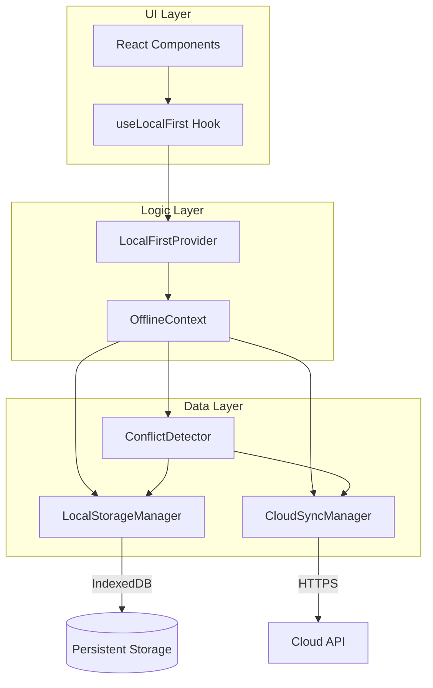
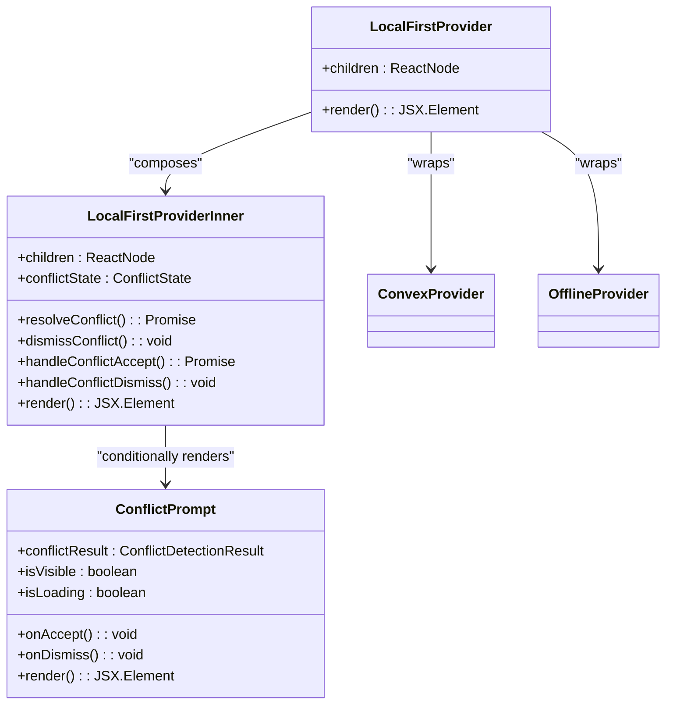
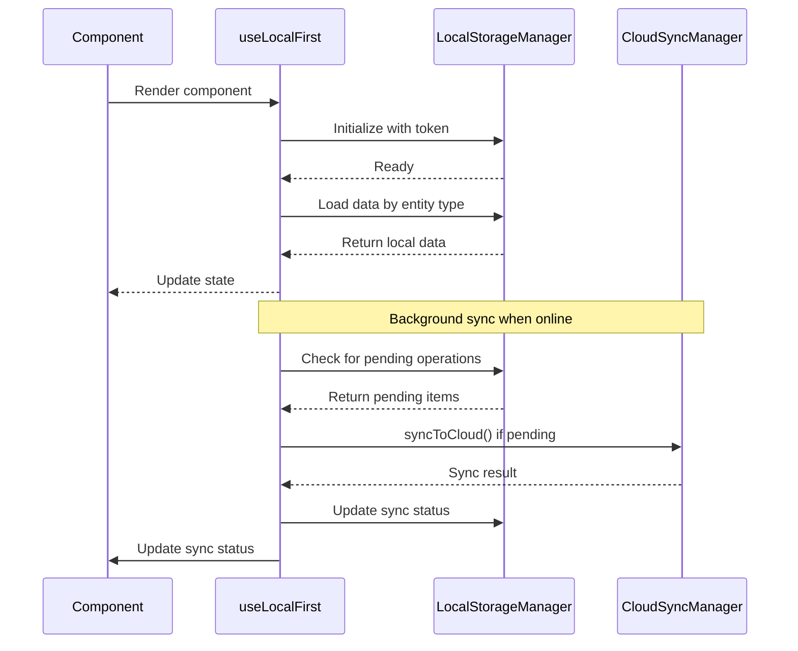
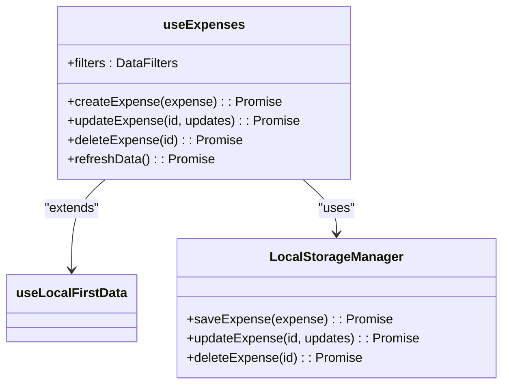
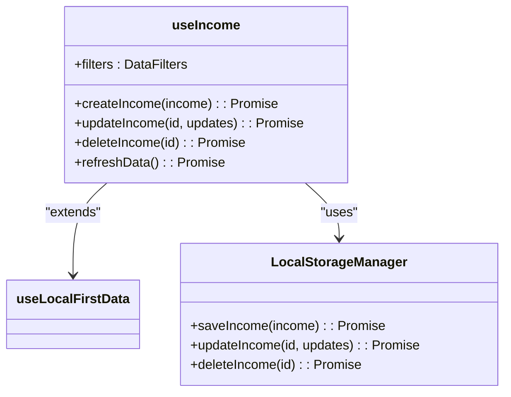
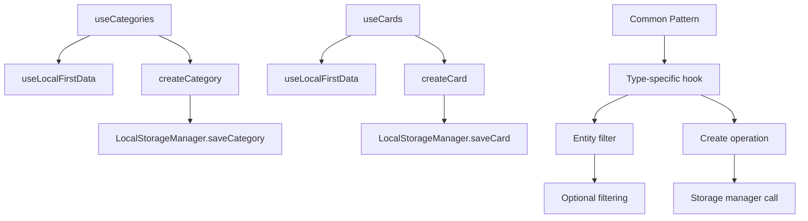
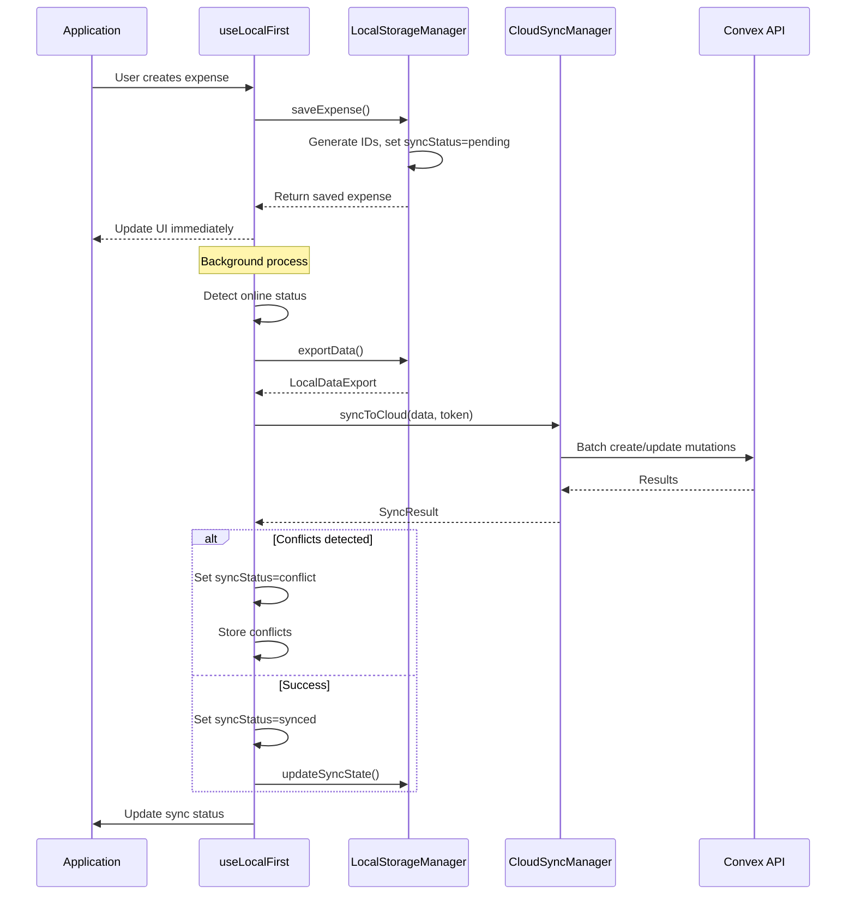
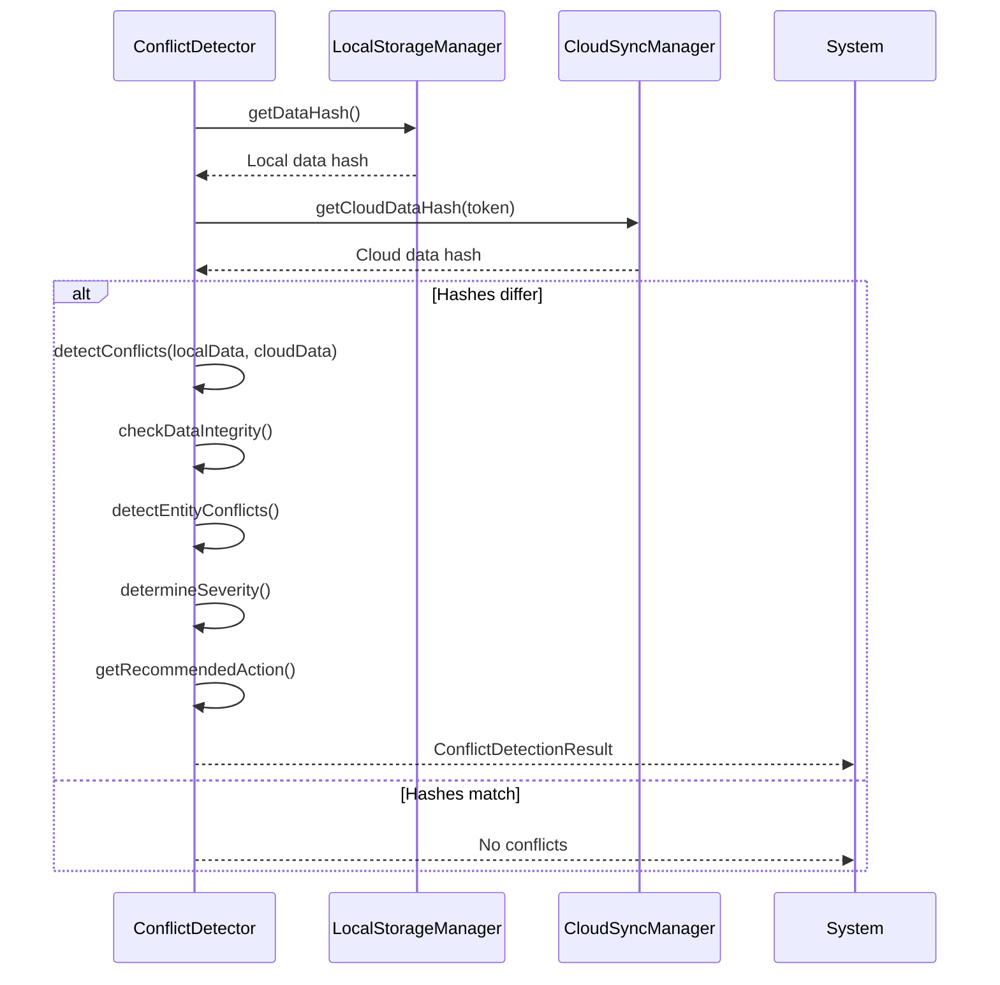
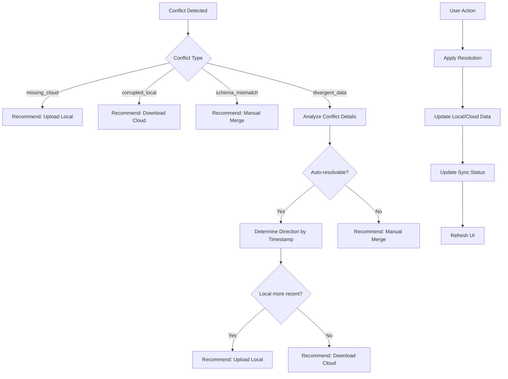

# Local-First Hooks

<cite>
**Referenced Files in This Document**   
- [useLocalFirst.ts](file://src/hooks/useLocalFirst.ts)
- [LocalFirstProvider.tsx](file://src/providers/LocalFirstProvider.tsx)
- [LocalStorageManager.ts](file://src/lib/storage/LocalStorageManager.ts)
- [CloudSyncManager.ts](file://src/lib/sync/CloudSyncManager.ts)
- [ConflictDetector.ts](file://src/lib/sync/ConflictDetector.ts)
- [OfflineContext.tsx](file://src/contexts/OfflineContext.tsx)
</cite>

## Table of Contents
1. [Introduction](#introduction)
2. [Core Architecture](#core-architecture)
3. [LocalFirstProvider Implementation](#localfirstprovider-implementation)
4. [useLocalFirst Hook Interface](#uselocalfirst-hook-interface)
5. [Entity-Specific Hooks](#entity-specific-hooks)
6. [Data Flow and Synchronization](#data-flow-and-synchronization)
7. [Conflict Detection and Resolution](#conflict-detection-and-resolution)
8. [Usage Examples](#usage-examples)
9. [Best Practices](#best-practices)

## Introduction
The Local-First Hooks system provides a comprehensive solution for building offline-capable applications with automatic cloud synchronization. This architecture enables users to interact with the application seamlessly regardless of network connectivity, ensuring data persistence and consistency across devices. The system is built around two core components: the `LocalFirstProvider` that manages global state and the `useLocalFirst` hook that provides data access and manipulation capabilities to components.

**Section sources**
- [LocalFirstProvider.tsx](file://src/providers/LocalFirstProvider.tsx#L1-L67)
- [useLocalFirst.ts](file://src/hooks/useLocalFirst.ts#L1-L544)

## Core Architecture
The local-first architecture follows a layered pattern with clear separation of concerns between data storage, synchronization logic, and UI presentation. The system leverages IndexedDB via localforage for persistent local storage, implements background synchronization with conflict detection, and provides a React-friendly interface through custom hooks.



**Diagram sources**
- [LocalFirstProvider.tsx](file://src/providers/LocalFirstProvider.tsx#L1-L67)
- [useLocalFirst.ts](file://src/hooks/useLocalFirst.ts#L1-L544)
- [LocalStorageManager.ts](file://src/lib/storage/LocalStorageManager.ts#L1-L486)
- [CloudSyncManager.ts](file://src/lib/sync/CloudSyncManager.ts#L1-L662)
- [ConflictDetector.ts](file://src/lib/sync/ConflictDetector.ts#L1-L490)

**Section sources**
- [LocalFirstProvider.tsx](file://src/providers/LocalFirstProvider.tsx#L1-L67)
- [useLocalFirst.ts](file://src/hooks/useLocalFirst.ts#L1-L544)

## LocalFirstProvider Implementation
The `LocalFirstProvider` serves as the root provider that wraps the application and manages the local-first data ecosystem. It integrates multiple context providers and handles conflict resolution UI presentation.



**Diagram sources**
- [LocalFirstProvider.tsx](file://src/providers/LocalFirstProvider.tsx#L1-L67)

**Section sources**
- [LocalFirstProvider.tsx](file://src/providers/LocalFirstProvider.tsx#L1-L67)

## useLocalFirst Hook Interface
The `useLocalFirst` hook provides a unified interface for accessing and manipulating local-first data. It exposes the current data state, synchronization status, and conflict information.

```typescript
interface LocalFirstDataResult<T> {
  data: T[];
  syncStatus: SyncStatus;
  conflicts: ConflictItem[];
  isLoading: boolean;
  error: string | null;
  lastSyncedAt: Date | null;
  pendingCount: number;
}
```

The hook manages the complete lifecycle of data operations:
- Initializes local storage managers on authentication
- Loads data from persistent storage
- Handles background synchronization
- Detects and reports conflicts
- Updates UI state accordingly



**Diagram sources**
- [useLocalFirst.ts](file://src/hooks/useLocalFirst.ts#L1-L544)
- [LocalStorageManager.ts](file://src/lib/storage/LocalStorageManager.ts#L1-L486)
- [CloudSyncManager.ts](file://src/lib/sync/CloudSyncManager.ts#L1-L662)

**Section sources**
- [useLocalFirst.ts](file://src/hooks/useLocalFirst.ts#L1-L544)

## Entity-Specific Hooks
The system provides specialized hooks for different entity types, each extending the base functionality with type-specific operations.

### useExpenses Hook
Provides CRUD operations for expense entities with automatic synchronization.



**Diagram sources**
- [useLocalFirst.ts](file://src/hooks/useLocalFirst.ts#L200-L290)
- [LocalStorageManager.ts](file://src/lib/storage/LocalStorageManager.ts#L150-L220)

### useIncome Hook
Manages income records with similar CRUD operations and synchronization.



**Diagram sources**
- [useLocalFirst.ts](file://src/hooks/useLocalFirst.ts#L292-L370)
- [LocalStorageManager.ts](file://src/lib/storage/LocalStorageManager.ts#L222-L290)

### useCategories and useCards Hooks
Provide specialized interfaces for category and card management.



**Diagram sources**
- [useLocalFirst.ts](file://src/hooks/useLocalFirst.ts#L372-L454)
- [LocalStorageManager.ts](file://src/lib/storage/LocalStorageManager.ts#L292-L370)

**Section sources**
- [useLocalFirst.ts](file://src/hooks/useLocalFirst.ts#L200-L454)

## Data Flow and Synchronization
The synchronization process follows a well-defined flow that ensures data consistency between local storage and cloud backend.



The `LocalStorageManager` handles all local data operations with the following characteristics:
- **Persistent Storage**: Uses IndexedDB via localforage for reliable storage
- **Data Structure**: Organizes data by entity type in separate collections
- **Metadata Management**: Tracks schema version, device ID, and user association
- **Sync State**: Maintains pending operations queue and last sync timestamp

**Section sources**
- [useLocalFirst.ts](file://src/hooks/useLocalFirst.ts#L1-L544)
- [LocalStorageManager.ts](file://src/lib/storage/LocalStorageManager.ts#L1-L486)
- [CloudSyncManager.ts](file://src/lib/sync/CloudSyncManager.ts#L1-L662)

## Conflict Detection and Resolution
The system implements a comprehensive conflict detection and resolution strategy to handle data inconsistencies between local and cloud storage.

### Conflict Detection Process


### Conflict Resolution Workflow
When conflicts are detected, the system presents a resolution interface and applies the chosen strategy:



The `ConflictDetector` class implements several key methods:
- **Data Integrity Checks**: Validates basic data presence and schema compatibility
- **Entity-Level Comparison**: Compares individual records across all entity types
- **Timestamp Analysis**: Uses `updatedAt` timestamps to determine data freshness
- **Automated Resolution**: Recommends actions based on conflict patterns and severity

**Diagram sources**
- [ConflictDetector.ts](file://src/lib/sync/ConflictDetector.ts#L1-L490)
- [CloudSyncManager.ts](file://src/lib/sync/CloudSyncManager.ts#L1-L662)
- [LocalStorageManager.ts](file://src/lib/storage/LocalStorageManager.ts#L1-L486)

**Section sources**
- [ConflictDetector.ts](file://src/lib/sync/ConflictDetector.ts#L1-L490)

## Usage Examples
### Basic Integration
Wrap your application with the `LocalFirstProvider` at the root level:

```tsx
// app/layout.tsx
import { LocalFirstProvider } from '../providers/LocalFirstProvider';

export default function RootLayout({
  children,
}: {
  children: React.ReactNode;
}) {
  return (
    <html>
      <body>
        <LocalFirstProvider>
          {children}
        </LocalFirstProvider>
      </body>
    </html>
  );
}
```

### Using Entity Hooks in Components
```tsx
// components/ExpenseList.tsx
import { useExpenses } from '../../hooks/useLocalFirst';

function ExpenseList() {
  const {
    data: expenses,
    isLoading,
    error,
    syncStatus,
    pendingCount,
    createExpense,
    updateExpense,
    deleteExpense
  } = useExpenses({ startDate: getMonthStart(), endDate: getMonthEnd() });

  const handleCreate = async () => {
    await createExpense({
      amount: 50.00,
      title: "Grocery Shopping",
      category: "groceries",
      date: Date.now(),
      syncStatus: "pending"
    });
  };

  if (isLoading) return <div>Loading...</div>;
  if (error) return <div>Error: {error}</div>;

  return (
    <div>
      <button onClick={handleCreate}>Add Expense</button>
      <div>Sync Status: {syncStatus} ({pendingCount} pending)</div>
      {expenses.map(expense => (
        <ExpenseCard 
          key={expense.id} 
          expense={expense}
          onUpdate={updateExpense}
          onDelete={deleteExpense}
        />
      ))}
    </div>
  );
}
```

### Handling Sync States
Monitor synchronization status to provide user feedback:

```tsx
// components/SyncIndicator.tsx
import { useSyncStatus } from '../../hooks/useLocalFirst';

function SyncIndicator() {
  const { 
    globalSyncStatus, 
    lastGlobalSync, 
    pendingOperationsCount,
    triggerGlobalSync 
  } = useSyncStatus();

  return (
    <div>
      <span>Status: {globalSyncStatus}</span>
      {lastGlobalSync && <span>Last Sync: {lastGlobalSync.toLocaleString()}</span>}
      {pendingOperationsCount > 0 && (
        <span>Pending: {pendingOperationsCount}</span>
      )}
      {globalSyncStatus === 'pending' && (
        <button onClick={triggerGlobalSync}>Sync Now</button>
      )}
    </div>
  );
}
```

**Section sources**
- [useLocalFirst.ts](file://src/hooks/useLocalFirst.ts#L1-L544)
- [LocalFirstProvider.tsx](file://src/providers/LocalFirstProvider.tsx#L1-L67)

## Best Practices
### Data Filtering
Apply filters at the hook level to optimize performance and reduce memory usage:

```typescript
// Use specific date ranges
const monthlyExpenses = useExpenses({
  startDate: startOfMonth,
  endDate: endOfMonth
});

// Filter by category
const foodExpenses = useExpenses({
  category: ['groceries', 'dining']
});

// Limit results for performance
const recentExpenses = useExpenses({
  limit: 10,
  offset: 0
});
```

### Error Handling
Implement proper error handling around data operations:

```typescript
const handleCreateExpense = async () => {
  try {
    await createExpense(expenseData);
    showSuccessToast("Expense created successfully");
  } catch (error) {
    showErrorToast(`Failed to create expense: ${error.message}`);
    // Log error to monitoring service
    console.error('Expense creation failed:', error);
  }
};
```

### Performance Optimization
- **Batch Operations**: When creating multiple records, consider implementing batch operations to reduce sync overhead
- **Selective Sync**: Use filters to sync only necessary data subsets
- **Loading States**: Always handle `isLoading` states to provide feedback during data operations
- **Conflict Awareness**: Monitor `conflicts` array and prompt users appropriately

### Offline Considerations
- **Immediate Feedback**: Update UI immediately after local operations, before sync completes
- **Pending Indicators**: Show `pendingCount` to inform users of unsynced changes
- **Retry Logic**: The system automatically retries failed sync operations when connectivity is restored
- **Data Validation**: Validate data locally before saving to prevent sync failures

**Section sources**
- [useLocalFirst.ts](file://src/hooks/useLocalFirst.ts#L1-L544)
- [LocalStorageManager.ts](file://src/lib/storage/LocalStorageManager.ts#L1-L486)