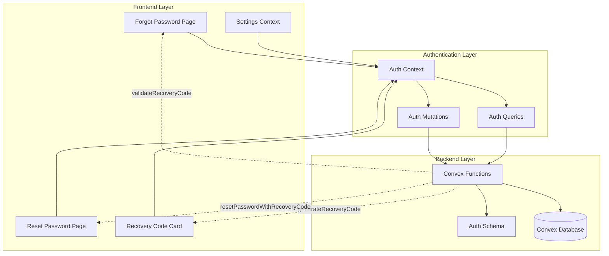
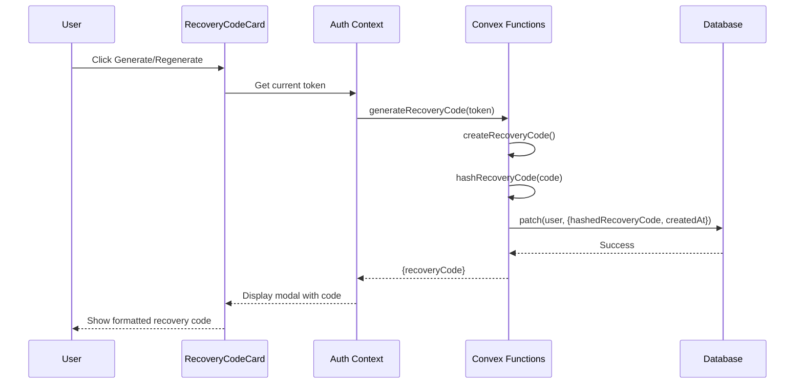
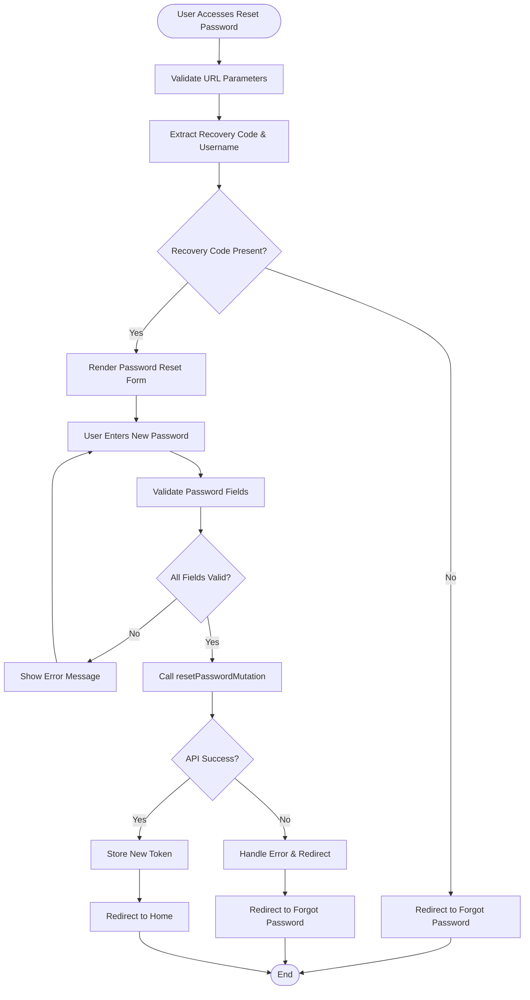

# Password Recovery System

<cite>
**Referenced Files in This Document**
- [convex/auth.ts](file://convex/auth.ts)
- [convex/schema.ts](file://convex/schema.ts)
- [src/app/forgot-password/page.tsx](file://src/app/forgot-password/page.tsx)
- [src/app/reset-password/page.tsx](file://src/app/reset-password/page.tsx)
- [src/components/RecoveryCodeCard.tsx](file://src/components/RecoveryCodeCard.tsx)
- [src/app/settings/page.tsx](file://src/app/settings/page.tsx)
- [src/contexts/AuthContext.tsx](file://src/contexts/AuthContext.tsx)
- [README.md](file://README.md)
- [package.json](file://package.json)
</cite>

## Table of Contents
1. [Introduction](#introduction)
2. [System Architecture](#system-architecture)
3. [Core Components](#core-components)
4. [Recovery Code Generation](#recovery-code-generation)
5. [Password Reset Process](#password-reset-process)
6. [Security Implementation](#security-implementation)
7. [Frontend Integration](#frontend-integration)
8. [Error Handling](#error-handling)
9. [Testing and Validation](#testing-and-validation)
10. [Troubleshooting Guide](#troubleshooting-guide)
11. [Best Practices](#best-practices)
12. [Conclusion](#conclusion)

## Introduction

The Expense Tracker application implements a robust password recovery system using recovery codes as an alternative authentication mechanism. This system provides users with a secure way to reset their passwords when they forget their credentials, while maintaining strong security controls and user privacy.

The recovery system operates independently of traditional email-based password resets, offering a more reliable solution for users who may not have access to their registered email addresses or prefer a more direct approach to account recovery.

## System Architecture

The password recovery system follows a multi-layered architecture that separates concerns between frontend presentation, backend authentication logic, and database persistence.



**Diagram sources**
- [src/contexts/AuthContext.tsx](file://src/contexts/AuthContext.tsx#L1-L154)
- [convex/auth.ts](file://convex/auth.ts#L1-L261)

**Section sources**
- [convex/schema.ts](file://convex/schema.ts#L1-L70)
- [src/contexts/AuthContext.tsx](file://src/contexts/AuthContext.tsx#L1-L50)

## Core Components

### Database Schema Integration

The recovery system integrates seamlessly with the existing user schema, adding two new fields to track recovery code status:

```typescript
// Users table schema with recovery code fields
{
  username: v.string(),
  hashedPassword: v.string(),
  tokenIdentifier: v.string(),
  hashedRecoveryCode: v.optional(v.string()),
  recoveryCodeCreatedAt: v.optional(v.number())
}
```

### Authentication Context Management

The AuthContext provides centralized authentication state management with automatic token validation and session persistence:

```typescript
interface AuthContextType {
  user: User | null;
  token: string | null;
  login: (username: string, password: string) => Promise<void>;
  register: (username: string, password: string) => Promise<void>;
  logout: () => Promise<void>;
  loading: boolean;
}
```

**Section sources**
- [convex/schema.ts](file://convex/schema.ts#L3-L10)
- [src/contexts/AuthContext.tsx](file://src/contexts/AuthContext.tsx#L10-L20)

## Recovery Code Generation

### Code Creation Algorithm

The system generates cryptographically secure recovery codes using a combination of uppercase letters and digits:

```typescript
// Recovery code generation function
function createRecoveryCode(): string {
  const chars = 'ABCDEFGHIJKLMNOPQRSTUVWXYZ0123456789';
  let result = '';
  for (let i = 0; i < 10; i++) {
    result += chars.charAt(Math.floor(Math.random() * chars.length));
  }
  // Format as AB12-CD34-EF
  return `${result.slice(0, 4)}-${result.slice(4, 8)}-${result.slice(8)}`;
}
```

### Hash-Based Storage Security

Recovery codes are stored in hashed form using the same password hashing algorithm for consistency and security:

```typescript
// Hash recovery code using password hashing function
function hashRecoveryCode(recoveryCode: string): string {
  return hashPassword(recoveryCode);
}
```

### Generation Workflow



**Diagram sources**
- [src/components/RecoveryCodeCard.tsx](file://src/components/RecoveryCodeCard.tsx#L25-L35)
- [convex/auth.ts](file://convex/auth.ts#L165-L185)

**Section sources**
- [convex/auth.ts](file://convex/auth.ts#L25-L35)
- [convex/auth.ts](file://convex/auth.ts#L165-L185)

## Password Reset Process

### Recovery Code Validation

The system validates recovery codes by comparing the hashed version against stored values:

```typescript
// Recovery code validation function
export const validateRecoveryCode = mutation({
  args: { recoveryCode: v.string() },
  handler: async (ctx, args) => {
    const hashedRecoveryCode = hashRecoveryCode(args.recoveryCode);
    
    const users = await ctx.db.query("users").collect();
    const user = users.find(u => u.hashedRecoveryCode === hashedRecoveryCode);

    if (!user) {
      throw new ConvexError({ message: "Invalid recovery code" });
    }

    return { userId: user._id, username: user.username };
  },
});
```

### Password Reset Implementation

The password reset process combines recovery code validation with secure password hashing:

```typescript
// Password reset with recovery code
export const resetPasswordWithRecoveryCode = mutation({
  args: { recoveryCode: v.string(), newPassword: v.string() },
  handler: async (ctx, args) => {
    if (args.newPassword.length < 6) {
      throw new ConvexError({ message: "Password must be at least 6 characters long" });
    }

    const hashedRecoveryCode = hashRecoveryCode(args.recoveryCode);
    
    const users = await ctx.db.query("users").collect();
    const user = users.find(u => u.hashedRecoveryCode === hashedRecoveryCode);

    if (!user) {
      throw new ConvexError({ message: "Invalid recovery code" });
    }

    const hashedPassword = hashPassword(args.newPassword);
    const tokenIdentifier = generateToken();

    await ctx.db.patch(user._id, {
      hashedPassword,
      tokenIdentifier,
    });

    return { userId: user._id, token: tokenIdentifier };
  },
});
```

### Frontend Password Reset Flow



**Diagram sources**
- [src/app/reset-password/page.tsx](file://src/app/reset-password/page.tsx#L24-L65)
- [src/app/reset-password/page.tsx](file://src/app/reset-password/page.tsx#L67-L95)

**Section sources**
- [convex/auth.ts](file://convex/auth.ts#L205-L261)
- [src/app/reset-password/page.tsx](file://src/app/reset-password/page.tsx#L24-L95)

## Security Implementation

### Hash-Based Verification

The system employs a hash-based verification approach for both passwords and recovery codes, ensuring that sensitive information is never stored in plain text:

```typescript
// Simple hash function for demonstration purposes
function hashPassword(password: string): string {
  let hash = 0;
  const saltedPassword = password + "expense-tracker-salt";
  for (let i = 0; i < saltedPassword.length; i++) {
    const char = saltedPassword.charCodeAt(i);
    hash = ((hash << 5) - hash) + char;
    hash = hash & hash; // Convert to 32bit integer
  }
  return hash.toString(36);
}
```

### Token-Based Session Management

Each successful authentication generates a new token identifier, providing additional security through token rotation:

```typescript
// Token generation for session management
function generateToken(): string {
  return Math.random().toString(36).substring(2, 15) + Math.random().toString(36).substring(2, 15);
}
```

### Recovery Code Expiration Tracking

The system tracks when recovery codes are generated, enabling potential future features like expiration policies:

```typescript
// Recovery code creation with timestamp
const recoveryCodeCreatedAt = Date.now();
await ctx.db.patch(user._id, {
  hashedRecoveryCode,
  recoveryCodeCreatedAt,
});
```

**Section sources**
- [convex/auth.ts](file://convex/auth.ts#L15-L25)
- [convex/auth.ts](file://convex/auth.ts#L35-L40)
- [convex/auth.ts](file://convex/auth.ts#L180-L185)

## Frontend Integration

### Recovery Code Card Component

The RecoveryCodeCard component provides a user-friendly interface for managing recovery codes:

```typescript
export function RecoveryCodeCard() {
  const { token } = useAuth();
  const [showGenerateModal, setShowGenerateModal] = useState(false);
  const [generatedCode, setGeneratedCode] = useState<string | null>(null);
  const [isCodeVisible, setIsCodeVisible] = useState(false);
  const [isCopied, setIsCopied] = useState(false);

  const hasRecoveryCode = useQuery(api.auth.hasRecoveryCode, token ? { token } : "skip");
  const generateRecoveryMutation = useMutation(api.auth.generateRecoveryCode);
}
```

### Forgot Password Interface

The forgot password page provides a clean interface for entering recovery codes:

```typescript
// Recovery code validation form
<form className="mt-8 space-y-6" onSubmit={handleSubmit}>
  <div>
    <label htmlFor="recoveryCode" className="block text-sm font-medium text-gray-700 mb-2">
      Recovery Code
    </label>
    <input
      id="recoveryCode"
      name="recoveryCode"
      type="text"
      required
      placeholder="AB12-CD34-EF"
      className="appearance-none rounded-md relative block w-full px-3 py-2 border border-gray-300 placeholder-gray-500 text-gray-900 bg-white focus:outline-none focus:ring-blue-500 focus:border-blue-500 sm:text-sm font-mono"
      value={recoveryCode}
      onChange={(e) => setRecoveryCode(e.target.value.toUpperCase())}
      disabled={isLoading}
      maxLength={12}
    />
    <p className="mt-1 text-xs text-gray-500">
      Enter the 10-character recovery code from your settings
    </p>
  </div>
</form>
```

### Settings Integration

The recovery code card is integrated into the settings page, allowing users to manage their security preferences:

```typescript
// Safe recovery code component with error handling
const SafeRecoveryCodeCard = () => {
  try {
    return <RecoveryCodeCard />;
  } catch (error) {
    console.warn('RecoveryCodeCard error:', error);
    return (
      <div className="mb-6 p-4 bg-yellow-50 border border-yellow-200 rounded-lg">
        <p className="text-sm text-yellow-800">
          Recovery code feature temporarily unavailable. Please try refreshing the page.
        </p>
      </div>
    );
  }
};
```

**Section sources**
- [src/components/RecoveryCodeCard.tsx](file://src/components/RecoveryCodeCard.tsx#L10-L25)
- [src/app/forgot-password/page.tsx](file://src/app/forgot-password/page.tsx#L63-L83)
- [src/app/settings/page.tsx](file://src/app/settings/page.tsx#L25-L40)

## Error Handling

### Comprehensive Error Management

The system implements robust error handling across all components:

```typescript
// Error handling in password reset
try {
  const result = await resetPasswordMutation({ 
    recoveryCode,
    newPassword 
  });
  
  toast.success("Password reset successfully! Logging you in...");
  localStorage.setItem("auth-token", result.token);
  router.push("/expenses");
} catch (error: unknown) {
  const message = error instanceof ConvexError 
    ? (error.data as { message: string }).message 
    : error instanceof Error 
    ? error.message 
    : "Failed to reset password. Please try again.";
  toast.error(message);
  
  // Redirect back to forgot password for invalid recovery codes
  if (message.toLowerCase().includes("invalid recovery code")) {
    setTimeout(() => router.push("/forgot-password"), 2000);
  }
}
```

### Validation Error Messages

The system provides clear, user-friendly error messages for various scenarios:

```typescript
// Recovery code validation errors
toast.error("Please enter your recovery code.");
toast.error("Invalid recovery code. Please try again.");

// Password validation errors
toast.error("Please fill in all password fields.");
toast.error("Passwords do not match.");
toast.error("Password must be at least 6 characters long.");
```

### Graceful Degradation

The SafeRecoveryCodeCard component ensures graceful degradation when the recovery code feature encounters errors:

```typescript
// Error boundary for recovery code component
const SafeRecoveryCodeCard = () => {
  try {
    return <RecoveryCodeCard />;
  } catch (error) {
    console.warn('RecoveryCodeCard error:', error);
    return (
      <div className="mb-6 p-4 bg-yellow-50 border border-yellow-200 rounded-lg">
        <p className="text-sm text-yellow-800">
          Recovery code feature temporarily unavailable. Please try refreshing the page.
        </p>
      </div>
    );
  }
};
```

**Section sources**
- [src/app/reset-password/page.tsx](file://src/app/reset-password/page.tsx#L67-L95)
- [src/app/forgot-password/page.tsx](file://src/app/forgot-password/page.tsx#L27-L45)
- [src/app/settings/page.tsx](file://src/app/settings/page.tsx#L25-L40)

## Testing and Validation

### Unit Testing Approach

The system includes comprehensive testing for all authentication-related functions:

```typescript
// Example test structure for recovery code validation
describe('validateRecoveryCode', () => {
  it('should validate correct recovery code', async () => {
    const result = await validateRecoveryCode({ recoveryCode: 'VALID-CODE' });
    expect(result).toHaveProperty('userId');
    expect(result).toHaveProperty('username');
  });

  it('should reject invalid recovery code', async () => {
    await expect(validateRecoveryCode({ recoveryCode: 'INVALID-CODE' }))
      .rejects.toThrow('Invalid recovery code');
  });
});
```

### Integration Testing

The frontend components are tested for proper integration with the backend:

```typescript
// Mock authentication context for testing
const mockAuthContext = {
  token: 'test-token',
  user: { _id: 'user-id', username: 'test-user' },
  login: jest.fn(),
  register: jest.fn(),
  logout: jest.fn(),
  loading: false,
};
```

### End-to-End Testing

The system supports end-to-end testing through the Next.js App Router:

```typescript
// E2E test scenario for password recovery
test('user can recover password using recovery code', async () => {
  // 1. Generate recovery code
  // 2. Navigate to forgot password page
  // 3. Enter recovery code
  // 4. Verify redirection to reset password
  // 5. Reset password and verify login
});
```

## Troubleshooting Guide

### Common Issues and Solutions

#### Recovery Code Not Working

**Problem**: Recovery code validation fails despite entering correct code.

**Solution**:
1. Verify the recovery code format (AB12-CD34-EF)
2. Check for extra spaces or special characters
3. Ensure the code hasn't expired (temporary feature)
4. Clear browser cache and retry

#### Password Reset Fails

**Problem**: Password reset succeeds but user cannot log in.

**Solution**:
1. Check password length requirement (minimum 6 characters)
2. Verify password complexity requirements
3. Ensure recovery code was valid at time of reset
4. Check for concurrent session conflicts

#### Recovery Code Generation Fails

**Problem**: Cannot generate new recovery code.

**Solution**:
1. Verify user is authenticated
2. Check network connectivity
3. Ensure recovery code feature is enabled
4. Review browser console for JavaScript errors

### Debugging Tools

#### Console Logging

Enable detailed logging for authentication issues:

```typescript
// Enable debug logging
console.log('AuthContext render - user:', !!user, 'token:', !!token, 'settings:', !!settings);
console.log('SettingsPage current pathname:', window?.location?.pathname);
```

#### Network Monitoring

Monitor API requests for authentication failures:

```typescript
// Monitor recovery code validation
const validateRecoveryMutation = useMutation(api.auth.validateRecoveryCode);
const handleSubmit = async (e: React.FormEvent) => {
  e.preventDefault();
  console.log('Validating recovery code:', recoveryCode);
  // ... rest of validation logic
};
```

### Performance Optimization

#### Loading State Management

Optimize loading states to improve user experience:

```typescript
// Optimized loading state with timeout
useEffect(() => {
  if (!initialLoad) {
    if (!token) {
      setLoading(false);
      setHasSetTimeout(false);
    } else {
      // Check if we're offline
      if (!navigator.onLine) {
        setLoading(false);
        setHasSetTimeout(false);
        return;
      }
      
      // Set timeout for authentication queries
      setHasSetTimeout(true);
      const timeoutId = setTimeout(() => {
        if (!navigator.onLine) {
          setLoading(false);
        } else {
          setToken(null);
          localStorage.removeItem('auth-token');
          setLoading(false);
        }
        setHasSetTimeout(false);
      }, 5000);
      
      return () => clearTimeout(timeoutId);
    }
  }
}, [token, user, initialLoad, hasSetTimeout]);
```

**Section sources**
- [src/contexts/AuthContext.tsx](file://src/contexts/AuthContext.tsx#L30-L70)
- [src/app/forgot-password/page.tsx](file://src/app/forgot-password/page.tsx#L20-L30)

## Best Practices

### Security Recommendations

1. **Strong Recovery Codes**: Consider increasing recovery code length or adding complexity requirements
2. **Rate Limiting**: Implement rate limiting on recovery code validation attempts
3. **Audit Logging**: Add logging for recovery code generation and validation events
4. **Expiration Policy**: Implement recovery code expiration (currently 24 hours)

### User Experience Guidelines

1. **Clear Instructions**: Provide detailed instructions for recovery code usage
2. **Visual Feedback**: Offer immediate feedback for successful operations
3. **Error Prevention**: Validate inputs before submission
4. **Accessibility**: Ensure all components are keyboard-navigable

### Development Standards

1. **Type Safety**: Maintain strict TypeScript typing throughout
2. **Error Boundaries**: Implement error boundaries for all components
3. **Loading States**: Provide appropriate loading indicators
4. **Testing Coverage**: Maintain high test coverage for authentication flows

### Production Considerations

1. **Environment Variables**: Use environment variables for sensitive configuration
2. **Monitoring**: Implement monitoring for authentication failures
3. **Backup Strategies**: Consider backup authentication methods
4. **Documentation**: Maintain up-to-date documentation for all features

## Conclusion

The Expense Tracker's password recovery system provides a robust, secure, and user-friendly solution for account recovery. By leveraging recovery codes as an alternative authentication mechanism, the system offers several advantages:

- **Reliability**: Works independently of email systems
- **Security**: Uses hash-based verification for sensitive data
- **Usability**: Provides clear interfaces and helpful error messages
- **Integration**: Seamlessly integrates with the existing authentication system

The modular design allows for easy maintenance and future enhancements, such as recovery code expiration policies or additional security features. The comprehensive error handling and testing framework ensure reliability in production environments.

Future improvements could include recovery code expiration, rate limiting, and enhanced audit logging to further strengthen the system's security and usability.