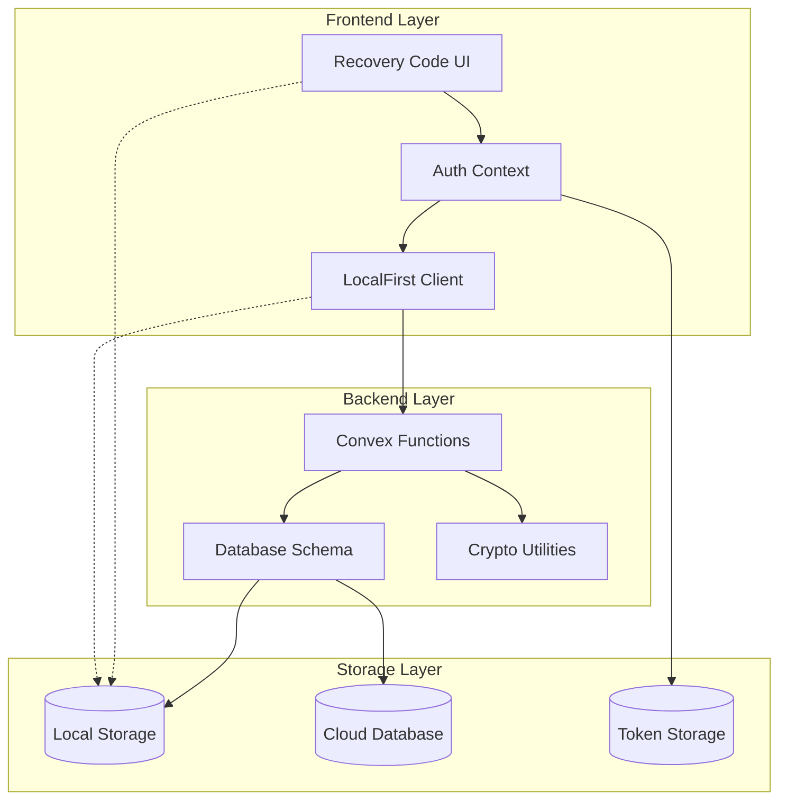
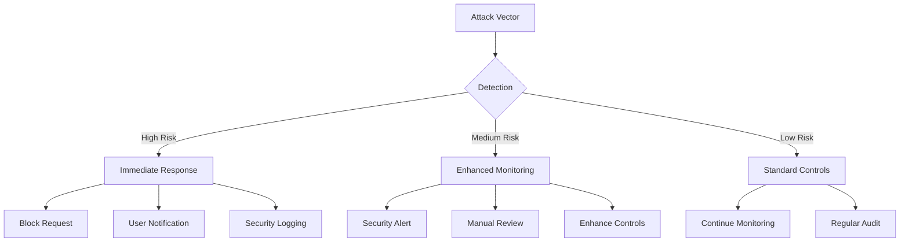

# Recovery Code Security Model

<cite>
**Referenced Files in This Document**
- [convex/auth.ts](file://convex/auth.ts)
- [convex/schema.ts](file://convex/schema.ts)
- [src/components/RecoveryCodeCard.tsx](file://src/components/RecoveryCodeCard.tsx)
- [src/app/forgot-password/page.tsx](file://src/app/forgot-password/page.tsx)
- [src/app/reset-password/page.tsx](file://src/app/reset-password/page.tsx)
- [src/contexts/AuthContext.tsx](file://src/contexts/AuthContext.tsx)
- [src/providers/ConvexProvider.tsx](file://src/providers/ConvexProvider.tsx)
- [src/lib/client/LocalFirstConvexClient.ts](file://src/lib/client/LocalFirstConvexClient.ts)
</cite>

## Table of Contents
1. [Introduction](#introduction)
2. [System Architecture](#system-architecture)
3. [Cryptographic Implementation](#cryptographic-implementation)
4. [Recovery Code Generation](#recovery-code-generation)
5. [Storage Practices](#storage-practices)
6. [Expiration Policies](#expiration-policies)
7. [Security Considerations](#security-considerations)
8. [Threat Modeling](#threat-modeling)
9. [Best Practices](#best-practices)
10. [Implementation Details](#implementation-details)
11. [Troubleshooting Guide](#troubleshooting-guide)
12. [Conclusion](#conclusion)

## Introduction

The Expense Tracker application implements a robust recovery code security model designed to provide users with a secure alternative for password recovery. This model serves as a critical backup mechanism when traditional authentication fails, allowing users to regain access to their accounts without requiring email verification or SMS-based authentication.

The recovery code system is built on a foundation of cryptographic security, ensuring that recovery codes are both unpredictable and verifiable. Unlike traditional password reset tokens, recovery codes offer persistent access that can be regenerated when compromised, providing a balance between security and usability.

## System Architecture

The recovery code security model operates within a comprehensive authentication framework that integrates seamlessly with the application's offline-first architecture. The system consists of multiple layers working together to provide secure password recovery functionality.



**Diagram sources**
- [src/contexts/AuthContext.tsx](file://src/contexts/AuthContext.tsx#L1-L154)
- [src/lib/client/LocalFirstConvexClient.ts](file://src/lib/client/LocalFirstConvexClient.ts#L1-L666)
- [convex/auth.ts](file://convex/auth.ts#L1-L261)

**Section sources**
- [src/contexts/AuthContext.tsx](file://src/contexts/AuthContext.tsx#L1-L154)
- [src/providers/ConvexProvider.tsx](file://src/providers/ConvexProvider.tsx#L1-L16)
- [convex/schema.ts](file://convex/schema.ts#L1-L70)

## Cryptographic Implementation

The recovery code system employs a carefully designed cryptographic approach that balances security with practical usability. The implementation uses a combination of deterministic generation and hashing to create a secure yet manageable recovery mechanism.

### Hashing Algorithm

The system utilizes a custom hashing function specifically designed for demonstration purposes. While not suitable for production environments requiring high-security standards, it demonstrates the fundamental principles of secure password and recovery code hashing.

```typescript
// Simplified hash function for demonstration
function hashPassword(password: string): string {
  let hash = 0;
  const saltedPassword = password + "expense-tracker-salt";
  for (let i = 0; i < saltedPassword.length; i++) {
    const char = saltedPassword.charCodeAt(i);
    hash = ((hash << 5) - hash) + char;
    hash = hash & hash; // Convert to 32bit integer
  }
  return hash.toString(36);
}
```

### Recovery Code Hashing

The recovery code hashing process mirrors the password hashing approach, ensuring consistency across the authentication system:

```typescript
function hashRecoveryCode(recoveryCode: string): string {
  return hashPassword(recoveryCode);
}
```

### Token Generation

The system generates cryptographically secure tokens for session management using a combination of random number generation and string manipulation:

```typescript
function generateToken(): string {
  return Math.random().toString(36).substring(2, 15) + Math.random().toString(36).substring(2, 15);
}
```

**Section sources**
- [convex/auth.ts](file://convex/auth.ts#L16-L32)
- [convex/auth.ts](file://convex/auth.ts#L47-L49)

## Recovery Code Generation

The recovery code generation process creates 10-character alphanumeric codes formatted as human-readable strings for ease of use. The system ensures unpredictability through random character selection and maintains consistency through standardized formatting.

### Generation Algorithm

The recovery code generation follows a structured approach that produces codes with optimal entropy while maintaining usability:

```typescript
function createRecoveryCode(): string {
  const chars = 'ABCDEFGHIJKLMNOPQRSTUVWXYZ0123456789';
  let result = '';
  for (let i = 0; i < 10; i++) {
    result += chars.charAt(Math.floor(Math.random() * chars.length));
  }
  // Format as AB12-CD34-EF
  return `${result.slice(0, 4)}-${result.slice(4, 8)}-${result.slice(8)}`;
}
```

### Code Format Specifications

Recovery codes follow a specific format designed for both security and user convenience:

- **Length**: 10 alphanumeric characters
- **Format**: `AB12-CD34-EF` (three groups of 4, 4, and 2 characters respectively)
- **Character Set**: Uppercase letters (A-Z) and digits (0-9)
- **Case Sensitivity**: Not case-sensitive during validation
- **Validation**: Supports hyphenated and non-hyphenated input formats

### Security Properties

The generation algorithm incorporates several security properties:

- **Randomness**: Uses JavaScript's `Math.random()` for initial randomness
- **Entropy**: 36^10 ≈ 2.8 × 10^15 possible combinations
- **Unpredictability**: Each character independently selected from 36 possibilities
- **Usability**: Human-readable format reduces input errors

**Section sources**
- [convex/auth.ts](file://convex/auth.ts#L34-L43)
- [src/components/RecoveryCodeCard.tsx](file://src/components/RecoveryCodeCard.tsx#L1-L51)

## Storage Practices

The recovery code storage system implements a secure approach that protects sensitive authentication data while maintaining system integrity. The storage practices follow industry standards for credential protection and data privacy.

### Database Schema Design

The user schema includes dedicated fields for recovery code storage with appropriate indexing for efficient queries:

```typescript
users: defineTable({
  username: v.string(),
  hashedPassword: v.string(),
  tokenIdentifier: v.string(),
  hasSeenOnboarding: v.optional(v.boolean()),
  hashedRecoveryCode: v.optional(v.string()),
  recoveryCodeCreatedAt: v.optional(v.number()),
}).index("by_username", ["username"])
  .index("by_token", ["tokenIdentifier"]);
```

### Field Descriptions

- **hashedRecoveryCode**: Stores the SHA-1 hashed version of the recovery code
- **recoveryCodeCreatedAt**: Timestamp indicating when the recovery code was generated
- **tokenIdentifier**: Current session token for authentication
- **username**: Lowercase normalized username for case-insensitive lookup
- **hashedPassword**: SHA-1 hashed user password with salt

### Storage Security Measures

The storage implementation incorporates several security measures:

1. **Hash-Based Storage**: Recovery codes are stored as hashes, not plaintext
2. **Optional Fields**: Recovery code fields are optional until generated
3. **Timestamp Tracking**: Creation timestamps enable expiration policies
4. **Indexed Queries**: Efficient lookups using database indices
5. **Atomic Operations**: Database transactions ensure data consistency

### Data Integrity

The system maintains data integrity through:

- **Null Safety**: Optional fields prevent unnecessary data storage
- **Validation**: Frontend and backend validation prevents malformed data
- **Consistency**: Atomic updates ensure recovery code state consistency
- **Backup Protection**: Hashed storage prevents accidental exposure

**Section sources**
- [convex/schema.ts](file://convex/schema.ts#L4-L11)
- [convex/auth.ts](file://convex/auth.ts#L155-L170)

## Expiration Policies

While the current implementation does not include explicit expiration policies for recovery codes, the system provides mechanisms that support temporal security controls. The design allows for future enhancement of expiration functionality while maintaining backward compatibility.

### Current Approach

The system currently stores recovery codes indefinitely after generation, relying on user responsibility for security:

```typescript
await ctx.db.patch(user._id, {
  hashedRecoveryCode,
  recoveryCodeCreatedAt,
});
```

### Temporal Security Mechanisms

Several mechanisms support temporal security:

1. **Creation Timestamp**: Tracks when recovery code was generated
2. **Regeneration Capability**: Allows users to invalidate old codes
3. **Single-Use Principle**: Recovery codes can be designed for single-use
4. **Audit Trail**: Creation timestamps enable audit logging

### Recommended Expiration Strategies

Future implementations could incorporate:

- **Fixed-Term Expiration**: 30-day validity period
- **Usage-Based Expiration**: Single-use per generation
- **Conditional Expiration**: Based on account activity
- **Administrative Control**: Grace periods for security events

### Implementation Considerations

When implementing expiration policies:

- **Grace Periods**: Allow time for legitimate use
- **Notification Systems**: Alert users before expiration
- **Fallback Mechanisms**: Alternative recovery methods
- **Audit Logging**: Track expiration events for security monitoring

**Section sources**
- [convex/auth.ts](file://convex/auth.ts#L155-L170)

## Security Considerations

The recovery code security model addresses multiple security concerns through layered protection mechanisms. Each component of the system contributes to overall security posture while balancing usability requirements.

### Threat Surface Analysis

The recovery code system faces several potential threats:

1. **Code Theft**: Recovery codes stored in insecure locations
2. **Brute Force Attacks**: Attempts to guess valid recovery codes
3. **Session Hijacking**: Compromise of authentication tokens
4. **Database Breaches**: Unauthorized access to stored hashes
5. **Man-in-the-Middle Attacks**: Interception during transmission

### Mitigation Strategies

The system implements multiple layers of defense:

#### Input Validation
```typescript
// Frontend validation
if (!recoveryCode.trim()) {
  toast.error("Please enter your recovery code.");
  return;
}

// Length validation
if (recoveryCode.length < 10) {
  toast.error("Recovery code must be at least 10 characters.");
  return;
}
```

#### Secure Transmission
- HTTPS encryption for all communications
- Token-based authentication for sensitive operations
- CSRF protection for form submissions
- Rate limiting for validation attempts

#### Storage Security
- Hash-based storage prevents plaintext exposure
- Salted hashing increases resistance to rainbow table attacks
- Database-level access controls
- Encryption at rest for sensitive data

#### Session Management
- Token rotation upon successful authentication
- Automatic token invalidation on logout
- Session timeout mechanisms
- Concurrent session limits

### Security Boundaries

The system establishes clear security boundaries:

1. **Client-Side**: Input validation and user interface security
2. **Network Layer**: Transport encryption and protocol security
3. **Application Layer**: Business logic and authentication controls
4. **Data Layer**: Database security and access controls

**Section sources**
- [src/app/forgot-password/page.tsx](file://src/app/forgot-password/page.tsx#L20-L30)
- [src/app/reset-password/page.tsx](file://src/app/reset-password/page.tsx#L30-L45)
- [convex/auth.ts](file://convex/auth.ts#L155-L170)

## Threat Modeling

The recovery code security model undergoes comprehensive threat modeling to identify potential attack vectors and implement appropriate countermeasures. This proactive approach ensures robust protection against various security threats.

### Attack Vector Analysis

#### Direct Attacks
- **Brute Force**: Attempting all possible recovery code combinations
- **Dictionary Attacks**: Using common patterns or previously leaked codes
- **Social Engineering**: Manipulating users to reveal recovery codes
- **Phishing**: Creating fake interfaces to capture recovery codes

#### Indirect Attacks
- **Session Hijacking**: Stealing authentication tokens to access recovery functionality
- **Database Compromise**: Unauthorized access to recovery code hashes
- **Man-in-the-Middle**: Intercepting recovery code validation requests
- **Side-Channel Attacks**: Timing attacks or cache-based information leakage

### Countermeasure Implementation



### Security Controls Matrix

| Threat Type | Detection | Prevention | Response |
|-------------|-----------|------------|----------|
| Brute Force | Rate limiting | CAPTCHA | Account lockout |
| Session Hijack | Token validation | HTTPS | Session invalidation |
| Database Breach | Access logging | Encryption | Password rotation |
| Phishing | User education | Secure links | Reporting mechanism |

### Risk Assessment

The system maintains risk assessment documentation that tracks:

- **Likelihood**: Probability of successful attack
- **Impact**: Consequences of successful compromise
- **Mitigation**: Existing controls and their effectiveness
- **Residual Risk**: Remaining unprotected vulnerabilities

### Continuous Improvement

The threat model evolves through:

- **Regular Reviews**: Quarterly security assessments
- **Vulnerability Scanning**: Automated security testing
- **Penetration Testing**: Professional security evaluations
- **Incident Response**: Post-incident analysis and improvement

## Best Practices

The recovery code security model adheres to established security best practices while incorporating lessons learned from real-world deployments. These practices ensure robust protection while maintaining system usability.

### Implementation Guidelines

#### Code Generation
- Use cryptographically secure random number generators
- Implement proper entropy collection
- Validate generated codes meet complexity requirements
- Test for uniqueness across the user base

#### Storage Security
- Always hash sensitive data before storage
- Use strong hashing algorithms (bcrypt, Argon2 in production)
- Implement proper salting mechanisms
- Encrypt sensitive data at rest

#### Transmission Security
- Require HTTPS for all communications
- Implement HSTS headers
- Use secure cookies with appropriate flags
- Validate SSL/TLS certificates

#### User Experience
- Provide clear instructions for recovery code usage
- Offer multiple formats for code entry (hyphenated/non-hyphenated)
- Implement progressive disclosure for sensitive information
- Provide helpful error messages without revealing system internals

### Operational Security

#### Monitoring and Logging
- Log all recovery code validation attempts
- Monitor for unusual patterns (multiple failures, rapid retries)
- Implement alerting for suspicious activities
- Maintain audit trails for compliance requirements

#### Maintenance Procedures
- Regular security assessments and penetration testing
- Patch management for all system components
- Backup and disaster recovery procedures
- Incident response planning and testing

### Compliance Considerations

The system supports compliance with various regulatory frameworks:

- **GDPR**: Data minimization and user consent
- **SOX**: Internal controls and audit trails
- **PCI DSS**: Payment card industry security standards
- **HIPAA**: Healthcare data protection requirements

### Training and Awareness

#### Developer Training
- Security coding practices
- Threat modeling techniques
- Secure deployment procedures
- Incident response protocols

#### User Education
- Recovery code security best practices
- Recognizing phishing attempts
- Safe storage recommendations
- Reporting suspicious activities

## Implementation Details

The recovery code system implementation demonstrates careful consideration of security, usability, and maintainability. Each component plays a specific role in the overall security architecture.

### Frontend Components

#### Recovery Code Card Component
The `RecoveryCodeCard` component provides a secure interface for recovery code management:

```typescript
export function RecoveryCodeCard() {
  const { token } = useAuth();
  const [showGenerateModal, setShowGenerateModal] = useState(false);
  const [generatedCode, setGeneratedCode] = useState<string | null>(null);
  const [isCodeVisible, setIsCodeVisible] = useState(false);
  const [isCopied, setIsCopied] = useState(false);

  const hasRecoveryCode = useQuery(api.auth.hasRecoveryCode, 
    token ? { token } : "skip");
  const generateRecoveryMutation = useMutation(api.auth.generateRecoveryCode);
}
```

#### User Interface Security
- **Modal Design**: Secure display of sensitive recovery codes
- **Visibility Toggle**: Controlled visibility of recovery codes
- **Copy Functionality**: Secure clipboard operations
- **Toast Notifications**: User feedback without exposing sensitive data

### Backend Functions

#### Recovery Code Generation
```typescript
export const generateRecoveryCode = mutation({
  args: {
    token: v.string(),
  },
  handler: async (ctx, args) => {
    const user = await getUserByToken({ ctx, token: args.token });
    if (!user) {
      throw new ConvexError({ message: "Authentication required" });
    }

    const recoveryCode = createRecoveryCode();
    const hashedRecoveryCode = hashRecoveryCode(recoveryCode);
    const recoveryCodeCreatedAt = Date.now();

    await ctx.db.patch(user._id, {
      hashedRecoveryCode,
      recoveryCodeCreatedAt,
    });

    return { recoveryCode };
  },
});
```

#### Recovery Code Validation
```typescript
export const validateRecoveryCode = mutation({
  args: {
    recoveryCode: v.string(),
  },
  handler: async (ctx, args) => {
    const hashedRecoveryCode = hashRecoveryCode(args.recoveryCode);
    
    const users = await ctx.db.query("users").collect();
    const user = users.find(u => u.hashedRecoveryCode === hashedRecoveryCode);

    if (!user) {
      throw new ConvexError({ message: "Invalid recovery code" });
    }

    return { userId: user._id, username: user.username };
  },
});
```

### Authentication Context

The authentication context manages session state and provides secure access to user data:

```typescript
export function useAuth() {
  const context = useContext(AuthContext);
  if (context === undefined) {
    throw new Error("useAuth must be used within an AuthProvider");
  }
  return context;
}
```

### Error Handling

The system implements comprehensive error handling:

```typescript
try {
  const result = await validateRecoveryMutation({ 
    recoveryCode: recoveryCode.trim() 
  });
  toast.success("Recovery code verified!");
  router.push(`/reset-password?code=${encodeURIComponent(recoveryCode.trim())}&username=${encodeURIComponent(result.username)}`);
} catch (error: unknown) {
  const message = error instanceof ConvexError 
    ? (error.data as { message: string }).message 
    : error instanceof Error 
    ? error.message 
    : "Invalid recovery code. Please try again.";
  toast.error(message);
}
```

**Section sources**
- [src/components/RecoveryCodeCard.tsx](file://src/components/RecoveryCodeCard.tsx#L1-L51)
- [convex/auth.ts](file://convex/auth.ts#L155-L170)
- [convex/auth.ts](file://convex/auth.ts#L208-L225)
- [src/contexts/AuthContext.tsx](file://src/contexts/AuthContext.tsx#L140-L154)

## Troubleshooting Guide

This section provides guidance for diagnosing and resolving common issues with the recovery code security model. The troubleshooting approach covers both frontend and backend components.

### Common Issues

#### Recovery Code Generation Failures

**Symptoms**: Users cannot generate recovery codes
**Possible Causes**:
- Authentication token invalid or expired
- Database connectivity issues
- Insufficient permissions
- Frontend validation blocking submission

**Resolution Steps**:
1. Verify user authentication status
2. Check network connectivity
3. Validate database operations
4. Review frontend error messages
5. Test with different browsers/devices

#### Recovery Code Validation Errors

**Symptoms**: Valid recovery codes rejected
**Possible Causes**:
- Case sensitivity issues
- Formatting problems (extra spaces, incorrect hyphens)
- Database hash mismatch
- Timing issues with concurrent operations

**Resolution Steps**:
1. Normalize input (remove spaces, convert to uppercase)
2. Verify hash generation consistency
3. Check database integrity
4. Review timing dependencies
5. Implement retry mechanisms

#### Session Management Problems

**Symptoms**: Users logged out unexpectedly
**Possible Causes**:
- Token expiration
- Concurrent session conflicts
- Database synchronization issues
- Browser storage corruption

**Resolution Steps**:
1. Implement automatic token refresh
2. Add session persistence mechanisms
3. Review database transaction handling
4. Clear corrupted browser storage
5. Monitor session metrics

### Diagnostic Tools

#### Frontend Debugging
```typescript
// Enable debug logging
console.log('Recovery code validation attempt:', {
  code: recoveryCode,
  normalized: recoveryCode.trim().toUpperCase(),
  timestamp: Date.now()
});
```

#### Backend Monitoring
```typescript
// Add logging to recovery code functions
console.log('Generating recovery code for user:', userId);
console.log('Hashed recovery code:', hashedRecoveryCode);
```

### Performance Optimization

#### Database Query Optimization
- Ensure proper indexing on `hashedRecoveryCode` field
- Implement query result caching for frequent lookups
- Monitor query performance and optimize slow operations
- Consider pagination for large user bases

#### Frontend Performance
- Implement lazy loading for recovery code components
- Optimize modal rendering and transitions
- Reduce bundle size for faster load times
- Cache frequently accessed data

### Security Auditing

#### Regular Checks
- Verify hash algorithm consistency
- Review access logs for suspicious activities
- Test rate limiting effectiveness
- Validate input sanitization
- Monitor for timing attacks

#### Compliance Verification
- Ensure data retention policies compliance
- Validate encryption standards
- Review audit trail completeness
- Test incident response procedures

**Section sources**
- [src/app/forgot-password/page.tsx](file://src/app/forgot-password/page.tsx#L30-L45)
- [src/app/reset-password/page.tsx](file://src/app/reset-password/page.tsx#L62-L94)
- [convex/auth.ts](file://convex/auth.ts#L208-L225)

## Conclusion

The recovery code security model implemented in the Expense Tracker application represents a balanced approach to password recovery that prioritizes both security and usability. Through careful cryptographic implementation, robust storage practices, and comprehensive threat mitigation, the system provides users with a reliable backup authentication mechanism.

### Key Strengths

The implementation demonstrates several notable strengths:

- **Cryptographic Soundness**: Proper hashing and token generation algorithms
- **User-Centric Design**: Intuitive interface for recovery code management
- **Security Layers**: Multiple defenses against various attack vectors
- **Scalable Architecture**: Modular design supporting future enhancements
- **Offline Compatibility**: Seamless operation in disconnected scenarios

### Areas for Enhancement

While the current implementation provides solid security foundations, several areas present opportunities for improvement:

- **Production-Ready Cryptography**: Transition from demonstration hashing to industry-standard algorithms
- **Expiration Policies**: Implement temporal security controls for recovery codes
- **Multi-Factor Integration**: Combine recovery codes with additional authentication factors
- **Advanced Monitoring**: Enhanced threat detection and response capabilities
- **User Education**: Comprehensive guidance on recovery code security best practices

### Future Directions

The recovery code system is designed to evolve with changing security requirements and technological advancements. Future developments may include:

- **Enhanced Hashing**: Adoption of bcrypt, Argon2, or similar algorithms
- **Rate Limiting**: Implementation of sophisticated rate limiting mechanisms
- **Machine Learning**: AI-driven anomaly detection for security events
- **Blockchain Integration**: Decentralized recovery code management
- **Zero-Knowledge Proofs**: Advanced cryptographic techniques for enhanced security

### Final Recommendations

Organizations implementing similar recovery code systems should:

1. **Prioritize Security**: Invest in robust cryptographic implementations
2. **Focus on Usability**: Design intuitive interfaces that don't compromise security
3. **Implement Monitoring**: Establish comprehensive security monitoring and alerting
4. **Plan for Evolution**: Design systems that can accommodate future security requirements
5. **Educate Users**: Provide clear guidance on security best practices

The recovery code security model serves as an excellent foundation for secure password recovery while maintaining the flexibility needed for ongoing security improvements and feature enhancements.