# Synchronization Management

<cite>
**Referenced Files in This Document**   
- [CloudSyncManager.ts](file://src/lib/sync/CloudSyncManager.ts) - *Updated in recent commit*
- [ConflictDetector.ts](file://src/lib/sync/ConflictDetector.ts)
- [LocalFirstConvexClient.ts](file://src/lib/client/LocalFirstConvexClient.ts)
- [LocalStorageManager.ts](file://src/lib/storage/LocalStorageManager.ts)
- [local-storage.ts](file://src/lib/types/local-storage.ts)
- [LocalFirstProvider.tsx](file://src/providers/LocalFirstProvider.tsx)
- [OfflineContext.tsx](file://src/contexts/OfflineContext.tsx)
- [useLocalFirst.ts](file://src/hooks/useLocalFirst.ts)
</cite>

## Update Summary
**Changes Made**   
- Updated CloudSyncManager section to reflect fixed method signatures and type corrections
- Added clarification on processQueue method parameters and usage
- Updated architecture overview to reflect corrected integration patterns
- Enhanced section sources with update annotations for modified files
- Fixed outdated information about CloudSyncManager initialization and error handling

## Table of Contents
1. [Introduction](#introduction)
2. [Project Structure](#project-structure)
3. [Core Components](#core-components)
4. [Architecture Overview](#architecture-overview)
5. [Detailed Component Analysis](#detailed-component-analysis)
6. [Conflict Detection and Resolution](#conflict-detection-and-resolution)
7. [Synchronization Algorithms](#synchronization-algorithms)
8. [Integration Patterns](#integration-patterns)
9. [Performance and Error Handling](#performance-and-error-handling)
10. [Usage Examples](#usage-examples)
11. [Conclusion](#conclusion)

## Introduction

The Synchronization Management system in the Expense Tracker application implements a local-first architecture that prioritizes immediate local data operations while managing background cloud synchronization. This approach ensures responsive user experiences even in offline scenarios while maintaining data consistency across devices. The system is built around two core components: CloudSyncManager for handling cloud operations and ConflictDetector for identifying and resolving data conflicts.

The local-first design pattern allows users to create, update, and delete financial records instantly, with changes queued for cloud synchronization when connectivity is available. This document provides a comprehensive analysis of the synchronization architecture, conflict detection mechanisms, and integration patterns that enable reliable data management in both online and offline environments.

## Project Structure

The synchronization components are organized within the `src/lib/sync` directory, following a modular architecture that separates concerns between data synchronization, conflict detection, and local storage management. The system integrates with other components through well-defined interfaces and event-driven patterns.


**Diagram sources**
- [CloudSyncManager.ts](file://src/lib/sync/CloudSyncManager.ts)
- [ConflictDetector.ts](file://src/lib/sync/ConflictDetector.ts)
- [LocalStorageManager.ts](file://src/lib/storage/LocalStorageManager.ts)
- [LocalFirstConvexClient.ts](file://src/lib/client/LocalFirstConvexClient.ts)
- [LocalFirstProvider.tsx](file://src/providers/LocalFirstProvider.tsx)
- [OfflineContext.tsx](file://src/contexts/OfflineContext.tsx)
- [useLocalFirst.ts](file://src/hooks/useLocalFirst.ts)

**Section sources**
- [CloudSyncManager.ts](file://src/lib/sync/CloudSyncManager.ts)
- [ConflictDetector.ts](file://src/lib/sync/ConflictDetector.ts)
- [LocalFirstConvexClient.ts](file://src/lib/client/LocalFirstConvexClient.ts)

## Core Components

The synchronization system consists of two primary components: CloudSyncManager and ConflictDetector, which work together to ensure data consistency between local storage and cloud databases. These components are orchestrated by the LocalFirstConvexClient, which provides a unified interface for data operations.

The CloudSyncManager handles all communication with the Convex cloud database, implementing robust error handling and retry mechanisms. The ConflictDetector analyzes differences between local and cloud data states to identify potential conflicts. Together, these components enable the application to maintain data integrity while providing a responsive user experience.

**Section sources**
- [CloudSyncManager.ts](file://src/lib/sync/CloudSyncManager.ts)
- [ConflictDetector.ts](file://src/lib/sync/ConflictDetector.ts)
- [LocalFirstConvexClient.ts](file://src/lib/client/LocalFirstConvexClient.ts)

## Architecture Overview

The synchronization architecture follows a local-first design pattern where all data operations complete immediately against local storage, with cloud synchronization occurring in the background. This approach prioritizes user experience by eliminating wait times for network operations while ensuring eventual data consistency.


**Diagram sources**
- [CloudSyncManager.ts](file://src/lib/sync/CloudSyncManager.ts)
- [ConflictDetector.ts](file://src/lib/sync/ConflictDetector.ts)
- [LocalFirstConvexClient.ts](file://src/lib/client/LocalFirstConvexClient.ts)
- [LocalStorageManager.ts](file://src/lib/storage/LocalStorageManager.ts)

## Detailed Component Analysis

### CloudSyncManager Analysis

The CloudSyncManager class handles all cloud synchronization operations with robust error handling, retry mechanisms, and intelligent conflict detection. It serves as the bridge between local storage and the Convex cloud database, ensuring reliable data transfer.


**Diagram sources**
- [CloudSyncManager.ts](file://src/lib/sync/CloudSyncManager.ts#L25-L662)

**Section sources**
- [CloudSyncManager.ts](file://src/lib/sync/CloudSyncManager.ts#L25-L662) - *Updated in recent commit*

### ConflictDetector Analysis

The ConflictDetector class provides comprehensive conflict detection capabilities for local-first data synchronization. It uses hash-based comparison and intelligent analysis to identify and categorize data conflicts between local and cloud data states.


**Diagram sources**
- [ConflictDetector.ts](file://src/lib/sync/ConflictDetector.ts#L15-L490)

**Section sources**
- [ConflictDetector.ts](file://src/lib/sync/ConflictDetector.ts#L15-L490)

## Conflict Detection and Resolution

### Conflict Detection Mechanisms

The ConflictDetector implements a multi-layered approach to identify data inconsistencies between local and cloud storage. The detection process begins with basic data integrity checks and progresses to detailed entity-level comparisons.

The primary detection methods include:

1. **Data Integrity Verification**: Checks for missing or corrupted data in either local or cloud storage
2. **Schema Version Comparison**: Validates compatibility between local and cloud data schemas
3. **Entity-Level Comparison**: Compares individual records across all entity types (expenses, income, categories, cards)
4. **Hash-Based Comparison**: Uses data hashing to quickly identify differences in large datasets

The detection algorithm normalizes entity data by removing sync-specific fields (syncStatus, lastSyncedAt, etc.) before comparison, ensuring that only meaningful data differences are identified as conflicts.


**Diagram sources**
- [ConflictDetector.ts](file://src/lib/sync/ConflictDetector.ts#L30-L490)

**Section sources**
- [ConflictDetector.ts](file://src/lib/sync/ConflictDetector.ts#L30-L490)

### Conflict Resolution Workflows

The system implements an intelligent conflict resolution workflow that analyzes the nature and severity of conflicts to recommend appropriate actions. The resolution process follows these steps:

1. **Conflict Analysis**: The ConflictDetector evaluates all detected conflicts and determines their type and severity
2. **Action Recommendation**: Based on the analysis, the system recommends one of three actions:
   - `upload_local`: Replace cloud data with local data
   - `download_cloud`: Replace local data with cloud data
   - `manual_merge`: Require user intervention for complex conflicts
3. **Automated Resolution**: For simple conflicts (e.g., missing data in one location), the system can automatically resolve them
4. **User Intervention**: For complex conflicts, the system presents a resolution UI for user decision

The recommendation algorithm considers factors such as:
- Data integrity issues (missing or corrupted data)
- Schema version mismatches
- Record count differences between local and cloud
- Timestamps of last modifications
- Proportion of auto-resolvable conflicts

```mermaid
flowchart TD
Start([Conflict Detected]) --> AnalyzeType["Analyze Conflict Type"]
AnalyzeType --> MissingCloud{"Missing Cloud Data?"}
MissingCloud --> |Yes| RecommendUpload["Recommend: upload_local"]
AnalyzeType --> CorruptedLocal{"Corrupted Local Data?"}
CorruptedLocal --> |Yes| RecommendDownload["Recommend: download_cloud"]
AnalyzeType --> SchemaMismatch{"Schema Mismatch?"}
SchemaMismatch --> |Yes| RecommendManual["Recommend: manual_merge"]
AnalyzeType --> RecordComparison["Compare Record Counts"]
RecordComparison --> LocalMore{"Local Has 1.5x More Records?"}
LocalMore --> |Yes| RecommendUpload
RecordComparison --> CloudMore{"Cloud Has 1.5x More Records?"}
CloudMore --> |Yes| RecommendDownload
RecordComparison --> AutoResolvable["Check Auto-Resolvable Conflicts"]
AutoResolvable --> MajorityAuto{"≥80% Auto-Resolvable?"}
MajorityAuto --> |Yes| CompareTimestamps["Compare Last Modified"]
CompareTimestamps --> RecentLocal{"Local More Recent?"}
RecentLocal --> |Yes| RecommendUpload
RecentLocal --> |No| RecommendDownload
MajorityAuto --> |No| RecommendManual
RecommendUpload --> End
RecommendDownload --> End
RecommendManual --> End
```



**Diagram sources**
- [ConflictDetector.ts](file://src/lib/sync/ConflictDetector.ts#L200-L490)

**Section sources**
- [ConflictDetector.ts](file://src/lib/sync/ConflictDetector.ts#L200-L490)

## Synchronization Algorithms

### Cloud Synchronization Process

The CloudSyncManager implements a robust synchronization algorithm that ensures reliable data transfer between local storage and the cloud database. The process follows these steps:

1. **Operation Queuing**: All local data changes are queued as pending operations with metadata
2. **Batch Processing**: Pending operations are processed in batches when connectivity is available
3. **Retry Mechanism**: Failed operations are retried with exponential backoff and jitter
4. **Status Tracking**: Operation status is updated to reflect completion or failure
5. **Conflict Detection**: After synchronization, conflict detection is triggered to identify any data inconsistencies

The synchronization algorithm uses a per-entity approach, processing expenses, income, categories, and cards separately to isolate failures and enable partial synchronization success.


**Diagram sources**
- [CloudSyncManager.ts](file://src/lib/sync/CloudSyncManager.ts#L100-L662)

**Section sources**
- [CloudSyncManager.ts](file://src/lib/sync/CloudSyncManager.ts#L100-L662) - *Updated in recent commit*

### Retry Mechanism with Exponential Backoff

The CloudSyncManager implements a sophisticated retry mechanism that handles transient failures gracefully. The retry policy includes:

- **Exponential Backoff**: Delay between retries increases exponentially
- **Jitter**: Randomization added to prevent thundering herd problems
- **Retryable Error Detection**: Intelligent classification of retryable vs. non-retryable errors
- **Maximum Retry Limit**: Prevents infinite retry loops

The retry algorithm calculates delay using the formula: `min(baseDelay * backoffFactor^retryCount, maxDelay)` with optional jitter to distribute retry attempts.


**Diagram sources**
- [CloudSyncManager.ts](file://src/lib/sync/CloudSyncManager.ts#L550-L600)

**Section sources**
- [CloudSyncManager.ts](file://src/lib/sync/CloudSyncManager.ts#L550-L600) - *Updated in recent commit*

## Integration Patterns

### LocalFirstConvexClient Integration

The LocalFirstConvexClient serves as the primary integration point between the application and the synchronization system. It implements the local-first pattern by providing immediate local data operations with background cloud synchronization.

Key integration patterns include:

1. **Immediate Local Operations**: All data operations complete against local storage first
2. **Background Sync**: Cloud synchronization occurs in the background when online
3. **Event-Driven Architecture**: Emits events for sync status changes and conflict detection
4. **Unified API**: Provides a consistent interface for all data operations regardless of connectivity


**Diagram sources**
- [LocalFirstConvexClient.ts](file://src/lib/client/LocalFirstConvexClient.ts#L25-L665)

**Section sources**
- [LocalFirstConvexClient.ts](file://src/lib/client/LocalFirstConvexClient.ts#L25-L665)

### Provider and Context Integration

The synchronization system integrates with React's context API through the LocalFirstProvider and OfflineContext components. This enables global access to synchronization state and conflict resolution UI across the application.

The integration pattern follows these principles:

1. **Provider Hierarchy**: LocalFirstProvider wraps the application, providing access to synchronization capabilities
2. **Context Management**: OfflineContext manages synchronization state and conflict detection results
3. **UI Integration**: ConflictPrompt component displays resolution options when conflicts are detected
4. **Hook Access**: useLocalFirst hook provides access to synchronization functions


**Diagram sources**
- [LocalFirstProvider.tsx](file://src/providers/LocalFirstProvider.tsx)
- [OfflineContext.tsx](file://src/contexts/OfflineContext.tsx)
- [useLocalFirst.ts](file://src/hooks/useLocalFirst.ts)

**Section sources**
- [LocalFirstProvider.tsx](file://src/providers/LocalFirstProvider.tsx)
- [OfflineContext.tsx](file://src/contexts/OfflineContext.tsx)
- [useLocalFirst.ts](file://src/hooks/useLocalFirst.ts)

## Performance and Error Handling

### Error Classification and Handling

The synchronization system implements comprehensive error handling with intelligent classification of errors as retryable or non-retryable. This ensures that transient issues are handled gracefully while permanent errors are reported appropriately.

Retryable errors include:
- Network errors
- Rate limiting (429 status)
- Server errors (5xx status)
- Timeout errors

Non-retryable errors include:
- Authentication errors (401 status)
- Authorization errors (403 status)
- Bad request errors (400 status)


**Diagram sources**
- [CloudSyncManager.ts](file://src/lib/sync/CloudSyncManager.ts#L580-L640)

**Section sources**
- [CloudSyncManager.ts](file://src/lib/sync/CloudSyncManager.ts#L580-L640) - *Updated in recent commit*

### Performance Optimization

The system implements several performance optimizations to ensure responsive operation:

1. **Background Processing**: Synchronization occurs in the background without blocking UI
2. **Batch Operations**: Multiple pending operations are processed in batches
3. **Efficient Data Comparison**: Hash-based comparison for quick conflict detection
4. **Memory Management**: Proper cleanup of completed operations
5. **Throttled Conflict Detection**: Conflict checks occur at regular intervals rather than continuously

The LocalFirstConvexClient also implements performance optimizations such as debouncing rapid operations and intelligent sync triggering based on network and visibility changes.

## Usage Examples

### Handling Sync States

The system provides several methods for monitoring and managing synchronization states:

```typescript
// Initialize the local-first client
const client = new LocalFirstConvexClient(convexClient);
await client.initialize(userId);

// Set up event listeners
client.setEventListeners({
  onSyncStatusChange: (status) => {
    console.log('Sync status:', status);
    // Update UI with sync status
  },
  onConflictDetected: (result) => {
    console.log('Conflicts detected:', result);
    // Show conflict resolution UI
  }
});

// Check current sync status
const status = await client.getSyncStatus();
console.log('Pending operations:', status.pendingOperations);
console.log('Last sync:', status.lastSync);
console.log('Has conflicts:', status.hasConflicts);

// Force synchronization
try {
  const result = await client.forceSyncToCloud(authToken);
  if (result.success) {
    console.log('Sync completed successfully');
  } else {
    console.log('Sync failed:', result.errors);
  }
} catch (error) {
  console.error('Sync failed:', error);
}
```

**Section sources**
- [LocalFirstConvexClient.ts](file://src/lib/client/LocalFirstConvexClient.ts#L300-L400)

### Conflict Resolution Workflow

The conflict resolution workflow involves detecting conflicts, presenting options to the user, and applying the chosen resolution strategy:

```typescript
// Detect conflicts between local and cloud data
async function checkForConflicts() {
  const localData = await localStorageManager.exportData();
  const cloudData = await cloudSyncManager.syncFromCloud(authToken);
  
  const conflictResult = await conflictDetector.detectConflicts(localData, cloudData);
  
  if (conflictResult.hasConflicts) {
    // Present resolution options based on recommendation
    const action = conflictResult.recommendedAction;
    
    switch (action) {
      case 'upload_local':
        // Upload local data to cloud
        await client.uploadLocalData(authToken);
        break;
        
      case 'download_cloud':
        // Download cloud data to local
        await client.downloadCloudData(authToken);
        break;
        
      case 'manual_merge':
        // Present manual merge UI
        showConflictResolutionUI(conflictResult);
        break;
    }
  }
}

// Manual conflict resolution
async function resolveConflictManually(conflictResult: ConflictDetectionResult) {
  // User chooses resolution strategy
  const strategy = getUserResolutionStrategy();
  
  // Apply merge strategy
  const mergedData = conflictDetector.mergeData(
    localData, 
    cloudData, 
    strategy
  );
  
  // Save merged data
  await localStorageManager.importData(mergedData);
}
```

**Section sources**
- [ConflictDetector.ts](file://src/lib/sync/ConflictDetector.ts#L30-L490)
- [LocalFirstConvexClient.ts](file://src/lib/client/LocalFirstConvexClient.ts#L300-L400)

## Conclusion

The Synchronization Management system in the Expense Tracker application implements a robust local-first architecture that prioritizes user experience while ensuring data consistency across devices. The CloudSyncManager and ConflictDetector components work together to provide reliable cloud synchronization with intelligent conflict detection and resolution.

Key strengths of the system include:
- Immediate local data operations for responsive user experience
- Robust error handling with exponential backoff retry mechanisms
- Comprehensive conflict detection that identifies various conflict types
- Intelligent resolution recommendations based on conflict analysis
- Clean integration patterns through the LocalFirstConvexClient
- Event-driven architecture for real-time sync status updates

The system effectively balances the need for offline functionality with the requirement for data consistency across devices, making it well-suited for a financial tracking application where data accuracy is paramount. By implementing these synchronization patterns, the application provides a seamless user experience regardless of network connectivity status.